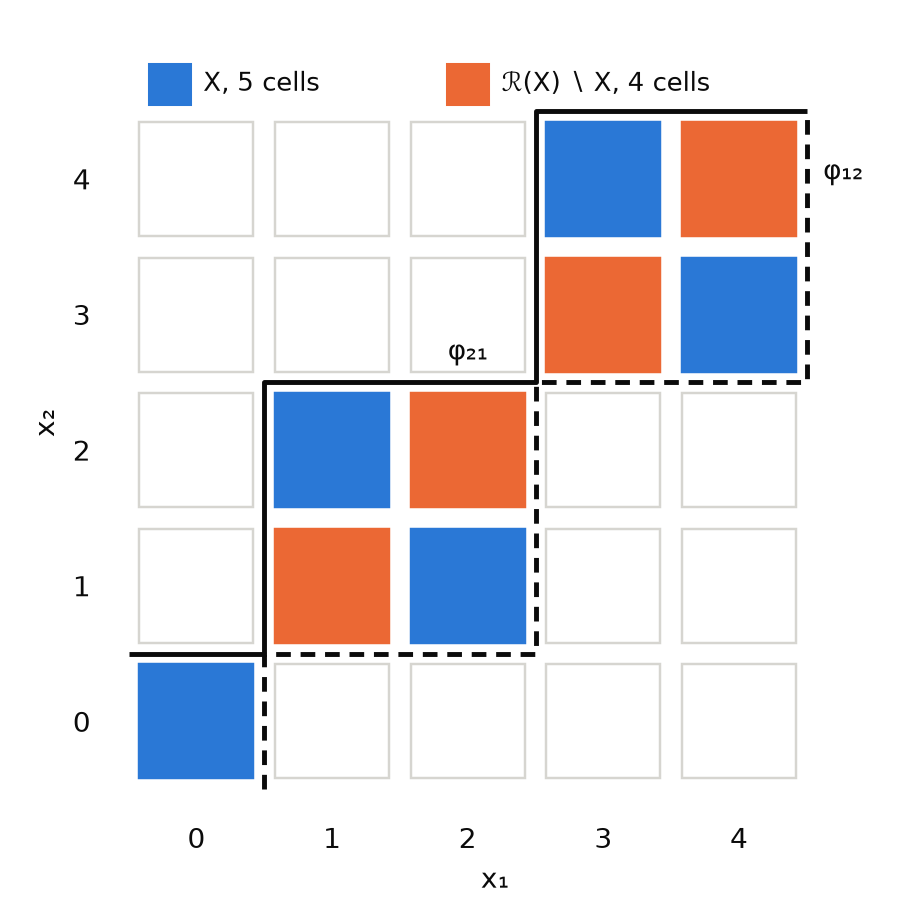
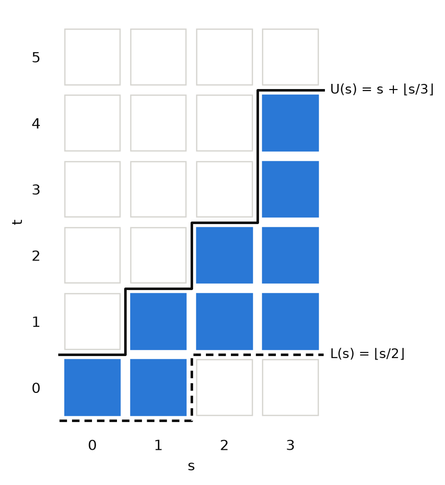
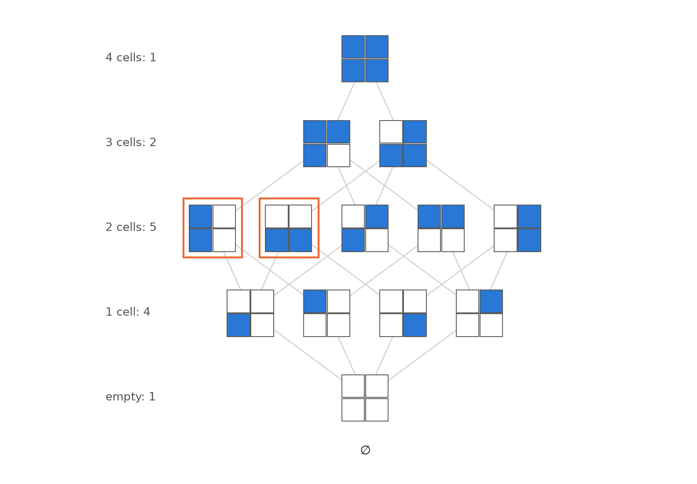
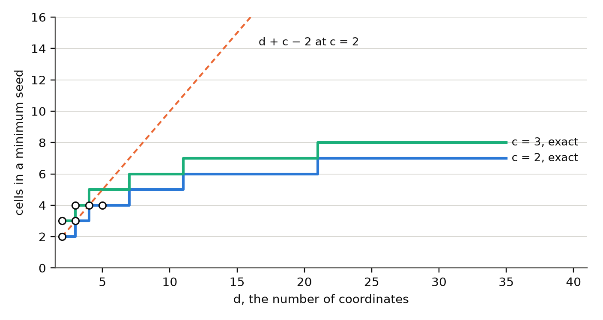

# The Closure Law of a Finite Index

**A finite set of tuples over chains determines, from its own extension alone, a smallest sublattice containing it — the staircase cut by its pairwise monotone bounds — and the number of cells that sublattice adds is a measurable defect of the index.**

**Matthew Lach** · Independent Researcher · 21 September 2026

---

## Abstract

Let `X` be a finite non-empty set of `d`-tuples whose coordinates take values in finite chains. Two things can be read off `X` without any outside knowledge: the set of values it realises at each coordinate, and, for each ordered pair of coordinates `(i, j)`, the monotone bound `φ_ij(a) = max{ y_i : y ∈ X, y_j ≤ a }`. The cells admitted by those two readings form a set `ℛ(X) ⊇ X`, and the difference `E(X) = |ℛ(X)| − |X|` is the index's **closure defect**. This paper establishes what `ℛ` is. It is a closure operator — extensive, monotone and idempotent — whose image is always a sublattice of the product of chains, and it is the *smallest* such sublattice containing `X`: `ℛ(X) = ⟨X⟩`. Consequently `X` is closed under coordinatewise minimum and maximum exactly when `E(X) = 0`, which identifies a combinatorial defect with a lattice-theoretic property. The identification rests on a classical theorem — a sublattice of a finite product of lattices is determined by its two-fold projections, the double-projection theorem of Bergman, itself a consequence of Baker and Pixley's interpolation theorem for algebras with a majority term — and the paper says exactly which step is imported and which is proved here. Six consequences follow and are developed in full: the boundary functions are the pointwise least isotone bound system representing `X`, so a closed index carries a canonical system of inequalities; the closed subsets of a fixed ambient form a Moore family whose own defect is exactly `2^|U| − |Cl(U)|`, so the family of closed indexes is itself maximally open, its own closure being the entire power set; projections of closed sets are closed and the converse fails; adjoining a derived coordinate never repairs closure, the graph of a map being closed precisely when the map is a lattice homomorphism, which excludes every coordinate difference; the bands `|a − b| ≤ k` are sublattices while the triangle region `|a − b| ≤ c ≤ a + b` is join-closed and meet-broken, with explicit witnesses; and the minimum generating set of a closed index is an exact minimum set cover, with closed-form laws for the ordered simplex and for the full box. Every decidable claim is machine-checked by an SMT solver over every subset of a named finite box, or decided exhaustively over a stated finite family: 53 machine-checked obligations, 44 exhaustive families, 6 refutations by explicit witness, and 6 results taken from the literature.

---

## §0 · The result

**A finite index has a closure, the closure is its lattice hull, and the gap between them is a number worth measuring.**

An index is a finite table: cells over `d` coordinates, each coordinate taking values in a chain. The table does not say what else could exist. But it does not say nothing, either. Two features of a table are visible without any outside knowledge — which values each coordinate takes, and how far one coordinate reaches given a bound on another — and together they admit a determinate set of further cells. Writing `ℛ(X)` for that set and `E(X) = |ℛ(X)| − |X|` for the count of cells it adds, the paper's first result (Theorem 1, Theorem 2, Theorem 3) is that this apparently ad hoc reconstruction is exactly the lattice hull:

> `ℛ` is a closure operator, `ℛ(X)` is the smallest sublattice of the ambient product containing `X`, and `E(X) = 0` if and only if `X` is closed under coordinatewise minimum and maximum.

That is the closure law. It converts a question about a table — *what does this index leave unstated?* — into a question about a lattice, and it makes `E` a computable property of a layout rather than of its subject matter. Two illustrations run through §2. The Gregorian calendar, indexed by (month, day), has `E = 7`: the seven cells are 29, 30 and 31 February and 31 April, June, September, November, and they are the content of the rhyme that has to be taught alongside the calendar. The periodic table as usually drawn, eighteen columns with the f block detached, has `E = 36`, and moving one element — helium, from group 18 to group 2 — takes that to 20. `E` is a property of a drawing, not of chemistry.

**What is proved, and what is imported.** The closure axioms (Theorem 1), the sublattice property of the image (Lemma 4), the characterisation of closed sets (Theorem 3) and all six consequences are proved here in full. The one imported step is the lift of the hull identity from `d = 2` to `d ≥ 3`. At `d = 2` this paper proves it outright, by an explicit four-witness construction (Lemma 5). Above `d = 2` it follows from the double-projection theorem — a sublattice of a finite product of lattices is determined by its two-fold projections — which is Bergman's (1977), itself a consequence of Baker and Pixley's (1975) interpolation theorem for any algebra with a majority term, of which the lattice median is one. That step is marked CITED wherever it is used and is not reproved. The property `E(X) = 0` also has a name in constraint satisfaction — global consistency of a binary network — and two certificates there: Montanari (1974), that path consistency implies global consistency for monotone constraints, and Dechter (1992), that strong `(w*+1)`-consistency on induced width `w*` gives decomposability. The constraint class that `φ` recovers is the staircase, or connected row-convex, class of Deville, Barette and Van Hentenryck (1999). **Freuder (1982) is a different theorem and is not among these**: it gives backtrack-free search on a graph of width `w` under strong `(w+1)`-consistency, which is a statement about search and not about decomposability.

**What is not established.** The hull identity is proved here only at `d = 2`; above that it rests on the cited theorem, and the machine checks cover it over the named boxes and no further. The representation requires each coordinate to be presented as a chain — not that the factors be chains, since any finite distributive factor can be so presented — as the down-sets of its poset of join-irreducibles, by Birkhoff's representation theorem (Birkhoff 1967) — but that the presentation not fold two chains into a single non-chain coordinate, because `ℛ` reconstructs coordinate by coordinate. Nothing here is a claim about infinite index sets. `E` is coordinate-relative by construction: it measures a coordinatisation, and a set of composite size can always be relabelled onto a full rectangle, which is closed. And the seed laws of §9 are exact for the two families named there and for those only; the numerical law for the full box is proved, but the general minimisation is NP-hard (Karp 1972).

**Status words.** Six are used and never merged.

| status | meaning |
|---|---|
| **PROVED** | a proof is written out below and every step is justified |
| **MACHINE-CHECKED** | an SMT solver returned `unsat` on the negation of an obligation whose variables range over *every* subset of a named finite box — or, for the integer obligations, over every integer — with both guards passed |
| **EXHAUSTIVE** | a decision procedure visited every case in a stated finite family |
| **REFUTATION** | a claim disproved by an explicit witness, re-verified |
| **CITED** | taken from the literature, with the full source |
| **SAMPLED** | a seeded pseudorandom sweep of a stated size; used below only for the two soundness guards, never for a result |

A machine-checked claim names its box; an exhaustive claim names its family. §10 names all of them.

---

## §1 · Definitions

Throughout, `d ≥ 2` is finite and `X` is a finite non-empty set of `d`-tuples — an **index**. Coordinates are written `x_i` for `1 ≤ i ≤ d`, and `π_i`, `π_ij`, `π_F` denote projection onto coordinate `i`, onto the ordered pair `(i, j)`, and onto a subset `F` of the coordinates.

**D1 (observed alphabet).** `A_i := π_i(X)`, the set of values `X` realises at coordinate `i`. Each `A_i` carries a total order inherited from its values, so each is a **finite chain**.

**D2 (box).** `Box(X) := A_1 × ⋯ × A_d`. As a product of chains it is a lattice under the coordinatewise operations

> `(x ∧ y)_i = min(x_i, y_i)`,  `(x ∨ y)_i = max(x_i, y_i)`,

and since any subset of a chain is closed under `min` and `max` of its own elements, `Box(X)` is closed under both.

**D3 (generated sublattice, or lattice hull).** `⟨X⟩` := the smallest subset of `Box(X)` containing `X` and closed under `∧` and `∨`. It exists: the intersection of any family of `∧,∨`-closed subsets is `∧,∨`-closed, and `Box(X)` is one such superset. Because `∧` and `∨` act coordinatewise, no coordinate value outside `A_i` is ever created, so `⟨X⟩ ⊆ Box(X)` as stated.

**D4 (boundary function).** For `i ≠ j` and `a ∈ A_j`,

> `φ_ij(a) := max { y_i : y ∈ X, y_j ≤ a }`.

**D5 (staircase).** `ℛ(X) := { x ∈ Box(X) : x_i ≤ φ_ij(x_j) for all i ≠ j }`.

**D6 (closed).** `X` is **closed** if `x ∧ y ∈ X` and `x ∨ y ∈ X` for all `x, y ∈ X` — that is, if `X` is a sublattice of `Box(X)`. Equivalently, of any product of chains containing it, since the operations are coordinatewise.

**D7 (closure defect).** `E(X) := |ℛ(X)| − |X|`.

**D8 (seed).** `G ⊆ X` is a **seed** of a closed index `X` if `ℛ(G) = X`. The **seed number** `seed(X)` is the least cardinality of a seed.

**The ambient regime.** Every set is read in **its own box**: `ℛ(X)` is cut out of `Box(X)`, which is determined by `X` itself. This is the regime in which D1 makes the maxima of D4 attained, and it is the regime of every statement below. The alternative — reading `X` and a superset in one declared ambient that exceeds either observed box — changes the operator and is not used here.

**Notation.** `⌊·⌋` is the floor. `C(n, k)` is the binomial coefficient. For a family `𝓕` of subsets of a finite set `U`, `𝓕` is read as an index over `U` by identifying each member with its characteristic vector in `{0,1}^U`; `Cl(U)` denotes the family of all closed subsets of the box `U`, the empty set included.

---

## §2 · The defect

The two readings of D1 and D4 are the whole of the reconstruction, and nothing else enters it. `ℛ(X)` is what a reader could rebuild from the cells alone.

**Lemma 1 (`φ` is total and isotone).** For every `i ≠ j` and `a ∈ A_j`, `φ_ij(a)` is defined; and `a ≤ a'` in `A_j` implies `φ_ij(a) ≤ φ_ij(a')`.

**Proof.** By D1 there is `y ∈ X` with `y_j = a`, so `{y ∈ X : y_j ≤ a}` is non-empty and its image under `π_i` is a non-empty finite set of values in the chain `A_i`, which therefore has a maximum. If `a ≤ a'`, the set `{y ∈ X : y_j ≤ a}` is contained in `{y ∈ X : y_j ≤ a'}`, so the maximum over the larger set is at least the maximum over the smaller. ∎ **PROVED.**

**Lemma 2 (witness form).** For `x ∈ Box(X)` and `i ≠ j`: `x_i ≤ φ_ij(x_j)` if and only if there exists `y ∈ X` with `y_j ≤ x_j` and `y_i ≥ x_i`.

**Proof.** If such a `y` exists then `φ_ij(x_j) ≥ y_i ≥ x_i`. Conversely, if `x_i ≤ φ_ij(x_j)` then, the maximum in D4 being attained (Lemma 1), some `y ∈ X` has `y_j ≤ x_j` and `y_i = φ_ij(x_j) ≥ x_i`. ∎ **PROVED.**

Lemma 2 is what makes every claim below decidable by a solver: it removes both the maximum and `φ` from the membership test, leaving a first-order formula in the membership variables of `X`.

**Proposition 1 (the defect's range).** `0 ≤ E(X) ≤ |Box(X)| − |X|`, and both bounds are attained.

**Proof.** The lower bound is extensivity (Theorem 1(i), whose proof uses nothing from this section). The upper bound is `ℛ(X) ⊆ Box(X)`, which is D5. The lower bound is attained by any closed index, for instance the ordered box below. The upper bound is attained by `X = {(0,1), (1,0)}` in a `2 × 2` box: both boundary functions are constant at 1, every constraint is vacuous, and `ℛ(X)` is all four cells, so `E(X) = 2 = 4 − 2`. ∎ **PROVED**, the witness **EXHAUSTIVE** (§9, the seed of the full box `2²`).

**Figure 1.** A five-cell index in a `5 × 5` box (blue) and the four cells its staircase adds (orange): `|ℛ(X)| = 9`, so `E(X) = 4`. The solid line is `φ₂₁`, the largest second coordinate reachable at or below a given first coordinate; the dashed line is `φ₁₂`. `ℛ(X)` is everything in the box lying under both, and by Theorem 2 it is the sublattice the five cells generate.

### Three indexes measured

**The calendar.** Take the 365 cells `(m, d)` of a common year, `m` the month in its usual order and `d` the day. Then `|ℛ(X)| = 372` and `E(X) = 7`. The seven cells `ℛ` admits and the calendar denies are

> (2, 29) · (2, 30) · (2, 31) · (4, 31) · (6, 31) · (9, 31) · (11, 31)

and they are exactly the content of the rhyme every speaker of English is taught beside the calendar. The mechanism is a single failure of monotonicity: month length is not monotone in month number, because February is short and stands second, so `φ_{day,month}` — the longest day reachable at or before month `m` — is already 31 at `m = 1` and stays there. Relabelling the months in order of length drops `E` to 0 over the same 365 cells; the relabelled calendar is self-defining and unusable. `E = 7` is the price of keeping January first.

**The periodic table.** Take the eighteen-column table with the f block set aside: 90 cells on the coordinates (period, group), helium in group 18. Then `|ℛ(X)| = 126` and `E(X) = 36`. The thirty-six are exactly the gaps in the short periods — period 1 groups 2 to 17, sixteen cells, and periods 2 and 3 groups 3 to 12, twenty cells. They are not a defect in chemistry. Period and group locate an element; they do not encode why period 1 holds two elements and period 4 holds eighteen, and that information travels alongside the table rather than in it.

The same 90 cells with helium drawn in group 2 give `E = 20`. The mechanism is visible in one boundary function: `φ_{group,period}(1)`, the largest group reachable in period 1, is 18 under the standard placement and 2 under the alternative, so the whole first row of gaps exists only under the first. Helium's position is the most argued question in periodic-table design, and `E` prices the two answers: the difference is sixteen cells.

**An ordered box.** Take the triples `(l, w, h)` with `6 ≥ l ≥ w ≥ h ≥ 1`: 56 cells, `E = 0`. The index is closed, and the reason is visible in its presentation: each of the two inequalities bounds one coordinate by a monotone function of one other, which is exactly the shape D5 cuts with, so the recovered bounds reproduce the defining ones and nothing is added. §4 makes that observation a theorem.

> **EXHAUSTIVE.** All four measurements are recomputed cell by cell: 365 cells and the seven named; 90 cells, `|ℛ| = 126`, the 36 named as two blocks; the same 90 with helium at group 2, `E = 20`; 56 cells, `E = 0`.

---

## §3 · The closure theorem

**Lemma 3 (`ℛ` moves neither the box nor the boundary).** `Box(ℛ(X)) = Box(X)`, and `φ^{ℛ(X)}_ij = φ^X_ij` on `A_j` for every `i ≠ j`.

**Proof.** `X ⊆ ℛ(X) ⊆ Box(X)` — the first inclusion is Theorem 1(i) below, whose proof does not use this lemma, and the second is D5. Applying `π_i` to the chain of inclusions gives `A_i ⊆ π_i(ℛ(X)) ⊆ A_i`, so the alphabets and hence the boxes agree. For the boundary: fix `i ≠ j` and `a ∈ A_j`. Since `X ⊆ ℛ(X)`, every candidate for `φ^X_ij(a)` is a candidate for `φ^{ℛ(X)}_ij(a)`, so `φ^X_ij(a) ≤ φ^{ℛ(X)}_ij(a)`. Conversely let `y ∈ ℛ(X)` with `y_j ≤ a`. Then `y_i ≤ φ^X_ij(y_j) ≤ φ^X_ij(a)` by D5 and Lemma 1. So every candidate contributed by `ℛ(X)` is bounded by `φ^X_ij(a)`, and the maximum is too. ∎ **PROVED.**

**Theorem 1 (`ℛ` is a closure operator).** For all finite non-empty `X, Y`:

> (i) *extensive* — `X ⊆ ℛ(X)`;
> (ii) *monotone* — `X ⊆ Y` implies `ℛ(X) ⊆ ℛ(Y)`;
> (iii) *idempotent* — `ℛ(ℛ(X)) = ℛ(X)`.

**Proof.** *(i)* Let `x ∈ X`. Then `x ∈ Box(X)` by D1, and for any `i ≠ j` the cell `x` is its own witness: `x_j ≤ x_j` and `x_i ≥ x_i`, so `φ_ij(x_j) ≥ x_i` by Lemma 2.

*(ii)* Let `X ⊆ Y` and `x ∈ ℛ(X)`. First `x ∈ Box(X) ⊆ Box(Y)`, since `π_i(X) ⊆ π_i(Y)`. Next fix `i ≠ j`. By Lemma 2 there is `y ∈ X` with `y_j ≤ x_j` and `y_i ≥ x_i`; that same `y` lies in `Y`, so `x_i ≤ φ^Y_ij(x_j)` by Lemma 2 again. Hence `x ∈ ℛ(Y)`.

*(iii)* By Lemma 3, `ℛ(X)` has the same box and the same boundary functions as `X`. D5 cuts `ℛ(ℛ(X))` out of `Box(ℛ(X)) = Box(X)` by the conditions `x_i ≤ φ^{ℛ(X)}_ij(x_j) = φ^X_ij(x_j)`, which are the conditions defining `ℛ(X)`. The two sets are cut out of the same box by the same inequalities, so they are equal. ∎ **PROVED**, and **MACHINE-CHECKED** over every subset of the boxes `3×3`, `4×4`, `2×2×2` and `3×3×3`, and **EXHAUSTIVE** over 74,569 subsets of seven boxes; (ii) additionally over all 26,206 nested pairs of four boxes.

**Lemma 4 (`ℛ(X)` is a sublattice).** `ℛ(X)` is closed under `∧` and `∨`.

**Proof.** Let `x, z ∈ ℛ(X)`. Both `x ∨ z` and `x ∧ z` lie in `Box(X)`, since each coordinate of either is one of `x_i`, `z_i`, both in `A_i`. Fix `i ≠ j`.

*Join.* Write `u = x ∨ z`. Then `u_i = max(x_i, z_i)`, which is `x_i` or `z_i`; say `u_i = x_i`. Also `u_j = max(x_j, z_j) ≥ x_j`. By Lemma 1, `φ_ij(u_j) ≥ φ_ij(x_j) ≥ x_i = u_i`.

*Meet.* Write `v = x ∧ z`. Then `v_j = min(x_j, z_j)`, which is `x_j` or `z_j`; say `v_j = x_j`. Then `φ_ij(v_j) = φ_ij(x_j) ≥ x_i ≥ min(x_i, z_i) = v_i`.

Both cases hold for every ordered pair, so `u, v ∈ ℛ(X)`. ∎ **PROVED**, and **MACHINE-CHECKED** over every subset of `3×3`, `4×4`, `2×2×2`, `3×3×3`.

The converse direction — that `ℛ(X)` is not merely *a* sublattice but the *smallest* one — is the substance. At `d = 2` it has a short constructive proof.

**Lemma 5 (the four-witness construction, `d = 2`).** Let `d = 2` and `(a, b) ∈ ℛ(X)`. Then there are four cells of `X` from which `(a, b)` is built by two joins and one meet.

**Proof.** Since `a ∈ A_1` there is `y ∈ X` with `y_1 = a`; since `b ∈ A_2` there is `z ∈ X` with `z_2 = b`. Since `b ≤ φ_21(a)` and the maximum is attained, there is `u ∈ X` with `u_1 ≤ a` and `u_2 = φ_21(a) ≥ b`. Since `a ≤ φ_12(b)` there is `w ∈ X` with `w_2 ≤ b` and `w_1 = φ_12(b) ≥ a`. Put

> `α := y ∨ u`,  `γ := z ∨ w`.

Then `α_1 = max(a, u_1) = a` because `u_1 ≤ a`, and `α_2 = max(y_2, u_2) ≥ u_2 ≥ b`. Symmetrically `γ_2 = max(b, w_2) = b` and `γ_1 = max(z_1, w_1) ≥ w_1 ≥ a`. Hence

> `α ∧ γ = ( min(a, γ_1), min(α_2, b) ) = (a, b)`.

All four of `y, u, z, w` lie in `X`. ∎ **PROVED**, and **EXHAUSTIVE**: the construction is built and verified on every one of 815,072 cells of `ℛ(X)`, over every subset `X` of a `3×3` and a `4×4` box, with 0 failures.

**Theorem 2 (`ℛ(X)` is the hull).** Let `S` be a sublattice of a finite product of chains with `X ⊆ S`. Then `ℛ(X) ⊆ S`. Consequently `ℛ(X) = ⟨X⟩`.

**Proof.** It suffices to prove `ℛ(X) ⊆ ⟨X⟩`. For if `S` is a sublattice of a product of chains with `X ⊆ S`, then `S ∩ Box(X)` is a sublattice of `Box(X)` containing `X` — an intersection of two sublattices, `Box(X)` being one — so `⟨X⟩ ⊆ S ∩ Box(X) ⊆ S` by D3. Write `T := ⟨X⟩`.

*Case `d = 2`.* Let `x ∈ ℛ(X)`. Lemma 5 exhibits `y, u, z, w ∈ X` with `x = (y ∨ u) ∧ (z ∨ w)`. All four lie in `T`, and `T` is closed under `∨` and `∧`, so `x ∈ T`.

*Case `d ≥ 3`.* Fix `x ∈ ℛ(X)`, and let `i < j` be any pair of coordinates.

> **Step 1: `π_ij(x) ∈ ℛ(π_ij X)`.** The set `π_ij(X)` is an index on two coordinates, and its own data are inherited: its observed alphabets are `A_i` and `A_j`, and its boundary functions are `φ^X_ij` and `φ^X_ji`, because the condition `y_j ≤ a` and the value `y_i` both depend on `y` only through the two coordinates kept. Now `x ∈ Box(X)` gives `π_ij(x) ∈ A_i × A_j = Box(π_ij X)`, and `x ∈ ℛ(X)` gives `x_i ≤ φ^X_ij(x_j)` and `x_j ≤ φ^X_ji(x_i)`, which are the two conditions of D5 in dimension two. So `π_ij(x) ∈ ℛ(π_ij X)`.
>
> **Step 2: `ℛ(π_ij X) ⊆ π_ij(T)`.** The image `π_ij(T)` is a sublattice of `A_i × A_j`: for `p, q ∈ T`, `π_ij(p) ∨ π_ij(q) = π_ij(p ∨ q) ∈ π_ij(T)` because the join is coordinatewise, and likewise for the meet. (§6, Theorem 8, states this for an arbitrary set of coordinates.) It contains `π_ij(X)`. So by the case `d = 2`, applied to the index `π_ij(X)` and the sublattice `π_ij(T)`, we get `ℛ(π_ij X) ⊆ π_ij(T)`. With Step 1, `π_ij(x) ∈ π_ij(T)` for every pair `i < j`.
>
> **Step 3: the lift.** `T` is a sublattice of the finite product `A_1 × ⋯ × A_d` of lattices. The lattice median `m(p, q, r) = (p ∧ q) ∨ (q ∧ r) ∨ (r ∧ p)` satisfies `m(p, p, q) = m(p, q, p) = m(q, p, p) = p`, so it is a majority term for the variety of lattices. By **Baker and Pixley's interpolation theorem (1975)** — CITED — a subalgebra of a finite product of algebras in a variety with a majority term is **2-decomposable**: it equals the set of tuples all of whose two-fold projections are two-fold projections of its members. Hence
>
> > `T = { p ∈ A_1 × ⋯ × A_d : π_ij(p) ∈ π_ij(T) for all i < j }`,
>
> and Step 2 places `x` in that set. So `x ∈ T`.

In both cases `ℛ(X) ⊆ T = ⟨X⟩`; with Lemma 4 and Theorem 1(i), `ℛ(X)` is a sublattice containing `X`, so `⟨X⟩ ⊆ ℛ(X)` and the two are equal. ∎ **PROVED at `d = 2`**; **PROVED with one CITED step at `d ≥ 3`**; **MACHINE-CHECKED** over every subset of `3×3`, `4×4`, `2×2×2`, `3×3×3` and `2×2×2×2`, the sublattice `S` quantified over as well; **EXHAUSTIVE** `ℛ(X) = ⟨X⟩` on every non-empty subset of every box of at most twelve cells among `2×2`, `3×2`, `2×2×2`, `3×3`, `4×3`, `2×2×3`, `2×2×2×2`.

**Theorem 3 (the characterisation).** `X` is closed if and only if `X = ℛ(X)` — equivalently, if and only if `E(X) = 0`.

**Proof.** If `X = ℛ(X)` then `X` is a sublattice by Lemma 4. Conversely if `X` is closed then `X` is a sublattice containing `X`, so `ℛ(X) ⊆ X` by Theorem 2; with Theorem 1(i), `X = ℛ(X)`. The restatement in terms of `E` is D7 with Theorem 1(i), which gives `E(X) ≥ 0` with equality exactly at `X = ℛ(X)`. ∎ **PROVED**, **MACHINE-CHECKED** over every subset of `3×3`, `4×4`, `2×2×2`, `3×3×3`, and **EXHAUSTIVE** over 74,569 subsets of seven boxes.

### What is new here and what is not

The operator `ℛ` is a closure operator in the sense of **Moore (1910)**, and the fixed sets of any closure operator form a Moore family — **Ward (1942)**, surveyed in **Caspard and Monjardet (2003)**. Nothing about `ℛ` in particular is needed for §5's first clause. Theorem 2's content above `d = 2` is the **double-projection theorem** of **Bergman (1977)**, a consequence of **Baker and Pixley (1975)**; **Queyranne and Tardella (2008)** state it for the sublattice hull in a product directly, and **Topkis (1976)** for sublattices of a product of lattices. The property `E(X) = 0` is global consistency of a binary constraint network, for which **Montanari (1974)** and **Dechter (1992)** are the certificates, and the class of constraints `φ` recovers — `(α, β)`-monotone with `α, β ∈ {≤, ≥}` — is the **staircase**, or connected row-convex, class of **Deville, Barette and Van Hentenryck (1999)**, with the row-convex networks of **van Beek and Dechter (1995)** beside it.

**Freuder (1982) is not one of these.** That paper gives a *sufficient condition for backtrack-free search*: a constraint network whose graph has width `w` admits backtrack-free search if it is strongly `(w+1)`-consistent, and it says explicitly that even width 2 demands strong 3-consistency. That is a statement about the cost of finding a solution, not about a network's solution set being determined by its binary projections. The decomposability result is Dechter's.

What this paper contributes is the reading of `|ℛ(X)| − |X|` as a *defect of an index* — a measurable price of a layout — together with the consequences of §4 to §9.

---

## §4 · The staircase algebra

A closed index is not merely a sublattice; it is the solution set of a canonical system of inequalities, and the system can be read back off the cells.

**Theorem 4 (the boundary functions are the least representation).** Let `ψ = (ψ_ij)_{i ≠ j}` be any family of isotone functions `ψ_ij : A_j → ℤ` such that

> `X = { x ∈ Box(X) : x_i ≤ ψ_ij(x_j) for all i ≠ j }`.

Then `φ_ij(a) ≤ ψ_ij(a)` for every `i ≠ j` and `a ∈ A_j`.

**Proof.** Fix `i ≠ j` and `a ∈ A_j`. By Lemma 1 the maximum in D4 is attained: there is `y ∈ X` with `y_j ≤ a` and `y_i = φ_ij(a)`. Since `y ∈ X`, the hypothesis gives `y_i ≤ ψ_ij(y_j)`, and `ψ_ij` is isotone with `y_j ≤ a`, so `ψ_ij(y_j) ≤ ψ_ij(a)`. Chaining, `φ_ij(a) = y_i ≤ ψ_ij(a)`. ∎ **PROVED**, and **MACHINE-CHECKED** over every subset of `3×3` and `2×2×2`, with `ψ` quantified over all integer-valued isotone systems.

So among all isotone bound systems that cut `X` out of its box, `φ` is the pointwise smallest, and the set it cuts is therefore the smallest. Two readings follow. First, the **pointwise-minimum normal form**: D5 may be written

> `ℛ(X) = { x ∈ Box(X) : x_i ≤ min_{j ≠ i} φ_ij(x_j) for every i }`,

which is D5 rearranged, and the minimum is genuinely pointwise: which of the `d − 1` bounds on a coordinate is the binding one may differ from cell to cell, so the recovered system carries a bound for every ordered pair whether or not the presentation did. Second, the map from a presentation to its normal form runs one way only: `ℛ` recovers the bounds but not the order in which they were imposed, so many presentations share a normal form.

**Theorem 5 (closed sets at `d = 2` are bands).** Let `d = 2`, write `A_1, A_2` for the observed alphabets of a set `S ⊆ A_1 × A_2`, and for `s ∈ A_1` write `F(s) = { t : (s, t) ∈ S }`. Then `S` is closed if and only if there are isotone functions `L, U : A_1 → A_2` with `L ≤ U` such that

> `S = { (s, t) ∈ A_1 × A_2 : L(s) ≤ t ≤ U(s) }`;

and in that case `L(s) = min F(s)` and `U(s) = max F(s)`.

**Proof.** *Necessity.* Let `S` be closed, so every `F(s)` for `s ∈ A_1` is non-empty; put `L(s) = min F(s)`, `U(s) = max F(s)`.

Fix `s ∈ A_1` and take `t ∈ A_2` with `L(s) ≤ t ≤ U(s)`; we show `(s, t) ∈ S`. Since `t ∈ A_2` there is `s' ∈ A_1` with `(s', t) ∈ S`. If `s' ≤ s`, then `(s, L(s)) ∨ (s', t) = (s, max(L(s), t)) = (s, t)`, which lies in `S` by closure. If `s' > s`, then `(s, U(s)) ∧ (s', t) = (s, min(U(s), t)) = (s, t)`, again in `S`. So `S` contains the whole band, and it is contained in it by the definitions of `L` and `U`.

Isotonicity: take `s < s'` in `A_1`. Then `(s, U(s)) ∨ (s', L(s')) = (s', max(U(s), L(s')))` lies in `S`, so `max(U(s), L(s')) ≤ U(s')`, and since the maximum is at least `U(s)` this gives `U(s) ≤ U(s')`. For `L`, split on the comparison. If `U(s) ≤ L(s')` then `L(s) ≤ U(s) ≤ L(s')`. Otherwise `min(U(s), L(s')) = L(s')`, and `(s, U(s)) ∧ (s', L(s')) = (s, L(s'))` lies in `S`, so `L(s') ≥ L(s)` by the definition of `L(s)`. Either way `L(s) ≤ L(s')`.

*Sufficiency.* Let `L ≤ U` be isotone and `W` the band they define. Take `(s, t), (s', t') ∈ W` with `s ≤ s'`. The join is `(s', max(t, t'))`. Lower: `L(s') ≤ t' ≤ max(t, t')`. Upper: `t ≤ U(s) ≤ U(s')` and `t' ≤ U(s')`, so `max(t, t') ≤ U(s')`. The meet is `(s, min(t, t'))`. Lower: `L(s) ≤ t` and `L(s) ≤ L(s') ≤ t'`, so `L(s) ≤ min(t, t')`. Upper: `min(t, t') ≤ t ≤ U(s)`. Both lie in `W`. ∎ **PROVED**, **MACHINE-CHECKED** in both directions over every subset of `3×3`, `4×4` and `3×5`, and **EXHAUSTIVE** on all 3,713 closed subsets of a `4×4` and a `3×5` box, with 0 failures.

### The algebra, written out

Theorem 5 says that at `d = 2` a closed index *is* a system of two inequalities, and the inequalities can be printed. A worked instance, nine cells on coordinates `(s, t)`:

> `⌊s/2⌋ ≤ t ≤ s + ⌊s/3⌋`,  `s ∈ {0, 1, 2, 3}`.

The cells are `(0,0)`, `(1,0)`, `(1,1)`, `(2,1)`, `(2,2)`, `(3,1)`, `(3,2)`, `(3,3)`, `(3,4)` — nine, with `E = 0`. Reading the fibre extremes back off those nine cells returns `L = (0, 0, 1, 1)` and `U = (0, 1, 2, 4)`, which are `⌊s/2⌋` and `s + ⌊s/3⌋` at `s = 0, 1, 2, 3`; and the boundary function `φ_{ts}` recovered by D4 equals `U` at every `s`. The two floor expressions are not asserted to exist and then left: they are what the reconstruction returns.

**Figure 2.** The nine-cell staircase between `L(s) = ⌊s/2⌋` (dashed) and `U(s) = s + ⌊s/3⌋` (solid). Both are isotone and `L ≤ U`, so by Theorem 5 the band is closed; `E = 0`, and the fibre extremes read off the nine cells are `L = (0, 0, 1, 1)` and `U = (0, 1, 2, 4)`.

---

## §5 · The family of closed sets

Fix a finite box `U` — a product of chains, read as a set of cells — and let `Cl(U)` be the family of all closed subsets of `U`, the empty set included.

**Theorem 6 (`Cl(U)` is a Moore family).** `U ∈ Cl(U)`, and `S, T ∈ Cl(U)` implies `S ∩ T ∈ Cl(U)`. The family is **not** closed under union.

**Proof.** `U` is a product of chains and so closed under the coordinatewise operations (D2). If `S` and `T` are closed and `x, y ∈ S ∩ T`, then `x ∧ y ∈ S` and `x ∧ y ∈ T`, so `x ∧ y ∈ S ∩ T`; likewise for `∨`. The failure of union-closure is exhibited below. ∎ **PROVED**, and **MACHINE-CHECKED** — as the statement that the fixed points of `ℛ` are closed under intersection — over every subset of `3×3`, `4×4`, `2×2×2` and `3×3×3`.

> **REFUTATION (union).** In the `2 × 2` box, `S₁ = {(0,0), (1,0)}` and `S₂ = {(0,0), (0,1)}` are both closed — each is a two-element chain — but `S₁ ∪ S₂` omits `(1,0) ∨ (0,1) = (1,1)` and is not closed. Their intersection `{(0,0)}` is closed, as Theorem 6 requires. **REFUTATION**, re-verified.

That `Cl(U)` is a Moore family is the standard fact about any closure operator (Moore 1910; Ward 1942), and it is worth stating here because the asymmetry is the operator's own, one level up: `ℛ` carries meets and refuses joins, and its family of fixed points does the same. Measured exhaustively:

| ambient `U` | cells | `\|Cl(U)\|` | non-empty | pairs closed under `∩` | pairs closed under `∪` | meet-irreducible | `E(Cl(U))` |
|---|---|---|---|---|---|---|---|
| `2×2` | 4 | 13 | 12 | 78 / 78 | 71 / 78 (91.0%) | 6 | 3 |
| `3×2` | 6 | 38 | 37 | 703 / 703 | 577 / 703 (82.1%) | 9 | 26 |
| `2×2×2` | 8 | 74 | 73 | 2,701 / 2,701 | 1,765 / 2,701 (65.3%) | 12 | 182 |
| `3×3` | 9 | 147 | 146 | 10,731 / 10,731 | 7,380 / 10,731 (68.8%) | 14 | 365 |
| `4×3` | 12 | 506 | 505 | 127,765 / 127,765 | 74,266 / 127,765 (58.1%) | 19 | 3,590 |
| `2×2×3` | 12 | 320 | 319 | 51,040 / 51,040 | 25,147 / 51,040 (49.3%) | 17 | 3,776 |
| `2×2×2×2` | 16 | 732 | 731 | 267,546 / 267,546 | 87,612 / 267,546 (32.7%) | 20 | 64,804 |

**Table 1.** Every unordered pair of distinct members of `Cl(U)` tested under intersection and under union. Intersection never escapes. Union does, on the complement of the fraction shown — from 9.0% of pairs at the smallest ambient to 67.3% at the largest — and the escape rate grows with the ambient. Restricted to the non-empty members the union rates are 89.4%, 81.1%, 64.4%, 68.3%, 58.0%, 49.0% and 32.6%. Meet-irreducible counts the members that are not the intersection of the members strictly above them: a Moore family is generated under intersection by those members alone, and the count grows linearly in the ambient where the family it generates does not.

**Figure 3.** The thirteen closed subsets of the `2 × 2` box, ordered by inclusion; each member is drawn as the box with its cells filled. Twelve are non-empty. The two ringed members are the witness of the union refutation: both are closed, their union is not, their intersection is.

**Proposition 2 (the closed sets separate the cells).** For any two distinct cells `p ≠ q` of `U` there is a member of `Cl(U)` containing `p` and not `q`.

**Proof.** `{p}` is closed: `p ∧ p = p ∨ p = p`. ∎ **PROVED**, and **EXHAUSTIVE** at all seven ambients of Table 1, where separation is verified over every ordered pair of cells.

**Theorem 7 (the family's own defect is exact).** Read `Cl(U)` as an index over the coordinate set `U`, each member identified with its characteristic vector in `{0,1}^U`. Then `ℛ(Cl(U)) = {0,1}^U`, the whole power set, and therefore

> `E(Cl(U)) = 2^{|U|} − |Cl(U)|`.

**Proof.** *Alphabets.* Fix a cell `p ∈ U`. The empty set has `0` at coordinate `p` and `U` has `1`, and both are members (Theorem 6), so the observed alphabet at every coordinate is `{0, 1}` and `Box(Cl(U)) = {0,1}^U`.

*Boundaries.* Fix `p ≠ q` in `U`. Since the alphabet is `{0,1}`, the only non-vacuous value of the boundary function is at `0`:

> `φ_{pq}(0) = max { S_p : S ∈ Cl(U), S_q ≤ 0 } = max { S_p : S ∈ Cl(U), q ∉ S }`.

By Proposition 2 there is a closed `S` with `p ∈ S` and `q ∉ S`, so this maximum is `1`. And `φ_{pq}(1) = 1` likewise, `φ` being isotone and bounded by 1. So every boundary function is constant at `1`, every constraint `x_p ≤ φ_{pq}(x_q)` reads `x_p ≤ 1` and is vacuous, and `ℛ(Cl(U))` is the whole box `{0,1}^U`. The defect is then `2^{|U|} − |Cl(U)|` by D7. ∎ **PROVED**, and **EXHAUSTIVE** at all seven ambients of Table 1, the column `E(Cl(U))` computed independently of the identity and found equal to it in every case.

Theorem 7 sharpens the previous paragraph into a statement with no slack in it. Every member of `Cl(U)` has `E = 0`, by Theorem 3. The family itself has the largest defect its ambient permits: an operator all of whose bounds are trivial admits everything, so the family's closure is not merely bigger than the family, it is the entire power set. At sixteen cells that is 64,804 admitted cells against 732 members. So the family of closed indexes is itself an open index, and maximally so — and it is the family every closed index belongs to.

---

## §6 · Projections

**Theorem 8 (projections of closed sets are closed).** Let `X` be closed and `F` a non-empty set of coordinates. Then `π_F(X)` is closed.

**Proof.** Take `x, y ∈ π_F(X)` and lift them to `x', y' ∈ X`. Since `X` is closed, `x' ∨ y' ∈ X`. The join is coordinatewise and projection merely drops coordinates, so

> `π_F(x' ∨ y') = π_F(x') ∨ π_F(y') = x ∨ y`,

which therefore lies in `π_F(X)`. The same argument with `∧` throughout gives the meet. ∎ **PROVED**, **MACHINE-CHECKED** for the projection of every fixed point onto its first two coordinates and onto its first and third, over the boxes `2×2×2`, `3×3×3` and `2×3×4`, and **EXHAUSTIVE** over all 438 projections of every closed subset of a `2×2×2` box onto every proper set of coordinates.

**The converse fails, and it fails often.**

> **REFUTATION (closure is not locally determined).** In `{0,1}³` take
>
> > `S = { (0,0,0), (0,0,1), (0,1,0), (0,1,1), (1,0,1), (1,1,0) }`.
>
> All three two-fold projections of `S` are closed — each is a closed subset of a `2 × 2` box — and so are all three one-fold projections, every subset of a chain being closed. Yet `(1,0,1) ∨ (1,1,0) = (1,1,1) ∉ S`, so `S` is not closed. **REFUTATION**, re-verified.
>
> The mechanism is visible in the witness: the two offending cells agree on coordinate 1 and disagree on *both* others, so their join disagrees with each of them in a **combination**, and no projection that omits one of the two coordinates can see a combination it does not contain.
>
> The witness is not isolated. Of the subsets of `{0,1}³` with at least two cells whose three two-fold projections are all closed, there are **117**, and **52 of them — 44.4% — are not closed**. **EXHAUSTIVE** over that family.

Closure is a `d`-dimensional condition. No projection of it serves as a criterion — not per coordinate, not per pair. This is the exact point at which Theorem 2's route through two-fold projections is *not* reversible as a membership test for an arbitrary set: the two-fold projections determine a **sublattice** (Baker and Pixley's theorem, applied in Theorem 2 to `T = ⟨X⟩`, which is a sublattice by construction), and they do not determine whether an arbitrary set *is* one.

---

## §7 · Adjunction and products

### Adjunction never repairs closure

A natural hope for an open index is that adding a derived coordinate will close it. It cannot, and the reason is exact.

**Theorem 9 (the graph criterion).** Let `S` be a set of cells in a box and `h` a map from the box to a chain `H`. Write `Γ(h) = { (x, h(x)) : x ∈ S }` for the graph of `h` over `S`. Then `Γ(h)` is closed if and only if both

> (a) `S` is closed, and
> (b) `h(x ∨ y) = max(h(x), h(y))` and `h(x ∧ y) = min(h(x), h(y))` for all `x, y ∈ S`

— that is, if and only if `S` is closed and `h` is a lattice homomorphism on `S`.

**Proof.** The operations on the extended box are coordinatewise, so for `x, y ∈ S`,

> `(x, h(x)) ∨ (y, h(y)) = (x ∨ y, max(h(x), h(y)))`,  `(x, h(x)) ∧ (y, h(y)) = (x ∧ y, min(h(x), h(y)))`.

*Sufficiency.* Assume (a) and (b). Then `x ∨ y ∈ S` and `max(h(x), h(y)) = h(x ∨ y)`, so the join displayed above is `(x ∨ y, h(x ∨ y)) ∈ Γ(h)`. The meet likewise.

*Necessity.* Assume `Γ(h)` is closed. For `x, y ∈ S`, the join displayed above lies in `Γ(h)`, so it equals `(z, h(z))` for some `z ∈ S`; comparing the first block of coordinates gives `z = x ∨ y`, so `x ∨ y ∈ S`, and comparing the last gives `h(x ∨ y) = max(h(x), h(y))`. The meet gives `x ∧ y ∈ S` and `h(x ∧ y) = min(h(x), h(y))`. ∎ **PROVED**, and **MACHINE-CHECKED** as a biconditional over every subset of `3×3` and `2×2×2`, with `h` quantified over all integer-valued maps into a three-element chain.

**Corollary 1 (adjunction never repairs).** If `Γ(h)` is closed then `S` is closed. Contrapositively, an open index is not made closed by adjoining any function of its own coordinates.

**Proof.** Clause (a) of Theorem 9. ∎ **PROVED.**

So the repair routes for an open index are the ones that move cells or relabel them — enlarge, restrict, reorder — and a derived coordinate is not a fourth. The calendar of §2 is repaired by reordering, at the cost of usability.

Projections, minima, maxima and constants are lattice homomorphisms and so are admissible by Theorem 9. Sums, products and differences are not. The difference is the case worth stating exactly, because it is the one a reader is most likely to want.

**Proposition 3 (a coordinate difference is inadmissible).** Let `h(x) = x₁ − x₂`, and order cells by the two coordinates `h` reads: `x ⊑ y` iff `x₁ ≤ y₁` and `x₂ ≤ y₂`. Then `h` is a lattice homomorphism on a set `S` if and only if `S` is a `⊑`-chain and `h` is `⊑`-isotone on `S`.

**Proof.** *Sufficiency.* Let `S` be a `⊑`-chain with `h` isotone, and take `x, y ∈ S`, say `x ⊑ y`. Then `(x ∨ y)₁ = y₁` and `(x ∨ y)₂ = y₂`, so `h(x ∨ y) = h(y) = max(h(x), h(y))` by isotonicity; and `(x ∧ y)₁ = x₁`, `(x ∧ y)₂ = x₂`, so `h(x ∧ y) = h(x) = min(h(x), h(y))`.

*Necessity.* Suppose `x, y ∈ S` are `⊑`-incomparable; without loss of generality `x₁ > y₁` and `x₂ < y₂`. Then

> `h(x ∨ y) = max(x₁, y₁) − max(x₂, y₂) = x₁ − y₂ < x₁ − x₂ = h(x)`,

the inequality because `y₂ > x₂`. Hence `h(x ∨ y) < h(x) ≤ max(h(x), h(y))`, so `h` is not a join-homomorphism on `S`. Therefore `S` is a `⊑`-chain; and then for `x ⊑ y` the join identity reads `h(y) = max(h(x), h(y))`, which is `h(x) ≤ h(y)`. ∎ **PROVED**, and **MACHINE-CHECKED** as a biconditional over every subset of `3×3`, `4×4` and `3×3×3`.

A difference is therefore admissible as a coordinate only on a chain. It fails on anything wider because at a join the two terms take their maxima independently, and the difference of the maxima need not be the maximum of the differences. What survives is weaker and still useful.

**Remark (a difference is an interval map).** For `h(x) = x₁ − x₂` and any cells `a, b`,

> `min(h(a), h(b)) ≤ h(a ∨ b) ≤ max(h(a), h(b))`,  and the same for `a ∧ b`.

**Proof.** `h(a ∨ b) = max(a₁, b₁) − max(a₂, b₂)`; take `a₁ ≥ b₁`. If `a₂ ≥ b₂` then `h(a ∨ b) = a₁ − a₂ = h(a)`. Otherwise `h(a ∨ b) = a₁ − b₂`, and `a₁ − b₂ ≤ a₁ − a₂ = h(a)` while `a₁ − b₂ ≥ b₁ − b₂ = h(b)`. For the meet, `h(a ∧ b) = min(a₁, b₁) − min(a₂, b₂)`; take `a₁ ≤ b₁`. If `a₂ ≤ b₂` then `h(a ∧ b) = h(a)`. Otherwise `h(a ∧ b) = a₁ − b₂`, and `a₁ − b₂ ≥ a₁ − a₂ = h(a)` while `a₁ − b₂ ≤ b₁ − b₂ = h(b)`. In every case the value lies between `h(a)` and `h(b)`. ∎ **PROVED.**

The image of a join under a difference is not determined; it is bracketed. That is strictly weaker than a homomorphism and strictly stronger than nothing, and it is what closure leaves of a quantity an index cannot carry as a coordinate.

### The product rule

**Proposition 4 (products factorise).** Let `A` be a non-empty index on a coordinate set `I` and `B` a non-empty index on a disjoint coordinate set `J`, and let `A × B` denote the index on `I ∪ J` whose cells are the concatenations. Then

> `ℛ(A × B) = ℛ(A) × ℛ(B)`,  and  `E(A × B) = |A|·E(B) + |B|·E(A) + E(A)·E(B)`.

**Proof.** *Alphabets.* For `i ∈ I`, `π_i(A × B) = π_i(A)` because `B` is non-empty; likewise on `J`. So `Box(A × B) = Box(A) × Box(B)`.

*Boundaries.* For `i, j ∈ I` with `i ≠ j` and `a ∈ A_j`, the cells of `A × B` whose `j`-coordinate is at most `a` are exactly the concatenations `y⌢z` with `y ∈ A`, `y_j ≤ a`, `z ∈ B`, and their `i`-coordinate is `y_i`. So the boundary function of the product on `I` is that of `A`, and likewise on `J`. For `i ∈ I` and `j ∈ J`, the condition `y_j ≤ a` places no restriction on the `I`-part, so the boundary function is `max π_i(A)` at every `a`, and the constraint `x_i ≤ max π_i(A)` holds on all of `Box(A × B)`: the cross constraints are vacuous. The inequalities cutting `ℛ(A × B)` out of `Box(A) × Box(B)` are therefore exactly the inequalities of `A` on the `I`-part together with those of `B` on the `J`-part, which is to say `ℛ(A × B) = ℛ(A) × ℛ(B)`.

*The defect.* `|ℛ(A × B)| = |ℛ(A)|·|ℛ(B)| = (|A| + E(A))·(|B| + E(B))`, so

> `E(A × B) = (|A| + E(A))(|B| + E(B)) − |A||B| = |A|·E(B) + |B|·E(A) + E(A)·E(B)`. ∎

**PROVED**, **MACHINE-CHECKED** over every subset of `2×2×2`, `3×3×3` and `2×3×4` with the two factors quantified over, and **EXHAUSTIVE** over all 945 pairs `(A, B)` with `A` a subset of a `3×2` box and `B` a subset of a `2×2`, with 0 closure failures and 0 identity failures.

Defects therefore multiply as well as add across a product: a closed factor beside an open one already costs `|A|·E(B)`, and two open factors cost a cross term besides. A product is closed exactly when both factors are.

## §8 · Bands and the triangle

Two regions defined by absolute-value inequalities recur wherever a coupling is indexed, and they behave differently. Both statements below are over **all** integers, not over a box.

**Theorem 10 (a band is a sublattice).** For every integer `k ≥ 0`, `B_k = { (a, b) ∈ ℤ² : |a − b| ≤ k }` is closed under coordinatewise maximum and minimum.

**Proof.** Take `(a₁, b₁), (a₂, b₂) ∈ B_k`. Write `M_a = max(a₁, a₂) = a_p` and `M_b = max(b₁, b₂) = b_q`, for indices `p, q ∈ {1, 2}`. Then

> `M_a − M_b = a_p − b_q ≤ a_p − b_p ≤ |a_p − b_p| ≤ k`, since `b_q ≥ b_p`;
> `M_b − M_a = b_q − a_p ≤ b_q − a_q ≤ |a_q − b_q| ≤ k`, since `a_p ≥ a_q`.

So `|M_a − M_b| ≤ k` and the join lies in `B_k`. For the meet write `m_a = min(a₁, a₂) = a_p` and `m_b = min(b₁, b₂) = b_q`; then `m_a − m_b = a_p − b_q ≤ a_q − b_q ≤ |a_q − b_q| ≤ k` since `a_p ≤ a_q`, and `m_b − m_a = b_q − a_p ≤ b_p − a_p ≤ |a_p − b_p| ≤ k` since `b_q ≤ b_p`. ∎ **PROVED**, **MACHINE-CHECKED** over all integers `a₁, b₁, a₂, b₂, k` simultaneously, the hypothesis checked satisfiable, and **EXHAUSTIVE** as a fixed point of `ℛ` on a `6 × 6` box for `k = 0` through `5`.

**Theorem 11 (the triangle region is join-closed and meet-broken).** Let

> `Δ = { (a, b, c) ∈ ℤ³ : |a − b| ≤ c ≤ a + b }`

— the triangle inequality, as it constrains a third quantity formed by combining two others. Then `Δ` is closed under coordinatewise maximum, and it is **not** closed under coordinatewise minimum.

**Proof of join-closure.** Take `(a₁, b₁, c₁), (a₂, b₂, c₂) ∈ Δ` and write `M_a = max(a₁, a₂)`, `M_b = max(b₁, b₂)`, `M_c = max(c₁, c₂)`.

*Upper bound.* `M_c = c_k` for some `k ∈ {1, 2}`, and `c_k ≤ a_k + b_k ≤ M_a + M_b`.

*Lower bound.* `M_a = a_k` for some `k`, so `M_a − M_b ≤ a_k − b_k ≤ |a_k − b_k| ≤ c_k ≤ M_c`, the first step because `M_b ≥ b_k`. Exchanging the roles of `a` and `b` gives `M_b − M_a ≤ M_c`. Together, `|M_a − M_b| ≤ M_c`.

Both inequalities hold, so the join lies in `Δ`. ∎ **PROVED**, and **MACHINE-CHECKED** over all integers.

> **REFUTATION (the meet).** Two witnesses, one for each inequality.
>
> > `(0,1,1) ∧ (1,0,1) = (0,0,1)`: here `|0 − 0| = 0 ≤ 1`, but `1 ≤ 0 + 0` fails — the upper bound breaks, and the meet manufactures a combined quantity where neither part has any.
> > `(4,0,4) ∧ (2,2,0) = (2,0,0)`: here `|2 − 0| = 2 ≤ 0` fails — the lower bound breaks.
>
> Both source cells of each pair satisfy both inequalities. **REFUTATION**, re-verified, and confirmed by a solver over all integers, which reports the meet condition satisfiably violated.

The asymmetry has a reading. The maximum is the operation that can only move a coordinate toward the side each bound is slack on, so certainty survives upward and dies downward.

**The same asymmetry with the constant replaced by a coordinate.** Drop the upper bound and keep the lower: the region `C = { (a, b, c) ∈ ℤ³ : |a − b| ≤ c }` is join-closed and is still not a sublattice.

**Proof of join-closure.** With `M_a, M_b, M_c` the coordinatewise maxima and `M_a = a_k`: `M_a − M_b ≤ a_k − b_k ≤ |a_k − b_k| ≤ c_k ≤ M_c`, and symmetrically `M_b − M_a ≤ M_c`. ∎ **PROVED**, **MACHINE-CHECKED** over all integers.

Meet-closure fails, and the failures are dense:

| region `\|a − b\| ≤ c` on | cells | unordered pairs | meet failures | join failures |
|---|---|---|---|---|
| `{0,…,8}³` | 489 | 119,316 | 12,654 | 0 |
| `{0,…,12}³` | 1,469 | 1,078,246 | 113,568 | 0 |
| `{0,…,16}³` | 3,281 | 5,380,840 | 565,284 | 0 |

**Table 2.** Every unordered pair of cells of the region, at three caps. **EXHAUSTIVE.**

The difference between `B_k` and `C` is that `k` is a constant and `c` is a coordinate: a bound by a constant is monotone in both directions, a bound by a free coordinate is not. The consequence is that a coupling whose admissibility is a triangle inequality cannot be carried exactly by an index of this kind. It can be carried as an envelope — the join-closed relaxation — and no further, at any number of coordinates.

---

## §9 · The seed

A closed index is `ℛ` of any of its generating sets. The question is how small such a set can be.

**Theorem 12 (the generation criterion).** Let `X` be closed and `G ⊆ X` non-empty. Then `ℛ(G) = X` if and only if

> (a) `π_i(G) = π_i(X)` for every coordinate `i`, and
> (b) `φ^G_ij(a) = φ^X_ij(a)` for every `i ≠ j` and every `a ∈ A_j`.

**Proof.** *Sufficiency.* (a) gives `Box(G) = Box(X)` and (b) gives the same constraints, so `ℛ(G)` and `ℛ(X)` are cut out of the same box by the same inequalities and are equal; and `ℛ(X) = X` because `X` is closed (Theorem 3).

*Necessity.* Suppose `ℛ(G) = X`. By Lemma 3, `Box(ℛ(G)) = Box(G)` and `φ^{ℛ(G)} = φ^G`. Substituting `ℛ(G) = X` gives `Box(X) = Box(G)`, which is (a), and `φ^X = φ^G`, which is (b). ∎ **PROVED**, and **MACHINE-CHECKED** over every subset of `3×3` and `2×2×2`, with both `G` and the closed set quantified over.

**Theorem 13 (the seed is a minimum set cover).** Let `X` be closed. Define a finite set of **elements**:

> **slots** `(i, v)` for each coordinate `i` and each `v ∈ A_i`;
> **steps** `(i, j, t)` for each ordered pair `i ≠ j` and each `t ∈ A_j` that is the least value of `A_j` at which `φ_ij` attains its value there.

Say a cell `g ∈ X` **covers** the slot `(i, v)` if `g_i = v`, and covers the step `(i, j, t)` if `g_j ≤ t` and `g_i = φ_ij(t)`. Then for `G ⊆ X`,

> `ℛ(G) = X` ⟺ `G` covers every slot and every step.

Hence `seed(X)` is the optimum of a minimum set cover instance whose elements are the slots and steps and whose sets are the cells.

**Proof.** Condition (a) of Theorem 12 says precisely that for every `i` and every `v ∈ A_i` some `g ∈ G` has `g_i = v` — that every slot is covered.

For (b): since `G ⊆ X`, monotonicity of `φ` in its set (the argument of Theorem 1(ii)) gives `φ^G_ij(a) ≤ φ^X_ij(a)` wherever `φ^G` is defined, so (b) is the assertion that no inequality is strict.

Suppose every step is covered. Let `a ∈ A_j` and let `t ≤ a` be the largest step for the pair `(i, j)` with `t ≤ a`; such a `t` exists because the least element of `A_j` is a step, `φ_ij` being defined there. By the choice of the steps, `φ^X_ij` is constant on `[t, a]`, so `φ^X_ij(a) = φ^X_ij(t)`. Some `g ∈ G` covers `(i, j, t)`, so `g_j ≤ t ≤ a` and `g_i = φ^X_ij(t)`. Hence `φ^G_ij(a) ≥ g_i = φ^X_ij(t) = φ^X_ij(a)`, and with the reverse inequality above, (b) holds at `a`.

Conversely suppose (b) holds and let `(i, j, t)` be a step. Then `φ^G_ij(t) = φ^X_ij(t)`, and the maximum defining `φ^G_ij(t)` is attained at some `g ∈ G` with `g_j ≤ t` and `g_i = φ^X_ij(t)` — which is the covering condition for that step. ∎ **PROVED**, and **EXHAUSTIVE**: over all 5,111 pairs `(G, X)` with `X` a closed subset of a `3×3` or a `2×2×2` box and `G` any non-empty subset of `X`, the covering test and direct closure agree in every case, 0 disagreements.

Minimum set cover is NP-complete — **Karp (1972)**, CITED — so `seed` is not expected to have a general formula. It has one on each of two families.

### The lower bound, and what the Carathéodory number does not give

**Proposition 5 (the alphabet bound).** For any closed `X`, `seed(X) ≥ max_i |A_i|`.

**Proof.** A single cell `g` has one value at each coordinate, so for a fixed `i` it covers exactly one slot `(i, g_i)`. The `|A_i|` slots at coordinate `i` therefore need at least `|A_i|` distinct cells. ∎ **PROVED**, and **EXHAUSTIVE** over all 219 closed subsets of a `3×3` and a `2×2×2` box, 0 violations.

The natural guess for a second lower bound comes from convexity. In a convexity space the **Carathéodory number** is the least `κ` such that any point of the hull of a set lies in the hull of at most `κ` of its members; for a semilattice with its subsemilattices as convex sets the Carathéodory number is the **breadth**, and the breadth of a product of `d` chains is `d` (Queyranne and Tardella 2008, CITED). It is tempting to read that as `seed ≥ d`. It is not that.

> **REFUTATION (`seed ≥ d`).** The two-element chain `{(0,0,0), (1,1,1)}` is a closed subset of `{0,1}³`, with `d = 3`, and it is generated by both of its cells: `seed = 2 < d`. **REFUTATION**, re-verified.
>
> The Carathéodory number bounds how many generators are needed to reach *one point of the hull*; the seed is how many are needed to reach *every* point at once, and the two are different quantities. What the breadth is the breadth *of* also matters: the breadth of the chain above is 1, not 3. Proposition 5 is the bound that survives, and on the witness it gives `seed ≥ 2`, which is tight.

### The ordered simplex

For `d ≥ 2` and `c ≥ 2` let `D(d, c) = { x ∈ {0, …, c−1}^d : x_1 ≥ x_2 ≥ ⋯ ≥ x_d }`, the non-increasing tuples — a down-set of `C(d + c − 1, d)` cells.

**Theorem 14 (the down-set seed law).** For `d ≥ 2` and `c ≥ 2`, `D(d, c)` is closed, and `seed(D(d, c)) = d + c − 1`. The minimum seed is unique: it is the `c` constant cells `(t, t, …, t)` for `t = 0, …, c−1` together with the `d − 1` cells `(c−1)^k 0^{d−k}` for `k = 1, …, d−1`, and every one of them is forced.

**Proof.** *The boundary functions.* For `i < j` and `a ∈ {0,…,c−1}`, the cell with the first `j − 1` coordinates at `c−1` and the rest at `a` is non-increasing, has `j`-coordinate `a` and `i`-coordinate `c−1`, so `φ_ij(a) = c−1`: the constraint is vacuous. For `i > j`, any non-increasing `y` with `y_j ≤ a` has `y_i ≤ y_j ≤ a`, and the constant cell `(a,…,a)` attains it, so `φ_ij(a) = a`. Hence `ℛ(D) = { x : x_i ≤ x_j whenever i > j } = D`, and `D` is closed.

*Forced cells.* By Theorem 13, an element covered by exactly one cell forces that cell into every seed. For `i < j` the only step is at `t = 0` — `φ_ij` being constant — and a cell covering `(i, j, 0)` has `g_j = 0` and `g_i = c−1`; being non-increasing it then has `g_1 = ⋯ = g_i = c−1` and `g_j = ⋯ = g_d = 0`, so it is `(c−1)^p 0^{d−p}` for some `i ≤ p < j`. Taking `j = i + 1` leaves exactly one choice, `p = i`. So each of the `d − 1` cells `(c−1)^k 0^{d−k}`, `k = 1, …, d−1`, is forced, by the step `(k, k+1, 0)`. For `i > j` every `t` is a step, since `φ_ij(t) = t` is strictly increasing; a cell covering `(d, 1, t)` has `g_1 ≤ t` and `g_d = t`, and being non-increasing has every coordinate equal to `t`. So each of the `c` constant cells is forced, by the step `(d, 1, t)`. The `d + c − 1` cells named are pairwise distinct: the constant cells differ from one another, and `(c−1)^k 0^{d−k}` with `1 ≤ k ≤ d−1` is non-constant because `c − 1 > 0`. So `seed ≥ d + c − 1`.

*They generate.* Slots: the slot `(i, v)` is covered by the constant cell `(v, …, v)`. Steps with `i < j`: the step `(i, j, 0)` is covered by `(c−1)^i 0^{d−i}`, which is in the list because `i ≤ d − 1`. Steps with `i > j`: the step `(i, j, t)` is covered by `(t, …, t)`, which has `g_j = t ≤ t` and `g_i = t = φ_ij(t)`. Every element is covered, so by Theorem 13 the `d + c − 1` cells generate, and `seed = d + c − 1`. Uniqueness follows because all `d + c − 1` are forced and they suffice. ∎ **PROVED**, and **EXHAUSTIVE** at nine instances — `D(2,2)`, `D(2,3)`, `D(3,2)`, `D(3,3)`, `D(2,4)`, `D(3,4)`, `D(4,3)`, `D(4,4)`, `D(5,3)` — where the forced cells are computed from the cover instance and found to be exactly the predicted set, the minimum cover is computed by branch and bound, and for the smaller instances the seed is confirmed a second time by direct closure over every subset.

### The full box

The full box behaves differently, and the difference is where a plausible linear law fails.

**Theorem 15 (the box seed law).** Let `c ≥ 2`, `d ≥ 2`, and let `Q(c, d) = {0, …, c−1}^d`. Put `m(d) := min { m : C(m, ⌊m/2⌋) ≥ d }`. Then

> `seed(Q(c, d)) = c − 2 + m(d)`.

Equivalently, some `k` cells generate `Q(c, d)` for `d` as large as `C(k − c + 2, ⌊(k − c + 2)/2⌋)`, and no `k` cells generate it for any larger `d`.

**Proof.** Present a candidate `G` of `k` cells as a `k × d` matrix whose rows are the cells; column `j` is then a vector `v_j ∈ {0,…,c−1}^k` recording what the `j`-th coordinate does across `G`.

*The covering conditions, in matrix terms.* Every boundary function of the full box is constant at `c − 1`, so by Theorem 13 the elements are: the slots `(j, v)`, which demand that each column `v_j` be surjective onto `{0, …, c−1}`; and, for each ordered pair `(i, j)`, the single step at `t = 0`, which demands a row `r` with `v_j[r] = 0` and `v_i[r] = c−1`.

*Upper bound.* For each column `j` set `A_j = { r : v_j[r] = c−1 }` and `B_j = { r : v_j[r] = 0 }`. These are disjoint, since `c ≥ 2`. Surjectivity forces `A_j` and `B_j` non-empty and forces at least one further row for each of the `c − 2` intermediate values, so

> `|A_j| + |B_j| ≤ k − (c − 2) =: m`,

and `m ≥ 2`, since `k ≥ c` by Proposition 5, the largest alphabet of `Q(c, d)` being `c`.

The step condition for the ordered pair `(i, j)` says exactly `A_i ∩ B_j ≠ ∅`, for every `i ≠ j`. The family `(A_j, B_j)_{j=1}^d` therefore satisfies the hypotheses of the **set-pair inequality of Bollobás (1965)** — CITED — which gives

> `Σ_{j=1}^{d} 1 / C(|A_j| + |B_j|, |A_j|) ≤ 1`.

Every term is at least `1 / C(m, ⌊m/2⌋)`, because `C(n, a) ≤ C(m, ⌊m/2⌋)` whenever `n ≤ m`, the central binomial coefficient being the largest of its row and increasing in the row. Hence `d / C(m, ⌊m/2⌋) ≤ 1`, that is `d ≤ C(k − c + 2, ⌊(k − c + 2)/2⌋)`.

*Lower bound, by construction.* Let `m = k − c + 2` and let `𝓐` be the family of all `A ⊆ {1, …, m}` with `|A| = ⌊m/2⌋`, of size `C(m, ⌊m/2⌋)`. Index the rows by `{1, …, m}` together with `c − 2` extra rows `r_1, …, r_{c−2}`. For each `A ∈ 𝓐` define a column by

> `v[r] = c − 1` for `r ∈ A`; `v[r] = 0` for `r ∈ {1,…,m} ∖ A`; `v[r_t] = t` for `t = 1, …, c−2`.

Each such column is surjective onto `{0, …, c−1}`, since `A` and its complement in `{1,…,m}` are both non-empty for `m ≥ 2`. For two distinct `A, A' ∈ 𝓐`, equal cardinality forces `A ⊄ A'`, so some row lies in `A ∖ A'`, where the first column reads `c−1` and the second reads `0`; symmetrically for the other order. Every ordered pair of columns therefore satisfies its step condition. Choosing any `d ≤ C(m, ⌊m/2⌋)` of these columns gives a matrix of `m + c − 2 = k` rows whose set of rows generates `Q(c, d)`, so `seed(Q(c, d)) ≤ k`.

*Conclusion.* The least `k` with `C(k − c + 2, ⌊(k − c + 2)/2⌋) ≥ d` is `k = c − 2 + m(d)`, since `C(m, ⌊m/2⌋)` is increasing in `m`. ∎ **PROVED**, and **EXHAUSTIVE** on two fronts: the seed is confirmed by direct closure — every subset of size below the stated value fails and one of that size generates — at `2²`, `3²`, `2³`, `3³`, `2⁴`, `2⁵` and `4²`, with the generating set printed in each case; and the clique count `C(k − c + 2, ⌊·⌋)` is confirmed by exact maximum-clique search on the compatibility graph at `c = 2` for `k = 2,…,7` (largest `d` = 2, 3, 6, 10, 20, 35), at `c = 3` for `k = 3,…,6` (2, 3, 6, 10) and at `c = 4` for `k = 4,…,6` (2, 3, 6) — thirteen counts in all, each equal to `C(k − c + 2, ⌊·⌋)`.

At `c = 2` the construction and the bound are Sperner's theorem: the columns correspond to subsets of the row set, the step condition says two subsets are incomparable, a generating set is an antichain, and the largest antichain in a Boolean lattice has `C(k, ⌊k/2⌋) `members — **Sperner (1928)**, CITED, of which Bollobás's inequality is the generalisation used above.

> **REFUTATION (the linear law).** `seed(Q(c, d)) = d + c − 2` holds for small `d` — it agrees with Theorem 15 at `d = 2, 3, 4` for every `c`, since `m(2) = 2`, `m(3) = 3` and `m(4) = 4` — and **fails from `d = 5`**: the box `{0,1}⁵` is generated by **four** cells, where `d + c − 2 = 5`. The four are `(0,0,0,1,1)`, `(0,1,1,0,0)`, `(1,0,1,0,1)`, `(1,1,0,1,0)` — the five columns being five of the six two-element subsets of a four-element row set, an antichain, as Theorem 15 requires. **REFUTATION**, re-verified by direct closure: no three cells generate `{0,1}⁵`.

**Figure 4.** The seed of the full box against the number of coordinates, at alphabet sizes `c = 2` and `c = 3`. The exact law `c − 2 + m(d)` of Theorem 15 (solid, stepped) grows like `log d`; the linear guess `d + c − 2` (dashed, drawn at `c = 2`) agrees at `d = 2, 3, 4` and diverges from `d = 5` on. Circles mark the six instances at `c = 2` and `c = 3` confirmed by direct closure; a seventh, at `c = 4`, lies off both curves.

The two laws pull in opposite directions and both are exact. A down-set of `c` values in `d` coordinates needs `d + c − 1` cells, linear in the dimension; a full box of the same alphabet needs `c − 2 + m(d)`, which is logarithmic in it. The difference is the number of boundary steps each family carries: the down-set has a step at every value of every ordered pair, the full box has one per pair and a trivial one at that.

**A note on scope.** The electron-configuration lattice is a closed index of this kind, and its own seed is the subject of a companion paper; it is not developed here.

---

## §10 · Verification record

Every number printed above is recomputed by the machine checks, or marked CITED. The checks are **53 machine-checked obligations**, **44 exhaustive families**, **6 refutations** and **6 cited results**, discharged behind **17 guards**, with 0 failures. Guards are reported first and no obligation is reported if a guard fails. The table below is one row per result; the boxes named in it are the 53 machine-checked obligations, and the families named after it are the 44 exhaustive ones.

| object | PROVED | MACHINE-CHECKED (boxes) | EXHAUSTIVE (family) | other |
|---|---|---|---|---|
| Lemma 1, `φ` total and isotone | ✓ | — | — | — |
| Lemma 2, witness form | ✓ | — | — | used as the encoding of D5 |
| Lemma 3, `ℛ` fixes box and boundary | ✓ | — | — | — |
| Proposition 1, defect range | ✓ | — | witness at `2²` | — |
| **Theorem 1 (i) extensive** | ✓ | **`3×3`, `4×4`, `2×2×2`, `3×3×3`** | 74,569 subsets, seven boxes | — |
| **Theorem 1 (ii) monotone** | ✓ | **`3×3`, `4×4`, `2×2×2`, `3×3×3`** | 26,206 nested pairs, four boxes | — |
| **Theorem 1 (iii) idempotent** | ✓ | **`3×3`, `4×4`, `2×2×2`, `3×3×3`** | 74,569 subsets, seven boxes | — |
| **Lemma 4**, `ℛ(X)` a sublattice | ✓ | **`3×3`, `4×4`, `2×2×2`, `3×3×3`** | — | — |
| Lemma 5, four witnesses (`d = 2`) | ✓ | — | **815,072 cells** of `ℛ(X)` | — |
| **Theorem 2**, `ℛ(X) = ⟨X⟩` | ✓ at `d = 2`; **CITED** lift | **`3×3`, `4×4`, `2×2×2`, `3×3×3`, `2×2×2×2`** | 74,569 subsets (boxes ≤ 12 cells) | Baker & Pixley 1975 |
| **Theorem 3**, closed ⟺ `E = 0` | ✓ | **`3×3`, `4×4`, `2×2×2`, `3×3×3`** | 74,569 subsets, seven boxes | — |
| **Theorem 4**, the least bound system | ✓ | **`3×3`, `2×2×2`** | — | — |
| **Theorem 5**, bands at `d = 2` | ✓ | **`3×3`, `4×4`, `3×5`** | 3,713 closed sets | — |
| the nine-cell staircase | — | — | 9 cells, `E = 0`, extremes read back | — |
| **Theorem 6**, Moore family | ✓ | **`3×3`, `4×4`, `2×2×2`, `3×3×3`** | seven ambients (Table 1) | — |
| union of closed sets | — | — | — | **REFUTATION**, `2 × 2` witness |
| Proposition 2, separation | ✓ | — | seven ambients, every ordered pair | — |
| **Theorem 7**, `E(Cl(U)) = 2^{\|U\|} − \|Cl(U)\|` | ✓ | — | seven ambients (Table 1) | — |
| **Theorem 8**, projections | ✓ | **`2×2×2`, `3×3×3`, `2×3×4`**, two pairs each | 438 projections | — |
| the converse of Theorem 8 | — | — | 117 subsets of `2×2×2`, 52 open | **REFUTATION**, six-cell witness |
| **Theorem 9**, graph criterion | ✓ | **`3×3`, `2×2×2`** | — | — |
| Corollary 1, adjunction never repairs | ✓ | — | — | — |
| **Proposition 3**, the difference | ✓ | **`3×3`, `4×4`, `3×3×3`** | — | — |
| Remark, the difference is an interval map | ✓ | — | — | — |
| **Proposition 4**, product rule | ✓ | **`2×2×2`, `3×3×3`, `2×3×4`** | 945 pairs | — |
| **Theorem 10**, band `\|a−b\| ≤ k` | ✓ | **all integers** | `6 × 6`, `k = 0…5` | — |
| **Theorem 11**, triangle join-closed | ✓ | **all integers** | — | — |
| the triangle's meets, by solver | — | — | — | **REFUTATION**: `sat` over all integers |
| the triangle's meets, by witness | — | — | — | **REFUTATION**, two explicit witnesses |
| region `\|a−b\| ≤ c` | ✓ (join) | **all integers** (join) | three caps (Table 2) | meets fail, counted |
| **Theorem 12**, generation criterion | ✓ | **`3×3`, `2×2×2`** | — | — |
| **Theorem 13**, seed = set cover | ✓ | — | 5,111 pairs `(G, X)` | Karp 1972 for hardness |
| **Proposition 5**, alphabet bound | ✓ | — | 219 closed sets | — |
| `seed ≥ d` | — | — | — | **REFUTATION**, three-coordinate chain |
| **Theorem 14**, `seed(D(d,c)) = d+c−1` | ✓ | — | nine simplices | — |
| **Theorem 15**, `seed(c^d) = c−2+m(d)` | ✓ | — | seven boxes + 13 clique counts | Sperner 1928, Bollobás 1965 |
| `seed(c^d) = d + c − 2` | — | — | — | **REFUTATION**, `{0,1}⁵` in four cells |

**The exhausted families, named.** EXHAUSTIVE means a decision procedure visited every case in a stated finite family, so the families are named rather than left as counts.

- **74,569 subsets** — every non-empty subset of `2×2`, `3×2`, `2×2×2`, `3×3`, `4×3`, `2×2×3` and `2×2×2×2`. The `ℛ(X) = ⟨X⟩` column of that sweep is taken over the boxes of at most twelve cells.
- **26,206 nested pairs** — every pair `X ⊆ Y` inside `2×2`, `3×2`, `2×2×2` and `3×3`.
- **815,072 cells** — every cell of `ℛ(X)`, over every subset `X` of a `3×3` and a `4×4` box, with the four witnesses of Lemma 5 constructed and the identity `(y ∨ u) ∧ (z ∨ w) = x` checked at each.
- **Seven ambients** (Table 1) — `2×2`, `3×2`, `2×2×2`, `3×3`, `4×3`, `2×2×3`, `2×2×2×2`: every closed subset enumerated, every unordered pair of distinct members tested under `∩` and `∪`, every ordered pair of cells tested for separation, the meet-irreducibles counted, and the family's own closure and defect computed.
- **3,713 closed sets** — every closed subset of a `4×4` and a `3×5` box, each tested against its own fibre extremes.
- **438 projections** — every closed subset of `2×2×2` projected onto each of the six proper coordinate sets.
- **117 subsets** — every subset of `2×2×2` with at least two cells whose three two-fold projections are all closed.
- **945 pairs** — every `A` in a `3×2` box against every `B` in a `2×2`.
- **Three caps** (Table 2) — every unordered pair of cells of `{(a,b,c) : |a−b| ≤ c}` at caps 8, 12 and 16.
- **5,111 pairs `(G, X)`** — every closed subset `X` of a `3×3` or `2×2×2` box against every non-empty `G ⊆ X`.
- **219 closed sets** — every closed subset of a `3×3` or a `2×2×2` box, each with its exact minimum cover computed.
- **Nine simplices** — `D(2,2)`, `D(2,3)`, `D(3,2)`, `D(3,3)`, `D(2,4)`, `D(3,4)`, `D(4,3)`, `D(4,4)`, `D(5,3)`.
- **Seven boxes + 13 clique counts** — full boxes `2²`, `3²`, `2³`, `3³`, `2⁴`, `2⁵`, `4²` by direct closure; maximum cliques at `c = 2`, `k = 2…7`, at `c = 3`, `k = 3…6`, and at `c = 4`, `k = 4…6`.
- **The four worked defects of §2** — 365 calendar cells; 90 periodic-table cells at each of two placements of helium; 56 ordered triples.

**What the machine checks buy that enumeration cannot.** Each obligation is a quantified formula whose variables range over *every* subset of the named box — and, where the hull appears, over every closed superset as well. The solver returns `unsat` on the negation. Over a `3×3×3` box that is `2²⁷ = 134,217,728` subsets, well past the enumeration frontier; over a `2×2×2×2` box, with a second subset quantified over beside the first, it is `2¹⁶ × 2¹⁶` assignments. Two encodings make it decidable. The maximum and `φ` are eliminated by Lemma 2 — membership is the existence of a witness. And the hull is encoded without a least fixed point, as the intersection of all closed supersets, so "`ℛ(X) ⊆ ⟨X⟩`" becomes "`ℛ(X) ⊆ S` for every closed `S ⊇ X`", which is first-order. The four integer obligations — Theorems 10 and 11 and the join-closure of `|a − b| ≤ c` — quantify over all integers and are not restricted to a box at all.

**The two guards, and an `unsat` means nothing without them.** *Encoding fidelity*: the predicate the solver reasons about must be the operator. It is evaluated concretely on **2,919 cells** of the declared boxes against the operator under test, with 0 disagreements; and a fresh independent implementation of D1–D5 is compared against the same operator on **400 random instances** over six box shapes, with 0 disagreements. Both carry a **negative control** that must fail: a deliberately wrong reference — the join-closure in place of the staircase — disagrees on 24 of 50 instances, and the witness form *without* the box conjunct, which is a different operator, disagrees on 73 of 2,851 cells. A check that merely restated the formula would confirm a transcription and not an encoding. The hull encoding is checked the same way: for 60 instances the intersection of all closed supersets is computed by brute force and compared against the generated sublattice, 0 disagreements. *Non-vacuity*: an unsatisfiable hypothesis makes an implication vacuously true, so each of the four hypothesis shapes used above — `X ⊆ S` with `S` closed and proper; two distinct proper fixed points; `X` strictly inside `Y`; `G` strictly inside a closed `X` with `ℛ(G) = X` — is checked satisfiable, and satisfiable non-trivially, at each of `3×3`, `2×2×2` and `3×3×3`. Twelve such checks, all passed.

**The negative controls on the whole run.** Three deliberately false claims are submitted and must be reported as refuted: `ℛ(X) ⊆ X`, which the solver refutes with a counterexample over `3×3`; that the family of closed sets is union-closed, refuted by 14 failing pairs in a `2 × 2` box; and `seed(c^d) = d + c − 2`, refuted at `(c, d) = (2, 5)`. All three are refuted, so a clean run is evidence and not a restatement.

**What is not machine-checked, and why.** Theorem 2's lift above `d = 2` is cited, not checked in general: it is a theorem about a variety of algebras and is not of the shape a finite-box obligation has. The machine checks cover it over the five named boxes and no further, and §0 says so. Lemmas 1, 2, 3, Proposition 1, Corollary 1, Proposition 2, Theorems 7, 14 and 15 carry written proofs and are confirmed over the exhaustive families named above rather than by a solver — Theorems 14 and 15 quantify over `d` and `c`, which no finite box bounds, and Theorem 7 quantifies over an ambient. Theorem 13's hardness clause — that minimum set cover is NP-complete — is cited and not re-derived. The two soundness guards are the only SAMPLED figures anywhere in this paper, and neither is a result.

---

## References

- Baker, K. A. and Pixley, A. F. (1975). Polynomial interpolation and the Chinese remainder theorem for algebraic systems. *Mathematische Zeitschrift* **143**, 165–174. DOI 10.1007/BF01187059.
- van Beek, P. and Dechter, R. (1995). On the minimality and global consistency of row-convex constraint networks. *Journal of the ACM* **42**(3), 543–561.
- Bergman, G. M. (1977). On the existence of subalgebras of direct products with prescribed d-fold projections. *Algebra Universalis* **7**, 341–356. DOI 10.1007/BF02485443.
- Birkhoff, G. (1967). *Lattice Theory*, third edition. American Mathematical Society Colloquium Publications **25**, Providence.
- Bollobás, B. (1965). On generalized graphs. *Acta Mathematica Academiae Scientiarum Hungaricae* **16**, 447–452.
- Carathéodory, C. (1911). Über den Variabilitätsbereich der Fourier'schen Konstanten von positiven harmonischen Funktionen. *Rendiconti del Circolo Matematico di Palermo* **32**, 193–217.
- Caspard, N. and Monjardet, B. (2003). The lattices of closure systems, closure operators, and implicational systems on a finite set: a survey. *Discrete Applied Mathematics* **127**(2), 241–269.
- Dechter, R. (1992). From local to global consistency. *Artificial Intelligence* **55**(1), 87–107.
- Deville, Y., Barette, O. and Van Hentenryck, P. (1999). Constraint satisfaction over connected row-convex constraints. *Artificial Intelligence* **109**(1–2), 243–271.
- Freuder, E. C. (1982). A sufficient condition for backtrack-free search. *Journal of the ACM* **29**(1), 24–32.
- Karp, R. M. (1972). Reducibility among combinatorial problems. In R. E. Miller and J. W. Thatcher, eds., *Complexity of Computer Computations*, Plenum Press, New York, 85–103.
- Montanari, U. (1974). Networks of constraints: fundamental properties and applications to picture processing. *Information Sciences* **7**, 95–132.
- Moore, E. H. (1910). *Introduction to a Form of General Analysis*. American Mathematical Society Colloquium Publications **2**, Yale University Press, New Haven.
- Queyranne, M. and Tardella, F. (2008). Sublattices of product spaces: hulls, representations and counting. *Discrete Mathematics* **308**(9), 1508–1523.
- Sperner, E. (1928). Ein Satz über Untermengen einer endlichen Menge. *Mathematische Zeitschrift* **27**, 544–548.
- Topkis, D. M. (1976). The structure of sublattices of the product of n lattices. *Pacific Journal of Mathematics* **65**(2), 525–532.
- Ward, M. (1942). The closure operators of a lattice. *Annals of Mathematics* **43**(2), 191–196.
