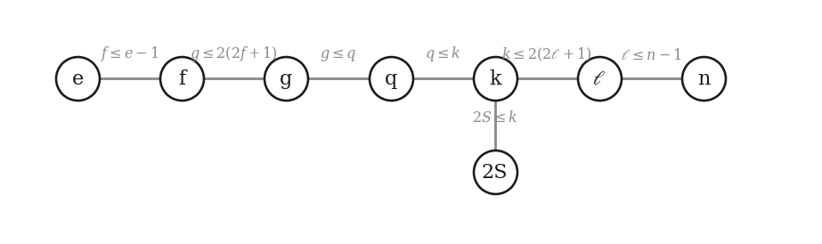
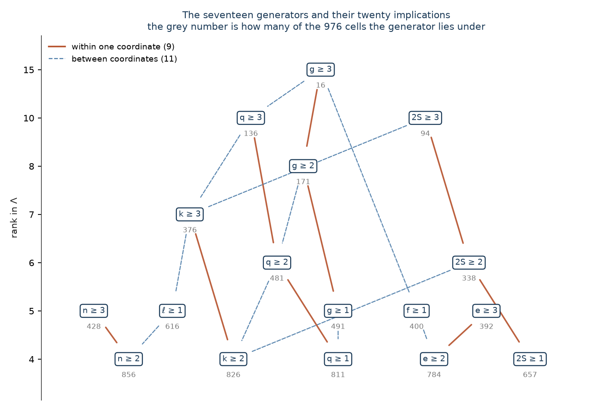
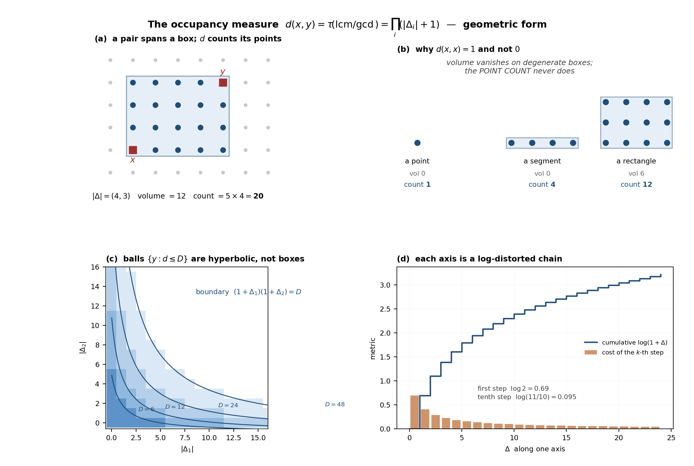
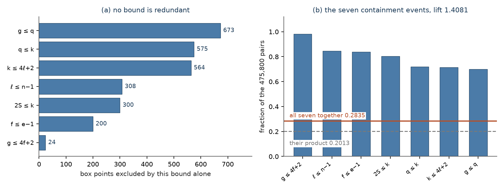
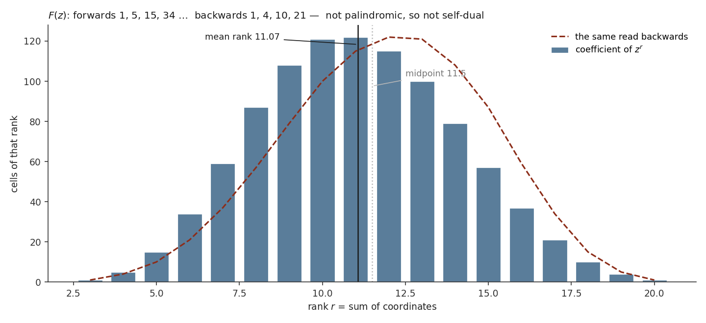
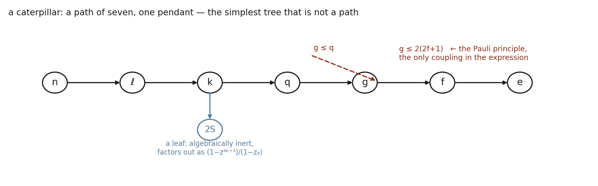
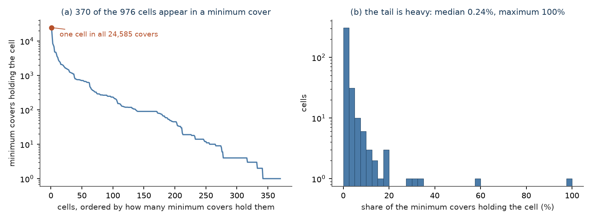

# The Lattice of One-Electron Transitions

**The eight-coordinate cells admitted by seven monotone bounds form a closed index of 976 cells — a distributive, modular, Sperner lattice with seventeen join-irreducibles and seventeen meet-irreducibles, carrying an occupancy metric, a void that factorises because its constraint graph is a tree, a single generating polynomial with F(1) = 976 and F(−1) = 2, a Möbius function in closed form that is non-zero exactly on the void-free unit hypercubes, and a minimum generating set of seven of its own cells, every one of which carries a null transition, a full transfer and each of the three channels s → p, p → s and p → p.**

**Matthew Lach** · Independent Researcher · 24 September 2026

---

## Abstract

A one-electron transition between atomic configurations is specified by eight integers: the shell, subshell and occupancy of the source, the number of electrons moved, the shell, subshell and final occupancy of the target, and the source multiplicity. Four physical facts — the hydrogenic node count, the Pauli capacity, conservation of the moved electrons, and vector coupling — cut the eight-fold product down to a set Λ, and each of them does so by one inequality of the same shape, one coordinate bounded by a non-decreasing function of one other. This paper shows what that shape buys. Λ is a sublattice of its ambient box: machine-checked with all variables integer, so the result holds at every cap and not at one. At the caps used here Λ has 976 cells in a box of 6,912, it is distributive and its rank function is modular with equality, its largest antichain equals its largest rank level, and it is the lattice of down-sets of a seventeen-element poset whose twenty covering relations are the seven bounds read a second time. The number seventeen is Σᵢ(|Aᵢ| − 1), a closed form in the alphabets. A multiplicative distance d(x, y) = ∏ᵢ(|Δᵢ| + 1) counts the box between two cells and equals a divisor count under a prime encoding; its logarithm is an ℓ¹ metric. Because the constraint graph is a tree — a caterpillar, a path of seven with one pendant — the number of cells in any coordinate box has a product form with no inclusion–exclusion, verified on all 1,944,000 sub-boxes; the whole index is one nested sum F whose coefficient function is its own membership predicate, with F(1) = 976 and F(−1) = 2. The Möbius function is (−1)^{|y∖x|} on antichain differences and zero elsewhere, verified against the defining recursion on all 116,138 comparable pairs. Its non-zero values sit exactly on the 19,079 comparable pairs whose box is a unit hypercube inside Λ, so it is decided by the same seven comparisons that decide containment, and it agrees with the number-theoretic Möbius function of N(y)/N(x) everywhere except on the 17,104 unit hypercubes that carry a void. Finally, seven cells generate the whole of Λ under the pairwise-envelope closure; an exhaustive branch-and-bound finds 24,585 minimum generating sets, exactly one cell lies in all of them, no covering obligation is met by a unique cell, no single cell can be removed from Λ without the closure restoring it, and every minimum generating set contains a null transition, a full transfer and each of the channels s → p, p → s and p → p. The closure defect and the closed-form generator count are re-measured at five further cap settings, from 216 to 19,109 cells, and hold at each.

---

## §0 · The result

**Seven inequalities of one shape make an index that is closed, that has a seventeen-letter alphabet, and that is recoverable from seven of its own cells.**

The object is a set Λ of eight-tuples of integers (§1). Nothing in the construction is chosen for convenience: every bound comes from one of four physical facts, every bound has the form xᵢ ≤ φ(xⱼ) with φ non-decreasing, and no bound is implied by the others — each excludes between 24 and 673 points of the ambient box that all six others admit (§1, Table 2). The work of this paper is to show what follows from that shape alone.

**Closed.** Λ is closed under coordinatewise maximum and minimum (Theorem 1). This is proved for every cap setting at once: the obligation is stated with the five caps and both cells as integer variables and discharged by an SMT solver, so it is not a fact about one box. The same is machine-checked for a single bound with the bounding function left uninterpreted and only monotonicity assumed (Lemma 1), which locates the hypothesis exactly: drop monotonicity and the claim is refuted; replace one bound by a bound on a sum and the claim is refuted, with an explicit witness (§9).

**Measured, at the stated caps.** With n, e ≤ 3, ℓ, f ≤ 1 and k ≤ 3, Λ has **976** cells in a box of **6,912** — 14.12% of it. The staircase closure returns Λ exactly, so its closure defect is **0**, and a second application changes nothing.

| what | value | how |
|---|---|---|
| cells, box, density | 976 · 6,912 · 14.12% | EXHAUSTIVE |
| rank range, cover relations | 3 to 20 · 3,749 | EXHAUSTIVE |
| largest antichain = largest rank level | **122**, at rank 11 | EXHAUSTIVE |
| join-irreducibles = meet-irreducibles = Σᵢ(\|Aᵢ\|−1) | **17** | EXHAUSTIVE |
| down-sets of the generating poset | **976** of 2¹⁷ = 131,072 subsets | EXHAUSTIVE |
| covering relations among the generators | **20** — 9 within a coordinate, 11 between | EXHAUSTIVE |
| F(1), F(−1), F′(1)/F(1) | 976 · 2 · 10801/976 = 11.0666 | EXHAUSTIVE, exact |
| void-free pairs | 134,871 of 475,800 — 0.2835 | EXHAUSTIVE |
| maximal chains, each of 17 steps | 1,113,045,672 | EXHAUSTIVE |
| μ(x, y) ≠ 0 | on 19,079 of 116,138 comparable pairs, the void-free unit hypercubes | EXHAUSTIVE |
| minimum generating set | **7** cells; 24,585 such sets; 1 cell in all | EXHAUSTIVE |

**What is not claimed.** Λ without caps is infinite, and every *count* above is a count at one cap setting, named wherever it appears. The structural statements divide into two kinds and the paper never merges them. Theorem 1, Lemma 1 and the sufficient half of Theorem 13 are machine-checked over the integers and hold at every cap, and Lemma 2 over every subset of two named boxes; the written proofs of Theorems 3, 4, 6, 10, 11, 12, 13, 15, 16 and 17 and of Corollaries 6, 7 and 8 use no cap. Every count — 976, 122, 17, 20, 3,749, 24,585 and the rest — is a computation at the stated caps, and the closure defect and the generator count are re-measured at five further settings (Theorem 2) but no count is proved to persist. The seed of 7 is exact at the stated caps, by an exhaustive branch and bound and not by a heuristic; the general problem is NP-complete (Karp 1972), and this paper makes no claim about its value at other caps. The physics enters only in §1, in one paragraph, and only to say where the seven bounds come from; nothing after that paragraph uses it.

**One finding worth stating in front.** Exactly one cell lies in all 24,585 minimum generating sets, and yet **no covering obligation is met by a unique cell** — the smallest witness set has four — so the elementary rule that forces a set into every minimum cover does not apply anywhere in this instance, and no single cell can be deleted from Λ without the closure putting it back (Corollary 8). What can be said locally is that the cell is the only common witness of three obligations; that no seed of seven can afford to meet those three with two cells is what the enumeration shows (§7). What every minimum seed shares is stated in Corollary 7 and proved from the covering criterion: a null transition, a full transfer at every occupancy, and each of the channels s → p, p → s and p → p — while an s → s cell appears in 17,403 of the 24,585 and is not forced.

**Status words.** Five, used exactly as follows and never merged.

| status | meaning |
|---|---|
| **PROVED** | a proof is written out below and every step is justified |
| **MACHINE-CHECKED** | an SMT solver returned `unsat` on the negation of an obligation whose variables range over every integer — hence over every cap — or over every subset of a named finite box, with both guards passed |
| **EXHAUSTIVE** | a decision procedure visited every case in a stated finite family, and the family is named |
| **SAMPLED** | a seeded pseudorandom sweep of a stated size; never exhaustive |
| **CITED** | taken from the literature, with the source |

---

## §1 · The index, and that it closes

**The physics, in one paragraph.** A bound electron in a hydrogen-like potential is labelled by a principal quantum number n and an orbital angular momentum ℓ, and the radial equation has a solution only for ℓ ≤ n − 1 (Bohr 1913). A subshell of angular momentum ℓ holds at most 2(2ℓ + 1) electrons, the multiplicity of the one-electron states with that ℓ, made exclusive by the exclusion principle (Stoner 1924; Pauli 1925). A transition moves q electrons out of one subshell and into another: it cannot move more than are present, and it cannot deposit more than it moved. The total spin of k equivalent electrons cannot exceed k/2, so the multiplicity label 2S is bounded by k (Hund 1925; Condon and Shortley 1935). Those four facts, and nothing else, are the origin of the seven inequalities below. Everything after this paragraph is a statement about the resulting set of integer tuples.

**D1 (the coordinates).** A **cell** is an eight-tuple of integers

> x = (n, ℓ, k, q, e, f, g, 2S),

read as: a source subshell (n, ℓ) holding k electrons, of which q move, into a target subshell (e, f) that ends holding g, the source carrying multiplicity 2S. The coordinates are indexed 1 to 8 in that order and `xᵢ` denotes the i-th.

**D2 (the bounds).** The **seven bounds** are

> ℓ ≤ n − 1 · k ≤ 4ℓ + 2 · q ≤ k · f ≤ e − 1 · g ≤ 4f + 2 · g ≤ q · 2S ≤ k,

together with the floors n ≥ 1, e ≥ 1, k ≥ 1 and ℓ, f, q, g, 2S ≥ 0. The floor k ≥ 1 is a definitional restriction, not a bound: a cell is a transition and a transition needs a mover. Each of the seven has the form `xᵢ ≤ φ(xⱼ)` with φ non-decreasing and with exactly two coordinates named. None is a sum and none is a difference.

**D3 (the caps, and the ambient box).** A **cap setting** is a tuple (n_max, e_max, ℓ_max, k_max, f_max) of positive integers. Throughout this paper the caps are **(3, 3, 1, 3, 1)** unless another setting is named. The **alphabets** are then

> A₁ = {1,2,3} · A₂ = {0,1} · A₃ = {1,2,3} · A₄ = {0,1,2,3} · A₅ = {1,2,3} · A₆ = {0,1} · A₇ = {0,1,2,3} · A₈ = {0,1,2,3},

and the **ambient box** is B = A₁ × … × A₈, a product of eight chains, of size **6,912**.

**D4 (Λ).** Λ := { x ∈ B : x satisfies the seven bounds of D2 }.

**D5 (the lattice operations).** For x, y ∈ B write `x ∨ y` for the coordinatewise maximum and `x ∧ y` for the coordinatewise minimum, and `x ≤ y` for the coordinatewise order. B is a lattice under these; a subset S ⊆ B is a **sublattice** when x, y ∈ S implies x ∨ y ∈ S and x ∧ y ∈ S.

**D6 (rank).** rank(x) := Σᵢ xᵢ.

**Theorem 1 (Λ is a sublattice).** For every cap setting and every x, y ∈ Λ, both x ∨ y and x ∧ y lie in Λ.

*Proof.* Take a bound `xᵢ ≤ φ(xⱼ)` with φ non-decreasing, and let z = x ∨ y. Then zᵢ = max(xᵢ, yᵢ) is one of the two, say zᵢ = xᵢ. Since x ∈ Λ, xᵢ ≤ φ(xⱼ), and since xⱼ ≤ max(xⱼ, yⱼ) = zⱼ and φ is non-decreasing, φ(xⱼ) ≤ φ(zⱼ). Hence zᵢ ≤ φ(zⱼ). If instead zᵢ = yᵢ the same argument runs with y in place of x. For the meet, let w = x ∧ y and let the *second* coordinate decide: wⱼ = min(xⱼ, yⱼ) is one of the two, say wⱼ = xⱼ. Then wᵢ ≤ xᵢ ≤ φ(xⱼ) = φ(wⱼ). If wⱼ = yⱼ the same runs with y. The floors and caps are conditions on one coordinate at a time and each is an interval, so they survive max and min. Every one of the seven bounds is of this shape, so both z and w satisfy all seven. ∎ **PROVED**, and **MACHINE-CHECKED**: the negation of the implication, with the five caps and all sixteen cell coordinates as integer variables, is `unsat`. Both guards pass (§9), and two negative controls are refuted in §9 — the claim fails if monotonicity is dropped, and it fails if any one bound is replaced by a bound on a sum.

**Lemma 1 (one monotone bound, with φ uninterpreted).** Let φ : ℤ → ℤ be non-decreasing and let R = {(a, b) ∈ ℤ² : a ≤ φ(b)}. Then R is a sublattice of ℤ².

*Proof.* The argument of Theorem 1, restricted to one bound. ∎ **PROVED**, and **MACHINE-CHECKED** with φ an uninterpreted function symbol constrained only by ∀u,v. u ≤ v → φ(u) ≤ φ(v), and a, b integer: `unsat`. Dropping the monotonicity axiom makes the same query `sat`, so monotonicity is not a convenience of the proof but the hypothesis.

**D7 (the envelope, and the closure operator).** For a finite X ⊆ ℤ⁸ with alphabets Aᵢ(X) = {xᵢ : x ∈ X} and box B(X) = ∏ᵢ Aᵢ(X), the **envelope** of X is

> φ̂ᵢⱼ^X(a) := max{ yᵢ : y ∈ X, yⱼ ≤ a }  for i ≠ j and a ∈ Aⱼ(X),

and the **staircase closure** is ℛ(X) := { x ∈ B(X) : xᵢ ≤ φ̂ᵢⱼ^X(xⱼ) for all i ≠ j }. X is **closed** when ℛ(X) = X; the **closure defect** is E(X) := |ℛ(X)| − |X|. That ℛ is a closure operator in the sense of Moore (1910) — extensive, monotone and idempotent — is established in the companion paper on the closure law and is not used below except where stated; this paper uses only the definition.

**Lemma 2 (a fixed point of ℛ is a sublattice).** If ℛ(X) = X then X is closed under ∨ and ∧.

*Proof.* Each defining condition of ℛ(X) is a bound `xᵢ ≤ φ̂ᵢⱼ(xⱼ)` and each envelope φ̂ᵢⱼ is non-decreasing by construction, being a maximum over a set that grows with its argument. So ℛ(X) is an intersection of sets of the form of Lemma 1, restricted to a box; an intersection of sublattices of a lattice is a sublattice, and B(X) is itself a sublattice of ℤ⁸. ∎ **PROVED**, and **MACHINE-CHECKED** over the subsets of two boxes: for every one of the 2⁹ subsets of a 3 × 3 box, and every one of the 2²⁷ subsets of a 3 × 3 × 3 box, the implication "X is a fixed point of ℛ and realises every value of every coordinate ⟹ X is closed under ∨ and ∧" is `unsat` under negation.

**Theorem 2 (the index is exactly its own closure).** At the caps of D3, |Λ| = 976, ℛ(Λ) = Λ and E(Λ) = 0; a second application of ℛ changes nothing.

*Proof.* Computation. Λ is built twice, once by the construction of D4 and once by sieving all 6,912 points of the box against the seven bounds, and the two agree cell for cell. The staircase closure of the result has 976 cells and is equal to Λ as a set, and ℛ(ℛ(Λ)) = Λ. ∎ **EXHAUSTIVE** (6,912 box points; the closure is computed over the same box). The same two computations at five further cap settings — (2,2,1,2,1), (3,3,1,4,1), (4,3,1,4,1), (4,4,2,4,1) and (4,4,2,6,2), with 216, 1,636, 2,394, 5,157 and 19,109 cells — return defect 0 at each; the closed-form count of join-irreducibles of Theorem 6 is verified at the same five settings, at 11, 21, 22, 24 and 33. **EXHAUSTIVE**, the settings named.

**Table 1 — the seven bounds and where each comes from.**

| bound | origin | form |
|---|---|---|
| ℓ ≤ n − 1 | hydrogenic radial solution | ℓ bounded by n |
| k ≤ 4ℓ + 2 | Pauli capacity of a subshell | k bounded by ℓ |
| q ≤ k | counting: no more may leave than are present | q bounded by k |
| f ≤ e − 1 | hydrogenic radial solution, on the target | f bounded by e |
| g ≤ 4f + 2 | Pauli capacity, on the target | g bounded by f |
| g ≤ q | counting: no more may arrive than left | g bounded by q |
| 2S ≤ k | vector coupling on the source | 2S bounded by k |

**Table 2 — no bound is redundant.** For each bound, the number of ambient points that satisfy the other six and fail only this one.

| bound | g ≤ q | q ≤ k | k ≤ 4ℓ+2 | ℓ ≤ n−1 | 2S ≤ k | f ≤ e−1 | g ≤ 4f+2 | *k ≥ 1* |
|---|---|---|---|---|---|---|---|---|
| points excluded by it alone | **673** | 575 | 564 | 308 | 300 | 200 | **24** | *25* |

Every entry is positive, so no bound follows from the rest, and the ranking is itself informative: the bound that removes most is g ≤ q, the only one relating a target coordinate to a source coordinate. **EXHAUSTIVE** over the 6,912 box points (and, for the floor, over the 8,064 points of the box extended to k = 0).

**Corollary 1 (the one coupling).** The coordinate g is the only one carrying two bounds, g ≤ min(q, 4f + 2). Dropping the Pauli half leaves 1,000 cells; the 24 lost all have f = 0 and g = 3 — three electrons in an s subshell.

*Proof.* Computation over the box; the 24 are exhibited by their coordinates. ∎ **EXHAUSTIVE** (6,912 box points).

**Lemma 3 (the constraint graph is a caterpillar).** Let G have the eight coordinates as nodes and one edge per bound, joining the two coordinates it names. Then G is connected with 8 nodes and 7 edges, hence a tree, with degree sequence 1,1,1,2,2,2,2,3: it is the path e — f — g — q — k — ℓ — n with 2S pendant at k, a caterpillar. Orient each edge from the bounded coordinate to the bounding one — ℓ → n, k → ℓ, q → k, 2S → k, f → e, g → f, g → q — and the oriented graph has no directed cycle.

*Proof.* Each of the seven bounds names exactly two coordinates, so G has exactly seven edges; a traversal from n reaches all eight nodes, so G is connected; a connected graph on 8 nodes with 7 edges is a tree. The degrees are read off the seven bounds, and removing the three leaves n, e and 2S leaves the path f — g — q — k — ℓ, so G is a caterpillar. A directed cycle in any orientation of G would be a cycle in G, and a tree has none. ∎ **PROVED** and **EXHAUSTIVE** (the graph is built from D2, traversed, and the orientation tested).

*Figure 1. The constraint graph: eight coordinates, seven bounds, one edge per bound, each edge labelled with its inequality. The graph is connected with seven edges on eight nodes, so it is a tree, and its degree sequence 1,1,1,2,2,2,2,3 makes it a caterpillar — a path of seven with one pendant, 2S at k. Every consequence in §4 and §5 is a consequence of that shape.*

---

## §2 · Structure

Throughout this section Λ is at the caps of D3 and the numbers are counts at those caps.

**D8 (irreducibles).** In a finite lattice, `y` **covers** `x` when x < y and no z has x < z < y. A cell is **join-irreducible** when it covers exactly one cell, and **meet-irreducible** when exactly one cell covers it.

**Theorem 3 (distributive).** Λ is a distributive lattice.

*Proof.* In a chain, min(a, max(b, c)) = max(min(a, b), min(a, c)): the three orderings of a, b, c are checked directly, and there are no others. Hence the ambient box B, a product of chains with coordinatewise operations, is distributive. By Theorem 1, Λ is a sublattice of B and its ∨ and ∧ are the restrictions of B's, so the identity restricts to Λ — a sublattice of a distributive lattice is distributive (Birkhoff 1940, CITED). ∎ **PROVED**; the chain identity is **EXHAUSTIVE** over all 289 triples of values drawn from the eight alphabets, and a **SAMPLED** sweep of 200,000 cell triples (seed 20260921) found no failure.

**Theorem 4 (graded, and modular with equality).** rank is a grading of Λ: the unique minimum is (1,0,1,0,1,0,0,0) at rank 3, the unique maximum is (3,1,3,3,3,1,3,3) at rank 20, there are 3,749 covering relations and every one raises rank by exactly 1. Moreover, for every x, y ∈ Λ,

> rank(x ∨ y) + rank(x ∧ y) = rank(x) + rank(y).

*Proof.* For integers a, b, max(a, b) + min(a, b) = a + b — one of the two is the maximum and the other the minimum. Summing that identity over the eight coordinates and using that ∨ and ∧ are coordinatewise (Theorem 1) gives the displayed equality. For the grading, the claim is that if y covers x in Λ then y − x is a unit vector. This is not true of every sublattice of a box — the two-element chain {(0,0), (1,1)} is a sublattice of {0,1}² in which (1,1) covers (0,0) at rank distance 2 — so the argument must use the shape of the bounds. Call the bounded coordinate of a bound `xᵢ ≤ φ(xⱼ)` a child of the bounding coordinate j. Let x < y in Λ and let S be the set of coordinates at which they differ. The child relation restricted to S has no directed cycle (Lemma 3), so some i ∈ S has no child in S. Put z := y − eᵢ, the cell y with coordinate i lowered by one. It lies in the ambient box, since zᵢ = yᵢ − 1 ≥ xᵢ. Every bound in which i is the bounded coordinate holds at z: zᵢ < yᵢ ≤ φ(yⱼ) = φ(zⱼ). Every bound in which i is the bounding coordinate, `x_m ≤ φ(xᵢ)` with m a child of i, also holds at z: m ∉ S, so z_m = y_m = x_m ≤ φ(xᵢ) ≤ φ(yᵢ − 1) = φ(zᵢ), because xᵢ ≤ yᵢ − 1 and φ is non-decreasing. Every other bound is unchanged. So z ∈ Λ and x ≤ z < y; if y covers x this forces z = x, that is y = x + eᵢ, and rank rises by exactly 1. The extremes are computed. ∎ **PROVED**; **EXHAUSTIVE** on all 475,800 unordered pairs, zero violations, and on all 3,749 cover relations.

The equality matters. Matroid rank and entropy are *sub*modular — the left side is at most the right. Λ's rank meets the equality, which is the graded signature of distributivity, and it is also the cheaper test: modularity is a condition on pairs, O(N²), where the distributive law is a condition on triples, O(N³).

**Theorem 5 (Sperner).** The largest antichain of Λ has 122 elements, and 122 is the size of the largest rank level, which is rank 11.

*Proof.* The rank sequence, at ranks 3 to 20, is

> 1, 5, 15, 34, 59, 87, 108, 121, **122**, 115, 100, 79, 57, 37, 21, 10, 4, 1,

summing to 976, and it is log-concave at every interior rank — aᵣ² ≥ aᵣ₋₁aᵣ₊₁ — hence, having no internal zero, unimodal (Stanley 2012, CITED). Each rank level is an antichain, so the largest antichain is at least 122. For the upper bound, Dilworth's theorem (1950), CITED, says the largest antichain equals the minimum number of chains covering the poset, and by König's theorem (1931) the minimum chain cover of an N-element poset is N minus a maximum matching in the bipartite graph of its strict order — the reduction of Fulkerson (1956), CITED. That matching, computed by the Hopcroft–Karp algorithm (1973), CITED, has 854 edges, so the minimum chain cover is 976 − 854 = 122 and no antichain exceeds it. The property that the largest antichain is a rank level is the Sperner property, named for Sperner's theorem (1928) on the Boolean lattice. ∎ **EXHAUSTIVE** (the exact matching over all 115,162 strict comparabilities) and **CITED** (Dilworth; König; Fulkerson; Hopcroft–Karp).

Λ is **not** rank-symmetric. The centre of mass of the rank sequence is 10801/976 = 11.0666 against the midpoint 11.5, a skew of −0.43. Low ranks are cut by the floors n ≥ 1, e ≥ 1, k ≥ 1 and high ranks by the seven bounds; there are more ceilings than floors, and the sequence is pruned harder at the top.

*Figure 2. The rank sequence over all 976 cells. It is log-concave, hence unimodal, hence Sperner, with the largest level 122 at rank 11. It is not symmetric: the centre of mass 11.07 sits below the midpoint 11.5 by 0.43.*

**Theorem 6 (seventeen letters, in closed form).** Λ has exactly 17 join-irreducibles and exactly 17 meet-irreducibles, and

> |J(Λ)| = Σᵢ (|Aᵢ| − 1) = 2 + 1 + 2 + 3 + 2 + 1 + 3 + 3 = 17.

Every join-irreducible has the form

> j(c, v) := min{ x ∈ Λ : x_c ≥ v },

one for each coordinate c and each value v of A_c above that coordinate's minimum, and the minimum exists.

*Proof.* Fix a coordinate c and a value v ∈ A_c above the minimum of A_c. The set S_v := {x ∈ Λ : x_c ≥ v} is non-empty, since every value of every alphabet is realised by some cell (Theorem 2 rebuilds Λ from the box and finds every alphabet value present), and it is closed under ∧ by Theorem 1, so it has a least element m := j(c, v), the meet of all its members. Some cell of Λ has c-coordinate exactly v; it lies in S_v, so m lies below it and m_c ≤ v; hence m_c = v.

m is join-irreducible. It is not the bottom cell, whose c-coordinate is the minimum of A_c, below v; so m covers at least one cell. Suppose m covered two distinct cells a and b. Neither lies below the other, since b < a < m would contradict b ⋖ m; so a < a ∨ b ≤ m, and a ⋖ m forces a ∨ b = m, which lies in Λ by Theorem 1. Then v = m_c = max(a_c, b_c), so one of a, b has c-coordinate v, lies in S_v and is strictly below m — contradicting the minimality of m. So m covers exactly one cell.

Conversely let j be join-irreducible with unique lower cover j⁻. By Theorem 4, j = j⁻ + e_c for some coordinate c; put v := j_c, which lies above the minimum of A_c because j⁻_c = v − 1 is a value of A_c. Then j ∈ S_v, and j is its least element: let x ∈ S_v and suppose j ≰ x. Then z := j ∧ x lies in Λ, is strictly below j, and has z_c = min(j_c, x_c) = v. Every cell strictly below j lies below some cell that j covers — the last step of a maximal chain from z to j is a cover of j — hence z ≤ j⁻ and z_c ≤ j⁻_c = v − 1, a contradiction. So j = j(c, v).

The map (c, v) ↦ j(c, v) is injective: j(c, v) covers only j(c, v) − e_c, so c is read off its unique lower cover and v is its c-coordinate. The join-irreducibles are therefore in bijection with the pairs (c, v), and their number is Σᵢ(|Aᵢ| − 1). The meet-irreducible count is computed and equals 17. ∎ **PROVED** for the form and the closed count; **EXHAUSTIVE** for the equality of the two counts (976 cells, both cover sets computed), and the closed count is re-verified at five further cap settings (Theorem 2).

**Table 3 — the seventeen letters.** *rank* is rank(j); *weight* is the number of the 976 cells that lie above j; *forces* lists the letters implied by it (Theorem 8).

| letter | generator | rank | weight | forces |
|---|---|---|---|---|
| `n ≥ 2` | (2,0,1,0,1,0,0,0) | 4 | 856 | — |
| `k ≥ 2` | (1,0,2,0,1,0,0,0) | 4 | 826 | — |
| `q ≥ 1` | (1,0,1,1,1,0,0,0) | 4 | 811 | — |
| `e ≥ 2` | (1,0,1,0,2,0,0,0) | 4 | 784 | — |
| `2S ≥ 1` | (1,0,1,0,1,0,0,1) | 4 | 657 | — |
| `ℓ ≥ 1` | (2,1,1,0,1,0,0,0) | 5 | 616 | `n ≥ 2` |
| `g ≥ 1` | (1,0,1,1,1,0,1,0) | 5 | 491 | `q ≥ 1` |
| `n ≥ 3` | (3,0,1,0,1,0,0,0) | 5 | 428 | `n ≥ 2` |
| `f ≥ 1` | (1,0,1,0,2,1,0,0) | 5 | 400 | `e ≥ 2` |
| `e ≥ 3` | (1,0,1,0,3,0,0,0) | 5 | 392 | `e ≥ 2` |
| `q ≥ 2` | (1,0,2,2,1,0,0,0) | 6 | 481 | `q ≥ 1`, `k ≥ 2` |
| `2S ≥ 2` | (1,0,2,0,1,0,0,2) | 6 | 338 | `2S ≥ 1`, `k ≥ 2` |
| `k ≥ 3` | (2,1,3,0,1,0,0,0) | 7 | 376 | `k ≥ 2`, `ℓ ≥ 1` |
| `g ≥ 2` | (1,0,2,2,1,0,2,0) | 8 | 171 | `g ≥ 1`, `q ≥ 2` |
| `q ≥ 3` | (2,1,3,3,1,0,0,0) | 10 | 136 | `q ≥ 2`, `k ≥ 3` |
| `2S ≥ 3` | (2,1,3,0,1,0,0,3) | 10 | 94 | `2S ≥ 2`, `k ≥ 3` |
| `g ≥ 3` | (2,1,3,3,2,1,3,0) | 15 | 16 | `g ≥ 2`, `q ≥ 3`, `f ≥ 1` |

The alphabet is not uniform: `n ≥ 2` is set in 856 of the 976 cells and `g ≥ 3` in sixteen, so one letter carries 87.7% of the object and another 1.6%.

**Theorem 7 (Birkhoff, verified).** Let P be the 17-element poset of join-irreducibles ordered by ≤, and for x ∈ Λ let D(x) := { j ∈ P : j ≤ x }. Then D is a bijection from Λ onto the set of down-sets of P, and D(x ∨ y) = D(x) ∪ D(y), D(x ∧ y) = D(x) ∩ D(y).

*Proof.* Birkhoff's representation theorem (1937), CITED, gives the isomorphism for any finite distributive lattice, and Λ is one by Theorem 3. The instance is verified rather than assumed: all 2¹⁷ = 131,072 subsets of P are tested, exactly 976 are down-sets, the 976 sets D(x) are distinct, and the two operations correspond on all 475,800 pairs with no exception. ∎ **CITED** (the theorem) and **EXHAUSTIVE** (131,072 subsets; 475,800 pairs).

Writing a cell as the 17-bit word of its letters, join is bitwise OR, meet is bitwise AND, and Λ is 976 of the 131,072 available words: 17 bits carried per cell against log₂ 976 = 9.9307 needed to index them, a surplus of 7.0693 bits, and an occupancy of 0.7446% of the space the cells are written in.

**Theorem 8 (twenty implications, and they are the seven bounds again).** P has exactly 20 covering relations. Nine are **within** a coordinate — `c ≥ v` forces `c ≥ v − 1`, which is the chain on Aᶜ — and eleven are **between** coordinates:

> `ℓ ≥ 1` → `n ≥ 2` · `f ≥ 1` → `e ≥ 2` · `g ≥ 1` → `q ≥ 1` · `k ≥ 3` → `ℓ ≥ 1` · `q ≥ 2` → `k ≥ 2` · `2S ≥ 2` → `k ≥ 2` · `g ≥ 2` → `q ≥ 2` · `q ≥ 3` → `k ≥ 3` · `2S ≥ 3` → `k ≥ 3` · `g ≥ 3` → `q ≥ 3` · `g ≥ 3` → `f ≥ 1`.

Each is one way a bound of D2 binds at one value, and those twenty implications alone cut the 131,072 words down to exactly the 976 cells, nothing else being imposed.

*Proof.* The covering relations of P are computed from the order on the seventeen cells. The classification into within and between is by the coordinate each letter names. For the cut: a 17-bit word satisfies all twenty implications if and only if its set of bits is a down-set of P — an implication along a cover is exactly the down-set condition at that cover, and the cover relations generate the order — and by Theorem 7 the down-sets are the cells. The enumeration confirms it directly: of 131,072 words, 976 satisfy the twenty. ∎ **PROVED** and **EXHAUSTIVE** (131,072 words).

*Figure 3. The seventeen generators, at their ranks in Λ, with the twenty covering relations: nine within one coordinate (solid) and eleven between coordinates (dashed). The grey number below each generator is the number of the 976 cells lying above it, from 856 at `n ≥ 2` to 16 at `g ≥ 3`. Every cell of Λ is the down-set of generators beneath it, and every down-set is a cell.*

**Corollary 2 (order dimension 7).** The order dimension of Λ is 7 — seven linear extensions realise the order and no six do — although Λ has eight coordinates.

*Proof.* For a finite distributive lattice the order dimension equals the width of its poset of join-irreducibles (Dilworth 1950, CITED; the dimension is that of Dushnik and Miller 1941). That width is computed to be 7, certified both ways by the same matching argument as Theorem 5. The antichain is {`k ≥ 2`, `q ≥ 1`, `2S ≥ 1`, `n ≥ 3`, `ℓ ≥ 1`, `e ≥ 3`, `f ≥ 1`} — one letter from each coordinate except g — and the seven chains are `n ≥ 2` < `n ≥ 3`; `k ≥ 2` < `q ≥ 2` < `q ≥ 3`; `q ≥ 1` < `g ≥ 1` < `g ≥ 2`; `e ≥ 2` < `e ≥ 3`; `2S ≥ 1` < `2S ≥ 2` < `2S ≥ 3`; `ℓ ≥ 1` < `k ≥ 3`; `f ≥ 1` < `g ≥ 3`. Why g contributes nothing: every letter `g ≥ v` lies above the atom `q ≥ 1`, because g ≤ q, so no antichain of letters can take a g-letter together with a q-letter below it, and the coordinate q is already represented. The order pays seven dimensions for eight axes. ∎ **CITED** and **EXHAUSTIVE** (the width of a 17-element poset, by exact matching, with both certificates written out).

**Corollary 3 (maximal chains).** Every maximal chain of Λ runs from the bottom cell to the top cell in exactly 17 covering steps, and there are **1,113,045,672** of them.

*Proof.* Under Theorem 7 a covering step adds exactly one generator to the down-set D(x), so a maximal chain from bottom to top lists the seventeen generators in an order in which each appears after everything below it in P — a linear extension of P — and conversely every linear extension gives a maximal chain; this is the standard correspondence for finite distributive lattices (Stanley 2012, CITED). Hence every maximal chain has |P| = 17 steps, which is also rank(top) − rank(bottom) = 20 − 3 by Theorem 4. The number of chains is the number of paths in the cover graph from bottom to top, counted by summing, in rank order, over the lower covers of each cell. ∎ **PROVED** (the correspondence **CITED**) and **EXHAUSTIVE** (the count over all 976 cells).

**Theorem 9 (the reflection).** Let σ(x) := top − x coordinatewise, with top = (3,1,3,3,3,1,3,3). Then σ maps exactly **8** of the 976 cells back into Λ, and σ has **no** fixed point in Λ. The eight are

> (1,0,1,1,1,0,1,1) · (1,0,1,1,2,1,1,1) · (2,1,1,1,1,0,1,1) · (1,0,2,2,1,0,2,2)
> (2,1,1,1,2,1,1,1) · (1,0,2,2,2,1,2,2) · (2,1,2,2,1,0,2,2) · (2,1,2,2,2,1,2,2)

at ranks 6, 8, 8, 10, 10, 12, 12, 14 — all even.

*Proof.* Computation over the 976 cells. That no cell is fixed is immediate as well as computed: σ(x) = x requires 2xᵢ = topᵢ in every coordinate, and top has odd entries (n = 3, k = 3, q = 3, e = 3, g = 3, 2S = 3), so no integer solution exists. The eight all have q = k, g = q and 2S = q, with (n, ℓ) and (e, f) each at (1,0) or (2,1): their source and target halves mirror one another, which is why the reflection returns them to Λ. Since rank(σx) = 20 − rank(x) and 20 is even, σ preserves rank parity, and it permutes the eight within their even ranks. ∎ **PROVED** (no fixed point) and **EXHAUSTIVE** (976 cells).

So Λ is not self-dual, and the failure is by a single witness: the rank sequence read forwards begins 1, 5, 15, 34 and read backwards begins 1, 4, 10, 21. They part at rank 4 and never rejoin. §5 shows this is the same fact as F(−1) = 2.

---

## §3 · The occupancy metric

**D9 (the prime encoding).** With pᵢ the i-th prime, N(x) := ∏ᵢ pᵢ^{xᵢ}. Then x ≤ y iff N(x) divides N(y), N(x ∨ y) = lcm(N(x), N(y)), N(x ∧ y) = gcd(N(x), N(y)), and rank(x) = Ω(N(x)), the number of prime factors of N(x) with multiplicity. So Λ is a sublattice of the divisor lattice of a single integer.

**D10 (the occupancy measure).** For x, y ∈ Λ,

> d(x, y) := τ( lcm(N(x), N(y)) / gcd(N(x), N(y)) ),

with τ the divisor-counting function.

**Theorem 10 (five forms).** For all x, y ∈ Λ the following five quantities are equal:

> (1) the number of points of the ambient box in the interval [x ∧ y, x ∨ y];
> (2) ∏ᵢ (|xᵢ − yᵢ| + 1);
> (3) τ( N(x)N(y) / gcd(N(x), N(y))² );
> (4) τ(a·b), where N(x)/N(y) = a/b in lowest terms;
> (5) ∏_p (|v_p(ρ)| + 1), where ρ = N(x)/N(y) and v_p is the p-adic valuation.

In particular d(x, x) = 1.

*Proof.* Under D9 the exponent of pᵢ in ρ = N(x)/N(y) is exactly xᵢ − yᵢ, so |v_{pᵢ}(ρ)| = |xᵢ − yᵢ| and (5) = (2). The quotient lcm/gcd has exponent |xᵢ − yᵢ| at pᵢ, so its divisor count is ∏(|xᵢ−yᵢ|+1) and (1 of D10) = (2); the same exponent vector arises in (3) and in (4), since cancelling to lowest terms removes exactly the gcd. Finally the box interval [x ∧ y, x ∨ y] is the product of the intervals [min(xᵢ,yᵢ), max(xᵢ,yᵢ)], of lengths |xᵢ − yᵢ| + 1, so (1) = (2). With x = y every factor is 1 and the product is 1: a point has no volume, but it is one point and it counts itself. ∎ **PROVED**, and **EXHAUSTIVE** on all 475,800 pairs, zero disagreements among the five.

**Theorem 11 (d is a multiplicative metric; log d is a metric).** For all x, y, z ∈ Λ: d(x,y) = d(y,x); d(x,y) ≥ 1 with equality iff x = y; and

> d(x, z) ≤ d(x, y) · d(y, z).

Consequently log d is a metric on Λ, and it is the ℓ¹ metric of the per-axis distances log(|Δᵢ| + 1).

*Proof.* Symmetry and d ≥ 1 are immediate from form (2), and d = 1 forces every factor to be 1, hence every |xᵢ − yᵢ| = 0. For the triangle inequality it suffices to prove the one-coordinate statement, for integers a, b, c:

> |a − c| + 1 ≤ (|a − b| + 1)(|b − c| + 1).

Write u = |a − b|, v = |b − c|. The ordinary triangle inequality on ℤ gives |a − c| ≤ u + v, and (u+1)(v+1) = uv + u + v + 1 ≥ u + v + 1 because uv ≥ 0. So |a − c| + 1 ≤ u + v + 1 ≤ (u+1)(v+1). Taking the product over the eight coordinates gives d(x,z) ≤ d(x,y)d(y,z), since each factor on the left is bounded by the product of the corresponding two on the right. Taking logarithms turns the product into a sum and the multiplicative inequality into the additive one, so log d(x,y) = Σᵢ log(|xᵢ − yᵢ| + 1) is a sum of per-axis terms each satisfying the triangle inequality: an ℓ¹ metric — a metric on a poset of the kind surveyed by Monjardet (1981). ∎ **PROVED**; the one-coordinate inequality is **EXHAUSTIVE** over all 289 value triples drawn from the eight alphabets, and a **SAMPLED** sweep of 200,000 cell triples (seed 20260922) found no failure of the multiplicative form.

Two features of the geometry follow from the form and are worth naming. A ball {y : d(x,y) ≤ D} is not a box: in two coordinates its boundary is the hyperbola (1 + Δ₁)(1 + Δ₂) = D. And each axis is a log-distorted chain — the first step costs log 2 = 0.6931 and the tenth costs log(11/10) = 0.0953 — so the measure is sensitive at short range and flat at long range, which is what a *count of cells* does and a difference does not.

*Figure 4. The occupancy measure. (a) A pair of cells spans a box and d counts its points, not its volume. (b) Why d(x,x) = 1: volume vanishes on a degenerate box and a point count never does. (c) Balls are hyperbolic, with boundary (1 + Δ₁)(1 + Δ₂) = D. (d) Each axis is a log-distorted chain: the first step costs log 2 and the tenth log(11/10).*

**Remark.** d measures the *box* between two cells, not the part of it that lies in Λ. The difference is the subject of §4.

---

## §4 · The void, and why it needs no sieve

**D11 (a coordinate box, and the void).** For lo ≤ hi in the ambient box, the **coordinate box** is [lo, hi] := ∏ᵢ [loᵢ, hiᵢ], of volume vol(lo,hi) = ∏ᵢ(hiᵢ − loᵢ + 1). For x, y ∈ Λ the **void** is

> void(x, y) := d(x, y) − | [x ∧ y, x ∨ y] ∩ Λ |,

the points of the box between x and y that the bounds exclude.

Lemma 3 of §1 gives the constraint graph; this section uses that it is a tree.

**Theorem 12 (the count factorises, with no inclusion–exclusion).** For every coordinate box [lo, hi],

> | [lo, hi] ∩ Λ |

is computed by eliminating the eight coordinates one at a time along the tree of Lemma 3, and every intermediate quantity is a function of a **single** coordinate. No term is ever subtracted.

*Proof.* Write the count as a sum over the box of a product of seven indicator factors, one per edge:

> | [lo,hi] ∩ Λ | = Σ_{z ∈ [lo,hi]} ∏_{(i,j) ∈ E} [ zᵢ ≤ φᵢⱼ(zⱼ) ].

Because G is a tree, it always has a leaf. Summing out a leaf coordinate touches only the single factor on its one edge, and produces a quantity that depends on the leaf's neighbour alone; deleting the leaf leaves a smaller tree, which again has a leaf. Iterating eight times consumes every coordinate, and at no step does any intermediate depend on two coordinates — the variable elimination of graphical models along a tree (Lauritzen 1996, CITED). Explicitly for Λ: 2S is a leaf at k and n a leaf at ℓ, and summing them out gives

> #{2S} = max(0, min(hi₈, k) − lo₈ + 1),  #{n} = max(0, hi₁ − max(lo₁, ℓ + 1) + 1),

each an interval clipped by a bound and each a function of one neighbour; then ℓ, k, q, g, f are eliminated in turn, each the leaf of what remains, and the last sum is over e. Read from the other end, g may instead be summed last of the three coordinates q, f, g it touches, as #{g} = max(0, min(hi₇, q, 4f + 2) − lo₇ + 1) — the one place a minimum of two arguments appears, because g is the one coordinate with two bounds. A tree has no cycle, so no configuration is counted twice and no correction term arises. ∎ **PROVED**, and **EXHAUSTIVE**: the elimination is compared with direct enumeration on **every one of the 1,944,000 coordinate boxes of the ambient box**, with zero disagreements.

The converse is the content of the statement. A constraint graph has induced width 1 if and only if it is a forest (Freuder 1982), CITED; with a cycle present, some elimination order must produce an intermediate in two coordinates, and the route back to single-coordinate counts is a Möbius sieve over the cycle's constraints, alternating in sign. An index whose constraint graph is a tree has its box counts in closed form; one with a cycle does not.

**Theorem 13 (containment in seven comparisons).** A coordinate box lies entirely inside Λ if and only if, for each of the seven bounds `xᵢ ≤ φ(xⱼ)`,

> hiᵢ ≤ φ(loⱼ).

*Proof.* (⇐) Let lo ≤ w ≤ hi. For each bound, wᵢ ≤ hiᵢ ≤ φ(loⱼ) ≤ φ(wⱼ) by monotonicity, since loⱼ ≤ wⱼ. The floors and caps hold because lo and hi are in the ambient box and w lies between them. So w ∈ Λ. (⇒) Suppose some bound has hiᵢ > φ(loⱼ). The point w with wᵢ = hiᵢ, wⱼ = loⱼ and w_m = lo_m elsewhere lies in [lo, hi] and violates that bound, so it is not in Λ. ∎ **PROVED**; the sufficient direction is **MACHINE-CHECKED** with lo, hi, the test point and all five caps as integer variables (`unsat` under negation), and the equivalence is **EXHAUSTIVE** on the same 1,944,000 coordinate boxes.

**Proposition 1 (how much of the void there is, and that the seven events are positively dependent).** Over all 475,800 unordered pairs of distinct cells, the box [x ∧ y, x ∨ y] lies wholly inside Λ for **134,871** of them — a void-free fraction of **0.2835**. Among the 115,162 strictly comparable pairs, whose box is the interval [x, y], it lies inside Λ for **31,604**, a fraction of 0.2744. The seven individual containment events of Theorem 13 hold at rates from **0.6995** (g ≤ q) to **0.9806** (g ≤ 4f + 2); their product, which is what independence would give, is **0.2013**. The joint rate exceeds it by a factor of **1.4081**.

*Proof.* Direct computation of all seven indicators and the joint event on every pair. ∎ **EXHAUSTIVE** (475,800 pairs; 115,162 comparable pairs). The direction of the departure is not accidental: each comparison hiᵢ ≤ φ(loⱼ) is a *narrowness* condition on the coordinates it touches, holding with probability 1 at zero width and falling as the width grows, so two comparisons sharing a coordinate are two decreasing functions of one width variable and their correlation is non-negative by Chebyshev's sum inequality. Constraints sharing no coordinate contribute no such term. This paper measures the size of the lift and does not decompose it further.

*Figure 5. (a) What each bound removes on its own: the ambient points that satisfy the other six and fail only this one, from 673 for g ≤ q down to 24 for g ≤ 4f + 2. Every entry is positive, so no bound is redundant. (b) The seven containment events of Theorem 13 over all 475,800 pairs, their product 0.2013 and the joint rate 0.2835 — a lift of 1.4081.*

---

## §5 · The single expression

**D12 (the rank polynomial).** F(z) := Σ_{x ∈ Λ} z^{rank(x)}, an integer polynomial.

**Theorem 14 (Λ is one nested sum).** At the caps of D3,

> F(z) = Σ_{n=1}^{3} zⁿ Σ_{ℓ=0}^{min(1, n−1)} z^ℓ Σ_{k=1}^{min(3, 4ℓ+2)} z^k · [ Σ_{2S=0}^{min(3,k)} z^{2S} ] · Σ_{q=0}^{min(3,k)} z^q Σ_{e=1}^{3} z^e Σ_{f=0}^{min(1, e−1)} z^f Σ_{g=0}^{min(3, q, 4f+2)} z^g,

and this equals D12 coefficient by coefficient. Setting every exponent variable separately, the same nesting in eight variables z₁,…,z₈ has the property that the coefficient of z₁ⁿ ⋯ z₈^{2S} is 1 if that cell is in Λ and 0 if it is not: the coefficient function of the expression *is* the membership predicate.

*Proof.* The nesting is the elimination order of Theorem 12 read as a generating function rather than a count: each variable's range is the interval its bounds leave given the variables already fixed, and because the constraint graph is a tree those ranges depend on one earlier variable each — except g, whose range depends on q and f, which is why exactly one bracket in the display carries a `min` of two arguments. The sum therefore enumerates every admissible tuple once and no other tuple, so its coefficient of z^r is the number of cells of rank r, and in the eight-variable form its coefficient at a monomial is the indicator of that cell. ∎ **PROVED**, and **EXHAUSTIVE**: the nested form and the direct sum agree at every rank 3 to 20, in exact integer arithmetic.

> F(z) = z³ + 5z⁴ + 15z⁵ + 34z⁶ + 59z⁷ + 87z⁸ + 108z⁹ + 121z¹⁰ + 122z¹¹ + 115z¹² + 100z¹³ + 79z¹⁴ + 57z¹⁵ + 37z¹⁶ + 21z¹⁷ + 10z¹⁸ + 4z¹⁹ + z²⁰.

**Corollary 4 (the three specialisations).** F(1) = 976; F(−1) = 2; F′(1)/F(1) = 10801/976 = 11.0666…, the mean rank, which sits 0.4334 below the midpoint 11.5 of the rank range.

*Proof.* Exact integer and rational evaluation of the coefficient list. ∎ **EXHAUSTIVE**, exact.

**Lemma 4 (the detachable leaf).** 2S appears in exactly one bound, so its sum closes geometrically and multiplies out:

> Σ_{2S=0}^{k} z^{2S} = (1 − z^{k+1}) / (1 − z).

Removing 2S projects Λ onto a set of **319** seven-coordinate cells (n, ℓ, k, q, e, f, g); each of them carries exactly k + 1 values of 2S, so that Σ (k + 1) over the 319 is 976; and the projection is itself closed, with defect 0.

*Proof.* The finite geometric series, for z ≠ 1. The bound on 2S is 2S ≤ k alone, and k ≤ 3 is the cap on 2S as well, so above a fixed seven-coordinate cell the admissible values of 2S are exactly 0, 1, …, k, which is k + 1 of them; the projection is closed under ∨ and ∧ because these act coordinatewise and dropping a coordinate commutes with them, and its staircase closure is computed and returns it. ∎ **PROVED**; the identity is verified in exact rational arithmetic at 60 points — six degrees k = 0..5 against ten distinct rationals — which exceeds the degree in the one variable, so a rational function agreeing there agrees identically; the projection, its 319 cells, the k + 1 spins over each and its defect 0 are **EXHAUSTIVE**.

Spin multiplicity is algebraically inert here: it scales the count of each seven-coordinate cell by k + 1 and changes no structure, which is what a leaf of a tree does.

**Theorem 15 (why F(−1) = 2, and why it is not 0).** Let F_box(z) := ∏ᵢ Σ_{v ∈ Aᵢ} z^v be the rank polynomial of the ambient box. Then F_box(1) = 6,912 and **F_box(−1) = 0**. The residue F(−1) = 2 is therefore created by the bounds and not inherited from the box; it is carried entirely by the cells with k = 2.

*Proof.* A coordinate whose alphabet is a run of consecutive integers of **even** length contributes Σ(−1)^v = 0 to the product. Five of the eight alphabets have even size — ℓ and f with two values each, and q, g and 2S with four each — so F_box(−1) = 0, five times over. If the coordinates were free the alternating sum would vanish. They are not free: ℓ is clipped by n, f by e, k by ℓ, q by k, g by q and by f, and 2S by k, so no vanishing factor ever appears on its own and the elimination of Theorem 12 at z = −1 leaves a residue. Splitting that residue by the source occupancy gives 0 at k = 1, **+2** at k = 2 and 0 at k = 3. The mechanism is Lemma 4: the spin factor at z = −1 is Σ_{2S=0}^{k}(−1)^{2S}, which is 1 for k even and 0 for k odd, so every cell with odd k cancels against its own spin sum, and the whole of F(−1) lives on the k = 2 cells. ∎ **PROVED** and **EXHAUSTIVE** (the box polynomial and the split by k, exact integers).

**Corollary 5 (F is not palindromic, and that is Theorem 9 again).** A graded poset is self-dual only if its rank polynomial is palindromic. Read forwards the coefficients begin 1, 5, 15, 34, 59, 87; read backwards they begin 1, 4, 10, 21, 37, 57. They part at rank 4 — five against four — and never rejoin. So Λ admits no rank-reversing automorphism, which is the statement Theorem 9 makes by exhibiting the eight cells the reflection returns and the zero it fixes.

*Proof.* Comparison of the coefficient list with its reverse; the first index at which they differ is computed. ∎ **EXHAUSTIVE.**

*Figure 6. F(z) read forwards as bars and backwards as the dashed line. They part company at the second level — 5 against 4 — and never rejoin. A rank polynomial is palindromic if and only if the poset is self-dual, so this one picture carries both the asymmetry of the rank sequence and the failure of the reflection.*

*Figure 7. The constraint graph read as the nesting order of the expression: a path of seven with one pendant. That shape is why a single left-to-right nesting exists with one bracketed factor. The pendant 2S factors out as a geometric sum (Lemma 4); g is the only coordinate with two parents, and the min it forces — g ≤ min(q, 4f + 2) — is the one non-product term in the whole expression.*

---

## §6 · The Möbius function

**D13 (the Möbius function).** For x ≤ y in Λ, μ(x, x) := 1 and μ(x, y) := −Σ_{x ≤ z < y} μ(x, z).

**Theorem 16 (closed form).** For x ≤ y in Λ, write Q := D(y) ∖ D(x) for the set of generators added (D of Theorem 7). Then

> μ(x, y) = (−1)^{|Q|} if Q is an antichain in P, and 0 otherwise.

*Proof.* By Theorem 7 the interval [x, y] of Λ is isomorphic to the interval [D(x), D(y)] of down-sets of P, which is isomorphic to the lattice J(Q) of down-sets of the induced subposet on Q: a down-set of P between D(x) and D(y) is D(x) together with a down-set of Q, and the correspondence is an order isomorphism.

If Q is an antichain, every subset of Q is a down-set, so J(Q) is the Boolean lattice 2^Q, whose Möbius value from bottom to top is (−1)^{|Q|}.

If Q is not an antichain, the atoms of J(Q) are the principal down-sets {m} of the elements m minimal in Q, and their join is the set of minimal elements of Q. Since Q is not an antichain some element of Q lies strictly above a minimal one, so that set is a proper subset of Q: the join of the atoms is not the top. By the crosscut theorem (Rota 1964), CITED — the atoms of a finite lattice are a crosscut, and μ(0̂, 1̂) = Σ_k (−1)^k q_k with q_k the number of k-element subsets of the crosscut that span, that is, whose join is 1̂ and whose meet is 0̂ — every spanning subset of the atoms must have join 1̂; if no subset of the atoms joins to 1̂ then every q_k is zero and μ(0̂, 1̂) = 0. That is the case here, because the join of *all* the atoms already falls short of the top and joins are monotone. ∎ **PROVED** (using Birkhoff, CITED, and Rota, CITED).

**Verification.** The closed form is substituted into the defining recursion of D13 and the identity Σ_{x ≤ z ≤ y} μ(x, z) = δ_{x,y} is tested on **all 116,138 comparable pairs** of Λ — 115,162 strict and 976 with x = y — with **zero** violations. Every value is in {−1, 0, +1}. Separately, the crosscut step of the proof is checked directly on all 24,164 distinct intervals that occur: the join of the atoms equals the top exactly when Q is an antichain, and exactly then is the interval Boolean of size 2^{|Q|}. **EXHAUSTIVE**, both.

**Corollary 6 (the Möbius function in coordinates, and against arithmetic).** For x ≤ y in Λ, μ(x, y) ≠ 0 if and only if every yᵢ − xᵢ ≤ 1 and the coordinate box [x, y] lies inside Λ; and then μ(x, y) = (−1)^{rank(y) − rank(x)}. Consequently, with μ_ℤ the number-theoretic Möbius function and N the encoding of D9, μ(x, y) = μ_ℤ(N(y)/N(x)) for every comparable pair except those whose box [x, y] is a unit hypercube not contained in Λ, where μ_ℤ is ±1 and μ is 0.

*Proof.* Write Q = D(y) ∖ D(x) and m = rank(y) − rank(x); by Theorem 7 and Theorem 4, |Q| = m, since each covering step adds one generator and raises rank by one. By Theorem 16, μ(x, y) ≠ 0 iff Q is an antichain, iff the interval [x, y] of Λ is the Boolean lattice 2^Q — for if a < b in Q then {b} is a subset of Q that is not a down-set, so J(Q) has fewer than 2^{|Q|} elements, while an antichain has all of them. Suppose the interval is Boolean. Its atoms are the cells covering x, each of the form x + eᵢ by Theorem 4, and distinct atoms use distinct coordinates; the top y is the join of the atoms, which is coordinatewise maximum, so y = x + Σ_{i ∈ I} eᵢ for a set I of m coordinates and every yᵢ − xᵢ ≤ 1. The Boolean lattice has 2^m elements, all in [x, y] ∩ Λ, and the coordinate box [x, y] has exactly 2^m points, so the box lies inside Λ. Conversely, if every yᵢ − xᵢ ≤ 1 and the box lies inside Λ, then [x, y] ∩ Λ is the whole box, a Boolean lattice of rank m, so Q is an antichain and μ = (−1)^m. For the arithmetic statement: N(y)/N(x) = ∏ pᵢ^{yᵢ − xᵢ} is squarefree iff every yᵢ − xᵢ ≤ 1, and then μ_ℤ of it is (−1)^m, otherwise 0. So the two functions agree wherever the box is not a unit hypercube (both 0) and on every void-free unit hypercube (both (−1)^m), and differ exactly on unit hypercubes with a void. ∎ **PROVED**, and **EXHAUSTIVE** on all 116,138 comparable pairs: μ is non-zero on 19,079 of them, exactly the void-free unit hypercubes; it agrees with μ_ℤ on 99,034 and differs on 17,104, every one a unit hypercube with a void.

Whether the box [x, y] lies inside Λ is the seven comparisons of Theorem 13, so μ(x, y) is decided by eight comparisons of coordinates and one parity — no recursion and no poset.

**Remark.** The practical content is that no recursion is needed. A 976-element lattice has 116,138 comparable pairs, and every Möbius value among them is read off a 17-element poset by one antichain test on at most 17 elements, or, by Corollary 6, off the coordinates alone.

---

## §7 · The seed

**D14 (a seed).** G ⊆ Λ is a **seed** of Λ when ℛ(G) = Λ, with ℛ the staircase closure of D7 taken over G's own box. seed(Λ) is the least |G| over all seeds.

**Theorem 17 (generating is covering).** G ⊆ Λ is a seed of Λ if and only if

> (a) for every coordinate i and every value v ∈ Aᵢ(Λ), some cell of G has xᵢ = v, and
> (b) for every ordered pair i ≠ j and every a ∈ Aⱼ(Λ), some cell y ∈ G has yⱼ ≤ a and yᵢ = φ̂ᵢⱼ^Λ(a).

*Proof.* (⇒) Suppose ℛ(G) = Λ. ℛ(G) sits inside G's own box, so G realises every value Λ does, which is (a). For (b): φ̂ᵢⱼ^G(a) ≤ φ̂ᵢⱼ^Λ(a) always, since G ⊆ Λ; if the inequality were strict at some (i, j, a) then the cell of Λ attaining φ̂ᵢⱼ^Λ(a) at that argument would fail G's own bound and so lie outside ℛ(G), contradicting ℛ(G) = Λ.
(⇐) Under (a) and (b), G and Λ have the same box and the same envelopes, and ℛ depends on its argument only through those two; so ℛ(G) = ℛ(Λ), which is Λ by Theorem 2. ∎ **PROVED**; and **SAMPLED**: on 80 random subsets of sizes 4 to 10 (seed 20260923) the covering test and the staircase closure agree without exception.

So seed(Λ) is a **minimum set cover**: the elements to cover are the **alphabet slots** of (a) and the **envelope steps** of (b), and a cell covers the elements it witnesses. Because each φ̂ᵢⱼ is non-decreasing in a, it is a step function, and only the least argument realising each of its values needs covering — the running maximum is constant between steps. Counting them gives **102 elements**: 25 alphabet slots and 77 envelope steps, against 976 sets.

**Theorem 18 (seed(Λ) = 7).** At the caps of D3, seed(Λ) = 7. There are exactly **24,585** minimum seeds. Exactly **one** cell — (2,1,3,3,2,1,3,0), which is the generator `g ≥ 3` — lies in all of them, and **no** element of the 102 is witnessed by a unique cell: the smallest witness set has four.

*Proof.* By Theorem 17 the problem is exactly minimum set cover, which is NP-complete in general (Karp 1972), CITED, so the search must be exact rather than heuristic and must be shown exhaustive. Three steps.

*Reduction.* If the witness set of element e₁ contains the witness set of e₂, then any cover of e₂ covers e₁ and e₁ may be discarded without changing which subsets are covers — so the reduction preserves both the minimum and the *set* of minimum covers. Applying it leaves **27** critical elements. Grouping the 976 cells by which of the 27 they witness leaves **245** distinct signatures; two cells with the same signature are interchangeable in any cover, so covers are enumerated over signatures and each is expanded by the product of its multiplicities.

*Lower bound.* If a family of elements has pairwise disjoint witness sets, then every cover needs a distinct set for each, so the size of such a family is a lower bound. A greedy pass over the 27 critical elements, smallest witness set first, exhibits **5** pairwise disjoint ones; so seed(Λ) ≥ 5.

*Exhaustiveness.* The search branches on an **uncovered element**: at every node it picks one element not yet covered and recurses once on each signature that witnesses it. Every cover must contain at least one such signature, so no cover is missed and the enumeration is complete; the branch is cut when the current depth plus the disjoint-element bound on the elements still uncovered exceeds the limit, which discards only branches that cannot reach a cover within the limit. Run at limits 1 through 6 the search returns nothing, so no seed of six cells exists; run at limit 7 it returns 13,468 signature-covers, which expand to **24,585** covers by cells. One cell lies in every one of them; and scanning the 102 elements, none has a witness set of size 1, the smallest having 4. ∎ **EXHAUSTIVE** (the search visits every case; the limits 1 to 7 are all run) and **CITED** (Karp).

**Remark on what the seed is not.** The greedy heuristic for set cover (Johnson 1974; Chvátal 1979) certifies an upper bound and nothing else, which is why the search above is exact. The elementary rule that puts a set in every minimum cover — that it is the only witness of some element — applies to nothing here: every element of the 102 is witnessed by at least four cells, and yet one cell is in all 24,585 minimum covers. What can be said locally is this: the cell witnesses 26 of the 102 elements, no one or two of those single it out, and three do — the slots n = 2 and e = 2, with 428 and 392 witnesses, and the step "g at 2S ≤ 0", whose value 3 has four witnesses, meet in exactly this cell. A minimum seed that omits it must therefore spend at least two cells on those three elements; that no seed of seven can afford to is what the enumeration shows, and this paper does not reduce that to a local certificate. The complement of the statement is also measured: **370** of the 976 cells appear in at least one minimum cover, the median such cell appears in 59 of them — 0.24% — and the distribution is heavy-tailed, the second-most-common cell appearing in 14,492, or 58.9%.

**Corollary 7 (what every seed contains).** Every seed of Λ — minimum or not — contains a cell with q = 0 (a null transition), a cell with q = k for each k ∈ {1, 2, 3} (a full transfer at every occupancy), a cell with (ℓ, f) = (0, 1), one with (ℓ, f) = (1, 0) and one with (ℓ, f) = (1, 1) — the channels s → p, p → s and p → p. An s → s cell, (ℓ, f) = (0, 0), is not forced: it appears in 17,403 of the 24,585 minimum seeds.

*Proof.* By Theorem 17 a seed covers every alphabet slot and every envelope step. The slot q = 0 needs a cell with q = 0. For the ordered pair (i, j) = (q, k), φ̂_{qk}(a) = max{yq : yk ≤ a} = a for a = 1, 2, 3, so every a is a step, and a cell covering it has k ≤ a and q = a, hence q = k = a, since q ≤ k. For (f, ℓ) at a = 0, φ̂_{fℓ}(0) = max{yf : yℓ ≤ 0} = 1, attained by (1,0,1,0,2,1,0,0), and 0 is the least argument so a step; a cell covering it has ℓ = 0 and f = 1. For (ℓ, f) at a = 0, φ̂_{ℓf}(0) = 1 likewise, and a covering cell has f = 0 and ℓ = 1. The slot g = 3 needs a cell with g = 3, and then q = 3 by g ≤ q, k = 3 by q ≤ k, ℓ = 1 because k ≤ 4ℓ + 2 fails at ℓ = 0, and f = 1 because g ≤ 4f + 2 fails at f = 0: a p → p cell. The count for s → s is computed over all 24,585 minimum seeds. ∎ **PROVED**, and **EXHAUSTIVE** over the 24,585 minimum seeds, where each forced kind appears in 24,585 of 24,585.

**Corollary 8 (no cell is removable).** For every cell x ∈ Λ, ℛ(Λ ∖ {x}) = Λ.

*Proof.* By Theorem 17, ℛ(Λ ∖ {x}) = Λ if and only if Λ ∖ {x} covers every element, that is, if and only if no element is witnessed by x alone; and by Theorem 18 every witness set has at least four cells. ∎ **PROVED** from Theorem 18's count, and **EXHAUSTIVE** directly: all 976 deletions are run through the closure operator and every one returns Λ.

So every cell of Λ is implied by the other 975. In the language of convex geometries — closure spaces in which every closed set is the hull of its extreme points (Edelman and Jamison 1985) — ℛ on Λ has no extreme point at all, and the seed of seven is as far from a unique generating set as it could be, which is what lets 24,585 minimum seeds coexist.

The compression is the headline. 976 cells are recoverable from 7 of them, a ratio of 139 to 1, and the lower bound of 5 says at most two of those seven are slack. Against the seventeen join-irreducibles of §2 the seed is smaller, and for a stated reason: ℛ fills a box up to its envelopes, where the lattice join reaches only the down-set of what it is given, so the staircase closure is the stronger operator and needs less to start from.

*Figure 8. (a) The 370 of 976 cells that appear in at least one minimum seed, ordered by how many of the 24,585 seeds hold them; the scale is logarithmic and one cell sits at 100%. (b) The same as a distribution: the median cell appears in 0.24% of the minimum seeds and one in all of them.*

---

## §8 · What this index is an instance of

The properties established here are not properties of atoms. Every one of them was derived from the *shape* of the constraint system and not from its content: that each bound is monotone, that each names two coordinates, and that the resulting graph has no cycle. Monotonicity gives closure (Theorem 1, and Lemma 1 with the bounding function uninterpreted); two coordinates per bound give a graph; the absence of cycles gives the product form of the count (Theorem 12), the single nested expression (Theorem 14), and the containment test in seven comparisons (Theorem 13). Distributivity, modularity, the Birkhoff correspondence and the closed-form Möbius function then follow from being a sublattice of a product of chains. The companion paper on the closure law takes that observation as its subject: it asks which sets are fixed points of the staircase closure, what the defect E(X) measures when they are not, and which constraint forms can and cannot appear in a system whose admissible set is closed. Λ is that paper's worked instance and this one is its measurement — an index that closes exactly, whose defect is zero at the stated caps and at the five further settings named in Theorem 2, and whose every structural feature is traceable to one of the three shape facts above. The physics chose the seven bounds; the shape of those bounds chose everything else.

---

## §9 · Verification record

Every number printed above is recomputed by the accompanying checks, which discharge **65** obligations in five kinds. The object under test is the same construction throughout, imported rather than restated; the reference implementations used by the guards are written independently.

| object | PROVED | MACHINE-CHECKED | EXHAUSTIVE | SAMPLED / CITED |
|---|---|---|---|---|
| Theorem 1, Λ is a sublattice | ✓ | **✓** all 13 variables integer (5 caps, 2 cells) | 475,800 pairs, 0 escapes | — |
| Lemma 1, one monotone bound | ✓ | **✓** φ uninterpreted, a, b integer | — | — |
| Lemma 2, a fixed point of ℛ is a sublattice | ✓ | **✓** every subset of a 3×3 box (2⁹) and of a 3×3×3 box (2²⁷) | — | — |
| Theorem 2, \|Λ\| = 976, E(Λ) = 0 | — | — | 6,912 box points; closure and re-closure | — |
| Tables 1–2, no bound redundant | — | — | 6,912 + 8,064 box points | — |
| Theorem 3, distributive | ✓ | — | 289 coordinate triples | 200,000 cell triples, seed 20260921 |
| Theorem 4, graded and modular | ✓ | — | 475,800 pairs; 3,749 covers | — |
| Theorem 5, Sperner, 122 at rank 11 | — | — | exact matching over 115,162 comparabilities | Dilworth; König; Hopcroft–Karp CITED |
| Theorem 6, seventeen irreducibles | ✓ | — | 976 cells, both cover sets | — |
| Theorem 7, Birkhoff | — | — | 131,072 subsets; 475,800 pairs | Birkhoff CITED |
| Theorem 8, twenty implications | ✓ | — | 131,072 words | — |
| Corollary 2, order dimension 7 | — | — | width of a 17-element poset, exact matching | Dushnik–Miller CITED |
| Theorem 9, the reflection | ✓ (no fixed point) | — | 976 cells | — |
| Theorem 10, five forms of d | ✓ | — | 475,800 pairs | — |
| Theorem 11, the metric | ✓ | — | 289 value triples | 200,000 cell triples, seed 20260922 |
| Lemma 3, the caterpillar | ✓ | — | the graph of the seven bounds | — |
| Theorem 12, the tree factorisation | ✓ | — | **1,944,000** coordinate boxes | — |
| Theorem 13, seven comparisons | ✓ | **✓** lo, hi, test point, 5 caps integer | the same 1,944,000 boxes | Freuder CITED |
| Proposition 1, the void-free fraction | — | — | 475,800 pairs | — |
| Theorem 14, the nested expression | ✓ | — | every rank 3–20, exact integers | — |
| Corollary 3 and Theorem 15, F(±1) | ✓ | — | exact integer evaluation; the split by k | — |
| Lemma 4, the detachable leaf | ✓ | — | 60 exact rational points, above degree | — |
| Corollary 4, not palindromic | — | — | the coefficient list and its reverse | — |
| Theorem 16, the Möbius function | ✓ | — | 116,138 comparable pairs; 24,164 intervals | Rota; Birkhoff CITED |
| Theorem 17, generating is covering | ✓ | — | — | 80 random subsets, seed 20260923 |
| Theorem 18, seed(Λ) = 7 | — | — | exact branch and bound, limits 1–7 | Karp; Chvátal CITED |

**The exhausted families, named.** 6,912: every point of the ambient box at the caps of D3. 8,064: the same box extended to k = 0, for the floor's marginal count. 475,800: every unordered pair of distinct cells. 115,162: every strictly comparable ordered pair; 116,138 with the diagonal. 131,072: every subset of the seventeen generators. 289: every triple of values drawn from one of the eight alphabets, summed over the eight. 1,944,000: every coordinate box [lo, hi] of the ambient box, that is every choice of lo ≤ hi in each of the eight alphabets. 24,164: every distinct generator-set difference D(y) ∖ D(x) over comparable pairs.

**The two guards on every machine-checked claim.** *Non-vacuity* — the hypothesis of each obligation is shown satisfiable, and with a non-triviality demand: two distinct cells and caps at least 3 for the integer obligation; a monotone φ with two distinct admissible pairs for Lemma 1; a **proper** non-empty fixed point of ℛ inside the 3×3×3 box for Lemma 2. *Encoding fidelity* — the solver's membership formula is compared with an independently written implementation on every one of the 6,912 box points and on 400 random integer tuples drawn from a range wider than the box, 7,312 comparisons, **0** disagreements and **0** skipped; and the subset harness's staircase predicate is compared cell by cell against the same closure operator used in Theorem 2, 1,352 comparisons over three box shapes, **0** disagreements and **0** skipped. An obligation is not reported unless both guards pass.

**The negative controls, all refuted.** Six, run as a separate pass. (1) Replace one bound by a bound on a sum, g + q ≤ 3: the solver returns `sat` with the explicit witness x = (3,1,3,3,3,0,0,0), y = (2,1,3,1,2,1,1,1), whose join violates it — a sum bound does not close. (2) Drop monotonicity from Lemma 1: `sat`. (3) Assert the Möbius closed form without its antichain condition: refuted on 13,489 pairs of a sweep, where the true value is 0 and the unconditional formula gives ±1. (4) Claim a union of sublattices is a sublattice: refuted, 2 escaping joins in the union of two principal down-sets at incomparable generators. (5) Claim seed(Λ) = 6: refuted by the exhaustive search at limit 6. (6) Claim every coordinate box is full: refuted, the whole box holds 976 of 6,912 points.

**What is not machine-checked, and why.** The counts of §2 to §7 are computations at one cap setting and are not of a shape a solver decides; they carry EXHAUSTIVE with their family named. Theorem 5's upper bound rests on Dilworth's theorem and an exact maximum matching, not on a solver. Theorem 16's proof uses two cited theorems whose own proofs are in the literature; what is checked here is the instance, on every comparable pair. Theorem 18 is an exhaustive search whose completeness is argued in its proof and not certified by an external tool: the branching rule is complete because every cover must contain a set witnessing the chosen uncovered element, and the pruning bound is valid because pairwise-disjoint elements require distinct sets. Distributivity on cell triples and the multiplicative triangle on cell triples are **SAMPLED**, each 200,000 triples with its seed stated, because the full families have 1.5 × 10⁸ and 9.3 × 10⁸ members; in both cases the general statement is PROVED and the sample is a transcription check, not the evidence.

---

## References

- Birkhoff, G. (1937). Rings of sets. *Duke Mathematical Journal* **3**, 443–454.
- Birkhoff, G. (1940). *Lattice Theory*. American Mathematical Society Colloquium Publications 25, New York.
- Bohr, N. (1913). On the constitution of atoms and molecules. *Philosophical Magazine* **26**, 1–25.
- Carathéodory, C. (1911). Über den Variabilitätsbereich der Fourier'schen Konstanten von positiven harmonischen Funktionen. *Rendiconti del Circolo Matematico di Palermo* **32**, 193–217.
- Chvátal, V. (1979). A greedy heuristic for the set-covering problem. *Mathematics of Operations Research* **4**, 233–235.
- Condon, E. U. and Shortley, G. H. (1935). *The Theory of Atomic Spectra*. Cambridge University Press, Cambridge.
- de Moura, L. and Bjørner, N. (2008). Z3: an efficient SMT solver. In *Tools and Algorithms for the Construction and Analysis of Systems*, Lecture Notes in Computer Science 4963, Springer, 337–340.
- Dilworth, R. P. (1950). A decomposition theorem for partially ordered sets. *Annals of Mathematics* **51**, 161–166.
- Dushnik, B. and Miller, E. W. (1941). Partially ordered sets. *American Journal of Mathematics* **63**, 600–610.
- Edelman, P. H. and Jamison, R. E. (1985). The theory of convex geometries. *Geometriae Dedicata* **19**, 247–270.
- Freuder, E. C. (1982). A sufficient condition for backtrack-free search. *Journal of the ACM* **29**, 24–32.
- Hopcroft, J. E. and Karp, R. M. (1973). An n^{5/2} algorithm for maximum matchings in bipartite graphs. *SIAM Journal on Computing* **2**, 225–231.
- Hund, F. (1925). Zur Deutung verwickelter Spektren, insbesondere der Elemente der Eisengruppe. *Zeitschrift für Physik* **33**, 345–371.
- Johnson, D. S. (1974). Approximation algorithms for combinatorial problems. *Journal of Computer and System Sciences* **9**, 256–278.
- Karp, R. M. (1972). Reducibility among combinatorial problems. In R. E. Miller and J. W. Thatcher, eds., *Complexity of Computer Computations*, Plenum, New York, 85–103.
- König, D. (1931). Gráfok és mátrixok. *Matematikai és Fizikai Lapok* **38**, 116–119.
- Lauritzen, S. L. (1996). *Graphical Models*. Oxford University Press, Oxford.
- Moore, E. H. (1910). *Introduction to a Form of General Analysis*. Yale University Press, New Haven.
- Pauli, W. (1925). Über den Zusammenhang des Abschlusses der Elektronengruppen im Atom mit der Komplexstruktur der Spektren. *Zeitschrift für Physik* **31**, 765–783.
- Rota, G.-C. (1964). On the foundations of combinatorial theory I. Theory of Möbius functions. *Zeitschrift für Wahrscheinlichkeitstheorie und Verwandte Gebiete* **2**, 340–368.
- Sperner, E. (1928). Ein Satz über Untermengen einer endlichen Menge. *Mathematische Zeitschrift* **27**, 544–548.
- Stanley, R. P. (2012). *Enumerative Combinatorics, Volume 1*, 2nd edition. Cambridge University Press, Cambridge.
- Stoner, E. C. (1924). The distribution of electrons among atomic levels. *Philosophical Magazine* **48**, 719–736.
