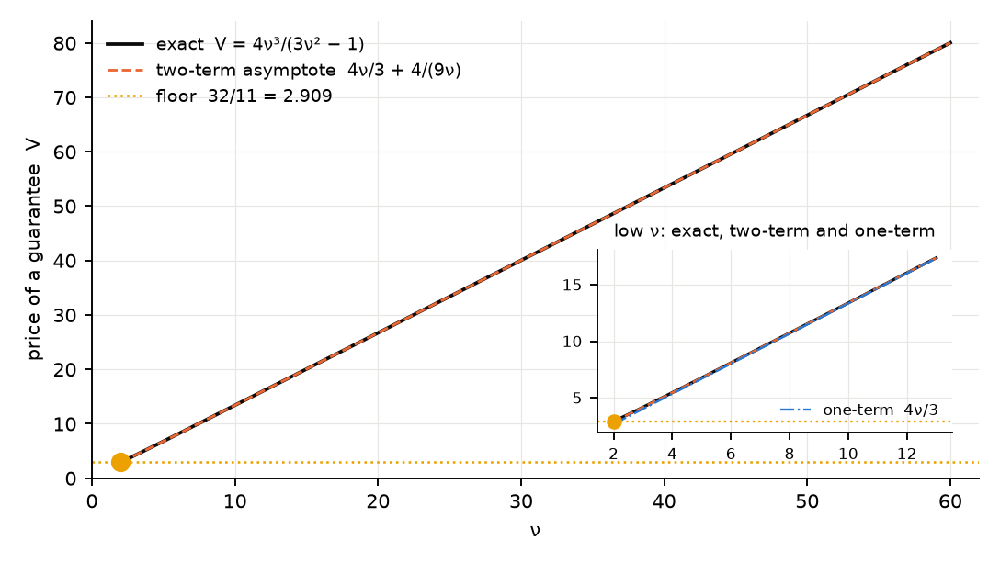
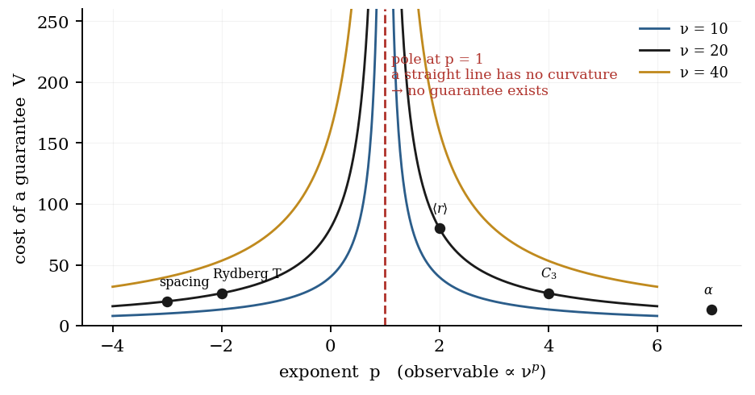
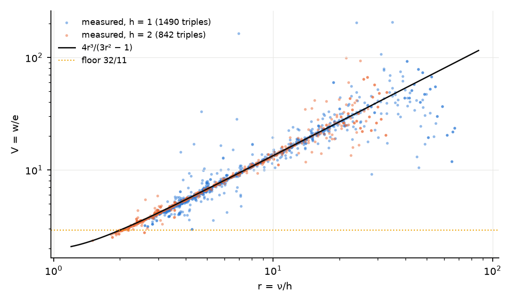
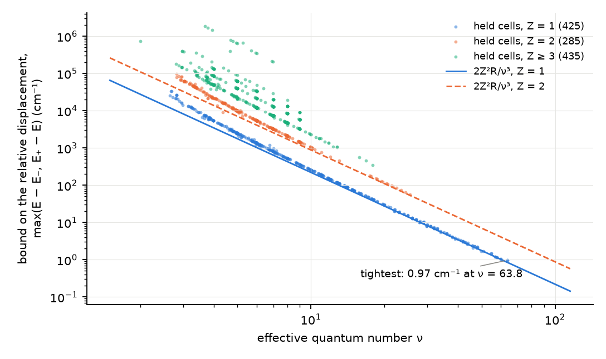
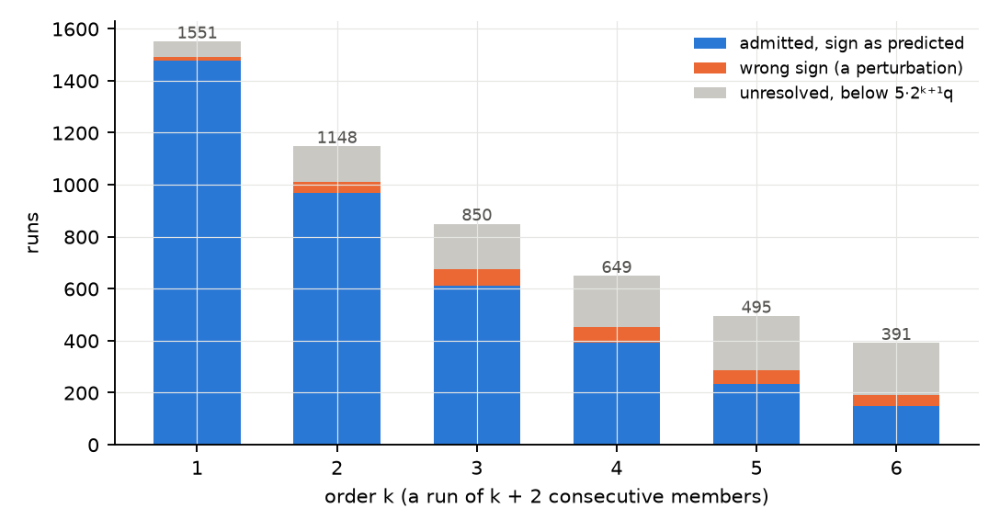

# The Bracket: a Guarantee on Rydberg Levels, and What It Costs

**For a Rydberg series T(ν) = Z²R/ν², containment of each level between its two neighbours is a guarantee that needs no fit and no threshold; it fails only under a displacement larger than the local gap; its price against the linear estimate is exactly 4ν³/(h(3ν² − h²)), never below 32/11 once ν ≥ 2h; and that price is two-thirds of the binding energy read as a Newton decrement.**

**Matthew Lach** · Independent Researcher · 24 September 2026

---

## Abstract

A Rydberg series is monotone in its principal quantum number, so a level with a measured neighbour on each side lies between them. That containment — the bracket — is a deduction: it fits no parameter, assumes no functional form, and returns an interval rather than a value. This paper states the bracket, proves that it is invariant under the choice of ionisation threshold (so it applies where the threshold is unknown), and proves the exact condition under which a displaced level leaves its interval: the displacement must exceed the gap on that side, and for the term T = Z²R/ν² the two gaps enclose the derivative 2Z²R/ν³. The price of the guarantee is the ratio V of the bracket's width to the error of linear interpolation from the same two neighbours. For the Rydberg term V is a rational function of one variable, V = 4r³/(3r² − 1) with r = ν/h, in which Z and R cancel identically; it is increasing in r, so its floor over ν ≥ 2h is 32/11; and for any monotone triple whatever, V > 2. The width and the price move in opposite directions under the only free choice, the step h, for every strictly convex monotone function. The asymptotic form 8y′²/y″ of the width–price product is eight times the Newton decrement of the term function, and for a Rydberg series λ² = (2/3)T, exactly and in every unit of energy; the self-concordance condition on the term function, by contrast, holds only up to a depth that scales with the unit, and the paper states it as such and draws nothing from it. Aitken's Δ² applied to the same series lands at T(2n² − 1)/(6n² − 2), not at zero. Every identity is checked in exact rational arithmetic on a grid above its degree; the four containment statements are discharged by an SMT solver over linear real arithmetic. The test is then run on 1,551 interior cells of measured levels from the NIST Atomic Spectra Database across 395 series: the containment statement holds at every one, the sharper quantum-defect form holds at 1,145 and fails at 406, with the share of those verdicts that the tolerance alone decides stated; and each held cell, with its neighbours taken as unperturbed, bounds the displacement of its level relative to those neighbours by the larger of its two observed gaps, the tightest to 0.97 cm⁻¹.

## §0 · The result

**A level of a Rydberg series lies between its neighbours, and that is all the bracket claims.** The claim is weak by design. It is a statement about order, not about a formula, and so it survives everything that leaves the order intact: an unknown ionisation threshold, an unknown quantum defect, a perturbation smaller than the local gap. The paper separates three things that are easily run together.

*The guarantee.* Containment between neighbours is equivalent to monotonicity of the triple (Theorem 1) and is invariant under the affine change T = I − E (Theorem 2). It therefore holds wherever the levels are monotone, and it needs neither the threshold I nor the defect δ. On a monotone series it cannot fail; that is what makes it a deduction and also what makes a 100 % pass rate on it uninformative.

*The failure condition.* A single displaced level leaves its interval exactly when the displacement exceeds the gap on that side (Theorem 3). For the Rydberg term the two gaps enclose the derivative 2Z²R/ν³ (Lemma 3), so a perturbation of size |Δ| defeats the bracket only above the critical depth ν ≈ ∛(2Z²R/|Δ|). Read backwards, every cell at which the bracket holds, with its two neighbours taken as unperturbed, bounds the displacement of its level relative to those neighbours by the larger of its two observed gaps (Corollary 2) — a bound obtained with no fit, and a bound on a relative displacement, not on a perturbation of the series as a whole.

*The price.* A guarantee is wider than an estimate. With w the width of the interval and e the error of the linear interpolant from the same neighbours, V = w/e is exactly 4ν³/(h(3ν² − h²)) for the Rydberg term (Theorem 4); Z and R cancel; V is increasing in ν/h; its floor at ν = 2h is 32/11 (Theorem 5); and for any monotone triple V > 2 (Theorem 6). The width falls and the price rises as the step h shrinks, for every strictly convex monotone function (Theorem 7): no choice of h buys both. The leading-order product w²/e = 8y′²/y″ is eight times the Newton decrement, and for a Rydberg series the decrement is λ² = (2/3)T (Theorem 10). The self-concordance inequality that interior-point theory attaches to the decrement is not unit-free, and Theorem 11 says exactly what of it survives a change of unit: nothing but the ratios.

*The test.* The sharper form of the bracket — the level lies in the energy interval that its neighbours' quantum defects imply — can fail, and is run here on the measured levels held in the data set under one rule: strict interval membership, half a unit in the last quoted decimal as the only tolerance, and refusal of any cell whose quotation is too coarse to decide. On 1,551 interior cells across 395 series it passes 1,145 and fails 406, and §7 states how many of those verdicts the tolerance alone decides. The containment statement passes all 1,551, as it must.

**What is not claimed.** That the pass rate of the containment statement is evidence of anything beyond monotonicity. That the sharper test's failures are faults of the data: they are places where the quantum defect is not locally monotone, which the data may well have. That the anticorrelation between large perturbations and large ν (§3) is proved: it is stated as an observation. That cells sharing a neighbour are independent tests: they are not, and §7 says how many series there are. That a held cell bounds a perturbation of the series: it bounds the displacement of one level relative to its two neighbours, under the hypothesis that those neighbours are unperturbed (Corollary 2). That self-concordance of the term function says anything about an atom: the condition depends on the unit of energy (Theorem 11).

Six status words are used and never merged.

| status | meaning |
|---|---|
| **PROVED** | a proof is written out below and every step is justified; an identity so marked is also checked in exact rational arithmetic on a grid exceeding its degree in every variable, which is a proof of the identity and not a sample of it |
| **MACHINE-CHECKED** | Z3 returned `unsat` on the negation of an obligation whose variables range over all of linear real arithmetic — a complete decision procedure, so the result is a proof over every real assignment, with both guards passed (§10) |
| **EXHAUSTIVE** | a decision procedure visited every case of a stated finite family |
| **MEASURED** | a number computed from the cited data by the stated procedure — the paper's own result, with its sample stated; never a proof, and never merged with PROVED |
| **CITED** | taken from the literature, with the source |
| **REFUTATION** | a claim disproved by an explicit witness |

A number printed by evaluating a proved closed form at a stated point — a table entry, a decimal beside a theorem — is an arithmetic evaluation. It carries the theorem's status and none of its own, and the verification record (§10) counts such evaluations apart from the obligations.

---

## §1 · Definitions

Throughout, R = 109,737.31568 cm⁻¹ is the Rydberg constant (CODATA 2018, Tiesinga, Mohr, Newell and Taylor 2021; CITED) and Z is the charge seen by the excited electron: 1 for a neutral atom, 2 for a singly charged ion; for a one-electron ion it is the nuclear charge, and §8 uses it in that sense. R is the infinite-mass constant; the reduced-mass value for a species of mass M differs from it by the factor 1/(1 + mₑ/M), at most 7.8 × 10⁻⁵ for lithium, the lightest species tested here, and §7 states what that does to ν and δ.

**D1 (level, threshold, term).** A level E is an energy above the ground state, in cm⁻¹. The threshold I is the ionisation limit of the series the level belongs to. The term is the binding energy T := I − E > 0.

**D2 (effective quantum number, quantum defect).** For a level of principal quantum number n,

    ν := Z √(R / T),        δ := n − ν.

Equivalently T = Z²R/ν² = Z²R/(n − δ)². The Rydberg term function is T(ν) = Z²R/ν², and A := Z²R is written for the product where only the product matters.

**D3 (series, cell, interior cell).** A series is a set of levels sharing every label except n (parent term, orbital angular momentum, term symbol and J), indexed by n. A cell is a member of a series. A cell at n is interior at step h when the series holds measured levels at n − h and n + h; interior without qualification means h = 1. The three members (n − h, n, n + h) are a triple at step h.

**D4 (the bracket).** The bracket at an interior cell is the statement

    min(T(n−1), T(n+1)) ≤ T(n) ≤ max(T(n−1), T(n+1)).

It holds or it fails; it returns an interval, [min, max], and not a value.

**D5 (the defect bracket).** Let δ₋ and δ₊ be the quantum defects the two neighbours imply (D2), and let `δ_lo` ≤ `δ_hi` be their order. The defect bracket at n is the statement `δ_lo` ≤ δ(n) ≤ `δ_hi`, equivalently (Lemma 2) `E_lo` ≤ E(n) ≤ `E_hi` with

    E_lo := I − Z²R/(n − δ_hi)²,      E_hi := I − Z²R/(n − δ_lo)²,

the larger defect giving the lower energy.

**D6 (width, error, price, step).** For a function y sampled at x − h, x, x + h with h > 0 the step, the bracket width is w := |y(x+h) − y(x−h)|, the interpolation error is e := |y(x) − ½(y(x−h) + y(x+h))|, the error of the linear interpolant from the same two neighbours, and the price of the guarantee is V := w/e. For the Rydberg term, x = ν and r := ν/h.

**D7 (quotation floor, admissibility).** A level printed with k decimals carries a quotation floor q := ½·10⁻ᵏ. The admissibility ratio of a cell is

    r_adm := 2Z²R / (ν³ q),

the local derivative of the term against the floor. A cell is admissible when `r_adm` ≥ 5.

**D8 (the strict test).** At an interior cell whose three levels are measured and lie below I: if the cell is inadmissible (D7) it is REFUSED; otherwise it passes when `E_lo` − q ≤ E(n) ≤ `E_hi` + q and fails when it does not. The floor q is the only tolerance; it is a property of the printed value, not a fitted parameter, and the test uses no uncertainty the source may attach to a level. A level the source marks as derived rather than measured is not a level for this purpose.

**D9 (power-law observable).** y(x) = xᵖ with p real, x > 0. The Rydberg term is the case p = −2 up to the constant A.

**D10 (Newton decrement, self-concordance).** For a twice-differentiable f with f″ > 0 on an interval, the Newton decrement is λ(f)² := f′²/f″. A thrice-differentiable f with f″ > 0 is self-concordant on an interval when |f‴| ≤ 2 f″√f″ there, equivalently (f‴)² ≤ 4(f″)³ (Nesterov and Nemirovskii 1994; Nesterov 2018; CITED). The inequality is invariant under affine changes of the variable and not under f ↦ cf: the ratio |f‴|/(f″√f″) is multiplied by 1/√c, so whether it holds depends on the unit in which f is measured.

---

## §2 · The guarantee

**Theorem 1 (containment is monotonicity).** For real a, b, c: min(a, b) ≤ c ≤ max(a, b) if and only if a ≤ c ≤ b or b ≤ c ≤ a.

**Proof.** If a ≤ b then min(a,b) = a and max(a,b) = b, so the left side reads a ≤ c ≤ b, which is the first disjunct; the second disjunct b ≤ c ≤ a with a ≤ b forces a = b = c and is then also the first. If b ≤ a the same argument gives the second disjunct. ∎ **PROVED**, and **MACHINE-CHECKED** (obligation M4, §10).

**Corollary 1.** On a series whose terms are strictly monotone in n, the bracket (D4) holds at every interior cell. On a series whose terms are not monotone across some triple it fails at that triple. So a 100 % pass rate of the bracket is a statement that the levels are ordered, and nothing more. ∎

**Theorem 2 (the bracket is threshold-free).** For any real I, min(a, b) ≤ c ≤ max(a, b) if and only if min(I − a, I − b) ≤ I − c ≤ max(I − a, I − b).

**Proof.** Multiplication by −1 reverses every inequality and exchanges min with max: min(a,b) ≤ c ≤ max(a,b) ⟺ −max(a,b) ≤ −c ≤ −min(a,b) ⟺ max(−a,−b) ≥ −c ≥ min(−a,−b) after the identities −max(a,b) = min(−a,−b) and −min(a,b) = max(−a,−b). Adding I to every member preserves each inequality and carries −a, −b, −c to I − a, I − b, I − c, and min and max commute with the shift. ∎ **PROVED**; **MACHINE-CHECKED** (M1).

**Consequence.** The bracket on terms T = I − E is the same statement as the bracket on levels E. It can be evaluated where I is unknown, ambiguous or disputed. The effective quantum number, the quantum defect and the price V all need I; the bracket does not.

**Lemma 2 (the defect bracket is an energy interval).** At fixed n, Z and I the map δ ↦ E = I − Z²R/(n − δ)² is strictly decreasing on δ < n. Hence `δ_lo` ≤ δ(n) ≤ `δ_hi` if and only if `E_lo` ≤ E(n) ≤ `E_hi`, where `E_lo` and `E_hi` are as in D5.

**Proof.** dE/dδ = −2Z²R/(n − δ)³ < 0 for δ < n. A strictly decreasing map carries the interval [`δ_lo`, `δ_hi`] onto [E(`δ_hi`), E(`δ_lo`)] = [`E_lo`, `E_hi`] and preserves membership. ∎ **PROVED.**

The two brackets are different statements. D4 asks whether the level lies between its neighbours; D5 asks whether the quantum defect does. The first is implied by monotonicity of T. The second is implied by monotonicity of δ, which no theorem here guarantees: the Ritz expansion δ(n) = δ₀ + δ₂/(n − δ₀)² + … (Ritz 1903; Seaton 1983; CITED) approaches δ₀ monotonically from one side, and either sign of δ₂ occurs in measured series; the classical account of series analysis in these terms is Edlén (1964; CITED). The guarantee is the first; the test that can fail, and is run in §7, is the second.

---

## §3 · When the bracket fails

**Theorem 3 (the exact failure condition).** Let a > c > b be the three terms of a triple in their unperturbed order, and let the middle term be displaced to c + Δ while the neighbours stay. Then c + Δ lies in [b, a] if and only if

    −(c − b) ≤ Δ ≤ a − c.

**Proof.** With a > b the interval [min(a,b), max(a,b)] is [b, a], and b ≤ c + Δ ≤ a is, after subtracting c, exactly −(c − b) ≤ Δ ≤ a − c. ∎ **PROVED**; **MACHINE-CHECKED** (M3).

So the bracket fails exactly when a displacement in either direction exceeds the gap on that side. For the Rydberg term, whose terms fall with n, the gap toward n − 1 lies above the cell in T and the gap toward n + 1 below it, and both are known in closed form.

**Lemma 3 (the gaps enclose the derivative).** For T(ν) = A/ν² with unit step, the gap toward n − 1 and the gap toward n + 1 are

    g₋ := T(ν−1) − T(ν) = A(2ν − 1)/(ν²(ν − 1)²),      g₊ := T(ν) − T(ν+1) = A(2ν + 1)/(ν²(ν + 1)²),

and for every ν > 1,

    g₊ < 2A/ν³ < g₋.

**Proof.** g₊ = A[(ν+1)² − ν²]/(ν²(ν+1)²) = A(2ν+1)/(ν²(ν+1)²), and g₋ likewise with ν − 1. For the inequalities divide by A/ν³: g₊/(2A/ν³) = ν(2ν+1)/(2(ν+1)²) < 1 because ν(2ν+1) = 2ν² + ν < 2ν² + 4ν + 2 = 2(ν+1)²; and g₋/(2A/ν³) = ν(2ν−1)/(2(ν−1)²) > 1 because 2ν² − ν > 2ν² − 4ν + 2 ⟺ 3ν > 2, true for ν > 1. ∎ **PROVED**; the closed forms are exact on a rational grid and the inequalities are **EXHAUSTIVE** on ν ∈ {5/4, 6/4, …, 200} (I21–I22).

**Corollary 2 (the bound in the silence).** Let the bracket hold at a cell whose two neighbours are unperturbed, and let Δ be the displacement of the middle term from its unperturbed value. Then by Theorem 3, with a = T(n−1), c = T(n), b = T(n+1), −g₊ ≤ Δ ≤ g₋ in the term, that is −g₋ ≤ Δ_E ≤ g₊ in the energy, and in either case |Δ| ≤ max(g₋, g₊). In terms of D6, at step h, the two gaps are g₋ = w/2 + e and g₊ = w/2 − e exactly (I39), so the larger gap is g₋ = (w/2)(1 + 2/V) (I40): it exceeds the half-width w/2 by the fraction 2/V, which is 11/16 at ν = 2h and 2.3 % at ν = 64h (I41). The half-width is itself h·(2A/ν³)/(1 − h²/ν²)² (I24) and exceeds 2A/ν³ (I23), so the bound is looser than the derivative too. So each held cell bounds the displacement of its level relative to its two measured neighbours by the larger of its two observed gaps, max(E − E₋, E₊ − E), computed from the neighbours with no fit, no expansion and no smoothness assumption. ∎ **PROVED.**

Two limits of the statement are part of it. The hypothesis that the neighbours are unperturbed cannot be dropped: the bound is on the displacement of the level relative to its neighbours, and a perturber that moves the neighbours with the cell is invisible to it. In an atom that is the common case — a perturbing level displaces every member within a few units of n along a smooth phase profile (Lu and Fano 1970; CITED), so a series can stay monotone while every level is displaced by more than a local gap. What a Lu–Fano analysis or a multichannel quantum-defect fit returns (Fano 1970; Seaton 1983; Aymar, Greene and Luc-Koenig 1996; CITED) is a far tighter and model-dependent bound on the perturbation itself; what a held cell returns is a fit-free bound on a weaker quantity. The two are not competitors, and nothing here is a bound on a perturbation of the series in the Lu–Fano sense.

**D11 (critical depth).** A perturbation of size |Δ| can reorder a cell only where the local gap has fallen to |Δ|. Taking the derivative 2Z²R/ν³ for the gap, the critical depth is `ν_fail` := ∛(2Z²R/|Δ|).

| \|Δ\| (cm⁻¹) | `ν_fail`, Z = 1 | `ν_fail`, Z = 2 |
|---|---|---|
| 3,000 | 4.2 | 6.6 |
| 1,000 | 6.0 | 9.6 |
| 100 | 13.0 | 20.6 |
| 10 | 28.0 | 44.4 |

*Table 1. The critical depth `ν_fail` = ∛(2Z²R/|Δ|). By Lemma 3 the gap toward n + 1 is smaller than 2Z²R/ν³ and the gap toward n − 1 is larger, so `ν_fail` (D11) is between the two exact thresholds. (I25.)*

**An observation, not a theorem.** Large perturbations of a Rydberg series arise from configuration interaction with core-excited states, which lie low in the spectrum, while deep series live at high ν where the gaps are small. The two conditions of Theorem 3 — a large Δ and a small gap — therefore tend not to coincide in measured spectra. That is a statement about atoms and is offered as one; nothing below depends on it.

---

## §4 · The price of a guarantee

**Theorem 4 (the exact price).** For T(ν) = A/ν² sampled at ν − h, ν, ν + h with 0 < h < ν,

    w = 4Aνh / (ν² − h²)²,      e = A h²(3ν² − h²) / (ν²(ν² − h²)²),      V = w/e = 4ν³ / (h(3ν² − h²)) = 4r³/(3r² − 1),  r = ν/h.

**Proof.** w = A[(ν+h)² − (ν−h)²]/((ν−h)²(ν+h)²) = 4Aνh/(ν² − h²)². For e, ½(T(ν−h) + T(ν+h)) = A(ν² + h²)/(ν² − h²)², so

    e = A[(ν² + h²)ν² − (ν² − h²)²] / (ν²(ν² − h²)²) = A[ν⁴ + ν²h² − ν⁴ + 2ν²h² − h⁴] / (ν²(ν² − h²)²) = A h²(3ν² − h²) / (ν²(ν² − h²)²),

which is positive since h < ν, so the middle term lies below the chord and the absolute values in D6 are the signed quantities. Dividing, A and one power of h cancel: V = 4νh·ν²/(h²(3ν² − h²)) = 4ν³/(h(3ν² − h²)). Dividing numerator and denominator by h³ gives 4r³/(3r² − 1). ∎ **PROVED**; exact on a rational grid in (A, ν, h) (I1–I3).

**Corollary 3 (what cancels).** (i) Z and R do not appear in V: the price of a guarantee on a Rydberg series is the same for every charge state and every isotope. (ii) V depends on ν and h only through r = ν/h, so depth and step are interchangeable: V(20, 1) = V(40, 2) = V(60, 3) = V(80, 4) = 26.688907 and V(10, 1) = V(40, 4) = 13.377926 (I13). (iii) Any function y = a + b/x² has the same V (I4): bracketing the quantum defect δ(n) = δ₀ + δ₂/n² instead of the term costs exactly what bracketing the term costs, because the additive constant cancels from w and from e and the scale cancels from their ratio. ∎

**Theorem 5 (the Rydberg floor).** V(r) = 4r³/(3r² − 1) is strictly increasing on r ≥ 1. Hence for every interior cell with ν ≥ 2h, V ≥ V(2) = 32/11 = 2.909…, with equality only at ν = 2h.

**Proof.** For r₁, r₂ ≥ 1,

    V(r₂) − V(r₁) = 4(r₂ − r₁)(3r₁²r₂² − r₁² − r₁r₂ − r₂²) / ((3r₁² − 1)(3r₂² − 1)),

an identity of rational functions (I6, exact on a grid). The denominator is positive. In the second factor each of r₁², r₁r₂ and r₂² is at most r₁²r₂², because r₂² ≥ 1, r₁r₂ ≥ 1 and r₁² ≥ 1 respectively, with equality in all three only at r₁ = r₂ = 1; so the factor is positive whenever r₁, r₂ ≥ 1 are not both 1. The difference therefore has the sign of r₂ − r₁. The floor follows at r = 2, where V = 32/11. ∎ **PROVED**; the minimum over every (ν, h) with h = 1…4 and ν = 2h…400 is 32/11, **EXHAUSTIVE** (1,584 cases, I10).

The hypothesis ν ≥ 2h is the statement that the lower neighbour exists at ν − h ≥ h. Among the cells tested in §7 it holds at all but one: the smallest interior effective quantum number in that collection is 1.99993, at n = 2 of the Li III ns series — a hydrogenic ion whose threshold exceeds the Coulomb value 9R by the relativistic term of §8, which depresses ν at that cell just below 2; V there falls below 32/11 by less than a part in 10⁴. Every other cell has ν ≥ 2 (E11). At integer ν with h = 1 the price is rational: 32/11, 54/13, 256/47, 250/37 at ν = 2, 3, 4, 5 and 4000/299 at ν = 10 (I9).

**Corollary 4 (the asymptote, with its remainder).** V(r) = 4r/3 + 4/(9r) + 4/(9r(3r² − 1)) exactly (I5). At ν = 2 the two-term asymptote gives 26/9, low by 0.694 %; at ν = 10 the remainder is 4/26,910 = 1.49 × 10⁻⁴, so the asymptote is exact to three decimals there and not to four. The floor 32/11 belongs to the exact expression; the asymptote has no floor. ∎ **PROVED.**

*Figure 1. The exact price V = 4ν³/(3ν² − 1) at h = 1 against its two-term asymptote 4ν/3 + 4/(9ν) and the floor 32/11 = 2.909. The marker is ν = 2, where the two-term asymptote reads 26/9 and is low by 0.69 %; the two are within 1.5 × 10⁻⁴ by ν = 10. The inset shows the low-ν region with the one-term form 4ν/3 also drawn. (I5, I9–I12.)*

**Theorem 6 (the floor at two, for any monotone triple).** Let y₀ < y₁ < y₂ at equal spacing, w = y₂ − y₀ and e = |y₁ − ½(y₀ + y₂)|. Then V = w/e > 2 whenever e ≠ 0, and V takes every value above 2: V = 2(1 + t)/(1 − t) where t is the ratio of the smaller step to the larger.

**Proof.** Put d₀ = y₁ − y₀ > 0 and d₁ = y₂ − y₁ > 0. Then w = d₀ + d₁ and e = |d₀ − d₁|/2, so V = 2(d₀ + d₁)/|d₀ − d₁|. Since both steps are positive, |d₀ − d₁| < d₀ + d₁, which is V > 2. Writing the smaller step as t times the larger, V = 2(1 + t)/(1 − t), which runs from 2 (as t → 0, one step vanishing) to ∞ (as t → 1, the interpolant exact). ∎ **PROVED**; **MACHINE-CHECKED** (M2, over all positive reals d₀ ≠ d₁); and V > 2 is **EXHAUSTIVE** over every integer power law p ∈ [−8, 29] ∖ {0, 1} at x = 2…40, h = 1 (1,404 cases, I31).

So the interval a bracket returns is always more than twice the error of the crudest estimate built from the same two numbers, and the floor 2 is approached only as one step of the series vanishes against the other. Read on a convex sampled function the same inequality is the statement that the chord lies above the curve (Jensen 1906; CITED). The Rydberg floor 32/11 is the tighter of the two, and the difference between them is what the ν⁻² form contributes.

**Theorem 7 (width and price move oppositely in the step).** Let y be differentiable and strictly convex on [x − H, x + H] with y′ > 0 there. For 0 < h < H let w(h) = y(x+h) − y(x−h) and e(h) = ½(y(x+h) + y(x−h)) − y(x). Then w is strictly increasing in h and V = w/e is strictly decreasing in h. The same holds with y′ < 0: put z(u) := y(2x − u), which is strictly convex on the same interval with z′(u) = −y′(2x − u) > 0 and z(x ± h) = y(x ∓ h), so w, e and V are unchanged and the case reduces to the one proved. The Rydberg term is the y′ < 0 case.

**Proof.** Write A(t) := y′(x + t) and B(t) := y′(x − t) for 0 ≤ t ≤ H. Convexity makes y′ non-decreasing, so A is non-decreasing and B is non-increasing in t; strict convexity makes at least one of them strictly monotone on every interval; and y′ > 0 makes both positive. By the fundamental theorem of calculus,

    w(h) = ∫₀ʰ (A(t) + B(t)) dt,   w′(h) = A(h) + B(h) > 0,
    e(h) = ½ ∫₀ʰ (A(t) − B(t)) dt,   e′(h) = ½ (A(h) − B(h)),

and e(h) > 0 for h > 0 since A(t) − B(t) ≥ 0 with strict inequality on a set of positive measure. The sign of V′ = (w′e − we′)/e² is the sign of

    w′(h) e(h) − w(h) e′(h) = ½ ∫₀ʰ [ (A(h) + B(h))(A(t) − B(t)) − (A(t) + B(t))(A(h) − B(h)) ] dt = ∫₀ʰ [ A(t)B(h) − A(h)B(t) ] dt,

after expanding the products, where the terms A(h)A(t) and B(h)B(t) cancel. For t ≤ h, A(t) ≤ A(h) and B(h) ≤ B(t), so A(t)B(h) ≤ A(h)B(t) with strict inequality wherever A or B is strictly monotone between t and h. The integrand is non-positive and negative on a set of positive measure, so V′ < 0. ∎ **PROVED.** For the Rydberg term the two monotonicities are also exact identities: w = 4Aνh/(ν² − h²)² is increasing in h on (0, ν) and V = 4r³/(3r² − 1) is increasing in r = ν/h (Theorem 5), hence decreasing in h.

So the family {(w(h), V(h)) : h} is a Pareto frontier: no step gives both a narrower and a cheaper guarantee. The leading-order product w²/e = 8y′²/y″ is not conserved along it — for y = x⁻² its exact value depends on h — but it is the frontier's equation to leading order, and it is the only combination wᵃeᵇ that is h-free at that order, since w ∼ h and e ∼ h² force a + 2b = 0.

**Theorem 8 (power laws).** Let y be four times continuously differentiable near x with y′(x) ≠ 0 and y″(x) ≠ 0. Then hV(h) → 4|y′(x)/y″(x)| as h → 0. For y = xᵖ this limit is 4x/|p − 1|, and for integer p ≥ 2, or p ≤ −1, the exact price satisfies

    hV|p − 1| / (4x) = 1 + (p − 2)(p + 1)/12 · (h/x)² + O((h/x)⁴).

**Proof.** Taylor's theorem with the symmetric differences: y(x+h) − y(x−h) = 2y′h + y‴(ξ₁)h³/3 and y(x+h) + y(x−h) − 2y(x) = y″h² + y⁗(ξ₂)h⁴/12 for some ξ₁, ξ₂ in (x − h, x + h), the even and odd orders cancelling respectively. So w = 2|y′|h(1 + O(h²)) and e = ½|y″|h²(1 + O(h²)), and hV = 4|y′/y″|(1 + O(h²)). For y = xᵖ, y′/y″ = x/(p − 1). For the second-order term with integer p ≥ 2 the binomial theorem gives exactly

    w  = 2 Σ C(p,k) xᵖ⁻ᵏ hᵏ  (k odd)          = 2p xᵖ⁻¹h [1 + (p−1)(p−2)/6 · s² + …],
    2e = 2 Σ C(p,k) xᵖ⁻ᵏ hᵏ  (k even, k ≥ 2)  = p(p−1) xᵖ⁻²h² [1 + (p−2)(p−3)/12 · s² + …],

with s = h/x, whose ratio is (4x/((p−1)h))·[1 + ((p−1)(p−2)/6 − (p−2)(p−3)/12) s² + O(s⁴)] and (p−1)(p−2)/6 − (p−2)(p−3)/12 = (p−2)(p+1)/12. For negative integer p the same expansion holds with the binomial series, which converges for s < 1. ∎ **PROVED**; for p = −2 the coefficient is 1/3 and the statement is Corollary 4 exactly; the coefficient is recovered from exact rational values at h/x = 10⁻³ for p ∈ {−3, −2, 2, 3, 4, 7, 11} (I32).

| observable ∝ νᵖ | p | V exact at ν = 20, h = 1 | 4ν/(h·\|p − 1\|) |
|---|---|---|---|
| C₆ | 11 | 8.18 | 8.00 |
| polarisability | 7 | 13.44 | 13.33 |
| level spacing | −3 | 20.04 | 20.00 |
| term T | −2 | 26.69 | 26.67 |
| C₃, geometric cross-section | 4 | 26.72 | 26.67 |
| radiative lifetime | 3 | 40.03 | 40.00 |
| ⟨r⟩ | 2 | 80.00 | 80.00 |
| blockade radius | 11/6 | 95.99 | 96.00 |

*Table 2. The price of a guarantee on eight Rydberg observables at ν = 20, h = 1, exact (rational for integer p) against the leading-order form. The largest deviation is 2.24 % at p = 11, the value (p − 2)(p + 1)/12 · (1/20)² = 2.25 % predicts. The exponents are the standard ν-scalings of hydrogenic quantities (Gallagher 1994; CITED). (I29.)*

Two consequences of Theorem 8 are read off the formula. The price falls as the power law steepens: a guarantee on C₆ costs a third of one on T and a tenth of one on ⟨r⟩. And there is a pole at p = 1: a linear observable has e = 0 identically, the linear interpolant is exact, and no interval is worth anything against it. The effective quantum number ν = n − δ(n) is nearly linear in n, so ν itself is the one variable in which a bracket is worthless, while T, spacing, C₆ and the rest are not. The leading-order form does not hold for large p at fixed x/h: as p → ∞, w → (x+h)ᵖ and e → ½(x+h)ᵖ, so V → 2 (I30: V = 2.39 at p = 50, 2.0000 at p = 300, 2.000000 at p = 10,000 for x = 20, h = 1), consistent with Theorem 6 and not with 4x/(h|p − 1|), whose validity requires |p − 1| ≪ 2x/h.

*Figure 2. The leading-order price 4ν/(h|p − 1|) at h = 1 for ν = 10, 20 and 40, with the pole at p = 1. The five marked points are observables of Table 2 at ν = 20: the level spacing at p = −3, the term at p = −2, ⟨r⟩ at p = 2, C₃ at p = 4 and the polarisability at p = 7. C₆ at p = 11 lies off the panel to the right. The exact values differ from the curves by the second-order term of Theorem 8: 0.83 % at most among the five marked points, and 2.24 % at p = 11. (I29.)*

**Theorem 9 (the fractional widths).** With s = h/ν, the Rydberg term satisfies exactly

    w/T = 4s/(1 − s²)² = 4s + 8s³ + 12s⁵ + …,      e/T = s²(3 − s²)/(1 − s²)² = 3s² + 5s⁴ + …,

and their ratio is V. **Proof.** Divide the closed forms of Theorem 4 by T = A/ν²: w/T = 4νh·ν²/(ν² − h²)² = 4s/(1 − s²)² and e/T = h²(3ν² − h²)/(ν² − h²)² = s²(3 − s²)/(1 − s²)². The series follow from (1 − s²)⁻² = Σ (k+1) s²ᵏ. ∎ **PROVED** (I7–I8). At (ν, h) = (20, 1): w/T = 0.201004 against 4s = 0.2, e/T = 7.531 × 10⁻³ against 3s² = 7.5 × 10⁻³; at (40, 2) the same two numbers, since only s enters (I14). The relative error of linear interpolation on a Rydberg series is 3(h/ν)² to leading order — a statement about the series and not about any instrument.

**Proposition 1 (the optimal step, to leading order).** For a preference αw + βV with α, β > 0 — α carrying the reciprocal unit of w and β dimensionless, so that the sum is a number — the leading-order forms w ≈ 2|y′|h and V ≈ 4|y′|/(|y″|h) give a unique interior minimum at h* = √(2β/(α|y″|)). **Proof.** d/dh [2α|y′|h + 4β|y′|/(|y″|h)] = 2α|y′| − 4β|y′|/(|y″|h²) vanishes at h² = 2β/(α|y″|), and the second derivative 8β|y′|/(|y″|h³) is positive. ∎ **PROVED** at leading order only; the formula presumes h* ≪ x and is not claimed beyond it.

**Prior art.** The question §4 asks — by how much a guaranteed enclosure exceeds the quantity it encloses — is the *excess width* of interval analysis, named and studied since Moore (1966), stated in modern form by Neumaier (1990) and Moore, Kearfott and Cloud (2009), and required of conforming implementations by IEEE Std 1788-2015 (CITED). That framing is not new here, and it is stated in terms of function ranges and rounding. Nor are Theorems 1–3 and 6 new: the first three are remarks on ordered triples, and Theorem 6 is Jensen's inequality on three points; they are stated so that the paper is complete, not as contributions. Theorem 12 is the exact instance of a known asymptotic (§5). What is computed here is the same ratio for a measured monotone sequence bracketed by interpolation from its own two neighbours: the exact value 4ν³/(h(3ν² − h²)), the floor 32/11, the exact gaps and the corrected failure condition of §3, the pole at p = 1, and the identification of the leading-order width–price product with the Newton decrement (§5).

---

## §5 · The price is a Newton decrement

**Theorem 10 (the decrement of a Rydberg series).** For T(ν) = A/ν², λ² = (T′)²/T″ = (2/3)T, and the quadratic model of T falls by exactly λ²/2 under a full Newton step.

**Proof.** T′ = −2A/ν³ and T″ = 6A/ν⁴, so (T′)²/T″ = (4A²/ν⁶)(ν⁴/(6A)) = (2/3)(A/ν²). The quadratic model q(t) = T + T′t + ½T″t² is minimised at t = −T′/T″, where q − T = −(T′)²/T″ + ½(T′)²/T″ = −½λ². ∎ **PROVED**; both identities exact on a rational grid (I16–I17). At Z = 1, λ² = 731.5821 cm⁻¹ at ν = 10 and 7.3158 cm⁻¹ at ν = 100 (I18).

The decrement is the standard measure of proximity to the minimiser in interior-point theory (Nesterov and Nemirovskii 1994; Boyd and Vandenberghe 2004; CITED), and ½λ² is the decrease the quadratic model predicts for one Newton step. Here the minimiser is the series limit, where T → 0, and the leading-order width–price product of Theorem 7 is 8y′²/y″ = 8λ². The decrement is invariant under affine changes of the variable, not under a change of scale of the function: T ↦ cT carries λ² to cλ², as λ² = (2/3)T shows. Z²R cancels from V for a different reason — w and e are each linear in T, and V is their ratio — and V's dependence on ν and h through r alone (Corollary 3) is the domain-side invariance. What is unit-free here is every ratio: V, its leading form 4ν/(3h), and w/T and e/T (Theorem 9). What scales with the unit is every energy, and λ² = (2/3)T is exact in any unit and is an energy in that unit.

**Theorem 11 (self-concordance, and its unit).** For T(ν) = A/ν² the self-concordance ratio is exactly

    |T‴| / (2 T″√T″) = ν / √(3A/2),

so the inequality |T‴| ≤ 2 T″√T″ holds exactly for ν ≤ √(3A/2) = (√6/2)·Z√R, and that threshold scales as √A — with the square root of the unit in which R is written.

**Proof.** |T‴| = 24A/ν⁵ and T″ = 6A/ν⁴, so (T‴)²/(4(T″)³) = (576A²/ν¹⁰)/(864A³/ν¹²) = ν²/(3A/2), an exact identity (I19b); both sides are positive, so the ratio is ν/√(3A/2). Equivalently 4(T″)³ − (T‴)² = (576A²/ν¹²)(3A/2 − ν²) (I19), non-negative exactly when ν² ≤ 3A/2. Under A ↦ cA the ratio is multiplied by 1/√c. ∎ **PROVED.**

The arithmetic is unit-dependent and the theorem says so. With R in cm⁻¹ the threshold at Z = 1 is ν ≤ 405.7 (811.4 at Z = 2, 2,434.3 at Z = 6); with R in electronvolts it is ν ≤ 4.52; in hartree it is ν ≤ 0.866, where no Rydberg state qualifies (I20). Over the cells of §7 the ratio at the deepest cell, ν = 66.99 in a neutral series, is 0.1651 with R in cm⁻¹ and 77.4 with R in hartree — the same cell of the same atom (E11). Self-concordance in the standard normalisation is therefore a property of the term function in a unit and not of the atom, and no statement about the measured range is drawn from it. What survives every change of unit is the exact identity λ² = (2/3)T of Theorem 10 and the ratios of Theorems 4 and 9.

**Theorem 12 (Aitken's Δ² on a Rydberg series).** Let Â(n) := T(n−1) − (T(n) − T(n−1))² / (T(n+1) − 2T(n) + T(n−1)) be Aitken's extrapolant on the triple (n−1, n, n+1). For T(n) = A/n², exactly

    Â(n) = T(n) · (2n² − 1)/(6n² − 2),

so Â(n) → T(n)/3 and not to the limit 0: the estimated threshold is I − T/3 rather than I.

**Proof.** With m = n − 1 and the differences ΔT = T(m+1) − T(m) = −A(2m+1)/(m²(m+1)²) and Δ²T = T(m+2) − 2T(m+1) + T(m) = 2A(3m² + 6m + 2)/(m²(m+1)²(m+2)²), the last by expanding m²(m+1)² − 2m²(m+2)² + (m+1)²(m+2)² = 6m² + 12m + 4,

    (ΔT)²/Δ²T = A(2m+1)²(m+2)² / (2m²(m+1)²(3m² + 6m + 2)),   Â = A/m² − that = A(2m² + 4m + 1) / (2(m+1)²(3m² + 6m + 2)),

after the numerator 2(m+1)²(3m²+6m+2) − (2m+1)²(m+2)² = 2m⁴ + 4m³ + m² = m²(2m² + 4m + 1). Substituting m = n − 1 gives 2m² + 4m + 1 = 2n² − 1 and 3m² + 6m + 2 = 3n² − 1, so  = A(2n² − 1)/(2n²(3n² − 1)) = T(n)(2n² − 1)/(6n² − 2). ∎ **PROVED**; exact on a rational grid (I27).

| n | T(n) | Â(n) | T(n)/3 |
|---|---|---|---|
| 10 | 1097.3732 | 365.1794 | 365.7911 |
| 20 | 274.3433 | 91.4096 | 91.4478 |
| 40 | 68.5858 | 22.8596 | 22.8619 |
| 80 | 17.1465 | 5.7153 | 5.7155 |

*Table 3. Aitken's extrapolant on a hydrogenic series, Z = 1, in cm⁻¹. The process assumes geometric convergence, xₙ = L + aμⁿ; a Rydberg series converges algebraically, and the correction it subtracts tends to (T′)²/T″ = λ² = (2/3)T, leaving T/3. Applied to measured terms to estimate a threshold, it is biased by 91 cm⁻¹ at n = 20 and 23 cm⁻¹ at n = 40. (I28.)*

**Remark (the general asymptotic).** For any sequence xₙ = L + c n⁻ᵅ + o(n⁻ᵅ) with α > 0, the differences are Δxₙ ≈ −αc n⁻ᵅ⁻¹ and Δ²xₙ ≈ α(α + 1)c n⁻ᵅ⁻², so (Δxₙ)²/Δ²xₙ ≈ αc n⁻ᵅ/(α + 1) and Aitken's process lands at L + c n⁻ᵅ/(α + 1) to leading order: it removes the fraction α/(α + 1) of the remainder and no more, which is the known behaviour of the Δ² process on algebraically convergent sequences (Wimp 1981; Brezinski and Redivo Zaglia 1991; CITED). Theorem 12 is the exact form of the case α = 2, where the fraction is 2/3 and the residue T/3.

**Remark (the price in bits).** log₂V is the precision surrendered for certainty: 3.742 bits at ν = 10 and 5.737 at ν = 40 (I15). Theorem 6 reads V > 2 ⟺ log₂V > 1: a guarantee never costs less than one bit, and a Rydberg series charges at least log₂(32/11) = 1.5406.

---

## §6 · Brackets of higher order

**Lemma 4 (every derivative of the term has a known sign).** T⁽ʲ⁾(ν) = (−1)ʲ (j+1)! A/νʲ⁺² for j ≥ 0; hence sign T⁽ʲ⁾ = (−1)ʲ, and the j-th forward difference of T on the integers has the same sign.

**Proof.** Induction: T = A ν⁻² is the case j = 0, and differentiating (−1)ʲ (j+1)! A ν⁻⁽ʲ⁺²⁾ gives (−1)ʲ⁺¹(j+2)! A ν⁻⁽ʲ⁺³⁾. For the differences, Δʲf(ν) = f⁽ʲ⁾(ξ) for some ξ in (ν, ν + j) when f is j times continuously differentiable (the mean-value theorem for finite differences, Milne-Thomson 1933; CITED), and the sign of T⁽ʲ⁾ is constant. ∎ **PROVED**; the sign of ΔʲT is also **EXHAUSTIVE** for j = 1…7 and ν = 2…200 (1,393 cases, I33).

**Theorem 13 (the ordered bracket).** Let p be the polynomial of degree ≤ k interpolating T at k + 1 distinct nodes, m of which lie above ν and k + 1 − m below. Then sign(T(ν) − p(ν)) = (−1)ᵏ⁺¹⁺ᵐ. Choosing the nodes with m of the right parity therefore gives a deductive lower bound on T(ν), and another choice an upper bound, at every order k.

**Proof.** The interpolation remainder is T(ν) − p(ν) = T⁽ᵏ⁺¹⁾(ξ)/(k+1)! · ∏ᵢ (ν − νᵢ) for some ξ in the hull of the nodes and ν (Davis 1963; CITED). By Lemma 4 the first factor has sign (−1)ᵏ⁺¹; the product has one negative factor per node above ν, sign (−1)ᵐ. ∎ **PROVED**; **EXHAUSTIVE** on the family ν = 8…119, k = 1…5, every m = 0…k+1 with the nodes the nearest integers on each side: 2,800 sign checks in exact arithmetic, every one as predicted (I34). That every (ν, k) then carries a two-sided bracket — 560 of them — is automatic, since m = 0 and m = 1 have opposite parity; it is not a finding.

**Lemma 5 (what a difference can resolve).** If each level carries an error at most σ, the (k+1)-th difference carries an error at most 2ᵏ⁺¹σ. **Proof.** Δᵏ⁺¹ is the signed sum Σᵢ (−1)ᵏ⁺¹⁻ⁱ C(k+1, i) T(n+i), and Σᵢ C(k+1, i) = 2ᵏ⁺¹. ∎ **PROVED**; **EXHAUSTIVE** for k = 0…11 (I35).

**D12 (resolution at order k).** With σ = q the quotation floor, a run of k + 2 consecutive measured members is resolved at order k when |Δᵏ⁺¹T| > 5·2ᵏ⁺¹q; the case k = 1 is D7's rule `r_adm` ≥ 5 applied to the second difference rather than the first. A resolved run whose difference has the wrong sign (Lemma 4) is refused: it is a perturbation detected by sign alone, with no fit. The resolution bound `ν_V` on the curvature follows from D12 at k = 1. The second difference at unit step is Δ²T = 2e, and e is 3A/ν⁴ to leading order (Theorem 9 gives e/T = 3s² + …), so Δ²T ≈ 6A/ν⁴, and |Δ²T| > 20q reads 6Z²R/ν⁴ > 20q ⟺ ν < `ν_V` := ∜(3Z²R/(10q)), which is 134.7, 75.7 and 42.6 at q = 10⁻⁴, 10⁻³ and 10⁻² for Z = 1 (I26). The filter e ≥ 10q of §7 is the same threshold, since e = ½Δ²T at unit step. Curvature washes out as ν⁻⁴ before separation does as ν⁻³.

Higher order buys a narrower interval, not a cheaper one: the bracket and the estimate at order k are built from different node sets, so no inequality between them is implied and Theorem 6's floor applies to the classical first-order pair alone.

---

## §7 · The data, and the test

**The data.** The levels are measured atomic energy levels, in cm⁻¹, from the NIST Atomic Spectra Database (Kramida, Ralchenko, Reader and the NIST ASD Team; CITED) — version 5.12 in every table that names a version, with four spectra retrieved from the database in August 2026 — and from the critical compilations it draws on — Kaufman and Martin (1991) for Al I and Al II, Sansonetti (2008a) for Na I and Sansonetti (2008b) for K I among them — held as 86 tables covering 64 spectra, several spectra being held as more than one table by series family, each table with its ionisation threshold (E0). A level the database marks as derived from a series formula rather than observed is excluded: such a value is generated by the law the bracket assumes and cannot falsify it. Eight further level tables and 57 of a later intake carry no threshold and are not used, and one cross-check file of quantum defects is not a level table. The threshold enters only through ν and δ, never through the containment of D4 (Theorem 2).

**The two runs.** Run A tests a fixed list of 285 series whose membership — parent term, term, J and the range of n — was assigned in advance by a channel compilation that fitted δ(n) = δ₀ + δ₂/(n − δ₀)² to each series and recorded its n-range: the list was made for that fit and not for the bracket, and was fixed before the test was run, 250 series in a first compilation and 35 in a second. It is run with the strict rule D8 and the levels taken member for member from the tables. Run B tests every series in the 86 tables that holds three consecutive measured members below its threshold, under the same rule: 395 series across 58 spectra. In both, the object under test is the implementation of D8 the data were first tested with, and an independent implementation, written from D8 in a different form (§10), is run beside it as a guard; the two agree cell for cell on every series (E1).

| run | series | cells | pass | fail | refused | pass rate |
|---|---|---|---|---|---|---|
| A, the 285 assigned series | 285 | 894 | 733 | 161 | 0 | 82.0 % |
| B, every series in the tables | 395 | 1,551 | 1,145 | 406 | 0 | 73.8 % |
| B, the containment statement D4 on the same cells | 395 | 1,551 | 1,551 | 0 | — | 100 % |

*Table 4. The strict test (D8) and the containment statement (D4) on the measured levels. Run A decomposes as 658 of 813 on 250 series and 75 of 81 on 35 series. No cell was refused: at every cell the admissibility ratio of D7 exceeds 5, that is, the local derivative 2Z²R/ν³ exceeds five times the quotation floor. Refusals are counted as their own class and are not folded into either pass or fail. (E2–E4.) MEASURED, on 1,551 cells of Run B and 894 of Run A.*

Three things are read from Table 4. The containment statement passes every cell, as Corollary 1 says it must on ordered levels; the number carries no information beyond the order. The defect bracket fails at a quarter of the cells; a failure is a triple across which the implied quantum defect is not monotone, which is what a local perturber, a change of coupling scheme along a series, or an interleaving second series produces. And no cell was refused, so the failures are decided at the floor of the quotation and are not artefacts of coarse printing. The series that fail most completely are short ones in the ions — C II, Ca IX, Al IV, P II and C I, with two cells or fewer each and no cell passing (E4b).

**What the tolerance decides.** The floor is the only tolerance, and its share of the verdicts is measured rather than assumed (E12). Of the 1,145 passes, 39 hold only because of the floor — the level lies outside [`E_lo`, `E_hi`] and inside [`E_lo` − q, `E_hi` + q]. Of the 406 failures, 25 lie within 2q of an edge and 84 within 5q. And at 64 cells the interval `E_hi` − `E_lo` is itself narrower than 2q, 32 of them held: there the verdict is the floor's and not the atom's, because D7 tests whether the level is separated from its neighbours against q and never whether the interval is resolvable against q. That class is reported here and is not folded into either count. Widening the tolerance to 2q or 5q moves the split from 1,145/406 to 1,170/381 and 1,229/322; removing it gives 1,106/445. The test uses no uncertainty the database attaches to a level: the printed precision is not the measurement uncertainty, and the rule treats it only as a floor below which two printed values cannot be told apart. The levels are reduced to ν and δ with the infinite-mass R; for lithium, the lightest species tested, the reduced-mass value differs by mₑ/M = 7.8 × 10⁻⁵, which shifts every ν of the species by 3.9 × 10⁻⁵·ν — the same shift to within 3.9 × 10⁻⁵ across a triple at h = 1 (E13) — and the containment statement of D4 does not see it at all.

**The price, measured.** For each triple (n − h, n, n + h) of measured levels with h = 1 or 2, w and e are formed from the measured terms and compared with Theorem 4 at r = ν/h, keeping the triples whose curvature is resolved at the floor (e ≥ 10q). The median deviation from 4r³/(3r² − 1) is 0.84 % over 1,490 triples at h = 1, 0.51 % over 842 at h = 2, and 0.71 % over all (E5). The h = 2 triples bracket from neighbours two principal quantum numbers away and obey the same law, as Corollary 3 says they must.

*Figure 3. V = w/e on 2,332 triples of measured levels, h = 1 and h = 2, against the exact 4r³/(3r² − 1) and the floor 32/11. The median deviation is 0.71 %. (E5.) MEASURED, on 2,332 triples.*

**The gaps, measured.** At the 1,551 cells the measured gap toward n − 1 divided by 2Z²R/ν³ has median 1.264 and the gap toward n + 1 has median 0.818 (E6): the derivative lies between the two gaps, as Lemma 3 says.

**The bound in the silence.** Each of the 1,145 held cells, with its neighbours taken as unperturbed, bounds the displacement of its level relative to those neighbours by the larger of its two observed gaps (Corollary 2). The tightest is 0.970 cm⁻¹, at Ga I 4s²np, n = 66, ν = 63.8, where 2Z²R/ν³ is 0.844 cm⁻¹; the median over the held cells is 5,389 cm⁻¹, because most of the collection sits at low ν; and the larger gap is the one toward n − 1 at 1,141 of the 1,145 cells, as Lemma 3 predicts of an unperturbed triple (E7). Deeper series give tighter bounds, and a bound of this kind is falsifiable in the ordinary way: a displacement of the level relative to its neighbours larger than the stated bound at that cell would refute it. It is not a bound on a perturbation of the series: a perturber that displaces the cell and its neighbours together leaves every gap, and this bound, untouched.

*Figure 4. The 1,145 held cells, each at the bound its containment implies — the larger of its two observed gaps — against ν; the curves are 2Z²R/ν³ at Z = 1 and 2. Cells at Z ≥ 3 sit above the Z = 2 curve. The tightest bound is 0.97 cm⁻¹ at ν = 63.8. (E7.) MEASURED, on 1,145 cells.*

**Higher order, on the data.** Every run of k + 2 consecutive measured members is classified at order k by D12: unresolved when |Δᵏ⁺¹T| ≤ 5·2ᵏ⁺¹q, refused when its sign is wrong, admitted otherwise.

| order k | runs | admitted | wrong sign | unresolved |
|---|---|---|---|---|
| 1 | 1,551 | 1,478 | 12 | 61 |
| 2 | 1,148 | 967 | 43 | 138 |
| 3 | 850 | 612 | 62 | 176 |
| 4 | 649 | 393 | 58 | 198 |
| 5 | 495 | 232 | 55 | 208 |
| 6 | 391 | 147 | 43 | 201 |

*Table 5. The order-k census on the measured levels. (E8.) MEASURED, on every run of k + 2 consecutive measured members in the 86 tables.*

*Figure 5. Table 5 drawn. The higher the order, the finer the perturbation a sign detects, and the more runs the quotation floor cannot resolve.*

**Two synthetic controls.** On a series T(n) = R/(n − δ)² with n = 4…14 and δ = 0, 0.35, 1.35 and 2.65, containment holds at all 36 interior cells while the energies run from 559.9 to 6,858.6 cm⁻¹ at δ = 0 and from 851.8 to 60,212.5 cm⁻¹ at δ = 2.65 (I36): the defect stretches the series ninefold and containment does not notice, because it needs only monotonicity in n. And the bracket does not extrapolate. At δ = 0.35 the widths at n = 5…11 are 4,799, 2,594, 1,562, 1,015, 697, 499 and 370 cm⁻¹ with successive ratios 0.540, 0.602, 0.650, 0.687, 0.716 and 0.741; presuming the next width from the last ratio gives 274.1 against a true 281.7, low by 2.72 % (I37). A good estimate and not a bound. The law gives the ratio ((ν)/(ν+1))³ = 0.764 at that step, derived rather than fitted.

**A worked deduction.** Where a series has two measured members at n = 4 and 5 and the defect is assumed to decrease along it, the bracket runs on the defect. With δ(4s) = 1.0057, δ(5s) = 0.9812, threshold 892,700 cm⁻¹ and Z = 6 (the ⁴S° ns series of Sc VI, levels and threshold from the database), the two-point Ritz solve δ = `δ_∞` + δ₂/n² is exactly determined: δ₂ = 1.0889, `δ_∞` = 0.9376, δ(6s) = 0.9679, so E(6s) = 736,688 cm⁻¹. Monotone decrease bounds δ(6s) on both sides, `δ_∞` < δ(6s) < δ(5s), which is the interval [735,860, 738,547] cm⁻¹, 2,687 wide; convexity of δ in 1/n² adds δ(6s) ≥ 2δ(5s) − δ(4s) = 0.9567 and narrows the upper edge to 737,380 cm⁻¹, an interval 1,520 wide that lies inside the first (I38). The threshold itself carries a quoted uncertainty of ±400 cm⁻¹ (CITED), which is to be added at both edges of either interval; it shifts both edges together and does not change their separation. The lower edge tests monotonicity and the upper edge tests convexity, so a measurement between the two upper edges would refute the second and leave the first standing. This is a deduction conditional on the two stated order properties, both of which the data of Table 4 show can fail in a given series.

**What the counts do not show.** Cells within a series share neighbours, so 1,551 cells are not 1,551 independent tests; the count of series, 395, is the conservative figure. A failure of the defect bracket is not a fault of a level: it is a triple across which δ is not monotone. And the containment statement's 1,551 of 1,551 is the order of the levels restated, not a validation.

**Data availability.** Every level used is an entry of the NIST Atomic Spectra Database, version 5.12 (Kramida, Ralchenko, Reader and the NIST ASD Team 2024), or of one of the critical compilations named above that the database draws on; the four tables retrieved in August 2026 carry their retrieval date, the others the version only. The queries are reproducible from the database by spectrum, with the energy-level table in cm⁻¹, all levels, and the observed/theoretical flags kept. The 86 tables with their thresholds, the list of the 285 series of Run A with their n-ranges, and the per-cell verdicts of both runs are available from the author as supplementary data.

---

## §8 · Where the threshold is wrong, and where it does not matter

The threshold of a hydrogenic ion is not Z²R; here Z is the nuclear charge, which for a one-electron ion is the charge of §1. Against the reduced-mass baseline Z²`R_M`, `R_M` = R/(1 + mₑ/M), the Dirac equation adds a binding Z⁴α²`R_M`/4 to the 1s state (Sommerfeld 1916; Bethe and Salpeter 1957; CITED), and quantum electrodynamics removes part of it again. The thresholds are those the data set holds for the three lightest hydrogenic ions, each printed with its source and its stated uncertainty, and the nuclear masses are the AME2020 atomic masses less Z electron masses (Wang, Huang, Kondev, Audi and Naimi 2021; CITED):

| ion | I (cm⁻¹) | ± | source of I | I − Z²`R_M` | Z⁴α²`R_M`/4 | ratio |
|---|---|---|---|---|---|---|
| Li III | 987,661.0139 | 0.0009 | published ionization energy, NIST ASD 5.12 (theoretical) | 102.41 | 118.32 | 0.865 |
| Li III | 987,662.29 | 0.36 | limit fitted to the series of theoretical levels | 103.68 | 118.32 | 0.876 |
| Be IV | 1,756,018.8100 | 0.0008 | NIST ASD 5.12 (theoretical) | 328.66 | 373.97 | 0.879 |
| B V | 2,744,111.38 | — | limit fitted to the series of theoretical levels; no published uncertainty held | 815.22 | 913.03 | 0.893 |

*Table 6. The deficit of each threshold against the Coulomb value, and the leading relativistic term, for the thresholds the data set holds. Li III is held twice, as the database's published ionization energy and as a limit fitted to the series of theoretical levels (Yerokhin and Shabaev 2015; CITED); the two differ by 1.28 cm⁻¹, 3.5 times the fit's stated uncertainty, and the ratio moves from 0.865 to 0.876 between them. (E9.) MEASURED, on four thresholds.*

The ratio runs from 0.865 to 0.893 across the three charges, rising with Z; the remainder has the sign and the Z⁴ scaling of the 1s Lamb shift, which raises the level and reduces the binding (Eides, Grotch and Shelyuto 2001; CITED), and is not pursued here. The practical point is the size: a threshold written as 9R for Li III is low by 26.45 cm⁻¹ against the fitted limit and by 25.17 cm⁻¹ against the published one (E9), and a threshold error ΔI shifts every quantum defect of the ion by ΔI·ν³/(2Z²R) — for the fitted limit a spurious −1.34 × 10⁻⁵·ν³, which is −0.0001 at n = 2 and −0.0046 at n = 7 (E9b). The defect bracket of D5 and the price V both inherit that error. The bracket of D4 does not: by Theorem 2 it never sees the threshold. Relativity enters this subject at one place, the value of I, and the containment statement is defined so that I is not in it.

---

## §9 · One dimension

**Lemma 6 (the assembly rule).** An observable built as ⟨r⟩ᵃ/(ΔE)ᵇ from the hydrogenic scalings ⟨r⟩ ∝ ν² and ΔE ∝ ν⁻³ (Bethe and Salpeter 1957; Gallagher 1994; CITED) scales as ν²ᵃ⁺³ᵇ. **Proof.** (ν²)ᵃ/(ν⁻³)ᵇ = ν²ᵃ⁺³ᵇ. ∎ **PROVED.** The second scaling is Theorem 4's w to leading order. It gives p = 2 for ⟨r⟩, 4 for C₃, 7 for the polarisability (a = 2, b = 1) and 11 for C₆ (a = 4, b = 1); C₆ is four single-atom dipole factors over one single-atom denominator, assembled from ν and nothing else.

**Lemma 7 (rank one).** For quantities qᵢ(ν) = cᵢ νᵖⁱ, the matrix of log qᵢ(νⱼ) with each row centred has rank one. **Proof.** log qᵢ(νⱼ) = log cᵢ + pᵢ log νⱼ; centring each row over j removes log cᵢ and the mean of pᵢ log νⱼ, leaving pᵢ·(log νⱼ − mean), the outer product of the vector (pᵢ) with one row vector. ∎ **PROVED.** The lemma is elementary and is stated for what it says: every Rydberg property is one dimension seen at a different exponent, and Table 2 is that dimension priced. As a numerical corroboration and not as part of the proof, a floating-point singular value decomposition for fifteen exponents over forty values of ν gives σ₁ = 83.69 and σ₂/σ₁ = 2.1 × 10⁻¹⁶ (E10).

**Remark (three names for one quantity).** V is the ratio of what the bracket admits, an interval, to what the estimate misses, an error. Theorem 6 says that ratio never reaches 1 for an inference from two points; the pole of Theorem 8 says it is unbounded where the function does not turn. In the currency of §5's remark the first is "never less than one bit", and the Rydberg series charges 1.54.

---

## §10 · Verification record

Throughout the paper a tag in parentheses names the obligation that discharges the statement beside it. `I` marks an identity checked in exact rational arithmetic on a grid above its degree, a decision procedure run over a finite family, or an arithmetic evaluation of a proved closed form; `M` an obligation discharged by the SMT solver; `G` a guard; `E` a measurement on the level tables of §7 (E9b and E13 are arithmetic). Tags of the form `Dn` are the numbered definitions, not obligations. An arithmetic evaluation is labelled as such in the check and is listed in the table below in the column of the theorem it evaluates; it is never counted as a proof.

| object | PROVED | EXHAUSTIVE | MACHINE-CHECKED (Z3) | MEASURED |
|---|---|---|---|---|
| Theorem 1, Corollary 1 | ✓ | — | ✓ M4, all real triples | — |
| Theorem 2 | ✓ | — | ✓ M1, all real (I, a, b, c) | — |
| Lemma 2 | ✓ | — | — | — |
| Theorem 3 | ✓ | — | ✓ M3, all real (a, b, c, Δ) | — |
| Lemma 3, Corollary 2 | ✓ (I21, I24, I39–I40 exact; I41 arithmetic) | 796 values of ν (I22–I23) | — | gaps at 1,551 cells (E6) |
| Theorem 4, Corollary 3 | ✓ (I1–I4, I13 exact) | — | — | 2,332 triples (E5) |
| Theorem 5, Corollary 4 | ✓ (I5–I6, I9, I11–I12 exact) | 1,584 pairs (ν, h) (I10) | — | — |
| Theorem 6 | ✓ | 1,404 power-law cases (I31) | ✓ M2, all positive reals d₀ ≠ d₁ | — |
| Theorem 7 | ✓ | — | — | — |
| Theorem 8, Table 2 | ✓ (proof in the text; I32 arithmetic) | 7 exponents at ν = 20 (I29), three large p (I30) | — | — |
| Theorem 9 | ✓ (I7–I8 exact; I14 arithmetic) | — | — | — |
| Proposition 1 | ✓ leading order | — | — | — |
| Theorem 10 | ✓ (I16–I17 exact; I18 arithmetic) | — | — | — |
| Theorem 11 | ✓ (I19, I19b exact; I20 arithmetic) | — | — | the ratio at the deepest of 1,551 cells, in two units (E11) |
| Theorem 12, Table 3 | ✓ (I27 exact; I28 arithmetic) | — | — | — |
| Lemma 4 | ✓ | 1,393 differences (I33) | — | — |
| Theorem 13 | ✓ (remainder cited) | 2,800 sign checks (I34) | — | — |
| Lemma 5, `ν_V` | ✓ (I35; I26 arithmetic) | k = 0…11 | — | order census, 1,551 runs at k = 1 down to 391 at k = 6 (E8) |
| Table 1 | arithmetic (I25) | — | — | — |
| Table 4 | — | — | — | ✓ 86 tables, 64 spectra (E0); 1,551 cells / 395 series (E2, E3), 894 cells / 285 series (E4), per-species breakdown (E4b), the tolerance's share (E12), with guard E1 |
| Corollary 2 on data, Figure 4 | — | — | — | ✓ 1,145 held cells (E7) |
| synthetic controls, worked deduction | ✓ (I36 exhaustive; I37–I38 arithmetic) | 36 cells | — | — |
| Table 6 | E9b arithmetic | — | — | ✓ 4 thresholds (E9) |
| reduced mass | E13 arithmetic | — | — | — |
| Lemmas 6, 7 | ✓ | — | — | — (E10 is a floating-point corroboration, labelled arithmetic) |

**The obligation count.** 64 obligations in the main run: 21 PROVED — every one an identity exact on a rational grid above its degree, or an exact rational equality, in Fraction arithmetic, with no floating point among them; 10 EXHAUSTIVE with the family named beside each; 4 MACHINE-CHECKED; 12 MEASURED with the sample named beside each; 14 arithmetic evaluations of proved closed forms at stated points, in floating point, which print the paper's decimal figures and carry no proof status of their own; and 3 guards; 0 failed. The self-test adds 5 negative controls, each of which must be reported as refuted: a wrong rational identity on the grid, a false Z3 claim (V > 3) returned with a witness, a wrong concrete reference caught by the encoding guard, a displaced level leaving its interval, and a coarsely quoted cell refused rather than passed.

**The two guards.** Every Z3 obligation runs after two checks, and a failing guard is not silent: the obligations it guards are then reported as failed, not as proved. *Non-vacuity*: each hypothesis is shown satisfiable with all variables distinct, so `unsat` on the negation is not an empty implication. *Encoding fidelity*: the solver's containment predicate is evaluated on 400 seeded random rational triples (seed 3) against an independent implementation (sort the two ends, compare), with 0 disagreements, and a deliberately wrong reference (strict inequalities) produces 84, so the guard detects what it is meant to detect. The obligations range over linear real arithmetic, for which the solver's decision procedure is complete (Z3; de Moura and Bjørner 2008; CITED), so each `unsat` is a proof over every real assignment rather than over a finite box — stronger than a box, and stated as such.

**The guard on the data.** The measured figures of §7 carry no proof status; their guard is the agreement of two implementations of the one rule D8, written independently. The reference shares no line of code with the implementation under test and differs from it in every mechanical respect: exact decimal arithmetic at forty digits against binary floating point; the test taken in quantum-defect space, with the floor carried across by the inverse of Lemma 2's map, against a test in energy space; the floor read from the decimal exponent of the printed value against a count of characters after the point; the admissibility ratio formed from the level's own term as 2T√T/(qZ√R) against 2Z²R/(ν³q); and members addressed by n against a walk over list positions. The two agree at all 1,551 cells (E1). What they share is D8 itself, so a misreading of D8 common to both would pass the guard; that is the guard's limit and it is stated.

**What is not machine-checked, and why.** Theorems 4–13 are identities and inequalities of rational functions in real variables; they are proved in the text and their identities are checked exactly on grids, which is a proof of each identity. The monotonicity statements (Theorems 5 and 7) are proved by the difference identity and by the integral argument respectively and are not encoded for Z3, whose real arithmetic is linear.

---

## References

Aitken, A. C. (1926). On Bernoulli's numerical solution of algebraic equations. *Proceedings of the Royal Society of Edinburgh* 46, 289–305.

Aymar, M., Greene, C. H. and Luc-Koenig, E. (1996). Multichannel Rydberg spectroscopy of complex atoms. *Reviews of Modern Physics* 68, 1015–1123.

Bethe, H. A. and Salpeter, E. E. (1957). *Quantum Mechanics of One- and Two-Electron Atoms*. Springer, Berlin.

Boyd, S. and Vandenberghe, L. (2004). *Convex Optimization*. Cambridge University Press, Cambridge. §9.5–9.6.

Brezinski, C. and Redivo Zaglia, M. (1991). *Extrapolation Methods: Theory and Practice*. Studies in Computational Mathematics 2. North-Holland, Amsterdam.

Davis, P. J. (1963). *Interpolation and Approximation*. Blaisdell, New York. Chapter 3.

de Moura, L. and Bjørner, N. (2008). Z3: an efficient SMT solver. In *Tools and Algorithms for the Construction and Analysis of Systems*, Lecture Notes in Computer Science 4963, 337–340. Springer.

Edlén, B. (1964). Atomic spectra. In *Handbuch der Physik* 27, 80–220. Springer, Berlin.

Eides, M. I., Grotch, H. and Shelyuto, V. A. (2001). Theory of light hydrogenlike atoms. *Physics Reports* 342, 63–261.

Fano, U. (1970). Quantum defect theory of ℓ uncoupling in H₂ as an example of channel-interaction treatment. *Physical Review A* 2, 353–365.

Gallagher, T. F. (1994). *Rydberg Atoms*. Cambridge University Press, Cambridge.

IEEE (2015). *IEEE Standard for Interval Arithmetic*. IEEE Std 1788-2015. Institute of Electrical and Electronics Engineers, New York.

Jensen, J. L. W. V. (1906). Sur les fonctions convexes et les inégalités entre les valeurs moyennes. *Acta Mathematica* 30, 175–193.

Kaufman, V. and Martin, W. C. (1991). Wavelengths and energy level classifications for the spectra of aluminum (Al I through Al XIII). *Journal of Physical and Chemical Reference Data* 20, 775–858.

Kramida, A., Ralchenko, Yu., Reader, J. and NIST ASD Team (2024). *NIST Atomic Spectra Database*, version 5.12. National Institute of Standards and Technology, Gaithersburg. https://physics.nist.gov/asd (retrieved August 2026).

Lu, K. T. and Fano, U. (1970). Graphic analysis of perturbed Rydberg series. *Physical Review A* 2, 81–86.

Milne-Thomson, L. M. (1933). *The Calculus of Finite Differences*. Macmillan, London.

Moore, R. E. (1966). *Interval Analysis*. Prentice-Hall, Englewood Cliffs.

Moore, R. E., Kearfott, R. B. and Cloud, M. J. (2009). *Introduction to Interval Analysis*. SIAM, Philadelphia.

Nesterov, Y. (2018). *Lectures on Convex Optimization*, 2nd edition. Springer Optimization and Its Applications 137. Springer, Cham.

Nesterov, Y. and Nemirovskii, A. (1994). *Interior-Point Polynomial Algorithms in Convex Programming*. SIAM, Philadelphia.

Neumaier, A. (1990). *Interval Methods for Systems of Equations*. Encyclopedia of Mathematics and its Applications 37. Cambridge University Press, Cambridge.

Ritz, W. (1903). Zur Theorie der Serienspektren. *Annalen der Physik* 317, 264–310.

Rydberg, J. R. (1890). Recherches sur la constitution des spectres d'émission des éléments chimiques. *Kungliga Svenska Vetenskaps-Akademiens Handlingar* 23 (11), 1–155.

Sansonetti, J. E. (2008a). Wavelengths, transition probabilities, and energy levels for the spectra of sodium (Na I–Na XI). *Journal of Physical and Chemical Reference Data* 37, 1659–1763.

Sansonetti, J. E. (2008b). Wavelengths, transition probabilities, and energy levels for the spectra of potassium (K I through K XIX). *Journal of Physical and Chemical Reference Data* 37, 7–96.

Seaton, M. J. (1983). Quantum defect theory. *Reports on Progress in Physics* 46, 167–257.

Sommerfeld, A. (1916). Zur Quantentheorie der Spektrallinien. *Annalen der Physik* 356, 1–94.

Tiesinga, E., Mohr, P. J., Newell, D. B. and Taylor, B. N. (2021). CODATA recommended values of the fundamental physical constants: 2018. *Reviews of Modern Physics* 93, 025010.

Wang, M., Huang, W. J., Kondev, F. G., Audi, G. and Naimi, S. (2021). The AME 2020 atomic mass evaluation (II). Tables, graphs and references. *Chinese Physics C* 45, 030003.

Wimp, J. (1981). *Sequence Transformations and Their Applications*. Mathematics in Science and Engineering 154. Academic Press, New York.

Yerokhin, V. A. and Shabaev, V. M. (2015). Lamb shift of n = 1 and n = 2 states of hydrogen-like atoms, 1 ≤ Z ≤ 110. *Journal of Physical and Chemical Reference Data* 44, 033103.
