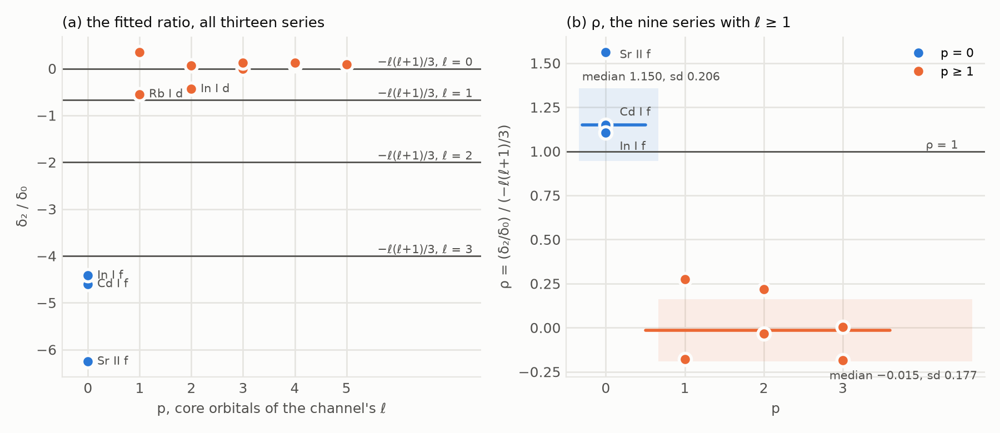
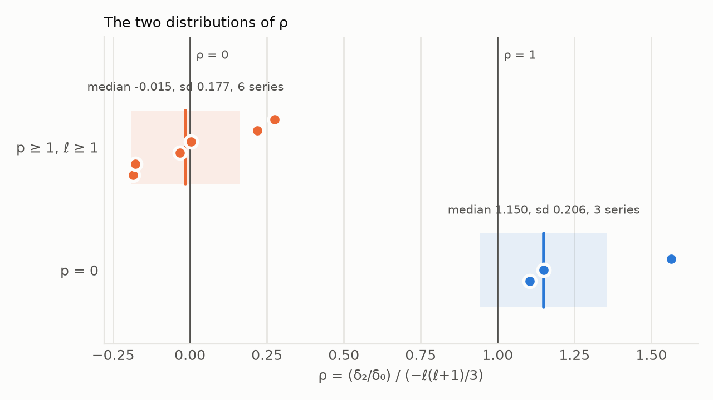
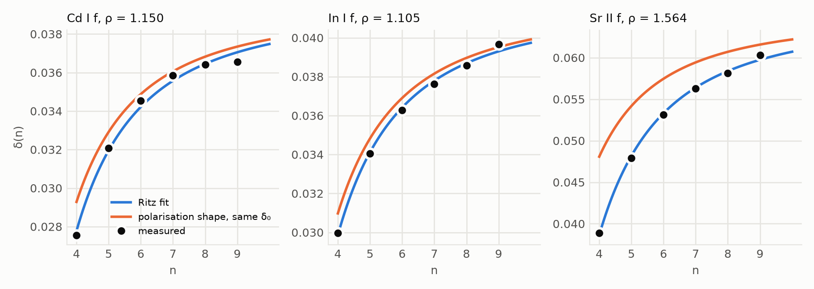

# The Domain of the Polarisation Ratio δ₂/δ₀ = −ℓ(ℓ+1)/3: a Necessary Condition from the Core Configuration, Tested on Thirteen Rydberg Series

**The first-order polarisation relation between the two Ritz coefficients of a Rydberg channel, δ₂/δ₀ = −ℓ(ℓ+1)/3, presupposes a non-penetrating channel; p = 0 — no occupied subshell of the channel's ℓ in the core's ground configuration — is a necessary condition for that, not a sufficient one, and on the three series here that satisfy it below the orbital-collapse threshold the relation holds to a median 15%, while on the six penetrating series with ℓ ≥ 1 its ratio scatters about zero.**

**Matthew Lach** · Independent Researcher · 24 September 2026

---

## Abstract

A Rydberg series converging on an ionic core has a quantum defect δ(n) that is not one number but a curve, δ(n) = δ₀ + δ₂/(n − δ₀)². When the running electron does not enter the core, the leading interaction beyond the Coulomb tail is the core's dipole polarisation, and first-order perturbation theory fixes the ratio of the two coefficients without a free parameter: δ₂/δ₀ = −ℓ(ℓ+1)/3. The relation is standard; this paper states it, derives it from the hydrogenic expectation value ⟨r⁻⁴⟩ through the Kramers–Pasternack recursion, and tests it on thirteen Rydberg series of Cd I, In I, Rb I and Sr II fitted from the NIST level tables by an exact, scan-certified least-squares procedure. The series are split by p, the number of occupied subshells of the channel's orbital angular momentum ℓ in the ground configuration of the core. Writing ρ for the fitted ratio divided by −ℓ(ℓ+1)/3, the three series with p = 0 give median ρ = 1.150 with population standard deviation 0.206; the six series with p ≥ 1 and ℓ ≥ 1 give median ρ = −0.015 with standard deviation 0.177; the four s series have polarisation value 0 and no ratio. The paper's claim about the domain is a necessary condition: p ≥ 1 puts a channel outside the relation's hypothesis, and the relation carries no information there. p = 0 alone is not sufficient, because a p = 0 orbital that has collapsed into the core penetrates; the three p = 0 series here are nf series on cores well below the 4f collapse threshold, and the criterion the paper states is p = 0 together with that condition. Two further results ride on the same fit: the sign of δ₂ follows p — negative on every p = 0 series, positive on every series with p ≥ 4 — and the quadrupole polarisation term, whose n-dependence is derived here, pushes ρ above 1, which is the side on which all three p = 0 values lie. The paper states what the split establishes and what a sample of thirteen series cannot: on these four cores p = 0 and ℓ ≥ 3 are the same partition, and every p = 0 series is an nf series, the lowest ℓ at which the polarisation model can be tried on these cores.

---

## §0 · The result

**The polarisation ratio is defined on non-penetrating channels only; p = 0 is necessary for that, and where p ≥ 1 the relation makes no prediction.**

A quantum defect measures how far a Rydberg orbital penetrates its ionic core. For a non-penetrating orbital the core is felt only through its polarisability, and the leading correction to the hydrogenic energy is the expectation value of −α/(2r⁴), α the core's static dipole polarisability. Because ⟨r⁻⁴⟩ in a hydrogenic state is (3n² − ℓ(ℓ+1))/n⁵ times a function of ℓ alone, and the defect is n³ times the energy shift (in units set out in §1), the defect has the form δ₀ + δ₂/n² with δ₂/δ₀ = −ℓ(ℓ+1)/3 — the polarisability cancels, the core charge cancels, and nothing is left to fit. That is the relation tested here (Theorem 1, PROVED, and MACHINE-CHECKED from its premise).

Measured on thirteen series from four cores (Table 1), with ρ the fitted ratio divided by −ℓ(ℓ+1)/3:

| class | series | ρ defined | median ρ | population sd |
|---|---|---|---|---|
| **p = 0** | 3 | 3 | **1.150** | 0.206 |
| **p ≥ 1** (penetrating) | 10 | 6 | **−0.015** | 0.177 |

On the p = 0 branch the relation holds to 15% at the median, the three values being 1.105, 1.150 and 1.564. On the penetrating branch ρ is centred on zero with a spread of 0.18: the fitted curvature bears no relation, in sign or in size, to the polarisation value. The four series with ℓ = 0 are penetrating and have polarisation value 0, so ρ is undefined for them; they are counted in the ten and excluded from the six.

**What is established.** Three things, each stated with its status in §6. (i) A necessary condition, read off the core's ground configuration: where the core holds an occupied subshell of the channel's ℓ (p ≥ 1), the Rydberg orbital carries radial nodes inside the core, the short-range interaction sets the defect, and the relation's hypothesis fails. A ratio measured there is a number about the sample and not a test of the relation; the six penetrating ratios are the measurement of that silence. (ii) An exact, reproducible fit of thirteen series with its sensitivities stated, on which the three p = 0 series, all nf on cores of nuclear charge 37 to 49, give ρ within a factor 1.6 of 1 and all on the same side of it. (iii) A sign rule: the sign of δ₂ follows p, not ℓ.

**What is not claimed.** That p = 0 suffices. A p = 0 orbital can collapse into the core — the 3d orbital does so at the onset of the first transition series and the 4f orbital at the onset of the lanthanides (Goeppert-Mayer 1941; Griffin, Andrew and Cowan 1969, CITED) — and a collapsed p = 0 channel penetrates. The class on which the paper's positive result is claimed is therefore p = 0 *and* uncollapsed (D4), and the three series that satisfy it sit well below the 4f threshold. Nor is any priority claimed for Theorem 1 or for its domain: the n-dependent polarisation defect and its restriction to non-penetrating series are the standard account (§2, Provenance). What the paper adds is the criterion in p, the fit with its accounting, and the sign rule.

**A second measurement rides on the same fit.** The sign of δ₂ follows p, not ℓ: all three p = 0 series have δ₂ < 0, all four series with p ≥ 4 have δ₂ > 0, and the two series at each of p = 1, 2, 3 split one and one. The fraction with positive δ₂ is non-decreasing in p across the six values p takes.

**What is not established.** The p = 0 class has three members, all with ℓ = 3, and on these four cores p = 0 holds exactly when ℓ ≥ 3, so the sample cannot distinguish a domain stated in p from one stated in ℓ. ℓ = 3 is the lowest ℓ at which the polarisation model can be tried on these cores and the ℓ at which it is least accurate: the corrections outside the first-order dipole term — the quadrupole term (Lemma 4), second-order dipole terms and the residual overlap of an f orbital with a 4d¹⁰ or 4p⁶ core — are all largest there, and departures of 10 to 56% are of the size to be expected at nf. The spread of 0.206 is a population standard deviation of three numbers; leaving out the lowest member of each series moves ρ by 0.05 to 0.10 (§4). And the penetrating-branch result is not a refutation of anything: a relation whose hypothesis fails makes no prediction.

**Status words.** Five are used and never merged.

| status | meaning |
|---|---|
| **PROVED** | a derivation is written out below and every step is justified; the algebraic identities are verified exactly on a grid exceeding their degree |
| **EXHAUSTIVE** | a decision procedure visited every case in a stated finite family |
| **MACHINE-CHECKED** | Z3 returned unsat on the negation of an obligation over a named box, with both guards passed |
| **CITED** | taken from the literature or from a public database, with the source |
| **MEASURED** | a number computed from the cited data by the stated procedure; the paper's own result, with its sample stated |

SAMPLED is not among them, and deliberately: no claim in this paper rests on a pseudorandom sweep. The one randomised step anywhere in the verification is a guard on the machine checks (§6), seeded and named there, not a result.

---

## §1 · Definitions

**D1 (Rydberg channel, quantum defect).** A Rydberg channel is a sequence of bound levels of one species, one orbital angular momentum ℓ and one parent term of the ionic core, with principal quantum number n running and energies Eₙ (in cm⁻¹ above the ground level) converging on the ionisation limit I of that parent. The core charge is z (1 for a neutral atom, 2 for a singly charged ion). The effective quantum number and the quantum defect of the level n are

> n∗ = z √( Rₘ / (I − Eₙ) ),  δₙ = n − n∗,

with Rₘ the Rydberg constant for the reduced mass of the electron and the ion core. Throughout, Rₘ = R∞ / (1 + 1/(A·1836.15267343)) with R∞ = 109737.31568 cm⁻¹, 1836.15267343 the proton-to-electron mass ratio, and A the mass in unified atomic mass units given with Table 1 — the standard atomic weights of Cd and In and the ⁸⁵Rb and ⁸⁸Sr isotope masses — so that the core mass is taken as A proton masses. The four values of Rₘ used are printed with Table 1 so that a reader may substitute another convention; the choice moves every δ by a few parts in 10⁷ and ρ not at all at the precision printed.

**D2 (Ritz curve, δ₀ and δ₂).** A channel's defect is fitted by

> δ(n) = δ₀ + δ₂ / (n − δ₀)²,

the two-term Ritz expansion (Ritz 1903, CITED), by unweighted least squares over the channel's members. δ₀ is the limit value and δ₂ the curvature. The fit is defined for channels with at least four members. For fixed δ₀ the model is linear in δ₂, so the minimiser is found as the minimum of a one-variable function; §4 states how it is located and certified.

**D3 (core, and the count p).** The core of a channel is the ion on whose state the series converges. Its ground configuration is a list of occupied subshells. For the channel's ℓ,

> p := the number of occupied subshells of orbital angular momentum ℓ in the core's ground configuration.

p is the number of radial nodes the Rydberg orbital is forced to carry inside the core by orthogonality to the core's own orbitals of that ℓ. A channel with p ≥ 1 is called **penetrating** here. Table 1 lists the core and p for every series used.

**D4 (the non-penetrating class).** A p = 0 channel is **uncollapsed** when the core's nuclear charge lies below the threshold at which the lowest orbital of the channel's ℓ contracts abruptly into the core — near Z = 21 for 3d, the onset of the first transition series, and near Z = 57 for 4f, the onset of the lanthanides (Goeppert-Mayer 1941; Griffin, Andrew and Cowan 1969, CITED); a p = 0 channel at or beyond that threshold is **collapsed**, and a collapsed orbital penetrates. The class on which the polarisation model's hypothesis is taken to hold in this paper is

> **N := p = 0 and uncollapsed.**

p = 0 is necessary for membership of N and not sufficient. The four cores of this paper have nuclear charges 37, 38, 48 and 49, all below 57, so every p = 0 channel here (all at ℓ = 3) is in N. The operational witness of the class is a small limit defect: the three N series have δ₀ ≤ 0.065 (Table 3).

**D5 (the polarisation model).** Outside the core the running electron moves in the Coulomb field of charge z and, to leading order in the core's static dipole polarisability α (in units of a₀³), in the additional potential V = −α/(2r⁴) (atomic units). The model treats V in first-order perturbation theory on the hydrogenic state (n, ℓ) of charge z. Its extension by the core's quadrupole polarisability β (units a₀⁵) adds the term −β/(2r⁶), treated the same way (Lemma 4).

**D6 (the ratio ρ).** For a channel with ℓ ≥ 1 and δ₀ ≠ 0,

> ρ := (δ₂/δ₀) / ( −ℓ(ℓ+1)/3 ).

ρ = 1 is exact agreement with the polarisation model (Theorem 1). For ℓ = 0 the formal value of −ℓ(ℓ+1)/3 is 0, the model itself does not apply (K(0) = 0 and ⟨r⁻⁴⟩ diverges), and ρ is undefined.

**D7 (the class statistics).** For each class of series the statistic reported is the median of ρ over the series with ρ defined, and the population standard deviation (divisor N, not N − 1) of the same values. The mean and the sample standard deviation are printed beside them in §4 and are not the headline figures.

**Notation.** K(ℓ) := ℓ(ℓ+1)(2ℓ−1)(2ℓ+1)(2ℓ+3), and L := ℓ(ℓ+1) where it shortens a formula. Atomic units — ħ = mₑ = e = 4πε₀ = 1, lengths in Bohr radii a₀, energies in hartrees — are used in §2; the data of §3 are in cm⁻¹. ⟨rˢ⟩ is the expectation value of rˢ in the hydrogenic state (n, ℓ) of unit charge unless the charge is stated.

---

## §2 · The polarisation relation

**Lemma 1 (the hydrogenic ⟨r⁻⁴⟩).** For the hydrogenic state (n, ℓ) of unit charge, ℓ ≥ 1,

> ⟨r⁻⁴⟩ = [3n² − ℓ(ℓ+1)] / [ 2n⁵ (ℓ+3/2)(ℓ+1)(ℓ+1/2) ℓ (ℓ−1/2) ]  =  4 [3n² − ℓ(ℓ+1)] / ( n⁵ K(ℓ) ).

For a core of charge z, ⟨r⁻⁴⟩ is z⁴ times the unit-charge value.

*Proof.* Two inputs are taken from the literature. (a) The Kramers–Pasternack recursion (Pasternack 1937, CITED): for the hydrogenic state (n, ℓ) of unit charge and every integer s with s > −2ℓ − 1,

> (s+1)/n² · ⟨rˢ⟩ − (2s+1) ⟨rˢ⁻¹⟩ + (s/4) [(2ℓ+1)² − s²] ⟨rˢ⁻²⟩ = 0.

The second input, (b), is ⟨r⁻²⟩ = 1/(n³(ℓ+½)) (Bethe and Salpeter 1957, CITED). At s = −1 the recursion reads ⟨r⁻²⟩ − ¼[(2ℓ+1)² − 1]⟨r⁻³⟩ = 0, and ¼[(2ℓ+1)² − 1] = ℓ(ℓ+1), so ⟨r⁻³⟩ = ⟨r⁻²⟩/(ℓ(ℓ+1)) = 1/(n³ ℓ(ℓ+½)(ℓ+1)). At s = −2, admissible for ℓ ≥ 1 since −2 > −2ℓ − 1, it reads −⟨r⁻²⟩/n² + 3⟨r⁻³⟩ − ½[(2ℓ+1)² − 4]⟨r⁻⁴⟩ = 0, and (2ℓ+1)² − 4 = (2ℓ−1)(2ℓ+3), so

> ⟨r⁻⁴⟩ = 2 [3⟨r⁻³⟩ − ⟨r⁻²⟩/n²] / ((2ℓ−1)(2ℓ+3)).

Substituting (b) and the ⟨r⁻³⟩ just found, 3⟨r⁻³⟩ − ⟨r⁻²⟩/n² = [3 − ℓ(ℓ+1)/n²] / (n³ ℓ(ℓ+½)(ℓ+1)) = [3n² − ℓ(ℓ+1)] / (n⁵ ℓ(ℓ+½)(ℓ+1)), hence ⟨r⁻⁴⟩ = 2[3n² − ℓ(ℓ+1)] / (n⁵ ℓ(ℓ+½)(ℓ+1)(2ℓ−1)(2ℓ+3)); since ℓ+½ = (2ℓ+1)/2 the denominator is n⁵K(ℓ)/2, which is the second form. The first form follows from 2(ℓ+3/2)(ℓ+½)(ℓ−½) = (2ℓ+3)(2ℓ+1)(2ℓ−1)/4. The scaling in z follows from r → r/z in the radial function. ∎ **PROVED** given (a) and (b), each CITED. Each step is also verified exactly: the radial function is N rˡ exp(−r/n) times the generalised Laguerre polynomial of degree n − ℓ − 1 and upper index 2ℓ + 1 in 2r/n, so every ⟨rˢ⟩ with s ≥ −2ℓ − 2 is a finite sum of integrals of rᵏ exp(−2r/n) over r ≥ 0 with k ≥ 0, each equal to k! (n/2)ᵏ⁺¹, and is a rational number computable exactly from the Laguerre coefficients. Computed that way, the recursion (a) holds at every (n, ℓ, s) with 2 ≤ n ≤ 12, 1 ≤ ℓ ≤ n − 1 and −2ℓ ≤ s ≤ 4 (902 triples); (b), ⟨r⁻¹⟩ = 1/n², the ⟨r⁻³⟩ above and the closed form of the lemma each hold on every (n, ℓ) with 2 ≤ n ≤ 30 and 1 ≤ ℓ ≤ n − 1 (435 states); and the algebra from the recursion to the closed form is an identity in n and ℓ verified on a rational grid above its degree (56 points). **EXHAUSTIVE** on those families.

**Lemma 2 (the defect is the first-order energy shift, exactly).** Let E(n, δ) = −z²/(2(n−δ)²) be the term energy of a level with defect δ (atomic units). Then, as an identity in n, δ and z,

> E(n, δ) − E(n, 0) = − z² δ (2n − δ) / ( 2n² (n − δ)² ).

Consequently, if a perturbation shifts the hydrogenic level by ΔE, the defect that reproduces the shifted energy satisfies

> δ = −(n³/z²) ΔE · 2(n−δ)² / ( n(2n−δ) ),  with  2(n−δ)²/(n(2n−δ)) = 1 − (3nδ − 2δ²)/(n(2n−δ)) = 1 + O(δ/n);

so to first order in the perturbation δ = −(n³/z²) ΔE.

*Proof.* Put both sides of the first identity over the common denominator 2n²(n−δ)²: the left is z²[(n−δ)² − n²] / (2n²(n−δ)²) = z²(−2nδ + δ²)/(2n²(n−δ)²), which is the right. After clearing the denominator the identity is polynomial of degree 2 in each of n, δ and z; it is verified exactly on a 4 × 4 × 4 grid of rationals, which exceeds the degree in every variable, and a polynomial vanishing on such a grid is identically zero. For the rearrangement, write ΔE for the left side; then ΔE = −z²δ(2n−δ)/(2n²(n−δ)²) and, provided n ≠ δ and 2n ≠ δ, δ = −ΔE · 2n²(n−δ)²/(z²(2n−δ)) = −(n³/z²) ΔE · 2(n−δ)²/(n(2n−δ)). The expansion of the factor follows from n(2n−δ) − 2(n−δ)² = 3nδ − 2δ². Both the rearrangement and the expansion are polynomial identities after clearing denominators (degree 6 in n, 4 in δ, 2 in z, and 2 in n, 2 in δ), verified exactly on grids above those degrees, 121 points in all. ∎ **PROVED.**

**Theorem 1 (the polarisation ratio).** In the dipole polarisation model (D5), the quantum defect of a non-penetrating channel (ℓ ≥ 1) of a core of charge z and polarisability α is, to first order in α,

> δ(n) = 6 α z² / K(ℓ)  −  2 α z² ℓ(ℓ+1) / ( K(ℓ) n² )  =:  c₀ + c₂/n²,

and therefore

> c₂ / c₀ = − ℓ(ℓ+1) / 3,

independent of α, of z and of n. If α > 0 then c₀ > 0 and c₂ < 0.

*Proof.* First-order perturbation theory gives ΔE = ⟨V⟩ = −(α/2) z⁴ ⟨r⁻⁴⟩ (Lemma 1, with the z-scaling). Lemma 2 gives, to first order, δ = −(n³/z²)ΔE = (α/2) z² n³ ⟨r⁻⁴⟩. Substituting Lemma 1,

> δ = (α/2) z² n³ · 4[3n² − ℓ(ℓ+1)]/(n⁵ K(ℓ)) = 2 α z² [3 − ℓ(ℓ+1)/n²] / K(ℓ),

which is the displayed form with c₀ = 6αz²/K(ℓ) and c₂ = −2αz²ℓ(ℓ+1)/K(ℓ). Their ratio is −ℓ(ℓ+1)/3. K(ℓ) > 0 for ℓ ≥ 1, so the signs follow from the sign of α. The identity (α/2) z² n³ ⟨r⁻⁴⟩ = c₀ + c₂/n² is verified exactly for every state of Lemma 1's family with n ≤ 20 on a grid of α and z above the degree, 2,280 points in all. ∎ **PROVED**; and **MACHINE-CHECKED** from the premise rather than the conclusion: for each ℓ ∈ {1, …, 8}, with the term D(n) := (α/2) z² n³ · 4[3n² − ℓ(ℓ+1)]/(n⁵K(ℓ)) declared to Z3, and c₂ := (D(n₁) − D(n₂))/(1/n₁² − 1/n₂²), c₀ := D(n₁) − c₂/n₁² the affine-in-1/n² coefficients that any two points determine, Z3 returns unsat on the negation of "for all real α, z and all real n₁, n₂, n₃ ≥ 2 with n₁ ≠ n₂: 3c₂ = −ℓ(ℓ+1)c₀, D(n₃) = c₀ + c₂/n₃², and α > 0 ∧ z ≠ 0 ⇒ c₀ > 0 ∧ c₂ < 0", eight obligations. The hypothesis is satisfiable (non-vacuity), and the Z3 term D(n), evaluated at 200 seeded pseudorandom rational (α, z, n, ℓ) (seed 5), equals (α/2) z² n³ times ⟨r⁻⁴⟩ computed by the Laguerre integral of Lemma 1 — an implementation that shares no formula with the encoding — with no disagreement (encoding fidelity). The prefactor 6/K(ℓ) = (3/4)/[(ℓ−½)ℓ(ℓ+½)(ℓ+1)(ℓ+3/2)] is a polynomial identity of degree 5 in ℓ, verified at 200 values of ℓ, so c₀ is the familiar 3αz²/(4ℓ⁵) at large ℓ; ℓ⁵·6/K(ℓ) is below 3/4 and strictly increasing at every ℓ from 1 to 200, where it reaches 0.740718. The ratio does not depend on the prefactor.

**Provenance.** The first-order polarisation formula is old. It is the "conventional formula" for the polarisation shift that Van Vleck and Whitelaw (1933) refine; it is what Mayer and Mayer (1933) invert to extract ionic polarisabilities from spectra, and it rests on the identification of core polarisation as the origin of the high-ℓ defect by Born and Heisenberg (1924); it is the standard account of non-penetrating series in Edlén (1964); and its extension by the quadrupole term is tested on the sodium ng series by Freeman and Kleppner (1976). Since ⟨r⁻⁴⟩ carries the factor 3n² − ℓ(ℓ+1), the ratio −ℓ(ℓ+1)/3 is a property of that formula and not a separate result, and every one of those treatments introduces the formula for non-penetrating series only. The paper derives the ratio because the derivation is short and its independence of α and z is the whole content of the test. Seaton (1958) is cited for the quantum defect method in whose terms δ(n) is used, Seaton (1983) for its multichannel form, and Drake and Swainson (1991) for the second-order polarisation corrections that lie outside Theorem 1. No priority is claimed for Theorem 1 or for its domain.

**The prefactor.** The unpublished working text this paper was drawn from prints the limit defect as 3αz²/K(ℓ), with the same K(ℓ); Theorem 1 gives 6αz²/K(ℓ), twice that. The ratio does not depend on the prefactor, so nothing above turns on which is right, but the two cannot both be the polarisation model, and the question is settled here on a series outside this paper's sample, against numbers that come from no fit of the kind in §4. For the Rb ng series the measured defect is δ_g = 0.00405(6) at n = 30 (Afrousheh, Bohlouli-Zanjani, Petrus and Martin 2006, CITED); the dipole polarisability of Rb⁺ is 9.116(9) a₀³ from the ng → nh, ni intervals (Berl, Sackett, Gallagher and Nunkaew 2020, CITED) and 9.11 a₀³ from relativistic coupled-cluster theory, which owes nothing to any quantum defect (Lim, Laerdahl and Schwerdtfeger 2000, CITED). With K(4) = 13,860 and z = 1, Theorem 1's c₀ = 6α/K(4) is 0.003946 at α = 9.116 and 0.003944 at α = 9.11; the alternative 3α/K(4) is 0.001973. The measured defect is 2.6% above the first and 2.05 times the second. The residue is the size of the terms Theorem 1 omits: carrying c₂/n² to n = 30 and the first-order quadrupole shift of Lemma 4 with α_q = 38.4(6) a₀⁵ (Berl et al. 2020, CITED), the model gives 0.004080, within the stated uncertainty of the measurement; the same arithmetic on 3α/K(4) gives 0.002121. The arithmetic is exact and is printed by the check (**MEASURED**, on CITED inputs), and the 3/K form carried through it is a negative control of the self-test. That text's own instrument inverts its formula to extract α from fitted limits, so every polarisability it reports is twice the value in the literature's units; the "α implied" column of Table 3 uses Theorem 1's form.

**Lemma 3 (the Ritz denominator).** The fit of D2 uses (n − δ₀)² where Theorem 1 has n². As an identity,

> δ₂/(n−δ₀)² − δ₂/n² = δ₂ δ₀ (2n − δ₀) / ( n² (n−δ₀)² ),

and in the polarisation model δ₀ and δ₂ are both first order in α, so the difference is second order. The Ritz coefficient ratio therefore equals −ℓ(ℓ+1)/3 to the same order as Theorem 1; the physical reason is that the hydrogenic expectation value belongs to the effective quantum number, and n − δ₀ is the effective quantum number to first order.

*Proof.* Common denominator: δ₂[n² − (n−δ₀)²]/(n²(n−δ₀)²) = δ₂(2nδ₀ − δ₀²)/(n²(n−δ₀)²). After clearing the denominator the identity is polynomial of degree 2 in n, 2 in δ₀ and 1 in δ₂ and is verified exactly on a 4 × 5 × 3 grid, above the degree in every variable. ∎ **PROVED.** The measured size of the effect on this sample is given in §4.

**Lemma 4 (the quadrupole term's shape).** For the hydrogenic state (n, ℓ) of unit charge with ℓ ≥ 2, writing L = ℓ(ℓ+1),

> ⟨r⁻⁵⟩ = 4 (5n² − 3L + 1) / ( n⁵ K(ℓ) (L−2) ),  ⟨r⁻⁶⟩ = 4 [35n⁴ − 5(6L−5)n² + 3L(L−2)] / ( n⁷ K(ℓ) (L−2)(4L−15) ).

Consequently, in the model of D5 extended by the quadrupole potential −β/(2r⁶), the first-order quadrupole contribution to the defect is q₀ + q₂/n² + q₄/n⁴ with

> q₂/q₀ = −(6L−5)/7,

which is −31/7 at ℓ = 2 and −67/7 = −9.571 at ℓ = 3, and q₀ has the sign of β.

*Proof.* The recursion of Lemma 1 at s = −3 and s = −4 is admissible for ℓ ≥ 2 (−4 > −2ℓ − 1). At s = −3: −2⟨r⁻³⟩/n² + 5⟨r⁻⁴⟩ − ¾[(2ℓ+1)² − 9]⟨r⁻⁵⟩ = 0, and (2ℓ+1)² − 9 = 4(L−2), so ⟨r⁻⁵⟩ = [5⟨r⁻⁴⟩ − 2⟨r⁻³⟩/n²]/(3(L−2)). With ⟨r⁻³⟩ = 2/(n³L(2ℓ+1)) and ⟨r⁻⁴⟩ = 4(3n² − L)/(n⁵K(ℓ)) from Lemma 1, and (2ℓ−1)(2ℓ+3) = 4L − 3, the bracket is [20(3n² − L) − 4(4L − 3)]/(n⁵K(ℓ)) = 12(5n² − 3L + 1)/(n⁵K(ℓ)), which gives the first closed form. At s = −4: −3⟨r⁻⁴⟩/n² + 7⟨r⁻⁵⟩ − [(2ℓ+1)² − 16]⟨r⁻⁶⟩ = 0, and (2ℓ+1)² − 16 = 4L − 15, so ⟨r⁻⁶⟩ = [7⟨r⁻⁵⟩ − 3⟨r⁻⁴⟩/n²]/(4L−15); substituting the two closed forms, the numerator over the common denominator n⁷K(ℓ)(L−2) is 28n²(5n² − 3L + 1) − 12(3n² − L)(L−2) = 140n⁴ − 20(6L−5)n² + 12L(L−2), which is 4 times the bracket displayed. Both closed forms hold exactly, by the Laguerre integral, on every (n, ℓ) with 2 ≤ n ≤ 30 and 2 ≤ ℓ ≤ n − 1 (406 states), and the algebra from the recursion to them is an identity in n and ℓ verified on a rational grid above its degree (90 points). For the defect: ΔE = −(β/2) z⁶ ⟨r⁻⁶⟩ and, by Lemma 2 to first order, δ = −(n³/z²)ΔE = (β/2) z⁴ n³ ⟨r⁻⁶⟩ = 2βz⁴[35 − 5(6L−5)/n² + 3L(L−2)/n⁴]/(K(ℓ)(L−2)(4L−15)); the ratio of the n⁻² coefficient to the constant is −5(6L−5)/35 = −(6L−5)/7, and K(ℓ), L−2 and 4L−15 are positive for ℓ ≥ 2. ∎ **PROVED** given the recursion (CITED); **EXHAUSTIVE** on the families named.

**Corollary 1 (the direction of the quadrupole correction).** For ℓ ≥ 2 the quadrupole ratio −(6L−5)/7 lies below the dipole ratio −L/3, since 3(6L−5) > 7L ⇔ 11L > 15. Hence for any c₀ > 0 and q₀ > 0 the n⁻² coefficient ratio of the combined constant and n⁻² terms, (−(L/3)c₀ − ((6L−5)/7)q₀)/(c₀ + q₀), lies strictly between the two and its ratio to −L/3 exceeds 1: at the level of the coefficients, a positive quadrupole polarisability pushes ρ above 1. **MACHINE-CHECKED**: for each ℓ ∈ {2, …, 8}, Z3 returns unsat on the negation of that statement over all real c₀ > 0, q₀ > 0, seven obligations; the hypothesis is satisfiable, and the Z3 ratio term agrees with exact rational arithmetic at 200 seeded pseudorandom points (seed 5). What the corollary does not settle is the effect of the q₄/n⁴ term, which a two-term fit absorbs into both coefficients; the paper does not measure that here.

---

## §3 · The data

**Provenance.** Every level is taken from the NIST Atomic Spectra Database (Kramida, Ralchenko, Reader and the NIST ASD Team, version 5.12), retrieved on 8 August 2026 (Cd I), 9 August (Rb I and Sr II) and 14 August (In I), CITED. The ionisation limits are the tabulated limits of the parent ions (Cd II 5s ²S₁/₂, In II 5s² ¹S₀, Rb II ¹S₀, Sr III ¹S₀); none is fitted from its own series. The masses are the standard atomic weights of Cd and In and the ⁸⁵Rb and ⁸⁸Sr isotope masses (D1). The series and their members are those the tables resolve without a perturber crossing the fitted range; §5 names the one series whose residual says otherwise. Seventy-nine of the eighty levels of Table 2 were confirmed level by level against a second capture of the same tables — a guard against transcription, not independent evidence of the levels; the eightieth, Cd I 5s5p ¹P°₁ at 43692.384 cm⁻¹, lies below the lowest member that capture carries and was taken from the tables directly.

**The four cores.** Cd I converges on Cd⁺, ground configuration [Kr] 4d¹⁰ 5s (nuclear charge 48); In I on In⁺, [Kr] 4d¹⁰ 5s² (49); Rb I on Rb⁺ (37) and Sr II on Sr²⁺ (38), both [Kr] = 1s² 2s² 2p⁶ 3s² 3p⁶ 3d¹⁰ 4s² 4p⁶. Counting occupied subshells by ℓ gives p for s, p, d, f of (5, 3, 2, 0) for the two cadmium-like cores and (4, 3, 1, 0) for the two krypton-like cores. On all four, p = 0 exactly when ℓ ≥ 3, and every core lies below the 4f collapse threshold (D4).

| series | core | ℓ | p | z | n | N | I (cm⁻¹) |
|---|---|---|---|---|---|---|---|
| Cd I f | Cd⁺ | 3 | 0 | 1 | 4–9 | 6 | 72540.050 |
| In I f | In⁺ | 3 | 0 | 1 | 4–9 | 6 | 46670.107 |
| Sr II f | Sr²⁺ | 3 | 0 | 2 | 4–9 | 6 | 88965.180 |
| Rb I d | Rb⁺ | 2 | 1 | 1 | 5–10 | 6 | 33690.810 |
| Sr II d | Sr²⁺ | 2 | 1 | 2 | 5–10 | 6 | 88965.180 |
| Cd I d | Cd⁺ | 2 | 2 | 1 | 5–11 | 7 | 72540.050 |
| In I d | In⁺ | 2 | 2 | 1 | 5–10 | 6 | 46670.107 |
| Cd I p | Cd⁺ | 1 | 3 | 1 | 5–8 | 4 | 72540.050 |
| Rb I p | Rb⁺ | 1 | 3 | 1 | 6–11 | 6 | 33690.810 |
| Rb I s | Rb⁺ | 0 | 4 | 1 | 6–12 | 7 | 33690.810 |
| Sr II s | Sr²⁺ | 0 | 4 | 2 | 6–11 | 6 | 88965.180 |
| Cd I s | Cd⁺ | 0 | 5 | 1 | 6–12 | 7 | 72540.050 |
| In I s | In⁺ | 0 | 5 | 1 | 6–12 | 7 | 46670.107 |

**Table 1.** The thirteen series. z is the core charge, N the number of members and I the limit; the cores' ground configurations are given in the text above. The mass A and the Rydberg constant Rₘ of D1 depend on the core alone: Cd⁺, A = 112.41, Rₘ = 109736.784 cm⁻¹; In⁺, 114.82, 109736.795; Rb⁺, 84.912, 109736.612; Sr²⁺, 87.906, 109736.636.

Asymptotic defects for the s, p, d and f orbitals of every ionisation stage of every ion with Z ≤ 50 are tabulated by Theodosiou, Inokuti and Manson (1986), CITED, computed in a Hartree–Slater potential; the δ₀ of Table 3 is the same quantity, fitted here from the levels rather than computed. The series are single-parent, single-term series: Cd I ns ³S₁, np ¹P°₁, nd ³D₁, nf ³F°₃; In I ns ²S₁/₂, nd ²D₃/₂, nf ²F°; Rb I ns ²S₁/₂, np ²P°₁/₂, nd ²D₃/₂; Sr II ns ²S₁/₂, nd ²D₃/₂, nf ²F°. Eighty levels in all.

| series | n | E (cm⁻¹) | series | n | E (cm⁻¹) |
|---|---|---|---|---|---|
| Cd I s | 6 | 51483.980 | In I f | 7 | 44406.31 |
| Cd I s | 7 | 62563.435 | In I f | 8 | 44938.81 |
| Cd I s | 8 | 66682.029 | In I f | 9 | 45303.31 |
| Cd I s | 9 | 68682.325 | Rb I s | 6 | 20132.510 |
| Cd I s | 10 | 69806.814 | Rb I s | 7 | 26311.437 |
| Cd I s | 11 | 70502.04 | Rb I s | 8 | 29046.816 |
| Cd I s | 12 | 70961.993 | Rb I s | 9 | 30499.031 |
| Cd I p | 5 | 43692.384 | Rb I s | 10 | 31362.331 |
| Cd I p | 6 | 59907.28 | Rb I s | 11 | 31917.221 |
| Cd I p | 7 | 65501.412 | Rb I s | 12 | 32294.911 |
| Cd I p | 8 | 68059.393 | Rb I p | 6 | 23715.081 |
| Cd I d | 5 | 59485.768 | Rb I p | 7 | 27835.02 |
| Cd I d | 6 | 65353.372 | Rb I p | 8 | 29834.94 |
| Cd I d | 7 | 67989.814 | Rb I p | 9 | 30958.91 |
| Cd I d | 8 | 69400.900 | Rb I p | 10 | 31653.85 |
| Cd I d | 9 | 70244.09 | Rb I p | 11 | 32113.55 |
| Cd I d | 10 | 70787.850 | Rb I d | 5 | 25700.536 |
| Cd I d | 11 | 71158.957 | Rb I d | 6 | 28687.127 |
| Cd I f | 4 | 65586.0 | Rb I d | 7 | 30280.113 |
| Cd I f | 5 | 68093.7 | Rb I d | 8 | 31221.440 |
| Cd I f | 6 | 69456.4 | Rb I d | 9 | 31821.855 |
| Cd I f | 7 | 70277.4 | Rb I d | 10 | 32227.610 |
| Cd I f | 8 | 70809.7 | Sr II s | 6 | 47736.53 |
| Cd I f | 9 | 71174.2 | Sr II s | 7 | 64964.10 |
| In I s | 6 | 24372.957 | Sr II s | 8 | 73237.1 |
| In I s | 7 | 36301.864 | Sr II s | 9 | 77857.6 |
| In I s | 8 | 40636.98 | Sr II s | 10 | 80701.8 |
| In I s | 9 | 42719.02 | Sr II s | 11 | 82576.1 |
| In I s | 10 | 43881.26 | Sr II d | 5 | 53286.31 |
| In I s | 11 | 44595.86 | Sr II d | 6 | 67522.87 |
| In I s | 12 | 45067.19 | Sr II d | 7 | 74621.3 |
| In I d | 5 | 32892.230 | Sr II d | 8 | 78688.8 |
| In I d | 6 | 39048.53 | Sr II d | 9 | 81240.2 |
| In I d | 7 | 41836.41 | Sr II d | 10 | 82951.5 |
| In I d | 8 | 43335.93 | Sr II f | 4 | 60990.04 |
| In I d | 9 | 44234.70 | Sr II f | 5 | 71065.8 |
| In I d | 10 | 44815.06 | Sr II f | 6 | 76553.4 |
| In I f | 4 | 39707.59 | Sr II f | 7 | 79861.3 |
| In I f | 5 | 42220.25 | Sr II f | 8 | 82005.9 |
| In I f | 6 | 43584.66 | Sr II f | 9 | 83472.7 |

**Table 2.** The levels (cm⁻¹), CITED from NIST ASD, each printed to the precision at which the database quotes it.

---

## §4 · The measurement

**Procedure.** For each series the defects δₙ of D1 are computed with the square root taken to forty significant digits and every other operation exact. The least-squares problem of D2 is solved by profiling: for fixed δ₀ the optimal δ₂ is Σ rᵢwᵢ / Σ wᵢ² with rᵢ = δᵢ − δ₀ and wᵢ = (nᵢ − δ₀)⁻², and the residual sum S(δ₀) is an exact rational function. S is evaluated at 401 equally spaced points of [min δᵢ − 1, max δᵢ + 1], the upper end capped at n − ½ for the first member's n, the least is bracketed, and a ternary search of ninety exact steps narrows the bracket to below 10⁻¹⁷. The minimiser is scan-certified: S there is no greater than at every scanned point and at both ends of the final bracket, and each of the thirteen scans shows exactly one local minimum (the minimum and the maximum count over the thirteen are both 1). Each reported (δ₀, δ₂) is therefore the scan-certified least-squares solution of its series, not a converged iterate; as a cross-check, an unprofiled Gauss–Newton iteration in floating point from the start (mean δ, 0) reaches the same 26 coefficients to four decimals on all thirteen series.

| series | ℓ | p | δ₀ | δ₂ | δ₂/δ₀ | −ℓ(ℓ+1)/3 | ρ | rms | α implied |
|---|---|---|---|---|---|---|---|---|---|
| Cd I f | 3 | 0 | 0.0393 | −0.1808 | −4.6009 | −4.000 | 1.150 | 0.00029 | 24.76 |
| In I f | 3 | 0 | 0.0416 | −0.1838 | −4.4187 | −4.000 | 1.105 | 0.00019 | 26.20 |
| Sr II f | 3 | 0 | 0.0648 | −0.4054 | −6.2546 | −4.000 | 1.564 | 0.00031 | 10.21 |
| Rb I d | 2 | 1 | 1.3504 | −0.7418 | −0.5493 | −2.000 | 0.275 | 0.00057 | — |
| Sr II d | 2 | 1 | 1.4514 | +0.5152 | +0.3550 | −2.000 | −0.177 | 0.00114 | — |
| Cd I d | 2 | 2 | 2.0837 | +0.1403 | +0.0673 | −2.000 | −0.034 | 0.00041 | — |
| In I d | 2 | 2 | 2.3009 | −1.0075 | −0.4379 | −2.000 | 0.219 | 0.01755 | — |
| Cd I p | 1 | 3 | 3.0522 | −0.0082 | −0.0027 | −0.667 | 0.004 | 0.00083 | — |
| Rb I p | 1 | 3 | 2.6540 | +0.3258 | +0.1227 | −0.667 | −0.184 | 0.00017 | — |
| Rb I s | 0 | 4 | 3.1308 | +0.1980 | +0.0633 | 0.000 | — | 0.00019 | — |
| Sr II s | 0 | 4 | 2.7055 | +0.3394 | +0.1254 | 0.000 | — | 0.00048 | — |
| Cd I s | 0 | 5 | 3.6551 | +0.3354 | +0.0918 | 0.000 | — | 0.00096 | — |
| In I s | 0 | 5 | 3.7193 | +0.3168 | +0.0852 | 0.000 | — | 0.00141 | — |

**Table 3.** The fits. ρ is D6; rms is the root-mean-square residual of the fit in units of δ; for the p = 0 series, "α implied" is the dipole polarisability, in a₀³, that the fitted δ₀ implies through Theorem 1, δ₀K(ℓ)/(6z²); §5.7 sets the three against published values.

**Measurement 1 (the split).** With the classes of D3 and the statistics of D7:

> p = 0: 3 series, 3 with ρ defined — ρ = 1.105, 1.150, 1.564 — median **1.150**, population sd **0.206**;
> p ≥ 1: 10 series, 6 with ρ defined — ρ = −0.184, −0.177, −0.034, 0.004, 0.219, 0.275 — median **−0.015**, population sd **0.177**.

The means and sample standard deviations are 1.273 ± 0.253 and 0.017 ± 0.194. **MEASURED**, on the sample of Table 1.

**Robustness of the figures.** Leaving out one p = 0 series at a time moves the median to 1.334, 1.357 and 1.127 — with three points the median is one of the data. Leaving out the lowest member of each p = 0 series — the 4f level, where penetration, the quadrupole term and the difference between (n − δ₀)² and n∗² are all largest — and refitting the remaining five moves ρ from 1.150 to 1.051 (Cd I), from 1.105 to 1.154 (In I) and from 1.564 to 1.623 (Sr II); the honest statement of the Cd I result is the range 1.05 to 1.15 rather than a single value. The precision at which the levels are quoted matters less: moving each member in turn by half of one unit in its last quoted digit and summing the absolute changes in ρ gives 0.016 (Cd I, quoted to 0.1 cm⁻¹), 0.002 (In I, to 0.01 cm⁻¹) and 0.002 (Sr II). The limit matters more: the Cd II limit is published with an uncertainty of ±0.13 cm⁻¹, and refitting at the two ends moves ρ(Cd I f) to 1.120 and 1.180; a +0.1 cm⁻¹ shift in the limit moves ρ by +0.023 (Cd I), +0.022 (In I) and +0.003 (Sr II). Refitting every series with the denominator n² in place of (n − δ₀)² (Lemma 3) gives p = 0: median 1.175, sd 0.221; p ≥ 1: median −0.040, sd 0.547 — the p = 0 figures move by 0.03, the penetrating spread triples, because on a penetrating series δ₀ is of order 1 to 4 and the two denominators are no longer close. The reported figures are those of the Ritz form, which is the form in which the effective quantum number enters (Lemma 3). All of these are **MEASURED**.

**Measurement 2 (the sign of δ₂).** From Table 3, the number of series with δ₂ > 0 by p is: p = 0, 0 of 3; p = 1, 1 of 2; p = 2, 1 of 2; p = 3, 1 of 2; p = 4, 2 of 2; p = 5, 2 of 2. The fraction 0, ½, ½, ½, 1, 1 is non-decreasing in p. Theorem 1 requires δ₂ < 0 for a polarisation series and every p = 0 series obeys it; every series with p ≥ 4 has the opposite sign, which is the sign of a penetration series. The counts are **EXHAUSTIVE** over the thirteen series; the rule is **MEASURED** — a rule, not a law, since the sample at each p ≥ 1 is two series.

**Figure 1.** (a) The fitted ratio δ₂/δ₀ of all thirteen series against p, with the polarisation value −ℓ(ℓ+1)/3 drawn for ℓ = 0, 1, 2, 3. (b) ρ against p for the nine series with ℓ ≥ 1: the p = 0 class at median 1.150 with the ±0.206 band, the p ≥ 1 class at median −0.015 with the ±0.177 band.

**Figure 2.** The two distributions of ρ: three values at p = 0 (median 1.150, sd 0.206) and six at p ≥ 1, ℓ ≥ 1 (median −0.015, sd 0.177). The bands are one population standard deviation about the median.

**Figure 3.** The three p = 0 series with their Ritz fits and, for comparison, the curve of Theorem 1 with the same δ₀ (δ₂ = −4δ₀). The fitted curvature exceeds the polarisation value by 15%, 10% and 56%.

---

## §5 · What the split establishes, and what it does not

**1. The domain, as a necessary condition.** Theorem 1 is a theorem about a model whose hypothesis is that the running electron does not enter the core. Where p ≥ 1 the core holds an orbital of the electron's own ℓ, the Rydberg orbital is orthogonal to it and carries the corresponding radial nodes inside the core, and the short-range interaction — not the polarisation tail — sets the defect. Nothing in the derivation survives that, and Measurement 1's penetrating figure says so: the fitted curvature is of either sign and small against ℓ(ℓ+1)/3. A ratio reported on penetrating series, of whatever value, is a fact about those series and not a test of the relation. That penetration falls off with ℓ because the centrifugal barrier keeps the electron out of the core is the standard account (Edlén 1964, CITED); what D3 adds is that a necessary condition can be read off the core's ground configuration rather than from ℓ. It is not a sufficient condition. A p = 0 orbital can collapse into the core — 3d at the onset of the first transition series, 4f at the onset of the lanthanides (Goeppert-Mayer 1941; Griffin, Andrew and Cowan 1969) — and a collapsed nf series on a core at or beyond that threshold has a defect of order 1 and penetrates, though p = 0. The statement supported here is therefore: the relation is undefined where p ≥ 1, and defined on the class N of D4, p = 0 and uncollapsed, of which the three nf series on cores of nuclear charge 37 to 49 are members.

**2. What the N class establishes, and at which ℓ.** On the three series the fitted ratio is 15% above the polarisation value for Cd I, 10% above it for In I and 56% above it for Sr II; the median departure is 15%. The relation predicts the curvature of an f series from its limit value with no free parameter, and the prediction lands within a factor of 1.6 on all three. But ℓ = 3 is the marginal case. It is the lowest ℓ at which the model can be tried on these cores — every p = 0 channel here has ℓ ≥ 3 — and the ℓ at which the corrections to the first-order dipole term are largest: the quadrupole term, whose n-dependence Lemma 4 gives; second-order dipole terms (Drake and Swainson 1991); and, for an f orbital outside a 4d¹⁰ or 4p⁶ core, a residual overlap that is small but not zero. Of the three, one direction is derived: by Corollary 1 a positive quadrupole polarisability pushes ρ above 1 at the level of the coefficients, which is the side on which all three values lie. The directions of the other two are not determined here. The model also makes a prediction the ratio does not use — δ₀ = 6αz²/K(ℓ) from the core's polarisability — and Table 3 prints the α that each fitted δ₀ implies: 24.76 a₀³ for Cd⁺, 26.20 for In⁺ and 10.21 for Sr²⁺. That comparison is **not made** here: no published polarisability of these three ions was verified against its source for this paper, and a number is not printed on recollection. It is the check a reader should make next, from a compilation such as Mitroy, Safronova and Clark (2010); if the implied α of Sr²⁺ exceeds the published one, the series with ρ = 1.564 fails the model at the level of δ₀ before any ratio is taken, and its ρ is then an nf departure and not a fault of the relation. Sr II, with z = 2 and the largest δ₀ of the three, is one series, and the paper draws no more from it.

**3. What the sample cannot separate.** Every N series here has ℓ = 3, and on all four cores p = 0 holds exactly when ℓ ≥ 3 (§3). A domain stated as "p = 0" and one stated as "ℓ ≥ 3" coincide on this sample, and the data do not discriminate between them. Where p and ℓ part company is read from the ground configurations: p = 0 at ℓ = 2 on every core of 20 electrons or fewer — the argon-like core of K I and Ca II among them — where the krypton-like core of Rb I and Sr II gives p = 1; p ≥ 1 at ℓ = 3 on every core from 58 electrons upward, 51 cores in the configuration table, against p = 0 on the four here; and p = 0 at ℓ = 4 on every core in the table, since none holds a g orbital. None of the separating cases is in this sample, and the first is not a clean test: the cores with p = 0 at ℓ = 2 and a nuclear charge of 19 or 20 sit within two units of the 3d collapse threshold, and whether a d series on them is uncollapsed is a question for that measurement, not this one. The honest sentence is that the derivation's hypothesis is non-penetration, which neither p nor ℓ alone guarantees: p ≥ 1 refutes it, p = 0 below the collapse threshold is the paper's criterion for it, and ℓ ≥ 3 is what this sample tests.

**4. What three numbers cannot establish.** The population standard deviation of three values is a description of those three, and the median is one of them. The leave-one-out medians run from 1.127 to 1.357; the leave-lowest-member-out values run from 1.051 to 1.623. The paper reports 1.150 ± 0.206 because that is the statistic on the sample; it does not claim a confidence interval.

**5. Where the relation fails, and how a failure would show.**

- *Penetration, p ≥ 1.* The hypothesis fails; the relation makes no prediction.
- *Orbital collapse at p = 0.* At and beyond the threshold at which the lowest orbital of the channel's ℓ contracts into the core, a p = 0 series penetrates (D4). None of the four cores here is near the 4f threshold; a test of the relation on an nf series of a core in the lanthanides or beyond would be a test of collapse, not of the relation, and the criterion N excludes it.
- *ℓ = 0.* The polarisation value is 0 and the ratio is undefined. The four s series have δ₂/δ₀ between 0.06 and 0.13, all positive, which is the penetration sign.
- *The limit.* A shift ΔI in the ionisation limit changes δₙ by n∗³ ΔI / (2z²Rₘ), a term growing as n³ that the two-term Ritz fit absorbs into both coefficients. The estimate is exact to first order and holds on all eighty levels of Table 2 to better than one part in 10⁵ at ΔI = 0.01 cm⁻¹. The limits of Table 1 are tabulated, not fitted; the fit residuals of the three N series are 0.0002 to 0.0003 in δ; and the published ±0.13 cm⁻¹ on the Cd II limit moves ρ(Cd I f) between 1.120 and 1.180 (§4), which is the largest single sensitivity of that figure after the choice of members.
- *Perturbers.* A level of another channel crossing the series distorts δ(n) locally. In I nd is the one series in Table 3 whose residual, 0.01755, is an order of magnitude above the next largest, 0.00141, and its defect rises monotonically across its six members from 2.18 at n = 5 to 2.31 at n = 10; its ρ = 0.219 is in the penetrating class and does not enter the N figure.
- *Fields.* A residual growing as n∗⁷ is the signature of a magnetic field and one growing as n∗¹⁰ of an electric field (Gallagher 1994, CITED, for Rydberg atoms in fields). The highest member here is n = 12, and the residuals of Table 3 carry no such growth.
- *The quadrupole term.* Where the core's quadrupole polarisability is not negligible the defect acquires the terms of Lemma 4, the ratio is no longer −ℓ(ℓ+1)/3, and by Corollary 1 it moves to the ρ > 1 side; the size of the departure at ℓ = 3 is not measured here.

**6. The sign rule is a second, weaker result.** Measurement 2 is exhaustive on the sample and holds at every p, but at p = 1, 2, 3 it rests on two series each. Its content is that the sign of the second Ritz coefficient follows the penetration count and not the orbital angular momentum: the d series split by p (Rb I and Sr II at p = 1 against Cd I and In I at p = 2 give one sign each), and the s series at p = 4 and 5 are uniformly positive.

**7. The implied polarisabilities against published values, and the Rb fits against published coefficients.** The "α implied" column of Table 3 reads the core's dipole polarisability off the fitted δ₀ through Theorem 1. The published values are, CITED: Cd⁺ 25.2(6) a₀³, from relativistic coupled cluster with the measured dipole matrix elements substituted (Li, Yu and Sahoo 2018); In⁺ 24.33 a₀³ at 0.6%, by the finite-field coupled-cluster calculation of Yu, Suo, Feng, Fan and Liu (2015), beside the 24.01 a₀³ of Safronova and colleagues that they quote; Sr²⁺ 5.813 a₀³ by the relativistic random-phase approximation and 5.792 a₀³ by relativistic coupled cluster, both as tabulated by Mitroy, Safronova and Clark (2010). The implied values 24.76, 26.20 and 10.21 are 2% below the Cd⁺ value, 8% above the In⁺ value — the same excess the fitted ratio carries, 10% — and 1.76 times the Sr²⁺ value, on the series whose ρ is 1.56, so on the two series that satisfy the relation closely the limit defect returns the core's polarisability to within a few per cent, and on the one that does not it overstates it by the same margin that ρ does. Under the alternative prefactor 3αz²/K(ℓ) every implied value would double, to 49.5, 52.4 and 20.4 a₀³, none within a factor of 1.9 of its published value; the comparison decides the prefactor as §2 does. The Rb I fits are set against the published Rydberg–Ritz coefficients as a calibration of the procedure: for ⁸⁵Rb, δ₀ = 3.1311804(10) and δ₂ = 0.1784(6) for the ns series and δ₀ = 1.3480917(4), δ₂ = −0.6029(3) for nd₃/₂, 1.3464657(3), −0.5960(2) for nd₅/₂ (Li, Mourachko, Noel and Gallagher 2003, as tabulated by Mack and colleagues 2011, whose ⁸⁷Rb values agree with them to the third decimal of δ₂; CITED). The two-term fits of D2 on n ≤ 12 give δ₀ = 3.1308 and 1.3504 — within 4 × 10⁻⁴ of the published s limit and 2 × 10⁻³ to 4 × 10⁻³ of the two published d limits — and δ₂ = +0.198 and −0.742, 11% and 23–25% from the published values, which is the size of the higher-order Ritz terms a two-term fit over low n absorbs into δ₂ where the published fits use n ≥ 19 and n = 32–37. Both comparisons are exact arithmetic on CITED inputs and are printed by the check (**MEASURED**).

---

## §6 · Verification record

| object | PROVED | EXHAUSTIVE | MACHINE-CHECKED (Z3) | CITED / MEASURED |
|---|---|---|---|---|
| Lemma 1, ⟨r⁻⁴⟩ closed form | ✓ from the recursion and ⟨r⁻²⟩ | recursion on **902** (n, ℓ, s) triples, n ≤ 12; ⟨r⁻¹⟩, ⟨r⁻²⟩, ⟨r⁻³⟩ and ⟨r⁻⁴⟩ on **435 states**, n ≤ 30; the algebra on a 56-point grid | — | recursion CITED (Pasternack 1937); ⟨r⁻²⟩ CITED (Bethe and Salpeter 1957) |
| Lemma 2, the energy–defect identity and its rearrangement | ✓ | 64-point grid above degree (2, 2, 2); 121 points above degree for the rearranged factor and its expansion | — | — |
| Lemma 3, the Ritz denominator against 1/n² | ✓ | 60-point grid above degree (2, 2, 1) | — | — |
| **Theorem 1**, c₂/c₀ = −ℓ(ℓ+1)/3 | ✓ | **2,280** exact (n, ℓ, α, z) points | **✓ 8 obligations** from the premise, ℓ ∈ {1..8}; α, z, n₁, n₂, n₃ real | — |
| Theorem 1's prefactor, 6/K(ℓ) = (3/4)/[(ℓ−½)ℓ(ℓ+½)(ℓ+1)(ℓ+3/2)] | ✓ degree 5 in ℓ, 200 values | ℓ⁵·6/K(ℓ) below 3/4 and increasing at every ℓ in 1..200; 0.740718 at ℓ = 200 | — | — |
| the prefactor on the Rb ng series, outside the sample | — | — | — | δ_g(30), α_d and α_q of Rb⁺ CITED; exact arithmetic: 6α/K(4) = 0.003946, 3α/K(4) = 0.001973, the model with c₂/n² and the quadrupole term 0.004080 against 0.00405(6); MEASURED |
| §5.7, the implied polarisabilities against published values | — | — | — | Cd⁺, In⁺ and Sr²⁺ CITED; implied/published 0.98, 1.08 (1.09 against 24.01), 1.76; under 3/K, 1.96, 2.15, 3.51; MEASURED |
| §5.7, the Rb fits against published coefficients | — | — | — | ⁸⁵Rb ns and nd coefficients CITED; δ₀ within 0.0004 (s) and 0.0023–0.0039 (d); δ₂ 11% and 23–25% off; MEASURED |
| Lemma 4, ⟨r⁻⁵⟩, ⟨r⁻⁶⟩ and the quadrupole ratio | ✓ from the recursion | **406 states**, n ≤ 30, 2 ≤ ℓ ≤ n−1; the algebra on a 90-point grid | — | recursion CITED |
| Corollary 1, a positive quadrupole term gives ρ > 1 | ✓ | — | **✓ 7 obligations**, ℓ ∈ {2..8}; c₀, q₀ real | — |
| D3, p for the four cores from the ground configurations | — | 16 (core, ℓ) cells; on these cores p = 0 ⇔ ℓ ≥ 3, over ℓ ∈ {0, 1, 2, 3} | — | ground configurations CITED |
| D4, the four cores below the 4f threshold | — | — | — | nuclear charges 37, 38, 48, 49; threshold CITED |
| §5, where p and ℓ part company | — | every core in the configuration table (1 to 108 electrons): p = 0 at ℓ = 2 for 1–20 electrons; p ≥ 1 at ℓ = 3 from 58 upward (51 cores); no core with a g orbital | — | — |
| Table 1, the thirteen channels | — | — | — | 13 series, 80 levels loaded and classified, MEASURED; limits, masses and terms CITED |
| Table 2, the levels | — | **79 of 80** confirmed against a second capture of the same tables | — | CITED, NIST ASD 5.12 |
| Table 3, the fits | — | — | — | 13 scan-certified minimisers, one local minimum each; MEASURED; cross-checked against Gauss–Newton, 26 of 26 coefficients to 4 dp |
| Measurement 1, the class statistics | — | — | — | class sizes 3 and 10; ρ defined on 3 and on 6; MEASURED |
| §4, the sensitivities of the three N ratios | — | — | — | leave-lowest-out, quotation floor, limit ±0.13 and +0.1 cm⁻¹; MEASURED |
| Measurement 2, the sign rule | — | 13 series, six values of p: the sign counts | — | the positive fraction non-decreasing in p, MEASURED |
| §5, the limit sensitivity n∗³ΔI/(2z²Rₘ) | — | — | — | all 80 levels at ΔI = 0.01 cm⁻¹, worst relative error 5.5 × 10⁻⁶; MEASURED |
| §5, In I nd as the one perturbed series | — | — | — | 13 residuals compared; its defect monotone over its six members; MEASURED |

**The exhausted families, named.** 902 triples: every (n, ℓ, s) with 2 ≤ n ≤ 12, 1 ≤ ℓ ≤ n − 1, −2ℓ ≤ s ≤ 4. 435 states: every hydrogenic (n, ℓ) with 2 ≤ n ≤ 30 and 1 ≤ ℓ ≤ n − 1. 406 states: the same with 2 ≤ ℓ ≤ n − 1. 2,280 points: every (n, ℓ) with n ≤ 20, times three values of α and four of z. 200 values of ℓ: 1 to 200. 16 cells: the four cores at ℓ = 0, 1, 2, 3. 108 cores: every electron count in the configuration table, at ℓ = 2, 3, 4. 80 levels: every member of every series of Table 1. 13 series at six values of p: the sign counts.

**The obligation count.** Thirty-five obligations run and none fails: seven PROVED as exact identities on rational grids above their degree; eleven EXHAUSTIVE with the family named beside each; two MACHINE-CHECKED, in eight and seven instances, each with its two guards; eleven MEASURED, recomputed from the cited levels or the cited values by the stated procedure; one cross-check of the exact fit against an independent Gauss–Newton implementation; and three comparisons with figures previously computed for the same data (the thirteen coefficient pairs to four decimals, the four class statistics to three, and one mean defect), on which no claim of the paper rests. No claim in this paper is SAMPLED: the only pseudorandom step — the 200 points of each encoding guard, seed 5 — is a guard and not a result. The self-test adds five negative controls, each of which must be reported as refuted: a wrong closed form for ⟨r⁻⁴⟩, which fails on every one of the 28 states it is tried on; Lemma 2's rearranged factor without its factor 2, which fails at the first grid point; the false claim c₂/c₀ = −2ℓ(ℓ+1)/3, which Z3 returns satisfiable with a model; one p = 0 level displaced by 5 cm⁻¹, which moves the class median from 1.150 to 1.296; and the 3α/K prefactor carried through the Rb ng arithmetic, which misses the measured defect by a factor of two.

**The two guards on each machine check.** *Non-vacuity*: the hypothesis (n₁, n₂, n₃ ≥ 2, n₁ ≠ n₂, α > 0, z ≠ 0 for Theorem 1; c₀ > 0, q₀ > 0 for Corollary 1) is satisfiable. *Encoding fidelity*: the Z3 term D(n) of Theorem 1, evaluated at 200 seeded pseudorandom rational (α, z, n, ℓ), equals (α/2)z²n³⟨r⁻⁴⟩ with ⟨r⁻⁴⟩ from the Laguerre integral, which shares no formula with the encoding; the Z3 ratio term of Corollary 1 equals the same expression in exact rational arithmetic at 200 seeded points. Seed 5 in both.

**What is not machine-checked, and why.** Measurements 1 and 2 and the sensitivities are measurements: they are recomputed from the cited levels by the stated procedure and are not of a shape a solver decides. The Kramers–Pasternack recursion and ⟨r⁻²⟩ are cited, not proved here, and are verified exhaustively on the families named. The least-squares certificate of §4 is a finite check — the minimiser beats every scanned point and both ends of its final bracket — and not a proof of global optimality over the real line; each scan showed a single basin. The comparison of the implied polarisabilities with published values is not made (§5.2). Every arithmetic step outside the one square root of D1 is exact rational arithmetic; that square root is taken to forty significant digits.

---

## References

- Bethe, H. A. and Salpeter, E. E. (1957). *Quantum Mechanics of One- and Two-Electron Atoms*, §3. — the hydrogenic ⟨rˢ⟩ for general n, cited for ⟨r⁻²⟩ in Lemma 1.
- Born, M. and Heisenberg, W. (1924). Über den Einfluss der Deformierbarkeit der Ionen auf optische und chemische Konstanten. *Zeitschrift für Physik* **23**, 388–410. — core polarisation as the origin of the high-ℓ quantum defect.
- Drake, G. W. F. and Swainson, R. A. (1991). Quantum defects and the 1/n dependence of Rydberg energies: second-order polarization effects. *Physical Review A* **44**, 5448. — the second-order polarisation corrections named in §5 as outside Theorem 1.
- Afrousheh, K., Bohlouli-Zanjani, P., Petrus, J. A. and Martin, J. D. D. (2006). Determination of the ⁸⁵Rb ng-series quantum defect by electric-field-induced resonant energy transfer between cold Rydberg atoms. *Physical Review A* **74**, 062712. — δ_g = 0.00405(6) at n = 30, the measured defect against which the prefactor of Theorem 1 is tested (§2).
- Berl, S. J., Sackett, C. A., Gallagher, T. F. and Nunkaew, J. (2020). Core polarizability of rubidium using spectroscopy of the ng to nh, ni Rydberg transitions. *Physical Review A* **102**, 062818. — α_d = 9.116(9) a₀³ and α_q = 38.4(6) a₀⁵ for Rb⁺ (§2).
- Edlén, B. (1964). Atomic spectra. *Handbuch der Physik* **XXVII**, 80–220. — the standard account of penetrating and non-penetrating series and of the polarisation formula.
- Freeman, R. R. and Kleppner, D. (1976). Core polarization and quantum defects in high-angular-momentum states of alkali atoms. *Physical Review A* **14**, 1614. — the polarisation formula with its quadrupole term tested on the sodium ng series.
- Gallagher, T. F. (1994). *Rydberg Atoms*. Cambridge University Press. — Rydberg atoms in electric and magnetic fields, cited in §5.
- Goeppert-Mayer, M. (1941). Rare-earth and transuranic elements. *Physical Review* **60**, 184–187. — orbital collapse at the onset of the lanthanides and the actinides.
- Griffin, D. C., Andrew, K. L. and Cowan, R. D. (1969). Theoretical calculations of the d-, f- and g-electron transition series. *Physical Review* **177**, 62–71. — orbital collapse of the d, f and g orbitals at the onset of the transition series.
- Kramida, A., Ralchenko, Yu., Reader, J. and the NIST ASD Team (2024). *NIST Atomic Spectra Database*, version 5.12. https://physics.nist.gov/asd, DOI 10.18434/T4W30F [retrieved 8–14 August 2026]. — every level of Table 2 and every limit of Table 1.
- Mayer, J. E. and Goeppert Mayer, M. (1933). The polarizabilities of ions from spectra. *Physical Review* **43**, 605–611. — the systematic extraction of ionic polarisabilities from Rydberg spectra.
- Li, C.-B., Yu, Y.-M. and Sahoo, B. K. (2018). Relativistic coupled-cluster-theory analysis of energies, hyperfine-structure constants, and dipole polarizabilities of Cd⁺. *Physical Review A* **97**, 022512. — the Cd⁺ ground-state polarisability 25.2(6) a₀³ (§5.7).
- Li, W., Mourachko, I., Noel, M. W. and Gallagher, T. F. (2003). Millimeter-wave spectroscopy of cold Rb Rydberg atoms in a magneto-optical trap: quantum defects of the ns, np, and nd series. *Physical Review A* **67**, 052502. — the ⁸⁵Rb Rydberg–Ritz coefficients (§5.7), as tabulated by Mack et al. (2011).
- Lim, I. S., Laerdahl, J. K. and Schwerdtfeger, P. (2000). The static electric dipole polarizability of Rb⁺. *Journal of Physics B* **33**, L91. — α_d = 9.11 a₀³ by relativistic coupled-cluster theory, independent of any spectroscopic model (§2).
- Mack, M., Karlewski, F., Hattermann, H., Höckh, S., Jessen, F., Cano, D. and Fortágh, J. (2011). Measurement of absolute transition frequencies of ⁸⁷Rb to nS and nD Rydberg states by means of electromagnetically induced transparency. *Physical Review A* **83**, 052515. — the ⁸⁷Rb coefficients, and the tabulation of the ⁸⁵Rb ones (§5.7).
- Mitroy, J., Safronova, M. S. and Clark, C. W. (2010). Theory and applications of atomic and ionic polarizabilities. *Journal of Physics B* **43**, 202001. — the compilation from which the Sr²⁺ and Rb⁺ polarisabilities are taken (§5.7).
- Pasternack, S. (1937). On the mean value of rˢ for Keplerian systems. *Proceedings of the National Academy of Sciences* **23**, 91–94. — the recursion of Lemma 1.
- Ritz, W. (1903). Zur Theorie der Serienspektren. *Annalen der Physik* **12**, 264–310. — the series form fitted in D2.
- Seaton, M. J. (1958). The quantum defect method. *Monthly Notices of the Royal Astronomical Society* **118**, 504–518. — the quantum defect method in whose terms δ(n) is used.
- Seaton, M. J. (1983). Quantum defect theory. *Reports on Progress in Physics* **46**, 167–257. — the multichannel form of the same method.
- Theodosiou, C. E., Inokuti, M. and Manson, S. T. (1986). Quantum defect values for positive atomic ions. *Atomic Data and Nuclear Data Tables* **35**, 473–486. — asymptotic quantum defects of s, p, d and f orbitals for all ionisation stages of all ions with Z ≤ 50, the published survey against which a defect of the kind fitted here may be compared.
- Yu, Y.-M., Suo, B.-B., Feng, H.-H., Fan, H. and Liu, W.-M. (2015). Finite-field calculation of static polarizabilities and hyperpolarizabilities of In⁺ and Sr. *Physical Review A* **92**, 052515. — the In⁺ ground-state polarisability 24.33 a₀³ (§5.7).
- Van Vleck, J. H. and Whitelaw, N. G. (1933). The quantum defect of nonpenetrating orbits, with special application to Al II. *Physical Review* **44**, 551. — the polarisation formula for non-penetrating orbits and its refinement.
