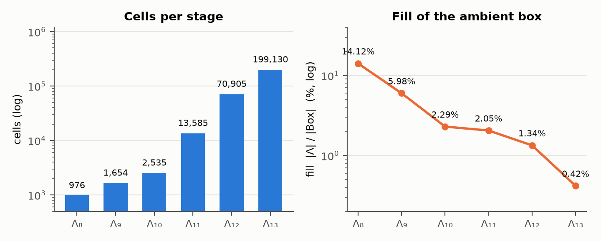
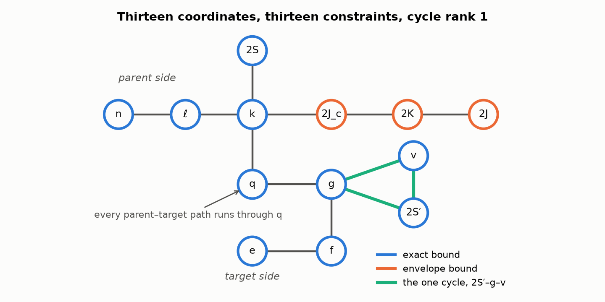
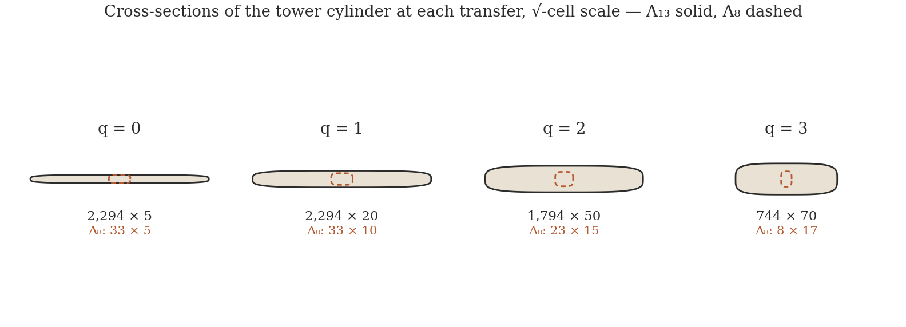
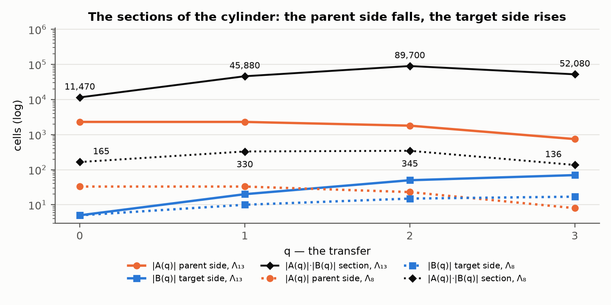
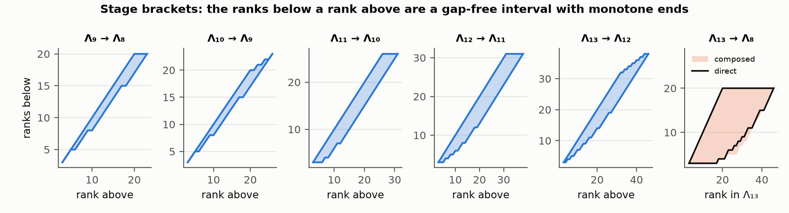

# The Tower over Λ: from Eight Coordinates to Thirteen

**An index of one-electron transitions extends coordinate by coordinate through six stages, every one of them a sublattice of its own box, and what each new coordinate costs is fixed by how many already-present coordinates appear inside a single one of its bounds: one coordinate per bound closes exactly, two inside one bound — the angular-momentum triangle — closes only as a monotone envelope, and the band |a − b| ≤ 1 is a sublattice for every constant, which is why the last step of the tower is carried exactly.**

**Matthew Lach** · Independent Researcher · 21 September 2026

---

## Abstract

A one-electron transition of an atom can be written as a tuple of small non-negative integers: the shell, subshell and occupancy of the parent configuration, the number of electrons transferred, the shell, subshell and occupancy of the target, and the spins and couplings that the transition's angular momenta carry. The set of tuples admitted by the hydrogenic radial solution, the Pauli principle, counting and vector coupling is a finite subset Λ of a product of chains. This paper studies the sequence obtained by adjoining the angular-momentum coordinates one at a time: the target's spin, seniority, the core's total angular momentum, the core–orbit resultant and the total. Six stages result, of 976, 1,654, 2,535, 13,585, 70,905 and 199,130 cells, every one a sublattice of its own coordinate box and every one projecting exactly onto the stage below.

The paper proves the general facts behind that sequence for arbitrary caps. A coordinate bounded between two monotone functions, each of a single already-present coordinate, always extends a sublattice to a sublattice (Theorem 1); the smallest such extension containing a prescribed exact set is that set's monotone envelope, and it is unique (Theorem 2); the triangle region {|a − b| ≤ c ≤ a + b} is closed under coordinatewise maximum and not under coordinatewise minimum, with explicit witnesses for both of its inequalities (Theorem 3); the band B_k = {|a − b| ≤ k} is a sublattice for every constant k, while the three-variable region {|a − b| ≤ c} with c free is join-closed and is not (Theorem 4). Together these force a dichotomy: of the five adjoined coordinates, the two whose exact physical set is a triangle in two coordinates admit only their monotone envelopes, and the one whose second argument is a constant — the spin one-half of the outer electron — is carried exactly (Theorem 5). The theorems are machine-checked over the integers, so they hold at every cap and not at one box, with a non-vacuity guard and an encoding-fidelity guard passed first.

Three further structures are computed exactly. The constraint graph of the thirteenth stage has thirteen vertices and thirteen edges, cycle rank 1 from the tenth stage upward, girth 3, treewidth 2, and the transfer as the cut: no edge joins a parent coordinate to a target coordinate, so every path between the two blocks runs through it. Over that transfer every stage factorises with defect zero into a product of a parent section and a target section, the parent sections falling and the target sections rising; replacing the constant in the core–orbit bound by the cell's own subshell breaks the factorisation by 15,150 cells at the twelfth stage and 45,450 at the thirteenth, and imposing the exact triangle instead breaks closure outright, leaving 22,275 cells with a closure defect of 35,570. The first stage has seventeen join-irreducibles, twenty covering relations and exactly 1,113,045,672 maximal chains, counted by dynamic programming over the cover relations; the five stage-to-stage rank correspondences are gap-free intervals with monotone endpoints whose composition contains the direct correspondence with a slack of at most two rank units; and the first three stages are regenerated by minimum sets of 7, 9 and 9 cells, the first of these certified minimal by a solver over every subset of its 808 distinct covering signatures.

---

## §0 · The result

**A coordinate's cost in this construction is the arity of its bounds, not the arity of the coordinate.**

Λ is a finite set of integer tuples. Each of its defining constraints has the shape `x_i ≤ φ(x_j)` with φ non-decreasing, and a set cut out by constraints of that shape is a sublattice of the product of chains it lives in: coordinatewise maximum and minimum of two members are again members. That is elementary and it is where the construction begins. The question this paper answers is what happens when the construction is continued — when the angular-momentum labels a spectroscopist would attach to the same transition are adjoined as further coordinates.

Five are adjoined, in the order the physics forces: the target's total spin, the seniority of the target subshell, the total angular momentum of the parent core, the resultant of that momentum with the target's orbital momentum, and the total angular momentum of the whole. Each extension is exact or it is not, and which of the two it is turns out to be decided by a purely combinatorial feature of the bound, not by whether the coordinate is a count or a coupling.

**What is established.**

1. **The six stages and their closure.** The stages hold 976, 1,654, 2,535, 13,585, 70,905 and 199,130 cells. Each is a sublattice of its own coordinate box — PROVED by induction from Theorem 1, and independently EXHAUSTIVE two ways: the staircase operator of D6 returns each stage unchanged when swept over the whole ambient box, 6,912 cells at the first stage and 47,775,744 at the sixth, and at the first four stages every unordered pair of cells was tested directly, 97,323,996 pairs in all, with no failing meet or join. Each stage projects exactly onto the one below. The fill — cells over ambient box — falls strictly, 14.12% to 0.42%.

2. **The general theorems, for every cap.** Theorem 1 (one coordinate per bound), Theorem 2 (the monotone envelope, existence and uniqueness), Theorem 3 (the triangle: join-closed, meet-broken), Theorem 4 (the band B_k a sublattice for every constant k; the three-variable region with a free bound join-closed and not a sublattice) and Theorem 5 (the dichotomy) are PROVED in full and MACHINE-CHECKED over the unbounded integers, so they hold at every cap rather than in one box. Theorem 1 is machine-checked a second time in finite-box form, over every subset of a 3 × 3 box and every monotone bound taking values in {−1, …, 2}. Both guards pass before any obligation is reported.

3. **The constraint graph.** Thirteen vertices and thirteen edges at the top stage; cycle rank 0, 0, 1, 1, 1, 1 across the six; one triangle, first present at the tenth stage, on seniority, the target's occupancy and the target's spin; girth 3 from that stage and no cycle below it; treewidth 1, 1, 2, 2, 2, 2 by exact elimination search; the transfer the cut, in the sense that no edge joins a parent coordinate to a target coordinate. The single cycle is a coordinate with two parents whose bounds have one coordinate each — which costs the tree and costs nothing in closure. A single bound with two coordinates in it is the other thing entirely, and it is what breaks closure.

4. **The cylinder.** At every stage Λ ∩ {q = t} is exactly a product A(t) × B(t), and Σ_t |A(t)|·|B(t)| = |Λ| with defect zero. The parent sections fall and the target sections rise at every stage, the section sequence is log-concave and peaks at t = 2 at every stage, and the mean transfer rises from 1.4631 to 1.9159 up the tower. Two departures are priced: writing the core–orbit bound with the cell's own subshell rather than the cap costs 15,150 cells of factorisation at the twelfth stage and 45,450 at the thirteenth, 21.4% and 22.8% of the product; imposing the exact triangle there instead leaves 22,275 cells and breaks closure, with a closure defect of 35,570 and explicit failing meets.

5. **Rank, generators and chains.** The first stage is graded by the coordinate sum, with 18 rank values from 3 to 20, widest level 122 at rank 11, and |Λ| exactly eight times that level. Its seventeen join-irreducibles are exactly the seventeen cells min{x : x_c ≥ v}, one for each coordinate value above that coordinate's minimum; they carry twenty covering relations, and the number of down-sets of the resulting poset is 976, which is the Birkhoff correspondence verified rather than invoked. The number of maximal chains is **1,113,045,672**, computed by dynamic programming over the cover relations of the lattice itself, and every maximal chain has length 17.

6. **The bracket system.** For each of the five stage-to-stage projections, the set of ranks below a given rank above is a gap-free interval with both endpoints monotone, with maximum branching 4, 4, 6, 8 and 9. Composing the five brackets contains the direct bracket from the top stage to the first at every rank, with a slack of at most two rank units, and both routes cover the whole rank spectrum {3, …, 20} of the first stage.

7. **The seed.** The first stage is regenerated by the staircase from 7 of its cells, the second from 9 and the third from 9, each found by exact branch and bound over the distinct covering signatures. For the first stage the minimality is MACHINE-CHECKED: no 6 of the 808 distinct signatures cover the 77 envelope steps.

**What is not established here.** Every cell count is at one setting of the caps that make Λ finite, namely three shells for the parent and for the target, one unit of orbital angular momentum, three electrons of occupancy and one unit of target subshell — the counts change with the caps and the paper marks them as being at these caps. The structural results of §4 are proved for arbitrary caps and arbitrary bounds; the tables of §2, §6, §7, §8 and §9 are not. Nothing here bears on whether the thirteen coordinates are the right or the complete list for a physical transition; a fourteenth coordinate is outside the paper. The exact angular-momentum content used in §3 — which pairs (2S, 2L) occur in a subshell of equivalent electrons — is derived here by microstate enumeration and agrees with the standard tabulation, which is CITED; nothing in this paper measures a spectrum. The closure statements are statements about a set of integer tuples and its coordinatewise lattice operations; they are not claims that the atom realises every admitted tuple, and §6 prices exactly the gap between the two at the twelfth coordinate.

**Status words.** Six are used and never merged.

| status | meaning |
|---|---|
| **PROVED** | a proof is written out below and every step is justified; a proof ends with ∎ |
| **MACHINE-CHECKED** | Z3 returned `unsat` on the negation of an obligation whose variables range over a named domain — the unbounded integers where stated, otherwise every subset of a named finite box — with the non-vacuity and encoding-fidelity guards passed first |
| **EXHAUSTIVE** | a decision procedure visited every case in a stated finite family, and the family's size is printed |
| **SAMPLED** | a seeded pseudorandom sweep of a stated size; never exhaustive |
| **CITED** | taken from the literature, with the source |
| **REFUTATION** | a claim disproved by an explicit witness, which is printed |

---

## §1 · Definitions

Throughout, `d ≥ 2` is finite and all coordinates take values in ℤ.

**D1 (chain, box).** A **chain** is a finite non-empty totally ordered set of integers. For a finite non-empty set `X` of `d`-tuples, `A_i := { x_i : x ∈ X }` is its **alphabet** at coordinate `i`, and

> `Box(X) := A_1 × A_2 × ⋯ × A_d`

is its **box**. Under coordinatewise `∧ = min` and `∨ = max`, `Box(X)` is a lattice, since a subset of a chain is closed under min and max of its own elements.

**D2 (meet, join, sublattice).** For tuples `x`, `y`, write `x ∧ y := (min(x_i, y_i))_i` and `x ∨ y := (max(x_i, y_i))_i`. A set `S ⊆ Box(S)` is a **sublattice** if `x ∧ y ∈ S` and `x ∨ y ∈ S` for all `x, y ∈ S`. The paper says **closed** for this and for nothing else.

**D3 (bound, parent, arity).** A **bound** on coordinate `i` is an inequality of the form `x_i ≤ β(x)` or `x_i ≥ β(x)` where β is a function of the remaining coordinates. The **parents of the bound** are the coordinates β actually depends on, and its **arity** is their number; a bound of arity 0 is a constant bound. The **parents of a coordinate** are the union of the parents of its bounds. The distinction between the arity of a bound and the number of parents of a coordinate is the subject of §4 and §5, and it is not a distinction without a difference: a coordinate can have two parents and every bound of arity 1.

**D4 (monotone).** A function `φ : A → ℤ` on a chain is **monotone** if `a ≤ a′` implies `φ(a) ≤ φ(a′)`. For a chain `A`, a monotone φ satisfies `φ(max(a, a′)) = max(φ(a), φ(a′))` and `φ(min(a, a′)) = min(φ(a), φ(a′))`: it is a homomorphism for both operations. This one-line observation is the engine of Theorem 1.

**D5 (extension by an axis).** Let `S` be a set of `d`-tuples and let `F` assign to each `x ∈ S` a finite non-empty set `F(x) ⊆ ℤ`. The **extension of S by F** is

> `S ⋉ F := { (x_1, …, x_d, y) : x ∈ S, y ∈ F(x) }`,

a set of `(d+1)`-tuples. Every stage of the tower is the extension of the one below by one such `F`.

**D6 (the staircase and the defect).** For `i ≠ j` and `a ∈ A_j` put

> `φ_ij(a) := max { y_i : y ∈ X, y_j ≤ a }`,  undefined when that set is empty,

and

> `ℛ(X) := { x ∈ Box(X) : x_i ≤ φ_ij(x_j) for all i ≠ j }`,  `E(X) := |ℛ(X)| − |X|`.

`ℛ(X)` is what the pairwise extents of `X` admit: every cell of the box whose value at each coordinate is within reach of its value at each other. `E(X)` counts the cells the extents admit and `X` does not. `E(X) = 0` says the extents describe `X` exactly.

**D7 (rank).** For an integer tuple `x`, `r(x) := Σ_i x_i`. Where the set under study is graded by `r` — every cover raising `r` by 1 — `r` is a rank function in the order-theoretic sense; §7 verifies this for the first stage.

**D8 (constraint graph).** The **constraint graph** of a construction has the coordinates as vertices and an edge `{i, j}` whenever some bound on one of them has the other among its parents. Its **cycle rank** is `|E| − |V| + c`, with `c` the number of connected components; its **girth** is the length of a shortest cycle, undefined when there is none; its **treewidth** is the least width of a tree decomposition, computed here by exact search over elimination orderings.

**D9 (the coordinates).** The thirteen coordinates, in the order in which they enter, with the shorthand used throughout:

| # | symbol | what it labels |
|---|---|---|
| 1 | `n` | the parent configuration's principal quantum number |
| 2 | `ℓ` | the parent subshell's orbital angular momentum |
| 3 | `k` | the number of electrons occupying that parent subshell |
| 4 | `q` | the number of electrons the transition transfers |
| 5 | `e` | the target configuration's principal quantum number |
| 6 | `f` | the target subshell's orbital angular momentum |
| 7 | `g` | the number of electrons the transition places in the target subshell |
| 8 | `2S` | twice the parent's total spin |
| 9 | `2S′` | twice the target's total spin |
| 10 | `v` | the seniority of the target subshell |
| 11 | `2J_c` | twice the total angular momentum of the parent core |
| 12 | `2K` | twice the resultant of the core's momentum with the target's orbital momentum |
| 13 | `2J` | twice the total angular momentum |

All angular momenta are carried as twice their value so that every coordinate is an integer. **Λ_D** denotes the set of admissible `D`-tuples on the first `D` of these coordinates, and the six stages are `Λ_8 ⋉ … = Λ_9`, and so on to `Λ_13`.

**D10 (the bounds).** Λ_8 is the set of tuples `(n, ℓ, k, q, e, f, g, 2S)` of non-negative integers with

> `1 ≤ n ≤ n_max`,  `0 ≤ ℓ ≤ min(ℓ_max, n − 1)`,  `1 ≤ k ≤ min(k_max, 4ℓ + 2)`,  `0 ≤ q ≤ k`,
> `1 ≤ e ≤ e_max`,  `0 ≤ f ≤ min(f_max, e − 1)`,  `0 ≤ g ≤ min(4f + 2, q)`,  `0 ≤ 2S ≤ k`,

and the five extensions are

> `0 ≤ 2S′ ≤ g`,  `2S′ ≤ v ≤ g`,  `0 ≤ 2J_c ≤ φ̂(k)`,  `0 ≤ 2K ≤ 2J_c + 2f_max`,  `|2J − 2K| ≤ 1`, `2J ≥ 0`,

with `φ̂` the monotone envelope of D12 below. Two readings of the twelfth bound must be kept apart and the paper keeps them apart throughout: `f_max` is the **cap** on the sixth coordinate, a constant of the construction, and **not** the cell's own `f`. Written with the cap the bound has arity 1 — its only parent is `2J_c` — and the tower closes and factorises. Written with the cell's own `f` the same bound has arity 2, and §5 and §6 price both differences exactly.

**D11 (the caps).** Every cell count in this paper is at

> `(n_max, e_max, ℓ_max, k_max, f_max) = (3, 3, 1, 3, 1)`,

so that `f_max = 1` and the twelfth bound reads `0 ≤ 2K ≤ 2J_c + 2`. Counts are cap-dependent; the theorems of §4 are not, and are proved for arbitrary bounds.

**D12 (terms, and the two envelopes read off them).** For a subshell of orbital angular momentum ℓ holding `k` equivalent electrons, `terms(ℓ^k)` is the multiset of pairs `(2S, 2L)` obtained by **microstate enumeration**: list every choice of `k` of the `2(2ℓ+1)` spin-orbitals, accumulate the resulting `(2M_L, 2M_S)`, and strip complete `(2S, 2L)` blocks from the largest `M_L` downward until nothing is left. Two functions are read off this multiset and used as bounds:

> `σ(ℓ, k) := max { 2S : (2S, 2L) ∈ terms(ℓ^k) }`,  `μ(ℓ, k) := max { 2S + 2L : (2S, 2L) ∈ terms(ℓ^k) }`,

the largest spin and the largest total angular momentum a configuration of that shape can carry. `φ̂(k) := max { μ(ℓ, k) : ℓ ≤ ℓ_max }` is the **monotone envelope** of `μ` over the admitted parent shells; §3 computes it and §3 shows why an envelope rather than `μ` itself is what the construction can carry.

**D13 (envelope step, seed).** A triple `(i, j, a)` with `i ≠ j` and `a ∈ A_j` is an **envelope step** of `X` when `φ_ij(a) ≠ φ_ij(a′)` for the predecessor `a′` of `a` in `A_j`, or when `a` is least in `A_j`. A cell `x ∈ X` **witnesses** the step `(i, j, a)` when `x_j ≤ a` and `x_i = φ_ij(a)`. A **seed** of `X` is a subset `G ⊆ X` with `ℛ(G) = X` computed in `Box(X)`; §9 shows that a subset witnessing every envelope step is a seed, and conversely, and computes the least size.

**D14 (the transfer decomposition).** Write `A(t) := { (n, ℓ, k, 2S, 2J_c, 2K, 2J) : x ∈ Λ, x_q = t }` for the **parent section** at transfer `t` and `B(t) := { (e, f, g, 2S′, v) : x ∈ Λ, x_q = t }` for the **target section**, each taken as a set of tuples and each restricted to the coordinates the stage carries. The construction **factorises over the transfer** when `Λ ∩ { q = t } = A(t) × B(t)` as sets, for every `t`.

---

## §2 · The six stages

Each stage is the extension of the one below by a single new coordinate, and the bounds are those of D10. The counts, computed by direct enumeration of the construction, are Table 1.

**Table 1. The tower at the caps of D11.** *Box* is the product of the alphabet sizes of the stage. *Fill* is `|Λ_D| / |Box|`. *Pairs* is the number of unordered pairs of distinct cells; the first four were tested one by one, the last two decided by the ambient sweep instead.

| stage | new coordinate | its bound | cells | box | fill | pairs |
|---|---|---|---|---|---|---|
| Λ₈ | — | — | 976 | 6,912 | 14.12% | 475,800 |
| Λ₉ | `2S′` | `0 ≤ 2S′ ≤ g` | 1,654 | 27,648 | 5.98% | 1,367,031 |
| Λ₁₀ | `v` | `2S′ ≤ v ≤ g` | 2,535 | 110,592 | 2.29% | 3,211,845 |
| Λ₁₁ | `2J_c` | `0 ≤ 2J_c ≤ φ̂(k)` | 13,585 | 663,552 | 2.05% | 92,269,320 |
| Λ₁₂ | `2K` | `0 ≤ 2K ≤ 2J_c + 2f_max` | 70,905 | 5,308,416 | 1.34% | 2,513,724,060 |
| Λ₁₃ | `2J` | `\|2J − 2K\| ≤ 1` | 199,130 | 47,775,744 | 0.42% | 19,826,278,885 |

**Figure 1.** Left: the cells of each stage, on a logarithmic axis. Right: the fill, the fraction of the ambient box the stage occupies, on a logarithmic axis. The object grows by a factor of 204 across the tower and the box it is written in grows by a factor of 6,912, so the fill falls strictly at every step, 14.12% to 0.42%.

**Proposition 1 (projection).** For `D = 8, …, 12`, deleting the last coordinate of `Λ_{D+1}` gives exactly `Λ_D`, as a set.

*Proof.* `Λ_{D+1} = Λ_D ⋉ F` for the `F` of D10, and every `F(x)` is a non-empty set of integers: `[0, g]`, `[2S′, g]`, `[0, φ̂(k)]`, `[0, 2J_c + 2f_max]` and `[max(0, 2K − 1), 2K + 1]` are each non-empty because in every case the lower limit is at most the upper — `2S′ ≤ g` holds in `Λ_9` by its own bound, and the other four have lower limit 0 or `2K − 1 ≤ 2K + 1`. The projection of an extension by a set-valued map with non-empty values is the set that was extended. ∎ **PROVED**, and **EXHAUSTIVE**: verified as an equality of sets at all five projections.

**Proposition 2 (closure of every stage).** Every `Λ_D`, `D = 8, …, 13`, is a sublattice of `Box(Λ_D)`, and `E(Λ_D) = 0`.

*Proof.* Λ₈ first. Each of its constraints is either a constant bound or has the form `x_i ≤ φ(x_j)` with φ monotone: `ℓ ≤ n − 1`, `k ≤ 4ℓ + 2`, `q ≤ k`, `2S ≤ k`, `f ≤ e − 1`, `g ≤ 4f + 2`, `g ≤ q`, together with constant caps. Let `x, y ∈ Λ_8` and fix such a constraint `x_i ≤ φ(x_j)`.

*Join.* Put `z = x ∨ y` and suppose `z_i = x_i` (otherwise exchange `x` and `y`). Then `z_i = x_i ≤ φ(x_j) ≤ φ(max(x_j, y_j)) = φ(z_j)`, the middle step by monotonicity.

*Meet.* Put `w = x ∧ y` and suppose `w_j = x_j` (otherwise exchange `x` and `y`; note the case split is now on `j`, not on `i`). Then `w_i = min(x_i, y_i) ≤ x_i ≤ φ(x_j) = φ(w_j)`.

A constant bound `c ≤ x_i ≤ C` is preserved by both operations because `min` and `max` of two values in an interval lie in that interval. So Λ₈ is a sublattice.

Each of the five extensions has both of its bounds monotone in a single coordinate — `0` and `g` for `2S′`; `2S′` and `g` for `v`; `0` and `φ̂(k)` for `2J_c`, `φ̂` monotone by D12; `0` and `2J_c + 2f_max` for `2K`, with `f_max` constant; `2K − 1` and `2K + 1` for `2J`, together with the constant floor 0. Theorem 1 of §4 then carries the sublattice property up each step, and the tower closes by induction. Finally `E(Λ_D) = 0`: `ℛ(Λ_D) ⊇ Λ_D` always, and a sweep of the whole ambient box found no further cell at any stage. ∎ **PROVED**; **EXHAUSTIVE** three ways — the staircase swept over 6,912, 27,648, 110,592, 663,552, 5,308,416 and 47,775,744 ambient cells, returning each stage unchanged; every unordered pair tested at the first four stages, 475,800 + 1,367,631 + 3,212,595 + 92,272,320 pairs, zero failing meets and zero failing joins; and the counts of Table 1 reproduced from the construction.

> **Remark.** The two exhaustive routes are not the same check. The pair test decides the sublattice property directly and costs `O(|Λ|²)`, which is 19.8 billion pairs at the top stage. The sweep decides `ℛ(Λ) = Λ`, which costs `O(|Box|)`, and Lemma 1 of §4 shows that this implies the sublattice property. At the top stage the sweep is 47.8 million cells against 19.8 billion pairs, a factor of 415, which is why the upper stages are decided that way.

**Proposition 3 (strict fill decay).** The fill `|Λ_D| / |Box(Λ_D)|` is strictly decreasing in `D` over the six stages: 14.12%, 5.98%, 2.29%, 2.05%, 1.34%, 0.42%. **EXHAUSTIVE** at these caps.

The fill decay has a reason that does not depend on the caps. Adjoining a coordinate multiplies the box by the size of the new alphabet and multiplies the object by the mean size of the new fibre. A bounded coordinate has mean fibre strictly below its alphabet size unless every cell below it admits every value — that is, unless the bound is vacuous. So a coordinate that constrains anything lowers the fill. This is a statement about the construction, not a measurement, and it says nothing about the limit of a sequence continued past thirteen.

---

## §3 · What the coupling axes must carry

The last three coordinates are angular momenta, and their exact content is not a matter of choice: it is fixed by the theory of equivalent electrons. This section computes that content, and shows why it cannot be carried as it stands.

**The terms of a subshell.** `terms(ℓ^k)` is computed by microstate enumeration (D12). The construction is standard and is CITED to Condon and Shortley (1935), ch. VII; it is reproduced here because every bound below is read off its output and the paper recomputes what it prints. The first three cases of the p shell come out as

> `terms(p¹) = { (1, 2) }`,  `terms(p²) = { (0, 0), (0, 4), (2, 2) }`,  `terms(p³) = { (1, 2), (1, 4), (3, 0) }`,

which are `²P`; `¹S`, `¹D`, `³P`; and `²P`, `²D`, `⁴S` — the textbook anchors, EXHAUSTIVE over the enumeration.

**Proposition 4 (particle–hole symmetry).** `terms(p^k) = terms(p^{6−k})` for `k = 1, 2`. **EXHAUSTIVE.** The multiset of terms of a subshell and of its complement agree, which is the complementary-shell theorem of Racah (1943), CITED; it is verified here on the shells the caps admit rather than assumed.

**Proposition 5 (the two realised maxima are not monotone).** With `σ` and `μ` as in D12,

| `k` | 1 | 2 | 3 | 4 | 5 | 6 |
|---|---|---|---|---|---|---|
| `σ(1, k)` = max 2S of `p^k` | 1 | 2 | 3 | 2 | 1 | 0 |
| `μ(1, k)` = max 2J of `p^k` | 3 | 4 | 5 | 4 | 3 | 0 |

and `σ(0, 1) = 1`, `σ(0, 2) = 0`, `μ(0, 1) = 1`, `μ(0, 2) = 0`. Both rows rise to half filling and fall to zero at closure. **EXHAUSTIVE**, over the eight subshells the caps admit.

Neither row is monotone, and that is the obstruction. A bound `x_i ≤ β(x_j)` preserves the sublattice property when β is monotone (Theorem 1) and can fail when it is not (§4, the negative control). So the exact ceiling cannot be carried as a bound. What can be carried is its monotone envelope, and Theorem 2 says which one.

**Proposition 6 (the envelope of the realised maximum).** The running maximum of `μ(1, ·)` is 3, 4, 5, 5, 5, 5. It dominates `μ(1, ·)` everywhere and strictly exceeds it at `k = 4, 5, 6`. **EXHAUSTIVE.** At the caps of D11 only `k ≤ 3` occurs, where the realised maximum is already monotone; there `φ̂ = {1 ↦ 3, 2 ↦ 4, 3 ↦ 5}` coincides with the realised maximum exactly. **That coincidence is a property of the caps and not of the bound**, and Proposition 6 is the demonstration: extend the caps by one electron of occupancy and the envelope separates from the extent.

**The spin ceiling, in closed form.** The exact spin ceiling of a subshell holding `g` electrons of orbital angular momentum `f` is `min(g, 4f + 2 − g)` — rising while the shell fills, falling once past half — and this reproduces `σ(f, g)` at every `(f, g)` the caps admit. **EXHAUSTIVE.** It is symmetric about half filling, hence non-monotone, hence not carriable; the construction carries `2S′ ≤ g`, which dominates it since `min(g, 4f+2−g) ≤ g`.

**The core–orbit range.** At the caps, `f_max = 1`, so the twelfth bound reads `2K ≤ 2J_c + 2`, and over the construction `max { 2K : 2J_c = j } = j + 2` for every `j = 0, …, 5`: the bound is attained and is not slack as a range. **EXHAUSTIVE.**

### §3.1 · What the envelope costs, axis by axis

The envelope admits cells the exact physics does not. That gap is a count, and it is the quantity Theorem 2 makes into a definition. For each axis, the **admissible fibre** at a cell of the stage below is the interval the bound of D10 allows, and the **exact fibre** is the set vector coupling realises there. Summing both over the stage below gives Table 2.

**Table 2. The exact fibre against the admissible one.** The *admitted* column is the stage's own cell count, since the stage is the sum of the admissible fibres. All at the caps of D11.

| axis | coordinate | admissible fibre | exact fibre | admitted | realised | realised share |
|---|---|---|---|---|---|---|
| 9 | `2S′` | `[0, g]` | the `2S` values of `terms(f^g)` | 1,654 | 1,054 | 63.7% |
| 10 | `v` | `[2S′, g]` | the occupancies at which a term of spin `2S′` first appears | 2,535 | 1,132 | 44.7% |
| 11 | `2J_c` | `[0, φ̂(k)]` | the `2J` of the terms of `ℓ^k` carrying the cell's own `2S` | 13,585 | 2,310 | 17.0% |
| 11 (wider) | `2J_c` | `[0, φ̂(k)]` | `[0, μ(ℓ, k)]`, the largest `2J` any term of `ℓ^k` carries | 13,585 | 10,585 | 77.9% |
| 12 | `2K` | `[0, 2J_c + 2f_max]` | `\|2J_c − 2f\| ≤ 2K ≤ 2J_c + 2f`, `2K ≡ 2J_c` (mod 2) | 70,905 | 22,275 | 31.4% |
| 13 | `2J` | `[max(0, 2K−1), 2K+1]` | `2J = 2K ± 1` | 199,130 | 128,225 | 64.4% |

Every entry is EXHAUSTIVE over the stage below, and the exact fibre is never larger than the admissible one at any axis — which it cannot be, since Theorem 2 makes the admissible fibre contain the exact one by construction. Two rows are given for the eleventh axis because two different sets deserve the name *exact* there: the set of `2J` the core can carry given the cell's own parent spin, and the set it can carry given only the parent configuration. The first is the stricter and gives 17.0%; the second is the one that matches the bound's own shape — an interval `[0, μ(ℓ, k)]` — and gives 77.9%. The paper prints both and prefers neither.

The thirteenth row is the one to read against the thesis. Its exact fibre is a doublet, `2J = 2K ± 1`, everywhere except at `2K = 0` where it is a singleton — 13,585 cells, one for each cell of the eleventh stage. The admissible fibre is a triplet, `{2K−1, 2K, 2K+1}` intersected with the non-negative integers. So even at the axis whose bound is carried exactly, the realised share is 64.4% and not 100%: the loss is not this axis's, it is inherited through `2K`, whose own range is already an envelope.

---

## §4 · The theorems

Everything in this section is stated for arbitrary chains, arbitrary bounds and arbitrary caps, and proved. Each is then machine-checked over the **unbounded integers**, so that the machine check is not a check at one setting of the caps: the solver is asked for a counterexample among all integer values of every variable and returns `unsat`. Two guards run first and the obligations are not reported unless both pass; §10 states them.

**Lemma 1 (the staircase produces a sublattice).** For any finite non-empty `X`, `ℛ(X)` is a sublattice of `Box(X)` containing `X`, and `φ_ij` is monotone.

*Proof.* Monotonicity of `φ_ij` first: if `a ≤ a′` then `{y ∈ X : y_j ≤ a} ⊆ {y ∈ X : y_j ≤ a′}`, so the maximum over the second set is at least the maximum over the first. Containment: for `x ∈ X` and `i ≠ j`, `x` itself is a member of `{y ∈ X : y_j ≤ x_j}`, so `φ_ij(x_j) ≥ x_i`; and `x ∈ Box(X)` by D1. Now take `x, y ∈ ℛ(X)` and fix `i ≠ j`.

*Join.* Let `z = x ∨ y` and suppose `z_i = x_i`. Then `z_i = x_i ≤ φ_ij(x_j) ≤ φ_ij(max(x_j, y_j)) = φ_ij(z_j)` by monotonicity.

*Meet.* Let `w = x ∧ y`. Suppose `w_i = x_i`, so `x_i ≤ y_i`. If `w_j = x_j` then `w_i = x_i ≤ φ_ij(x_j) = φ_ij(w_j)`. If `w_j = y_j` then `w_i = x_i ≤ y_i ≤ φ_ij(y_j) = φ_ij(w_j)`. The case `w_i = y_i` is symmetric.

Both operations stay inside `Box(X)` because `min` and `max` of two members of a chain are members of it. ∎ **PROVED.**

> **Corollary.** If `ℛ(X) = X` then `X` is a sublattice of `Box(X)`, and `E(X) = 0`. This is why the upper stages of §2 are decided by a sweep of the ambient box rather than by testing pairs: at the thirteenth stage the sweep is 47.8 million cells and the pair test 19.8 billion. The converse is not claimed and is not used.

**Theorem 1 (a coordinate whose every bound has arity 1).** Let `S` be a sublattice of `Box(S)` on coordinates `1, …, d`. Let `j` and `j′` be coordinate indices, not necessarily distinct, and let

> `lo : A_j → ℤ`  and  `hi : A_{j′} → ℤ`

be monotone with `lo(x_j) ≤ hi(x_{j′})` for every `x ∈ S`. Then

> `S⁺ := { (x, y) : x ∈ S, lo(x_j) ≤ y ≤ hi(x_{j′}) }`

is a sublattice of `Box(S⁺)`.

*Proof.* `S⁺` is non-empty because each fibre is non-empty. Take `(x, y)` and `(x′, y′)` in `S⁺`.

*Join.* Its join is `(x ∨ x′, max(y, y′))`, and `x ∨ x′ ∈ S` because `S` is a sublattice. For the upper bound, `y ≤ hi(x_{j′})` and `y′ ≤ hi(x′_{j′})`, so

> `max(y, y′) ≤ max( hi(x_{j′}), hi(x′_{j′}) ) = hi( max(x_{j′}, x′_{j′}) ) = hi( (x ∨ x′)_{j′} )`,

the middle equality being D4 applied to the monotone `hi` on the chain `A_{j′}`. For the lower bound, D4 applied to `lo` gives

> `lo( (x ∨ x′)_j ) = lo( max(x_j, x′_j) ) = max( lo(x_j), lo(x′_j) ) ≤ max(y, y′)`,

since `lo(x_j) ≤ y` and `lo(x′_j) ≤ y′`.

*Meet.* Its meet is `(x ∧ x′, min(y, y′))` with `x ∧ x′ ∈ S`, and the two displays run the other way: `min(y, y′) ≥ min(lo(x_j), lo(x′_j)) = lo(min(x_j, x′_j)) = lo((x ∧ x′)_j)` and `min(y, y′) ≤ min(hi(x_{j′}), hi(x′_{j′})) = hi((x ∧ x′)_{j′})`.

So both lie in `S⁺`. ∎ **PROVED**, and **MACHINE-CHECKED** twice: over the unbounded integers, with the monotonicity hypothesis stated at the two points where it is used and no bound on any variable; and in finite-box form over every one of the `2⁹` subsets of a `3 × 3` box that is closed, against every monotone `h` with values in `{−1, 0, 1, 2}`.

> **Where the hypothesis bites.** Monotonicity is not decoration. Drop it and the conclusion is false: the negative control asks the solver whether `max(y, y′) ≤ h(x)` at the larger `x` follows from `y ≤ h(x)`, `y′ ≤ h(x′)` alone, and the solver returns a model. This is the reason §3's realised ceilings, which rise and then fall, cannot be carried as bounds.

> **Two parents, one per bound.** In Theorem 1 `j` and `j′` may differ. The tenth coordinate is exactly that case: `2S′ ≤ v ≤ g` has two parents and each of its two bounds has arity 1, so the theorem applies and the stage closes. What the second parent costs is a cycle in the constraint graph (§5) and nothing else. The cost that closure notices is a single bound of arity 2, and that is Theorem 3.

**Theorem 2 (the monotone envelope, existence and uniqueness).** Let `S` be a sublattice, `j` a coordinate, and `F` a map assigning to each `a ∈ A_j` a finite non-empty set `F(a) ⊆ ℤ`; write `S ⋉ F := { (x, y) : x ∈ S, y ∈ F(x_j) }`. Let `𝔈` be the family of all sets `S ⋉ [l, h] := { (x, y) : x ∈ S, l(x_j) ≤ y ≤ h(x_j) }` with `l, h : A_j → ℤ` monotone, that contain `S ⋉ F`. Then

> (i) `𝔈` is non-empty and every member of it is a sublattice;
> (ii) `𝔈` has a least member under inclusion, namely `S ⋉ [l*, h*]` with
>
> `l*(a) := min { min F(a′) : a′ ∈ A_j, a′ ≥ a }`,  `h*(a) := max { max F(a′) : a′ ∈ A_j, a′ ≤ a }`;
>
> (iii) `S ⋉ [l*, h*] = S ⋉ F` if and only if `F(a) = [l*(a), h*(a)] ∩ ℤ` for every `a ∈ A_j`;
> (iv) the number of cells the envelope admits and `F` does not is `Σ_{x ∈ S} ( h*(x_j) − l*(x_j) + 1 − |F(x_j)| )`.

*Proof.* (i) The constant functions `l ≡ min_a min F(a)` and `h ≡ max_a max F(a)` are monotone and their interval contains every `F(a)`, so `𝔈 ≠ ∅`; and each member is a sublattice by Theorem 1 with `j′ = j`.

(ii) `l*` is monotone: as `a` increases the set `{a′ ≥ a}` shrinks, so its minimum does not decrease. `h*` is monotone: as `a` increases the set `{a′ ≤ a}` grows, so its maximum does not decrease. Taking `a′ = a` in each definition gives `l*(a) ≤ min F(a)` and `h*(a) ≥ max F(a)`, so `F(a) ⊆ [l*(a), h*(a)]` and `S ⋉ [l*, h*] ∈ 𝔈`. Now let `S ⋉ [l, h] ∈ 𝔈` be arbitrary. Containment forces `l(a) ≤ min F(a)` and `h(a) ≥ max F(a)` for every `a ∈ A_j`. For `a′ ≥ a`, monotonicity of `l` gives `l(a) ≤ l(a′) ≤ min F(a′)`; taking the minimum over all such `a′` gives `l(a) ≤ l*(a)`. Symmetrically, for `a′ ≤ a`, `h(a) ≥ h(a′) ≥ max F(a′)`, so `h(a) ≥ h*(a)`. Hence `[l*(a), h*(a)] ⊆ [l(a), h(a)]` for every `a`, and `S ⋉ [l*, h*] ⊆ S ⋉ [l, h]`. Least members of a family ordered by inclusion are unique.

(iii) The two sets have the same first `d` coordinates, so they agree exactly when their fibres agree, which is the stated condition.

(iv) The fibres are disjoint across cells of `S`, so the counts add. ∎ **PROVED.**

> Theorem 2 is what "envelope" means in this paper, and the two clauses are what make the word do work: the envelope exists for *any* prescribed exact set, and it is the *smallest* thing of the admissible shape that contains it — so the cells in the gap are not an artefact of a sloppy bound but the unavoidable price of carrying that exact set as an interval monotone in one coordinate. Table 2 is clause (iv), evaluated at each axis.

**Theorem 3 (the triangle exclusion).** Let

> `T := { (a, b, c) ∈ ℤ³ : a ≥ 0, b ≥ 0, c ≥ 0, |a − b| ≤ c ≤ a + b }`.

Then `T` is closed under coordinatewise maximum and is not closed under coordinatewise minimum, and each of its two inequalities is broken by an explicit meet.

*Proof of join-closure.* Take `u = (a₁, b₁, c₁)` and `w = (a₂, b₂, c₂)` in `T` and write `A = max(a₁, a₂)`, `B = max(b₁, b₂)`, `C = max(c₁, c₂)`; all three are non-negative.

*Upper.* `C = c_t` for some `t ∈ {1, 2}`, and `c_t ≤ a_t + b_t ≤ A + B`.

*Lower.* `A = a_t` for some `t`. Then `A − B ≤ a_t − b_t ≤ |a_t − b_t| ≤ c_t ≤ C`. Exchanging the roles of `a` and `b` gives `B − A ≤ C`. Hence `|A − B| ≤ C`. So `(A, B, C) ∈ T`. ∎

*Refutation of meet-closure.* Both inequalities fail, and one witness is exhibited for each.

> `(0, 1, 1) ∧ (1, 0, 1) = (0, 0, 1)` — both operands lie in `T`; the meet has `c = 1 > 0 = a + b`, so the **upper** bound fails: a total angular momentum manufactured from two zeros.
>
> `(4, 0, 4) ∧ (2, 2, 0) = (2, 0, 0)` — both operands lie in `T`; the meet has `|a − b| = 2 > 0 = c`, so the **lower** bound fails.

∎ **PROVED**; **MACHINE-CHECKED** (join-closure, over the unbounded integers, all caps at once); **REFUTATION** (meet-closure, the solver returning a model, and the two witnesses above verified independently).

> **Why max survives and min does not.** `T` is cut out by one upper bound on `c` and one lower bound on `c`, and the coordinatewise maximum moves every coordinate in the direction each bound is slack on: raising `a` and `b` can only loosen `c ≤ a + b`, and raising `c` can only loosen `|a − b| ≤ c`, while the competing movement is dominated by the argument above. The coordinatewise minimum does the opposite on both, and there is no compensation, because the minimum takes `a` from one operand and `c` from the other and so forgets that `c` was built from that operand's own `a` and `b`.

**Theorem 4 (the bands).** For an integer constant `k ≥ 0` let `B_k := { (a, b) ∈ ℤ²_{≥0} : |a − b| ≤ k }`, and let `C := { (a, b, c) ∈ ℤ³_{≥0} : |a − b| ≤ c }`. Then

> (i) `B_k` is a sublattice, for every `k ≥ 0`;
> (ii) `C` is closed under coordinatewise maximum;
> (iii) `C` is **not** closed under coordinatewise minimum.

*Proof of (i).* `B_k` is cut out by `a ≤ b + k` and `b ≤ a + k`, each a bound of arity 1 whose right-hand side is monotone in its single parent, so Theorem 1 applies in both directions. The direct argument is four lines. Write `A = max(a₁, a₂)` and `B = max(b₁, b₂)`. Choose `t` with `A = a_t`; then `B ≥ b_t`, so `A − B ≤ a_t − b_t ≤ |a_t − b_t| ≤ k`. Exchanging the roles of `a` and `b` gives `B − A ≤ k`, so `|A − B| ≤ k` and the join lies in `B_k`. For the meet write `A′ = min(a₁, a₂)`, `B′ = min(b₁, b₂)`, choose `t` with `B′ = b_t`; then `A′ ≤ a_t`, so `A′ − B′ ≤ a_t − b_t ≤ k`, and the exchanged argument gives `B′ − A′ ≤ k`. Non-negativity is preserved by both operations. ∎

*Proof of (ii).* This is the *Lower* half of Theorem 3's join argument, which used only `|a − b| ≤ c` and not `c ≤ a + b`. ∎

*Refutation of (iii).* `(2, 0, 2)` and `(2, 2, 0)` both lie in `C`; their meet is `(2, 0, 0)`, and `|2 − 0| = 2 > 0`. ∎ **PROVED**; (i) and (ii) **MACHINE-CHECKED** over the unbounded integers, (i) with `k` itself a free integer variable so that the claim is decided for every constant at once; (iii) **REFUTATION**, the solver returning a model and the witness above verified independently.

> **The difference between `B_k` and `C` is the difference between a constant and a coordinate.** In `B_k` the second side of the band is a number, so `a ≤ b + k` is monotone in `b`; in `C` it is a free coordinate, so `|a − b| ≤ c` is a single bound of arity 2 and Theorem 1 does not apply. The same sentence, read in the other direction, is why the thirteenth axis of the tower is exact: `|2J − 2K| ≤ 1` is `B₁`, and the `1` is a constant because the outer electron's spin is one half whatever else the cell holds.

**Theorem 5 (the dichotomy).** Let `S` be a sublattice and let a new coordinate `y` carry an exact set `F(x)`.

> (i) If `F(x) = [lo(x_j), hi(x_{j′})] ∩ ℤ` for monotone `lo`, `hi` of one coordinate each, then `S ⋉ F` is a sublattice: the axis closes exactly.
> (ii) If `F(x) = { y : |x_a − x_b| ≤ y ≤ x_a + x_b }` for two coordinates `a ≠ b` of `S`, and `S` realises the coordinate patterns of Theorem 3's two witnesses, then `S ⋉ F` is join-closed and is not meet-closed; the smallest sublattice extension of the shape (i) containing it is the monotone envelope of Theorem 2, and it is strictly larger.
> (iii) If in (ii) `x_b` is replaced by a constant `k`, then `F(x) = { y : |x_a − y| ≤ k }` is the band `B_k` about `x_a`, which is of the shape (i), and the axis closes exactly.

*Proof.* (i) is Theorem 1. (ii): join-closure and the failure of meet-closure are Theorem 3 transported along the inclusion `(x, y) ↦ (x_a, x_b, y)`, which sends meets to meets and joins to joins because both are coordinatewise; the hypothesis that `S` realises the witness patterns is what makes the two witnesses of Theorem 3 lift to cells of `S ⋉ F`, and §6 exhibits such a pair. The envelope claim is Theorem 2 applied to `F`, and it is strictly larger because `S ⋉ F` is not a sublattice while `S ⋉ [l*, h*]` is. (iii): the two inequalities are `y ≤ x_a + k` and `x_a ≤ y + k`, each monotone of arity 1, so Theorem 1 applies with `j = j′ = a`. ∎ **PROVED.**

**Corollary 1 (the tower's dichotomy).** Of the thirteen bounds of D10, every one is of the shape (i) or the shape (iii) of Theorem 5, so every stage closes (Proposition 2). Of the three bounds whose exact physical content is a coupling condition, the ninth and the eleventh carry a non-monotone realised ceiling (Proposition 5) and so are carried as its envelope; the twelfth's exact content is a triangle of arity 2 and by Theorem 5(ii) cannot be carried at all, so it too is carried as an envelope; and the thirteenth's is `B₁` and is carried exactly. **There is no fourth case in this construction.** **EXHAUSTIVE** over the thirteen bounds.

> **A coordinate cannot be smuggled in as a derived quantity.** Adjoining a function `h` of the existing coordinates keeps the object a sublattice only if the graph `{(x, h(x))}` is one, and taking joins there forces `h(x ∨ x′) = max(h(x), h(x′))` — `h` must be a join homomorphism. A difference of two coordinates is not one. On the first stage, `h = e − q` has `h(x ∨ x′) = 0` at `x = (1,0,1,0,1,0,0,0)` and `x′ = (1,0,1,1,1,0,0,0)`, while `max(h(x), h(x′)) = 1`. **REFUTATION**, by that witness. Every coordinate above the eighth therefore has to enter as a *bounded axis* and pay the price Theorem 2 names; there is no cheaper door.

---

## §5 · The constraint graph

The constraint graph (D8) records which coordinates appear in which bounds. Reading it off D10 gives seven edges at the first stage and one or two more at each step:

> stage 8: `n–ℓ`, `ℓ–k`, `k–q`, `k–2S`, `e–f`, `f–g`, `q–g`
> stage 9: `g–2S′`
> stage 10: `2S′–v`, `g–v`
> stage 11: `k–2J_c`
> stage 12: `2J_c–2K`
> stage 13: `2K–2J`

The twelfth stage contributes **one** edge, not two. Its bound is `2K ≤ 2J_c + 2f_max`, and `f_max` is the cap of D11 — a constant of the construction — so `2J_c` is the bound's only parent (D3, D10). That reading is what §2 and §6 measure, and it is the reading the rest of this section reports.

**Figure 2.** The constraint graph at the thirteenth stage. Thirteen vertices and thirteen edges. Rims mark how the coordinate's bound is carried: an exact bound in the first colour, a monotone envelope in the second. The one independent cycle is the triangle on `2S′`, `g` and `v`, drawn in the third colour; it is the tenth coordinate's two parents happening to be adjacent. Deleting `q` leaves exactly two connected pieces, the parent block and the target block; no edge joins the two blocks directly, so every path between them runs through `q`.

**Table 3. The graph, stage by stage.** Cycle rank is `|E| − |V| + c`; treewidth is exact, by search over elimination orderings.

| stage | vertices | edges | components | cycle rank | triangles | girth | treewidth |
|---|---|---|---|---|---|---|---|
| Λ₈ | 8 | 7 | 1 | 0 | 0 | — | 1 |
| Λ₉ | 9 | 8 | 1 | 0 | 0 | — | 1 |
| Λ₁₀ | 10 | 10 | 1 | 1 | 1 | 3 | 2 |
| Λ₁₁ | 11 | 11 | 1 | 1 | 1 | 3 | 2 |
| Λ₁₂ | 12 | 12 | 1 | 1 | 1 | 3 | 2 |
| Λ₁₃ | 13 | 13 | 1 | 1 | 1 | 3 | 2 |

**Proposition 7 (the shape of the graph).** At every stage the graph is connected. At the first two stages it is a tree — eight vertices and seven edges, then nine and eight. From the tenth stage it has cycle rank exactly 1, girth exactly 3, and exactly one triangle, namely `{2S′, g, v}`; its treewidth is 1 at the first two stages and 2 thereafter. At the thirteenth stage the degree sequence has `k` and `g` at 4 and `n`, `e`, `2S`, `2J` as leaves. **EXHAUSTIVE**, over the six stages, with the triangle census taken over all `C(13, 3) = 286` vertex triples at the top stage and the treewidth by exact elimination search.

**Proposition 8 (the transfer is the cut).** Partition the coordinates into the **parent block** `P = {n, ℓ, k, 2S, 2J_c, 2K, 2J}`, the **target block** `T = {e, f, g, 2S′, v}`, and the transfer `q` alone. Then at every stage no edge joins a vertex of `P` to a vertex of `T`, the only edges at `q` are `k–q` and `q–g`, and deleting `q` leaves exactly two components — `P` and `T`, each restricted to the coordinates the stage carries, and each connected. Every path from `P` to `T` passes through `q`.

*Proof.* Read the edge list. Of the thirteen bounds, twelve name two coordinates of the same block and one, `g ≤ q`, names `q` and a coordinate of `T`; the bound `q ≤ k` names `q` and a coordinate of `P`. So no edge is a `P`–`T` edge, and `q` has degree 2 with one neighbour in each block. `P` is connected at every stage: `n–ℓ–k` with `2S` pendant at `k`, and `k–2J_c–2K–2J` appended one vertex at a time from the eleventh stage. `T` is connected at every stage: `e–f–g`, with `2S′` and `v` attached to `g` from the ninth and tenth. Hence the deletion of `q` leaves those two connected pieces and nothing else, and every `P`–`T` path uses `q`. ∎ **PROVED**, and **EXHAUSTIVE**: verified at all six stages by deleting `q` and computing the component containing `e`, which is `T` exactly, every time.

**Proposition 9 (what the arity-2 reading would cost the graph).** Writing the twelfth bound with the cell's own `f` in place of the cap adds the edge `f–2K`. The thirteenth stage then has 13 vertices and **14** edges, and the cycle-rank sequence becomes `0, 0, 1, 1, 2, 2`. The triangle count, the treewidth, the girth and the degrees of `k` and `g` are unchanged; the only degrees that move are those of `f` and `2K`. **EXHAUSTIVE**, computed by substituting that one edge and rebuilding.

So the arity of that bound is visible in the graph as exactly one edge and one unit of cycle rank, and §6 prices the same difference in cells.

> **Cycle rank and closure are two different costs.** The single independent cycle arrives at the tenth stage, where `v` is bounded below by `2S′` and above by `g`, two coordinates already joined by an edge. That coordinate has two parents, and it costs the tree: treewidth rises from 1 to 2, and with it the guarantee that pairwise reasoning decides membership. A tree-structured constraint network is globally consistent once it is arc-consistent — Freuder (1982), CITED — so at treewidth 1 the pairwise operator `ℛ` of D6 is exact by a theorem, and at treewidth 2 it is not guaranteed to be. **It is nevertheless exact here:** `E(Λ_D) = 0` at all six stages (Proposition 2), including the four of treewidth 2. What the cycle removes is the guarantee, not the property. And the cost that closure does notice is a different one: a single bound of arity 2, which Theorem 5(ii) shows cannot preserve the sublattice property at all. **A coordinate with two parents is cheap; a bound with two parents is not.**

---

## §6 · The cylinder over the transfer

The fourth coordinate, `q`, is the number of electrons a transition moves. Proposition 8 says it is where the two sides of the construction meet. This section shows what that costs and what it buys.

**Proposition 10 (exact factorisation).** At every stage, and for every value `t` of the transfer,

> `Λ ∩ { q = t } = A(t) × B(t)`  as sets,  and  `Σ_t |A(t)| · |B(t)| = |Λ|`,

with defect zero. **EXHAUSTIVE** at all six stages for the sum, and as a set identity at the first and the thirteenth.

*Proof.* Delete `q` from the constraint graph. By Proposition 8 the remainder splits into the parent component and the target component, so no bound of D10 other than `g ≤ q` names coordinates from both, and `g ≤ q` is a bound on the target side alone once `q` is fixed. Hence for a fixed `t` the admissibility of the parent coordinates and the admissibility of the target coordinates are independent conditions, and the fibre is their product. Summing over `t` partitions Λ. ∎ **PROVED**, and **EXHAUSTIVE** as stated.

**Table 4. The sections, at three stages.** `|A(t)|` is the number of distinct parent tuples at transfer `t`, `|B(t)|` the number of distinct target tuples.

| `t` | Λ₈: `\|A\|` × `\|B\|` | product | Λ₁₁: `\|A\|` × `\|B\|` | product | Λ₁₃: `\|A\|` × `\|B\|` | product |
|---|---|---|---|---|---|---|
| 0 | 33 × 5 | 165 | 163 × 5 | 815 | 2,294 × 5 | 11,470 |
| 1 | 33 × 10 | 330 | 163 × 20 | 3,260 | 2,294 × 20 | 45,880 |
| 2 | 23 × 15 | 345 | 123 × 50 | 6,150 | 1,794 × 50 | 89,700 |
| 3 | 8 × 17 | 136 | 48 × 70 | 3,360 | 744 × 70 | 52,080 |
| | **total** | **976** | | **13,585** | | **199,130** |

**Figure 3.** The four sections of the cylinder drawn at square-root-of-cell scale, the thirteenth stage solid and the first dashed inside it. The sections read 2,294 × 5, 2,294 × 20, 1,794 × 50 and 744 × 70 against 33 × 5, 33 × 10, 23 × 15 and 8 × 17.

**Figure 4.** The same four sections as a profile, on a logarithmic axis, at the thirteenth stage (solid) and the first (dotted). The parent side falls and the target side rises at both scales; the section itself peaks at `t = 2`, at 89,700 cells at the top stage and 345 at the bottom.

**Proposition 11 (the profile).** At every one of the six stages: `|A(t)|` is non-increasing in `t`, `|B(t)|` is non-decreasing, the sequence of section sizes is log-concave, and it attains its maximum at `t = 2`. The mean transfer `⟨q⟩ = Σ_t t·|A(t)|·|B(t)| / |Λ|` rises up the tower:

| stage | Λ₈ | Λ₉ | Λ₁₀ | Λ₁₁ | Λ₁₂ | Λ₁₃ |
|---|---|---|---|---|---|---|
| `⟨q⟩` | 1.4631 | 1.6850 | 1.8304 | 1.8874 | 1.9141 | 1.9159 |

**EXHAUSTIVE** at these caps. No value of the transfer improves both sides: raising it costs the parent and pays the target, monotonically, at every stage.

### §6.1 · What the arity-2 bound costs, in cells

Three readings of the twelfth bound are available, and the paper prices all three at the same caps. Write `j = 2J_c` and let `f` be the cell's own target subshell.

| reading | bound on `2K` | arity | cells at Λ₁₂ | cells at Λ₁₃ | closed? | factorises? |
|---|---|---|---|---|---|---|
| the cap | `0 ≤ 2K ≤ j + 2f_max` | 1 | 70,905 | 199,130 | **yes**, `E = 0` | **yes**, defect 0 |
| the cell's own `f`, upper bound only | `0 ≤ 2K ≤ j + 2f` | 2 | 55,755 | 153,680 | no, `E = 12,675` | no, defect 15,150 and 45,450 |
| the exact triangle with parity | `\|j − 2f\| ≤ 2K ≤ j + 2f`, `2K ≡ j` (mod 2) | 2 | 22,275 | 64,290 | no, `E = 35,570` | — |

**Proposition 12 (the price of the second parent).** Replacing the cap by the cell's own subshell in the twelfth bound leaves 55,755 cells at the twelfth stage against a section product of 70,905, a factorisation defect of **15,150 cells, 21.4% of the product**; at the thirteenth stage 153,680 against 199,130, a defect of **45,450 cells, 22.8%**. The same replacement breaks closure: the staircase returns 12,675 cells the construction does not hold. **EXHAUSTIVE** at these caps; **REFUTATION** for the closure claim.

**Proposition 13 (the exact triangle does not close).** Imposing the full triangle `|2J_c − 2f| ≤ 2K ≤ 2J_c + 2f` with the parity congruence `2K ≡ 2J_c (mod 2)` leaves 22,275 cells at the twelfth stage. That set is not a sublattice. Of its 248,076,675 unordered pairs, **52,767,450 have a meet outside it and 28,742,850 have a join outside it**, and its closure defect is `E = 35,570` — larger than the set is short. An explicit failing meet, in the coordinate order of D9:

> `(1, 0, 2, 0, 1, 0, 0, 0, 0, 0, 4, 4) ∧ (1, 0, 1, 0, 2, 1, 0, 0, 0, 0, 2, 0) = (1, 0, 1, 0, 1, 0, 0, 0, 0, 0, 2, 0)`,

whose `(2J_c, 2f, 2K) = (2, 0, 0)` violates `|2J_c − 2f| ≤ 2K`. **REFUTATION**, and this is Theorem 3's second witness realised inside the construction, which is the hypothesis Theorem 5(ii) requires.

> The join failures are worth separating from the meet failures. Theorem 3 says the triangle *without* the congruence is join-closed; here joins fail too, 28.7 million of them, and the reason is the congruence `2K ≡ 2J_c (mod 2)`, which is not an inequality at all and is preserved by neither operation. So the twelfth axis's exact content carries two independent obstructions — a bound of arity 2 and a congruence — and the construction's envelope drops both.

### §6.2 · Orientation

**Proposition 14 (the surface is orientable).** Eight quantities derived from a cell divide into two classes by whether they rise or fall along a series — `e`, `ν`, `V` in one class and `T`, `r`, `δ`, the local spacing and `w` in the other — and an edge between two of them reverses sign exactly when they lie in different classes. That sign assignment is the one induced by a bipartition, so every cycle of the complete graph on the eight carries an even number of reversals. **EXHAUSTIVE**: all **8,018** cycles of length 3 to 8, **zero** with an odd number of sign reversals.

*Proof.* Assign to each quantity the label `+1` in the first class and `−1` in the second, and to each edge `{u, w}` the sign `s(u, w) = label(u)·label(w)`, which is `−1` exactly when the two lie in different classes. Around a cycle `v₁, …, v_m, v₁` the product of the edge signs is `∏_i label(v_i)·label(v_{i+1}) = ∏_i label(v_i)²= +1`, since every vertex appears exactly twice. A product of `±1` equal to `+1` has an even number of `−1` factors. ∎ **PROVED**, and **EXHAUSTIVE** as stated.

A structure whose sign graph is balanced admits no orientation-reversing traverse, so the object is a cylinder and not a Möbius band; and the reason is structural rather than an absence of evidence, since the proof is a parity argument on a bipartition and not a failure to find a reversing loop.

---

## §7 · Rank, generators and maximal chains

This section is about the first stage as a lattice in its own right. Everything in it is at the caps of D11.

**Lemma 2 (distributivity).** Every `Λ_D` is a distributive lattice.

*Proof.* A product of chains is distributive, since `min` and `max` on a totally ordered set satisfy both distributive laws and the operations on a product act coordinatewise. A sublattice of a distributive lattice is distributive, because the identities are inherited. `Λ_D` is a sublattice of `Box(Λ_D)` by Proposition 2, and it is non-empty and finite, so it has a least and a greatest element — the coordinatewise minimum and maximum of all its cells, which lie in it by repeated meet and join. ∎ **PROVED**; the bottom and the top of the first stage are `(1,0,1,0,1,0,0,0)` at rank 3 and `(3,1,3,3,3,1,3,3)` at rank 20, **EXHAUSTIVE**.

**Proposition 15 (grading).** For every stage, the rank `r(x) = Σ_i x_i` takes its least value 3. The numbers of distinct rank values are 18, 21, 24, 29, 36 and 44 across the six stages. On the first stage the rank sequence, from rank 3 to rank 20, is

> 1, 5, 15, 34, 59, 87, 108, 121, **122**, 115, 100, 79, 57, 37, 21, 10, 4, 1,

which is log-concave, and whose widest level is 122 at rank 11 — so `|Λ₈| = 976 = 8 × 122` exactly. The second stage's widest level is 185 at rank 12. **EXHAUSTIVE** at these caps.

**Definition (generator).** For a coordinate `c` and a value `v ∈ A_c` above the least value of `A_c`, the **generator** `G(c, v)` is the coordinatewise minimum of `{ x ∈ Λ₈ : x_c ≥ v }`.

**Proposition 16 (the seventeen generators).** Every `G(c, v)` is a cell of `Λ₈`. Their number is

> `Σ_i (|A_i| − 1) = (3−1) + (2−1) + (3−1) + (4−1) + (3−1) + (2−1) + (4−1) + (4−1) = 17`,

they are exactly the join-irreducible elements of `Λ₈` — the cells with exactly one lower cover — and the partial order they inherit has exactly **20** covering relations. For every cell `x`,

> `#{ generators G with G ≤ x } = r(x) − 3`,

so the Birkhoff map is rank-preserving and the covers of `Λ₈` are exactly its unit steps. **EXHAUSTIVE**, over all 976 cells and all 17 generators.

*Why `G(c, v)` is a cell.* The set `{x : x_c ≥ v}` is non-empty (since `v ∈ A_c`) and is closed under meet: if `x_c ≥ v` and `y_c ≥ v` then `(x ∧ y)_c ≥ v`. A non-empty finite meet-closed subset of `Λ₈` contains its own coordinatewise minimum. ∎ **PROVED.**

**Proposition 17 (Birkhoff, verified).** The lattice of down-sets of the seventeen-element generator poset has exactly **976** elements, one for each cell of `Λ₈`. **EXHAUSTIVE**, by direct enumeration of the down-sets.

This is Birkhoff's representation theorem — a finite distributive lattice is the lattice of down-sets of its poset of join-irreducibles, Birkhoff (1937), CITED — computed rather than invoked, on this lattice.

**Theorem 6 (the maximal chains).** The saturated chains from the bottom of `Λ₈` to its top number exactly

> **1,113,045,672**,

and every one of them has length 17.

*Proof.* By Proposition 16 the map `x ↦ { G : G ≤ x }` carries `Λ₈` isomorphically onto the down-sets of the generator poset `P` (Proposition 17), and it carries `r(x) − 3` to the size of the down-set. A saturated chain from bottom to top is therefore a sequence of down-sets each obtained from the last by adding one element of `P`, which is precisely a linear extension of `P`; and its length is `|P| = 17 = r(top) − r(bot) = 20 − 3`. The count is the number of paths from the bottom to the top in the Hasse diagram of `Λ₈`, which satisfies the recursion

> `c(bot) = 1`,  `c(x) = Σ { c(y) : y a lower cover of x }`,

well-founded because `r` strictly decreases along lower covers. Evaluating it over all 976 cells in order of rank gives the stated number. ∎ **PROVED**, and **EXHAUSTIVE**: the recursion evaluated at every cell, with lower covers found by testing the eight unit decrements for membership. A **negative control** is reported by the selftest: counting the chains of the *ambient box* instead — the multinomial on the coordinate spans, `20!/(2!1!2!3!2!1!3!3!)` — gives a different number, so the count is not an artefact of ignoring membership.

---

## §8 · The bracket system

The stages are related by projection (Proposition 1). The rank of D7 is defined on all of them, and this section asks what the rank of a cell at one stage says about the rank of its projection at the stage below. The answer is never a single value; it is always an interval, and the intervals compose.

**Definition (the stage bracket).** For `D = 9, …, 13` and an integer `m`, let `π` delete the last coordinate and put

> `β_D(m) := { r(π(x)) : x ∈ Λ_D, r(x) = m }`.

Its **branching** at `m` is `|β_D(m)|`.

**Proposition 18 (each stage bracket is a monotone gap-free interval).** For every `D = 9, …, 13` and every rank `m` realised at that stage, `β_D(m)` is a set of consecutive integers, and both `min β_D` and `max β_D` are non-decreasing in `m`. The largest branching is 4, 4, 6, 8 and 9 respectively — growing with height. **EXHAUSTIVE**, over all cells of all five stages: 1,654 + 2,535 + 13,585 + 70,905 + 199,130.

**Figure 5.** The five stage brackets and their composite. In each of the first five panels the shaded band is `[min β_D(m), max β_D(m)]` against `m`; in the sixth the shaded band is the composition of all five and the solid outline is the direct bracket from the thirteenth stage to the first. The composite contains the direct bracket everywhere, and exceeds it by at most two rank units.

**Definition (the direct bracket).** `δ(m) := { r(x₁, …, x₈) : x ∈ Λ₁₃, r(x) = m }`, the ranks of the eight-coordinate projection of a top-stage cell of rank `m`.

**Proposition 19 (composition, and its slack).** Write `β_D[a, b] := [ min_{m ∈ [a,b]} min β_D(m), max_{m ∈ [a,b]} max β_D(m) ]` for the image of an interval. Then for every rank `m` of the thirteenth stage,

> `δ(m) ⊆ β_9[ β_10[ β_11[ β_12[ β_13[m, m] ] ] ] ]`,

the composed bracket contains the direct one; the excess is at most **2** rank units at the lower end and **0** at the upper; `δ(m)` is itself a gap-free interval at every `m`; and both the direct image and the composed image cover the whole rank spectrum of the first stage, `{3, 4, …, 20}`. **EXHAUSTIVE**, over all 199,130 cells of the thirteenth stage.

> **What the bracket system says.** Each projection loses information, and the loss has a shape: not an error, and not a single wrong value, but a resolution. The rank of a thirteen-coordinate cell determines its eight-coordinate rank only up to an interval, and composing the five one-step statements gives an interval that contains the true one and is wider by at most two units. That the composed answer contains the direct one is what makes the five statements usable as a chain; that the slack is bounded, and bounded by 2 rather than by the sum of five branchings, is what makes the chain worth composing.

---

## §9 · The seed

How much of the first stage must one hold to recover all of it? The staircase `ℛ` of D6 answers, and the answer is seven cells.

**Lemma 3 (covering the steps is regenerating).** Let `G ⊆ X` be non-empty with `π_i(G) = A_i` for every coordinate `i`. Then `φ^G_ij = φ^X_ij` on `A_j` for all `i ≠ j` **if and only if** `G` witnesses every envelope step of `X` (D13). In that case `ℛ(G) = ℛ(X)`, computed in the common box; so if `ℛ(X) = X` then `ℛ(G) = X`, and `G` is a seed.

*Proof.* (⇒) is immediate: if the two boundary functions agree then at a step `(i, j, a)` the value `φ^X_ij(a)` is attained by some member of `G` with `j`-coordinate at most `a`, which is a witness.

(⇐) Suppose `G` witnesses every step. At a step point `a` there is `x ∈ G` with `x_j ≤ a` and `x_i = φ^X_ij(a)`, so `φ^G_ij(a) ≥ φ^X_ij(a)`; and `G ⊆ X` gives `φ^G_ij(a) ≤ φ^X_ij(a)`. Hence equality at every step point. Now take any `b ∈ A_j` and let `a ≤ b` be the largest step point at or below `b`; one exists because the least element of `A_j` is a step point by D13. By the definition of a step there is no step in `(a, b]`, so `φ^X_ij` is constant there and `φ^X_ij(b) = φ^X_ij(a)`. Both functions are non-decreasing (Lemma 1), so

> `φ^X_ij(a) = φ^G_ij(a) ≤ φ^G_ij(b) ≤ φ^X_ij(b) = φ^X_ij(a)`,

and the two agree at `b`. Since the alphabets agree the boxes agree, and `ℛ` depends on nothing else. ∎ **PROVED**, and supported by a **GUARD**: on 40 pseudorandom subsets of `Λ₈` (seed 11), "witnesses every step" and "regenerates `Λ₈` under an independently written staircase" agreed in 40 of 40 cases, and the exhibited seed with one cell removed failed both.

**Definition (seed).** `seed(X) := min { |G| : G ⊆ X, ℛ(G) = X }`.

**Theorem 7 (the seed of the first three stages).** `seed(Λ₈) = 7`, `seed(Λ₉) = 9`, `seed(Λ₁₀) = 9`.

*Proof.* Two halves, an exhibit and a lower bound.

*Upper.* For each stage a set of the stated size is exhibited. It witnesses every envelope step — 77 of them at the first stage, 105 at the second, 138 at the third — and realises every value of every alphabet, so by Lemma 3 it regenerates the stage; this was confirmed a second time by running an independently written staircase over the exhibited set and comparing the output to the stage cell by cell.

*Lower.* Two cells of `X` that witness the same set of steps are interchangeable for the covering problem, so the problem is a minimum set cover over the **distinct covering signatures** rather than over the cells: 808 of them at the first stage, and the exact minimum is found by branch and bound over the 264 signatures that are maximal under inclusion, which is sufficient because a signature contained in another may always be replaced by the larger. For the first stage the lower bound is certified independently: a solver was asked whether any 6 signatures cover the 77 envelope steps and returned `unsat`. That is a relaxation of the seed problem — it drops the requirement that the alphabets be realised — so its answer is a lower bound on `seed(Λ₈)`, and it is 7. The same certification is run at the second and third stages against 8 signatures. ∎ **EXHAUSTIVE** (branch and bound, family sizes printed) and **MACHINE-CHECKED** (the minimality, over every subset of the stated signature family).

> **Seventeen generators and seven cells are two different compressions.** The seventeen of §7 generate `Λ₈` under the lattice join, and they are forced: they are exactly the join-irreducibles, so no smaller set generates under `∨`. The seven generate it under `ℛ`, which is the stronger operator — it fills the box its own pairwise extents allow, where the join reaches only the down-set — and seven is what that stronger operator costs. Neither number bounds the other, and the two should not be read as competing measurements of the same thing.
