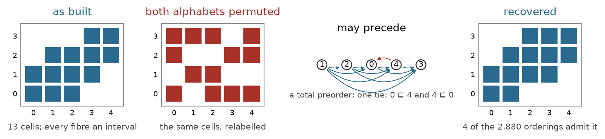
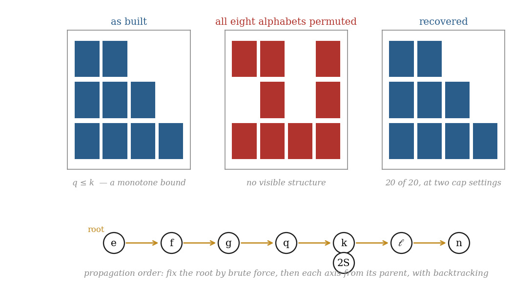
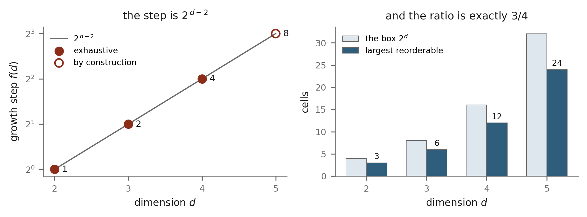
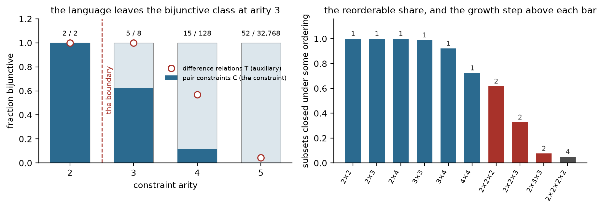
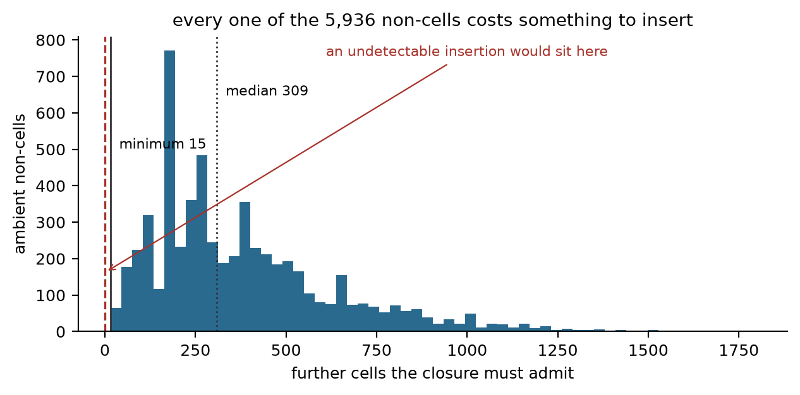

# Order Recovery and the Reorderability Law

**A finite index is closed only relative to an order on each of its coordinates; when those orders are unknown it is decidable whether any of them closes the index, the orders are then recoverable — exactly at two coordinates by the totality of a "may precede" relation, and in general by propagation along the constraint tree — and the arity of the constraint system, the number of coordinates on which two cells differ, is what bounds the cost.**

**Matthew Lach** · Independent Researcher · 24 September 2026

---

## Abstract

A finite index is a set of tuples over finite alphabets. It is *closed* when it contains the coordinatewise meet and join of any two of its cells — but meet and join are defined only once each alphabet has been given a linear order, so closure is a property of the pair (index, ordering) and never of the index alone. This paper asks what an index can say about its own ordering. Three results answer it. First, closure is equivalent to the vanishing of the staircase defect E: an index is closed exactly when it is the fixed point of its own monotone envelopes, which gives an index its alphabet, its bounds and its membership test from its cells alone. Second, define `u ⊑ v` on one coordinate when every meet of a cell over u with a cell over v lies over u and every join lies over v. The relation ⊑ is transitive for every index whatever, and an order `s` on that coordinate closes the index exactly when ⊑ is reflexive and contains `s`; so the index is closable on that coordinate exactly when ⊑ is a total preorder, and the admissible orders are precisely the linear extensions of ⊑. At two coordinates this is a complete criterion, equivalent to the statement that every fibre is an interval and no fibre nests strictly inside another. Above two coordinates the pointwise criterion is necessary and not sufficient, but when the constraint graph is a tree the joint condition factorises over its edges, and a dynamic program rooted anywhere recovers every admissible ordering system at a cost of one alphabet's permutations rather than the product of them all. Third, with all orders unknown the problem is a constraint system on orientation variables whose constraints are invariant under reversing all their own orientations; such a constraint depends only on exclusive-or differences and therefore on `k − 1` variables when the two cells differ on `k` coordinates. Every difference relation containing the origin arises, all of them are closed under the ternary majority for `k ≤ 3`, and 55 of the 128 arising at `k = 4` are not — with an explicit six-cell witness. The growth step of the reorderable family is `2^(d−2)`, and at the Boolean box that value is proved from a tight bound on proper sublattices: `3·2^(d−2)`, three quarters. Every finite claim is recomputed: 90 obligations, 29 of them machine-checked by Z3 over every subset of a named box and, where an order is unknown, over every total order on the named coordinate. The electron-configuration index Λ is the worked case throughout; its eight orders are recovered from a bag of 976 cells with all eight alphabets independently permuted, and the recovery is exact up to the 16 orderings that admit Λ at all, out of 11,943,936.

---

## §0 · The result

**A closed index states its own alphabet and its own bounds unconditionally, and its own order under a stated condition on the constraint graph.**

An index is a finite set `X` of tuples. Write `A_i` for the set of values its i-th coordinate takes. If each `A_i` carries a linear order, `X` sits inside a product of chains, and `X` is **closed** when it is a sublattice of that product — closed under coordinatewise minimum and maximum. Nothing in the cells of `X` fixes those orders. The orders are a choice made when the index is drawn, and the question of this paper is how much of that choice the cells themselves determine.

**What is established.**

1. **Closure is self-expressing** (Theorem 1, PROVED; EXHAUSTIVE on 70,598 subsets). For each ordered pair of coordinates let `φ_ij(v) = max{ x_i : x ∈ X, x_j ≤ v }` — the tightest monotone bound the cells support — and let ℛ(X) be the set of ambient points respecting all `d(d−1)` of them, `E(X) = |ℛ(X)| − |X|`. Then `E(X) = 0` if and only if `X` is closed. A closed index is therefore *equal to* the region its own envelopes cut out: its membership test is a finite conjunction of comparisons read off its cells, and is total on the ambient box.

2. **The order relation, and what it decides** (Theorem 2, PROVED and MACHINE-CHECKED over boxes 3×3, 4×4, 2×2×3 and 3×3×3). Fix orders on every coordinate but one. Say `u ⊑ v` when, for every cell over `u` and every cell over `v`, the meet of their remaining coordinates lies over `u` and the join lies over `v`. Then (a) ⊑ is transitive for every index, with no hypothesis at all; (b) an order `s` on that coordinate closes `X` exactly when ⊑ is reflexive and `u <_s v ⇒ u ⊑ v`; (c) some order closes `X` exactly when ⊑ is a total preorder, and then every linear extension of ⊑ is such an order and nothing else is. The admissible orders on one coordinate are thus *exactly* the linear extensions of a total preorder computable in `O(|X|²)` time — the recovered order is unique up to the ties of ⊑, and the ties are the coordinate values the index cannot tell apart.

3. **Two coordinates: a complete criterion** (Theorem 3, PROVED and MACHINE-CHECKED over boxes 3×3, 4×4, 3×5 and 5×4; Lemma 5 EXHAUSTIVE over 2,354 families). At `d = 2`, `X` is closed under `s` if and only if every fibre is an interval of the other chain and both endpoints are non-decreasing along `s`. A family of intervals admits such an order if and only if no interval nests **strictly** inside another; sorting by left endpoint, ties by right, decides it. *Strictly* is load-bearing: reading it as ordinary containment refutes the lemma on 1,098 of the 2,354 families.

4. **Above two coordinates, propagation** (Theorems 4 and 5, PROVED; EXHAUSTIVE on 7,486 tree-structured subsets and 362,144 scrambles). Every pair projection being reorderable is necessary and not sufficient: the three unit vectors of `{0,1}³` refute the converse, and the refutation is proved, not merely found (§4.1). But when `X` is the intersection of the cylinders over the projections onto the edges of a tree, closure factorises: `X` is closed under an ordering system if and only if every edge projection is. A dynamic program rooted at any coordinate then returns **every** admissible ordering system, trying `|A_r|!` orders at the root and solving each subsequent coordinate by Theorem 2. On Λ that is 6 root orders against `∏_i |A_i|! = 11,943,936`.

5. **The reorderability law** (Theorem 8, PROVED; EXHAUSTIVE on 1,967,872 pair constraints and on every relation of four arities). With every order unknown, the decision is a constraint system on orientation variables. Every constraint is invariant under reversing all of its own orientations, so it depends only on exclusive-or differences: a pair of cells differing on `k` coordinates imposes a relation on `k − 1` difference variables containing the origin. Every such relation arises. For `k ≤ 3` all of them — 2 at `k = 2`, 8 at `k = 3` — are closed under the ternary majority and are therefore expressible by two-clauses; at `k = 4`, 55 of the 128 are not, and one is exhibited. Since `k ≤ d` and `k = d` is attained, **the first non-bijunctive constraint appears at `d = 4` and not before.**

6. **The growth step** (Theorem 9, PROVED at the Boolean box, EXHAUSTIVE over ten boxes). Every proper sublattice of the Boolean box `2^d` has at most `3·2^(d−2)` cells, three quarters, and that is attained by the cells satisfying one implication between two coordinates; the removed cells are a subcube. Hence a reorderable set can be reached from a smaller one by adding at most `2^(d−2)` cells at the full box, and the census over ten boxes gives the same value everywhere: 1 at `d = 2`, 2 at `d = 3`, 4 at `d = 4`.

**What is not established.**

- **No hardness result.** The constraint language leaves the bijunctive class at arity 4, and a relation equivalent to exactly-one-of-three under translation and complement arises there. That places the *language* outside Schaefer's tractable classes. It does **not** show that deciding reorderability is NP-hard: that would require a reduction realising arbitrary instances of such a language as pairs of cells of an index, and no such reduction is given here. The gap is named and left open (§6.5).
- **The step law above `d = 4`.** The census is exhaustive at `d ≤ 4`. At `d = 5` and `d = 6` only the value at the full box is established, from the sublattice bound; the maximum over all reorderable sets at those dimensions is not computed.
- **The general bound on proper sublattices** is proved here for the Boolean box only. For an arbitrary finite distributive lattice the literature's bound is three halves (Rival 1973), CITED, and the Boolean case is tighter.
- **The diagnostic is a decomposition, not a repair.** Theorem 6 says that a defect with no pairwise witness must have a ternary one, and names it. It does not say which re-coordinatisation removes a defect, only that reorderability decides the one operation of relabelling.
- **Λ's recovery is exact up to the orderings that admit Λ at all.** There are 16 of them. Over 20 seeded scrambles at each of two cap settings the recovery returned an admissible ordering 20 times out of 20 — but the *true* ordering or its reverse only 3 times out of 20 at the larger setting and 0 of 20 at the smaller. An index determines its order only up to the orderings under which it is closed, and that is the correct statement of what is recovered.

**Status words.** Six are used and never merged.

| status | meaning |
|---|---|
| **PROVED** | a proof is written out below and every step is justified |
| **MACHINE-CHECKED** | Z3 returned `unsat` on the negation of an obligation whose variables range over *every* subset of a named finite box and, where an order is unknown, over every total order on the named coordinate; both guards passed |
| **EXHAUSTIVE** | a decision procedure visited every case in a stated finite family, and the family is named with its size |
| **SAMPLED** | a seeded pseudorandom sweep of a stated size; never exhaustive |
| **CITED** | taken from the literature, with the full source |
| **REFUTATION** | a claim disproved by an explicit witness, and the witness is printed |

A machine-checked claim names its box. A sampled figure names its size and seed. Where a result is proved for a general `d` and checked for small `d`, both are stated and the reader is told which is which.

---

## §1 · Definitions

**D1 (index, alphabet, box).** Let `d ≥ 2`. An **index** is a finite non-empty set `X ⊆ A_1 × … × A_d` of **cells**, where `A_i` is a finite set of **values**, the i-th **alphabet**. Throughout, and without further mention, `A_i = { x_i : x ∈ X }` — every value of every alphabet occurs in some cell. The **box** of `X` is the product `∏_i |A_i|`, and an **ambient point** is an element of `A_1 × … × A_d`. A cell is an ambient point; the converse is what is at issue.

The convention `A_i = { x_i : x ∈ X }` is not cosmetic. Two of the results below — the interval property of Theorem 3 and the transitivity of ⊑ in Theorem 2 — are false without it, and §2.4 exhibits why.

**D2 (an ordering of a coordinate; an ordering system).** An **ordering** of coordinate `i` is a linear order `s_i` on `A_i`, equivalently a bijection `rank_i : A_i → {0, …, |A_i| − 1}`. An **ordering system** is a tuple `s = (s_1, …, s_d)`, one ordering per coordinate. An ordering system makes each `A_i` a chain and the ambient box the product of those chains, which is a finite distributive lattice (Davey and Priestley 2002, CITED) under

> `(x ∧_s y)_i = the s_i-smaller of x_i and y_i`,  `(x ∨_s y)_i = the s_i-larger`.

The number of ordering systems is `∏_i |A_i|!`. The **reverse** of `s` is the system reversing every `s_i`; it exchanges `∧_s` with `∨_s`.

**D3 (closure relative to an ordering).** `X` is **closed under `s`** if `x ∧_s y ∈ X` and `x ∨_s y ∈ X` for all `x, y ∈ X` — that is, if `X` is a sublattice of the product of chains that `s` defines. `X` is **reorderable** if it is closed under some ordering system. Closure is a property of the pair `(X, s)`. Since reversing every coordinate exchanges the two operations, `X` is closed under `s` if and only if it is closed under the reverse of `s`; admissible ordering systems come in reverse pairs.

**D4 (envelope, recovery operator, defect).** For `i ≠ j` and `v ∈ A_j`, the **envelope** is

> `φ_ij(v) = max { x_i : x ∈ X, x_j ≤ v }`,  with `max ∅ = −∞`,

the maximum and the comparison taken in the given ordering. The **recovery operator** is

> `ℛ(X) = { x ∈ A_1 × … × A_d : x_i ≤ φ_ij(x_j) for all i ≠ j }`,

and the **defect** is `E(X) = |ℛ(X)| − |X|`. That ℛ is extensive, monotone and idempotent — a closure operator in the sense of Moore (1910) and Ward (1942), CITED — and that its constraints are the monotone staircases of Deville, Barette and Van Hentenryck (1999) and the row-convex constraints of van Beek and Dechter (1995), CITED, are stated and proved in the companion paper on the closure law and are not re-derived here. What this paper needs of ℛ is `X ⊆ ℛ(X)`, which is immediate (`x ∈ X` gives `x_i ≤ φ_ij(x_j)` by taking the witness `x` itself), and Theorem 1.

**D5 (fibre).** For a coordinate `i` and a value `u ∈ A_i`, the **fibre** over `u` is

> `F_i(u) = { x_{−i} : x ∈ X, x_i = u } ⊆ ∏_{j ≠ i} A_j`,

where `x_{−i}` deletes the i-th entry. Every fibre is non-empty, by D1. When the coordinates other than `i` are ordered, `∏_{j≠i} A_j` is a lattice and meets and joins of fibre elements are taken there. The subscript is dropped when the coordinate is clear. At `d = 2` the fibre over `u ∈ A_0` is a subset of the chain `A_1` and is written `F(u)`; it is an **interval** if `b_1, b_3 ∈ F(u)` and `b_1 ≤ b_2 ≤ b_3` imply `b_2 ∈ F(u)`, and then `lo(u)` and `hi(u)` denote its endpoints.

**D6 (may precede).** Fix a coordinate `i` and orderings of all the others. For `u, v ∈ A_i`, say **`u` may precede `v`**, written `u ⊑ v`, when

> for all `p ∈ F(u)` and all `q ∈ F(v)`:  `p ∧ q ∈ F(u)` and `p ∨ q ∈ F(v)`.

⊑ depends on `X` and on the orderings of the other coordinates, and on nothing else; in particular it does not presuppose an ordering of `A_i`. It is **reflexive** if `u ⊑ u` for every `u` — equivalently, if every fibre is a sublattice — and **total** if `u ⊑ v` or `v ⊑ u` for every pair. A reflexive, total, transitive relation is a **total preorder**; its **strict part** is `u ≺ v` when `u ⊑ v` and not `v ⊑ u`, and a **linear extension** of it is a linear order `s` with `u <_s v ⇒ u ⊑ v`.

**D7 (the recovered order).** Given a total preorder ⊑ on `A_i`, the **recovered order** `s*` sorts `A_i` by the number of strict ⊑-predecessors, `rank(u) = |{ v : v ≺ u }|`, ties broken by any fixed rule on the raw values. Lemma 4 shows `s*` is a linear extension of ⊑ and that the linear extensions are exactly the admissible orders.

**D8 (constraint graph; tree-structured).** For `i < j`, `π_ij(X) = { (x_i, x_j) : x ∈ X }`. A pair `{i, j}` is **binding** if `|π_ij(X)| < |A_i|·|A_j|`. Let `T` be a tree on the vertex set `{1, …, d}`. `X` is **`T`-structured** if

> `X = { x ∈ A_1 × … × A_d : (x_i, x_j) ∈ π_ij(X) for every edge (i,j) of T }`,

that is, if `X` is exactly the intersection of the cylinders over its `T`-edge projections. This is the *Freuder condition*: a tree-structured constraint network is globally consistent after arc consistency (Freuder 1982), CITED.

**D9 (orientation variables, and the constraint of a pair).** Fix `X` with every ordering unknown. For a coordinate `i` and an ordered pair `u ≠ v` in `A_i`, let `o_i(u,v)` be a Boolean variable, true when `u` precedes `v`. An ordering system is a truth assignment satisfying, on each coordinate, antisymmetry `o_i(u,v) = ¬o_i(v,u)` and transitivity. For `x, y ∈ X` let `I(x,y) = { i : x_i ≠ y_i }` and `k = |I(x,y)|`, the **arity** of the pair. Given an assignment, write `σ ∈ {0,1}^{I}` with `σ_i = 1` when `x_i` precedes `y_i`. The meet and join of `x` and `y` are then determined by `σ`, and the **constraint of the pair** is

> `C(x,y) = { σ ∈ {0,1}^I : the meet and the join determined by σ both lie in X }`.

`X` is closed under an ordering system if and only if every pair's `σ` lies in that pair's `C(x,y)`.

**D10 (bijunctive, majority).** The ternary **majority** operation on `{0,1}` is `maj(a,b,c) = (a∧b) ∨ (b∧c) ∨ (a∧c)`, extended coordinatewise to `{0,1}^m`. A relation `T ⊆ {0,1}^m` is **bijunctive** (**majority-closed**) if `maj(a,b,c) ∈ T` whenever `a,b,c ∈ T`. A relation over `{0,1}` is expressible as a conjunction of clauses of at most two literals if and only if it is bijunctive — Schaefer (1978), and the general closure-property form is Jeavons, Cohen and Gyssens (1997), CITED.

**D11 (the growth step).** For a reorderable `Y` with `|Y| ≥ 2`, let `drop(Y)` be the least `k ≥ 1` such that some subset of `Y` of size `|Y| − k` is reorderable. For a box `B`, the **growth step** `step(B)` is the maximum of `drop(Y)` over all reorderable `Y ⊆ B` with `|Y| ≥ 2`. It is the largest jump that a procedure growing the reorderable family one cell at a time must be prepared to take.

**Notation.** `d` is the number of coordinates; `x ≤ y` between tuples means `x_i ≤ y_i` for all `i`. The **median** of three cells is `m(x,y,z) = (x∧y) ∨ (y∧z) ∨ (z∧x)`, taken coordinatewise. Two tuples are at **Hamming distance** `k` when they differ in exactly `k` coordinates. In a closed `X`, a cell `a` is **join-irreducible** if it is not the join of two cells strictly below it (the bottom cell, having none, is counted), and **join-prime** if `a ≤ x ∨ y` with `x, y ∈ X` implies `a ≤ x` or `a ≤ y`; **meet-irreducible** and **meet-prime** are the duals. A sublattice of a product of chains is distributive, and in a distributive lattice the irreducible and the prime elements coincide (Birkhoff 1967, CITED). `Λ` denotes the electron-configuration index of §5, and `|A_i|` its alphabet sizes.

---

## §2 · Closure, the defect, and the may-precede relation

### 2.1 Closure is what the envelopes express

**Theorem 1 (the closure equivalence).** Let `X` be an index with a fixed ordering system. Then

> `E(X) = 0`  ⟺  `X` is closed.

Moreover, when `X` is closed, `ℛ(X)` is exactly the set of ambient points whose every pair-projection lies in `π_ij(X)`.

*Proof.* **(⇒).** Suppose `ℛ(X) = X` and take `x, y ∈ X`. Both `x ∧ y` and `x ∨ y` are ambient points, their coordinates being coordinates of cells. Fix `i ≠ j`; it suffices to show `(x∨y)_i ≤ φ_ij((x∨y)_j)` and `(x∧y)_i ≤ φ_ij((x∧y)_j)`.

For the join, `(x∨y)_i` is `x_i` or `y_i`; say `x_i`. Then `(x∨y)_j ≥ x_j`, and `φ_ij` is non-decreasing because the defining set `{ z : z_j ≤ v }` grows with `v`. Hence `φ_ij((x∨y)_j) ≥ φ_ij(x_j) ≥ x_i`, the last step because `x ∈ X ⊆ ℛ(X)`.

For the meet, write `a = (x∧y)_i` and `b = (x∧y)_j`. Four cases. If `a = x_i` and `b = x_j`, then `a ≤ φ_ij(x_j) = φ_ij(b)`. If `a = y_i` and `b = y_j`, the same with `y`. If `a = x_i` and `b = y_j`, then `a = x_i ≤ y_i` (that is what `a = x_i` means when `a` is the smaller) and `y_i ≤ φ_ij(y_j) = φ_ij(b)`. If `a = y_i` and `b = x_j`, symmetrically `a = y_i ≤ x_i ≤ φ_ij(x_j) = φ_ij(b)`. In every case `x ∧ y ∈ ℛ(X) = X`.

**(⇐).** Suppose `X` is closed. *Step 1: each pair projection is closed.* For `x, y ∈ X`, `π_ij(x ∧ y) = π_ij(x) ∧ π_ij(y)` because meets are coordinatewise and projection only deletes coordinates; `x ∧ y ∈ X`, so the meet of any two elements of `π_ij(X)` is in `π_ij(X)`, and likewise for joins.

*Step 2: at two coordinates a closed set equals its own envelope region.* Let `Y ⊆ A_0 × A_1` be closed with both alphabets fully used. By Theorem 3 below — whose proof uses nothing from this one — every fibre `F(u)` is an interval `[lo(u), hi(u)]` and `lo`, `hi` are non-decreasing. Then

> `φ_10(v) = max { b : ∃ a ≤ v, (a,b) ∈ Y } = max_{a ≤ v} hi(a) = hi(v)`,

so the constraint `x_1 ≤ φ_10(x_0)` reads `x_1 ≤ hi(x_0)`. And `φ_01(v) = max { a : lo(a) ≤ v }`: since `lo` is non-decreasing the set `{ a : lo(a) ≤ v }` is a down-set of the chain `A_0`, so `x_0 ≤ φ_01(x_1)` holds exactly when `lo(x_0) ≤ x_1` (and, when the set is empty, `φ_01(v) = −∞` excludes every `x_0`, which is right, since then no cell has second coordinate `≤ v`). Therefore

> `ℛ₂(Y) = { (a,b) : lo(a) ≤ b ≤ hi(a) } = Y`,

the last equality because the fibres are intervals.

*Step 3: ℛ is the intersection of its pair restrictions.* By definition `φ_ij` depends on `X` only through `π_ij(X)`, and `A_i = A_i(π_ij(X))`. So

> `ℛ(X) = { x : (x_i, x_j) ∈ ℛ₂(π_ij(X)) for all i < j }`,

and by Steps 1 and 2 each `ℛ₂(π_ij(X)) = π_ij(X)`. Hence `ℛ(X)` is the set of ambient points all of whose pair-projections are projections of cells.

*Step 4: a sublattice is determined by its pair projections.* Each chain `A_i`, as a lattice, satisfies the majority identities for the median term `m(x,y,z) = (x∧y)∨(y∧z)∨(z∧x)`: `m(x,x,y) = x ∨ (x∧y) = x` by absorption, and the other two arguments by symmetry of the expression. `X` is a sublattice of `∏_i A_i` and hence closed under `m`. By the theorem of Baker and Pixley (1975), CITED — an algebra with a majority term has the property that every subalgebra of a finite product is the intersection of the cylinders over its two-fold projections — `X` equals that intersection. Combining with Step 3, `ℛ(X) = X`, so `E(X) = 0`. ∎

**EXHAUSTIVE.** The equivalence, and the identification of `ℛ(X)` with the pair-projection intersection when `E = 0`, were checked on **every** subset of the boxes 3×3, 2×4, 2×2×2, 2×2×3 and 2×2×2×2 with at least two cells — 502, 247, 247, 4,083 and 65,519 subsets, **70,598** in all, no disagreement and no failure. The envelope computation was checked cell for cell against an independent implementation on 120 further instances (§8, guard (d)).

**Corollary 1 (self-expression, and totality).** If `X` is closed then

> `X = { x ∈ A_1 × … × A_d : x_i ≤ φ_ij(x_j) for all i ≠ j }`,

so the alphabets and the `d(d−1)` envelopes determine `X` completely; and the membership predicate of `X` is a conjunction of `d(d−1)` comparisons between elements of finite chains, hence **decides every ambient point**. There is no ambient point on which membership is undetermined.

*Proof.* The display is Theorem 1. Each comparison `x_i ≤ φ_ij(x_j)` is a comparison of two elements of the chain `A_i`, decidable; a finite conjunction of decidable predicates is decidable, and its domain is the whole ambient box. ∎ **PROVED**, and **EXHAUSTIVE** for Λ: the predicate was evaluated at all **6,912** ambient points, returned a value at every one, and agreed with membership at every one (§7.1).

Corollary 1 is the reason the remaining questions are about the *order* and not about the alphabet or the bounds. The alphabet is a projection and always available; the bounds are a maximum over cells and always available; only the order is a choice that the cells might or might not determine.

### 2.2 The necessity of "may precede"

**Lemma 1 (necessity, and it is dimension-free).** Let `X` be closed under an ordering system `s`, fix a coordinate `i`, and let `u <_{s_i} v`. Then `u ⊑ v`.

*Proof.* Let `p ∈ F(u)` and `q ∈ F(v)`, and let `x` and `y` be the cells with `x_i = u`, `x_{−i} = p` and `y_i = v`, `y_{−i} = q`. Then `x ∧_s y` has i-th coordinate the `s_i`-smaller of `u` and `v`, which is `u`, and its remaining coordinates are `p ∧ q`. Since `X` is closed, `x ∧_s y ∈ X`, so `p ∧ q ∈ F(u)`. Likewise `x ∨_s y` has i-th coordinate `v` and remaining coordinates `p ∨ q`, so `p ∨ q ∈ F(v)`. ∎

Nothing in the argument uses `d = 2`, and nothing uses any property of the other coordinates beyond their being ordered.

**Lemma 2 (reflexivity and totality on a closed index).** If `X` is closed under `s` then, on every coordinate, ⊑ is reflexive and total.

*Proof.* Reflexivity: for `p, q ∈ F(u)`, the cells over `u` with those tails have meet with i-th coordinate `u` and tail `p ∧ q`, and join with i-th coordinate `u` and tail `p ∨ q`; both lie in `X` by closure, so both tails lie in `F(u)`. Totality: `s_i` is a linear order, so for `u ≠ v` one of `u <_{s_i} v`, `v <_{s_i} u` holds, and Lemma 1 applies. ∎

**Lemma 3 (transitivity, with no hypothesis).** For every index `X`, every coordinate `i`, and every ordering of the remaining coordinates: if `u ⊑ v` and `v ⊑ w` then `u ⊑ w`.

*Proof.* Let `p ∈ F(u)` and `r ∈ F(w)`. By D1 the fibre `F(v)` is non-empty; fix `q ∈ F(v)`.

*The meet.* From `u ⊑ v` applied to `p` and `q`: `p ∨ q ∈ F(v)`. From `v ⊑ w` applied to `p ∨ q ∈ F(v)` and `r ∈ F(w)`: `(p ∨ q) ∧ r ∈ F(v)`. From `u ⊑ v` applied to `p ∈ F(u)` and `(p ∨ q) ∧ r ∈ F(v)`:

> `p ∧ ((p ∨ q) ∧ r) ∈ F(u)`.

By associativity and the absorption law `p ∧ (p ∨ q) = p`, the left side is `p ∧ r`. So `p ∧ r ∈ F(u)`.

*The join.* From `v ⊑ w` applied to `q` and `r`: `q ∧ r ∈ F(v)`. From `u ⊑ v` applied to `p ∈ F(u)` and `q ∧ r ∈ F(v)`: `p ∨ (q ∧ r) ∈ F(v)`. From `v ⊑ w` applied to `p ∨ (q ∧ r) ∈ F(v)` and `r ∈ F(w)`:

> `(p ∨ (q ∧ r)) ∨ r ∈ F(w)`,

and by associativity and absorption `(q ∧ r) ∨ r = r`, so the left side is `p ∨ r`. So `p ∨ r ∈ F(w)`. Both requirements of `u ⊑ w` hold. ∎

Lemma 3 is the reason the criterion below is a criterion and not merely a necessary condition: the relation an index hands over is always transitive, so the only two things that can fail are reflexivity and totality, and both are checkable in `O(|X|²)`.

### 2.3 The criterion on one coordinate

**Theorem 2 (one-coordinate order recovery).** Let `X` be an index, fix a coordinate `i`, order every other coordinate, and let ⊑ be the resulting relation on `A_i`.

**(a)** ⊑ is transitive.
**(b)** For a linear order `s` on `A_i`: `X` is closed under `(s, the rest)` if and only if ⊑ is reflexive and `u <_s v ⇒ u ⊑ v`.
**(c)** `X` is closed under *some* order on `A_i` if and only if ⊑ is a total preorder; and in that case the admissible orders on `A_i` are exactly the linear extensions of ⊑.

*Proof.* (a) is Lemma 3.

(b) **(⇒)** is Lemmas 1 and 2. **(⇐)** Suppose ⊑ is reflexive and `s ⊆ ⊑`. Take cells `x = (u, p)` and `y = (v, q)`, written with the i-th coordinate first. If `u = v`, reflexivity gives `p ∧ q, p ∨ q ∈ F(u)`, so both `x ∧ y = (u, p∧q)` and `x ∨ y = (u, p∨q)` are cells. If `u <_s v`, then `u ⊑ v`, so `p ∧ q ∈ F(u)` and `p ∨ q ∈ F(v)`; and `x ∧ y = (u, p ∧ q)` and `x ∨ y = (v, p ∨ q)`, both cells. The case `v <_s u` is the same with the roles exchanged. So `X` is closed.

(c) **(⇒)** If `X` is closed under some `s`, then by (b) ⊑ is reflexive and contains `s`; `s` is total, so ⊑ is total; and ⊑ is transitive by (a). **(⇐)** Suppose ⊑ is a total preorder. Let `s` be any linear extension. By (b) it suffices to show `s ⊆ ⊑`, which is the definition of a linear extension, and that at least one exists — Lemma 4. Conversely, if `X` is closed under `s` then `s ⊆ ⊑` by (b), so `s` is a linear extension. ∎

**Lemma 4 (the recovered order is a linear extension, and the extensions are the answer).** Let ⊑ be a total preorder on a finite set `A`, and let `rank(u) = |{ v : v ≺ u }|`. Then sorting `A` by `(rank(u), u)` — the recovered order `s*` of D7 — is a linear order and a linear extension of ⊑. The set of linear extensions of ⊑ is non-empty, and its size is `∏_c |c|!` over the ⊑-equivalence classes `c`.

*Proof.* `s*` is a sort by a key with distinct second components, hence a strict linear order. Suppose `u <_{s*} v` but not `u ⊑ v`. By totality `v ⊑ u`, and with "not `u ⊑ v`" this gives `v ≺ u`. Every `w` with `w ≺ v` satisfies `w ≺ u`: `w ⊑ v ⊑ u` gives `w ⊑ u` by transitivity, and `u ⊑ w` would give `u ⊑ v` by transitivity, which is excluded. Also `v ≺ u` while not `v ≺ v` (⊑ is reflexive). So `{ w : w ≺ v } ⊊ { w : w ≺ u }` and `rank(v) < rank(u)`, contradicting `u <_{s*} v`, which requires `rank(u) ≤ rank(v)`. So `s*` is a linear extension, and the set is non-empty.

For the count: `u ⊑ v` and `v ⊑ u` is an equivalence (reflexive by hypothesis, symmetric by construction, transitive by (a)), and ⊑ induces a linear order on the classes, by totality and transitivity. A linear extension must order the classes that way — if `c` precedes `c'` and `u ∈ c`, `v ∈ c'`, then `v ⊑ u` fails, so `u <_s v` by the extension property applied to `s` total — and may order each class internally in any of `|c|!` ways, every such choice giving an extension. ∎ **PROVED.**

**MACHINE-CHECKED.** Theorem 2 (a), (b) in both directions, and (c) in the form "⊑ reflexive and total ⇒ `s*` is a linear order and `X` is closed under `s*`", were put to Z3 with `X` a vector of Booleans ranging over **every** subset of the box and the order on the first coordinate a vector of Booleans constrained to be antisymmetric, total and transitive — so the solver quantifies over subsets and orderings together. Four boxes: 3×3 (2⁹ subsets × 6 orders), 4×4 (2¹⁶ × 24), 2×2×3 (2¹² × 2) and 3×3×3 (2²⁷ × 6). Sixteen obligations, all `unsat` on the negation. Both guards were run first and passed (§8).

**REFUTATION (⊑ need not be antisymmetric).** "Closed under some order implies ⊑ is antisymmetric" is false. Z3 produced a witness in each of the four boxes; the simplest is the **full box** itself, which is closed under every ordering system and has every fibre equal to everything, so `u ⊑ v` for all `u, v`. This is not a defect of the criterion but its content: ties in ⊑ are exactly the values the cells do not distinguish, and Lemma 4 counts the resulting ambiguity.

### 2.4 Why the alphabet convention is load-bearing

If `A_1` were allowed to contain a value no cell uses, the fibre over it would be empty, and `u ⊑ v` would hold vacuously for that `v` against every `u` and in the other direction too — the relation would be a total preorder with a spurious class, and the recovered order would be an order on values the index does not carry. The convention `A_i = { x_i : x ∈ X }` removes that. It is also what makes Lemma 3 available: the proof picks an element of `F(v)`, and there is one only because `v` is used. In Theorem 3 the convention does more work still, and §3.1 shows where.

---

## §3 · Two coordinates: a complete criterion

### 3.1 The fibre characterisation

**Theorem 3 (fibres at `d = 2`).** Let `X ⊆ A_0 × A_1` with `A_1` ordered and every value of both alphabets used, and let `s` be an order on `A_0`. Then `X` is closed under `(s, A_1)` if and only if

1. every fibre `F(u)` is an interval of the chain `A_1`, and
2. `lo` and `hi` are both non-decreasing along `s`.

*Proof.* **(⇒).** *Intervals.* Let `b_1 < b_2 < b_3` in `A_1` with `(u, b_1), (u, b_3) ∈ X`, and suppose `(u, b_2) ∉ X`. By D1 the value `b_2` is used, so there is `u' ≠ u` with `(u', b_2) ∈ X`. If `u' <_s u`, then `(u', b_2) ∨ (u, b_1) = (u, max(b_2, b_1)) = (u, b_2)`, which closure puts in `X` — contradiction. If `u <_s u'`, then `(u, b_3) ∧ (u', b_2) = (u, min(b_3, b_2)) = (u, b_2)` — contradiction again. So `(u, b_2) ∈ X` and `F(u)` is an interval.

*Monotone endpoints.* Let `u <_s v`. Applying closure to `(u, lo(u))` and `(v, lo(v))`, the meet is `(u, min(lo(u), lo(v))) ∈ X`, so `min(lo(u), lo(v)) ≥ lo(u)`, that is `lo(v) ≥ lo(u)`. Applying it to `(u, hi(u))` and `(v, hi(v))`, the join is `(v, max(hi(u), hi(v))) ∈ X`, so `max(hi(u), hi(v)) ≤ hi(v)`, that is `hi(u) ≤ hi(v)`.

**(⇐).** Let `x = (u, b)` and `y = (v, c)` be cells with `u ≤_s v`. The meet is `(u, min(b,c))`. Now `min(b,c) ≤ b ≤ hi(u)`; and `min(b,c) ≥ lo(u)` because `b ≥ lo(u)` and `c ≥ lo(v) ≥ lo(u)`. Since `F(u)` is the interval `[lo(u), hi(u)]`, the meet is a cell. The join is `(v, max(b,c))`, and `max(b,c) ≥ c ≥ lo(v)`, while `max(b,c) ≤ hi(v)` because `c ≤ hi(v)` and `b ≤ hi(u) ≤ hi(v)`. So the join is a cell. ∎

**MACHINE-CHECKED.** The biconditional was put to Z3 with `X` ranging over every subset of the box and `s` over every total order on `A_0`, in four boxes: 3×3 (2⁹ × 6), 4×4 (2¹⁶ × 24), 3×5 (2¹⁵ × 6) and 5×4 (2²⁰ × 120). Four obligations, all `unsat` on the negation, both guards passed.

The convention of D1 is used exactly once in the proof, in the interval half, and it cannot be dropped: the set `{(0,0), (0,2), (1,0), (1,1), (1,2)}` in a box whose second alphabet is `{0,1,2}` has fibre `{0,2}` over `u = 0`, which is not an interval, and is nevertheless closed under both orders on `A_0` if the value `1` is deleted from `A_1` — but `1` *is* used, by the cell `(1,1)`, so the set is not closed, as the meet `(0,1)` of `(0,2)` and `(1,1)` shows.

### 3.2 The nesting lemma

Say the interval `I` **nests strictly** inside `J` when `lo(J) < lo(I)` and `hi(I) < hi(J)`.

**Lemma 5 (nesting).** A finite set `S` of intervals of a chain admits an ordering in which both endpoints are non-decreasing if and only if no member of `S` nests strictly inside another. Sorting by left endpoint, ties by right endpoint, produces such an ordering whenever one exists.

*Proof.* **(⇒)** Suppose `I` nests strictly inside `J`. In any ordering either `I` precedes `J`, which requires `lo(I) ≤ lo(J)` — false — or `J` precedes `I`, which requires `hi(J) ≤ hi(I)` — also false.

**(⇐)** Sort by `(lo, hi)`. Left endpoints are non-decreasing by construction. Suppose some consecutive pair `I` then `J` has `hi(J) < hi(I)`. The sort gives `lo(I) ≤ lo(J)`. If `lo(I) < lo(J)` then `J` nests strictly inside `I`, contrary to hypothesis. If `lo(I) = lo(J)` then the tie-break orders by `hi`, so `hi(I) ≤ hi(J)`, contradicting `hi(J) < hi(I)`. So no right endpoint decreases, and the sorted order is monotone in both. ∎

**EXHAUSTIVE.** Over **every** set of two, three or four distinct intervals of a ground chain of two, three, four or five points — **2,354** families — the existence of a monotone ordering, the absence of strict nesting, and the verdict of the sort test all agree, with no exception.

**REFUTATION (the qualifier is not decoration).** Reading "nests" as ordinary containment — `I ⊆ J`, `I ≠ J` — makes the lemma false on **1,098** of the same 2,354 families. An interval sharing an endpoint with its container does not nest strictly, and the family `{ [0,1], [0,2] }` is monotone in the order given while being nested in the weak sense.

The families of Lemma 5 are the interval systems of the consecutive-ones literature — Booth and Lueker (1976), Tucker (1972), CITED — but the question asked of them here is narrower than recognition, and one sort settles it.

### 3.3 The decision at two coordinates, with both orders unknown

**Theorem 3** and **Lemma 5** together decide reorderability at `d = 2` when one order is fixed: the fibres must be intervals, and no fibre may nest strictly inside another; the sort then produces the order. When **both** orders are unknown, one enumerates the orders of the smaller alphabet and applies Theorem 2 to the other.

> **DECIDE₂(X).** For each of the `|A_0|!` orders `s_0` of `A_0`: compute ⊑ on `A_1` (which costs `O(|A_1|²·|X|)`) and test whether it is reflexive and total. If it is, return `s_0` and the recovered order `s*` on `A_1`. If no `s_0` succeeds, report that `X` is not reorderable.

Correctness is Theorem 2(c) applied to the coordinate `1` for a fixed `s_0`, together with the observation that closure under `(s_0, s_1)` for some `s_1` is exactly what the inner test decides.

**EXHAUSTIVE.** DECIDE₂ was compared against brute force — closure tested under all `|A_0|!·|A_1|!` ordering systems — on **every** subset of five boxes that uses every value of both alphabets: 2×3 (25 subsets), 2×4 (79), 3×3 (265), 3×4 (2,161) and 4×4 (41,503). **44,033** instances, agreement on every one.

**Figure 1.** A 13-cell index in the 5 × 4 box, built with `lo = (0,0,0,1,2)` and `hi = (1,2,2,3,3)`, then relabelled on both coordinates, then recovered. Left: as built; every fibre is an interval and both endpoints are non-decreasing (Theorem 3). Centre left: the same thirteen cells after both alphabets are independently permuted. Centre right: the may-precede relation on the first coordinate at the recovered order of the second — a total preorder with one tie, drawn as the one pair of opposed arrows. Right: recovered — the ordering system returned is the reverse of the one the index was built with, which is admissible by D3 and is what the cells determine. Four of the 2,880 ordering systems admit this index: the tie contributes a factor of two and reversing every coordinate contributes the other.

---

## §4 · Above two coordinates

### 4.1 Pointwise is not enough

Every pair projection of a reorderable index is reorderable (Theorem 1, Step 1, applied under the admissible ordering system). The converse fails, and the failure is not an artefact of any criterion: closure is a `d`-dimensional condition, and Theorem 1 Step 4 recovers a *closed* set from its pair projections exactly because it is closed.

**REFUTATION, with the witness proved.** Let `X = { 100, 010, 001 } ⊆ {0,1}³`, the three unit vectors. Every value of every coordinate is used. Each pair projection is a three-element subset of `{0,1}²`, and every such subset is reorderable: flipping one coordinate if necessary carries the omitted point to `01`, and `{ 00, 10, 11 } = { x : x_1 ≤ x_0 }` is a sublattice. Yet `X` is closed under no ordering system.

*Proof.* An ordering of a two-value alphabet is the identity or the transposition, so an ordering system on `{0,1}³` is a pattern of coordinate flips, and it carries `X` to three cells `x′, y′, z′` that are still pairwise at Hamming distance two. Take `x′` and `y′`. They agree on exactly one coordinate, `c`, and differ on the other two, so their meet and join are the two remaining vertices of the square on which they differ: both distinct from `x′` and `y′`, distinct from each other, and both agreeing with `x′` and `y′` on `c`. The third cell `z′` differs from `x′` on `c` — before the flips, `z` is the unit vector supported on `c` — so neither the meet nor the join is `z′`. Closure would require two cells outside `X`. ∎

**EXHAUSTIVE.** Over every subset of three boxes that uses every value of every alphabet — **193** of 2×2×2, **3,271** of 2×2×3 and **63,775** of 2×2×2×2 — every pair projection of every one is reorderable, while **98**, **2,460** and **61,462** of them respectively are not. In these boxes the pair criterion excludes nothing at all, because every subset of a 2×2 or a 2×3 box is reorderable (Table 2: 16 of 16 and 64 of 64), and the smallest non-reorderable subsets the census finds are the three unit vectors above, `{ 001, 002, 010, 100 }` in 2×2×3, and `{ 0011, 0100, 1000 }` in 2×2×2×2. What restores the pointwise reading is a hypothesis on the constraint graph, and Theorem 4 states it; §4.4 measures how the failure splits when the hypothesis is absent.

### 4.2 Tree structure, and why it restores the pointwise reading

**Theorem 4 (factorisation over a tree).** Let `T` be a tree on `{1,…,d}` and let `X` be `T`-structured (D8). Then, for any ordering system `s`,

> `X` is closed under `s`  ⟺  for every edge `(i,j)` of `T`, `π_ij(X)` is closed under `(s_i, s_j)`.

*Proof.* **(⇒)** is Step 1 of Theorem 1: projections of closed sets are closed.

**(⇐)** Let `x, y ∈ X` and let `z = x ∧_s y`. For each edge `(i,j)`, `(x_i, x_j)` and `(y_i, y_j)` lie in `π_ij(X)`, so their meet — which is exactly `(z_i, z_j)`, meets being coordinatewise — lies in `π_ij(X)` by hypothesis. Since `X` is the set of ambient points satisfying every edge condition, `z ∈ X`. The join is identical with `∨`. ∎

The content is that for a `T`-structured index the joint condition on the `d` orders is a conjunction of conditions on *pairs* of orders, one per edge; and a tree has no cycles, so the conditions can be satisfied by a sweep. This is the backtrack-free regime of Freuder (1982), CITED, the width-one case of the tree-clustering and local-to-global results of Dechter and Pearl (1989) and Dechter (1992), CITED; and for monotone binary constraints — the closed case of D4 — Montanari (1974), CITED, shows that path consistency already implies global consistency.

### 4.3 The recovery algorithm

> **RECOVER(X, T, r).** Root `T` at `r`.
> For each of the `|A_r|!` linear orders `s_r` of `A_r`, call `EXTEND(r, s_r)`.
> **EXTEND(i, s_i)** returns the set of ordering systems of the subtree at `i` extending `s_i`:
>  for each child `c` of `i`:
>   compute ⊑ on `A_c` from `π_ic(X)` with `A_i` ordered by `s_i`;
>   if ⊑ is not a total preorder, return ∅;
>   else let `S_c = ⋃ { EXTEND(c, s_c) : s_c a linear extension of ⊑ }`; if `S_c = ∅`, return ∅;
>  return the set of combinations, one choice from each `S_c`, together with `s_i`.

**Theorem 5 (correctness).** For a `T`-structured `X`, RECOVER returns exactly the ordering systems under which `X` is closed — every one of them, and nothing else.

*Proof.* By Theorem 4 the closure condition is the conjunction over the edges of `T` of a condition on `(s_i, s_j)`. Root `T` at `r`. The edges of the subtree at a node `i` involve only the coordinates of that subtree, and the subtrees at the children of `i` are vertex-disjoint and share no edge; the only edge joining the subtree at a child `c` to the rest is `(i,c)`. Therefore, once `s_i` is fixed, the condition splits as a product over the children: an ordering system of the subtree at `i` extending `s_i` is admissible if and only if, for each child `c`, the pair `(s_i, s_c)` satisfies the edge condition and the restriction to the subtree at `c` is admissible there. That is exactly the recursion EXTEND computes.

For one edge `(i,c)` with `s_i` fixed, `π_ic(X)` is a two-coordinate index with the first coordinate ordered, and Theorem 2 says: an `s_c` closing it exists exactly when ⊑ on `A_c` is a total preorder, and the closing orders are exactly the linear extensions of ⊑. That is the inner loop. Since the recursion enumerates every extension at every node and every order at the root, and rejects nothing that satisfies every edge condition, the returned set is exactly the admissible set. ∎

**Cost.** Computing ⊑ for one edge costs `O(|A_c|² · |π_ic(X)|)`. The root contributes `|A_r|!` calls. If at every node ⊑ is a *total order* rather than a proper preorder — no ties — the order of each child is uniquely determined by its parent's, so the whole sweep after the root costs `O(Σ_i |A_i|² · |X|)` and the total is `|A_r|!` times a polynomial. Choosing the root with the smallest alphabet makes this `min_i |A_i|!` times a polynomial, against `∏_i |A_i|!` for enumeration. Ties multiply the number of returned solutions but not the work per solution: each returned system is produced once, so the running time is output-sensitive.

**EXHAUSTIVE.** RECOVER was compared with brute force on **every** `T`-structured subset that uses every value of every alphabet, in four families, the solution *sets* compared and not merely their emptiness:

| box | tree | `T`-structured subsets | solution sets equal | of these, reorderable | relabellings tested | recovered |
|---|---|---|---|---|---|---|
| 2×2×3 | path 0–1–2 | 175 | 175 | 175 | 4,200 | 4,200 |
| 2×3×3 | path 0–1–2 | 6,625 | 6,625 | 4,819 | 346,968 | 346,968 |
| 2×2×2×2 | path 0–1–2–3 | 343 | 343 | 343 | 5,488 | 5,488 |
| 2×2×2×2 | star 0–{1,2,3} | 343 | 343 | 343 | 5,488 | 5,488 |

**Table 1.** Every `T`-structured subset of each box; for each, the set of ordering systems RECOVER returns against the set brute force finds. The last two columns take each reorderable subset and each of the `∏|A_i|!` relabellings of it, and ask RECOVER to recover an admissible order from the relabelled bag: **362,144** scrambles, **362,144** recovered. That 4,819 of the 6,625 `T`-structured subsets of the 2×3×3 box are reorderable — and 1,806 are not — is the measurement that tree structure is not by itself closability.

### 4.4 The defect diagnosed

Theorem 1 says a defect exists exactly when the index is not closed. The diagnostic question is what *kind* of failure it is, and the answer is a dichotomy with a witness on each side.

**Theorem 6 (the diagnostic split).** For an index `X` with a fixed ordering system, exactly one of the following holds.

- `E(X) = 0`; or
- at least one of: **(A)** some pair projection `π_ij(X)` is not closed in `A_i × A_j`; **(B)** some three cells `x, y, z ∈ X` have `m(x,y,z) ∉ X`.

*Proof.* If `E(X) = 0` then `X` is closed (Theorem 1), so every projection is closed (Step 1) and `X` is closed under the median, which is built from meets and joins. So neither (A) nor (B).

Conversely suppose neither (A) nor (B). Since every `π_ij(X)` is closed, Steps 2 and 3 of Theorem 1 give `ℛ(X) = { x : (x_i,x_j) ∈ π_ij(X) for all i<j }`. Since (B) fails, `X` is closed under the median, hence is a subalgebra for a majority term, hence by Baker and Pixley (1975) equals the intersection of the cylinders over its pair projections. The two coincide, so `ℛ(X) = X` and `E(X) = 0`. ∎ **PROVED.**

**EXHAUSTIVE.** Over the same 70,598 subsets of five boxes, every subset with `E(X) > 0` carries a witness of type (A), of type (B), or of both; **none carries neither**. The split is informative rather than trivial: at the box 2×2×2, of 182 defective subsets, 92 have only a pair fault, 52 only a median witness, 38 both; at 2×2×2×2, of 64,804 defective subsets, 3,438 have only a pair fault, 38,768 only a median witness, 22,598 both.

**The diagnostic loop, as a procedure.** Given an index and a coordinatisation:

1. Compute the envelopes and `E(X)`. If `E(X) = 0`, stop: Corollary 1 gives the alphabet, the bounds and a total membership test, and the index expresses itself.
2. Otherwise locate a witness by Theorem 6. A pair witness names two coordinates and four cells; a median witness names three cells and the ambient point the index refuses. **A witness is a missing constraint**: the ambient point it produces is admitted by every monotone binary bound the cells support and excluded by `X`, so whatever excludes it is a form the envelopes cannot carry.
3. A pair witness may be an artefact of the labelling. Decide by Theorem 2 whether that pair projection is closable under some order on one of its two coordinates; if it is, the recovered order removes that witness. A median witness cannot be removed by any change that preserves all pair projections, because by Baker and Pixley it is precisely the obstruction to being determined by them.
4. If no admitted operation on the coordinates reduces `E`, the excess is a statement about the subject and not about the drawing.

Step 3 is where the dichotomy of Freuder (1978), CITED, appears with witnesses attached: a failure that a re-ordering repairs, against a failure of *arity* that names more coordinates than a pairwise bound has arguments.

**A worked instance.** Take the elements of the periodic system. Coordinatised by (period, group) in the eighteen-column layout (Scerri 2007, CITED), the occupied cells number **90** in a box of 126, and `E = 36`: the closure admits every ambient point, which is to say the two coordinates support no monotone bound at all. Coordinatised instead by (`n + ℓ`, `ℓ`) — the left-step arrangement of Janet (1929), CITED — the occupied cells number **22** and `E = 0`. The defect of the first is not a property of the elements. It is a property of the drawing, and re-coordinatisation removes it. That the two indexes have different cell counts is the point: a re-coordinatisation is not a bijection of cells, and the operation admitted in step 4 is a change of what a cell *is*.

---

## §5 · Λ, and what an index recovers about itself

### 5.1 The index

`Λ` indexes transitions between electron configurations on eight coordinates

> `(n, ℓ, k, q, e, f, g, 2S)`

— source shell, source subshell, source occupancy, electrons removed, target shell, target subshell, target occupancy, and twice the total spin — subject to seven bounds:

> `ℓ ≤ n − 1`,  `k ≤ 4ℓ + 2`,  `q ≤ k`,  `f ≤ e − 1`,  `g ≤ 4f + 2`,  `g ≤ q`,  `2S ≤ k`.

The first and fourth are the hydrogenic radial condition, the second and fifth are the Pauli capacity of a subshell, the third and sixth are counting, and the seventh is a vector-coupling envelope. Every one is of the form "one coordinate bounded by a non-decreasing function of one other", which is what puts Λ inside the envelope class of D4. At the caps `n, e ≤ 3`, `ℓ, f ≤ 1`, `k ≤ 3`, Λ has **976** cells in a box of **6,912**, and `E(Λ) = 0`; at the caps `n, e ≤ 2`, `k ≤ 2` it has **216**.

**EXHAUSTIVE.** All of: 976 cells, box 6,912, `E = 0` under the envelope operator; the membership predicate evaluated at all 6,912 ambient points, returning a value at each and agreeing with membership at each (Corollary 1); and the reconstruction of all 976 cells from the seven bounds alone, at both cap settings.

### 5.2 Λ's own alphabet and its constraint graph

Counting the bottom cell, Λ has **18** cells that are join-prime and **18** that are meet-prime, and **no cell is both**. The join-irreducibles above the bottom number `Σ_i (|A_i| − 1) = 2+1+2+3+2+1+3+3 = 17`, one for each value of each coordinate above that coordinate's minimum. The envelope operator finds **16 binding coordinate pairs**, not 7; but Λ is `T`-structured for the seven-edge tree

> `n — ℓ — k — q — g — f — e`,  with `2S` attached to `k`,

so the nine further binding pairs are implied and nothing is lost. The tree is a caterpillar with one leg, and Λ is exactly the intersection of the cylinders over its seven edge projections — EXHAUSTIVE, checked over all 6,912 ambient points at the larger cap setting and over the whole box at the smaller.

### 5.3 Recovery from a scrambled bag

**Figure 2.** Two of Λ's eight coordinates. Left: as built, showing the monotone bound `q ≤ k`. Centre: the same cells after all eight alphabets are independently permuted — the structure is not visible. Right: recovered. Below, the propagation order along the constraint tree: the root is fixed by enumeration and each further coordinate is solved from its parent, with backtracking. Twenty of twenty scrambles recovered, at two cap settings.

**SAMPLED, with the size and the seed stated.** Twenty pseudorandom scrambles at each cap setting, seed 2026, every one of the eight alphabets independently permuted. RECOVER rooted at `e` returned an ordering system under which the scrambled bag is closed in **20 of 20** cases at 976 cells and **20 of 20** at 216 cells. At most 2 of the 6 root orders were tried before a solution was found.

**EXHAUSTIVE, and it is the honest qualifier on the sample.** Running RECOVER with every solution returned rather than the first, Λ is closed under exactly **16** ordering systems, at both cap settings — out of `∏_i |A_i|! = 11,943,936`. Sixteen is eight reverse pairs. The recovery therefore cannot be expected to return the ordering Λ was built with: it returned the built ordering or its reverse in **3 of 20** scrambles at 976 cells and **0 of 20** at 216. What is recovered is an admissible ordering, and *admissible* is all the cells determine. The correct statement of the result is: **the recovery succeeded 20 times out of 20 at each setting, and the answer is unique up to the 16 orderings the index admits.**

**The cost.** `Σ_i |A_i|! = 6+2+6+24+6+2+24+24 = 94` against `∏_i |A_i|! = 11,943,936`. RECOVER tries at most `|A_r|! = 6` root orders; the difference between the two figures, five orders of magnitude, is what tree structure buys.

---

## §6 · The reorderability law

### 6.1 The constraint system

Fix `X` with every order unknown, and let the orientation variables be as in D9. A pair of cells `x, y` differing on the `k` coordinates `I(x,y)` constrains the orientation variables `o_i(x_i, y_i)` for `i ∈ I`, and on nothing else: the meet and the join of `x` and `y` differ from `x` and `y` only on `I`.

**Lemma 6 (complement closure).** For every pair `x, y ∈ X`, the relation `C(x,y)` of D9 is invariant under `σ ↦ σ̄`, the reversal of all its own orientations, and contains the all-ones and all-zeros assignments.

*Proof.* Reversing every orientation in `I` exchanges the meet of `x` and `y` with their join, and `C(x,y)` requires both to be cells, a condition symmetric in the two. The all-ones assignment — `x_i` before `y_i` for every `i ∈ I` — makes the meet `x` and the join `y`, both cells; the all-zeros assignment is its complement. ∎ **PROVED**, and **EXHAUSTIVE**: over every subset of the boxes 2×2×2 and 2×2×2×2 and every pair of cells in each — **1,792** and **1,966,080** pair constraints — every one is complement-closed.

**Lemma 7 (the difference relation).** A relation on `{0,1}^k` invariant under global complement is determined by the `k − 1` exclusive-or differences `σ_1 ⊕ σ_t`, `t = 2,…,k`. Writing

> `T(x,y) = { (σ_1 ⊕ σ_2, …, σ_1 ⊕ σ_k) : σ ∈ C(x,y) } ⊆ {0,1}^{k−1}`,

the map `C ↦ T` is a bijection between complement-closed subsets of `{0,1}^k` and subsets of `{0,1}^{k−1}`, and `T(x,y)` always contains the origin.

*Proof.* The map `σ ↦ (σ_1, σ_1⊕σ_2, …, σ_1⊕σ_k)` is a bijection of `{0,1}^k` under which global complement becomes "flip the first entry and leave the rest". A subset invariant under that is a union of pairs `{0,τ} × {τ}`, that is, a full preimage of a subset of `{0,1}^{k−1}`. The origin is the image of the all-zeros assignment, which Lemma 6 puts in `C`. ∎ **PROVED.**

So a pair of cells at arity `k` imposes a relation on `k − 1` Boolean variables, and that relation contains the origin. Since two cells differ on at most `d` coordinates, and two cells of the full Boolean box `2^d` differ on exactly `d`:

**The arity bound.** `k ≤ d`, and `k = d` is attained.

### 6.2 What arises, and where bijunctivity stops

**Theorem 7 (every relation arises).** At arity `k`, every subset of `{0,1}^{k−1}` containing the origin is `T(x,y)` for some index `X` and some pair of its cells.

**EXHAUSTIVE.** In the box 2×2×2 the pairs of cells of all 256 subsets realise, at arity 1, 2 and 3, exactly **1**, **2** and **8** distinct difference relations — which is `2^(2^{k−1}−1)` for `k = 1, 2, 3`, every subset containing the origin. In the box 2×2×2×2 the same census over all 65,536 subsets realises **1, 2, 8** and **128** at arities 1 to 4, again every relation containing the origin. The census visited 1,792 and 1,966,080 pair constraints respectively.

**Theorem 8 (the reorderability law).** Let `B(m)` be the number of subsets of `{0,1}^m` that contain the origin and are closed under the ternary majority, out of the `2^{2^m − 1}` that contain the origin. Then

| arity `k` | difference variables `m = k−1` | relations containing 0 | of these, bijunctive |
|---|---|---|---|
| 2 | 1 | 2 | **2** |
| 3 | 2 | 8 | **8** |
| 4 | 3 | 128 | **73** |
| 5 | 4 | 32,768 | **1,442** |

so every constraint arising at arity at most 3 is bijunctive and 55 of the 128 arising at arity 4 are not. Combined with the arity bound, **an index of `d ≤ 3` coordinates imposes only bijunctive constraints on its orientation variables; the first non-bijunctive constraint is possible at `d = 4` and not before.**

*Proof of the arity-3 row.* A subset `T ⊆ {0,1}^2` containing the origin has one, two, three or four elements. A singleton and a two-element set are majority-closed, since `maj(a,a,b) = a` and `maj(a,b,b) = b`; the whole set is closed trivially; and for a three-element subset of `{0,1}^2` the majority of the three distinct elements is the fourth point's complement in each coordinate — concretely, the three triples `maj` of `{00,01,10}`, `{00,01,11}`, `{00,10,11}` are `00`, `01`, `10`, each already a member. Every other triple of arguments repeats an element and reduces to the two-element case. So all eight are closed. ∎ **PROVED** for `k ≤ 3`; **EXHAUSTIVE** for the whole table, by enumerating each of the `2^{2^m−1}` relations and computing its closure under the majority for `m = 1, 2, 3, 4`.

**REFUTATION, with the witness printed.** The six cells

> `X = { 0000, 1111, 1100, 0011, 1010, 0101 }`

form an index in the box 2×2×2×2 using every value of every coordinate. At the pair `x = 0000`, `y = 1111` — arity 4 — the realised difference relation is

> `T = { 000, 011, 101 }`,

and `maj(000, 011, 101) = 001 ∉ T`, so `T` is not bijunctive. Translating by `110` — exclusive-or, which is a symmetry of the difference encoding — carries `T` to `{110, 101, 011}`, the "exactly two of three" relation, whose coordinatewise complement is exactly-one-of-three. EXHAUSTIVE (the relation is read off the witness, not asserted of it).

### 6.3 The census

**EXHAUSTIVE over ten boxes.** For each box, every subset was tested for closure under every ordering system, by relabelling the subset under each of the `∏|A_i|!` permutation tuples and testing closure under the natural order.

| box | subsets | ordering systems | reorderable | growth step | largest proper reorderable |
|---|---|---|---|---|---|
| 2×2 | 16 | 4 | 16 | **1** | 3 |
| 2×3 | 64 | 12 | 64 | **1** | 5 |
| 2×4 | 256 | 48 | 256 | **1** | 7 |
| 3×3 | 512 | 36 | 506 | **1** | 8 |
| 3×4 | 4,096 | 144 | 3,772 | **1** | 11 |
| 4×4 | 65,536 | 576 | 47,416 | **1** | 15 |
| 2×2×2 | 256 | 8 | 158 | **2** | 6 |
| 2×2×3 | 4,096 | 24 | 1,342 | **2** | 10 |
| 2×3×3 | 262,144 | 72 | 20,068 | **2** | 16 |
| 2×2×2×2 | 65,536 | 16 | 3,290 | **4** | 12 |

**Table 2.** The growth step is `2^(d−2)` in every one of the ten boxes: 1 at `d = 2`, 2 at `d = 3`, 4 at `d = 4`. At the two Boolean boxes the maximum is attained at the full box; at the other eight it is attained elsewhere. The last column is the size of the largest reorderable proper subset of the box, which at the Boolean boxes is `3·2^(d−2)` — 3, 6 and 12 — and elsewhere is one less than the box.

**Figure 3.** Left: the growth step against dimension. The filled markers at `d = 2, 3, 4` are the exhaustive census of Table 2; the open marker at `d = 5` is the value at the full box, which Theorem 9 supplies and the census does not reach. Right: the Boolean box against its largest reorderable proper subset — 3 of 4, 6 of 8, 12 of 16, 24 of 32 — exactly three quarters at every dimension.

### 6.4 The three-quarters theorem

**Theorem 9 (proper sublattices of the Boolean box).** For `d ≥ 2`, every proper sublattice of `{0,1}^d` has at most `3·2^(d−2)` cells, and that bound is attained. The cells removed by an attaining example form a subcube. Consequently the growth step at the full Boolean box is exactly `2^(d−2)`.

*Proof.* **Attainment.** Fix `i ≠ j` and let `S = { x : x_i ≤ x_j }`. If `x, y ∈ S` then `(x∨y)_i = max(x_i,y_i) ≤ max(x_j,y_j) = (x∨y)_j` and likewise for the meet, so `S` is a sublattice; it excludes exactly the points with `x_i = 1`, `x_j = 0`, a subcube of size `2^(d−2)`, so `|S| = 3·2^(d−2)` and `S` is proper.

**The bound.** Let `S ⊊ {0,1}^d` be a sublattice. If some coordinate takes only one value on `S` then `S` lies in a face and `|S| ≤ 2^(d−1) = 2·2^(d−2) ≤ 3·2^(d−2)`. Otherwise every alphabet of `S` is `{0,1}`, so D1's convention holds for `S` with the full alphabets. By Theorem 1 Step 4, `S` is the intersection of the cylinders over its pair projections. If every `π_ij(S)` were the whole `{0,1}²`, that intersection would be the whole box, contradicting properness. So some `π_ij(S)` is a proper subset of `{0,1}²` and hence has at most 3 elements, whence `|S| ≤ 3·2^(d−2)`.

**The step.** A relabelling of a two-value coordinate is either the identity or the transposition, so every relabelling of `{0,1}^d` is a coordinate-flip pattern, and flips map the box to itself. Hence if `Y ⊆ {0,1}^d` is reorderable — closed under the order some flip pattern induces — then the flipped image of `Y` is a sublattice of the same size, and conversely. So the largest proper *reorderable* subset of the box has the same size as the largest proper sublattice, `3·2^(d−2)`; `drop` at the full box is `2^d − 3·2^(d−2) = 2^(d−2)`. ∎ **PROVED** for all `d ≥ 2`.

**MACHINE-CHECKED for `d = 2, …, 6`.** Z3 was asked, over `2^{2^d}` candidate subsets, whether a proper sublattice with more than `3·2^(d−2)` cells exists (`unsat` at every `d`) and whether one with exactly `3·2^(d−2)` exists (`sat` at every `d`). The five obligations give the bounds 3, 6, 12, 24 and 48 and the step 1, 2, 4, 8, 16. The literature's bound for a maximal sublattice of an arbitrary finite distributive lattice is `|K| ≤ (3/2)|L|` — Rival (1973), CITED; the Boolean case above is tighter.

### 6.5 What the law does not establish

Theorem 8 places the constraint *language* of reorderability outside the bijunctive class at arity 4, and Schaefer's dichotomy (1978), CITED, is the reason that matters: over the Boolean domain, a constraint language whose relations are all bijunctive has a polynomial-time satisfiability problem, and a language containing a relation equivalent to exactly-one-of-three under the symmetries in play is, as a *language*, outside every one of Schaefer's tractable classes.

This does **not** decide the complexity of reorderability. Three things stand between the two statements, and this paper resolves none of them.

1. **Realisability.** To conclude hardness one must map an arbitrary instance of the hard language to an index whose pairs impose exactly the wanted constraints. The map from an index to its constraint system is global — adding one cell changes the constraints of every pair it forms — non-separable and non-monotone, and no reduction is given here.
2. **The order axioms.** Even at arity 2 the orientation variables must additionally satisfy antisymmetry and transitivity on each coordinate, and transitivity is a three-literal clause. Bijunctivity of the pair constraints therefore does not by itself make the decision a two-satisfiability instance. What does decide the two-coordinate case is Theorem 2, and its cost is stated in §3.3.
3. **Sparsity is not available.** The constraint hypergraph has `d` vertices and up to `2^d − 1` hyperedges and is complete, so treewidth returns the `2^d` bound already known.

The honest summary is: **the language leaves the tractable classes at arity 4, which is at `d = 4`; the problem's complexity is open here.**

**Figure 4.** Left: for each arity, the fraction of the relations containing the origin that are closed under the ternary majority — 2 of 2 at arity 2, 8 of 8 at arity 3, 73 of 128 at arity 4, 1,442 of 32,768 at arity 5. The boundary between arity 3 and arity 4 is exact. Right: for each of the ten boxes of Table 2, the fraction of subsets that are reorderable, with the growth step printed above the bar. The fraction falls with the number of coordinates: 1.000 at 2×2, 0.724 at 4×4, 0.077 at 2×3×3, 0.050 at 2×2×2×2.

---

## §7 · What an index defends

A closed index expresses itself (Corollary 1). This section states what that expression is good for and, as precisely, what it is not.

### 7.1 Membership is decided, not estimated

Corollary 1 makes the membership predicate total on the ambient box. That is a stronger property than accuracy: a total predicate has no value outside `{0,1}`, so it cannot return "undetermined" and have a caller coerce that to "false". On Λ, membership was evaluated at **all 6,912** ambient points and returned a value at every one, agreeing with the cell list at every one — EXHAUSTIVE.

### 7.2 Derived quantities, and the counting bound

Let an index assign parameters `p ∈ ℝ^a` to each cell and let `q = Φ(p) ∈ ℝ^b` be quantities derived from them by a differentiable map. Write `D = b − rank(∂Φ/∂p)`, the number of functionally independent relations the derived quantities must satisfy.

**Lemma 8.** `D ≥ b − a`. In particular if `b > a` then `D ≥ 1`.

*Proof.* `∂Φ/∂p` is a `b × a` matrix; the rank of a matrix exceeds neither of its dimensions, so `rank ≤ a` and `D = b − rank ≥ b − a`. ∎ **PROVED**, with no closure and no smoothness beyond differentiability. **SAMPLED**: 60 pseudorandom quadratic maps with integer coefficients, seed 3, Jacobians evaluated at rational points and their ranks computed in exact rational arithmetic by fraction-free elimination; `rank ≤ min(a,b)` and `D ≥ b − a` in all 60. The sample corroborates the implementation, not the lemma, which is proved.

The bound is old. Edlén (1964), discussing term-value formulae, declines a least-squares fit on the ground that with as many parameters as observations "no check is possible" — which is `D = 0` in the case `b = a`. The general form, and the observation that the *rank* and not the dimension is what binds, is what Lemma 8 adds.

### 7.3 What a fabricated cell costs

Let `y` be an ambient non-cell of a closed `X`. The closure of `X ∪ {y}` must admit `y` and everything the envelopes then force; write

> `A(y) = |ℛ(X ∪ {y})| − |X| − 1`

for the number of *further* cells forced, beyond `y` itself.

**EXHAUSTIVE on Λ.** Over **all 5,936** ambient non-cells at the larger cap setting: minimum **15**, median **309**, mean **380.9**, maximum **1,795**, and **not one** value is zero. There is no ambient point of Λ's box that can be inserted without the envelopes forcing further cells.

**Figure 5.** The cost of inserting one ambient non-cell into Λ, over every one of the 5,936 of them. The dashed line at zero marks where a free insertion would sit; no insertion reaches it. The minimum is 15 and the median 309.

**What this does not defend against.** `A(y)` prices *insertion into* an index. It does not price *replacement of* one. An index rebuilt around `y` from the start, rather than asked about `y`, is closed, has `E = 0` and satisfies every result of this paper; it is a different index and there is nothing in the structure that distinguishes it from the original. The defence is available only to someone who asks the index before extending it.

### 7.4 What cannot be removed

**Lemma 9 (interval removal).** Let `X` be closed and `a ≤ b` cells of `X`. Then `X ∖ [a,b]` is closed if and only if `a` is join-prime in `X` and `b` is meet-prime.

*Proof.* Write `R = [a,b] = { c ∈ X : a ≤ c ≤ b }`. Suppose `a` is join-prime and `b` meet-prime, and let `x, y ∈ X ∖ R` with `x ∨ y ∈ R`. Then `a ≤ x ∨ y`, so by join-primality `a ≤ x` or `a ≤ y`; say `a ≤ x`. Also `x ≤ x ∨ y ≤ b`. So `a ≤ x ≤ b` and `x ∈ R`, a contradiction. Dually with meet-primality and `b`. So the removal is closed.

Conversely suppose `a` is not join-prime. By the coincidence of prime and irreducible elements in a distributive lattice (§1, Notation), `a` is not join-irreducible: `a = u ∨ v` with `u, v ∈ X`, neither above `a`. Both are `≤ a ≤ b` and neither is in `R` (being in `R` requires being `≥ a`), while `u ∨ v = a ∈ R`. So the removal is not closed. Dually for `b`. ∎ **PROVED.**

In a distributive lattice join-irreducible and join-prime coincide (Birkhoff 1967, CITED), so the hypothesis of Lemma 9 is a condition on irreducibles.

**MACHINE-CHECKED.** Z3 verified the biconditional over every sublattice `S` of three boxes and every pair `a ≤ b` in each: 3×3 (36 pairs, `2^9` candidate subsets per pair), 2×2×2 (27 pairs, `2^8`), 2×2×3 (54 pairs, `2^12`). No failure.

**On Λ.** The 18 join-prime cells and the 18 meet-prime cells have **empty intersection**, so no interval `[a,a]` — no single cell — can be removed, at either cap setting. The smallest removable interval has **4** cells, running from `(2,1,3,3,2,1,3,0)` to `(3,1,3,3,3,1,3,0)`, a box free in exactly the two shell coordinates; removing it leaves 972 cells with zero meet or join failures across all **471,906** surviving pairs. The same fact counted the other way: for each cell, count the pairs of *other* cells whose meet or join is that cell. Over all **475,800** pairs of Λ the minimum over cells is **16**, the median 503.5, the maximum 5,091, the mean 739.0, and **no cell** has count zero — a cell with count zero would have to be join-irreducible and meet-irreducible at once, and there is none.

### 7.5 The three properties, and their scope

| property | what it gives | what it cannot give |
|---|---|---|
| alphabet (projection) | the values, always | nothing about their order |
| bounds (envelopes) | the index, from Corollary 1, whenever it is closed | a bound of arity above 2 |
| order (Theorems 2, 5) | every admissible ordering system, at `d = 2` always and above 2 when the constraint graph is a tree | uniqueness — only up to the ties of ⊑, and up to reversal |

---

## §8 · Verification record

A single verification program recomputes every finite claim of this paper. It uses the Python standard library, Z3 (de Moura and Bjørner 2008, CITED) and NumPy, imports its reference closure operator and its index fixtures from the implementations that define them rather than copying them, and prints one line per obligation. On the run reported here: Z3 5.1.0, NumPy 2.5.2, Python 3.12.3.

**The two guards, run before any obligation is reported.** No Z3 result below is printed unless both pass.

| guard | what it checks | result |
|---|---|---|
| non-vacuity | the hypothesis "`X` observed, `s` a total order, `X` closed under `s`, `X` a proper subset" is satisfiable | satisfiable in boxes 3×3, 2×2×3, 3×3×3 |
| encoding fidelity (a) | the Z3 encoding of closure-under-`s`, evaluated at concrete `X` and `s`, equals an independent concrete implementation | 150 instances, 0 disagreements |
| encoding fidelity (b) | the Z3 encoding of ⊑ equals the concrete relation | 1,387 ordered pairs, 0 disagreements |
| encoding fidelity (c) | "closed under the natural order" equals "the reference closure operator adds nothing" | 120 instances, 0 disagreements |
| encoding fidelity (d) | the fast local envelope routine equals the reference operator, cell for cell | 120 instances, 0 disagreements |
| negative control on the guard | a deliberately wrong reference is detected by the fidelity comparison | detected |

**Obligations by status.**

| § | object | status | family or box |
|---|---|---|---|
| 2.1 | Theorem 1, the closure equivalence | PROVED | — |
| 2.1 | Theorem 1 and `ℛ(X)` = the pair-projection intersection | EXHAUSTIVE | every subset of 3×3, 2×4, 2×2×2, 2×2×3, 2×2×2×2 — 70,598 |
| 2.1 | Corollary 1, totality of membership | PROVED; EXHAUSTIVE | all 6,912 ambient points of Λ |
| 2.2 | Lemma 1, necessity of "may precede" | PROVED | — |
| 2.2 | Lemma 2, reflexivity and totality on a closed index | PROVED | — |
| 2.2 | Lemma 3, transitivity of ⊑ for every index | PROVED | — |
| 2.3 | Theorem 2 (a), (b) both directions, (c) | MACHINE-CHECKED | 3×3 (2⁹ × 6), 4×4 (2¹⁶ × 24), 2×2×3 (2¹² × 2), 3×3×3 (2²⁷ × 6) — 16 obligations |
| 2.3 | ⊑ need not be antisymmetric | REFUTATION | witness in each of the four boxes |
| 2.3 | Lemma 4, the extensions are the answer | PROVED | — |
| 3.1 | Theorem 3, the fibre characterisation | PROVED; MACHINE-CHECKED | 3×3, 4×4, 3×5, 5×4 — 4 obligations |
| 3.2 | Lemma 5, the nesting lemma | PROVED; EXHAUSTIVE | 2,354 interval families |
| 3.2 | "no nesting at all" as the criterion | REFUTATION | fails on 1,098 of the 2,354 |
| 3.3 | DECIDE₂ against brute force | EXHAUSTIVE | 44,033 subsets over five boxes |
| 3.3 | the worked example of Figure 1 | EXHAUSTIVE | all 2,880 ordering systems of the 5×4 box |
| 4.1 | every pair projection reorderable does not make `X` reorderable | PROVED (the three-cell witness); EXHAUSTIVE | 193, 3,271 and 63,775 subsets of 2×2×2, 2×2×3, 2×2×2×2 using every value |
| 4.2 | Theorem 4, factorisation over a tree | PROVED | — |
| 4.3 | Theorem 5, RECOVER returns every solution | PROVED; EXHAUSTIVE | 7,486 tree-structured subsets; 362,144 scrambles |
| 4.4 | Theorem 6, the diagnostic split | PROVED; EXHAUSTIVE | the same 70,598 subsets; 0 with neither witness |
| 4.4 | periodic layout `E = 36`, left-step `E = 0` | EXHAUSTIVE | 90 cells and 22 cells |
| 5.1 | Λ: 976 cells, box 6,912, `E = 0`; 216 at the smaller caps | EXHAUSTIVE | both cap settings |
| 5.2 | Λ: 18 join- and 18 meet-irreducibles, intersection empty; 16 binding pairs; tree-structured | EXHAUSTIVE | all 6,912 ambient points |
| 5.3 | Λ recovered from a scrambled bag | SAMPLED | 20 scrambles per cap setting, seed 2026 |
| 5.3 | Λ admits exactly 16 ordering systems | EXHAUSTIVE | every solution of RECOVER, both settings |
| 6.1 | Lemma 6, complement closure | PROVED; EXHAUSTIVE | 1,792 and 1,966,080 pair constraints |
| 6.1 | Lemma 7, the difference relation | PROVED | — |
| 6.2 | Theorem 7, every relation containing the origin arises | EXHAUSTIVE | every subset of 2×2×2 and of 2×2×2×2 |
| 6.2 | Theorem 8, the bijunctive census | PROVED (`k ≤ 3`); EXHAUSTIVE | every relation on 1, 2, 3, 4 difference variables |
| 6.2 | a non-bijunctive relation at arity 4 | REFUTATION | the six-cell witness, relation read off it |
| 6.3 | the census and the growth step | EXHAUSTIVE | ten boxes, every subset of each |
| 6.4 | Theorem 9, three quarters | PROVED; MACHINE-CHECKED | `d = 2,…,6`, `2^{2^d}` candidates each |
| 7.2 | Lemma 8, the counting bound | PROVED; SAMPLED | 60 maps, seed 3, exact rational rank |
| 7.3 | `A(y) > 0` for every ambient non-cell of Λ | EXHAUSTIVE | all 5,936 |
| 7.4 | Lemma 9, interval removal | PROVED; MACHINE-CHECKED | 3×3, 2×2×2, 2×2×3, every pair `a ≤ b` |
| 7.4 | Λ's removal minimum 4; pushback minimum 16 | EXHAUSTIVE | 475,800 pairs, 471,906 surviving pairs |

**Totals.** 90 obligations: 52 EXHAUSTIVE, 29 MACHINE-CHECKED, 6 REFUTATION, 3 SAMPLED, beside the proofs written out above. Four negative controls run beside them, each of which must be reported refuted for the run to count as evidence: the false antisymmetry claim, the weak reading of the nesting lemma, the false growth step `2^(d−1)`, and "every arity-4 relation is bijunctive".

**What is not machine-checked, and why.** Theorems 1, 4, 5, 9 and Lemmas 1–9 are proved for general `d` and for alphabets of any size; a Z3 obligation ranges over a fixed finite box and cannot express them. What Z3 contributes is a check of the proofs' instances over *every* subset of a box and, where an order is unknown, *every* total order on the named coordinate — a quantification a sampled sweep cannot supply. The growth step at `d ≥ 5` over all reorderable sets, and the complexity of reorderability, are the two open items and are stated as such in §0 and §6.5.

---

## References

Baker, K. A., and Pixley, A. F. (1975). Polynomial interpolation and the Chinese remainder theorem for algebraic systems. *Mathematische Zeitschrift* **143**, 165–174.

Birkhoff, G. (1967). *Lattice Theory*, 3rd edition. American Mathematical Society Colloquium Publications **25**. American Mathematical Society, Providence.

Booth, K. S., and Lueker, G. S. (1976). Testing for the consecutive ones property, interval graphs, and graph planarity using PQ-tree algorithms. *Journal of Computer and System Sciences* **13**, 335–379.

Davey, B. A., and Priestley, H. A. (2002). *Introduction to Lattices and Order*, 2nd edition. Cambridge University Press, Cambridge.

Dechter, R. (1992). From local to global consistency. *Artificial Intelligence* **55**, 87–107.

Dechter, R., and Pearl, J. (1989). Tree clustering for constraint networks. *Artificial Intelligence* **38**, 353–366.

de Moura, L., and Bjørner, N. (2008). Z3: an efficient SMT solver. In *Tools and Algorithms for the Construction and Analysis of Systems*, Lecture Notes in Computer Science **4963**, 337–340. Springer, Berlin.

Deville, Y., Barette, O., and Van Hentenryck, P. (1999). Constraint satisfaction over connected row-convex constraints. *Artificial Intelligence* **109**, 243–271.

Edlén, B. (1964). Atomic spectra. In *Handbuch der Physik* **XXVII**, 80–220. Springer, Berlin.

Freuder, E. C. (1978). Synthesizing constraint expressions. *Communications of the ACM* **21**, 958–966.

Freuder, E. C. (1982). A sufficient condition for backtrack-free search. *Journal of the ACM* **29**, 24–32.

Janet, C. (1929). *La classification hélicoïdale des éléments chimiques*. Imprimerie Départementale de l'Oise, Beauvais.

Jeavons, P., Cohen, D., and Gyssens, M. (1997). Closure properties of constraints. *Journal of the ACM* **44**, 527–548.

Montanari, U. (1974). Networks of constraints: fundamental properties and applications to picture processing. *Information Sciences* **7**, 95–132.

Moore, E. H. (1910). *Introduction to a Form of General Analysis*. Yale University Press, New Haven.

Rival, I. (1973). Maximal sublattices of finite distributive lattices. *Proceedings of the American Mathematical Society* **37**, 417–420.

Schaefer, T. J. (1978). The complexity of satisfiability problems. In *Proceedings of the Tenth Annual ACM Symposium on Theory of Computing*, 216–226. Association for Computing Machinery, New York.

Scerri, E. R. (2007). *The Periodic Table: Its Story and Its Significance*. Oxford University Press, Oxford.

Tucker, A. (1972). A structure theorem for the consecutive 1's property. *Journal of Combinatorial Theory, Series B* **12**, 153–162.

van Beek, P., and Dechter, R. (1995). On the minimality and global consistency of row-convex constraint networks. *Journal of the ACM* **42**, 543–561.

Ward, M. (1942). The closure operators of a lattice. *Annals of Mathematics* **43**, 191–196.
