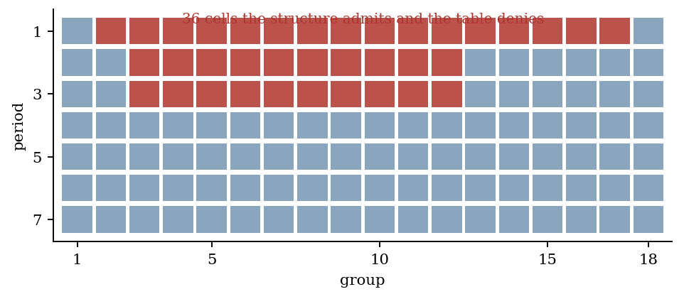
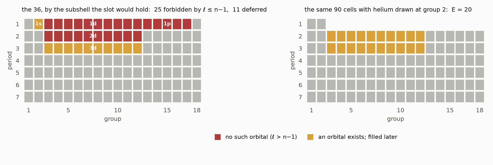
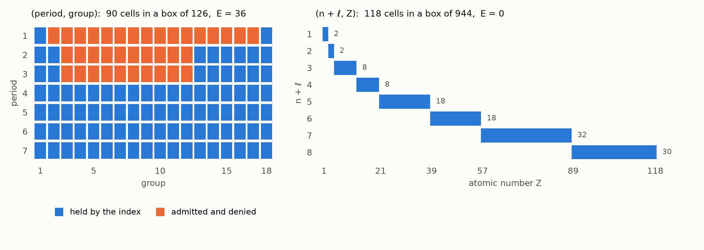
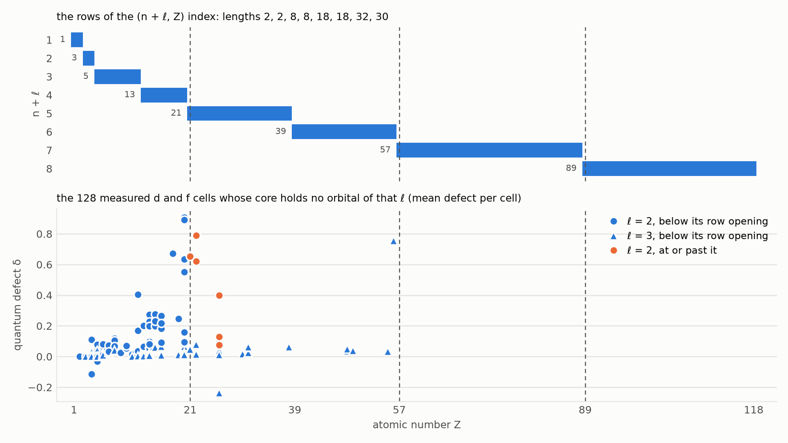
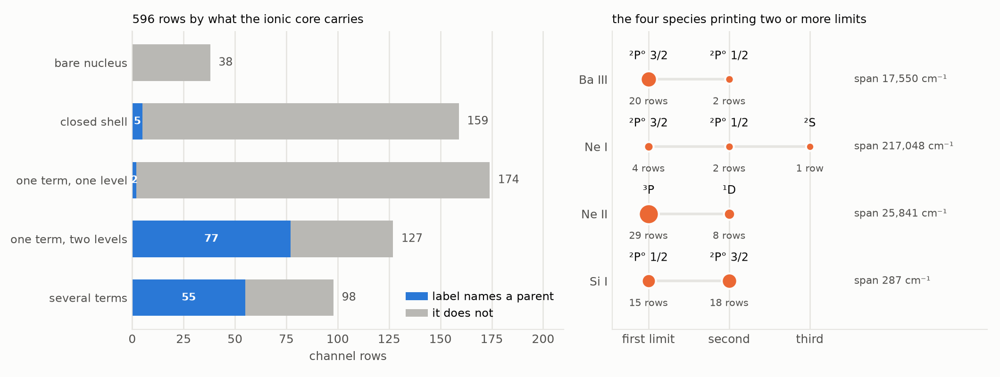

# The Parent-Term Wall and the Janet Collapse

**Two structural facts decide what a Rydberg spectrum can be indexed on: an open-shell ionic core carries one series per parent term and each converges on its own limit, so a label naming only species and orbital angular momentum is ambiguous exactly when its species carries more than one limit; and the elemental index itself, which on (period, group) admits thirty-six cells it does not hold, closes with defect zero on (n + ℓ, Z).**

**Matthew Lach** · Independent Researcher · 21 September 2026

---

## Abstract

An index is a set of cells on ordered coordinates. From the cells alone a reader may recover, for each ordered pair of coordinates, how far one reaches given the other; the cells those recovered bounds admit form a closure ℛ(X), and the *external definition cost* E(X) = |ℛ(X)| − |X| counts the cells a reader would reconstruct and the index denies. This paper computes E for the elemental index under three presentations and proves why each comes out as it does. On (period, group) the eighteen-column table holds 90 cells in a box of 126 and E = 36; the thirty-six are period 1 groups 2–17 and periods 2 and 3 groups 3–12, and the value is forced, because the table occupies both extreme corners of its box and a lemma proved here shows that any two-coordinate index doing so admits its whole box. Of the thirty-six, 25 are slots for an orbital that does not exist (ℓ > n − 1: 1d, 1p, 2d) and 11 are slots for one that exists and is filled later (3d, and the slot helium vacates); moving helium to group 2 takes E to 20, so sixteen of the thirty-six are the cost of one drawing convention. On (n + ℓ, Z) the same 118 elements give E = 0, and two independent structural properties each force it: the cells form a chain in the product order, and they are cut out by two isotone bounds. Both closure theorems are proved and then machine-checked by an SMT solver over every subset of six boxes. The second half measures the parent-term wall on a compilation of 596 Rydberg channels across 70 species and 28 elements. The LS terms of ℓ^k are counted exhaustively over all 17,476 Slater determinants of the relevant configurations; a closed-shell or one-electron core carries one term, a p² or p⁴ core three, a d⁴ core sixteen. 225 rows have a core with more than one level, 132 name the parent in the label and 93 do not, and every one of the 93 belongs to a species printing a single limit, so no row of the compilation is ambiguous. A parent is written in five distinct conventions; a census run with the commonest of them alone sees 80 of the 139 rows that carry one. Four species print two or more limits, and in each the limits and the parents are in bijection — Ba III's two limits are 17,550 cm⁻¹ apart, exactly the fine-structure interval of the core's ²P° term, so a single label printed at both is two channels and not a duplicated one.

---

## §0 · The result

**Two facts, one about an index and one about a spectrum, and each is a statement about coordinates rather than about chemistry.**

*The elemental index.* Take the 118 elements as cells and ask what their own coordinates imply. Nothing outside the cells enters: for each ordered pair of coordinates (i, j) read off the reach bound φ̂ᵢⱼ(v) = max{xᵢ : x ∈ X, xⱼ ≤ v}, and admit every cell of the observed product that respects all of them. The result is a closure operator ℛ (Lemma 1, Lemma 2, PROVED), and E(X) = |ℛ(X)| − |X| is the number of cells the coordinates admit and the index denies — cells whose absence a reader can learn only from outside the index.

| presentation | cells | box | E |
|---|---|---|---|
| eighteen-column (period, group), f-block set aside | 90 | 126 | **36** |
| thirty-two-column (period, group) | 118 | 224 | **106** |
| left-step (n + ℓ, Z), 118 elements | 118 | 944 | **0** |
| left-step (n + ℓ, Z), 120 cells | 120 | 960 | **0** |

The first line is forced by Lemma 3: an index on two coordinates that holds both extreme corners of its box admits every cell of that box. The eighteen-column table holds (period 1, group 18) — helium — and (period 7, group 1), so ℛ is all 7 × 18 = 126 cells and E is 126 − 90 (Theorem 3, PROVED and EXHAUSTIVE). The thirty-two-column layout holds the same two corners and gives 224 − 118 = 106 the same way. The last two lines are forced twice over: the cells of the left-step presentation form a chain in the product order, and a chain is a fixed point of ℛ (Theorem 1); and they are cut out by two isotone bounds, Z ≤ b(r) and r ≤ ρ(Z), and such a set is a fixed point of ℛ (Theorem 2). Both theorems are proved in §2 and machine-checked over every subset of six finite boxes.

The thirty-six are identified one by one (Theorem 4, EXHAUSTIVE). Reading a cell of the eighteen-column layout as the subshell its slot would hold — groups 1–2 the s slot, 3–12 the d slot, 13–18 the p slot — gives

> 25 cells for an orbital that does not exist, ℓ > n − 1: **1d** 10, **1p** 5, **2d** 10;
> 11 cells for an orbital that exists and is occupied later: **3d** 10, and **1s** at period 1 group 2, the slot helium vacates.

Drawing helium at group 2 instead of 18 destroys the first row of gaps and takes E from 36 to 20 (Proposition 1). E is therefore not a property of the elements: sixteen of the thirty-six are the price of one placement decision.

*The spectrum.* A Rydberg series converges on the ionisation limit of one *level* of the ionic core. A closed-shell core has one term and one level and gives one series per orbital angular momentum ℓ. An open-shell core has several, and each carries its own series converging on its own limit, so a label of the form "species + ℓ + term" does not name a channel. It names a channel exactly when the parent is recoverable, and the parent is not recoverable from the label when the species carries more than one limit and the label names no parent (Proposition 3).

Measured on a compilation of 596 channel rows across 70 species and 28 elements:

| what the core carries | rows | label names a parent | it does not |
|---|---|---|---|
| bare nucleus | 38 | 0 | 38 |
| closed shell | 159 | 5 | 154 |
| one term, one level | 174 | 2 | 172 |
| one term, two levels | 127 | 77 | 50 |
| several terms | 98 | 55 | 43 |
| **total** | **596** | **139** | **457** |

371 rows have a core with a single level and need no parent; 225 have a core with more than one, of which 132 name the parent and 93 do not. **Every one of the 93 belongs to one of thirteen species that prints exactly one limit**, so the compilation contains no ambiguous row — a measurement about this compilation, not a theorem about labels. Four species print two or more limits a wavenumber or more apart (Ba III, Ne I, Ne II, Si I, 99 rows between them), and in all four every row names its parent, one parent per limit, distinct parents at distinct limits.

*The census depends on the pattern it is taken with.* A parent may be written in five conventions, and they are counted separately (Table 4): a dotted core configuration with the parent level parenthesised (80 rows), the same run together without dots (9), the parent term alone in parentheses (20), and a jj pair (j_core, j) in which the first entry is the parent (30); 457 rows write no parent. A census that recognises only the first convention reports 80 rows of the 139 that carry one, an undercount of 59.

*Where the two halves meet.* The rows of the (n + ℓ, Z) index open at Z = 1, 3, 5, 13, 21, 39, 57, 89. The three openings at 21, 57 and 89 are the atomic numbers at which the 3d, 4f and 5f orbitals first contract into the core, and on the 128 measured d and f channels whose core holds no orbital of the channel's ℓ the defect separates across them: median 0.6202 at or past the opening against 0.0335 below it, Mann–Whitney U = 74, z = −3.66, two-sided p = 2.5 × 10⁻⁴ (Proposition 2, MEASURED). The threshold is read from the index and not fitted.

**What is not established.**

- **E = 36 is not tested against an independently stated constraint.** The reach bounds on (period, group) are read off the table's own cells, so the reconstruction and the object it reconstructs have one source. The closure of (n + ℓ, Z) is different in kind: it is certified by two structural properties of the cell set, each sufficient on its own, and either can be checked without computing ℛ at all.
- **Why the n + ℓ ordering governs filling is not explained here.** The row lengths 2, 2, 8, 8, 18, 18, 32, 32 are 2k′² with k′ = 1, 1, 2, 2, 3, 3, 4, 4, which is arithmetic; that ground configurations fill in that order is taken from the tabulated configurations and used, not derived. The question is open (Löwdin 1969; Allen and Knight 2003).
- **The collapse class has seven members.** They are Sc III, Ti III at two multiplicities, Ti IV, Fe VIII, Fe XV and Fe XVI, all at ℓ = 2, against 121 below the boundary. The transition is rapid and not sharp: the largest defect of all 128 is Ca I nd at 0.9084, which sits one below the 3d opening, and Ba II nf is 0.7559 one below the 4f opening. No f channel in the sample lies at or past its opening.
- **The absence of ambiguous rows is a property of this compilation.** Each of the thirteen species carrying unnamed multi-level cores prints one limit here; that is a fact about which series were captured, not a guarantee that those species have one limit.
- **The counts of rows naming a parent are a floor in the other direction too.** A row may be unambiguous for reasons the printed columns do not carry, and the census cannot see them.
- **The wall's strongest consequence is not measured here.** That a spectrum with a many-termed core yields published levels and no extractable defect is the structure of parentage (Condon and Shortley 1935; Racah 1943) applied to the term counts of §6; what this paper measures is the term counts themselves, the compilation's own ceiling of spectrum number IV for a multi-level core, and the obstacle counts the index records against d and f cores.

**Status words.** Six are used and never merged.

| status | meaning |
|---|---|
| **PROVED** | a proof is written out below and every step is justified |
| **MACHINE-CHECKED** | an SMT solver returned `unsat` on the negation of an obligation whose variables range over every subset of a named finite box, with both guards passed |
| **EXHAUSTIVE** | a decision procedure visited every case in a stated finite family, and the family's size is printed |
| **MEASURED** | a number computed from the stated data by the stated procedure; the paper's own result, with its sample stated |
| **CITED** | taken from the literature or from a public database, with the source |
| **REFUTATION** | a claim disproved by an explicit witness |

---

## §1 · Definitions

**D1 (index).** Let d ≥ 2 and let each coordinate i take values in a finite totally ordered set. An *index* is a finite non-empty set X of cells x = (x₁, …, x_d). Cells are compared coordinatewise: x ≤ y means xᵢ ≤ yᵢ for every i. This is the product order.

**D2 (value sets, box).** Âᵢ(X) = {xᵢ : x ∈ X} is the set of values coordinate i actually takes. The *box* of X is the product ∏ᵢ Âᵢ(X), and |box| = ∏ᵢ |Âᵢ(X)|.

**D3 (reach bounds).** For i ≠ j and v ∈ Âⱼ(X),

> φ̂ᵢⱼ(v) = max{ xᵢ : x ∈ X, xⱼ ≤ v }.

The set is non-empty for every v ∈ Âⱼ(X), since some cell realises the value v itself; so φ̂ᵢⱼ is defined on all of Âⱼ(X), and it is non-decreasing in v because enlarging v enlarges the set maximised over.

**D4 (the reconstruction ℛ, and the external definition cost E).**

> ℛ(X) = { x ∈ ∏ᵢ Âᵢ(X) : xᵢ ≤ φ̂ᵢⱼ(xⱼ) for all i ≠ j },  E(X) = |ℛ(X)| − |X|.

ℛ(X) is what a reader can reconstruct from the cells alone: the values that occur, and how far each coordinate reaches given each other. E(X) counts the cells that reconstruction admits and X denies. **E(X) = 0 is the statement that the index defines itself** — that no fact outside the cells is needed to say which cells there are.

**D5 (chain).** X is a *chain* when every two of its cells are comparable in the product order.

**D6 (Rydberg channel, quantum defect, series limit).** A *Rydberg channel* is a sequence of bound levels of one atomic species, one orbital angular momentum ℓ of the outer electron, and one *parent* — one level of the ionic core — with principal quantum number n running and term energies converging on the ionisation limit I of that parent. With core charge z, R the Rydberg constant for the species and E_n the level energy, the effective quantum number and the quantum defect are n* = z √(R / (I − E_n)) and δ_n = n − n*. Different parents have different I, so **two channels of one species and one ℓ built on two parents converge on two limits**.

**D7 (LS term, parent term, level).** In LS coupling a configuration is decomposed into terms ²ˢ⁺¹L, and a term into levels by the total angular momentum J, which runs over |L − S| … L + S. A *parent term* of a channel is the term of the ionic core on which the channel is built; a *parent* in the sense of D6 is one level of that term. The number of terms of a configuration is the number of distinct (L, S) pairs, counted with multiplicity, obtained by decomposing its (M_L, M_S) table.

**D8 (core class).** For a species, the *core* is the ion with one electron removed, in its ground configuration. A core is:

> *bare* — no electrons remain;
> *closed* — every occupied subshell is full, so the core is ¹S₀, one term and one level;
> *one term, one level* — open, but with a single term and that term with a single J;
> *one term, two levels* — open, with a single term whose L and S both exceed zero, giving more than one J;
> *several terms* — open, with more than one term.

The first three classes have exactly one core level. The last two have more, and only for those can a label that omits the parent fail to name a channel.

**D9 (p, the core's orbital count at ℓ).** For a channel of orbital angular momentum ℓ, p is the number of occupied subshells of that same ℓ in the core's ground configuration. p = 0 says the core holds no orbital of the channel's ℓ at all, so the outer orbital has no filled counterpart of its own symmetry.

---

## §2 · The reconstruction, and three closure theorems

**Lemma 1 (extensivity).** X ⊆ ℛ(X); hence E(X) ≥ 0.

**Proof.** Let x ∈ X. Then xᵢ ∈ Âᵢ(X) for each i, so x lies in the box. Fix i ≠ j. The cell x itself satisfies xⱼ ≤ xⱼ, so x is one of the cells maximised over in D3, and therefore φ̂ᵢⱼ(xⱼ) ≥ xᵢ. All the defining inequalities hold, so x ∈ ℛ(X). ∎

**Lemma 2 (idempotence).** ℛ(ℛ(X)) = ℛ(X). ℛ is a closure operator.

**Proof.** Write Y = ℛ(X). By Lemma 1, X ⊆ Y, and by D4, Y ⊆ ∏ᵢ Âᵢ(X); hence Âᵢ(Y) = Âᵢ(X) for every i, and the two sets have the same box. Let φ̂ᵢⱼ and ψ̂ᵢⱼ be the reach bounds of X and of Y. Since X ⊆ Y, every cell maximised over for φ̂ is maximised over for ψ̂, so ψ̂ᵢⱼ(v) ≥ φ̂ᵢⱼ(v). For the reverse, let y ∈ Y attain ψ̂ᵢⱼ(v), so yⱼ ≤ v. Because y ∈ ℛ(X), yᵢ ≤ φ̂ᵢⱼ(yⱼ), and φ̂ᵢⱼ is non-decreasing, so yᵢ ≤ φ̂ᵢⱼ(v). Hence ψ̂ᵢⱼ(v) ≤ φ̂ᵢⱼ(v), and the two bound families are equal. The defining condition of ℛ(Y) is then literally the defining condition of ℛ(X), and ℛ(Y) = ℛ(X) = Y. Monotonicity in X is immediate from the same comparison, so ℛ is extensive, monotone and idempotent: a closure operator in the sense of Moore (1910). ∎

Lemma 2 has a consequence worth stating, because it is the reason a *drawn* band never has a defect: E(ℛ(X)) = 0 for any X whatever. A closure defect is a measurement only when the cells measured are the object and not its closure.

**Theorem 1 (a chain is fixed).** If X is a chain, then ℛ(X) = X and E(X) = 0.

**Proof.** Enumerate the chain in order, x⁽¹⁾ < x⁽²⁾ < ⋯ < x⁽ᴺ⁾. Each coordinate map t ↦ x⁽ᵗ⁾ᵢ is non-decreasing, since x⁽ᵗ⁾ ≤ x⁽ᵗ⁺¹⁾ holds coordinatewise.

Let x ∈ ℛ(X). For each coordinate i the value xᵢ lies in Âᵢ(X), so the set {t : x⁽ᵗ⁾ᵢ = xᵢ} is non-empty; let tᵢ be its largest element. Because coordinate i is non-decreasing in t, {t : x⁽ᵗ⁾ᵢ ≤ xᵢ} is exactly {1, …, tᵢ}, and therefore

> φ̂ᵢⱼ(xⱼ) = max{ x⁽ᵗ⁾ᵢ : t ≤ tⱼ } = x⁽ᵗʲ⁾ᵢ,

again by monotonicity of coordinate i. The defining condition of ℛ thus reads xᵢ ≤ x⁽ᵗʲ⁾ᵢ for all i ≠ j.

Let m be an index at which tⱼ is least, so t_m ≤ tᵢ for every i. Fix any i ≠ m. On the one hand the condition at (i, m) gives xᵢ ≤ x⁽ᵗᵐ⁾ᵢ. On the other hand xᵢ = x⁽ᵗⁱ⁾ᵢ with tᵢ ≥ t_m, and coordinate i is non-decreasing, so xᵢ ≥ x⁽ᵗᵐ⁾ᵢ. Hence xᵢ = x⁽ᵗᵐ⁾ᵢ for every i ≠ m, and x_m = x⁽ᵗᵐ⁾_m by the choice of t_m. So x = x⁽ᵗᵐ⁾ ∈ X. With Lemma 1 this gives ℛ(X) = X. The argument used d ≥ 2 only to have, for each i ≠ m, a pair (i, m) available. ∎

**Theorem 2 (bi-monotone bounds are fixed).** Let d = 2, let A and B be finite totally ordered sets, let F : B → A and G : A → B be non-decreasing, and let

> X = { (a, b) ∈ A × B : a ≤ F(b) and b ≤ G(a) }.

Then ℛ(X) = X, and E(X) = 0.

**Proof.** By Lemma 1 it suffices to show ℛ(X) ⊆ X. Let (a, b) ∈ ℛ(X). Then a ≤ φ̂₁₂(b) and b ≤ φ̂₂₁(a), and (a, b) ∈ Â₁(X) × Â₂(X) ⊆ A × B.

Let y = (y₁, y₂) ∈ X attain φ̂₁₂(b), so y₂ ≤ b and y₁ = φ̂₁₂(b). Since y ∈ X, y₁ ≤ F(y₂), and F is non-decreasing with y₂ ≤ b, so y₁ ≤ F(b). Hence a ≤ φ̂₁₂(b) ≤ F(b). The same argument with the coordinates exchanged gives b ≤ φ̂₂₁(a) ≤ G(a). So (a, b) satisfies both defining inequalities of X and lies in A × B; therefore (a, b) ∈ X. ∎

Theorem 2 says which structures ℛ can recover: **precisely a pair of isotone bounds, one per ordered pair of coordinates.** It recovers nothing else, and an index whose true shape is such a pair loses nothing by being handed to a reader as a bare set of cells.

**Lemma 3 (the corners fill the box).** Let d = 2 and write a_min, a_max for the least and greatest elements of Â₁(X) and b_min, b_max for those of Â₂(X). If (a_min, b_max) ∈ X and (a_max, b_min) ∈ X, then ℛ(X) = Â₁(X) × Â₂(X): the whole box.

**Proof.** Let (a, b) be any cell of the box. For the first condition: (a_max, b_min) ∈ X and b_min ≤ b, so a_max is among the values maximised over in φ̂₁₂(b), whence φ̂₁₂(b) = a_max ≥ a. For the second: (a_min, b_max) ∈ X and a_min ≤ a, so b_max is among the values maximised over in φ̂₂₁(a), whence φ̂₂₁(a) = b_max ≥ b. Both conditions hold, so (a, b) ∈ ℛ(X). With ℛ(X) ⊆ box by definition, the two sets are equal. ∎

**The machine check.** Theorems 1 and 2 and Lemma 3 are decidable over a fixed finite box: quantify over every subset X of the box, encode membership in ℛ by the witness form

> x ∈ ℛ(X) ⟺ ⋀_{i ≠ j} ⋁_{y ∈ box} [ y ∈ X ∧ yⱼ ≤ xⱼ ∧ yᵢ ≥ xᵢ ],

which is equivalent to D3 without naming a maximum, and ask a solver to refute the negation of the implication. The encoding is guarded twice before any obligation is reported. The **fidelity guard** evaluates the witness form concretely against the closure computed directly from D3 and D4 on 300 pseudorandom subsets, seed 7, drawn from five box shapes: 3,578 cell decisions compared, 0 disagreements; the same guard applied to a deliberately wrong encoding, with strict inequality y_j < x_j in place of y_j ≤ x_j, disagrees on 2,007 of the 3,578, so the guard is not vacuous. The **non-vacuity guard** checks that each hypothesis is satisfiable by a subset that is strictly smaller than its box and holds at least two cells, so that `unsat` on the negation is not `unsat` on an empty hypothesis. Thirteen obligations were then discharged, all returning `unsat`:

| obligation | boxes |
|---|---|
| Theorem 1: chain ⇒ ℛ-closed | 3×3, 4×4, 5×5, 6×6, 3×3×3, 2×2×2×2 |
| Theorem 2: bi-monotone ⇒ ℛ-closed (F, G unknown isotone tables) | 3×3, 4×4, 5×5 |
| Lemma 3: both corners ⇒ whole box | 3×3, 4×4, 5×5, 7×18 |

Status: **MACHINE-CHECKED** over the boxes named, in addition to PROVED in general. The 7 × 18 box of Lemma 3 is the box of the eighteen-column elemental index itself, so the corner argument of §3 is machine-checked on its own object over all 2¹²⁶ subsets.

---

## §3 · The elemental index on (period, group)

Take the eighteen-column layout with the f-block set aside: period 1 holds groups 1 and 18; periods 2 and 3 hold groups 1, 2 and 13–18; periods 4 through 7 hold all eighteen. That is 2 + 8 + 8 + 4 × 18 = 90 cells.

*Figure 1. The eighteen-column presentation as an index. Blue: the ninety cells it holds. Red: the thirty-six its own coordinates admit and it denies. A reader given only the occupied cells reconstructs all one hundred and twenty-six.*

**Theorem 3.** For the eighteen-column layout X, ℛ(X) is the full 7 × 18 box and E(X) = 126 − 90 = 36.

**Proof.** Â₁(X) = {1, …, 7} and Â₂(X) = {1, …, 18}, since period 4 alone realises every group and group 1 alone realises every period. The extreme corners are (period 1, group 18), which is helium, and (period 7, group 1), which is francium; both are cells of X. Lemma 3 applies and gives ℛ(X) = {1, …, 7} × {1, …, 18}, of size 126. Hence E = 126 − 90 = 36. ∎

The same computation run directly, as a staircase closure over the ambient product, returns |ℛ(X)| = 126 and E = 36, and a second, independently written implementation of D3–D4 returns the same set; both are EXHAUSTIVE over the 126-cell box. The two reach bounds are constant — φ̂(group ∣ period ≤ p) = 18 for every p and φ̂(period ∣ group ≤ g) = 7 for every g — which is Lemma 3's conclusion read as a pair of bounds.

**Theorem 4 (the thirty-six, identified).** The thirty-six cells of ℛ(X) ∖ X are period 1 groups 2–17 (16 cells), period 2 groups 3–12 (10) and period 3 groups 3–12 (10). Reading a cell (p, g) as the subshell its slot would hold — ℓ = 0 for g ≤ 2, ℓ = 2 for 3 ≤ g ≤ 12, ℓ = 1 for g ≥ 13, and n = p — they divide as

| the thirty-six | count |
|---|---|
| forbidden by ℓ ≤ n − 1: **1d** 10, **1p** 5, **2d** 10 | **25** |
| an orbital exists, and is occupied later: **3d** 10, and **1s** at (1, 2) | **11** |

**Proof.** The three lists are read off ℛ(X) ∖ X, which Theorem 3 computes; enumerating the 36 cells and applying the slot rule and the test ℓ > n − 1 is a finite check over 36 cases, all visited. For the two boundary readings: at period 1 the groups 3–12 give ℓ = 2 with n = 1, and 2 > 0, so all ten are forbidden; groups 13–17 give ℓ = 1 with n = 1, and 1 > 0, so those five are forbidden, and there are five rather than six because group 18 at period 1 is occupied by helium and is not a gap. The cell (1, 2) gives ℓ = 0 with n = 1, and 0 ≤ 0, so it is not forbidden: it is the 1s slot, and it is empty only because helium is drawn at group 18. At period 2 the ten d slots give ℓ = 2 with n = 2 and 2 > 1, forbidden; at period 3 they give ℓ = 2 with n = 3 and 2 ≤ 2, not forbidden — the 3d subshell exists and is filled at period 4 rather than period 3. Hence 10 + 5 + 10 = 25 forbidden and 10 + 1 = 11 deferred, and 25 + 11 = 36. ∎

Status: EXHAUSTIVE over the 36 cells.

*Figure 2. Left: the thirty-six coloured by the subshell each slot would hold — 25 red where no orbital of that ℓ exists at that n, 11 gold where one exists and is occupied later. Right: the same ninety cells with helium drawn at group 2. The entire first row of gaps disappears and E falls to 20, the twenty being periods 2 and 3, groups 3–12.*

**Proposition 1 (helium's placement costs sixteen cells).** Drawing helium at group 2 rather than 18, with all other cells unchanged, leaves 90 cells and gives E = 20; the twenty admitted cells are periods 2 and 3, groups 3–12.

**Proof.** With helium at group 2 the period-1 cells are (1, 1) and (1, 2), so φ̂(group ∣ period ≤ 1) = 2 rather than 18. The other reach bound is unchanged: φ̂(period ∣ group ≤ g) = 7 for every g, since group 1 is occupied at every period. The reconstruction is therefore {(p, g) : g ≤ φ̂(group ∣ period ≤ p)} = {(1, 1), (1, 2)} ∪ ({2, …, 7} × {1, …, 18}), of size 2 + 108 = 110, and E = 110 − 90 = 20. The twenty cells of ℛ(X) ∖ X are the ten d slots at each of periods 2 and 3, since periods 4–7 are full and period 1 now contributes nothing. Lemma 3 does not apply, because the corner (period 1, group 18) is no longer occupied. ∎

The difference, 36 − 20 = 16, is what it costs a reader to be told where helium is drawn. Helium's position is the most argued question in periodic-table design: the eighteen-column convention places it above neon, and the left-step form and a quantum-chemical case place it above beryllium (Scerri 2020). E measures the definitional cost of the choice and returns no verdict on it.

**Two further presentations, for scale.** The thirty-two-column layout, with the f-block inserted and all 118 elements drawn, has Â₁ = {1, …, 7}, Â₂ = {1, …, 32}, holds the corners (1, 32) and (7, 1), and so by Lemma 3 admits its whole 224-cell box: E = 224 − 118 = 106. Widening the drawing raises the defect. And adjoining a third coordinate, the block, to the eighteen-column layout — a coordinate that is a function of the group and is not monotone in it — raises E from 36 to 100. A coordinate carrying information the index already has is not free.

---

## §4 · The same elements on (n + ℓ, Z)

Order the subshells by n + ℓ, and within one value of n + ℓ by n. Filling them in that order, with capacity 2(2ℓ + 1) each, partitions the atomic numbers 1 … 118 into eight contiguous blocks, one per value of n + ℓ; write r(Z) for the value of n + ℓ of the block containing Z. The cells are the pairs (r(Z), Z). The rows have lengths

> 2, 2, 8, 8, 18, 18, 32, 30

— the last truncated only because the drawing stops at 118; admitting Z = 119 and 120 gives 32 and the sequence 2, 2, 8, 8, 18, 18, 32, 32, which is 2k′² for k′ = 1, 1, 2, 2, 3, 3, 4, 4 (EXHAUSTIVE: the eight products are checked). The rows open at

> Z = 1, 3, 5, 13, 21, 39, 57, 89

and end at Z = 2, 4, 12, 20, 38, 56, 88, 118.

*Figure 3. The same elements on two presentations. Left: (period, group), 90 cells in a box of 126, E = 36, with the thirty-six admitted cells in orange. Right: (n + ℓ, Z), 118 cells in a box of 944, E = 0, drawn as its eight rows with their lengths. The box on the right is more than seven times larger and the index denies nothing in it.*

**Theorem 5.** The 118 cells of the (n + ℓ, Z) presentation satisfy ℛ(X) = X and E(X) = 0, and this follows in two independent ways.

**Proof.** *First route.* The cells form a chain. If Z < Z′ then r(Z) ≤ r(Z′), because r is non-decreasing by construction — a row is a contiguous block of atomic numbers and the rows are laid out in increasing order — so (r(Z), Z) ≤ (r(Z′), Z′) coordinatewise. Every two cells are therefore comparable, and Theorem 1 gives ℛ(X) = X. Chainhood was verified over all C(118, 2) = 6,903 pairs (EXHAUSTIVE).

*Second route.* The cells are cut out by two isotone bounds. Put b(r) = max{Z : (r, Z) ∈ X}, so b = (2, 4, 12, 20, 38, 56, 88, 118), and ρ(Z) = max{r : (r, Z′) ∈ X for some Z′ ≤ Z} = r(Z). Both are non-decreasing, and

> X = { (r, Z) : 1 ≤ r ≤ 8, 1 ≤ Z ≤ 118, Z ≤ b(r), r ≤ ρ(Z) }

— verified cell by cell over the 8 × 118 grid (EXHAUSTIVE). Theorem 2 then gives ℛ(X) = X directly. ∎

Both routes were also run numerically: the staircase closure and an independent implementation of it each return |ℛ(X)| = 118 and E = 0, and the same holds for the 120-cell version in a box of 960.

**Closure follows the shape, not the count.** Appending a further cell that preserves the chain — for instance (3, 13), a hypothetical thirteenth member of the third row — leaves 119 cells and E = 0. Moving one element to the wrong row instead — deleting (5, 30) and inserting (2, 30) — breaks the chain and takes E to 54. E is a measurement of arrangement.

**The row coordinate is the configuration's own, but only when the whole configuration is read.** For every Z from 1 to 108 the largest value of n + ℓ over the occupied subshells of the tabulated ground configuration equals the row of Z: 108 agreements, 0 exceptions (EXHAUSTIVE over the 108 configurations). Read instead from the *differentiating* electron alone — the one subshell whose occupancy rises from Z − 1 to Z — the identification fails at exactly six elements, Z = 25, 30, 43, 47, 48 and 80, each the successor of an s-to-d rearrangement in which the added electron lands in the s subshell that the previous element had emptied. The row is a property of the whole configuration and not of the electron most recently added.

**Chainhood is sufficient, not necessary.** The subshells themselves, indexed by (n + ℓ, ℓ) for n ≤ 7 and ℓ ≤ 3, give 22 cells in a box of 40 with E = 0; its recovered bounds are ℓ ≤ min(⌊(n + ℓ − 1)/2⌋, 3) and (n + ℓ) ≤ 7 + ℓ, both isotone, so Theorem 2 applies. It is not a chain: (n + ℓ, ℓ) = (4, 1) and (5, 0) are incomparable. Theorem 2 covers cases Theorem 1 does not.

---

## §5 · Where the rows open, and what the spectra do there

The three highest row openings of the (n + ℓ, Z) index are Z = 21, 57 and 89. They are also the atomic numbers at which the 3d, 4f and 5f orbitals are taken to contract from diffuse outer orbitals into compact core ones — orbital collapse (Goeppert-Mayer 1941; Griffin, Andrew and Cowan 1969). The three thresholds used below are therefore **read off the index and not fitted to the spectra**; that is the whole of their claim to independence.

They are close to, and not identical with, the first occupation of the orbital in a tabulated ground configuration. 3d is first occupied at Z = 21, which is the opening exactly; 4f at Z = 58, one past the opening at 57, because lanthanum at 57 takes 5d; and 5f at Z = 91, two past the opening at 89, because actinium and thorium take 6d (EXHAUSTIVE over Z = 2 … 108, first occupation recorded for every subshell).

**Proposition 2 (the defect separates across the openings).** Among the 148 measured d and f channels of the quantum-defect index, 128 have p = 0 — the core holds no orbital of the channel's ℓ. Seven of the 128 sit at or past the opening of the corresponding row (21 for ℓ = 2, 57 for ℓ = 3) and 121 below it. The medians are 0.6202 and 0.0335. A two-sided Mann–Whitney test on the two groups gives U = 74, z = −3.66 and p = 2.5 × 10⁻⁴.

Status: **MEASURED**, sample 128 channels, split fixed in advance by the index and not fitted. The seven are Sc III nd, Ti III nd at two multiplicities, Ti IV nd, Fe VIII nd, Fe XV nd and Fe XVI nd, with defects 0.6533, 0.7899, 0.7987, 0.6202, 0.4000, 0.1278 and 0.0750.

*Figure 4. Upper: the eight rows of the (n + ℓ, Z) index, with the three highest openings marked at Z = 21, 57 and 89. Lower: the 128 measured d and f channels whose core holds no orbital of the channel's ℓ, plotted against Z. Orange marks the seven at or past the opening of their row.*

**Two cautions the data themselves impose.** The transition is rapid and not sharp: the single largest defect among the 128 is Ca I nd at 0.9084, at Z = 20, one below the 3d opening, and Ba II nf is 0.7559 at Z = 56, one below the 4f opening. And the contrast that makes the effect visible is a contrast between species that differ in nothing else the index records: Ti IV nd is 0.6202 and Sr II nf is 0.0618, a factor of 10.0, and both have p = 0.

The same structure appears in the index's own account of which of its 104,832 cells could be measured. The index records, against each unmeasured cell, a named obstacle rather than a probability, and three of the obstacles are parent counts: *open-shell core, 3 parents* on 9,756 cells, *16 parents* on 11,605, *119 parents* on 5,280. Recomputing the core configuration at each of those cells and counting its LS terms (§6) shows the three numbers to be exactly the maxima of the three blocks: every cell bounded at 3 has a core with one open p subshell and 3 terms; every cell bounded at 16 has one open d subshell, with 5, 8 or 16 terms; every cell bounded at 119 has one open f subshell, with 7, 17, 47, 73 or 119 (EXHAUSTIVE over the cells carrying those three strings). **The obstacle to measuring a quantum defect, stated cell by cell, is a term count.**

---

## §6 · The parent-term wall

**The rule.** A Rydberg series is defined against one ionisation limit, and an ionisation limit is the energy of one level of the ionic core (D6). A core with k levels therefore offers k limits, and the outer electron at a given ℓ builds a separate series on each. The series interleave in energy and are distinguished not by ℓ but by the parent.

The number of parents is a term count, and term counts are finite and computable.

**Theorem 6 (the terms of ℓ^k).** Enumerating every Slater determinant of ℓ^k — every k-subset of the 2(2ℓ + 1) spin-orbitals — and peeling the resulting (M_L, M_S) table from its highest entry gives the LS terms exactly. Over ℓ = 0, 1, 2, 3 and all k from 0 to 4ℓ + 2, this is 17,476 determinants; the term counts are

| ℓ^k | k = 0 | 1 | 2 | 3 | 4 | 5 | 6 | 7 | 8 | 9 | 10 | … |
|---|---|---|---|---|---|---|---|---|---|---|---|---|
| p^k | 1 | 1 | 3 | 3 | 3 | 1 | 1 | | | | | |
| d^k | 1 | 1 | 5 | 8 | 16 | 16 | 16 | 8 | 5 | 1 | 1 | |
| f^k | 1 | 1 | 7 | 17 | 47 | 73 | 119 | 119 | 119 | 73 | 47 | 17, 7, 1, 1 |

**Proof.** The determinants of ℓ^k are in bijection with the k-subsets of the 2(2ℓ + 1) spin-orbitals (m_ℓ, m_s), and every such determinant is an eigenvector of M_L = Σ m_ℓ and M_S = Σ m_s. The multiplicity table N(M_L, M_S) counting them is therefore exact. A term ²ˢ⁺¹L contributes exactly one determinant to each (M_L, M_S) with |M_L| ≤ L and |M_S| ≤ S, in steps of 1 and 2 respectively, so repeatedly taking the entry of largest M_S and then largest M_L that is still positive, recording a term with L = M_L and S = M_S, and subtracting its full rectangle, removes one term per pass and terminates with the table identically zero. The subtraction never goes negative at any step of the run — asserted at every decrement — so the peel is valid and the multiset of terms is the configuration's. The table is the standard construction (Condon and Shortley 1935, ch. VII). ∎

Status: **EXHAUSTIVE** over 17,476 determinants; the three rows are the published term tables and agree with them (CITED, Condon and Shortley 1935).

Two corollaries carry the wall.

**Corollary 1.** A closed subshell contributes one term, ¹S, and a configuration all of whose subshells are closed has exactly one term and one level. A single electron or a single hole in one subshell also gives one term — checked for ℓ = 0, 1, 2, 3 (EXHAUSTIVE). **A closed-shell core therefore gives exactly one Rydberg series per ℓ, and a label of the form "species + ℓ + term" names it unambiguously.**

**Corollary 2.** A p² or p⁴ core carries 3 terms, a d⁴ core 16, an f⁶ core 119. Such a core offers that many parent terms and more levels still, so its Rydberg spectrum decomposes into that many interleaved series, each converging on its own limit.

**Proposition 3 (when a label fails).** Let a series label name species, orbital angular momentum and the term of the outer complex, but no parent. The channel it denotes is determined if and only if the species' captured spectrum carries a single limit at that (ℓ, term); it is undetermined as soon as two limits are present, because the same (ℓ, term) may be built on either parent and the label does not say which.

**Proof.** Sufficiency: if only one limit is present, the parent is that limit's level and the label plus the species determines it, so D6's data are complete. Necessity: suppose two limits I₁ ≠ I₂ are present for the species. The two parents give two distinct series of the same ℓ, and in the coupling schemes used here the outer complex's term label does not encode the parent — an assertion with an explicit witness in this data. Stripping the parent prefix from every one of the 596 labels and keying on (species, stripped label), exactly two keys carry more than one limit, and only one of the two is a parent case: Ba III's `nd 2[3/2]* J=2` is printed at 289,100.000 and at 306,650.000 cm⁻¹ (EXHAUSTIVE over 596 rows; the other key is Ca II's, whose two limits differ by 0.010 cm⁻¹ and are one limit at two roundings). So the outer label admits two distinct channels, with distinct limits and hence distinct defects, and does not determine one. ∎

The sufficiency direction is a statement about the data, not about physics: a species may have a multi-level core whose second limit simply was not captured. The paper's census in §7 measures which case each row of the compilation is in, and finds no row of the second kind.

---

## §7 · The census

**The data.** A compilation of measured Rydberg channels: 596 rows under an eleven-column header, 119 of them two-member channels, across 70 species and 28 elements, 3,342 levels and 2,269 interior cells; the levels are drawn from the NIST Atomic Spectra Database and from the published compilations of Kaufman and Martin (1991), Kramida and Martin (1997) and Sansonetti (2008a, 2008b). Each row carries the species, the series label, the range of n, the level and interior-cell counts, a containment column, the range of effective quantum number, the mean defect and its spread, the core charge and the series limit in cm⁻¹. Every count below is recomputed from the table itself; the row count was checked against an independent reader of the same table (EXHAUSTIVE, 596 rows, row indices identical).

**Table 4 — the five conventions in which a parent is written.**

| convention | example | rows |
|---|---|---|
| dotted core configuration, parent level parenthesised | `5p5.(2P*<3/2>).nd 2[3/2]* J=2` | 80 |
| the same run together, without dots | `2s22p5(2P*3/2)nd 2[3/2]* J=1` | 9 |
| the parent term alone, in parentheses | `(³P)ns ⁴P J=5/2` | 20 |
| a jj pair, the first entry the core's j | `nd (3/2,5/2)* J=3` | 30 |
| no parent written | `nd 2D J=3/2` | 457 |
| **carrying a parent** | | **139** |

A census taken with the first pattern alone — a dotted configuration followed by a parenthesised group — sees 80 of those 139 and reports 59 rows as parentless that are not. **The conventions have to be read off the material before a parent is counted**, and the margin between the narrowest and the widest reading is 59 rows of the 139.

**The core census.** For each of the 70 species the core is the ion at one fewer electron, in its ground configuration; its class (D8) is decided by counting the terms of its open subshell with Theorem 6. **No core in the compilation has more than one open subshell** — the six open shapes present are s¹, p¹, p², p⁴, p⁵ and d¹ (EXHAUSTIVE over the 70 species) — so a term count here is a single-subshell count and Theorem 6 gives it exactly, with no recoupling of two open shells to consider. Three ions whose ground configuration is not the configuration the electron count alone would give are taken from their published ground levels: Ti III's core Ti IV is 3d ²D₃/₂, Zn II's core Zn III is 3d¹⁰ ¹S₀, and Hg II's core Hg III is 5d¹⁰ ¹S₀ (CITED, NIST ASD). The result is the table of §0, repeated here with the split by whether the row's label names a parent:

| core | rows | parent named | not named |
|---|---|---|---|
| bare nucleus | 38 | 0 | 38 |
| closed shell | 159 | 5 | 154 |
| one term, one level | 174 | 2 | 172 |
| one term, two levels | 127 | 77 | 50 |
| several terms | 98 | 55 | 43 |

371 rows sit in the first three classes, where the core has one level and no parent needs writing; 7 of those write one anyway. The remaining 225 have a core with more than one level, 132 name the parent and 93 do not.

**Proposition 4 (the compilation carries no ambiguous row).** Each of the 93 rows whose core has more than one level and whose label names no parent belongs to one of thirteen species — Al IV, Ar I, Ar II, C I, F I, K II, Mg III, N I, N II, O III, P II, S III, Ti III — and each of those thirteen prints exactly one limit on every row it has. By Proposition 3 the parent of each of the 93 is determined.

Status: **EXHAUSTIVE**, 93 rows and 13 species, every row's limit compared.

*Figure 5. Left: the 596 rows by what the ionic core carries, with the part of each class whose label names a parent in blue. Right: the four species printing two or more limits, with the parent at each limit and the number of rows converging on it.*

**The four species with more than one limit.** Seven species print more than one value in the limit column. Three of the seven differ by less than a wavenumber — Ca II by 0.010, Li I by 0.036, Zn I by 0.020 cm⁻¹ — and are one limit written at two roundings, not two parents; they are excluded on that ground and not on any judgement about the physics. The remaining four are

| species | limits (cm⁻¹) | separation | rows at each | parent |
|---|---|---|---|---|
| Ba III | 289,100.000 / 306,650.000 | 17,550 exactly | 20 / 2 | ²P°₃/₂ / ²P°₁/₂ |
| Ne I | 173,929.750 / 174,710.090 / 390,977.350 | +780.34 / +217,047.60 | 4 / 2 / 1 | ²P°₃/₂ / ²P°₁/₂ / ²S |
| Ne II | 330,388.600 / 356,229.300 | 25,840.700 | 29 / 8 | ³P / ¹D |
| Si I | 65,747.760 / 66,035.000 | 287.240 | 15 / 18 | ²P°₁/₂ / ²P°₃/₂ |

All separations are computed in exact rational arithmetic from the printed values. **In all four species every row names its parent, each limit carries exactly one parent, and distinct limits carry distinct parents** (EXHAUSTIVE over the 99 rows). The pattern of the parents is the wall itself in two forms: in Ba III, Ne I and Si I the two lowest limits are the two levels ²P°₃/₂ and ²P°₁/₂ of a *single* term of a p⁵ core, so the splitting is fine structure; in Ne II the two limits are two *terms*, ³P and ¹D, of a p⁴ core, which Theorem 6 says has three; and Ne I's third limit, 217,047.60 cm⁻¹ above its first, belongs to a different core configuration altogether, 2s2p⁶ ²S.

**The ceiling.** No species in the compilation has a core with more than one level above spectrum number IV, and IV is reached once, by Al IV, whose core is 2p⁵ ²P°. The two highest-charge species present are Fe XV, whose core is a one-level 3s ²S₁/₂, and Fe XVI, whose core is closed. The compilation reaches charge 16 and stops at charge 4 for multi-level cores, which is what Corollary 2 predicts of a collection of *extractable* defects rather than of published levels.

**And the same ceiling appears in what can be measured at all.** Of the 104,832 cells of the quantum-defect index, 61,152 have Z ≤ 92; of those 11,416 also have core charge ≤ 10; of those 4,395 also have ℓ ≤ 4, where series resolve; and of those **1,755 also have a core with a single term.** The last cut is the wall, and it removes 2,640 of the 4,395 cells that survive the first three.

---

## §8 · Repeats that are not repeats

The wall has a practical consequence for anyone auditing such a table: **two rows that look like a duplicate may be two channels.** The clearest instance in this data is Ba III.

Ba III's core is Ba IV, ground configuration ending 5p⁵, a single hole in a p subshell and therefore by Corollary 1 a single term, ²P°, with two levels J = 3/2 and J = 1/2. The compilation prints Ba III channels at two limits, 289,100.000 and 306,650.000 cm⁻¹, differing by exactly 17,550 cm⁻¹ — the fine-structure interval of that ²P° term. The rows at the lower limit name ²P°₃/₂ and those at the upper name ²P°₁/₂. The outer label `nd 2[3/2]* J=2` is printed at both, and it is the only outer label in the table of which that is true for a genuine pair of limits (§6). Under the rule of §6 those two rows are **two series with two defects, not one series entered twice**, and there is nothing to repair.

The genuine repeats in the same table are of three kinds, and each was identified by reading the rows rather than by matching a pattern.

*One series printed under two notations.* Normalising a label by stripping its parent prefix and folding superscript typography, and keying on (species, series, n-range), the table holds exactly **four** repeated keys, all Ar II. Each pair agrees in n-range, level count, interior count, effective-quantum-number range, mean defect to four decimals, core charge and limit, and differs only in notation, in the containment column and in the spread σ(δ). Ar II prints one limit on all 44 of its rows, so no Ar II row is ambiguous about its parent and none of the four is a parent case (EXHAUSTIVE).

*One channel fitted in two adjacent windows of n.* Keying on (species, series, limit), Ba III holds two repeats, and in each the two rows' n-ranges are adjacent and disjoint: 5–7 with 8–22, and 6–8 with 9–23. Both halves of each pair carry the same parent. These are one channel fitted twice, at low n and at high n (EXHAUSTIVE).

*Two rows nothing printed separates.* Keying on (species, series, n-range) over the raw labels, the table holds exactly two repeated keys, both Si I: `nd (3/2,3/2)* J=1` at n = 20–50 and `nd (3/2,5/2)* J=3` at n = 20–56. Each pair agrees in every printed column except the containment column and the fourth decimal of δ. The key cannot separate them because nothing printed does.

The moral is narrow and worth stating. **A duplicate is a reading, not a pattern match.** The four notation pairs, the two window pairs, the two unseparated Si I pairs and the Ba III parent pair have the same shape under a key that ignores the limit, and four different dispositions once the limit and the core's term structure are read.

---

## §9 · What the wall means for bracketing

A companion study in this series examines the weakest useful statement one can make about a Rydberg series: that a level with a measured neighbour on each side lies between them. That containment is a deduction rather than a fit — it needs no ionisation limit, no quantum defect and no functional form — and it survives everything that leaves the order of the levels intact. The parent-term wall bears on it in one specific way, and the direction is favourable.

The bracket is a statement about *one* series. Its hypothesis is that the three levels are consecutive members of a monotone sequence. Where an open-shell core interleaves several series in one energy region, three levels adjacent *in the published list* need not be consecutive members of any one series, and the bracket's hypothesis fails not because the physics is different but because the levels have been sorted by energy across parents. So the wall sets the bracket's domain: it may be applied within a channel and not across an energy region, and identifying the channel is exactly identifying the parent.

That is why the census of §7 is a precondition and not a curiosity. In this compilation 225 rows have a core with more than one level, and had any of the 93 that write no parent belonged to a species with two limits, the levels behind that row could not be assigned to a series without further information, and no containment test run on them would mean anything. The census finds none, so every row of the compilation is a channel in the sense of D6, and the containment statement has a well-defined object at every one of its 2,269 interior cells. The containment column itself stands at 1,577 passing cells of 1,738 on 392 rows, with 78 rows carrying no three consecutive members and 126 rows whose test conditions the data do not meet — and the second of those two refusals is, in part, the wall again: a test that cannot reconstruct the parent-and-coupling selection behind a row declines to run rather than guessing it.

The general form of the point is this. **An index may bracket a quantity only along an axis on which the quantity is monotone**, and a Rydberg term is monotone in n within a parent and not across parents. The parent is therefore not a refinement of the channel label. It is part of the coordinate, and an index that omits it has, by exactly the measure of §2, cells it cannot define.

---

## §10 · Verification record

The machine checks behind this paper discharge 100 obligations, all passing, and a self-test adds four negative controls, each of which must be and is refuted. Every number printed in this paper is produced there.

| object | status | family or box | count |
|---|---|---|---|
| Lemma 1 (extensivity), Lemma 2 (idempotence) | PROVED | — | — |
| Theorem 1 (chain ⇒ closed) | PROVED + MACHINE-CHECKED | every subset of 3×3, 4×4, 5×5, 6×6, 3×3×3, 2×2×2×2 | 6 |
| Theorem 2 (bi-monotone ⇒ closed) | PROVED + MACHINE-CHECKED | every isotone (F, G) on 3×3, 4×4, 5×5 | 3 |
| Lemma 3 (corners ⇒ whole box) | PROVED + MACHINE-CHECKED | every subset of 3×3, 4×4, 5×5, 7×18 | 4 |
| Theorem 3, E(period, group) = 36 | PROVED + EXHAUSTIVE | the 126-cell box, two independent implementations | — |
| Theorem 4, the 36 identified | EXHAUSTIVE | 36 cells | — |
| Proposition 1, helium at group 2 | PROVED + EXHAUSTIVE | the 126-cell box | — |
| Theorem 5, E(n + ℓ, Z) = 0, both routes | PROVED + EXHAUSTIVE | 6,903 pairs; the 8 × 118 grid | — |
| row coordinate from the ground configurations | EXHAUSTIVE | 108 configurations | — |
| Theorem 6, the terms of ℓ^k | PROVED + EXHAUSTIVE | 17,476 Slater determinants | — |
| the channel census (§7), and that no core has two open subshells | EXHAUSTIVE | 596 rows, 70 species | — |
| Proposition 4, no ambiguous row | EXHAUSTIVE | 93 rows, 13 species | — |
| the four two-limit species, limits in exact arithmetic | EXHAUSTIVE | 99 rows | — |
| the repeats of §8, and the one outer label at two limits | EXHAUSTIVE | 596 rows under four keys | — |
| the index's obstacle counts as term counts (§5) | EXHAUSTIVE | 26,641 cells carrying the three strings | — |
| Proposition 2, the collapse | MEASURED | 128 channels, split fixed by the index | — |
| term tables of p^k, d^k, f^k | CITED | Condon and Shortley (1935) | — |
| ground configurations, ground levels, measured levels | CITED | NIST ASD and the compilations of §7 | — |

**The two guards.** No machine-checked obligation is reported unless both pass. *Encoding fidelity*: the witness form of ℛ used by the solver is evaluated concretely against the closure computed from the definition, on 300 pseudorandom subsets of five box shapes, seed 7 — 3,578 cell decisions, 0 disagreements. The same comparison run against a deliberately altered operator (strict inequality in place of ≤) disagrees on 2,007 of the 3,578, so the guard can fail and does when it should. *Non-vacuity*: the chain, corner and bi-monotone hypotheses are each shown satisfiable by a subset that is neither the whole box nor smaller than two cells, so a refuted negation is not a refuted emptiness.

**The negative controls.** "E(period, group) = 35" is refuted, the value being 36. "The index with one element moved to the wrong row is still closed" is refuted, E being 54 — the control was rewritten after a first version, which *appended* a cell rather than moving one, failed to be refuted: appending (3, 13) preserves the chain, so Theorem 1 keeps E at 0 and the construction was no control at all. "d⁴ carries 15 terms" is refuted, the count being 16. And "every subset of the 3 × 3 box that realises every coordinate value is ℛ-closed" is refuted by the solver, which returns `sat` with an explicit witness.

**What is not machine-checked, and why.** The channel census, the term enumeration and the two elemental indices are decided by exhaustive enumeration over finite families whose sizes are printed above; an SMT encoding would add nothing, since there is no quantifier over an unknown set. Proposition 2 is a statistic on a sample of 128 and is marked MEASURED, never EXHAUSTIVE: its class sizes are 7 and 121, its split is fixed in advance by the index rather than chosen to maximise the separation, and a rank test on seven values is reported with its U, its z and its p and with no claim beyond them.

---

## References

- Allen, L. C. and Knight, E. T. (2003). The Löwdin challenge: origin of the n + ℓ, n (Madelung) rule for filling the orbital configurations of the periodic table. *International Journal of Quantum Chemistry* **90**, 80–88.
- Condon, E. U. and Shortley, G. H. (1935). *The Theory of Atomic Spectra*. Cambridge University Press, Cambridge.
- Goeppert-Mayer, M. (1941). Rare-earth and transuranic elements. *Physical Review* **60**, 184–187.
- Griffin, D. C., Andrew, K. L. and Cowan, R. D. (1969). Theoretical calculations of the d-, f- and g-electron transition series. *Physical Review* **177**, 62–71.
- Hund, F. (1925). Zur Deutung verwickelter Spektren, insbesondere der Elemente Scandium bis Nickel. *Zeitschrift für Physik* **33**, 345–371.
- Janet, C. (1929). *La classification hélicoïdale des éléments chimiques*. Imprimerie Départementale de l'Oise, Beauvais.
- Kaufman, V. and Martin, W. C. (1991). Wavelengths and energy level classifications for the spectra of aluminum (Al I through Al XIII). *Journal of Physical and Chemical Reference Data* **20**, 775–858.
- Kramida, A., Ralchenko, Yu., Reader, J. and the NIST ASD Team (2024). *NIST Atomic Spectra Database*, version 5.12. National Institute of Standards and Technology, Gaithersburg. DOI 10.18434/T4W30F.
- Kramida, A. E. and Martin, W. C. (1997). A compilation of energy levels and wavelengths for the spectrum of neutral beryllium (Be I). *Journal of Physical and Chemical Reference Data* **26**, 1185–1194.
- Löwdin, P.-O. (1969). Some comments on the periodic system of elements. *International Journal of Quantum Chemistry* **3**(S3A), 331–334.
- Madelung, E. (1936). *Die mathematischen Hilfsmittel des Physikers*, 3rd ed. Springer, Berlin.
- Mann, H. B. and Whitney, D. R. (1947). On a test of whether one of two random variables is stochastically larger than the other. *Annals of Mathematical Statistics* **18**, 50–60.
- Mendeleev, D. (1869). Über die Beziehungen der Eigenschaften zu den Atomgewichten der Elemente. *Zeitschrift für Chemie* **12**, 405–406.
- Moore, E. H. (1910). *Introduction to a Form of General Analysis*. Yale University Press, New Haven.
- Pauli, W. (1925). Über den Zusammenhang des Abschlusses der Elektronengruppen im Atom mit der Komplexstruktur der Spektren. *Zeitschrift für Physik* **31**, 765–783.
- Racah, G. (1942). Theory of complex spectra. II. *Physical Review* **62**, 438–462.
- Racah, G. (1943). Theory of complex spectra. III. *Physical Review* **63**, 367–382.
- Ritz, W. (1903). Zur Theorie der Serienspektren. *Annalen der Physik* **12**, 264–310.
- Rydberg, J. R. (1890). Recherches sur la constitution des spectres d'émission des éléments chimiques. *Kongliga Svenska Vetenskaps-Akademiens Handlingar* **23**(11).
- Sansonetti, J. E. (2008a). Wavelengths, transition probabilities, and energy levels for the spectra of sodium (Na I–Na XI). *Journal of Physical and Chemical Reference Data* **37**, 1659–1763.
- Sansonetti, J. E. (2008b). Wavelengths, transition probabilities, and energy levels for the spectra of potassium (K I through K XIX). *Journal of Physical and Chemical Reference Data* **37**, 7–96.
- Scerri, E. R. (2020). *The Periodic Table: Its Story and Its Significance*, 2nd ed. Oxford University Press, Oxford.
- Seaton, M. J. (1983). Quantum defect theory. *Reports on Progress in Physics* **46**, 167–257.
- Stewart, P. J. (2010). Charles Janet: unrecognized genius of the periodic system. *Foundations of Chemistry* **12**, 5–15.
- Theodosiou, C. E., Inokuti, M. and Manson, S. T. (1986). An analytic Thomas–Fermi–Dirac approach to quantum defects of atoms and ions. *Atomic Data and Nuclear Data Tables* **35**, 473–500.
