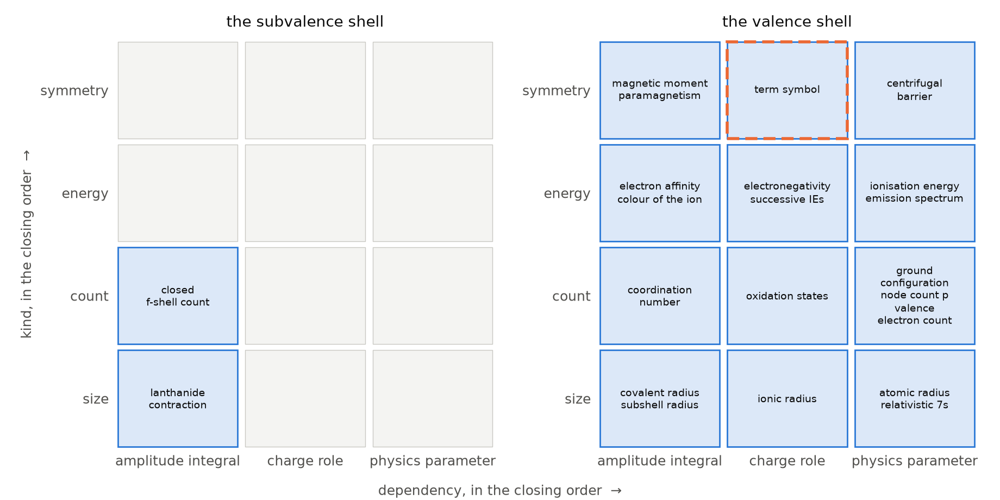

# Closing the chemical properties: a classification index for the elements

**Forty-two chemical properties of the elements, each given a kind, a seat in the species and a dependency, occupy fourteen cells over the subvalence and valence shells, and those fourteen close as an index (E = 0); the closure is carried by two subvalence cells beside a full valence block and rests on three sole-occupant assignments, and the paper measures exactly how much such a closure weighs — while the merge of the parameter and charge indexes closes on nine cells as a band of two floor functions.**

**Matthew Lach** · Independent Researcher · 24 September 2026

---

## Abstract

An *index* is a finite set of cells in a product of finite chains. Its *reconstruction* ℛ admits a cell of the ambient grid whenever, for every ordered pair of coordinates, some occupied cell lies at least as low on the second and at least as high on the first; its *defect* is E = ∣ℛ(X)∣ − ∣X∣, and the index is *closed* when E = 0. A closed index is exactly a system of monotone staircase inequalities, so closure asserts that the classification has no hole a monotone rule could not have left.

This paper indexes forty-two chemical properties of a chemical element on three coordinates — the **kind** of quantity a property is (count, symmetry, size, energy, rate), the **seat** in the species it belongs to (the nucleus, the core, the subvalence shell, the valence shell, the aggregate), and the **dependency**, which of a physics parameter, a role of the charge, or a Slater integral supplies it. The twenty-two properties of the subvalence and valence shells occupy fourteen cells of a 4 × 2 × 3 box, and those fourteen close: E = 0, over all 288 orderings of the realised coordinate values, sixteen of which close. The paper states what that closure is made of. The valence seat occupies every cell of its 4 × 3 block, and a full block is closed under every ordering; the whole content of E = 0 is that the two subvalence cells share a dependency, which is a position a closing ordering can place at the bottom corner. Beside a full block, 30 of the 66 possible pairs of subvalence cells close, and 6,432 of the 1,961,256 fourteen-cell subsets of the box close under some ordering. Seven of the fourteen cells have a single occupant, and emptying any one of three of them — the coordination number, the centrifugal barrier, the ground term — leaves thirteen cells that close under no ordering. Before the ground term was reassigned, thirteen cells gave minimum E = 1 under every ordering, and the vacancy was one of exactly two cells; the paper prints both and the fill that was chosen. Admitting the three outer seats raises the minimum defect to 2, 7, 10 and 18, but the dependency label is nominal at eighteen of the twenty outer-seat properties, so the climb measures the labels and not the properties.

A second index merges the twenty-one parameters of real atoms, indexed on (source, domain), with the nine occurrences of the charge, indexed on (role, regime), along the one axis the two share: the charge regime is the parameter domain at finer resolution. Nine cells, E = 0, and as a subset of the full 4 × 6 grid the nine are exactly the band ⌊s/2⌋ ≤ d ≤ s + ⌊s/3⌋. The amplitude index — the Slater integrals of a subshell pair — closes on twenty cells as the triangle 0 ≤ i ≤ ℓ once indexed on position within sequence rather than on multipole rank; for equivalent electrons the exchange integral is the direct integral at every rank, so the twenty cells name ten radial quantities.

Nothing here predicts the value of any property. The index closes, and the paper says what the closure weighs.

---

## §0 · The result

**A classification of chemical properties, and of the parameters a model of the atom uses, closes as an index — and the paper states what the closure consists of, what it rests on, and how common a closure of that shape is.**

Three results are claimed, and each is a statement about the shape of a finite classification, not about a measured number.

**First.** Forty-two chemical properties of a chemical element, each assigned a kind, a seat and a dependency (§1, Table 1), occupy fourteen distinct cells over the two outermost shells — the subvalence shell and the valence shell. Those fourteen cells are closed: E = 0, at the minimum over every one of the 288 orderings of the realised coordinate values, sixteen of which close (Theorem 1, EXHAUSTIVE). **The closure reduces to the position of two cells.** The valence seat occupies all twelve cells of its 4 × 3 block, and a full block is closed under every ordering; the two subvalence cells, (size, A) and (count, A), share a dependency, and a pair with a shared coordinate can be placed at the bottom corner of the block by an ordering. That is the whole of E = 0 here (Proposition 3). The weight of the claim is measured rather than asserted: beside a full valence block, 30 of the 66 pairs of subvalence cells close under some ordering, and 6,432 of the C(24, 14) = 1,961,256 fourteen-cell subsets of the box do (Proposition 4, EXHAUSTIVE). Seven cells have a single occupant, and the closure rests on three of those assignments: emptying the cell of the coordination number, of the centrifugal barrier or of the ground term leaves thirteen cells that close under no ordering, while emptying any of the other four leaves a closed index (Proposition 5, EXHAUSTIVE).

**Second.** Merging the twenty-one parameters of real atoms with the nine occurrences of the charge along their one shared axis gives nine cells with E = 0 (Theorem 4, EXHAUSTIVE). As a subset of the full 4 × 6 grid of sources against domains the nine are exactly the band ⌊s/2⌋ ≤ d ≤ s + ⌊s/3⌋, and the two ends of the band are its content: nothing from an international standard is restricted to a region, and nothing produced in this work claims universal validity.

**Third.** The Slater integrals of the diagonal subshell pairs s/s to f/f close on twenty cells as the triangle 0 ≤ i ≤ ℓ when indexed on position within sequence, and pay one cell of defect when indexed on the multipole rank (Theorems 5 and 6, EXHAUSTIVE). For equivalent electrons the exchange integral Gᵏ(nℓ, nℓ) is the direct integral Fᵏ(nℓ, nℓ) at every rank — the same integral under two names (Lemma 6, PROVED from the definition and checked in exact arithmetic on hydrogenic functions) — so a rule that keeps the direct term of a closed shell and drops its exchange discards no independent radial quantity at any ℓ (Corollary 1).

**What filled the last cell.** With the ground term assigned to a physics parameter the properties occupy thirteen cells, and thirteen do not close: every one of the 288 orderings gives minimum E = 1, and of the twenty minimising orderings sixteen leave the vacancy at (symmetry, the valence shell, a charge role) and four at (symmetry, the subvalence shell, an amplitude integral). The vacancy is therefore structural and not an artefact of how the coordinate values were ordered. It was filled by reassigning the ground term: along an isoelectronic sequence the ground term changes with the charge (Table 2, CITED), so the ground term is supplied by a charge role. **The fill is not unique.** Adding a new property at the other candidate cell also closes the index at fourteen cells, in four of the 288 orderings (Theorem 3, EXHAUSTIVE). The paper states the fill that was chosen and the alternative that was not adopted.

**What the defect of the wider table measures.** Admitting the core raises the minimum defect to 2; admitting the nucleus as well raises it to 7, and admitting the aggregate instead of the nucleus raises it to 10; admitting all five seats raises it to 18 (Theorem 2, EXHAUSTIVE over 86,400 orderings at the largest). The dependency coordinate is defined by what supplies a property's value (D10), and at the six nuclear and twelve aggregate properties none of the three families does: their dependency labels are nominal. Theorem 2 is therefore a measurement of those labels, reported because it was computed; it is not a boundary of the classification, and no conclusion about the outer-seat properties is drawn from it (§5).

**What is not established.** Six things, and they bound the whole paper.

1. **The assignments are declared, not measured.** Each property's kind, seat and dependency is a judgement about what the property is. The paper verifies that the declared assignment closes; it does not verify that the assignment is correct, and no procedure here would detect a systematic misassignment that happened to preserve the staircase.
2. **Closure of this shape is a weak constraint, and the paper prints the right base rates.** A minimum-over-orderings claim is to be read against the family of subsets closed under *some* ordering: 6,432 of the 1,961,256 fourteen-cell subsets of the 4 × 2 × 3 box, and 30 of the 66 pairs of subvalence cells beside a full valence block. The count of subsets closed at one fixed ordering (5,824 of 2²⁴) is a different and smaller family, printed in §2 for the enumeration and not offered as the base rate of Theorem 1.
3. **One cell was changed to reach closure**, and a different single change reaches it too (Theorem 3). A closed index obtained after a reassignment is evidence about the reassignment only to the extent that the reassignment is independently motivated; here it is, by Table 2, but Table 2 is four isoelectronic sequences.
4. **The index predicts nothing.** It states which family of quantities supplies a property and at which seat. It gives no value, no functional form and no bound (§9).
5. **Almost nothing here is checkable against an external tabulation.** The only externally sourced values in the paper are the twelve ground terms of Table 2 and five hydrogenic radial integrals used as a control (§8). Six of the forty-two properties are read off the ground configuration in the atomic spectra data of NIST; no source is named for the other thirty-six, and the paper takes no numerical value from any of the forty-two.
6. **The outer-seat labels are nominal.** The kind and dependency entered for the properties of the nucleus and of bulk matter are labels as compiled, not assignments the definitions of §1 license, and the paper defends none of them (§3, §5).

**Status words.** Six are used and never merged.

| status | meaning |
|---|---|
| **PROVED** | a proof is written out below and every step is justified |
| **EXHAUSTIVE** | a decision procedure visited every case in a stated finite family, and the family's size is printed |
| **MACHINE-CHECKED** | Z3 returned unsat on the negation of an obligation whose set variables range over every subset of a named finite box, with both guards passed |
| **SAMPLED** | a seeded pseudorandom sweep of a stated size; never exhaustive |
| **CITED** | taken from the literature or from a public database, with the source |
| **REFUTATION** | a claim disproved by an explicit witness |

---

## §1 · Definitions

**D1 (chain, box, index).** A *chain* is a finite totally ordered set; its elements are written 0 < 1 < … < m − 1. Fix n ≥ 2 chains A₁, …, Aₙ (n, the number of coordinates, is written as a subscript only here; in §8 n is a principal quantum number). A *box* is the product B = A₁ × ⋯ × Aₙ, and ∣B∣ = ∏ ∣Aᵢ∣ is its size. An *index* is a non-empty finite set X ⊆ B of *cells*. For a cell x write xᵢ for its i-th coordinate.

**D2 (realised values, own box).** The *realised values* of X on coordinate i are Aᵢ(X) := { xᵢ : x ∈ X }. The *own box* of X is Box(X) := A₁(X) × ⋯ × Aₙ(X). Every statement below that does not name a box explicitly is made over the own box; a statement made over a larger fixed box says so.

**D3 (the reconstruction ℛ).** For i ≠ j and a ∈ Aⱼ(X) put

> φᵢⱼ(a) := max { yᵢ : y ∈ X, yⱼ ≤ a }.

The *reconstruction* of X is

> ℛ(X) := { x ∈ Box(X) : xᵢ ≤ φᵢⱼ(xⱼ) for every ordered pair i ≠ j }.

**D4 (defect, closed).** The *defect* of X is E(X) := ∣ℛ(X)∣ − ∣X∣. X is *closed* when E(X) = 0. D3 and D4 are the reconstruction and defect of the closure law of the companion paper (Lach 2026); the part of that law this paper uses is proved in §2, and nothing else from the companion is used.

**D5 (ordering of an index).** ℛ depends on the order each chain carries. An *ordering* of X is a choice, for each coordinate i, of a bijection from Aᵢ(X) to {0, …, ∣Aᵢ(X)∣ − 1}; there are ∏ ∣Aᵢ(X)∣! of them. E depends on an ordering only through the total orders it induces on the realised values, so ∏ ∣Aᵢ(X)∣! is the number of distinct orderings. minE(X) is the minimum of E over all orderings, and a *closing ordering* is one at which E = 0. An ordering and its global reversal (Lemma 4) are distinct orderings, so a count of closing orderings counts each reversal pair twice.

**D6 (staircase system).** A *staircase system* over a box B is a family of non-decreasing maps fᵢⱼ : Aⱼ → Aᵢ ∪ {−∞}, one for each ordered pair i ≠ j, together with the set it defines,

> X(f) := { x ∈ B : xᵢ ≤ fᵢⱼ(xⱼ) for every i ≠ j }.

**D7 (the kind of a property).** Every chemical property is assigned exactly one *kind*, the sort of quantity it is:

> **count** · **symmetry** · **size** · **energy** · **rate**.

A count is an integer read off a configuration or a nucleus; a symmetry is a label of a state's transformation behaviour, or a quantity fixed by such a label and by nothing else about the species; a size is a length or a cross-section; an energy is an energy or an energy difference; a rate is a quantity per unit time or per unit potential gradient. The second clause of *symmetry* is there for one property of the closed index, the centrifugal barrier ℓ(ℓ+1)/2r², which at a given radius is fixed by the orbital angular-momentum label ℓ alone; §4 reports what happens to the closure when the barrier is read as an energy instead. At the nucleus and the aggregate the kinds are labels as compiled and are not claimed to satisfy this definition (§3).

**D8 (the seat of a property).** Every property is assigned exactly one *seat*, the part of the species to which it belongs:

> **the nucleus** · **the core** · **the subvalence shell** · **the valence shell** · **the aggregate**.

The valence shell is the outermost occupied shell; the subvalence shell is the outermost closed shell below it, the one whose occupancy screens the valence shell; the core is the closed shells below the subvalence shell. The five seats partition the species. The fifth seat is D9.

**D9 (the fifth seat).** **The aggregate** is the seat of a property of matter in bulk rather than of an isolated atom or ion. A property has this seat when its value is not defined for a single free species — when stating it requires a macroscopic sample. Twelve of the forty-two have it (§3).

**D10 (the dependency).** Every property is assigned exactly one *dependency*, a label with three values. At the subvalence and valence shells the label states which of three families of quantities supplies the property's value:

> **P**, *a physics parameter* — one of the parameters of the one-electron problem and its corrections, the quantities of the parameter index of §7;
> **C**, *a charge role* — one of the roles the charge c plays, the cells of the charge index of §7; the criterion applied in §6 is that the property's value varies with c at fixed electron number;
> **A**, *an amplitude integral* — one of the Slater integrals of the electron–electron term, the cells of the amplitude index of §8.

At the nucleus and the aggregate the label was entered but none of the three families supplies the value of a nuclear mass, a half-life, a melting point or a crystal structure; there the dependency is nominal, and §5 says what a computation over nominal labels measures.

**D11 (the chemical index).** Λ₁₄ is the index whose cells are the distinct triples (kind, seat, dependency) realised by the twenty-two properties of Table 1(c) and 1(d), with the assignments of Table 1. Λ₁₃ is the same index with the ground term assigned to P (§6). For a set S of seats, Λ(S) is the index of the properties whose seat lies in S.

**D12 (the Slater integrals of a pair).** For radial functions P and Q of two subshells and a rank k ≥ 0, Slater's radial integral is

> Rᵏ(PQ, P′Q′) := the integral over 0 < r₁, r₂ < ∞ of P(r₁)P′(r₁) Q(r₂)Q′(r₂) · r<ᵏ / r>ᵏ⁺¹,

with r< the smaller and r> the larger of r₁, r₂; the *direct* integral of the pair is Fᵏ(P, Q) := Rᵏ(PQ, PQ) and the *exchange* integral is Gᵏ(P, Q) := Rᵏ(PQ, QP) (Slater 1929; Condon and Shortley 1935; Cowan 1981), CITED. For subshells of orbital angular momenta ℓ, ℓ′ the multipole expansion of the interelectronic distance and the triangle and parity rules on the angular factors leave the direct integrals Fᵏ for k even, 0 ≤ k ≤ 2 min(ℓ, ℓ′), and the exchange integrals Gᵏ for k ≡ ℓ + ℓ′ (mod 2), ∣ℓ − ℓ′∣ ≤ k ≤ ℓ + ℓ′ (Slater 1929; Condon and Shortley 1935), CITED. A *diagonal pair* is a pair with ℓ = ℓ′; it is *equivalent* when the two radial functions are the same function (the same n and ℓ, as in a closed shell) and *non-equivalent* otherwise. For a diagonal pair the *position within sequence* of an integral of rank k is i := k/2, so that F⁰, F², F⁴, … have i = 0, 1, 2, … and likewise for G.

**Notation.** s is a source index and d a domain index in §7. c is the *charge stage* of a species — its net charge plus one, the Roman numeral of spectroscopic notation: c = 1 for a neutral atom, 2 for a singly charged positive ion, and so on; the model the parameters of §7 enter calls it the core charge, the charge the outermost electron sees from a fully screening core. Z is the atomic number and Nₑ the electron number. ⌊·⌋ is the integer floor. Absolute value and cardinality are written ∣·∣.

---

## §2 · The reconstruction, and what closure means

**Lemma 1 (witness form).** For every index X and every x ∈ Box(X),

> x ∈ ℛ(X)  ⟺  for every ordered pair i ≠ j there is y ∈ X with yⱼ ≤ xⱼ and yᵢ ≥ xᵢ.

*Proof.* Fix i ≠ j. Since x ∈ Box(X), the value xⱼ is realised, so some y ∈ X has yⱼ = xⱼ and the set { y ∈ X : yⱼ ≤ xⱼ } is non-empty; hence φᵢⱼ(xⱼ) is a maximum over a non-empty finite set and is attained, by y* say. If xᵢ ≤ φᵢⱼ(xⱼ) then y* is the required witness: y*ⱼ ≤ xⱼ and y*ᵢ = φᵢⱼ(xⱼ) ≥ xᵢ. Conversely a witness y has yⱼ ≤ xⱼ, so yᵢ ≤ φᵢⱼ(xⱼ), and xᵢ ≤ yᵢ gives xᵢ ≤ φᵢⱼ(xⱼ). The equivalence holds for each pair separately, hence for the conjunction over all pairs. ∎ **PROVED**, and corroborated: the implementation under test agrees with an independently written witness-form implementation on all 288 orderings of the chemical index and on 300 random indexes over five shapes (seed 8), with no disagreement.

**Lemma 2 (ℛ is a closure operator).** Over a fixed box B, write ℛ(X; B) := { x ∈ B : xᵢ ≤ φᵢⱼ(xⱼ) ∀ i ≠ j } with φᵢⱼ(a) := max{ yᵢ : y ∈ X, yⱼ ≤ a } and max ∅ := −∞. Then for all X, Y ⊆ B:

(i) X ⊆ ℛ(X; B);  (ii) X ⊆ Y ⟹ ℛ(X; B) ⊆ ℛ(Y; B);  (iii) ℛ(ℛ(X; B); B) = ℛ(X; B).

*Proof.* Over a fixed box the witness form of Lemma 1 holds verbatim, with max ∅ = −∞ excluding a cell for which some pair has no witness. (i) For x ∈ X and any pair i ≠ j, the cell y := x satisfies yⱼ ≤ xⱼ and yᵢ ≥ xᵢ. (ii) A witness for X is a witness for Y. (iii) Put S := ℛ(X; B). By (i) and (ii), S ⊆ ℛ(S; B). Conversely let x ∈ ℛ(S; B) and fix i ≠ j. There is y ∈ S with yⱼ ≤ xⱼ and yᵢ ≥ xᵢ. Since y ∈ S, there is z ∈ X with zⱼ ≤ yⱼ ≤ xⱼ and zᵢ ≥ yᵢ ≥ xᵢ. As the pair was arbitrary, x ∈ ℛ(X; B) = S. ∎ **PROVED**, and **MACHINE-CHECKED** over the four boxes 4 × 2 × 3, 4 × 5, 4 × 6 and 2 × 4 × 4, with the set variable ranging over all 2²⁴, 2²⁰, 2²⁴ and 2³² subsets respectively, for all three parts and with no hypothesis on X.

Note that Box(ℛ(X)) = Box(X): ℛ(X) ⊇ X realises at least the values X realises, and ℛ(X) ⊆ Box(X) realises no others. So the own-box operator is idempotent too, by (iii) applied at B = Box(X).

**Lemma 2′ (ℛ(X; B) is a sublattice).** For every X ⊆ B and x, y ∈ ℛ(X; B), the join x ∨ y (coordinatewise maximum) and the meet x ∧ y (coordinatewise minimum) lie in ℛ(X; B).

*Proof.* Fix a pair i ≠ j and let z be whichever of x, y has the larger i-th coordinate, so zᵢ = (x ∨ y)ᵢ and zⱼ ≤ (x ∨ y)ⱼ. Since z ∈ ℛ(X; B) there is w ∈ X with wⱼ ≤ zⱼ ≤ (x ∨ y)ⱼ and wᵢ ≥ zᵢ = (x ∨ y)ᵢ, a witness for x ∨ y at this pair. For the meet let z be whichever of x, y has the smaller j-th coordinate, so zⱼ = (x ∧ y)ⱼ and zᵢ ≥ (x ∧ y)ᵢ; a witness w ∈ X for z at the pair has wⱼ ≤ zⱼ = (x ∧ y)ⱼ and wᵢ ≥ zᵢ ≥ (x ∧ y)ᵢ. ∎ **PROVED**, and **MACHINE-CHECKED** over the same four boxes, all subsets.

**Where ℛ sits.** By Lemma 2 the sets with ℛ(X; B) = X form a closure system on the powerset of B (Davey and Priestley 2002), and by Lemma 2′ every member is a sublattice of the product of chains. The system is neither of the two closure systems a reader might expect. It is not the down-set (order-ideal) closure: the chain {(0, 0), (1, 1)} in the 2 × 2 box is closed and is not a down-set, and the down-set {(0, 0), (1, 0), (0, 1)} has E = 1, gaining (1, 1). It is not the sublattice closure either: the antichain {(0, 1), (1, 0)} gains both its join and its meet, as a sublattice closure would, but the set {(0, 0), (2, 0), (0, 2), (2, 2)} is a sublattice of the 3 × 3 box and is not closed over that box, since (1, 0) has the witnesses (2, 0) and (0, 0). What the closed sets are is stated by Lemma 3: the sets cut out by one monotone bound per ordered pair of coordinates — the sublattices of the product that are determined by their pairwise projections. All four witnesses are **EXHAUSTIVE** (obligation K1).

**Lemma 3 (the staircase law, the part used here).** An index X (non-empty, by D1) is closed if and only if X = X(f) for some staircase system f over Box(X).

*Proof.* (⇐) Suppose X = { x ∈ Box(X) : xᵢ ≤ fᵢⱼ(xⱼ) ∀ i ≠ j } with every fᵢⱼ non-decreasing. ℛ(X) ⊇ X by Lemma 2(i). For the reverse, fix i ≠ j and a ∈ Aⱼ(X). Every y ∈ X with yⱼ ≤ a has yᵢ ≤ fᵢⱼ(yⱼ) ≤ fᵢⱼ(a), so φᵢⱼ(a) ≤ fᵢⱼ(a). Hence any x ∈ ℛ(X) satisfies xᵢ ≤ φᵢⱼ(xⱼ) ≤ fᵢⱼ(xⱼ) for every pair, and x ∈ Box(X), so x ∈ X. Thus ℛ(X) = X. (⇒) If E(X) = 0 then X = ℛ(X), which is by definition { x ∈ Box(X) : xᵢ ≤ φᵢⱼ(xⱼ) ∀ i ≠ j }, and each φᵢⱼ is non-decreasing because it is a maximum over a set that grows with its argument. ∎ **PROVED**, and the (⇐) direction **MACHINE-CHECKED** over the same four boxes: for every assignment of monotone fᵢⱼ and every subset X realising all values of the box, X = X(f) implies ℛ(X) = X.

**Lemma 3 says what a closure claim asserts.** E = 0 is not a claim that the occupied cells form a nice picture. It is the claim that the occupied set is cut out of its own grid by one monotone inequality per ordered pair of coordinates — that the classification has no hole a monotone rule could not have left, and no cell outside it that a monotone rule would have had to include.

**Lemma 4 (global reversal).** Let σ reverse every chain of Box(X) at once: σ(x)ᵢ := ∣Aᵢ(X)∣ − 1 − xᵢ. Then ℛ(σX) = σ(ℛ(X)), and in particular E(σX) = E(X).

*Proof.* σ is an involution of Box(X) and Box(σX) = Box(X). By Lemma 1, σ(x) ∈ ℛ(σX) iff for every ordered pair (i, j) with i ≠ j there is y ∈ X with σ(y)ⱼ ≤ σ(x)ⱼ and σ(y)ᵢ ≥ σ(x)ᵢ, that is with yⱼ ≥ xⱼ and yᵢ ≤ xᵢ. Relabelling the pair (i, j) as (j, i) — a bijection of the index set of ordered pairs — turns this family of conditions into: for every (i, j), i ≠ j, there is y ∈ X with yⱼ ≤ xⱼ and yᵢ ≥ xᵢ, which by Lemma 1 is x ∈ ℛ(X). ∎ **PROVED**; the set identity ℛ(σX) = σ(ℛ(X)) is corroborated **SAMPLED** on 200 random indexes over three shapes (seed 3), and **EXHAUSTIVE** on the chemical index, where the sweep halved by Lemma 4 reproduces the full sweep over all 288 orderings.

Lemma 4 is why the sweeps below halve one axis: reversing every axis maps closing orderings to closing orderings, so closing orderings come in pairs and it suffices to visit one of each. Every "EXHAUSTIVE over N orderings" below visits N/2 orderings — those in which the last axis's first value precedes its last — and counts each for itself and for its reversal; the number visited is printed beside the family in §10.

**The closed families, enumerated.** So that a closure claim is a statement about a named family and not an isolated assertion, the family of all closed subsets of each box used in this paper is enumerated twice by independent means: once by Ganter's next-closure algorithm, which visits each closed set of a closure operator exactly once (Ganter 2010; Ganter and Wille 1999), and once by visiting every subset of the box. For the fixed-box column next-closure runs over the box; for the own-box column it runs over every sub-box, counting the closed subsets that realise all of that sub-box, weighted by the number of ways to choose the sub-box. The two routes agree in every case, and every count is pinned.

| box | subsets visited | closed as subsets of the fixed box | closed with respect to their own box |
|---|---|---|---|
| 2 × 3 | 2⁶ | 33 | 38 |
| **4 × 2 × 3** (the chemical index) | **2²⁴** | **5,824** | **8,590** |
| 4 × 5 (the merged index, realised) | 2²⁰ | 3,449 | 7,887 |
| 4 × 6 (source × domain, full) | 2²⁴ | 9,115 | 27,477 |
| 2 × 4 × 4 (the amplitude index) | — | 29,067 | — |

All rows are **EXHAUSTIVE**; the 2 × 4 × 4 row is by next-closure only, its 2³² subsets not being enumerable in the time budget. Within the fourteen cells of the chemical index, 1,482 of the 2¹⁴ = 16,384 subsets are themselves closed, the count by size running 1, 14, 70, 176, 270, 288, 242, 175, 114, 66, 37, 17, 8, 3, 1 from the empty set up (**EXHAUSTIVE**, every subset visited).

**The family a minimum-over-orderings claim belongs to.** A claim of the form "minE(X) = 0" places X in the family of subsets closed under *some* ordering of the realised values, which is the union of the orbits of the closed sets under the relabellings of the axes. For fourteen-cell subsets of the 4 × 2 × 3 box that family is enumerated: 128 fourteen-cell subsets are closed at a fixed ordering, and **6,432** of the C(24, 14) = 1,961,256 fourteen-cell subsets are closed under some ordering (**EXHAUSTIVE**: every closed set of the box under all 288 relabellings). That is the denominator against which Theorem 1 is read.

---

## §3 · The forty-two properties

The properties are those of a chemical element — of a species (Z, c) and, at the fifth seat, of the bulk substance the element forms. Each carries a kind (D7), a seat (D8, D9) and a dependency (D10). The list is the list as compiled: an informal enumeration of what is commonly asked of an element, not a closed or a standard one. Standard tabulations carry properties it omits (polarisability, electrode potential, work function, enthalpies of phase change, among others), and it carries entries a tabulation would not (smell, taste). Nothing below depends on the list being complete; Theorem 1 is a statement about the twenty-two entries at the two closed seats.

The paper takes no numerical value from any of the forty-two. Six of them — the ground configuration, the node count, the valence electron count, the closed f-shell count, the ionisation energy and the ground term — are read off, or are, entries of the atomic spectra data of NIST (Kramida, Ralchenko, Reader and the NIST ASD Team 2024); no public source is named here for the other thirty-six.

**Table 1 · the forty-two properties, by seat.** Columns: kind · dependency · what the property is. At the nucleus and the aggregate the kind and dependency are labels as compiled (D7, D10), and the paper does not defend them; the two core properties and the twenty-two of the closed seats are the assignments the definitions are meant for.

### (a) the nucleus — six properties

| property | kind | dep. | what it is |
|---|---|---|---|
| atomic mass | count | P | the mass of the nuclide in unified mass units |
| isotope abundance | count | P | the fraction of a natural sample carried by one nuclide |
| nuclear spin | symmetry | P | the total angular momentum of the nuclear ground state |
| radioactive half-life | rate | P | the time in which half a sample of the nuclide decays |
| neutron cross-section | size | P | the effective area the nucleus presents to an incident neutron |
| nuclear charge Z | count | C | the number of protons (Z is not a role of the charge stage c; the label is nominal) |

### (b) the core — two properties

| property | kind | dep. | what it is |
|---|---|---|---|
| closed core ¹S₀ | symmetry | P | whether the closed inner shells leave a single spinless, spherically symmetric parent |
| core binding energy | energy | C | the energy to remove an electron from a closed inner shell |

### (c) the subvalence shell — two properties

| property | kind | dep. | what it is |
|---|---|---|---|
| lanthanide contraction | size | A | the extra shrinkage of the radii across a period caused by a filled f shell screening poorly; entered as an amplitude quantity because incomplete screening by the f shell's charge distribution is an electron–electron effect, the relativistic part of the contraction (Pyykkö 1988) being left aside |
| closed f-shell count | count | A | the number of f electrons in the closed subvalence shell, read off the ground configuration |

### (d) the valence shell — twenty properties

| property | kind | dep. | what it is |
|---|---|---|---|
| ground configuration | count | P | the occupied subshells of the lowest state, as observed |
| node count p | count | P | n − ℓ − 1, the radial nodes of the valence orbital, read off the ground configuration |
| oxidation states | count | C | the integer charges the element adopts in compounds |
| valence electron count | count | P | the number of electrons outside the closed core, read off the ground configuration |
| coordination number | count | A | the number of nearest neighbours the species accepts in a compound |
| ionisation energy | energy | P | the energy to remove the least bound electron |
| electron affinity | energy | A | the energy released on binding one further electron |
| electronegativity | energy | C | the element's pull on shared electron density |
| successive IEs | energy | C | the sequence of energies to remove electrons one after another |
| emission spectrum | energy | P | the set of observed transition energies |
| colour of the ion | energy | A | the visible absorption of the ion in its common complexes — a ligand-field property, entered at the valence shell |
| atomic radius | size | P | the radius of the neutral atom |
| ionic radius | size | C | the radius of the ion at a stated charge |
| covalent radius | size | A | half the distance between like atoms sharing a single bond |
| subshell radius | size | A | the mean radius of one occupied subshell |
| relativistic 7s | size | P | the contraction of the outermost s shell by relativistic mass increase |
| centrifugal barrier | symmetry | P | the ℓ(ℓ+1)/2r² term that keeps a high-ℓ electron out of the core; a symmetry under the second clause of D7 |
| term symbol | symmetry | **C** | the ground term of the species: the multiplicity, L and J of its lowest level |
| magnetic moment | symmetry | A | the magnetic moment of the ground level |
| paramagnetism | symmetry | A | whether the ground level has unpaired spin |

### (e) the aggregate — twelve properties

| property | kind | dep. | what it is |
|---|---|---|---|
| density | size | P | mass per unit volume of the bulk element |
| melting point | energy | A | the temperature of the solid–liquid transition |
| boiling point | energy | A | the temperature of the liquid–vapour transition |
| hardness | energy | A | the resistance of the solid to plastic indentation |
| crystal structure | symmetry | A | the space group of the stable solid phase |
| electrical conductivity | rate | C | charge transported per unit field |
| thermal conductivity | rate | C | heat transported per unit temperature gradient |
| colour of the metal | energy | A | the visible reflectance of the bulk metal |
| smell | rate | A | the olfactory response the substance provokes |
| taste | rate | A | the gustatory response the substance provokes |
| metallic character | symmetry | C | whether the element's bonding is delocalised |
| reactivity | rate | C | how fast the element enters reaction under stated conditions |

**Proposition 1 (the census).** The forty-two names are distinct. By kind the counts are 9 (count), 8 (symmetry), 8 (size), 11 (energy), 6 (rate). By seat they are 6, 2, 2, 20, 12 for the nucleus, the core, the subvalence shell, the valence shell and the aggregate. By dependency there are two counts, because one property moves between two of the three values in §6: with the ground term on a physics parameter the counts are **(16 P, 10 C, 16 A)**, and with the ground term on a charge role, as Table 1 above states it, they are **(15 P, 11 C, 16 A)**. **EXHAUSTIVE** over the forty-two rows, both assignments.

**Proposition 2 (Table 1 is consistent with D9).** The twelve properties whose seat is the aggregate are exactly density, melting point, boiling point, hardness, crystal structure, electrical conductivity, thermal conductivity, colour of the metal, smell, taste, metallic character and reactivity — the twelve entries whose value requires a macroscopic sample. **EXHAUSTIVE** over the forty-two rows.

Proposition 2 checks the table against the definition; it does not justify the fifth seat. The reason the seat exists is that twelve entries of the list as compiled had no seat inside a free atom, and the index can distinguish an atomic property from a bulk one only because a seat exists to hold the difference.

**A coordinate that was not used.** A fourth candidate coordinate, the *breadth* of a property — every species, a block, a period, one subshell — assigns the same kind and the same seat to the same forty-two properties (**EXHAUSTIVE**, forty-two rows). It is not used as an axis, and the cost of using it is measured: on (kind, seat, breadth) the twenty-two properties of the two closed seats occupy eleven cells of a 4 × 2 × 4 box, and the minimum defect over all 1,152 orderings is **2** — no ordering closes them (**EXHAUSTIVE**). The same fault is measured again in §8, where the corresponding coordinate of the amplitude index costs one cell of defect.

---

## §4 · The chemical index closes, and what the closure consists of

**Theorem 1.** Let Λ₁₄ be the index of the properties of Table 1(c) and 1(d) on (kind, seat, dependency). Then:

1. the twenty-two properties occupy exactly **fourteen** distinct cells;
2. the realised values are four kinds — count, symmetry, size, energy, the kind *rate* being unrealised at these two seats — two seats and three dependencies, so the own box has **24** cells;
3. the minimum defect over all 4! · 2! · 3! = 288 orderings is **E = 0**, and **sixteen** orderings close;
4. the fourteen cells are exactly the lattice points of a staircase system over their own box.

**EXHAUSTIVE**: the 288 orderings are visited up to the reversal symmetry of Lemma 4 (144 visited, each standing for itself and its reversal), and the halving is checked against the full sweep (§10, J2). The 1,440 orderings obtained by also permuting the unrealised fifth kind are the same 288 counted five times, since a value no cell realises is not in the own box and cannot change ℛ (D2).

*Proof of (4), given (3).* Immediate from Lemma 3 (⇒). The staircase system is exhibited below and verified directly. ∎

**The staircase, written out.** Order the seats subvalence < valence, the kinds size < count < energy < symmetry and the dependencies A < C < P. At this ordering the functions φᵢⱼ of D3 are constant — that is, impose nothing — except for two:

> φ(kind ← seat) : subvalence ↦ count, valence ↦ symmetry
>
> φ(dep ← seat) : subvalence ↦ A, valence ↦ P

so the fourteen cells are exactly

> { (k, s, p) ∈ Box : k ≤ φ(kind ← seat)(s) and p ≤ φ(dep ← seat)(s) },

which at the subvalence seat admits the two kinds size and count on the dependency A alone, and at the valence seat admits all four kinds on all three dependencies: 2 + 12 = 14. That the set so defined is exactly the fourteen cells is checked directly (**EXHAUSTIVE**, 24 lattice points tested).

**Proposition 3 (what the closure consists of).** The valence seat occupies every one of the twelve cells of its 4 × 3 block, and the subvalence seat occupies exactly two cells, (size, A) and (count, A) (**EXHAUSTIVE**, 22 properties). Consequently Theorem 1 reduces to the position of those two cells: a full block is closed under every ordering, and beside a full block a pair of subvalence cells closes under some ordering if and only if the pair shares a kind or a dependency.

*Proof.* Let V be the full block {(k, valence, p)} and S the subvalence cells, and order the seats subvalence < valence. For any pair of coordinates not involving the seat, the bound φᵢⱼ is attained on V, which realises every (kind, dependency) combination, so it equals the top of the chain and imposes nothing; likewise φ(seat ← kind) and φ(seat ← dependency) equal *valence* everywhere. The only bounds that bite are φ(kind ← seat)(subvalence) = max kind in S and φ(dep ← seat)(subvalence) = max dependency in S, so ℛ(V ∪ S) = V ∪ ({kinds ≤ max kind in S} × {subvalence} × {dependencies ≤ max dependency in S}), a product set at the subvalence seat. Hence V ∪ S is closed at this ordering iff S is that product set, i.e. iff S is a down-set product in the (kind, dependency) grid; by reversal (Lemma 4) the same holds with valence < subvalence and the maxima replaced by minima. Some ordering makes a given S a product at the bottom corner iff S is a product set A′ × B′ of kinds and dependencies, and a two-element set is a product iff its two members share a kind or a dependency. ∎ **PROVED**, and **EXHAUSTIVE**: beside the full block every single subvalence cell closes (12 of 12), a pair closes in exactly the 30 of 66 cases where it shares a coordinate, and a triple in 16 of 220.

So the three forced choices printed below — subvalence below valence, A least, {count, size} below {symmetry, energy} — are a restatement of where the two subvalence cells sit, and nothing more. The paper does not offer "closes as an index" as a result about the classification beyond that.

**Proposition 4 (the base rate).** Of the C(24, 14) = 1,961,256 fourteen-cell subsets of the 4 × 2 × 3 box, **6,432** are closed under some ordering of the realised values; 128 are closed at a fixed ordering. **EXHAUSTIVE** (§2). Λ₁₄ is one of the 6,432.

**Proposition 5 (what the closure rests on).** Seven of the fourteen cells have a single occupant: the lanthanide contraction (size, subvalence, A), the closed f-shell count (count, subvalence, A), the oxidation states (count, valence, C), the coordination number (count, valence, A), the ionic radius (size, valence, C), the centrifugal barrier (symmetry, valence, P) and the ground term (symmetry, valence, C). Emptying the cell of the **coordination number**, of the **centrifugal barrier** or of the **ground term** leaves thirteen cells that close under no ordering (minimum E = 1, 0 of 288); emptying any of the other four leaves a closed index — in 24 of 288 orderings for either subvalence cell and in 4 of 288 for the oxidation states or the ionic radius. **EXHAUSTIVE**, seven sweeps of 288.

The three assignments the closure rests on are therefore: that the coordination number — a property of a compound's structure — is supplied by an amplitude integral; that the centrifugal barrier is a symmetry (D7, second clause) supplied by a physics parameter; and that the ground term is supplied by a charge role (§6). The first is the least defended of the three: nothing in this paper argues it beyond its entry in Table 1. The second is a definitional choice, and its alternative is measured: **with the centrifugal barrier read as an energy the two seats give thirteen cells, and no ordering closes them (minimum E = 1, 0 of 288; EXHAUSTIVE)** — the valence block loses its (symmetry, P) cell, and a block missing a cell is not a product set. The third is Table 2.

**What the closure fixes, and what it leaves free.** Of the 288 orderings, sixteen close. Eight of them place the subvalence seat below the valence seat, and the other eight are their global reversals (Lemma 4). In every one of the eight:

- on the seat axis, **subvalence < valence** — forced;
- on the dependency axis, **A is least** — forced; the order of C and P above it is free, both appearing;
- on the kind axis, **{count, size} both below {symmetry, energy}** — forced; the order within each pair is free, all four combinations appearing.

So 4 × 2 = 8, and 8 × 2 = 16. **EXHAUSTIVE** over the 288, the three forced and three free choices asserted for each of the eight. The reading is Proposition 3's: the two subvalence cells are the bottom corner of the sub-box, and the ordering is free wherever they do not reach.

**Figure 1.** The fourteen cells of the chemical index, at a closing ordering (kinds size < count < energy < symmetry upward, dependencies A < C < P rightward, the two seats side by side). Filled cells carry the properties named in them; empty cells of the 4 × 3 grid are unoccupied. At the subvalence seat only the two lowest kinds appear, and only on the amplitude dependency; at the valence seat every cell of the grid is occupied. The dashed cell is the one discussed in §6, (symmetry, the valence shell, a charge role), which was empty before the ground term was reassigned to it.

**E = 0 over a named family.** Theorem 1 asserts that one particular 14-element subset of a 24-cell box lies in the family of subsets closed under some ordering, which §2 enumerates at 6,432 of 1,961,256 (Proposition 4). The fourteen cells realise every value of every coordinate, so their own box *is* the 4 × 2 × 3 box; at a closing ordering they are also one of the 5,824 subsets closed at a fixed ordering, and one of the 128 of those with fourteen cells.

---

## §5 · The defect of the wider table

The two closed seats are the subvalence and valence shells. Admitting further seats admits further properties, further cells, and — at every step — further defect.

**Theorem 2.** With the assignments of Table 1, the minimum defect over every ordering of the realised values is

| seats admitted | properties | cells | box | orderings | visited | **min E** |
|---|---|---|---|---|---|---|
| subvalence + valence | 22 | 14 | 4 × 2 × 3 | 288 | 144 | **0** |
| + the core | 24 | 16 | 4 × 3 × 3 | 864 | 432 | **2** |
| + the core and the nucleus | 30 | 21 | 5 × 4 × 3 | 17,280 | 8,640 | **7** |
| + the core and the aggregate | 36 | 22 | 5 × 4 × 3 | 17,280 | 8,640 | **10** |
| all five seats | 42 | 27 | 5 × 5 × 3 | 86,400 | 43,200 | **18** |

and the defect is strictly increasing down this list. **EXHAUSTIVE** at every row: the orderings of the realised values are visited up to the reversal symmetry of Lemma 4 — the sixth column is the number visited, each standing for itself and its reversal.

The third and fourth rows are the two ways of adding a fourth seat to the set {subvalence, valence, core}; they are not nested in one another. Both exceed the three-seat value 2 and both fall below the five-seat value 18, so the list is a chain of defects even though its middle two seat sets are incomparable.

**The same table before the fill.** With the ground term assigned to a physics parameter rather than to a charge role — the assignment of §6 before the reassignment — the same five seat sets give 13, 15, 20, 21 and 26 cells at minimum defects **1, 3, 8, 11, 19**. Both tables are printed because both are computed here and they differ in every row.

**Figure 2.** The minimum defect over every ordering, for the five seat sets of Theorem 2, computed twice: with the ground term on a charge role (the closed assignment, 14/16/21/22/27 cells at E = 0/2/7/10/18) and with the ground term on a physics parameter (13/15/20/21/26 cells at E = 1/3/8/11/19). The leftmost blue bar is zero and carries no bar.

**What the climb measures, and what it does not.** The dependency coordinate is defined at the closed seats by what supplies a property's value (D10). At the six properties of the nucleus and the twelve of the aggregate — eighteen of the twenty outer-seat properties — none of the three families supplies the value: no Slater integral supplies a melting point or a crystal structure, no parameter of the one-electron problem supplies a nuclear mass or a half-life, and no role of the charge supplies a conductivity. Those eighteen dependency labels were entered, and Theorem 2 computes the defect of the table with them in it. What it measures is therefore how far a table of nominal labels is from any monotone staircase, and the monotone climb says that the labels of each further seat are further from one. It does not say that the classification stops applying at the outer seats, because at the outer seats the classification's own coordinate is undefined; the statement would be circular. Theorem 2 is reported because it was computed and because the source of the assignments printed it as a boundary. This paper does not read it as one, and draws no conclusion about the properties of the nucleus or of bulk matter from it.

---

## §6 · The last cell, and what filled it

**Theorem 3.** Let Λ₁₃ be the index of the same twenty-two properties with the ground term assigned to the dependency P. Then:

1. Λ₁₃ occupies **thirteen** cells, and minE(Λ₁₃) = 1: no ordering closes it, and 20 of the 288 attain the minimum;
2. at every minimising ordering the reconstruction adds exactly one cell, and that cell is one of exactly **two**: (symmetry, the valence shell, C) at sixteen of the twenty, and (symmetry, the subvalence shell, A) at the other four;
3. moving the ground term from P to C fills the first of these and closes the index (Theorem 1);
4. adding a property at the second of these instead — leaving the ground term on P — also gives fourteen cells with minE = 0, closing in four of the 288 orderings.

**EXHAUSTIVE** at every clause, the 288 orderings visited up to reversal as in Theorem 1 (clause 2's count of twenty is taken from a full sweep); the negative control of clause 1 — the claim that the thirteen cells close — is reported as **REFUTED**, with the value E = 1 that refutes it.

Clause 1 is what makes the vacancy structural. A defect that appears at some orderings and not others is a statement about the labelling; a defect that survives every ordering is a statement about the set. Clause 2 localises it: the reconstruction does not scatter its additions, it names one of two cells. In the terms of Proposition 3, Λ₁₃ is a block missing one cell beside two subvalence cells, and a block missing a cell is not a product set.

**The four symmetry properties of the valence shell**, before the reassignment, were the centrifugal barrier, the ground term, the magnetic moment and paramagnetism, and every one of them was assigned to P or to A (**EXHAUSTIVE**). The cell (symmetry, valence, C) was empty not because no symmetry property of the valence shell existed but because none had been assigned to the charge.

**What filled it.** The ground term of a species is the label of its lowest level: the multiplicity 2S + 1, the total orbital angular momentum L and the total angular momentum J. Along an isoelectronic sequence — fixed electron number Nₑ, increasing charge stage c — the ground term is not constant.

**Table 2 · ground terms along four isoelectronic sequences.** CITED, the atomic spectra data of NIST (Kramida, Ralchenko, Reader and the NIST ASD Team 2024). Each cell names the species and its ground term; "not consulted" means the paper took no value there.

| Nₑ | c = 1 | c = 2 | c = 3 | c = 4 |
|---|---|---|---|---|
| **20** | Ca, ¹S₀ | Sc⁺, ³D₁ | Ti²⁺, ³F₂ | V³⁺, ³F₂ |
| **38** | Sr, ¹S₀ | Y⁺, ³D₁ | Zr²⁺, ³F₂ | Nb³⁺, ³F₂ |
| 56 | Ba, ¹S₀ | La⁺, ³F₂ | Ce²⁺, ³H₄ | not consulted |
| 88 | Ra, ¹S₀ | Ac⁺, ¹S₀ | Th²⁺, ³H₄° | not consulted |

Two statements about Table 2 are decidable and are checked: the Nₑ = 20 and Nₑ = 38 rows are identical term for term, and in every one of the four sequences the term takes more than one value. Both **CITED** — the values are from the public database, and what is verified here is the relation between them, not the values themselves.

The ground term therefore varies with the charge stage at fixed electron count, which is the criterion D10 states for a charge role. The reassignment of the ground term from P to C is made on that ground, and it closes the index.

**The fill is not unique, and the paper says so.** Clause 4 of Theorem 3 exhibits a second fourteen-cell closure, reached by occupying (symmetry, the subvalence shell, A) instead. No property was assigned there and none is proposed here. What Theorem 3 establishes is that thirteen cells do not close and that two single changes would; what it does not establish is that the change made is the right one. The evidence for that is Table 2 and nothing else in this paper.

---

## §7 · The merged index

The dependency coordinate of §3 names three suppliers. Two of them have indexes of their own, and those two merge.

### 7.1 The parameter index

A *parameter of real atoms* is a number a model of the atom enters, other than an artefact of the modelling procedure itself. Twenty-two candidates were listed; one — an admissibility threshold on signal-to-noise, which is a property of the method and not of an atom — is excluded on that ground, leaving **twenty-one** (**EXHAUSTIVE**).

Each carries two coordinates: its **source**, which is one of *mathematics* (an exact consequence of the formalism), *standard* (a value from an international standard body), *literature* (a published measurement or rule) and *this work*; and its **domain**, the set of species on which it is asserted — *universal*, *all elements*, *a region*, *one species*.

**Theorem 4a.** The twenty-one parameters occupy seven distinct cells on (source, domain); the realised box is 4 × 3, of size 12, the value *one species* being unrealised; E = 0 at the declared ordering, and four of the 144 orderings close. **EXHAUSTIVE**: the 12 cells of the box at the declared ordering, and all 144 orderings.

**Theorem 4b (arity is not a coordinate).** Adding a third axis recording how many statements rest on a parameter gives twelve cells with minimum defect **7** over all 864 orderings. **EXHAUSTIVE.** The count of dependents is a property of the account, not of the parameter, and the index says so by not closing on it.

### 7.2 The charge index

The charge stage c enters the model in more than one position, and a coordinate that appears several times with different signs cannot sit on one monotone axis. Each *occurrence* is therefore a cell in its own right. The occurrences were compiled on four coordinates — the **role** the charge plays (screening, decay base, decay rate, ordering), the **carrier** it acts through, the **sign** of its effect, and the **regime** in which it bites (neutral, c = 1; low, c = 2; hydrogenic, c ≥ 3) — but in the compiled table the carrier is a bijective function of the role and the sign is a function of the role, so the four coordinates carry the information of two.

**Theorem 4c.** There are nine occurrences. On (role, regime) they occupy nine distinct cells of the 4 × 3 box of size 12, E = 0 at the declared ordering, and four of the 144 orderings close; on the compiled four coordinates they occupy nine distinct cells of the 4 × 4 × 2 × 3 box of size 96 with E = 0 at the declared ordering, the carrier and sign being functions of the role. By regime the nine split 2 (neutral), 3 (low), 4 (hydrogenic). **EXHAUSTIVE**: the 12 and the 96 cells of the two boxes at the declared ordering, all 144 orderings of the first, and the 9 rows for the functional dependencies.

That nine occurrences give nine distinct (role, regime) pairs says only that no role is listed twice at the same regime; the paper draws nothing further from it.

### 7.3 The merge

The two indexes share exactly one axis. The parameter index's *domain* and the charge index's *regime* both say where a statement holds, and the regime is the domain at finer resolution: *a region* refines into *neutral* (c = 1), *low* (c = 2) and *hydrogenic* (c ≥ 3). In the merge the two parameters asserted on *a region* — the quantum-defect ratio of Seaton (1958) and a collapse threshold of this work — were both placed at *low* (**EXHAUSTIVE**, 2 rows); the choice is per parameter and was made by the compiler of the table, not by a rule stated here. Merging on that axis alone — no other identification of coordinates is made — puts all thirty items on the single grid of source against a six-valued domain.

**Theorem 4.** The twenty-one parameters and the nine charge occurrences together occupy **nine** cells on (source, domain). The realised box is 4 × 5, of size 20, the value *one species* being unrealised, and E = 0 at the declared ordering. Of the 4! · 5! = 2,880 orderings of the realised values, exactly four close; two of these orient the domain axis with *universal* below *hydrogenic*, and in both of those the source axis reads **standard < mathematics < literature < this work** and the domain axis reads universal < all elements < low < {neutral, hydrogenic}, the two differing only in the order of *neutral* and *hydrogenic*. **EXHAUSTIVE**, all 2,880 orderings visited in full.

**Table 3 · the merged index, multiplicities.** Rows are sources, columns domains; the entry is how many of the thirty items sit in the cell. The totals are 21 parameters + 9 charge occurrences = 30.

| | universal | all elements | low | neutral | hydrogenic | one species |
|---|---|---|---|---|---|---|
| **standard** | 5 | · | · | · | · | · |
| **mathematics** | 3 | 1 | · | · | · | · |
| **literature** | · | 7 | 1 | · | · | · |
| **this work** | · | 2 | 5 | 2 | 4 | · |

**EXHAUSTIVE**, entry by entry.

**Figure 3.** The merged index on the full 4 × 6 grid of sources against domains, with the multiplicities of Table 3 and the two boundary paths of Theorem 4d, drawn at the closing ordering that puts *neutral* before *hydrogenic*; the other universal-first closing ordering swaps those two columns. Nine cells are occupied; the column *one species* is empty, so the index's own box is 4 × 5.

**Theorem 4d (the band).** Number the sources s = 0, 1, 2, 3 in the order standard, mathematics, literature, this work, and the domains d = 0, …, 5 in the order universal, all elements, low, neutral, hydrogenic, one species. Then the nine occupied cells of the full 4 × 6 grid are exactly

> { (s, d) : L(s) ≤ d ≤ U(s) },  L(s) = ⌊s/2⌋,  U(s) = s + ⌊s/3⌋.

**EXHAUSTIVE** over the 24 cells of the grid. The negative control U(s) = s + ⌊s/2⌋ does not give the nine cells and is reported as **REFUTED**.

*Proof.* L = (0, 0, 1, 1) and U = (0, 1, 2, 4) at s = 0, 1, 2, 3, giving the cell sets {0}, {0, 1}, {1, 2}, {1, 2, 3, 4} of sizes 1, 2, 2, 4 — nine cells, and they are precisely the occupied ones of Table 3. ∎

**The ends of the band are the content.** L(0) = U(0) = 0: everything from an international standard is universal, and nothing from a standard is restricted to a region. U(3) = 4 < 5: nothing produced in this work is asserted on a single species, and L(3) = 1 > 0: nothing produced in this work claims universal validity. The band states both bounds at once, and it states them as inequalities in the source index — which is what makes the statement structural rather than a list.

**What the merge can be read as giving.** In the merged index a domain is a set of species: *universal* is every atom and ion, *all elements* every neutral, *neutral* is c = 1, *low* is c = 2, *hydrogenic* is c ≥ 3, and *one species* is a single (Z, c). So the merged table can be read, for any (Z, c), as the set of parameters asserted on it. Neither parent supports that reading: the parameter index's domain axis has no resolution below *a region*, so it cannot tell c = 2 from c = 3, and the charge index has no source axis. This is a reading of Table 3; no obligation evaluates it for a particular species, and the paper claims nothing about any (Z, c).

**On the order of low and neutral.** In both universal-first closing orderings *low* precedes *neutral*, and the order of *neutral* and *hydrogenic* is free. The position of *low* is fixed by the multiplicity pattern of Table 3 — the cell (literature, low) is occupied and (literature, neutral) is not — and the paper draws no conclusion about the breadth or particularity of any domain from it.

**A merge that does not close, and why it is different.** Identifying axes by *name* rather than by what they assert — matching the charge index's *role* to a parameter axis called *kind*, and its *regime* to *domain* — against a parameter index that carried kind, domain and arity as three separate axes, gives a thirteen-cell parameter index at minimum defect **6** over 17,280 orderings and an eighteen-cell merge at minimum defect **11** over 13,824 (**EXHAUSTIVE**). The merge that closes is the one made after the parameter index is rebuilt on two axes (Theorems 4a, 4b) and the identification is made on the single axis the two indexes genuinely share. The two results are consistent: a merge on identified names is a different operation on different objects, and it is reported here so that E = 0 in Theorem 4 is read as a property of that construction and not of merging in general.

**One assignment differs between the two tables that feed the merge.** The twenty-one parameters carry a source and a domain in the parameter index, and a source and a merged domain in the merge table. The sources agree on all twenty-one. The domains agree on twenty of the twenty-one: one parameter, a unit constant of this work, is listed at *all elements* in the parameter index and at *low* in the merge (**EXHAUSTIVE**, 21 rows compared). The discrepancy does not move any cell of Theorem 4: the cell (this work, all elements) is occupied in Table 3 with multiplicity 2 by two other items, and the cell (this work, low) with multiplicity 5, of which the parameter in question is one and the collapse threshold another. Moving it between the two cells leaves both non-empty, so the nine cells — and hence E = 0 — are unchanged either way.

---

## §8 · The amplitude index

The third supplier of D10 is the electron–electron term. Its cells are the Slater integrals of D12, and the index answers a question about coordinates: on what is a radial integral of a subshell pair properly indexed?

**Theorem 5.** Index the direct and exchange integrals of the diagonal pairs ℓ/ℓ, ℓ = 0, 1, 2, 3, on (kind, ℓ, position within sequence), kind being F or G and position i = k/2 as in D12. Then there are **twenty** cells, E = 0 on the 2 × 4 × 4 box of size 32 at the declared ordering, four of the 2! · 4! · 4! = 1,152 orderings close, and the twenty cells are exactly

> { (kind, ℓ, i) : kind ∈ {F, G}, 0 ≤ ℓ ≤ 3, 0 ≤ i ≤ ℓ },

a triangle of side four taken twice. **EXHAUSTIVE**: the 32 cells at the declared ordering, and the 1,152 orderings up to reversal.

**Theorem 6 (the rank is not a free coordinate).** Index the same integrals, together with those of the off-diagonal pairs that arise between an occupied subshell and its rival, on (raw multipole rank k, kind, ℓ of the rival). There are **twenty-one** cells, the minimum defect over all 5,760 orderings is **E = 1**, two orderings attain it, and at both the single added cell is the same one: **G¹ at ℓ = 0**. The only pair in the index whose rival is an s subshell is the diagonal pair s/s, for which the exchange ranks of D12 run from 0 to 0; 1 is odd and is not among them, so the added cell is a rank the parity rule forbids. **EXHAUSTIVE**, the 5,760 orderings up to reversal.

The comparison of Theorems 5 and 6 is the measurement: the multipole rank carries a constraint imposed by the other two coordinates — its parity is fixed by the kind and by the ℓ pair — and an index built on it pays exactly one cell of defect for that. Reindexed on position within sequence, which is free of the other coordinates, it closes. This is the same fault as the breadth coordinate set aside in §3, measured rather than argued.

**Lemma 5 (the s-against-ℓ angular factor).** For the pair s, ℓ the only exchange rank of D12 is k = ℓ, and the angular factor of the exchange term of rank k between subshells ℓ₁ and ℓ₂ is, up to a coupling-dependent rational coefficient which this lemma does not fix, the square of the 3-j symbol (ℓ₁ k ℓ₂; 0 0 0) (Racah 1942; Condon and Shortley 1935; Cowan 1981), CITED. For the pair s, ℓ that square is

> (0 ℓ ℓ; 0 0 0)² = (ℓ 0 ℓ; 0 0 0)² = 1 / (2ℓ + 1).

*Proof.* A 3-j symbol with one angular momentum zero has the closed form (j j 0; m −m 0) = (−1)ʲ⁻ᵐ / √(2j + 1) (Edmonds 1957, CITED); squaring at m = 0 gives 1/(2j + 1). An odd permutation of the columns of a 3-j symbol multiplies it by (−1)ʲ¹⁺ʲ²⁺ʲ³, which for the columns (ℓ, ℓ, 0) is (−1)²ˡ = 1, and an even permutation leaves it unchanged (Edmonds 1957, CITED); so (0 ℓ ℓ; 0 0 0), (ℓ 0 ℓ; 0 0 0) and (ℓ ℓ 0; 0 0 0) are equal, and their common square is 1/(2ℓ + 1). ∎ **PROVED**, and **EXHAUSTIVE**: the 3-j symbol is evaluated in exact rational arithmetic by Racah's sum, and (ℓ 0 ℓ; 0 0 0)² = 1/(2ℓ+1) for ℓ = 0, …, 8; (j j 0; m −m 0)² = 1/(2j+1) for every m at j = 0, …, 8; and the three column orders have equal squares at every ℓ. As controls on the same implementation, (ℓ 1 ℓ; 0 0 0) = 0 by parity for ℓ = 1, …, 5, and (1 1 2; 0 0 0)² = 2/15 exactly.

The factor is the reciprocal of the orbital degeneracy 2ℓ + 1 — a count already carried by the index of subshells, appearing here in an angular integral.

**Lemma 6 (equivalent electrons).** For an equivalent diagonal pair — the same radial function P for both electrons — Gᵏ(P, P) = Fᵏ(P, P) for every rank k, and the exchange rank list equals the direct rank list {0, 2, …, 2ℓ}.

*Proof.* By D12, Fᵏ(P, P) = Rᵏ(PP, PP) and Gᵏ(P, P) = Rᵏ(PP, PP): the two are the same integral, since exchanging Q for P when Q = P changes nothing in the integrand. For the rank lists, at ℓ = ℓ′ the direct ranks are the even k with 0 ≤ k ≤ 2ℓ, and the exchange ranks are the k ≡ 2ℓ (mod 2) — that is, the even k — with 0 ≤ k ≤ 2ℓ: the same list, ℓ + 1 members. ∎ **PROVED**, and checked in exact arithmetic: for the hydrogenic radial functions 1s to 4f (ten subshells, Z = 1) every Gᵏ(nℓ, nℓ) equals Fᵏ(nℓ, nℓ), twenty equalities (**EXHAUSTIVE**); the rank lists coincide for ℓ = 0, …, 3 (**EXHAUSTIVE**). The implementation of Rᵏ is controlled against five tabulated hydrogenic values (**CITED**, Condon and Shortley 1935): F⁰(1s, 1s) = 5/8, F⁰(1s, 2s) = 17/81, G⁰(1s, 2s) = 16/729, F⁰(2p, 2p) = 93/512 and F²(2p, 2p) = 45/512, in atomic units, all reproduced exactly.

**Corollary 1 (what dropping exchange costs).** At every diagonal pair ℓ/ℓ, s/s to f/f, the direct list and the exchange list have the same ℓ + 1 ranks: one at s/s, four at f/f (**EXHAUSTIVE**). What a rule that keeps the direct integrals and drops the exchange integrals discards depends on whether the pair is equivalent:

- for an **equivalent** pair — the self-interaction of a closed shell — it discards **no independent radial quantity at any ℓ**, s/s and f/f alike, because by Lemma 6 each Gᵏ is the corresponding Fᵏ; the twenty cells of Theorem 5 name ten radial quantities, not twenty;
- for a **non-equivalent** pair (nℓ, n′ℓ) it discards **ℓ + 1** — one at s/s, four at f/f — because there Gᵏ is a different integral from Fᵏ: on hydrogenic functions F⁰(1s, 2s) = 17/81 against G⁰(1s, 2s) = 16/729, and Gᵏ ≠ Fᵏ at every rank for the pairs 1s/2s, 2s/3s, 2p/3p, 3d/4d and 4f/5f, eleven inequalities (**EXHAUSTIVE**).

The count is read off D12 and Lemma 6 with no fitting. No statement of the form "none at s/s and four at f/f" holds under either reading, and none is made.

**Remark (the amplitude index and the merge).** If the Slater integrals are placed on the (source, domain) grid of §7 at (mathematics, universal) — they are exact consequences of the formalism, asserted for every species — that cell, and the cell (mathematics, all elements), are already occupied in Table 3, so the merge would gain no cell. This is a reading and not a theorem: no map from a cell (kind, ℓ, i) of the amplitude index to a (source, domain) pair is defined here, and what is checked is only that the two named cells lie in the merge. The merge of §7 is a merge of two indexes; the amplitude's own structure lives in Theorem 5.

---

## §9 · What the index does not do

**It does not predict a value.** No statement of this paper gives the value of any of the forty-two properties, or of any of the twenty-one parameters, or of any Slater integral beyond the hydrogenic controls of §8. The chemical index is a map from a property to a cell; the merged index can be read as a map from a species to the set of parameters asserted on it (§7). Both return sets and labels. Neither returns a number, and neither constrains one.

**It does not validate the classification.** E = 0 says the declared assignment is cut out by monotone inequalities. It does not say the assignment is the correct one. A systematic misassignment that happened to preserve the staircase would pass every check here. Against that, §4 states what closure does pin — the position of two cells, and three sole-occupant assignments — and leaves the rest visibly free.

**It does not make closure surprising.** The base rates are printed: 6,432 of 1,961,256 fourteen-cell subsets are closed under some ordering; 30 of 66 pairs beside a full block; 5,824 of 2²⁴ subsets closed at a fixed ordering; 1,482 of 2¹⁴; sixteen closing orderings among 288; four among 2,880; four among 144; four among 1,152. Closure of the chemical index is a weak constraint, and the paper says exactly which two cells carry it.

**It does not establish the fill.** The index was closed by one reassignment, and Theorem 3 exhibits a different single change that closes it too. The reassignment rests on Table 2, four isoelectronic sequences from a public database, and on nothing else here.

**It does not read the outer seats.** The defect of the wider table (§5) is a computation over labels the definitions of §1 do not license at the nucleus and the aggregate. It is not a boundary, not a statement that those properties are unclassifiable, and no attempt is made here to classify them.

**It does not route anything.** An earlier form of this classification was used to send unexplained residuals of a fitted model to the property they were thought to track. Nothing of that is claimed here: no residual is defined in this paper, no variation is measured, and the index returns a cell, not an explanation.

**What it does do.** It states, for twenty-two properties of the two outermost shells, a closed shape and what that shape consists of; it states, for the parameters of a model of the atom, which are asserted where, as a band of two floor functions rather than a list; and it records at each step the arithmetic by which it declines to say more.

---

## §10 · Verification record

Ninety-six obligations are discharged: **68 EXHAUSTIVE, 12 MACHINE-CHECKED, 2 SAMPLED, 3 CITED, 11 GUARD**, and three further negative controls under the self-test, all refuted as required. The solver is Z3 (de Moura and Bjørner 2008), version 5.1.0. The obligation labels below are the verification's own and are grouped by the stage in which they run; they are independent of the definition numbers D1–D12 of §1. Every count in this paper is asserted by the obligation that produces it, not merely printed.

### A · the property table (all EXHAUSTIVE; family: the forty-two rows of Table 1)

| obligation | claim | family |
|---|---|---|
| A1 | forty-two named properties, all distinct | 42 rows |
| A2 | by kind 9 / 8 / 8 / 11 / 6 | 42 rows |
| A3 | by seat 6 / 2 / 2 / 20 / 12 | 42 rows |
| A4 | by dependency (16, 10, 16) and (15, 11, 16) after the fill | 42 rows, twice |
| A5 | the twelve bulk properties are exactly the aggregate seat | 42 rows |
| A6 | the breadth table names the same forty-two with the same kind and seat | 42 rows, paired |
| A6b | breadth as a third axis over the closed seats: 11 cells, box 4 × 2 × 4, minimum E = 2, none closes | 1,152 orderings |

### B · the closure (all EXHAUSTIVE unless marked)

| obligation | claim | family / box / seed |
|---|---|---|
| B1 | fourteen distinct cells; thirteen before the fill | 22 properties |
| B1b | realised alphabet 4 × 2 × 3, box 24; the kind *rate* unrealised | 22 properties |
| B2 | minimum defect over every ordering is 0; sixteen close | 288 orderings, 144 visited |
| B2b | 1,440 orderings = 288 × 5, the unrealised kind permuted | arithmetic identity |
| B3 | E = 0 at the stated ordering | the 24 cells of the box at one ordering |
| B3b | eight closing orders with subvalence < valence; the other eight their reversals | 288 orderings |
| B3c | in each of the eight, A is least and {count, size} lie below {symmetry, energy}; C/P and both within-pair orders are free | the 8 closing orders |
| B4 | the fourteen cells are exactly the staircase lattice points | 24 lattice points of the box |
| B5 | closed subsets of the fourteen cells: 1,482, by size as printed in §2 | all 2¹⁴ = 16,384 subsets |
| B6 | the valence seat is a full 4 × 3 block; the subvalence seat holds (size, A) and (count, A) only | 22 properties |
| B7 | seven cells have a single occupant, as named in Proposition 5 | 14 cells |
| B7b | emptying the coordination number, the centrifugal barrier or the ground term: minimum E = 1, none closes; emptying any other sole occupant: closed, in 24 / 24 / 4 / 4 orderings | 7 sweeps of 288 |
| B8 | beside the full block: 12 of 12 single cells, 30 of 66 pairs (exactly those sharing a coordinate), 16 of 220 triples close | 298 sweeps of 288 |
| B9 | the centrifugal barrier read as an energy: thirteen cells, minimum E = 1, none closes | 288 orderings |
| G1 (**GUARD**) | the operator under test agrees with an independent witness-form reference | all 288 relabellings |
| G2 (**SAMPLED**) | the same agreement on random indexes | **300 subsets, seed 8**, five shapes |

### C · the closed families (all EXHAUSTIVE; families named in the table of §2)

| obligation | claim | family |
|---|---|---|
| C1 | 4 × 6 box: brute force agrees with next-closure — 9,115 fixed-box, 27,477 own-box | all 2²⁴ subsets |
| C1b | 4 × 5 box: 3,449 fixed-box, 7,887 own-box | all 2²⁰ subsets |
| C2 | 2 × 3 box: 33 fixed-box, 38 own-box | all 2⁶ subsets |
| C3 | 4 × 2 × 3 box by next-closure: 5,824 fixed-box, 8,590 own-box | the closure family of the box |
| C3b | the same counts by brute force | all 2²⁴ subsets |
| C3c | fourteen-cell subsets: 128 closed at a fixed ordering; 6,432 of 1,961,256 closed under some ordering | the closed sets under all 288 relabellings |
| C4 | 2 × 4 × 4 box by next-closure: 29,067 | the closure family of the box |

### D · the solver obligations (all MACHINE-CHECKED; the two guards pass before any is reported)

| obligation | claim | box, and the range of the set variable |
|---|---|---|
| D1 | every monotone staircase system over the box, realising all its values, is closed | **4 × 2 × 3**, all 2²⁴ subsets |
| D1 | as above | **4 × 5**, all 2²⁰ subsets |
| D1 | as above | **4 × 6**, all 2²⁴ subsets |
| D1 | as above | **2 × 4 × 4**, all 2³² subsets |
| D2 | ℛ is extensive, monotone and idempotent, with no hypothesis on the subset | **4 × 2 × 3**, all 2²⁴ subsets |
| D2 | as above | **4 × 5**, all 2²⁰ subsets |
| D2 | as above | **4 × 6**, all 2²⁴ subsets |
| D2 | as above | **2 × 4 × 4**, all 2³² subsets |
| D3 | ℛ(X) is closed under join and meet | **4 × 2 × 3**, all 2²⁴ subsets |
| D3 | as above | **4 × 5**, all 2²⁰ subsets |
| D3 | as above | **4 × 6**, all 2²⁴ subsets |
| D3 | as above | **2 × 4 × 4**, all 2³² subsets |

### The guards on the solver obligations (all GUARD)

| obligation | claim | family / seed |
|---|---|---|
| G3 | *encoding fidelity*: the solver's membership term, evaluated concretely, equals an independently written staircase reference | **300 random instances, seed 5**, over the four boxes; 4,135 cells compared, 0 disagree |
| G4 | *negative control on the guard*: a deliberately wrong reference is CAUGHT | same 300 instances, seed 5; 492 disagreements found |
| G5 | *non-vacuity*: a staircase system strictly inside the box exists | one per box: 4 × 2 × 3, 4 × 5, 4 × 6, 2 × 4 × 4 |
| G6 | *non-vacuity*: a subset realising every value and strictly inside the box exists | one per box: the same four |

The solver's membership term is built symbolically from the same witness-form expression that G3 evaluates concretely, so fidelity is by construction plus the concrete test.

### K · where ℛ sits (EXHAUSTIVE)

| obligation | claim | family |
|---|---|---|
| K1 | the four witnesses of §2: a down-set with E = 1, a closed chain that is not a down-set, an antichain gaining join and meet, a sublattice of 3 × 3 not closed over that box | four sets on 2 × 2 and 3 × 3 |

### E, F · the wider table and the last cell (all EXHAUSTIVE unless marked)

| obligation | claim | family |
|---|---|---|
| E1 | a splice of the filled table's first row over the unfilled table's last four rows is a single sequence that is neither table | the five seat sets |
| E2 | the unfilled table reads 13/1, 15/3, 20/8, 21/11, 26/19 | 288 / 864 / 17,280 / 17,280 / 86,400 orderings |
| E3 | the filled table reads 14/0, 16/2, 21/7, 22/10, 27/18 and climbs strictly | the same five families |
| E4 | the five families are 288 / 864 / 17,280 / 17,280 / 86,400, visited to half (144 / 432 / 8,640 / 8,640 / 43,200) by the reversal symmetry | the same five families |
| F1 | thirteen cells: minimum defect 1, no ordering closes, 20 minimise | 288 orderings |
| F2 | every minimising ordering leaves one defect cell, and it is one of two | the 20 minimising orderings |
| F2b | 16 at (symmetry, valence, C); 4 at (symmetry, subvalence, A) | the 20 minimising orderings, full sweep |
| F2c | the alternative fill also closes, in four of 288 orderings | 288 orderings |
| F3 | the four symmetry properties of the valence shell all sat on P or A | 42 rows |
| F4 (**CITED**) | the Nₑ = 20 and Nₑ = 38 ground-term rows are identical | Table 2, NIST ASD |
| F5 (**CITED**) | in each of the four sequences the ground term is not constant | Table 2, NIST ASD |
| G7 | four rows of a lookup table outside this paper's claims name a property of the closed seats with its listed class | 4 rows; retained in the checks, supports no sentence here |

### H, I · the merged index and the amplitude index (all EXHAUSTIVE unless marked)

| obligation | claim | family |
|---|---|---|
| H1 | 22 listed, one excluded as an artefact of the method, 21 parameters | 22 rows |
| H2 | parameters on (source, domain): 7 cells, E = 0, box 12 | the 12 cells of the box at the declared ordering |
| H3 | four of 144 orderings close | 144 orderings |
| H4 | with arity a third axis: 12 cells, minimum defect 7 | 864 orderings |
| H5 | the charge index on four coordinates: nine occurrences, nine distinct cells, E = 0, box 96 | the 96 cells of the box at the declared ordering |
| H5b | carrier a bijective function of role, sign a function of role; on (role, regime) nine cells of a 4 × 3 box, E = 0, four of 144 orderings close | 9 rows; 12 cells; 144 orderings |
| H6 | by regime 2 / 3 / 4 | 9 occurrences |
| H7 | merge table against parameter table: sources 21/21, domains 20/21 | 21 rows compared |
| H7b | both parameters at *a region* are placed at *low* | 2 rows |
| H8 | the merge: 9 cells, E = 0, box 20 | the 20 cells of the box at the declared ordering |
| H9 | the multiplicity table of Table 3, summing to 30 = 21 + 9 | 24 entries |
| H10 | exactly four of 2,880 orderings close; two are universal-first, and in both low precedes neutral | 2,880 orderings, full sweep |
| H10b | both read standard < mathematics < literature < this work and differ only in the order of neutral and hydrogenic | the two oriented closing orderings |
| H11 | the band ⌊s/2⌋ ≤ d ≤ s + ⌊s/3⌋ gives exactly the nine cells | 24 cells of the 4 × 6 grid |
| H12 | the two cells named in the Remark of §8 lie in the merge | 2 cells |
| H13 | the merge on identified names: 13 cells at E = 6, 18 merged cells at E = 11 | 17,280 and 13,824 orderings |
| I1 | diagonal pairs on (kind, ℓ, position): 20 cells, E = 0, box 32 | the 32 cells of the box at the declared ordering |
| I2 | the twenty cells are exactly the triangle 0 ≤ i ≤ ℓ | 32 lattice points |
| I3 | four of 1,152 orderings close | 1,152 orderings |
| I4 | on the raw rank: 21 cells, minimum defect 1, a single defect cell | 5,760 orderings |
| I4b | the defect cell is G¹ at ℓ = 0; two orderings minimise | the minimising orderings |
| I5 | s/s has F⁰ and G⁰ only; f/f has four of each | 4 diagonal pairs |
| I5b | at every diagonal pair the exchange rank list equals the direct rank list, ℓ + 1 members | ℓ = 0, …, 3 |
| I6 | (ℓ 0 ℓ; 0 0 0)² = 1/(2ℓ+1) in exact rational arithmetic | ℓ = 0, …, 8 |
| I6b | (j j 0; m −m 0)² = 1/(2j+1) for every m; the three column orders have equal squares | j = 0, …, 8, all m |
| I7 | (ℓ 1 ℓ; 0 0 0) = 0 by parity and (1 1 2; 0 0 0)² = 2/15 | ℓ = 1, …, 5, plus one value |
| I8 (**CITED**) | control on Rᵏ: F⁰(1s,1s) = 5/8, F⁰(1s,2s) = 17/81, G⁰(1s,2s) = 16/729, F⁰(2p,2p) = 93/512, F²(2p,2p) = 45/512 reproduce exactly | 5 tabulated values |
| I8b | equivalent electrons 1s to 4f: Gᵏ = Fᵏ at every rank | 10 subshells, 20 ranks |
| I8c | non-equivalent same-ℓ pairs: Gᵏ ≠ Fᵏ at every rank | 5 pairs, 11 ranks |

### J · the reversal symmetry

| obligation | status | claim | family / seed |
|---|---|---|---|
| J1 | **SAMPLED** | ℛ(σX) = σ(ℛ(X)) as sets | **200 random indexes, seed 3**, three shapes |
| J2 | **EXHAUSTIVE** | the sweep halved by Lemma 4 reproduces the full sweep | all 288 orderings of the fourteen cells |

**The two guards, stated.** *Non-vacuity* (G5, G6): for each of the four boxes the solver exhibits a monotone staircase system, and separately a value-realising subset, that is strictly smaller than the box — so no obligation is discharged over an empty or trivial hypothesis; D2 and D3 carry no hypothesis and need none. *Encoding fidelity* (G1, G2, G3): the membership predicate the solver reasons about, and the operator the exhaustive sweeps call, are each compared cell by cell against an independently written implementation of the witness form of Lemma 1 — on all 288 relabellings of the chemical index, on 300 random indexes over five shapes at seed 8, and on 300 random instances over the four boxes at seed 5, 4,135 cells compared. G4 is the guard's own control: a reference deliberately missing one direction of the pair condition is caught, with 492 disagreements.

**The negative controls.** Three, all refuted as required. (i) *The thirteen cells close*: **REFUTED**, E = 1 (§6). (ii) *Every value-realising subset of a box is closed*: **REFUTED** by the solver on the 3 × 3 box, with a counterexample. (iii) *The band's upper bound is s + ⌊s/2⌋*: **REFUTED** — it does not give the nine cells (§7).

**What is not machine-checked, and why.** Theorems 1 to 6 and Propositions 1 to 5 are statements about explicit finite sets of cells, quantified at most over a finite family of orderings, and are decided by exhaustive enumeration rather than by a solver: there is no quantifier over the subsets of a box to discharge. The solver is used only where the quantification is over all subsets of a box — Lemmas 2, 2′ and 3 — and those are also proved in full. Table 2 is cited: the ground terms are values from a public database and are not recomputed here; what is checked is the two relations among them. The five hydrogenic integrals of I8 are cited values reproduced by an exact computation from the definition. The assignments of Table 1 are declarations and are not verifiable by any procedure in this paper (§9).

---

## References

- Condon, E. U. and Shortley, G. H. (1935). *The Theory of Atomic Spectra*. Cambridge University Press, Cambridge.
- Cowan, R. D. (1981). *The Theory of Atomic Structure and Spectra*. University of California Press, Berkeley.
- Davey, B. A. and Priestley, H. A. (2002). *Introduction to Lattices and Order*, 2nd edn. Cambridge University Press, Cambridge.
- de Moura, L. and Bjørner, N. (2008). Z3: An Efficient SMT Solver. In *Tools and Algorithms for the Construction and Analysis of Systems (TACAS 2008)*, Lecture Notes in Computer Science 4963, 337–340. Springer, Berlin.
- Edmonds, A. R. (1957). *Angular Momentum in Quantum Mechanics*. Princeton University Press, Princeton.
- Ganter, B. (2010). Two Basic Algorithms in Concept Analysis. In *Formal Concept Analysis (ICFCA 2010)*, Lecture Notes in Computer Science 5986, 312–340. Springer, Berlin.
- Ganter, B. and Wille, R. (1999). *Formal Concept Analysis: Mathematical Foundations*. Springer, Berlin.
- Kramida, A., Ralchenko, Yu., Reader, J. and the NIST ASD Team (2024). *NIST Atomic Spectra Database*, version 5.12. National Institute of Standards and Technology, Gaithersburg. DOI 10.18434/T4W30F.
- Lach, M. (2026). The closure law of a finite index. Companion paper, in preparation.
- Pyykkö, P. (1988). Relativistic effects in structural chemistry. *Chemical Reviews* **88**, 563–594.
- Racah, G. (1942). Theory of Complex Spectra. II. *Physical Review* **62**, 438–462.
- Seaton, M. J. (1958). The quantum defect method. *Monthly Notices of the Royal Astronomical Society* **118**, 504–518.
- Slater, J. C. (1929). The Theory of Complex Spectra. *Physical Review* **34**, 1293–1322.
