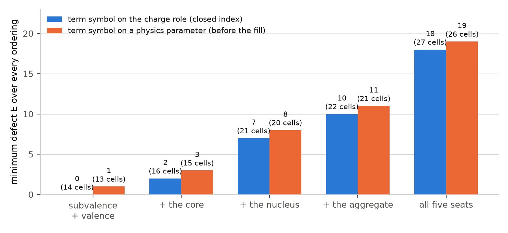
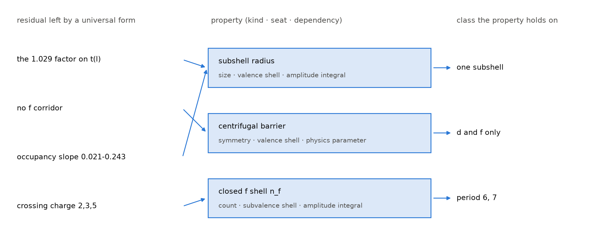
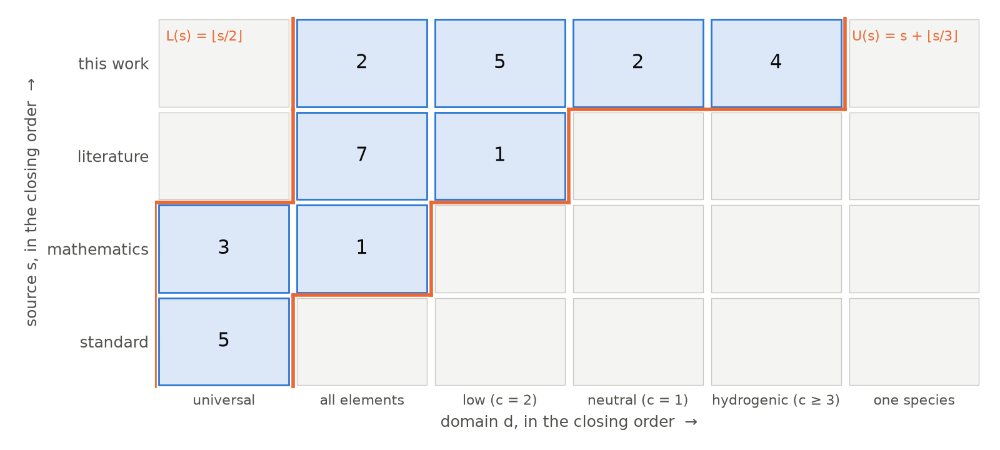

# Closing the chemical properties: a routing index for the elements

**Forty-two chemical properties of the elements, indexed by their kind, by their seat in the species — with a fifth seat for the properties of matter in bulk — and by which of physics, charge or amplitude each one depends on, form a closed index of defect 0 on fourteen cells; the merge of the parameter, charge and amplitude indexes closes on nine; and each closure declares a boundary, saying which properties the index can route and which it cannot.**

**Matthew Lach** · Independent Researcher · 21 September 2026

---

## Abstract

An *index* is a finite set of cells in a product of finite chains. Its *reconstruction* ℛ admits a cell of the ambient grid whenever, for every ordered pair of coordinates, some occupied cell lies at least as low on the second and at least as high on the first; its *defect* is `E = |ℛ(X)| − |X|`, and the index is *closed* when E = 0. A closed index is exactly a system of monotone staircase inequalities, so closure is an assertion that the classification has no holes a monotone rule could not have left.

This paper indexes forty-two chemical properties of a chemical element on three coordinates — the **kind** of quantity a property is (count, symmetry, size, energy, rate), the **seat** in the species it belongs to (the nucleus, the core, the subvalence shell, the valence shell, the aggregate), and the **dependency**, which of a physics parameter, a role of the core charge, or a Slater integral supplies it. The forty-two occupy fourteen cells over the subvalence and valence seats, and those fourteen close: E = 0, exhaustively over all 288 orderings of the realised coordinate values, with sixteen of the 288 closing and the closing orders themselves enumerated. The fourteen cells are one member of the family of 5,824 subsets of the 4 × 2 × 3 box that are closed under ℛ, a family enumerated here in full by visiting every one of the 2²⁴ subsets. Outside the two closed seats the defect climbs — 0, 2, 7, 10, 18 as the core, then the nucleus or the aggregate, then all five seats are admitted — so the index states its own domain by degrading monotonically outside it. Before the last cell was occupied, thirteen cells gave minimum E = 1 under every ordering, and the single vacancy was one of exactly two cells; the paper prints both and the fill that was chosen.

A second index merges the twenty-one parameters of real atoms, indexed on (source, domain), with the nine occurrences of the core charge, indexed on (role, carrier, sign, regime), along the single axis the two share: the charge regime is the parameter domain at finer resolution. Nine cells, E = 0, and as a subset of the full 4 × 6 grid the nine are exactly the band ⌊s/2⌋ ≤ d ≤ s + ⌊s/3⌋. The merged index gives what neither parent gives: a parameter's domain becomes a set of atoms, so for any (Z, c) the index states which parameters apply. The amplitude index — the Slater integrals of a subshell pair — closes on twenty cells as the triangle 0 ≤ i ≤ ℓ once indexed on position within sequence rather than on multipole rank, and adds no cell to the merge.

Nothing here predicts the value of any property. The index routes and it closes; what it returns is a name and a class.

---

## §0 · The result

**A classification of chemical properties, and of the parameters a model of the atom uses, closes as an index — and each closure is read as a statement of where the classification stops applying.**

Three results are claimed, and each is a statement about the shape of a finite classification, not about a measured number.

**First.** Forty-two chemical properties of a chemical element, each assigned a kind, a seat and a dependency (§1, Table 1), occupy fourteen distinct cells over the two innermost open seats — the subvalence shell and the valence shell. Those fourteen cells are closed: E = 0. The claim is exhaustive in two senses. It holds at the minimum over every one of the 288 orderings of the realised coordinate values, sixteen of which close; and the fourteen cells are one member of the family of 5,824 subsets of the 4 × 2 × 3 box closed under ℛ, a family enumerated here by visiting all 2²⁴ subsets, so E = 0 is stated over a named family and not asserted (Theorem 1, EXHAUSTIVE).

**Second.** The closure declares a boundary. Admitting the core raises the minimum defect to 2; admitting the nucleus as well raises it to 7, and admitting the aggregate instead of the nucleus raises it to 10; admitting all five seats raises it to 18 (Theorem 2, EXHAUSTIVE over 86,400 orderings at the largest). The classification does not fail at the outer seats so much as say, by degrading monotonically, that the outer seats are not what it classifies.

**Third.** Merging the twenty-one parameters of real atoms with the nine occurrences of the core charge along their one shared axis gives nine cells with E = 0 (Theorem 4, EXHAUSTIVE). As a subset of the full 4 × 6 grid of sources against domains the nine are exactly the band ⌊s/2⌋ ≤ d ≤ s + ⌊s/3⌋, and the diagonal is the content: nothing from an international standard is restricted to a region, and nothing produced in this work claims universal validity.

**What filled the last cell.** With the term symbol assigned to a physics parameter the properties occupy thirteen cells, and thirteen do not close: every one of the 288 orderings gives minimum E = 1, and of the twenty minimising orderings sixteen leave the vacancy at (symmetry, the valence shell, a charge role) and four at (symmetry, the subvalence shell, an amplitude integral). The vacancy is therefore structural and not an artefact of how the coordinate values were ordered. It was filled by reassigning the term symbol: the ground term of an isoelectronic sequence changes with the core charge (Table 2, CITED), so the ground term is supplied by a charge role. **The fill is not unique.** Adding a new property at the other candidate cell also closes the index at fourteen cells, in four of the 288 orderings (Theorem 3, EXHAUSTIVE). The paper states the fill that was chosen and the alternative that was not tested.

**What routing is.** A residual is what a form fitted across a class of species leaves systematically unexplained inside that class. Routing sends a residual to the chemical property whose value it varies with and to the class of species on which that property is constant (D12). Four residuals are routed (Table 3, Figure 2); the routing table is admissible — every property it names is a cell of the closed index and every class it names is one that property is recorded to hold on (EXHAUSTIVE over the four rows). Routing returns a name and a class. It does not return a value, and whether a routed residual then dissolves or becomes a per-species measurement is outside the index.

**What is not established.** Five things, and they bound the whole paper.

1. **The assignments are declared, not measured.** Each property's kind, seat and dependency is a judgement about what the property is. The paper verifies that the declared assignment closes; it does not verify that the assignment is correct, and no procedure here would detect a systematic misassignment that happened to preserve the staircase.
2. **Closure is a constraint, but not a rare one.** Of the 2²⁴ subsets of the 4 × 2 × 3 box, 5,824 are closed under ℛ read over that box; of the 2¹⁴ subsets of the fourteen cells themselves, 1,482 are closed over their own boxes. Sixteen of 288 orderings close the chemical index and four of 2,880 close the merged one. These are the denominators against which E = 0 should be read, and they are printed rather than left implicit.
3. **One cell was changed to reach closure**, and a different single change reaches it too (Theorem 3). A closed index obtained after a reassignment is evidence about the reassignment only to the extent that the reassignment is independently motivated; here it is, by Table 2, but Table 2 is four isoelectronic sequences.
4. **The index predicts nothing.** It states which property supplies a quantity and on which class. It gives no value, no functional form and no bound (§10).
5. **Almost nothing here is checkable against an external tabulation.** The only externally sourced values in the paper are the twelve ground terms of Table 2. Six of the forty-two properties carry a named public source and thirty-six do not, and no source has been supplied for those thirty-six; the paper takes no numerical value from any of them.

**Status words.** Six are used and never merged.

| status | meaning |
|---|---|
| **PROVED** | a proof is written out below and every step is justified |
| **EXHAUSTIVE** | a decision procedure visited every case in a stated finite family, and the family's size is printed |
| **MACHINE-CHECKED** | Z3 returned `unsat` on the negation of an obligation whose set variables range over every subset of a named finite box, with both guards passed |
| **SAMPLED** | a seeded pseudorandom sweep of a stated size; never exhaustive |
| **CITED** | taken from the literature or from a public database, with the source |
| **REFUTATION** | a claim disproved by an explicit witness |

---

## §1 · Definitions

**D1 (chain, box, index).** A *chain* is a finite totally ordered set; its elements are written `0 < 1 < … < m − 1`. Fix `d ≥ 2` chains `A₁, …, A_d`. A *box* is the product `B = A₁ × ⋯ × A_d`, and `|B| = ∏ |A_i|` is its size. An *index* is a non-empty finite set `X ⊆ B` of *cells*. For a cell `x` write `x_i` for its i-th coordinate.

**D2 (realised values, own box).** The *realised values* of X on coordinate i are `A_i(X) := { x_i : x ∈ X }`. The *own box* of X is `Box(X) := A₁(X) × ⋯ × A_d(X)`. Every statement below that does not name a box explicitly is made over the own box; a statement made over a larger fixed box says so.

**D3 (the reconstruction ℛ).** For `i ≠ j` and `a ∈ A_j(X)` put

> `φ_ij(a) := max { y_i : y ∈ X, y_j ≤ a }`.

The *reconstruction* of X is

> `ℛ(X) := { x ∈ Box(X) : x_i ≤ φ_ij(x_j) for every ordered pair i ≠ j }`.

**D4 (defect, closed).** The *defect* of X is `E(X) := |ℛ(X)| − |X|`. X is *closed* when `E(X) = 0`. D3 and D4 are the reconstruction and defect of the closure law; the law itself is established in a companion paper, and the part of it this paper uses is re-proved in §2 because the proof is four lines and the paper needs its shape.

**D5 (ordering of an index).** ℛ depends on the order each chain carries. An *ordering* of X is a choice, for each coordinate i, of a bijection from `A_i(X)` to `{0, …, |A_i(X)| − 1}`; there are `∏ |A_i(X)|!` of them. `minE(X)` is the minimum of `E` over all orderings, and a *closing ordering* is one at which `E = 0`.

**D6 (staircase system).** A *staircase system* over a box B is a family of non-decreasing maps `f_ij : A_j → A_i ∪ {−∞}`, one for each ordered pair `i ≠ j`, together with the set it defines,

> `X(f) := { x ∈ B : x_i ≤ f_ij(x_j) for every i ≠ j }`.

**D7 (the kind of a property).** Every chemical property is assigned exactly one *kind*, the sort of quantity it is:

> **count** · **symmetry** · **size** · **energy** · **rate**.

A count is an integer read off a configuration or a nucleus; a symmetry is a label of a state's transformation behaviour; a size is a length or a cross-section; an energy is an energy or an energy difference; a rate is a quantity per unit time or per unit potential gradient.

**D8 (the seat of a property).** Every property is assigned exactly one *seat*, the part of the species to which it belongs:

> **the nucleus** · **the core** · **the subvalence shell** · **the valence shell** · **the aggregate**.

The core is the closed inner shells; the subvalence shell is the outermost shell of the core, the one whose occupancy screens the valence shell; the valence shell is the outermost occupied shell. The fifth seat is D9.

**D9 (the fifth seat).** **The aggregate** is the seat of a property of matter in bulk rather than of an isolated atom or ion. A property has this seat when its value is not defined for a single free species — when stating it requires a macroscopic sample. Twelve of the forty-two have it (§3).

**D10 (the dependency).** Every property is assigned exactly one *dependency*, which of three families of quantities supplies its value:

> **P**, *a physics parameter* — one of the parameters of the one-electron problem and its corrections, the quantities of the parameter index of §8;
> **C**, *a charge role* — one of the roles the core charge c plays, the cells of the charge index of §8;
> **A**, *an amplitude integral* — one of the Slater integrals of the electron–electron term, the cells of the amplitude index of §9.

**D11 (the chemical index).** `Λ_chem` is the index whose cells are the distinct triples (kind, seat, dependency) realised by the forty-two properties of Table 1. `Λ_chem(S)` for a set S of seats is the restriction to properties whose seat lies in S.

**D12 (residual, routing).** Let a form with parameters be fitted to a measured quantity across a class of species, holding its parameters fixed within the class. The *residual* of that fit is the systematic — that is, species-indexed and reproducible — part of the departure of the measured values from the form. To *route* a residual is to name (i) a chemical property whose value the residual varies with and (ii) a class of species on which that property is constant. A routing table is *admissible* when every property it names occupies a cell of the closed index and every class it names is one that property is recorded to hold on.

**D13 (the Slater integrals of a pair).** For an ordered pair of subshells of orbital angular momenta ℓ, ℓ′, the multipole expansion of the interelectronic distance gives the *direct* radial integrals `F^k` for `k` even, `0 ≤ k ≤ 2 min(ℓ, ℓ′)`, and the *exchange* integrals `G^k` for `k ≡ ℓ + ℓ′ (mod 2)`, `|ℓ − ℓ′| ≤ k ≤ ℓ + ℓ′` (Slater 1929; Condon and Shortley 1935), CITED. For the diagonal pair ℓ = ℓ′ the *position within sequence* of an integral of rank k is `i := k/2`, so that `F^0, F^2, F^4, …` have `i = 0, 1, 2, …` and likewise for `G`.

**Notation.** `s` is a source index and `d` a domain index in §8; `c` is the core charge of a species — 1 for a neutral atom, 2 for a singly charged ion, and so on — and `Z` its atomic number. `⌊·⌋` is the integer floor.

---

## §2 · The reconstruction, and what closure means

**Lemma 1 (witness form).** For every index X and every `x ∈ Box(X)`,

> `x ∈ ℛ(X)`  ⟺  for every ordered pair `i ≠ j` there is `y ∈ X` with `y_j ≤ x_j` and `y_i ≥ x_i`.

*Proof.* Fix `i ≠ j`. Since `x ∈ Box(X)`, the value `x_j` is realised, so some `y ∈ X` has `y_j = x_j` and the set `{ y ∈ X : y_j ≤ x_j }` is non-empty; hence `φ_ij(x_j)` is a maximum over a non-empty finite set and is attained, by `y*` say. If `x_i ≤ φ_ij(x_j)` then `y*` is the required witness: `y*_j ≤ x_j` and `y*_i = φ_ij(x_j) ≥ x_i`. Conversely a witness `y` has `y_j ≤ x_j`, so `y_i ≤ φ_ij(x_j)`, and `x_i ≤ y_i` gives `x_i ≤ φ_ij(x_j)`. The equivalence holds for each pair separately, hence for the conjunction over all pairs. ∎ **PROVED**, and corroborated: the implementation under test agrees with an independently written witness-form implementation on all 288 orderings of the chemical index and on 300 random indexes over five shapes (seed 8), with no disagreement.

**Lemma 2 (ℛ is a closure operator).** Over a fixed box B, write `ℛ_B(X) := { x ∈ B : x_i ≤ φ_ij(x_j) ∀ i ≠ j }` with `φ_ij(a) := max{ y_i : y ∈ X, y_j ≤ a }` and `max ∅ := −∞`. Then for all `X, Y ⊆ B`:

(i) `X ⊆ ℛ_B(X)`;  (ii) `X ⊆ Y ⟹ ℛ_B(X) ⊆ ℛ_B(Y)`;  (iii) `ℛ_B(ℛ_B(X)) = ℛ_B(X)`.

*Proof.* (i) For `x ∈ X` and any pair `i ≠ j`, the cell `y := x` satisfies `y_j ≤ x_j` and `y_i ≥ x_i`; Lemma 1's argument applies verbatim over a fixed box provided a witness exists, which it does. (ii) A witness for X is a witness for Y. (iii) Put `S := ℛ_B(X)`. By (i) and (ii), `S ⊆ ℛ_B(S)`. Conversely let `x ∈ ℛ_B(S)` and fix `i ≠ j`. There is `y ∈ S` with `y_j ≤ x_j` and `y_i ≥ x_i`. Since `y ∈ S`, `y_i ≤ φ_ij(y_j)`, and `φ_ij` is non-decreasing in its argument, so `φ_ij(y_j) ≤ φ_ij(x_j)`. Chaining, `x_i ≤ y_i ≤ φ_ij(x_j)`. As the pair was arbitrary, `x ∈ ℛ_B(X) = S`. ∎ **PROVED**, and **MACHINE-CHECKED** over the four boxes 4 × 2 × 3, 4 × 5, 4 × 6 and 2 × 4 × 4, with the set variable ranging over all 2²⁴, 2²⁰, 2²⁴ and 2³² subsets respectively.

Note that `Box(ℛ(X)) = Box(X)`: `ℛ(X) ⊇ X` realises at least the values X realises, and `ℛ(X) ⊆ Box(X)` realises no others. So the own-box operator is idempotent too, by (iii) applied at `B = Box(X)`.

**Lemma 3 (the staircase law, the part used here).** An index X is closed if and only if `X = X(f) ∩ Box(X)` for some staircase system f over `Box(X)`.

*Proof.* (⇐) Suppose `X = { x ∈ Box(X) : x_i ≤ f_ij(x_j) ∀ i ≠ j }` with every `f_ij` non-decreasing. `ℛ(X) ⊇ X` by Lemma 2(i). For the reverse, fix `i ≠ j` and `a ∈ A_j(X)`. Every `y ∈ X` with `y_j ≤ a` has `y_i ≤ f_ij(y_j) ≤ f_ij(a)`, so `φ_ij(a) ≤ f_ij(a)`. Hence any `x ∈ ℛ(X)` satisfies `x_i ≤ φ_ij(x_j) ≤ f_ij(x_j)` for every pair, and `x ∈ Box(X)`, so `x ∈ X`. Thus `ℛ(X) = X`. (⇒) If `E(X) = 0` then `X = ℛ(X)`, which is by definition `{ x ∈ Box(X) : x_i ≤ φ_ij(x_j) ∀ i ≠ j }`, and each `φ_ij` is non-decreasing because it is a maximum over a set that grows with its argument. ∎ **PROVED**, and the (⇐) direction **MACHINE-CHECKED** over the same four boxes: for every assignment of monotone `f_ij` and every subset X realising all values of the box, `X = X(f)` implies `ℛ(X) = X`.

**Lemma 3 says what a closure claim asserts.** E = 0 is not a claim that the occupied cells form a nice picture. It is the claim that the occupied set is cut out of its own grid by one monotone inequality per ordered pair of coordinates — that the classification has no hole a monotone rule could not have left, and no cell outside it that a monotone rule would have had to include.

**Lemma 4 (global reversal).** Let `σ` reverse every chain of `Box(X)` at once: `σ(x)_i := |A_i(X)| − 1 − x_i`. Then `ℛ(σX) = σ(ℛ(X))`, and in particular `E(σX) = E(X)`.

*Proof.* `σ` is an involution of `Box(X)` and `Box(σX) = Box(X)`. By Lemma 1, `σ(x) ∈ ℛ(σX)` iff for every ordered pair `(i, j)` with `i ≠ j` there is `y ∈ X` with `σ(y)_j ≤ σ(x)_j` and `σ(y)_i ≥ σ(x)_i`, that is with `y_j ≥ x_j` and `y_i ≤ x_i`. Relabelling the pair `(i, j)` as `(j, i)` — a bijection of the index set of ordered pairs — turns this family of conditions into: for every `(i, j)`, `i ≠ j`, there is `y ∈ X` with `y_j ≤ x_j` and `y_i ≥ x_i`, which by Lemma 1 is `x ∈ ℛ(X)`. ∎ **PROVED**, corroborated **SAMPLED** on 200 random indexes over three shapes (seed 3) and **EXHAUSTIVE** on the chemical index, where the sweep halved by Lemma 4 reproduces the full sweep over all 288 orderings.

Lemma 4 is why the sweeps below halve one axis: reversing every axis maps closing orderings to closing orderings, so closing orderings come in pairs and it suffices to visit one of each.

**The closed families, enumerated.** So that a closure claim is a statement about a named family and not an isolated assertion, the family of all closed subsets of each box used in this paper is enumerated twice by independent means: once by Ganter's next-closure algorithm, which visits each closed set of a closure operator exactly once (Ganter and Wille 1999), and once by visiting every subset of the box. The two agree in every case.

| box | subsets visited | closed as subsets of the fixed box | closed with respect to their own box |
|---|---|---|---|
| 2 × 3 | 2⁶ | 33 | 38 |
| **4 × 2 × 3** (the chemical index) | **2²⁴** | **5,824** | **8,590** |
| 4 × 5 (the merged index, realised) | 2²⁰ | 3,449 | 7,887 |
| 4 × 6 (source × domain, full) | 2²⁴ | 9,115 | 27,477 |
| 2 × 4 × 4 (the amplitude index) | — | 29,067 | — |

All rows are **EXHAUSTIVE**; the 2 × 4 × 4 row is by next-closure only, its 2³² subsets not being enumerable in the time budget. Within the fourteen cells of the chemical index, 1,482 of the 2¹⁴ = 16,384 subsets are themselves closed, the largest being the fourteen cells and the count by size running 1, 14, 70, 176, 270, 288, 242, 175, 114, 66, 37, 17, 8, 3, 1 from the empty set up.

---

## §3 · The forty-two properties

The properties are those of a chemical element — of a species (Z, c) and, at the fifth seat, of the bulk substance the element forms. Each carries a kind (D7), a seat (D8, D9) and a dependency (D10). The list is closed in the sense that every chemical property demanded of a species was entered, rather than a selection being made; that is what produces the fifth seat, which a hand-picked list of a dozen properties does not.

**Table 1 · the forty-two properties, by seat.** Columns: kind · dependency · what the property is · the public data source. A dash in the last column means **no public data source is named for that property**; none has been supplied here, and the paper takes no numerical value from any property so marked.

**(a) the nucleus — six properties**

| property | kind | dep. | what it is | source |
|---|---|---|---|---|
| atomic mass | count | P | the mass of the nuclide in unified mass units | — |
| isotope abundance | count | P | the fraction of a natural sample carried by one nuclide | — |
| nuclear spin | symmetry | P | the total angular momentum of the nuclear ground state | — |
| radioactive half-life | rate | P | the time in which half a sample of the nuclide decays | — |
| neutron cross-section | size | P | the effective area the nucleus presents to an incident neutron | — |
| nuclear charge Z | count | C | the number of protons; the charge the electrons see unscreened | — |

**(b) the core — two properties**

| property | kind | dep. | what it is | source |
|---|---|---|---|---|
| closed core ¹S₀ | symmetry | P | whether the closed inner shells leave a single spinless, spherically symmetric parent | — |
| core binding energy | energy | C | the energy to remove an electron from a closed inner shell | — |

**(c) the subvalence shell — two properties**

| property | kind | dep. | what it is | source |
|---|---|---|---|---|
| lanthanide contraction | size | A | the extra shrinkage of the radii across a period caused by a filled f shell screening poorly | — |
| closed f shell n_f | count | A | the number of f electrons in the closed subvalence shell | NIST ASD |

**(d) the valence shell — twenty properties**

| property | kind | dep. | what it is | source |
|---|---|---|---|---|
| ground configuration | count | P | the occupied subshells of the lowest state, as observed | NIST ASD |
| node count p | count | P | `n − ℓ − 1`, the radial nodes of the valence orbital | NIST ASD |
| oxidation states | count | C | the integer charges the element adopts in compounds | — |
| valence electron count | count | P | the number of electrons outside the closed core | NIST ASD |
| coordination number | count | A | the number of nearest neighbours the species accepts | — |
| ionisation energy | energy | P | the energy to remove the least bound electron | NIST ASD |
| electron affinity | energy | A | the energy released on binding one further electron | — |
| electronegativity | energy | C | the element's pull on shared electron density | — |
| successive IEs | energy | C | the sequence of energies to remove electrons one after another | — |
| emission spectrum | energy | P | the set of observed transition energies | — |
| colour of the ion | energy | A | the visible absorption of the ion, set by term splittings | — |
| atomic radius | size | P | the radius of the neutral atom | — |
| ionic radius | size | C | the radius of the ion at a stated charge | — |
| covalent radius | size | A | half the distance between like atoms sharing a single bond | — |
| subshell radius | size | A | the mean radius of one occupied subshell | — |
| relativistic 7s | size | P | the contraction of the outermost s shell by relativistic mass increase | — |
| centrifugal barrier | symmetry | P | the `ℓ(ℓ+1)/2r²` term that keeps a high-ℓ electron out of the core | — |
| term symbol | symmetry | **C** | the `^{2S+1}L_J` label of the ground level | NIST ASD |
| magnetic moment | symmetry | A | the magnetic moment of the ground level | — |
| paramagnetism | symmetry | A | whether the ground level has unpaired spin | — |

**(e) the aggregate — twelve properties**

| property | kind | dep. | what it is | source |
|---|---|---|---|---|
| density | size | P | mass per unit volume of the bulk element | — |
| melting point | energy | A | the temperature of the solid–liquid transition | — |
| boiling point | energy | A | the temperature of the liquid–vapour transition | — |
| hardness | energy | A | the resistance of the solid to plastic indentation | — |
| crystal structure | symmetry | A | the space group of the stable solid phase | — |
| electrical conductivity | rate | C | charge transported per unit field | — |
| thermal conductivity | rate | C | heat transported per unit temperature gradient | — |
| colour of the metal | energy | A | the visible reflectance of the bulk metal | — |
| smell | rate | A | the olfactory response the substance provokes | — |
| taste | rate | A | the gustatory response the substance provokes | — |
| metallic character | symmetry | C | whether the element's bonding is delocalised | — |
| reactivity | rate | C | how fast the element enters reaction under stated conditions | — |

**Proposition 1 (the census).** The forty-two names are distinct. By kind the counts are 9 (count), 8 (symmetry), 8 (size), 11 (energy), 6 (rate). By seat they are 6, 2, 2, 20, 12 for the nucleus, the core, the subvalence shell, the valence shell and the aggregate. By dependency there are two counts, because one property moves between two of the three values in §6: with the term symbol on a physics parameter the counts are **(16 P, 10 C, 16 A)**, and with the term symbol on a charge role, as Table 1 above states it, they are **(15 P, 11 C, 16 A)**. **EXHAUSTIVE** over the forty-two rows, both assignments.

**Proposition 2 (the fifth seat).** The twelve properties whose seat is the aggregate are exactly density, melting point, boiling point, hardness, crystal structure, electrical conductivity, thermal conductivity, colour of the metal, smell, taste, metallic character and reactivity — that is, the aggregate seat and the set of properties of matter in bulk coincide. **EXHAUSTIVE** over the forty-two rows.

Proposition 2 is the fifth seat's whole justification. Nothing forced a fifth seat: it appeared because the list was not selected, and twelve entries then had no seat inside a free atom. The index can distinguish an atomic property from a bulk one only because the fifth seat exists to hold the difference.

**A coordinate that was not used.** A fourth candidate coordinate, the *breadth* of a property — every species, a block, a period, one subshell — assigns the same kind and the same seat to the same forty-two properties, and is verified here to do so (**EXHAUSTIVE**, forty-two rows). It is not used as an axis of the index, because its values are constrained by the other coordinates rather than free of them; the same fault is measured directly in §9, where the corresponding coordinate of the amplitude index is shown to cost one cell of defect. Breadth survives in this paper as the class column of the routing table (§7).

---

## §4 · The chemical index closes

**Theorem 1.** Let `Λ_chem({subvalence, valence})` be the index of the properties of Table 1(c) and 1(d) on (kind, seat, dependency). Then:

1. the twenty-two properties occupy exactly **fourteen** distinct cells;
2. the realised values are four kinds — count, symmetry, size, energy, the kind *rate* being unrealised at these two seats — two seats and three dependencies, so the own box has **24** cells;
3. the minimum defect over all `4! · 2! · 3! = 288` orderings is **E = 0**, and **sixteen** orderings close;
4. the fourteen cells are exactly the lattice points of a staircase system over their own box.

**EXHAUSTIVE**: every one of the 288 orderings visited; the 1,440 orderings obtained by also permuting the unrealised fifth kind are the same 288 counted five times, since a value no cell realises cannot change ℛ.

*Proof of (4), given (3).* Immediate from Lemma 3 (⇒). The staircase system is exhibited below and verified directly. ∎

**The staircase, written out.** Order the seats subvalence < valence, the kinds size < count < energy < symmetry and the dependencies A < C < P. At this ordering the functions `φ_ij` of D3 are constant — that is, impose nothing — except for two:

> `φ_{kind ← seat}` : subvalence ↦ count, valence ↦ symmetry
> `φ_{dep ← seat}` : subvalence ↦ A, valence ↦ P

so the fourteen cells are exactly

> `{ (k, s, p) ∈ Box : k ≤ φ_{kind ← seat}(s) and p ≤ φ_{dep ← seat}(s) }`,

which at the subvalence seat admits the two kinds size and count on the dependency A alone, and at the valence seat admits all four kinds on all three dependencies: 2 + 12 = 14. That the set so defined is exactly the fourteen cells is checked directly (**EXHAUSTIVE**, 24 lattice points tested).

**What the closure fixes, and what it leaves free.** Of the 288 orderings, sixteen close. Eight of them place the subvalence seat below the valence seat, and the other eight are their global reversals (Lemma 4). Enumerating the eight:

- on the seat axis, **subvalence < valence** (or its reverse) — forced;
- on the dependency axis, **A is least** — forced; the order of C and P above it is free, both appearing;
- on the kind axis, **{count, size} both below {symmetry, energy}** — forced; the order within each pair is free, all four combinations appearing.

So `4 × 2 = 8`, and `8 × 2 = 16`. **EXHAUSTIVE** over the 288. The reading is that closure constrains the classification in exactly three places — the subvalence shell is the inner seat, the amplitude is the lowest dependency, and the two counting kinds sit below the two structural ones — and says nothing about the remaining three binary choices.

**Figure 1.** The fourteen cells of the chemical index, at a closing ordering (kinds size < count < energy < symmetry upward, dependencies A < C < P rightward, the two seats side by side). Filled cells carry the properties named in them; empty cells of the 4 × 3 grid are unoccupied. At the subvalence seat only the two lowest kinds appear, and only on the amplitude dependency; at the valence seat every cell of the grid is occupied. The dashed cell is the one discussed in §6, (symmetry, the valence shell, a charge role), which was empty before the term symbol was reassigned to it.

**E = 0 over a named family.** Theorem 1 is an assertion that one particular 14-element subset of a 24-cell box lies in a certain family. That family is enumerated in §2: **5,824** of the 2²⁴ = 16,777,216 subsets of the 4 × 2 × 3 box are closed under ℛ read over that fixed box, and **8,590** are closed under ℛ read over their own box. Both counts are produced twice, by next-closure and by visiting every subset, and agree. The fourteen cells realise every value of every coordinate, so their own box *is* the 4 × 2 × 3 box and they belong to both families.

---

## §5 · The boundary the closure declares

The two closed seats are the subvalence and valence shells. Admitting further seats admits further properties, further cells, and — at every step — further defect.

**Theorem 2.** With the assignments of Table 1, the minimum defect over every ordering of the realised values is

| seats admitted | properties | cells | box | orderings | **min E** |
|---|---|---|---|---|---|
| subvalence + valence | 22 | 14 | 4 × 2 × 3 | 288 | **0** |
| + the core | 24 | 16 | 4 × 3 × 3 | 864 | **2** |
| + the core and the nucleus | 30 | 21 | 5 × 4 × 3 | 17,280 | **7** |
| + the core and the aggregate | 36 | 22 | 5 × 4 × 3 | 17,280 | **10** |
| all five seats | 42 | 27 | 5 × 5 × 3 | 86,400 | **18** |

and the defect is strictly increasing down this list. **EXHAUSTIVE** at every row: every ordering of the realised values is visited, the count in the fifth column.

The third and fourth rows are the two ways of adding a fourth seat to the set {subvalence, valence, core}; they are not nested in one another. Both exceed the three-seat value 2 and both fall below the five-seat value 18, so the list is a chain of defects even though its middle two seat sets are incomparable.

**The same table before the fill.** With the term symbol assigned to a physics parameter rather than to a charge role — the assignment of §6 before the reassignment — the same five seat sets give 13, 15, 20, 21 and 26 cells at minimum defects **1, 3, 8, 11, 19**. Both tables are printed because both are computed here and they differ in every row.

**Figure 3.** The minimum defect over every ordering, for the five seat sets of Theorem 2, computed twice: with the term symbol on a charge role (the closed assignment, 14/16/21/22/27 cells at E = 0/2/7/10/18) and with the term symbol on a physics parameter (13/15/20/21/26 cells at E = 1/3/8/11/19). The leftmost blue bar is zero and carries no bar.

**What the climb means, and what it does not.** It does not mean the outer seats are misclassified, and it is not a failure of the classification. A defect is a count of cells a monotone rule would have had to include and the data do not: the properties of the nucleus and of bulk matter do not sit on the same monotone scale of kind and dependency as the properties of the two open shells. The index therefore *states* its own domain rather than assuming it. That is the sense in which a closure declares a boundary: the classification is asserted where E = 0 and explicitly not asserted where E > 0, and the size of E is the measure of how far outside the assertion one has gone.

---

## §6 · The last cell, and what filled it

**Theorem 3.** Let `Λ₁₃` be the index of the same twenty-two properties with the term symbol assigned to the dependency P. Then:

1. `Λ₁₃` occupies **thirteen** cells, and `minE(Λ₁₃) = 1`: no ordering closes it, and 20 of the 288 attain the minimum;
2. at every minimising ordering the reconstruction adds exactly one cell, and that cell is one of exactly **two**: (symmetry, the valence shell, C) at sixteen of the twenty, and (symmetry, the subvalence shell, A) at the other four;
3. moving the term symbol from P to C fills the first of these and closes the index (Theorem 1);
4. adding a property at the second of these instead — leaving the term symbol on P — also gives fourteen cells with `minE = 0`, closing in four of the 288 orderings.

**EXHAUSTIVE** at every clause; the negative control of clause 1 — the claim that the thirteen cells close — is reported as **REFUTED**, with the value E = 1 that refutes it.

Clause 1 is what makes the vacancy structural. A defect that appears at some orderings and not others is a statement about the labelling; a defect that survives every ordering is a statement about the set. Clause 2 localises it: the reconstruction does not scatter its additions, it names one of two cells.

**The four symmetry properties of the valence shell**, before the reassignment, were the centrifugal barrier, the term symbol, the magnetic moment and paramagnetism, and every one of them was assigned to P or to A (**EXHAUSTIVE**). The cell (symmetry, valence, C) was empty not because no symmetry property of the valence shell existed but because none had been assigned to the charge.

**What filled it.** The ground term of a species is the `^{2S+1}L_J` label of its lowest level. Along an isoelectronic sequence — fixed electron number Nₑ, increasing core charge c — the ground term is not constant.

**Table 2 · ground terms along four isoelectronic sequences.** CITED, NIST ASD.

| Nₑ | c = 1 | c = 2 | c = 3 | c = 4 |
|---|---|---|---|---|
| **20** | ¹S₀ | ³D₁ | ³F₂ | ³F₂ |
| **38** | ¹S₀ | ³D₁ | ³F₂ | ³F₂ |
| 56 | ¹S₀ | ³F₂ | ³H₄ | — |
| 88 | ¹S₀ | ¹S₀ | ³H₄° | — |

Two statements about Table 2 are decidable and are checked: the Nₑ = 20 and Nₑ = 38 rows are identical term for term, and in every one of the four sequences the term takes more than one value. Both **CITED** — the values are from the public database, and what is verified here is the relation between them, not the values themselves.

The ground term therefore varies with the core charge at fixed electron count, which is the definition of a charge role (D10). The reassignment of the term symbol from P to C is made on that ground, and it closes the index.

**The fill is not unique, and the paper says so.** Clause 4 of Theorem 3 exhibits a second fourteen-cell closure, reached by occupying (symmetry, the subvalence shell, A) instead. No property was assigned there and none is proposed here. What Theorem 3 establishes is that thirteen cells do not close and that two single changes would; what it does not establish is that the change made is the right one. The evidence for that is Table 2 and nothing else in this paper.

---

## §7 · Routing by residual

A universal form fitted across a class of species leaves a residual (D12). The question the index answers is not what the residual's value is but where to look for it: which property of the individual species it tracks, and on how wide a class that property is constant.

**Table 3 · the routing table.** Each row: the residual, the property it routes to with that property's cell, and the class the property holds on.

| residual | property | cell (kind · seat · dependency) | class |
|---|---|---|---|
| the 1.029 factor on t(ℓ) | subshell radius | size · the valence shell · A | one subshell |
| no f corridor | centrifugal barrier | symmetry · the valence shell · P | d and f only |
| occupancy slope 0.021–0.243 | subshell radius | size · the valence shell · A | one subshell |
| crossing charge 2, 3, 5 | closed f shell n_f | count · the subvalence shell · A | period 6, 7 |

**Proposition 3 (the routing table is admissible).** Every property named in Table 3 has its seat in {subvalence, valence} — that is, occupies a cell of the closed index of Theorem 1 — and every class named is one that property is recorded to hold on. **EXHAUSTIVE** over the four rows.

**Figure 2.** The routing of Table 3: four residuals on the left, the three properties they route to in the middle with each property's cell of the closed index, and on the right the class of species on which that property is constant. Two residuals route to the same property.

**Why admissibility is the whole of the claim.** Routing is a lookup, and its value lies in what it forbids. A residual that routes to a property of the subvalence or valence shell, on a class narrower than every species, is not an unexplained residual: it is a per-species quantity, and a universal account of it is the wrong thing to look for. The closed index is what makes the lookup total over its domain — every property of those two seats has a cell, so every routing either lands in the index or reveals that the residual is being attributed to something outside it.

The three properties of Table 3 are the subshell radius, the centrifugal barrier and the closed f shell count; two residuals route to the first. What happens to a residual after it is routed — whether the per-species reading dissolves it, or turns it into a measurement to be made species by species — is not decided by the index and is not claimed here.

---

## §8 · The merged index

The dependency coordinate of §3 names three suppliers. Two of them have indexes of their own, and those two merge.

### 8.1 The parameter index

A *parameter of real atoms* is a number a model of the atom enters, other than an artefact of the modelling procedure itself. Twenty-two candidates were listed; one — an admissibility threshold on signal-to-noise, which is a property of the method and not of an atom — is excluded on that ground, leaving **twenty-one** (**EXHAUSTIVE**).

Each carries two coordinates: its **source**, which is one of *mathematics* (an exact consequence of the formalism), *standard* (a value from an international standard body), *literature* (a published measurement or rule) and *this work*; and its **domain**, the set of species on which it is asserted — *universal*, *all elements*, *a region*, *one species*.

**Theorem 4a.** The twenty-one parameters occupy seven distinct cells on (source, domain); the realised box is 4 × 3, of size 12, the value *one species* being unrealised; and **E = 0**, at four of the 144 orderings. **EXHAUSTIVE.**

**Theorem 4b (arity is not a coordinate).** Adding a third axis recording how many statements rest on a parameter gives twelve cells with minimum defect **7** over all 864 orderings. **EXHAUSTIVE.** The count of dependents is a property of the account, not of the parameter, and the index says so by not closing on it.

### 8.2 The charge index

The core charge c enters the model in more than one position, and a coordinate that appears several times with different signs cannot sit on one monotone axis. Each *occurrence* is therefore a cell in its own right, on four coordinates: the **role** it plays (screening, decay base, decay rate, ordering), the **carrier** it acts through, the **sign** of its effect, and the **regime** in which it bites (neutral, low, hydrogenic).

**Theorem 4c.** There are nine occurrences, they occupy nine distinct cells of the 4 × 4 × 2 × 3 box of size 96, and **E = 0** at the declared ordering. By regime the nine split 2 (neutral), 3 (low), 4 (hydrogenic). **EXHAUSTIVE.**

That nine occurrences give nine *distinct* cells is the content: no two of the roles collapse onto one another, so the charge is not over-specified.

### 8.3 The merge

The two indexes share exactly one axis. The parameter index's *domain* and the charge index's *regime* both say where a statement holds, and the regime is the domain at finer resolution: *a region* refines into *neutral* (c = 1), *low* (c = 2) and *hydrogenic* (c ≥ 3). Merging on that axis alone — no other identification of coordinates is made — puts all thirty items on the single grid of source against a six-valued domain.

**Theorem 4.** The twenty-one parameters and the nine charge occurrences together occupy **nine** cells on (source, domain). The realised box is 4 × 5, of size 20, the value *one species* being unrealised, and **E = 0**. Of the `4! · 5! = 2,880` orderings of the realised values, four close; two of these orient the domain axis with *universal* below *hydrogenic*, and in both of those the source axis reads **standard < mathematics < literature < this work** and the domain axis puts **low before neutral**. **EXHAUSTIVE.**

**Table 4 · the merged index, multiplicities.** Rows are sources, columns domains; the entry is how many of the thirty items sit in the cell. The totals are 21 parameters + 9 charge occurrences = 30.

| | universal | all elements | low | neutral | hydrogenic | one species |
|---|---|---|---|---|---|---|
| **standard** | 5 | · | · | · | · | · |
| **mathematics** | 3 | 1 | · | · | · | · |
| **literature** | · | 7 | 1 | · | · | · |
| **this work** | · | 2 | 5 | 2 | 4 | · |

**EXHAUSTIVE**, entry by entry.

**Figure 4.** The merged index on the full 4 × 6 grid of sources against domains, with the multiplicities of Table 4 and the two boundary paths of Theorem 4d. Nine cells are occupied; the column *one species* is empty, so the index's own box is 4 × 5.

**Theorem 4d (the band).** Number the sources `s = 0, 1, 2, 3` in the order standard, mathematics, literature, this work, and the domains `d = 0, …, 5` in the order universal, all elements, low, neutral, hydrogenic, one species. Then the nine occupied cells of the full 4 × 6 grid are exactly

> `{ (s, d) : L(s) ≤ d ≤ U(s) }`,  `L(s) = ⌊s/2⌋`,  `U(s) = s + ⌊s/3⌋`.

**EXHAUSTIVE** over the 24 cells of the grid. The negative control `U(s) = s + ⌊s/2⌋` does not give the nine cells and is reported as **REFUTED**.

*Proof.* `L = (0, 0, 1, 1)` and `U = (0, 1, 2, 4)` at `s = 0, 1, 2, 3`, giving the cell sets `{0}`, `{0, 1}`, `{1, 2}`, `{1, 2, 3, 4}` of sizes 1, 2, 2, 4 — nine cells, and they are precisely the occupied ones of Table 4. ∎

**The diagonal is the content.** `L(0) = U(0) = 0`: everything from an international standard is universal, and nothing from a standard is restricted to a region. `U(3) = 4 < 5`: nothing produced in this work is asserted on a single species, and `L(3) = 1 > 0`: nothing produced in this work claims universal validity. The band states both bounds at once, and it states them as inequalities in the source index — which is what makes the statement structural rather than a list.

**What the merge gives that neither parent gives.** A **per-atom calibration**. In the merged index a domain is a set of species: *universal* is every atom and ion, *all elements* every neutral, *neutral* is c = 1, *low* is c = 2, *hydrogenic* is c ≥ 3, and *one species* is a single (Z, c). So for any (Z, c) the index returns the set of parameters asserted on it. Neither parent returns that. The parameter index's domain axis has four values and no resolution below *a region*, so it cannot tell c = 2 from c = 3; the charge index resolves the regimes but has no source axis, so it cannot say which asserted quantities are at stake. The merge is the only place both are present, and it is closed.

**The closing order puts low before neutral.** Of the four closing orderings, the two oriented with *universal* first both place *low* below *neutral* (Theorem 4). Read through the calibration, c = 2 is the narrower domain — the more particular one — than c = 1.

**A merge that does not close, and why it is different.** Identifying axes by *name* rather than by what they assert — matching the charge index's *role* to a parameter axis called *kind*, and its *regime* to *domain* — against a parameter index that carried kind, domain and arity as three separate axes, gives a thirteen-cell parameter index at minimum defect **6** and an eighteen-cell merge at minimum defect **11** (**EXHAUSTIVE**). The merge that closes is the one made after the parameter index is rebuilt on two axes (Theorems 4a, 4b) and the identification is made on the single axis the two indexes genuinely share. The two results are consistent: a merge on identified names is a different operation on different objects, and it is reported here so that E = 0 in Theorem 4 is read as a property of that construction and not of merging in general.

**One assignment differs between the two tables that feed the merge.** The twenty-one parameters carry a source and a domain in the parameter index, and a source and a merged domain in the merge table. The sources agree on all twenty-one. The domains agree on twenty of the twenty-one: one parameter, a unit constant of this work, is listed at *all elements* in the parameter index and at *low* in the merge (**EXHAUSTIVE**, 21 rows compared). The discrepancy does not move any cell of Theorem 4: the cell (this work, all elements) is occupied in Table 4 with multiplicity 2 by two other items, and the cell (this work, low) with multiplicity 5, of which the parameter in question is one and a collapse quantity of this work another. Moving it between the two cells leaves both non-empty, so the nine cells — and hence E = 0 — are unchanged either way.

---

## §9 · The amplitude index

The third supplier of D10 is the electron–electron term. Its cells are the Slater integrals of D13, and the index answers a question about coordinates: on what is a radial integral of a subshell pair properly indexed?

**Theorem 5.** Index the direct and exchange integrals of the diagonal pairs ℓ/ℓ, ℓ = 0, 1, 2, 3, on (kind, ℓ, position within sequence), kind being F or G and position `i = k/2` as in D13. Then there are **twenty** cells, `E = 0` on the 2 × 4 × 4 box of size 32, four of the `2! · 4! · 4! = 1,152` orderings close, and the twenty cells are exactly

> `{ (kind, ℓ, i) : kind ∈ {F, G}, 0 ≤ ℓ ≤ 3, 0 ≤ i ≤ ℓ }`,

a triangle of side four taken twice. **EXHAUSTIVE.**

**Theorem 6 (the rank is not a free coordinate).** Index the same integrals, together with those of the off-diagonal pairs that arise between an occupied subshell and its rival, on (raw multipole rank k, kind, ℓ of the rival). There are **twenty-one** cells, the minimum defect over all 5,760 orderings is **E = 1**, and at every minimising ordering the single added cell is the same one: **G¹ at ℓ = 0**, a rank the parity rule of D13 forbids there, since for ℓ = ℓ′ = 0 the exchange ranks run from 0 to 0 and 1 is odd. **EXHAUSTIVE.**

The comparison of Theorems 5 and 6 is the measurement: the multipole rank carries a constraint imposed by the other two coordinates — its parity is fixed by the kind and by the ℓ pair — and an index built on it pays exactly one cell of defect for that. Reindexed on position within sequence, which is free of the other coordinates, it closes. This is the same fault as the breadth coordinate set aside in §3, measured rather than argued.

**Lemma 5 (the s-against-ℓ exchange factor).** The angular factor of the sole exchange integral between an s electron and an ℓ electron is the square of the 3-j symbol `(ℓ 0 ℓ; 0 0 0)`, and

> `(ℓ 0 ℓ; 0 0 0)² = 1 / (2ℓ + 1)`.

*Proof.* For `j₂ = 0` the triangle rule forces `j₃ = j₁`, and the standard closed form gives `(j 0 j; m −m 0) = (−1)^{j−m} / √(2j+1)` (Edmonds 1957, CITED). Squaring at `m = 0` gives `1/(2j+1)`. ∎ **PROVED**, and **EXHAUSTIVE**: the 3-j symbol is evaluated in exact rational arithmetic by Racah's sum for `ℓ = 0, …, 8` and equals `1/(2ℓ+1)` in every case. As controls on the same implementation, `(ℓ 1 ℓ; 0 0 0) = 0` by parity for `ℓ = 1, …, 5`, and `(1 1 2; 0 0 0)² = 2/15` exactly.

The factor is the reciprocal of the orbital degeneracy `2ℓ + 1` — a count already carried by the index of subshells, appearing here in an angular integral.

**Corollary 1 (what dropping exchange costs).** For the diagonal pair `s/s` the direct list is `{F⁰}` and the exchange list `{G⁰}`; for `f/f` each list has four members. **EXHAUSTIVE.** An averaged-field screening rule which keeps a mean direct term and drops exchange entirely therefore discards **no** independent radial quantity at `s/s` and **four** at `f/f`. The cost of the approximation is a count, and the count is read off D13 with no fitting.

**Theorem 7 (the amplitude index adds no cell to the merge).** Read on the (source, domain) coordinates of §8, the amplitude index contributes the two cells (mathematics, universal) and (mathematics, all elements) — the enumeration of D13 being an exact consequence of the formalism, asserted without restriction — and both are already occupied in Table 4. **EXHAUSTIVE.** The merge of §8 is therefore a merge of two indexes, not three, and the amplitude's own structure lives in Theorem 5 rather than in the merged grid.

---

## §10 · What the index does not do

**It does not predict a value.** No statement of this paper gives the value of any of the forty-two properties, or of any of the twenty-one parameters, or of any Slater integral. The chemical index is a map from a residual to a name and a class (§7); the merged index is a map from a species to the set of parameters asserted on it (§8). Both return sets and labels. Neither returns a number, and neither constrains one.

**It does not validate the classification.** E = 0 says the declared assignment is cut out by monotone inequalities. It does not say the assignment is the correct one. A systematic misassignment that happened to preserve the staircase would pass every check here. Against that, §4 states what closure does pin — three of the six binary order choices — and leaves the rest visibly free.

**It does not make closure surprising on its own.** The denominators are printed: 5,824 closed subsets among 2²⁴; 1,482 among 2¹⁴; sixteen closing orderings among 288; four among 2,880; four among 144; four among 1,152. Closure is a genuine constraint and a common one, and a reader who wants the force of Theorem 1 should take it together with Theorem 2 — that the same classification degrades monotonically as its domain is widened — rather than alone.

**It does not establish the fill.** The index was closed by one reassignment, and Theorem 3 exhibits a different single change that closes it too. The reassignment rests on Table 2, four isoelectronic sequences from a public database, and on nothing else here.

**It does not decide the outer seats.** A defect at a seat set is a statement that this classification does not apply there. It is not a statement that the properties of the nucleus or of bulk matter are unclassifiable, and no attempt is made here to classify them.

**What it does do.** It fixes a vocabulary in which a residual can be told from an unexplained one; it states, as a closed shape rather than a list, which quantities of a model of the atom are asserted where; and it records, at each boundary, the arithmetic by which it declines to speak further.

---

## §11 · Verification record

Seventy-five obligations are discharged: **52 EXHAUSTIVE, 8 MACHINE-CHECKED, 2 SAMPLED, 2 CITED, 11 GUARD**, and three further negative controls under the self-test, all refuted as required. The obligation labels below are the verification's own and are grouped by the stage in which they run; they are independent of the definition numbers D1–D13 of §1.

**A · the property table** (all **EXHAUSTIVE**; family: the forty-two rows of Table 1)

| obligation | claim | family |
|---|---|---|
| A1 | forty-two named properties, all distinct | 42 rows |
| A2 | by kind 9 / 8 / 8 / 11 / 6 | 42 rows |
| A3 | by seat 6 / 2 / 2 / 20 / 12 | 42 rows |
| A4 | by dependency (16, 10, 16) and (15, 11, 16) after the fill | 42 rows, twice |
| A5 | the twelve bulk properties are exactly the aggregate seat | 42 rows |
| A6 | the breadth table names the same forty-two with the same kind and seat | 42 rows, paired |

**B · the closure** (all **EXHAUSTIVE** unless marked)

| obligation | claim | family / box / seed |
|---|---|---|
| B1 | fourteen distinct cells; thirteen before the fill | 22 properties |
| B1b | realised alphabet 4 × 2 × 3, box 24; the kind *rate* unrealised | 22 properties |
| B2 | minimum defect over every ordering is 0; sixteen close | all 288 orderings |
| B2b | 1,440 orderings = 288 × 5, the unrealised kind permuted | arithmetic identity |
| B3 | E = 0 at the stated ordering, box 24 | one ordering, box 4 × 2 × 3 |
| B3b | eight closing orders with subvalence < valence; the other eight their reversals | all 288 orderings |
| B4 | the fourteen cells are exactly the staircase lattice points | 24 lattice points of the box |
| B5 | closed subsets of the fourteen cells: 1,482 | all 2¹⁴ = 16,384 subsets |
| G1 (**GUARD**) | the operator under test agrees with an independent witness-form reference | all 288 relabellings |
| G2 (**SAMPLED**) | the same agreement on random indexes | **300 subsets, seed 8**, five shapes |

**C · the closed families** (all **EXHAUSTIVE**; families named in the table of §2)

| obligation | claim | family |
|---|---|---|
| C1 | 4 × 6 box: brute force agrees with next-closure — 9,115 fixed-box, 27,477 own-box | all 2²⁴ subsets |
| C1b | 4 × 5 box: 3,449 fixed-box, 7,887 own-box | all 2²⁰ subsets |
| C2 | 2 × 3 box: 33 fixed-box, 38 own-box | all 2⁶ subsets |
| C3 | 4 × 2 × 3 box by next-closure: 5,824 fixed-box, 8,590 own-box | the closure family of the box |
| C3b | the same counts by brute force | all 2²⁴ subsets |
| C4 | 2 × 4 × 4 box by next-closure: 29,067 | the closure family of the box |

**D · the solver obligations** (all **MACHINE-CHECKED**, Z3 5.1.0; the two guards pass before any is reported)

| obligation | claim | box, and the range of the set variable |
|---|---|---|
| D1 | every monotone staircase system over the box is closed | **4 × 2 × 3**, all 2²⁴ subsets |
| D1 | as above | **4 × 5**, all 2²⁰ subsets |
| D1 | as above | **4 × 6**, all 2²⁴ subsets |
| D1 | as above | **2 × 4 × 4**, all 2³² subsets |
| D2 | ℛ is extensive, monotone and idempotent | **4 × 2 × 3**, all 2²⁴ subsets |
| D2 | as above | **4 × 5**, all 2²⁰ subsets |
| D2 | as above | **4 × 6**, all 2²⁴ subsets |
| D2 | as above | **2 × 4 × 4**, all 2³² subsets |

**The guards on the solver obligations** (all **GUARD**)

| obligation | claim | family / seed |
|---|---|---|
| G3 | *encoding fidelity*: the solver's membership term equals an independently written staircase reference | **300 random instances, seed 5**, over the four boxes; 4,135 cells compared, 0 disagree |
| G4 | *negative control on the guard*: a deliberately wrong reference is CAUGHT | same 300 instances, seed 5; 492 disagreements found |
| G5 | *non-vacuity*: a staircase system strictly inside the box exists | one per box: 4 × 2 × 3, 4 × 5, 4 × 6, 2 × 4 × 4 |
| G6 | *non-vacuity*: a subset realising every value and strictly inside the box exists | one per box: the same four |

**E, F · the boundary and the last cell** (all **EXHAUSTIVE** unless marked)

| obligation | claim | family |
|---|---|---|
| E1 | the sequence 14/0, 15/3, 20/8, 21/11, 26/19 is the filled first row above the four unfilled rows | all orderings at each of the five seat sets |
| E2 | the unfilled table reads 13/1, 15/3, 20/8, 21/11, 26/19 | 288 / 864 / 17,280 / 17,280 / 86,400 orderings |
| E3 | the filled table reads 14/0, 16/2, 21/7, 22/10, 27/18 and climbs strictly | the same five families |
| F1 | thirteen cells: minimum defect 1, no ordering closes, 20 minimise | all 288 orderings |
| F2 | every minimising ordering leaves one defect cell, and it is one of two | the 20 minimising orderings |
| F2b | 16 at (symmetry, valence, C); 4 at (symmetry, subvalence, A) | the 20 minimising orderings |
| F2c | the alternative fill also closes, in four orderings | all 288 orderings |
| F3 | the four symmetry properties of the valence shell all sat on P or A | 42 rows |
| F4 (**CITED**) | the Nₑ = 20 and Nₑ = 38 ground-term rows are identical | Table 2, NIST ASD |
| F5 (**CITED**) | in each of the four sequences the ground term is not constant | Table 2, NIST ASD |
| G7 | the four routings are admissible | the four rows of Table 3 |

**H, I · the merged index and the amplitude index** (all **EXHAUSTIVE**)

| obligation | claim | family |
|---|---|---|
| H1 | 22 listed, one excluded as an artefact of the method, 21 parameters | 22 rows |
| H2 | parameters on (source, domain): 7 cells, E = 0, box 12 | one ordering |
| H3 | four of 144 orderings close | all 144 orderings |
| H4 | with arity a third axis: 12 cells, minimum defect 7 | all 864 orderings |
| H5 | the charge index: nine occurrences, nine distinct cells, E = 0, box 96 | one ordering |
| H6 | by regime 2 / 3 / 4 | 9 occurrences |
| H7 | merge table against parameter table: sources 21/21, domains 20/21 | 21 rows compared |
| H8 | the merge: 9 cells, E = 0, box 20 | one ordering |
| H9 | the multiplicity table of Table 4, summing to 30 = 21 + 9 | 24 entries |
| H10 | four of 2,880 orderings close; both oriented orderings put low before neutral | all 2,880 orderings |
| H10b | both read standard < mathematics < literature < this work | the two oriented closing orderings |
| H11 | the band `⌊s/2⌋ ≤ d ≤ s + ⌊s/3⌋` gives exactly the nine cells | 24 cells of the 4 × 6 grid |
| H12 | the amplitude index on (source, domain) is two cells already in the merge | 2 cells |
| H13 | the merge on identified names: 13 cells at E = 6, 18 merged cells at E = 11 | all 17,280 and 13,824 orderings |
| I1 | diagonal pairs on (kind, ℓ, position): 20 cells, E = 0, box 32 | one ordering |
| I2 | the twenty cells are exactly the triangle `0 ≤ i ≤ ℓ` | 32 lattice points |
| I3 | four of 1,152 orderings close | all 1,152 orderings |
| I4 | on the raw rank: 21 cells, minimum defect 1, a single defect cell | all 5,760 orderings |
| I4b | the defect cell is `G¹` at ℓ = 0 | the 2 minimising orderings |
| I5 | `s/s` has `F⁰` and `G⁰` only; `f/f` has four of each | 4 diagonal pairs |
| I6 | `(ℓ 0 ℓ; 0 0 0)² = 1/(2ℓ+1)` in exact rational arithmetic | ℓ = 0, …, 8 |
| I7 | `(ℓ 1 ℓ; 0 0 0) = 0` by parity and `(1 1 2; 0 0 0)² = 2/15` | ℓ = 1, …, 5, plus one value |

**J · the reversal symmetry**

| obligation | status | claim | family / seed |
|---|---|---|---|
| J1 | **SAMPLED** | `\|ℛ(X)\| = \|ℛ(σX)\|` | **200 random indexes, seed 3**, three shapes |
| J2 | **EXHAUSTIVE** | the sweep halved by Lemma 4 reproduces the full sweep | all 288 orderings of the fourteen cells |

**The two guards, stated.** *Non-vacuity* (G5, G6): for each of the four boxes the solver exhibits a monotone staircase system, and separately a value-realising subset, that is strictly smaller than the box — so no obligation is discharged over an empty or trivial hypothesis. *Encoding fidelity* (G1, G2, G3): the membership predicate the solver reasons about, and the operator the exhaustive sweeps call, are each compared cell by cell against an independently written implementation of the witness form of Lemma 1 — on all 288 relabellings of the chemical index, on 300 random indexes over five shapes at seed 8, and on 300 random instances over the four boxes at seed 5, 4,135 cells compared. G4 is the guard's own control: a reference deliberately missing one direction of the pair condition is caught, with 492 disagreements.

**The negative controls.** Three, all refuted as required. (i) *The thirteen cells close*: **REFUTED**, E = 1 (§6). (ii) *Every value-realising subset of a box is closed*: **REFUTED** by the solver on the 3 × 3 box, with a counterexample. (iii) *The band's upper bound is `s + ⌊s/2⌋`*: **REFUTED** — it does not give the nine cells (§8).

**What is not machine-checked, and why.** Theorems 1, 2, 3, 4, 5, 6 and 7 are statements about one explicit finite set of cells each, and are decided by exhaustive enumeration rather than by a solver: there is no quantifier to discharge. The solver is used only where the quantification is over all subsets of a box — Lemmas 2 and 3 — and those are also proved in full. Table 2 is cited: the ground terms are values from a public database and are not recomputed here; what is checked is the two relations among them. The assignments of Table 1 are declarations and are not verifiable by any procedure in this paper (§10).

---

## References

- Condon, E. U. and Shortley, G. H. (1935). *The Theory of Atomic Spectra*. Cambridge University Press, Cambridge.
- de Moura, L. and Bjørner, N. (2008). Z3: An Efficient SMT Solver. In *Tools and Algorithms for the Construction and Analysis of Systems (TACAS 2008)*, Lecture Notes in Computer Science 4963, 337–340. Springer, Berlin.
- Edmonds, A. R. (1957). *Angular Momentum in Quantum Mechanics*. Princeton University Press, Princeton.
- Fermi, E. (1928). Eine statistische Methode zur Bestimmung einiger Eigenschaften des Atoms und ihre Anwendung auf die Theorie des periodischen Systems der Elemente. *Zeitschrift für Physik* **48**, 73–79.
- Ganter, B. (2010). Two Basic Algorithms in Concept Analysis. In *Formal Concept Analysis (ICFCA 2010)*, Lecture Notes in Computer Science 5986, 312–340. Springer, Berlin.
- Ganter, B. and Wille, R. (1999). *Formal Concept Analysis: Mathematical Foundations*. Springer, Berlin.
- Goeppert-Mayer, M. (1941). Rare-Earth and Transuranic Elements. *Physical Review* **60**, 184–187.
- Griffin, D. C., Andrew, K. L. and Cowan, R. D. (1969). Theoretical Calculations of the d-, f-, and g-Electron Transition Series. *Physical Review* **177**, 62–71.
- Hund, F. (1925). Zur Deutung verwickelter Spektren, insbesondere der Elemente Scandium bis Nickel. *Zeitschrift für Physik* **33**, 345–371.
- Janet, C. (1929). *La classification hélicoïdale des éléments chimiques*. Imprimerie Départementale de l'Oise, Beauvais.
- Kramida, A., Ralchenko, Yu., Reader, J. and the NIST ASD Team (2024). *NIST Atomic Spectra Database*, version 5.12. National Institute of Standards and Technology, Gaithersburg. DOI 10.18434/T4W30F.
- Lach, M. (2026). The closure law for finite indexes: reconstruction, defect, and the staircase characterisation. Companion paper, in preparation.
- Madelung, E. (1936). *Die mathematischen Hilfsmittel des Physikers*, 3rd edn. Springer, Berlin.
- Pauli, W. (1925). Über den Zusammenhang des Abschlusses der Elektronengruppen im Atom mit der Komplexstruktur der Spektren. *Zeitschrift für Physik* **31**, 765–783.
- Racah, G. (1942). Theory of Complex Spectra. II. *Physical Review* **62**, 438–462.
- Seaton, M. J. (1958). The quantum defect method. *Monthly Notices of the Royal Astronomical Society* **118**, 504–518.
- Slater, J. C. (1929). The Theory of Complex Spectra. *Physical Review* **34**, 1293–1322.
- Stoner, E. C. (1924). The distribution of electrons among atomic levels. *Philosophical Magazine* **48**, 719–736.
- Thomas, L. H. (1927). The calculation of atomic fields. *Mathematical Proceedings of the Cambridge Philosophical Society* **23**, 542–548.
