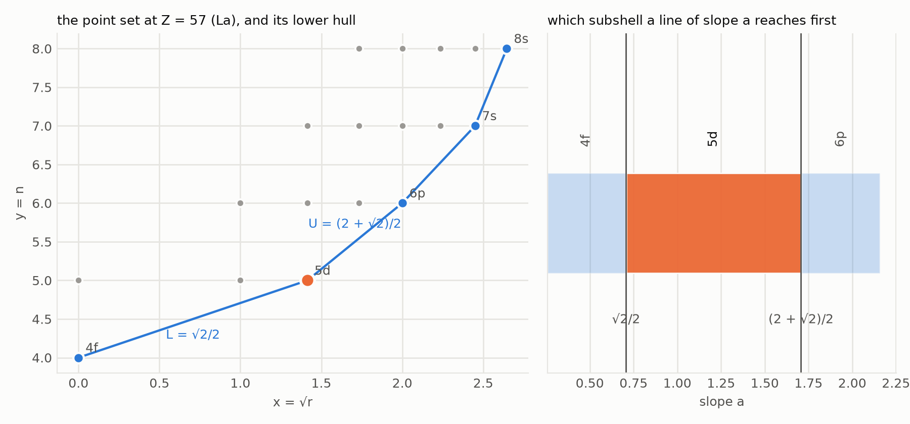
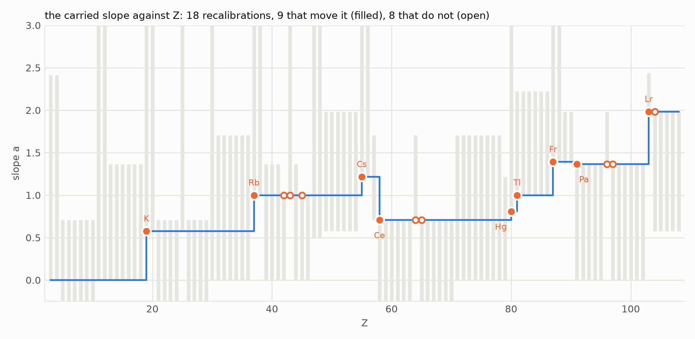
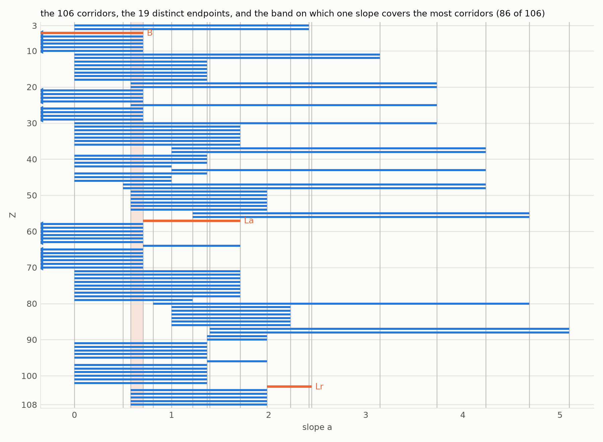

# An Occupation Law as a Lower Convex Hull

**The rule that the entering electron takes the subshell of least ν = n − a·√r is the minimisation of the linear functional y − a·x over a finite point set {(√r, n)}; only a vertex of that set's lower convex hull can be chosen, the slopes that choose a given vertex are exactly the open interval between its two flanking hull-edge slopes, and along the 106 tabulated ground-configuration steps from lithium to hassium the tabulated entrant is such a vertex at every step, with no lower bound on its slope exactly when it carries no radial node.**

**Matthew Lach** · Independent Researcher · 24 September 2026

---

## Abstract

An occupation law for the periodic table, proposed here, assigns to each admissible subshell (n, ℓ) with occupancy q the number ν = n − a·√r, r = n − ℓ − 1 + q/(2(2ℓ+1)), and says that the electron entering at atomic number Z takes the subshell of least ν. This paper reads the law as geometry. Each admissible subshell is the point (√r, n) of a plane, ν is the value of y − a·x there, and the law selects the point a line of slope a reaches first when raised from below. Two classical facts are stated in this setting and proved for completeness: only a vertex of the lower convex hull of the point set can be selected for any slope, and every vertex is selected for some slope (Theorem 1); the set of slopes selecting a given vertex is exactly the open interval between the slopes of the two hull edges that meet there, so the corridors of the vertices partition the slope axis (Theorem 2). What is new begins with the frame: the corridor of the entrant is the same over every finite set of subshells that contains those with n ≤ 12 and ℓ ≤ 4, and over the unbounded set (Theorem 3). Read against the ground configurations of the 108 neutral atoms tabulated in the NIST Atomic Spectra Database — of which the entries for lawrencium and for rutherfordium to hassium rest on calculation rather than spectroscopy — the entrant is a hull vertex at every one of the 106 steps from Z = 3 to Z = 108, in both the node-only and the finished form of the radicand; the 106 node-only corridors have nineteen distinct endpoints, each an element of ℚ(√2, √3, √5, √6, √7); the corridor has no lower bound exactly when the entering subshell is node-free, n − ℓ − 1 = 0 (Theorem 4), which is 26 steps of the 106, and at the two f openings the two cases are realised — cerium, where 4f opens with no floor, and protactinium, where 5f opens with p = 1, floor 0 and ceiling (1 + √3)/2. A slope carried from step to step and moved only when its corridor forces it is recalibrated 18 times, at nine of which it moves and at eight of which it merely touches an endpoint it already sits on; every subshell fills at constant slope except 5d, moved once at cerium, and 6d, moved at protactinium and at lawrencium. Three slopes suffice for all 106 corridors, and three are necessary given the tabulated 7p¹ at lawrencium, whose corridor is disjoint from boron's and lanthanum's; under the aufbau alternative 6d¹ at lawrencium the piercing number is 2. The best single slope covers 86 of 106. Every identity is decided in exact arithmetic on sums of square roots, the hull theorem is discharged by an SMT solver for up to five points in one direction and four in the other, and the law is placed: it orders subshells and constrains nothing but membership of an interval — it does not value.

---

## §0 · The result

**The occupation law is a lower convex hull, and that is both what it can do and what it cannot.**

The law has one free number, a, and a fixed geometric content. Write each admissible subshell as the point (x, y) = (√r, n). Then ν = y − a·x, and "least ν" means the first point met by a line of slope a rising from below. That picture is exact, and it settles three questions at once.

**Whose law, and why the square root.** The law is the author's proposal, stated here in public for the first time. It is not derived from the Schrödinger equation and this paper does not derive it. Its ingredients are the two integers every central-field orbital carries — the radial node count p = n − ℓ − 1 and the Pauli capacity 2(2ℓ + 1) — and one real parameter. What supports the form here is what follows: the tabulated entrant is a hull vertex at 106 of 106 steps (§4), the corridor does not depend on the frame of candidate subshells (Theorem 3), and the floor obeys a one-line law (Theorem 4). The abscissa √r is a choice the paper tests and does not derive, and it is not cosmetic: the map r ↦ √r is not affine, so it does not preserve hull vertices, and with x = r in place of x = √r the tabulated entrant fails to be a vertex at six steps — lanthanum, gadolinium, actinium, thorium, curium and lawrencium — in the node-only form and at five in the finished form (EXHAUSTIVE). That the nineteen endpoints are surds rather than rationals is the same choice seen from the other side.

*Which subshells can the law ever select?* Only vertices of the lower convex hull of the point set, and each of those for some slope (Theorem 1 — a classical fact restated in this setting; PROVED and MACHINE-CHECKED). A point set with two distinct abscissae has at least two such vertices (Corollary 1), so at no step does the form alone determine the entrant: the tabulated subshell is one admissible answer among at least two, and which one is a matter of the slope.

*Which slopes select a given subshell?* Exactly the open interval between the slopes of the two hull edges flanking it — its left neighbour on the hull supplies the floor, its right neighbour the ceiling, and where there is no neighbour there is no bound (Theorem 2 — the one-parameter normal fan of the lower hull, again classical; PROVED). The corridors of the hull vertices, taken in order of abscissa, are consecutive open intervals sharing their endpoints, and together with those endpoints they partition the whole slope axis. So the corridor that the ordering data impose on a is not a fitted quantity: it is a pair of edge slopes, each a number of the form Δn(√r₁ + √r₂)/(r₂ − r₁) with r₁, r₂ node counts, and there are nineteen of them across the table.

*Does the tabulated order fit this form at all?* At every one of the 106 steps from lithium to hassium the tabulated entrant is a hull vertex, in both forms of the radicand (EXHAUSTIVE). That is the content of "the corridor is non-empty at 106 of 106". It is a statement about the form and it survives every other demotion the law suffers below.

**The floor.** The corridor has no lower bound exactly when the entering subshell is node-free, n − ℓ − 1 = 0 (Theorem 4). The reason is that a node-free subshell sits on the axis x = 0, so nothing lies to its left; and conversely, because 5g — node-free, capacity 18, occupied in no tabulated ground configuration — is admissible at every step, every subshell with a node has 5g to its left and so has a floor. Across the walk the node-free entrants are 2p, 3d and 4f at 26 steps; every other corridor is two-sided. At cerium 4f opens with p = 0 and no floor; at protactinium 5f opens with p = 1, the floor is 0, supplied by 5g, the ceiling is (1 + √3)/2, and the carried slope arrives above the ceiling and is placed at it, so the corridor fraction t = (a − L)/(U − L) is 1 there and undefined at cerium. That floor is a property of the candidate-set convention and of no measured level: 5g lies far above 5f in every calculation, and it is a rival here only because the law's admissibility test is occupancy below capacity and says nothing about ℓ. If g subshells are excluded from the candidate set the equivalence of Theorem 4 fails at exactly the eleven 5f steps 91–95 and 97–102, where the floor disappears, and the floor of the five 6d steps 104–108 falls from √3/3 to 0; no other corridor and no recalibration of the walk changes (§5). The paper's convention admits g and says so.

**The walk.** Carrying a from step to step and moving it only when it leaves its corridor — to the nearer endpoint, a distance ε = 10⁻⁶ inside — recalibrates it 18 times (§6). Nine of those are moves: potassium, rubidium, caesium, cerium, mercury, thallium, francium, protactinium, lawrencium. Eight are touches, where the carried value already sits at an endpoint of the new corridor and is nudged 2ε across it: molybdenum, technetium, rhodium, gadolinium, terbium, curium, berkelium, rutherfordium. Eight of the nine moves are at the opening of the entering subshell; mercury is the exception. Every subshell fills at constant a except two: 5d, moved once while open, at cerium, and 6d, moved at protactinium and at lawrencium — both d subshells that straddle an f opening. These sites do not depend on ε between 10⁻⁴ and 10⁻¹⁰.

**One slope for many steps.** No single slope serves the table. The running intersection of the corridors empties fourteen times in the node-only form and eleven in the finished form. The corridors of boron, lanthanum and lawrencium are pairwise disjoint, so at least three slopes are needed, and three explicit rational slopes pierce all 106, so three suffice (Theorem 5). The lower bound rests on lawrencium's tabulated entrant 7p, a calculated configuration: under the aufbau alternative 6d¹ — which is also what the (n + ℓ, n) rule picks at Z = 103 — lawrencium's corridor meets lanthanum's, the largest pairwise-disjoint family is {boron, lanthanum}, and the piercing number is 2. Both cases are computed and stated (§7), and the paper adopts the tabulated configuration: D3 takes the tabulation at every Z, the entry at Z = 103 is treated no differently, so the piercing number the paper states is 3, with the 6d¹ case printed as the sensitivity of that one bound to that one calculated entry. The best single slope covers 86 of the 106 corridors, on the band (√3/3, √2/2); in the finished form 90, on (1, (5√2 + √5)/9).

**What is not claimed.** The law is not derived from the Schrödinger equation, and nothing here bears on that derivation: the point set is built from node counts and Pauli capacities, and the tabulated order enters only through the choice of the slope. A non-empty corridor does not confirm the form; an empty one would refute it, and none is empty. The carried slope, placed as above, reproduces the tabulated entrant at 88 of the 105 steps it is asked to predict before seeing them, against 96 of 106 for the memoryless rule that takes the least (n + ℓ, n) with no parameter at all — a step-conditional score, whose relation to the usual list of twenty aufbau exceptions is stated in §8; the law is not offered as a predictor. The configurations are the database's, and those of lawrencium and of rutherfordium to hassium are calculated, not measured; every result is stated for the table as it stands, and the one headline that turns on a calculated entry — that three slopes are necessary — is stated with that dependence (§7). The candidate set includes g subshells, a convention that no observation below Z = 109 can test, and the measurable consequence of the alternative is stated (§5). The walk's placement rule is one rule among several that respect the corridors, and the count of eighteen belongs to it, not to the table. And the law orders: ν is not an energy, a carries no unit, and the corridor constrains membership of an interval and nothing inside it (§8).

Five status words are used and never merged.

| status | meaning |
|---|---|
| **PROVED** | a proof is written out below and every step is justified |
| **MACHINE-CHECKED** | Z3 returned `unsat` on the negation of an obligation over a named finite family of points, with both guards passed (§9) |
| **EXHAUSTIVE** | a decision procedure visited every case in a stated finite family, in exact arithmetic |
| **MEASURED** | a number computed from the cited configurations by a stated procedure whose one parameter, the walk's ε, is stated |
| **CITED** | taken from the literature or a public database, with the source |

SAMPLED is not among them: no claim rests on a pseudorandom sweep. The only randomised steps are the two encoding-fidelity guards on the machine check (§9), and no result rests on them.

---

## §1 · Definitions

**D1 (subshell, capacity, node count).** A subshell is a pair (n, ℓ) of integers with n ≥ 1 and 0 ≤ ℓ ≤ n − 1, written nℓ with ℓ = 0, 1, 2, 3, 4 as s, p, d, f, g. Its capacity is c(ℓ) := 2(2ℓ + 1), the number of one-electron states it holds. Its node count is

> p(nℓ) := n − ℓ − 1,

the number of radial nodes of the central-field orbital nℓ, for any central potential (CITED: Sturm's oscillation theorem applied to the radial equation, Courant and Hilbert 1953, Chapter VI). A subshell is **node-free** when p = 0; the node-free subshells are 1s, 2p, 3d, 4f, 5g, ….

**D2 (configuration, occupancy).** A configuration is a map q from subshells to integers with 0 ≤ q(nℓ) ≤ c(ℓ) and finite support; q(nℓ) is the occupancy of nℓ.

**D3 (the data, the step, the entrant).** For Z = 1, …, 108, C(Z) is the ground configuration of the neutral atom of atomic number Z as tabulated in the NIST Atomic Spectra Database (Kramida, Ralchenko, Reader and the NIST ASD Team, version 5.12, retrieved 9 August 2026; CITED), with closed cores expanded; its occupancies sum to Z at every Z (EXHAUSTIVE, 108 of 108). The table's entries for lawrencium (Z = 103, [Rn]5f¹⁴7s²7p¹) and for rutherfordium to hassium (Z = 104–108) rest on calculation rather than spectroscopy: lawrencium's 7p¹ ground state is a relativistic coupled-cluster prediction (Eliav, Kaldor and Ishikawa 1995, CITED), with which the measured first ionisation potential (Sato et al. 2015, CITED) is consistent but which it does not establish, and the database's ground level for seaborgium, bohrium and hassium is a bare J with no term symbol, the mark of a calculated entry (EXHAUSTIVE: exactly Z = 106, 107, 108). The paper calls every entry *tabulated*, never *observed*, marks the calculated ones in Table 1, and states in §7 the one result that turns on them. The **step** Z is the passage from C(Z − 1) to C(Z). The **entrant** e(Z) is the subshell whose occupancy rises across the step. At every Z from 3 to 108 exactly one subshell gains (EXHAUSTIVE), so e(Z) is well defined; at twelve steps — chromium, copper, niobium, ruthenium, palladium, praseodymium, terbium, platinum, protactinium, plutonium, berkelium and rutherfordium (EXHAUSTIVE) — the gain is two electrons and another subshell loses one, and the entrant is the subshell that gains. The **walk** is the sequence of the 106 steps Z = 3, …, 108, from lithium to hassium: the table ends at Z = 108, and hydrogen and helium are omitted by convention. The omission is harmless: at both the entrant is 1s with corridor (−∞, 1), which contains the walk's starting slope 0, so their inclusion would change no recalibration of §6 (EXHAUSTIVE).

**D4 (admissible set, frame, the two forms, the point set).** At step Z a subshell is **admissible** when it is not at capacity in the configuration before the step, q(nℓ, Z − 1) < c(ℓ). A **frame** F(N, Λ) is the set of subshells with n ≤ N and ℓ ≤ Λ; the default frame is F(15, 4). The **radicand** of an admissible subshell is, in the **node-only form**,

> r := p(nℓ),

and in the **finished form**,

> r := p(nℓ) + q(nℓ, Z − 1) / c(ℓ),

which lies in [p, p + 1). The **point** of the subshell is π(nℓ) := (√r, n) ∈ ℝ², and the **point set** P(Z) of the step is the set of points of the admissible subshells in the frame. No two admissible subshells share a point in either form: two subshells with the same point have the same n, and equal radicands then have equal integer parts p — the fractional part q/c(ℓ) lies in [0, 1) — hence equal ℓ = n − p − 1 (PROVED; also checked at every step in both forms, EXHAUSTIVE). So P(Z) has one point per admissible subshell. Unless a form is named, the node-only form is meant.

**D5 (the law).** For a real number a, the **slope**, the law assigns to each admissible subshell

> ν(nℓ) := n − a·√r = y − a·x  at the point (x, y) = π(nℓ),

and states that the electron entering at step Z takes the admissible subshell of least ν. The law **holds with slope a at step Z** when e(Z) is the unique minimiser of ν over the admissible set.

**D6 (corridor).** For a finite point set P and a point s ∈ P, the **corridor** of s is

> K(s) := { a ∈ ℝ : y(s) − a·x(s) < y(r) − a·x(r) for every r ∈ P, r ≠ s },

the set of slopes at which s is the unique minimiser of y − a·x. It is empty or an open interval (L, U) with L ∈ ℝ ∪ {−∞} and U ∈ ℝ ∪ {+∞} — each rival contributes one strict bound on a, and finitely many strict bounds cut out an open interval (Lemma 1, proved in §2); L is the **floor** and U the **ceiling**. The corridor of the step, K(Z), is the corridor of the entrant's point in P(Z); L(Z) and U(Z) are its floor and ceiling. A corridor with L = −∞ **has no floor**; one with both bounds finite is **two-sided**.

**D7 (the lower hull, its vertices and edges).** For a finite set Q ⊂ ℝ² let

> E(Q) := conv(Q) + {(0, t) : t ≥ 0},

the convex hull of Q together with everything above it. A point s ∈ P is a **vertex of the lower hull** of P when s ∉ E(P − {s}). No two vertices share an abscissa — of two points with the same abscissa, the higher is the lower plus a vertical shift and so lies in E of the rest (this is Theorem 2(a)) — so the vertices are listed in order of increasing abscissa as v₁, …, vₘ; the **hull edges** are the segments [vᵢ, vᵢ₊₁] and the **edge slopes** are σᵢ := slope(vᵢ, vᵢ₊₁), where for points with x₁ ≠ x₂

> slope((x₁, y₁), (x₂, y₂)) := (y₂ − y₁)/(x₂ − x₁).

For two subshell points with radicands r₁ ≠ r₂ this is Δn·(√r₁ + √r₂)/(r₂ − r₁), rationalised. The vertices flanking a vertex vᵢ are vᵢ₋₁ and vᵢ₊₁.

**D8 (the walk of the slope).** The carried slope starts at a = 0 before lithium. At each step Z in order, if L(Z) < a < U(Z) the value is kept; otherwise it is **recalibrated**: a := L(Z) + ε when a ≤ L(Z), a := U(Z) − ε when a ≥ U(Z), with ε = 10⁻⁶. Where the corridor has no floor only a ≥ U(Z) can fail, and then a := U(Z) − ε. The rule presumes that every corridor is wider than 2ε, which holds: the narrowest two-sided corridor of the walk is lawrencium's, of width (√7 − √3)/2 = 0.4568503 (EXHAUSTIVE). A recalibration is a **move** when |Δa| > 10⁻³ and a **touch** otherwise; the threshold is not delicate, since every touch changes a by exactly 2ε and the smallest move, at protactinium, by 0.0278 (§6). The **corridor fraction** at a two-sided step is t := (a − L(Z))/(U(Z) − L(Z)); it is undefined where the corridor has no floor.

**D9 (running intersection, piercing).** The **running intersection** is the interval I carried along the walk: I := K(3) at lithium, and at each later step I := I ∩ K(Z) if that is non-empty, in which case a is said to be **holdable**; otherwise the intersection **empties** at Z and I := K(Z). A set of slopes **pierces** a family of corridors when every corridor contains one of them; the **piercing number** is the least size of a piercing set. Two corridors are **disjoint** when they share no point.

**D10 (opening, completion, the Madelung pick).** A subshell **opens** at Z when q(nℓ, Z − 1) = 0 and q(nℓ, Z) > 0, and is **complete** at the first Z at which q(nℓ, Z) = c(ℓ); a subshell that loses an electron after completion and regains it later is **re-entered**, not re-opened. The **Madelung pick** at step Z is the admissible subshell in the frame with the least value of (n + ℓ, n) in lexicographic order; the admissible set being that of the tabulated C(Z − 1), the pick is step-conditional (§8).

---

## §2 · The hull theorem

Lemma 1 is one-variable linear feasibility, and Theorems 1 and 2 are classical. Theorem 1 is the statement that the minimisers of a linear functional over a finite point set are extreme points of its convex hull — here of the upward-closed hull E(P), which is what restricts the extreme points to the lower hull. Theorem 2 is the one-parameter normal fan of the lower hull: the slopes selecting a vertex form the cone between the normals of its two edges, and consecutive cones share a boundary ray (Ziegler 1995, Lecture 7; Grünbaum 2003, Chapter 3; in the dual, lower-envelope form, de Berg, Cheong, van Kreveld and Overmars 2008; all CITED). They are proved here in full because the paper needs their exact shape — the corridor as an open interval whose endpoints are edge slopes of a specific point set — and because the proofs are short. The paper's own contribution begins in §4.

**Lemma 1 (one inequality per rival).** Let P be finite, s ∈ P, and a ∈ ℝ. Then s is the unique minimiser of y − a·x over P if and only if for every r ∈ P − {s}:

if x(r) = x(s), then y(r) > y(s); if x(r) > x(s), then a < slope(s, r); if x(r) < x(s), then a > slope(r, s).

Consequently K(s) is empty if some r ≠ s has x(r) = x(s) and y(r) ≤ y(s), and otherwise K(s) = (L, U) with

> L := max { slope(r, s) : r ∈ P, x(r) < x(s) },  U := min { slope(s, r) : r ∈ P, x(r) > x(s) },

where an empty maximum is −∞ and an empty minimum is +∞; K(s) is non-empty exactly when L < U.

*Proof.* The condition on r is y(r) − a·x(r) > y(s) − a·x(s), that is y(r) − y(s) > a·(x(r) − x(s)). If x(r) = x(s) it reads y(r) > y(s). If x(r) > x(s), division by the positive number x(r) − x(s) gives a < (y(r) − y(s))/(x(r) − x(s)) = slope(s, r). If x(r) < x(s), division by the negative number x(r) − x(s) reverses the inequality and gives a > (y(s) − y(r))/(x(s) − x(r)) = slope(r, s). The three cases are exclusive and exhaustive over r. The set of a satisfying finitely many strict lower bounds and finitely many strict upper bounds is the open interval between the largest lower bound and the smallest upper bound, empty when the former is not below the latter. ∎ **PROVED.**

**Theorem 1 (the hull theorem).** Let P ⊂ ℝ² be finite and s ∈ P. The following are equivalent:

**(i)** K(s) ≠ ∅: some slope makes s the unique minimiser of y − a·x;

**(ii)** s ∉ E(P − {s}): s is a vertex of the lower hull of P;

**(iii)** no r ∈ P − {s} has x(r) = x(s) and y(r) ≤ y(s), and for every pair u, w ∈ P − {s} with x(u) < x(s) < x(w) the point s lies strictly below the line through u and w.

*Proof.* **(i) ⇒ (ii).** Suppose s ∈ E(P − {s}): s = Σᵢ λᵢ pᵢ + (0, t) with pᵢ ∈ P − {s}, λᵢ ≥ 0, Σ λᵢ = 1, t ≥ 0. For any a, the functional f(x, y) = y − a·x is affine, so f(s) = Σ λᵢ f(pᵢ) + t ≥ minᵢ f(pᵢ). Hence some pᵢ ≠ s has f(pᵢ) ≤ f(s), and s is not the unique minimiser at a. As a was arbitrary, K(s) = ∅.

**(ii) ⇒ (iii).** Suppose (iii) fails. If some r has x(r) = x(s) and y(r) ≤ y(s), then s = r + (0, y(s) − y(r)) ∈ E(P − {s}). If some u, w with x(u) < x(s) < x(w) have s on or above the line through them, write x(s) = λx(u) + (1 − λ)x(w) with λ = (x(w) − x(s))/(x(w) − x(u)) ∈ (0, 1); the point λu + (1 − λ)w lies on the segment [u, w] at abscissa x(s), and s is it plus (0, t) with t ≥ 0, so s ∈ E(P − {s}). Either way (ii) fails.

**(iii) ⇒ (i).** By Lemma 1 it suffices to show L < U, since the same-abscissa clause of (iii) is exactly the first condition of the lemma. If no point lies to the left of s then L = −∞ < U; if none lies to the right then U = +∞ > L. Otherwise let u attain L among the left points and w attain U among the right points, so x(u) < x(s) < x(w), and suppose L ≥ U, that is slope(u, s) ≥ slope(s, w). The slope of the line through u and w is the convex combination

> slope(u, w) = [ (x(s) − x(u))·slope(u, s) + (x(w) − x(s))·slope(s, w) ] / (x(w) − x(u)),

as the identity (y(w) − y(u)) = (y(s) − y(u)) + (y(w) − y(s)) shows after dividing by x(w) − x(u). A convex combination of two numbers does not exceed the larger, so slope(u, w) ≤ slope(u, s). The height of the line through u and w at abscissa x(s) is y(u) + slope(u, w)·(x(s) − x(u)) ≤ y(u) + slope(u, s)·(x(s) − x(u)) = y(s). So s lies on or above that line, contradicting (iii). Hence L < U and K(s) is non-empty. ∎ **PROVED.**

**MACHINE-CHECKED**, for the implication (i) ⇒ (ii) with k = 2, 3, 4, 5 points of arbitrary real coordinates — Z3 returns `unsat` on "s is the strict minimiser at some a, and s is a convex combination of the others plus a non-negative vertical shift" — and for the implication (iii) ⇒ (i) with k = 2, 3, 4 distinct points in the box [0, 10]², encoded as "the pairwise condition holds and for every real a some other point ties or beats s". Both guards pass (§9). **EXHAUSTIVE**: on the point set of every step, in both forms, and on every set of two to five points of the integer grid {0, 1, 2, 3}² — 6,868 point sets, 31,040 point instances — the three sets {corridor non-empty}, {pairwise condition} and {vertex returned by a monotone-chain hull algorithm with strict turns} coincide. The third route is an independent implementation (Andrew 1979, CITED) and enters only as a guard; nothing in the proof depends on it.

**Corollary 1 (at least two vertices).** If P has at least two distinct abscissae, its lower hull has at least two vertices, and so at least two points of P have non-empty corridors.

*Proof.* Let s be the lowest point among those of least abscissa and s′ the lowest among those of greatest abscissa; s ≠ s′ since their abscissae differ. For s, no pair u, w ∈ P − {s} has x(u) < x(s) < x(w), because every point has x ≥ x(s), and every other point of abscissa x(s) lies strictly above s. So s satisfies (iii) of Theorem 1 and is a vertex. The same holds for s′ with the inequalities reversed. ∎ **PROVED.**

At every step of the walk the admissible set carries several node counts, hence several abscissae, so at no step is the entrant the only subshell some slope could select. In the default frame every step has between 11 and 15 vertices (node-only) and between 7 and 15 (finished); in a frame limited to n ≤ 7 the counts run from 3 to 7 (node-only), with the distribution 3 at 6 steps, 4 at 56, 5 at 28, 6 at 14 and 7 at 2. **EXHAUSTIVE.** The count of vertices depends on the frame; that the count is at least two does not.

---

## §3 · The corridor is the interval between the flanking edge slopes

**Theorem 2 (corridor = flanking edge slopes).** Let P be finite and let v₁, …, vₘ be the vertices of its lower hull. Then:

**(a)** no two vertices share an abscissa, so the order by abscissa is strict;

**(b)** for each i, the corridor of vᵢ is (Lᵢ, Uᵢ) with Lᵢ = slope(vᵢ₋₁, vᵢ) for i > 1 and L₁ = −∞, and Uᵢ = slope(vᵢ, vᵢ₊₁) for i < m and Uₘ = +∞;

**(c)** hence Uᵢ = Lᵢ₊₁ for i < m: the edge slopes σ₁ < σ₂ < … < σₘ₋₁ are strictly increasing, the corridors of the vertices are the consecutive open intervals (−∞, σ₁), (σ₁, σ₂), …, (σₘ₋₁, +∞), and they partition ℝ together with the edge slopes; at a = σᵢ the minimum of y − a·x is attained at vᵢ, at vᵢ₊₁, and at exactly those points of P lying on the segment between them.

*Proof.* **(a)** If two vertices v, v′ share an abscissa with y(v) ≤ y(v′), then v′ = v + (0, y(v′) − y(v)) ∈ E(P − {v′}), so v′ is not a vertex.

**(b)** Fix a vertex v = vᵢ. By Theorem 1 its corridor (L, U) is non-empty, so L < U. Consider the points of P to the left of v. If there are none, L = −∞ by Lemma 1, and no vertex lies to the left of v since a vertex is a point of P. Otherwise let m₀ := L, the maximum of slope(r, v) over the left points, and let g be the line through v with slope m₀: g(x) = y(v) + m₀·(x − x(v)). Every point of P lies on or above g. For a left point r this is the maximality of m₀: slope(r, v) ≤ m₀ gives y(r) ≥ g(x(r)). For v itself it is equality. For a point r with x(r) = x(v), y(r) > y(v) by Lemma 1. For a right point r, Lemma 1 gives y(r) − y(v) > a·(x(r) − x(v)) for every a in the non-empty interval (L, U); pick any such a, then a > L = m₀ and x(r) − x(v) > 0 give a·(x(r) − x(v)) > m₀·(x(r) − x(v)), so y(r) − y(v) > m₀·(x(r) − x(v)) and r lies strictly above g. Let T be the set of left points attaining m₀; they lie on g, and distinct points of a non-vertical line have distinct abscissae, so T has a unique leftmost point u.

u is a vertex. Suppose not: u = Σ λᵢ pᵢ + (0, t) with pᵢ ∈ P − {u}, λᵢ ≥ 0 summing to 1, t ≥ 0. Since g is affine and every point lies on or above it, y(u) = Σ λᵢ y(pᵢ) + t ≥ Σ λᵢ g(x(pᵢ)) + t = g(x(u)) + t = y(u) + t, so t = 0 and every pᵢ with λᵢ > 0 lies on g. The points of P on g are T ∪ {v}, all of abscissa ≥ x(u). Then x(u) = Σ λᵢ x(pᵢ) with every x(pᵢ) ≥ x(u) forces x(pᵢ) = x(u) for every i with λᵢ > 0, and a point of g with abscissa x(u) is u itself, contradicting pᵢ ≠ u.

No vertex lies strictly between u and v in abscissa. A point r with x(u) < x(r) < x(v) has y(r) ≥ g(x(r)), so r lies on or above the segment [u, v], and r ∈ E(P − {r}) by the argument of Theorem 1, (ii) ⇒ (iii) read backwards: r is not a vertex.

Therefore u is the vertex immediately to the left of v, u = vᵢ₋₁, and L = slope(vᵢ₋₁, vᵢ). The statement for U is the mirror image under the reflection x ↦ −x, which sends slopes to their negatives, exchanges left with right, and sends the maximum defining L to the minimum defining U: the set of right points attaining U lies on a line h through v, every point lies on or above h, the rightmost such point w is a vertex, no vertex has abscissa strictly between x(v) and x(w), and so w = vᵢ₊₁ and U = slope(vᵢ, vᵢ₊₁).

**(c)** By (b), Uᵢ = slope(vᵢ, vᵢ₊₁) = Lᵢ₊₁. Each corridor is non-empty (Theorem 1), so σᵢ₋₁ = Lᵢ < Uᵢ = σᵢ, and the edge slopes increase strictly. The intervals (σᵢ₋₁, σᵢ), with σ₀ = −∞ and σₘ = +∞, are pairwise disjoint and their union with {σ₁, …, σₘ₋₁} is ℝ. At a = σᵢ the values y − σᵢ·x at vᵢ and at vᵢ₊₁ agree, since σᵢ is the slope between them. For a in (σᵢ₋₁, σᵢ) the point vᵢ is the unique minimiser, and each r ↦ y(r) − a·x(r) is continuous in a, so at a = σᵢ the value at vᵢ is still at most the value at every point: vᵢ and vᵢ₊₁ are minimisers. A point r attains the same value exactly when it lies on the line through vᵢ and vᵢ₊₁. Such an r with x(r) < x(vᵢ) would give slope(r, vᵢ) = σᵢ > σᵢ₋₁ = Lᵢ, contradicting the maximality in Lemma 1; symmetrically none lies right of vᵢ₊₁. So the minimisers at σᵢ are exactly the points of P on the segment [vᵢ, vᵢ₊₁]. ∎ **PROVED.**

**EXHAUSTIVE**: at every step of the walk, in both forms, and on the 6,868 grid sets of §2, the floor and ceiling of every vertex, computed from Lemma 1, equal the slopes to its flanking vertices, computed from the hull, as exact elements of ℚ(√ℕ).

So the corridor is not an interval that happens to be non-empty: it is one of the m cells into which the hull cuts the slope axis, and its endpoints are hull edges. Figure 1 shows the point set at lanthanum, where 5d enters with 4f to its left and 6p to its right: the corridor is (slope(4f, 5d), slope(5d, 6p)) = (√2/2, (2 + √2)/2).

**Figure 1.** Left: the admissible subshells at Z = 57 (lanthanum) as points (√r, n) in the node-only form, drawn in the frame n ≤ 8, ℓ ≤ 4, with the lower convex hull; the entrant 5d is a vertex, flanked by 4f and 6p. Right: the subshell a line of slope a reaches first, as a runs across the axis; 5d is reached exactly on the corridor (√2/2, (2 + √2)/2) = (0.7071068, 1.7071068), and the endpoints are the two hull-edge slopes.

---

## §4 · The atomic point set, its frame, and the 106 corridors

**Theorem 3 (the corridor is frame-free beyond F(12, 4)).** At every step of the walk, in either form:

**(a)** the entrant's corridor computed over the admissible subshells of any frame F(N, Λ) ⊇ F(15, 4) equals the corridor computed over F(15, 4);

**(b)** the same holds for every finite set of subshells containing F(12, 4);

**(c)** the set of slopes a satisfying the inequality of Lemma 1 for every admissible subshell whatever, with no bound on n or ℓ, is the same open interval.

*Proof.* Monotonicity first. By Lemma 1, L is a maximum over the rivals to the left of the entrant and U a minimum over those to the right, so enlarging the candidate set can only raise L and lower U: for candidate sets S ⊆ S′, L(S) ≤ L(S′) and U(S) ≥ U(S′). Hence if S₀ ⊆ S₁ give the same corridor, so does every S with S₀ ⊆ S ⊆ S₁.

The extremes next. Over the 106 steps the entrant's point has radicand r(e) ≤ 6 (node-only) or r(e) ≤ 13/2 (finished) and n(e) ≤ 7; the largest ceiling over the walk is U⁺ = √6 + √7 = 5.0952411 (node-only) and (10√11 + 5√26)/9 = 6.5179273 (finished); the smallest finite floor is L⁻ = 0 (node-only) and −√14 = −3.7416574 (finished). These extremes are computed exactly (EXHAUSTIVE). Let s be any admissible subshell outside F(15, 4), with quantum numbers (n, ℓ) and radicand r. Its radicand satisfies r ≤ n − 1 in the node-only form and r < n in the finished form, because p = n − ℓ − 1 ≤ n − 1 and the fractional part is below 1.

Suppose n ≥ 38 (node-only) or n ≥ 56 (finished). If x(s) > x(e), then by Lemma 1 the subshell can only lower the ceiling, and its candidate value is slope(e, s) = (n − n(e))/(√r − √r(e)) ≥ (n − 7)/√(n − 1) =: φ(n) in the node-only form, or ≥ (n − 7)/√n =: ψ(n) in the finished form. Both are increasing for n ≥ 8: the derivative of φ is (n + 5)/(2(n − 1)√(n − 1)) > 0 and that of ψ is (n + 7)/(2n√n) > 0. Now φ(38) = 31/√37 = 5.0963686 > U⁺ and ψ(56) = 49/√56 = 6.5479004 > U⁺ (EXHAUSTIVE, exact), so the candidate value exceeds the F(15, 4) ceiling and the minimum in Lemma 1 is unchanged. If x(s) < x(e), the subshell can only raise the floor, with candidate value slope(s, e) = (n(e) − n)/(x(e) − x(s)) ≤ −(n − 7)/√r(e) ≤ −31/√6 = −12.6556970 (node-only) or ≤ −49/√(13/2) = −19.2193812 (finished), each below L⁻; and this case arises only when r(e) > 0, in which case F(15, 4) already supplies a finite floor (Theorem 4 below), so the maximum is unchanged. If x(s) = x(e), then n > n(e) and the subshell imposes no constraint. So a subshell with n ≥ 38 (node-only) or n ≥ 56 (finished) changes neither bound of the F(15, 4) corridor, and its inequality in Lemma 1 contains that corridor.

Every other subshell outside F(15, 4) — n ≤ 37 (node-only) or n ≤ 55 (finished), any ℓ ≤ n − 1 — lies in the frame F(37, 36), respectively F(55, 54), and the corridors computed in those two frames equal the corridors computed in F(15, 4) at all 106 steps (EXHAUSTIVE).

**Part (a).** A frame F(N, Λ) ⊇ F(15, 4) is the union of its subshells with n ≥ 38 (resp. 56), which change nothing, and a set between F(15, 4) and F(37, 36) (resp. F(55, 54)), which by monotonicity gives the F(15, 4) corridor. **Part (b).** A finite set S ⊇ F(12, 4) lies inside some F(N, N − 1) with N ≥ 15; F(12, 4) gives the F(15, 4) corridors at every step in both forms (EXHAUSTIVE), F(N, N − 1) does by (a), and S lies between them. **Part (c).** The set in question is the intersection of the open half-lines of Lemma 1 over all admissible subshells; each half-line from a subshell with n ≥ 38 (resp. 56) contains the F(15, 4) corridor, and the remaining half-lines are those of F(37, 36) (resp. F(55, 54)), whose intersection is that corridor. ∎ **PROVED**, with its extremes and its three closed frames **EXHAUSTIVE**.

The ℓ ≤ 4 in the hypothesis is not decorative. The frame F(15, 3), which reaches n = 15 without g, differs from F(15, 4) at sixteen steps — the eleven 5f steps 91–95 and 97–102 and the five 6d steps 104–108 (EXHAUSTIVE; §5 says how). The frames F(8, 4), F(12, 4), F(20, 4), F(30, 4), F(15, 14) and F(8, 14) also give the F(15, 4) corridors at every step in the node-only form, and F(12, 4), F(20, 4), F(30, 4) and F(15, 14) do so in the finished form; F(8, 4) does not in the finished form, differing at Z = 38, 43, 48, 56, 80, 88. A frame limited to n ≤ 7 differs from the full set in the node-only form at exactly three steps — francium, radium and lawrencium — where it has no subshell to the right of the entrant and so no ceiling, and it has 17 distinct endpoints where the full set has 19: the two it lacks are the ceilings √6 + √7 of the 7s steps and (√5 + √7)/2 of lawrencium. **EXHAUSTIVE.**

| Z | elements | entrant | p | u | L | U | w | L (7 dp) | U (7 dp) |
|---|---|---|---|---|---|---|---|---|---|
| 3–4 | Li, Be | 2s | 1 | 2p | 0 | 1 + √2 | 3s | 0.0000000 | 2.4142136 |
| 5–10 | B – Ne | 2p | 0 | — | −∞ | √2/2 | 3s | — | 0.7071068 |
| 11–12 | Na, Mg | 3s | 2 | 3d | 0 | √2 + √3 | 4s | 0.0000000 | 3.1462644 |
| 13–18 | Al – Ar | 3p | 1 | 3d | 0 | (1 + √3)/2 | 4s | 0.0000000 | 1.3660254 |
| 19–20 | K, Ca | 4s | 3 | 3d | √3/3 | 2 + √3 | 5s | 0.5773503 | 3.7320508 |
| 21–24 | Sc – Cr | 3d | 0 | — | −∞ | √2/2 | 4p | — | 0.7071068 |
| 25 | Mn | 4s | 3 | 3d | √3/3 | 2 + √3 | 5s | 0.5773503 | 3.7320508 |
| 26–29 | Fe – Cu | 3d | 0 | — | −∞ | √2/2 | 4p | — | 0.7071068 |
| 30 | Zn | 4s | 3 | 4f | 0 | 2 + √3 | 5s | 0.0000000 | 3.7320508 |
| 31–36 | Ga – Kr | 4p | 2 | 4f | 0 | (2 + √2)/2 | 5s | 0.0000000 | 1.7071068 |
| 37–38 | Rb, Sr | 5s | 4 | 4d | 1 | 2 + √5 | 6s | 1.0000000 | 4.2360680 |
| 39–41 | Y – Nb | 4d | 1 | 4f | 0 | (1 + √3)/2 | 5p | 0.0000000 | 1.3660254 |
| 42 | Mo | 4d | 1 | 4f | 0 | 1 | 5s | 0.0000000 | 1.0000000 |
| 43 | Tc | 5s | 4 | 4d | 1 | 2 + √5 | 6s | 1.0000000 | 4.2360680 |
| 44 | Ru | 4d | 1 | 4f | 0 | (1 + √3)/2 | 5p | 0.0000000 | 1.3660254 |
| 45–46 | Rh, Pd | 4d | 1 | 4f | 0 | 1 | 5s | 0.0000000 | 1.0000000 |
| 47–48 | Ag, Cd | 5s | 4 | 4f | 1/2 | 2 + √5 | 6s | 0.5000000 | 4.2360680 |
| 49–54 | In – Xe | 5p | 3 | 4f | √3/3 | (√3 + √5)/2 | 6s | 0.5773503 | 1.9840594 |
| 55–56 | Cs, Ba | 6s | 5 | 5d | (√2 + √5)/3 | √5 + √6 | 7s | 1.2167605 | 4.6855577 |
| 57 | La | 5d | 2 | 4f | √2/2 | (2 + √2)/2 | 6p | 0.7071068 | 1.7071068 |
| 58–63 | Ce – Eu | 4f | 0 | — | −∞ | √2/2 | 5d | — | 0.7071068 |
| 64 | Gd | 5d | 2 | 4f | √2/2 | (2 + √2)/2 | 6p | 0.7071068 | 1.7071068 |
| 65–70 | Tb – Yb | 4f | 0 | — | −∞ | √2/2 | 5d | — | 0.7071068 |
| 71–78 | Lu – Pt | 5d | 2 | 5g | 0 | (2 + √2)/2 | 6p | 0.0000000 | 1.7071068 |
| 79 | Au | 5d | 2 | 5g | 0 | (√2 + √5)/3 | 6s | 0.0000000 | 1.2167605 |
| 80 | Hg | 6s | 5 | 5f | (1 + √5)/4 | √5 + √6 | 7s | 0.8090170 | 4.6855577 |
| 81–86 | Tl – Rn | 6p | 4 | 5f | 1 | (2 + √6)/2 | 7s | 1.0000000 | 2.2247449 |
| 87–88 | Fr, Ra | 7s | 6 | 6d | (√3 + √6)/3 | √6 + √7 | 8s | 1.3938469 | 5.0952411 |
| 89–90 | Ac, Th | 6d | 3 | 5f | (1 + √3)/2 | (√3 + √5)/2 | 7p | 1.3660254 | 1.9840594 |
| 91–95 | Pa – Am | 5f | 1 | 5g | 0 | (1 + √3)/2 | 6d | 0.0000000 | 1.3660254 |
| 96 | Cm | 6d | 3 | 5f | (1 + √3)/2 | (√3 + √5)/2 | 7p | 1.3660254 | 1.9840594 |
| 97–102 | Bk – No | 5f | 1 | 5g | 0 | (1 + √3)/2 | 6d | 0.0000000 | 1.3660254 |
| 103 | Lr † | 7p | 5 | 6d | (√3 + √5)/2 | (√5 + √7)/2 | 8s | 1.9840594 | 2.4409096 |
| 104–108 | Rf – Hs † | 6d | 3 | 5g | √3/3 | (√3 + √5)/2 | 7p | 0.5773503 | 1.9840594 |

**Table 1 — the 106 node-only corridors.** Consecutive steps with the same entrant, floor and ceiling are one row. u and w are the hull vertices flanking the entrant; L = slope(u, e) and U = slope(e, w) by Theorem 2, and — is the absence of a neighbour. Every entry is exact; the decimals are rounded to seven places. † marks a step whose tabulated configuration is calculated rather than spectroscopic (D3); under the aufbau alternative 6d¹ at lawrencium the row for Z = 103 becomes the row for 104–108, and no other row changes (§7).

All 106 corridors are non-empty; 80 are two-sided, 26 have no floor, none lacks a ceiling. **EXHAUSTIVE.** In the finished form all 106 are likewise non-empty, with 138 distinct endpoints.

| value | decimal | as floor | as ceiling |
|---|---|---|---|
| 0 | 0.0000000 | 44 | 0 |
| 1/2 | 0.5000000 | 2 | 0 |
| √3/3 | 0.5773503 | 14 | 0 |
| √2/2 | 0.7071068 | 2 | 26 |
| (1 + √5)/4 | 0.8090170 | 1 | 0 |
| 1 | 1.0000000 | 9 | 3 |
| (√2 + √5)/3 | 1.2167605 | 2 | 1 |
| (1 + √3)/2 | 1.3660254 | 3 | 21 |
| (√3 + √6)/3 | 1.3938469 | 2 | 0 |
| (2 + √2)/2 | 1.7071068 | 0 | 16 |
| (√3 + √5)/2 | 1.9840594 | 1 | 14 |
| (2 + √6)/2 | 2.2247449 | 0 | 6 |
| 1 + √2 | 2.4142136 | 0 | 2 |
| (√5 + √7)/2 | 2.4409096 | 0 | 1 |
| √2 + √3 | 3.1462644 | 0 | 2 |
| 2 + √3 | 3.7320508 | 0 | 4 |
| 2 + √5 | 4.2360680 | 0 | 5 |
| √5 + √6 | 4.6855577 | 0 | 3 |
| √6 + √7 | 5.0952411 | 0 | 2 |

**Table 2 — the nineteen endpoints.** Every floor and every ceiling of Table 1 is one of nineteen numbers. The last two columns count the corridors taking the value as floor and as ceiling; the floors sum to 80 and the ceilings to 106. The entry (√5 + √7)/2 is lawrencium's ceiling and occurs only under the tabulated 7p¹ (§7).

The nineteen are pairwise distinct as elements of ℚ(√2, √3, √5, √6, √7), and consecutive values are separated by more than 1/10,000 — the least separation is certified above 0.0267 (node-only) and above 0.0002178 (finished form, 138 endpoints). **EXHAUSTIVE.**

**Proposition 1 (the ns against (n − 1)d crossing).** At the opening of ns for n = 4, 5, 6, 7 — potassium, rubidium, caesium, francium — the floor is supplied by (n − 1)d and equals

> L = (√(n − 1) + √(n − 4)) / 3,

which is √3/3 = 0.5773503, 1, (√2 + √5)/3 = 1.2167605 and (√3 + √6)/3 = 1.3938469.

*Proof.* The node counts are p(ns) = n − 1 and p((n − 1)d) = n − 4, and Δn = 1, so slope((n − 1)d, ns) = 1/(√(n − 1) − √(n − 4)). Multiplying numerator and denominator by √(n − 1) + √(n − 4) gives (√(n − 1) + √(n − 4))/((n − 1) − (n − 4)) = (√(n − 1) + √(n − 4))/3. That (n − 1)d is the flanking vertex at those four steps is Table 1, and the four floors equal the closed form exactly. ∎ **PROVED**; the four instances **EXHAUSTIVE** (the two algebraic identities used, (u + v)(u − v) = u² − v² and (n − 1) − (n − 4) = 3, are also checked on rational grids above their degree, as every identity in the paper is).

**How the numbers are decided.** Every endpoint is a finite sum Σ cₘ √m with rational cₘ and squarefree m, held in that form. Two such sums are equal exactly when their representations coincide, because {1} ∪ {√m : m squarefree > 1} is linearly independent over ℚ (Besicovitch 1940, CITED); the sign of a non-zero sum is decided by enclosing each √m between rationals and refining until the enclosure of the sum excludes zero, which the same theorem guarantees terminates. Over the whole computation the deepest enclosure needed was 24 decimal digits and the smallest non-zero magnitude certified was above 4.43 × 10⁻⁸. No comparison in §§2–5 and §7 is made in floating point.

---

## §5 · The floor

**Theorem 4 (no floor exactly when node-free).** In the node-only form, at every step of the walk, L(Z) = −∞ if and only if the entrant is node-free, p(e(Z)) = 0. In the finished form, L(Z) = −∞ if and only if the entrant is node-free and empty before the step — that is, a node-free subshell opening — which happens at Z = 5 (2p, boron), 21 (3d, scandium) and 58 (4f, cerium).

*Proof.* By Lemma 1, L(Z) = −∞ exactly when no admissible subshell has a point strictly to the left of the entrant's, that is, no admissible subshell has radicand smaller than r(e). Radicands are non-negative. If r(e) = 0 there is nothing to the left and L(Z) = −∞. If r(e) > 0, the subshell 5g is admissible at every step of the walk — it is node-free, its capacity is 18, and no tabulated ground configuration up to Z = 108 occupies a g subshell (EXHAUSTIVE) — and its radicand is 0 in either form, since p(5g) = 0 and its occupancy is 0. So 5g lies strictly to the left of the entrant and L(Z) is finite. Hence L(Z) = −∞ ⟺ r(e) = 0. In the node-only form r(e) = p(e), and r(e) = 0 ⟺ e is node-free. In the finished form r(e) = p(e) + q(e, Z − 1)/c(ℓ), which is 0 ⟺ p(e) = 0 and q(e, Z − 1) = 0 ⟺ e is node-free and opens at Z. The three steps are read off the data. ∎ **PROVED**; the equivalence at all 106 steps, both forms, **EXHAUSTIVE.**

In the node-only form the 26 steps without a floor are the 2p steps 5–10, the 3d steps 21–24 and 26–29, and the 4f steps 58–63 and 65–70; 1s does not enter the walk and 5g never enters. The corridor fraction t is defined at the other 80 steps.

**Corollary 2 (the two f openings).** At cerium (Z = 58) 4f opens with p = 0: the corridor is (−∞, √2/2), the ceiling supplied by 5d, and t is undefined. At protactinium (Z = 91) 5f opens with p = 5 − 3 − 1 = 1: the corridor is (0, (1 + √3)/2), the floor 0 supplied by 5g — the only admissible node-free subshell at that step, the four others 1s, 2p, 3d, 4f being full at thorium — and the ceiling (1 + √3)/2 = 1.3660254 by 6d. The carried slope arrives at protactinium at (√3 + √6)/3 + ε = 1.3938 from francium, above the ceiling, and is placed at U − ε; so t = 1 − ε/U, which is 1 to the precision of the walk. **EXHAUSTIVE** for the corridors, **MEASURED** for the walk's arrival.

The floor at protactinium is 0 because Δn = 0 between 5g and 5f: a rival with the same n and a smaller radicand contributes a floor of exactly 0, which is why 44 of the 80 two-sided corridors have floor 0 (Table 2). It is a floor the convention supplies and no spectrum tests: 5g is a rival because its occupancy is below capacity, not because any calculation places it near 5f. If g subshells are removed from the candidate set (ℓ ≤ 3), the node-free subshells are 1s, 2p, 3d, 4f, all full from lutetium on, and exactly sixteen corridors change. The set of steps without a floor grows by exactly the eleven 5f steps 91–95 and 97–102 (curium, Z = 96, enters 6d and is not among them), so the equivalence of Theorem 4 fails at those eleven and holds elsewhere; and at the five 6d steps 104–108 the floor √3/3, supplied by 5g, falls to 0, supplied by 6f, the ceiling (√3 + √5)/2 standing. No other corridor changes, and the walk of §6 recalibrates at the same eighteen steps to the same endpoints under either convention, because at protactinium and at rutherfordium the carried slope arrives above the ceiling, which the alternative does not move. **EXHAUSTIVE.** The paper's convention — every subshell not at capacity is admissible, whatever its ℓ — is the law's own admissibility test; it is the convention under which Theorem 4 holds without exception, and it is stated here because no observation below Z = 109 distinguishes it from the alternative.

---

## §6 · The walk and its recalibrations

The walk of D8 is a placement rule, not a law: it says where in its corridor a is put when the corridor forces a change, and it moves a the least distance that re-enters. Its one parameter is ε.

| Z | element | entrant | kind | endpoint | endpoint (7 dp) |
|---|---|---|---|---|---|
| 3 | Li | 2s | initial placement | L = 0 | 0.0000000 |
| 19 | K | 4s | move | L = √3/3 | 0.5773503 |
| 37 | Rb | 5s | move | L = 1 | 1.0000000 |
| 42 | Mo | 4d | touch | U = 1 | 1.0000000 |
| 43 | Tc | 5s | touch | L = 1 | 1.0000000 |
| 45 | Rh | 4d | touch | U = 1 | 1.0000000 |
| 55 | Cs | 6s | move | L = (√2 + √5)/3 | 1.2167605 |
| 58 | Ce | 4f | move | U = √2/2 | 0.7071068 |
| 64 | Gd | 5d | touch | L = √2/2 | 0.7071068 |
| 65 | Tb | 4f | touch | U = √2/2 | 0.7071068 |
| 80 | Hg | 6s | move | L = (1 + √5)/4 | 0.8090170 |
| 81 | Tl | 6p | move | L = 1 | 1.0000000 |
| 87 | Fr | 7s | move | L = (√3 + √6)/3 | 1.3938469 |
| 91 | Pa | 5f | move | U = (1 + √3)/2 | 1.3660254 |
| 96 | Cm | 6d | touch | L = (1 + √3)/2 | 1.3660254 |
| 97 | Bk | 5f | touch | U = (1 + √3)/2 | 1.3660254 |
| 103 | Lr † | 7p | move | L = (√3 + √5)/2 | 1.9840594 |
| 104 | Rf † | 6d | touch | U = (√3 + √5)/2 | 1.9840594 |

**Table 3 — the eighteen recalibrations of the node-only walk.** "Endpoint" is the bound the carried value is placed ε inside: after the recalibration a is the endpoint plus ε at an L and minus ε at a U (at potassium, 0.5773513). A move changes a by more than 10⁻³ — the smallest, at protactinium, by 0.0278 — and a touch by exactly 2ε, because the carried value already sat ε beyond the endpoint the new corridor shares with the last one. The two moves to a ceiling are cerium and protactinium. † as in Table 1; under 6d¹ at lawrencium the last two rows disappear and the sixteen above stand (§7).

**Proposition 2 (the recalibration sites).** In the node-only form, with ε = 10⁻⁶:

**(a)** there are 18 recalibrations: the initial placement, 9 moves and 8 touches, at the steps of Table 3;

**(b)** the sites, and the endpoint reached at each, are the same for ε = 10⁻⁴, 10⁻⁶, 10⁻⁸ and 10⁻¹⁰, and every touch changes a by exactly 2ε;

**(c)** at every touch the endpoint reached is the endpoint at which a was last placed: the four consecutive pairs Mo/Tc, Gd/Tb, Cm/Bk and Lr/Rf have corridors sharing exactly one endpoint — 1, √2/2, (1 + √3)/2 and (√3 + √5)/2 respectively — one's ceiling being the other's floor;

**(d)** eight of the nine moves occur at the opening of the entering subshell; the ninth, at mercury, re-enters 6s, which opened at caesium, was complete at barium, lost an electron at platinum and is refilled at mercury;

**(e)** every subshell fills at constant a — no move falls strictly between its opening and its completion (D10; 5s and 6s, re-entered at silver and at mercury after completion, are outside their spans there) — except 5d, open from lanthanum (57) to gold (79) and moved at cerium (58), and 6d, open from actinium (89) to the end of the table and moved at protactinium (91) and lawrencium (103). The two mid-filling moves sit where 4f and 5f collapse into the core — the orbital-collapse sites of the atomic literature (Griffin, Andrew and Cowan 1969; Connerade 1978; CITED) — and the third is at the calculated lawrencium entry.

**MEASURED**, from the corridors of Table 1 by the rule of D8; (b) is the invariance of the measurement under the rule's parameter. A second, independently written implementation of the same rule over a candidate set truncated at n ≤ 8 with the first empty subshell of each ℓ finds the same 18 sites, the same nine values to within 10⁻¹⁵, and the same partition into moves and touches; its candidate set lacks a ceiling at seven ns openings — lithium, sodium, potassium, rubidium, silver, caesium, francium — and that difference changes no site, since at each of those steps a arrives from below.

*Why the walk is decided exactly although a is a floating-point number.* The test L(Z) < a < U(Z) compares a value that is always a corridor endpoint plus or minus ε, ε ≥ 10⁻¹⁰, against endpoints that are pairwise separated by more than 10⁻⁴ (§4) or equal as exact numbers. A comparison between distinct endpoints has margin above 10⁻⁴ and cannot be flipped by double-precision rounding; a comparison against the endpoint a sits on has margin ε; a comparison against an equal endpoint of a later corridor — a touch — is decided by the sign of ε. The floating-point walk therefore reproduces the walk that would be run in exact arithmetic with the same ε, which is why the sites are ε-invariant over six orders of magnitude.

In the finished form the same rule recalibrates 15 times — the initial placement and 14 moves, no touches — at potassium, manganese, rubidium, technetium, caesium, cerium, gadolinium, terbium, francium, protactinium, curium, berkelium, lawrencium and rutherfordium, at the floor except at the f entrants cerium, terbium, protactinium and berkelium and at rutherfordium, where it is the ceiling. **MEASURED.**

**Figure 2.** The carried slope of the node-only walk against Z. Grey bands are the corridors of Table 1 (a band open at the bottom has no floor); the blue line is a; filled circles are the nine moves and open circles the eight touches. The slope is constant across every subshell's filling except 5d, moved at cerium, and 6d, moved at protactinium and lawrencium.

---

## §7 · One slope for many steps

**Proposition 3 (the running intersection).** In the node-only form the running intersection empties fourteen times, at Z = 37, 42, 43, 45, 55, 58, 64, 65, 80, 91, 96, 97, 103 and 104; in the finished form eleven times, at Z = 25, 43, 58, 64, 65, 87, 91, 96, 97, 103 and 104. **EXHAUSTIVE**, exact.

An emptying is a fact about the intervals alone, independent of where a sits; every emptying forces a recalibration of any placement rule that keeps a inside the corridors. The four remaining node-only recalibrations — potassium, thallium, francium and the initial placement at lithium — are not forced by emptiness; they are where this particular rule, arriving from below, finds the floor above it.

**Theorem 5 (the piercing number).** With the tabulated configurations, in the node-only form the piercing number of the 106 corridors is exactly 3, and in the finished form exactly 4. The lower bound 3 rests on lawrencium's tabulated entrant 7p, a calculated configuration (D3): with the aufbau alternative [Rn]5f¹⁴6d¹7s² at Z = 103, which is also the Madelung pick there, lawrencium's node-only corridor is (√3/3, (√3 + √5)/2) — the corridor of rutherfordium to hassium — which meets lanthanum's; every other corridor is unchanged; the largest pairwise-disjoint family is {boron, lanthanum}; and the piercing number is exactly 2.

*Proof.* A piercing set contains at least one slope in each corridor of any pairwise-disjoint subfamily, and distinct disjoint corridors need distinct slopes, so the piercing number is at least the size of any pairwise-disjoint subfamily. In the node-only form the corridors of boron, (−∞, √2/2), lanthanum, (√2/2, (2 + √2)/2), and lawrencium, ((√3 + √5)/2, (√5 + √7)/2), are pairwise disjoint as exact intervals — each ceiling is at most the next floor — so the piercing number is at least 3. Each of the 106 corridors of Table 1 contains, strictly, at least one of the three rationals 7071067/10⁷, 17071067/10⁷ and 3051137/1250000 — the first lies just below √2/2, the second just below (2 + √2)/2, the third just below (√5 + √7)/2 — so the piercing number is at most 3. In the finished form the corridors of cerium, lanthanum, curium and lawrencium are pairwise disjoint and the four rationals 1380131/2000000, 17071067/10⁷, 19840593/10⁷ and 3051137/1250000 pierce all 106. Under 6d¹ at lawrencium the entrant at Z = 103 is 6d with the same admissible set as at rutherfordium, so its corridor is the Rf–Hs row of Table 1, (√3/3, (√3 + √5)/2), whose floor lies below lanthanum's ceiling and whose ceiling lies above lanthanum's floor; the greedy sweep by ceiling then stops at {boron, lanthanum}, and the two rationals 7071067/10⁷ and 17071067/10⁷ pierce all 106. Every membership is decided exactly. ∎ **PROVED** from an **EXHAUSTIVE** certificate on each side, in both cases.

Both bounds are exhibited, so Gallai's theorem — that for intervals on a line the largest pairwise-disjoint subfamily and the smallest piercing set have the same size (announced in Hajnal and Surányi 1958; CITED) — is not needed here; the certificate is the pair of sets. The substitution at lawrencium reaches further than Theorem 5: it removes the lawrencium move and the rutherfordium touch from the walk of §6, which then recalibrates 16 times; it removes the endpoint (√5 + √7)/2 from Table 2, leaving 18; and it removes the emptyings at 103 and 104 from Proposition 3, leaving 12. Nothing else in the paper changes (EXHAUSTIVE). The paper adopts the tabulated 7p¹, as D3 adopts the tabulation at every other Z: its stated piercing number is 3, and the 6d¹ case is printed as the sensitivity of that bound to the one calculated entry it rests on — a reader who takes the aufbau configuration at lawrencium reads 2 for 3 and changes nothing else in the paper.

**Proposition 4 (coverage by one slope).** The number of corridors containing a given slope is piecewise constant between consecutive endpoints, so its maximum is found by probing one rational in each of the twenty gaps between the nineteen endpoints and beyond them. The maximum is 86 of 106, attained on the band (√3/3, √2/2) and on no other; in the finished form it is 90 of 106, on the band (1, (5√2 + √5)/9). **EXHAUSTIVE**, exact.

**Figure 3.** The 106 node-only corridors as intervals on the slope axis, one per row, with the nineteen distinct endpoints as vertical rules; an arrow at the left edge marks a corridor with no floor. The three highlighted corridors — boron, lanthanum, lawrencium — are pairwise disjoint, so no single slope lies in more than one of them and at least three slopes are needed; lawrencium's is drawn for the tabulated entrant 7p. The shaded band (√3/3, √2/2) is where one slope covers the most corridors: 86 of 106.

---

## §8 · What the law does not do

**It does not determine a.** By Theorem 2 the ordering data at a step confine a to a cell of the hull's partition of the slope axis and say nothing about where in that cell a sits. Any placement rule that respects the cells reproduces the tabulated entrant at every step by construction; the count of recalibrations belongs to the rule. The eighteen of §6 are what the rule "hold, else move least" costs, and the fourteen forced emptyings of Proposition 3 are what every rule costs.

**It does not predict.** Asked, at each step Z from 4 to 108, which subshell the slope carried out of step Z − 1 selects, the node-only walk names the tabulated entrant at 88 of the 105 steps, with no ties, missing at 19, 37, 42, 43, 45, 55, 58, 64, 65, 80, 81, 87, 91, 96, 97, 103 and 104 — exactly its own recalibration sites less lithium; the finished form names it at 91, missing at 19, 25, 37, 43, 55, 58, 64, 65, 87, 91, 96, 97, 103 and 104. The memoryless Madelung pick, which carries nothing from step to step and has no parameter, names the tabulated entrant at 96 of 106, missing at molybdenum, rhodium, palladium, lanthanum, gadolinium, gold, actinium, thorium, curium and lawrencium. **MEASURED** and **EXHAUSTIVE** respectively. Out of sample the law with its carried slope does worse than the rule it re-expresses.

That 96 is a step-conditional score and must not be read against the usual count of aufbau exceptions. The pick is made from the admissible set of the tabulated C(Z − 1), so an anomaly that already stands in the previous atom is not charged again; the usual count compares each tabulated configuration with the one the (n + ℓ, n) order builds from nothing, and that comparison differs at 20 of the 108 atoms — Cr, Cu, Nb, Mo, Ru, Rh, Pd, Ag, La, Ce, Gd, Pt, Au, Ac, Th, Pa, U, Np, Cm, Lr (EXHAUSTIVE) — the list the literature on the exceptions discusses (Melrose and Scerri 1996; Scerri 2007, 2013; Schwarz 2010; Schwarz and Rich 2010; all CITED). The ten conditional misses are among the twenty. The other ten — Cr, Cu, Nb, Ru, Ag, Ce, Pt, Pa, U, Np — are absorbed because the anomaly is already in C(Z − 1), from which the (n + ℓ, n) order names the subshell the table names: at chromium 4s is full in vanadium, so the conditional pick is 3d, which is what gains (EXHAUSTIVE). The conditional score is the one the law is entitled to, since the law too is stated step by step from C(Z − 1); the unconditional one is the one a reader will know.

**A non-empty corridor is not a confirmation.** By Corollary 1 every step admits at least two subshells that some slope selects, and in the default frame at least eleven in the node-only form and seven in the finished. The tabulated entrant being among them is a constraint the form passes, not a prediction it makes. An empty corridor at any step would refute the form; the 106 non-empty ones do not confirm it. The Madelung pick, too, is a hull vertex at every step in both forms (**EXHAUSTIVE**): the form admits the rule it is measured against as readily as it admits the tabulated order.

**It orders; it does not value.** ν is not an energy and a has no unit; the point set is built from node counts and capacities, and the only numbers the law produces are the nineteen edge slopes of Table 2, elements of ℚ(√2, √3, √5, √6, √7) fixed by arithmetic on integers. The law says which admissible subshell comes first; it says nothing about how far the others are behind, and no quantity in it is comparable with a binding energy. Nor is the Madelung number a linear object in this plane: since n + ℓ = 2n − p − 1 (an identity, checked on the frame), with x = √p and y = n the level sets of n + ℓ are the parabolas 2y − x² − 1 = constant, whereas ν sweeps lines. The two rules are different geometric objects that agree on most of the occupied region, and their disagreement is a matter of ordering, not of value. Nor does the law answer Löwdin's question, why the subshells fill in the order they do (Löwdin 1969; Allen and Knight 2002): it re-poses it. Where the (n + ℓ, n) rule names the tabulated order at 96 of 106 with no parameter, the law admits it at 106 of 106 with one parameter confined step by step, and the question becomes what fixes a — which nothing here does.

---

## §9 · Verification record

| object | PROVED | EXHAUSTIVE | MACHINE-CHECKED (Z3) | CITED / MEASURED |
|---|---|---|---|---|
| D3, the data | — | 108 electron counts; one entrant at each of 106 steps; the twelve two-electron steps; no g subshell occupied; the three bare-J entries; the 20 aufbau exceptions; the 1s corridors at Z = 1, 2 | — | configurations CITED; Z ≥ 103 calculated (Eliav, Kaldor and Ishikawa 1995; Sato et al. 2015) |
| D4, distinct points | ✓ | 106 steps × 2 forms | — | — |
| D8, the rule's presumption | — | narrowest corridor (√7 − √3)/2; smallest move 0.0278 | — | — |
| Lemma 1 | ✓ | — | — | classical |
| **Theorem 1** | ✓ | 212 step-instances; **6,868 grid sets**, 31,040 point instances; three routes agree | **✓ 7 obligations**: (i)⇒(ii) for k = 2…5 points, all real coordinates; (iii)⇒(i) for k = 2…4 distinct points in [0,10]² | classical (Grünbaum 2003); third route CITED (Andrew 1979) |
| Corollary 1 | ✓ | vertex counts at 106 steps, two forms, two frames: 11–15, 7–15, 3–7 | — | — |
| **Theorem 2** | ✓ | endpoints = flanking edge slopes at 212 step-instances and 6,868 grid sets, exact | — | classical (Ziegler 1995; de Berg et al. 2008) |
| **Theorem 3** | ✓ | extremes of L, U, r(e), n(e); the four bounds; frames F(37,36), F(55,54), F(12,4) and seven others; F(15,3) differs at sixteen steps | — | — |
| the abscissa | — | with x = r the entrant is not a vertex at 6 steps (node-only), 5 (finished) | — | — |
| Table 1, Table 2 | — | 106 corridors; 80 two-sided; 19 endpoints, min gap 0.0267; 138 in the finished form, min gap 0.0002178 | — | — |
| Proposition 1 | ✓ | the two identities on rational grids; four floors exact | — | — |

**The exhausted families, named.** 106 steps: Z = 3 to 108, each in the node-only and the finished form. 6,868 grid sets: every set of two, three, four or five distinct points of the integer grid {0, 1, 2, 3}². 108 electron counts: Z = 1 to 108. Ten frames, each at 106 steps: F(8,4), F(12,4), F(20,4), F(30,4) and F(15,14) in both forms; F(8,14), F(37,36), F(7,4) and F(15,3) in the node-only form; F(55,54) in the finished form. 20 probes: one rational strictly between each pair of consecutive endpoints and one beyond each end. The lawrencium substitution: the 106 steps once more, with C(103) = [Rn]5f¹⁴6d¹7s².

**The obligation count.** One hundred and forty-one obligations run and none fails: 115 EXHAUSTIVE, 17 guards, 7 MACHINE-CHECKED and 2 MEASURED (the two held-out scores). Every obligation has a pass condition that can fail: each printed value is compared with the value the paper states. The self-test adds three negative controls, each of which must be reported as refuted, and each is: a hull algorithm that keeps collinear points, which disagrees with the corridor identity at 18 of the 106 steps; the wrong crossing formula (√(n − 1) + √(n − 4))/2, which fails against potassium's floor; and the false claim that the strict minimiser is always the point of least y, which Z3 returns satisfiable with a model. A fourth control runs in every run, inside the encoding guard: a deliberately wrong reference — the hull without its first vertex — is caught with 300 disagreements.

**The two guards on the machine check.** *Non-vacuity*: both hypotheses — "s is the strict minimiser at some a" and "the pairwise condition holds for four distinct points" — are satisfiable. *Encoding fidelity*: the Z3 expression for "s ∉ E(P − {s})" — the same object the obligations quantify over, built by the same function — is instantiated by substituting the coordinates of 300 pseudorandom point sets of two to five points with rational abscissae (1,027 point instances, seed 11), simplified to a Boolean, and compared with the monotone-chain hull: it agrees in every case, while the deliberately wrong reference disagrees 300 times. The Z3 expression for "s is the strict minimiser at a" is instantiated the same way on 300 further sets with a rational slope and agrees with brute-force minimisation in every case. These 600 instances are a guard on the encoding and not a result of the paper.

**The measured and the counted**, in the same columns:

| object | PROVED | EXHAUSTIVE | MACHINE-CHECKED (Z3) | CITED / MEASURED |
|---|---|---|---|---|
| **Theorem 4** | ✓ | both forms, 106 steps; without g, the eleven 5f exceptions and the five Rf–Hs floors; the walk unchanged without g | — | — |
| Corollary 2 | — | Ce and Pa corridors exact; Pa's floor from 5g | — | the arrival at Pa MEASURED |
| Table 3, Proposition 2 | — | the eighteen endpoints reached; four consecutive pairs share one endpoint, exact | — | MEASURED, ε ∈ {10⁻⁴, 10⁻⁶, 10⁻⁸, 10⁻¹⁰}; independent implementation agrees |
| the finished-form walk | — | 15 = 1 + 14 + 0, with the five placements at U | — | MEASURED |
| Proposition 3 | — | running intersection, exact, both forms | — | — |
| **Theorem 5** | ✓ | disjoint triple and piercing triple exact; disjoint quadruple and piercing quadruple exact; under 6d¹ at Lr, disjoint pair and piercing pair exact, and the 105 other corridors unchanged | — | Gallai's theorem named (Hajnal and Surányi 1958), not used |
| the lawrencium substitution | — | 16 recalibrations, 18 endpoints, 12 emptyings, 106 of 106 non-empty; the table restored | — | — |
| Proposition 4 | — | 20 probes between 19 endpoints; 139 between 138; the best band unique in each form | — | — |
| §8, prediction | — | Madelung pick 96 of 106 with its ten misses; the ten absorbed among the twenty; Madelung pick a vertex at 106 steps, two forms | — | walk scores MEASURED, 88 and 91 of 105 |
| exact arithmetic | — | every sign by rational enclosure; deepest 24 digits; least certified magnitude 4.43 × 10⁻⁸ | — | linear independence CITED (Besicovitch 1940) |

**What is not machine-checked, and why.** Theorem 2 is proved and exhaustively verified on the atomic steps and the grid family; its statement quantifies over the hull's vertex order, which is not first-order in the point coordinates without enumerating orderings, and the exhaustive family is where its content lies. Theorem 3 rests on two inequalities proved by a derivative and evaluated exactly at n = 38 and n = 56, on monotonicity, and on three closed frames checked exhaustively. The walk is a measurement with a stated parameter; its exactness argument is in §6. The converse direction of Theorem 1 is machine-checked for up to four points in a bounded box because the universal quantifier over a makes the obligation harder for the solver; the proof is general. The status of the configurations at Z ≥ 103 is not a matter this paper can check: it is recorded from the database's own entries and the literature, and the one result that turns on it is computed both ways.

---

## References

- Allen, L. C. and Knight, E. T. (2002). The Löwdin challenge: origin of the n + l, n (Madelung) rule for filling the orbital configurations of the periodic table. *International Journal of Quantum Chemistry* **90**, 80–88. — the standing of the derivation problem (§8).
- Andrew, A. M. (1979). Another efficient algorithm for convex hulls in two dimensions. *Information Processing Letters* **9**, 216–219. — the monotone-chain algorithm used as the third, independent route to the vertex set.
- Besicovitch, A. S. (1940). On the linear independence of fractional powers of integers. *Journal of the London Mathematical Society* **15**, 3–6. — linear independence over ℚ of the square roots of distinct squarefree integers, on which the exact decision of every endpoint rests.
- Connerade, J.-P. (1978). The non-Rydberg spectroscopy of atoms. *Contemporary Physics* **19**, 415–447. — orbital collapse, at the two mid-filling moves of §6.
- Courant, R. and Hilbert, D. (1953). *Methods of Mathematical Physics*, Volume I. Interscience, New York. — Sturm's oscillation theorem (Chapter VI), which gives the radial node count n − ℓ − 1 of D1.
- de Berg, M., Cheong, O., van Kreveld, M. and Overmars, M. (2008). *Computational Geometry: Algorithms and Applications*, 3rd edition. Springer, Berlin. — the lower envelope of lines as the dual of the upper hull; the classical form of Theorems 1 and 2.
- Demkov, Yu. N. and Ostrovsky, V. N. (1972). n + l filling rule in the periodic system and focusing potentials. *Soviet Physics JETP* **35**, 66–69. — a potential class whose levels depend on n + ℓ alone.
- de Moura, L. and Bjørner, N. (2008). Z3: an efficient SMT solver. In *Tools and Algorithms for the Construction and Analysis of Systems*, Lecture Notes in Computer Science **4963**, 337–340. — the solver behind every MACHINE-CHECKED obligation.
- Eliav, E., Kaldor, U. and Ishikawa, Y. (1995). Transition energies of ytterbium, lutetium, and lawrencium by the relativistic coupled-cluster method. *Physical Review A* **52**, 291–296. — the calculated 7s²7p¹ ground state of lawrencium (D3).
- Goudsmit, S. A. and Richards, P. I. (1964). The order of electron shells in ionized atoms. *Proceedings of the National Academy of Sciences* **51**, 664–671. — the ordering of shells in ions, conditional on the charge state, which the step-conditional admissibility of D4 resembles.
- Griffin, D. C., Andrew, K. L. and Cowan, R. D. (1969). Instabilities in the iterative solution of the Hartree–Fock equations for excited electrons. *Physical Review* **177**, 62–71. — the collapse of the f orbitals, at the sites of §6.
- Grünbaum, B. (2003). *Convex Polytopes*, 2nd edition, Graduate Texts in Mathematics **221**. Springer, New York. — extreme points and faces of a convex hull; the classical content of Theorem 1.
- Hajnal, A. and Surányi, J. (1958). Über die Auflösung von Graphen in vollständige Teilgraphen. *Annales Universitatis Scientiarum Budapestinensis de Rolando Eötvös Nominatae, Sectio Mathematica* **1**, 113–121. — where Gallai's theorem on interval families, named after Theorem 5 and not used, is announced.
- Janet, C. (1929). *Considérations sur la structure du noyau de l'atome*. Beauvais. — the left-step table and the n + ℓ ordering before Madelung.
- Karapetoff, V. (1930). A chart of consecutive sets of electronic orbits within atoms of chemical elements. *Journal of the Franklin Institute* **210**, 609–624. — the n + ℓ ordering stated before Madelung, beside Janet.
- Klechkovskii, V. M. (1962). Justification of the rule for successive filling of (n + l) groups. *Soviet Physics JETP* **14**, 334–335. — the (n + ℓ, n) rule in the form the Madelung pick uses.
- Kramida, A., Ralchenko, Yu., Reader, J. and the NIST ASD Team (2024). *NIST Atomic Spectra Database*, version 5.12. https://physics.nist.gov/asd, DOI 10.18434/T4W30F; ground levels and ionization energies for the neutral atoms, retrieved 9 August 2026. — the ground configurations of the 108 neutral atoms; the database is live and the retrieval date fixes the table used.
- Löwdin, P.-O. (1969). Some comments on the periodic system of the elements. *International Journal of Quantum Chemistry* **3** (S3A), 331–334. — the challenge to derive the filling rule.
- Madelung, E. (1936). *Die mathematischen Hilfsmittel des Physikers*, 3rd edition. Springer, Berlin. — the n + ℓ rule as usually attributed.
- Melrose, M. P. and Scerri, E. R. (1996). Why the 4s orbital is occupied before the 3d. *Journal of Chemical Education* **73**, 498–503. — the 4s/3d question and the step-conditional reading of the aufbau (§8).
- Ostrovsky, V. N. (2001). What and how physics contributes to understanding the periodic law. *Foundations of Chemistry* **3**, 145–181. — the status of the n + ℓ rule as an explanandum.
- Sato, T. K., Asai, M., Borschevsky, A., Stora, T., Sato, N., Kaneya, Y., Tsukada, K., Düllmann, Ch. E., Eberhardt, K., Eliav, E., Ichikawa, S., Kaldor, U., Kratz, J. V., Miyashita, S., Nagame, Y., Ooe, K., Osa, A., Renisch, D., Runke, J., Schädel, M., Thörle-Pospiech, P., Toyoshima, A. and Trautmann, N. (2015). Measurement of the first ionization potential of lawrencium, element 103. *Nature* **520**, 209–211. — the one measurement on lawrencium's ground state, consistent with 7p¹ but not a determination of the configuration (D3).
- Scerri, E. R. (2007). *The Periodic Table: Its Story and Its Significance*. Oxford University Press, New York. — the aufbau exceptions (§8).
- Scerri, E. R. (2013). The trouble with the aufbau principle. *Education in Chemistry* **50** (6), 24–26. — the same, for the transition metals.
- Schwarz, W. H. E. (2010). The full story of the electron configurations of the transition elements. *Journal of Chemical Education* **87**, 444–448. — the exception list and its physics (§8).
- Schwarz, W. H. E. and Rich, R. L. (2010). Theoretical basis and correct explanation of the periodic system: review and update. *Journal of Chemical Education* **87**, 435–443. — the same.
- Wong, D. P. (1979). Theoretical justification of Madelung's rule. *Journal of Chemical Education* **56**, 714–717. — an attempted derivation of the n + ℓ rule.
- Ziegler, G. M. (1995). *Lectures on Polytopes*, Graduate Texts in Mathematics **152**. Springer, New York. — normal fans (Lecture 7); the classical content of Theorem 2.
