# California Sovereign Infrastructure

*Firm electricity and firm water for three million households, priced at two cases*

**Matthew Lach, Independent Researcher, 2026**

### Abstract

California's two fundamental scarcities are firm electricity and fresh water, and both are worsening on the same
timescale. The state's residential load peaks after sunset and in summer, its grid is served at those hours by gas
and imports at rising prices, and the utilities' generation charge for a household has risen to about
$1,177 a year. Its water is drawn from an over-allocated river system and from groundwater basins
that are overdrafted by 1.8–2.5 million acre-feet a year in the San Joaquin Valley alone, under a
statute that now requires the deficit to close. Neither scarcity yields to demand reduction at the scale required,
and every supply that can meet them at scale is capital-intensive, first-of-a-kind, or both. This proposal sets out
one state-owned program that addresses the two together: Title I, a concentrating-solar plant of a new
generation, sized to make 18.1 TWh a year of firm electricity for three million households; Title II, seawater
reverse-osmosis modules on retired coastal power plants; and Title III, the contract and the one shared asset that
join them, by which the plant's summer surplus lifts the water to an elevated reservoir and the water's year-round
descent closes the plant's evening peak. Every figure is computed rather than asserted, at a middle case and at a
critical case in which every uncertain constant sits at its adverse end, and the design is held to the critical
case. The program costs $67 to 114 billion once, carries no public money after the build, and returns a
household's generation charge to $190–263 a year once the bonds retire. It proceeds in stages, each
reversible until a pilot receiver has passed a test whose pass mark is fixed in advance; the first stage is $213
to 463 million of studies and surveys, which is the decision this document requests.

### Contents

- 1. Summary and the decision requested
- 2. The requirement
- 3. The record of salt-tower solar and the cost of building it
- 4. The equipment question
- 5. The energy chain
- 6. The plant
- 7. The plant hour by hour
- 8. Closing the load
- 9. The risk register
- 10. Provenance: the studies behind every technology
- 11. The pilot receiver: an acceptance protocol
- 12. Studies and surveys first
- 13. Price, the household and the financing
- 14. Title II: the water
- 15. Title III: the joinder
- 16. The sites
- 17. Environment, employment, land and procurement
- 18. What is not settled
- 19. How the figures were produced
- Bibliography

**How to read the figures in this document.** Every number is printed at two cases. *Mid* is the middle of each
constant's band; *critical* is the adverse end of every band at once. The design is held to critical, and the mid
column is margin. A number quoted without its case is misquoted. Each figure also carries a status: SOURCED is a
published figure with its source in the bibliography; ASSUMED is a band the record does not fix, stated as such;
RECONSTRUCTED is a shape or split rebuilt from physics or from a published model; DERIVED is computed from the
others; DECIDED is a choice this work has made and recorded. A status is never flattened: how a number was got is
part of what it is.

## 1. Summary and the decision requested

The program is one state-owned enterprise under one Authority, two severable projects, funded once by bonds and
never again by the treasury. Title I builds a concentrating-solar plant on three desert nodes, with falling-particle
receivers and supercritical-CO₂ turbines in place of nitrate salt and steam, photovoltaics serving the daytime load
directly and a mirror field sized for the night, to make **18.1 TWh** of firm electricity a year for three million
households. Title II builds **15 to 17** seawater reverse-osmosis modules of 50,000 acre-feet a year on retired
coastal power plants. Title III lifts the water to an elevated reservoir with Title I's summer surplus and returns it
year-round through pump-turbines to Title I's evenings, and states the contract, the shared asset and the
severability that make the two projects one program without making either dependent on the other.

| | mid | critical |
|---|---|---|
| Title I plant with its risk register, $B | 32.7 | 55.4 |
| Title I closing the whole load on the adopted route, $B | 6.4 | 10.3 |
| Title II modules at the adopted route, $B | 28 | 48 |
| **program, $B** | **67** | **114** |
| of which studies and surveys, first in the capital, $M | 213 | 463 |
| Title I price serving the whole load, $/MWh | 172 | 279 |
| household generation charge during the bonds, $/yr (today 1,177) | 1,036 | 1,682 |
| household generation charge after the bonds retire, $/yr | 190 | 263 |
| water at cost recovery, $/acre-foot | 3,044 | 4,830 |
| share of the load left to the grid | 0.6% | 0.7% |
| studies begin / first electricity (PV) / first CSP module / fleet complete | 2027 / 2031 / 2036 / 2041 | 2027 / 2033 / 2038 / 2043 |
| CO₂ avoided with the load closed, million t/yr | 7.24 | 6.34 |
| permanent jobs, Title I / construction peak | 1,901 / 21,054 | 1,214 / 21,054 |

**The decision requested.** Fund the studies and surveys now, at $213 to 463 million, and know within
2 to 4 years whether the rest is worth $67 to 114 billion. Nothing irreversible is bought before the
pilot receiver has passed its test.

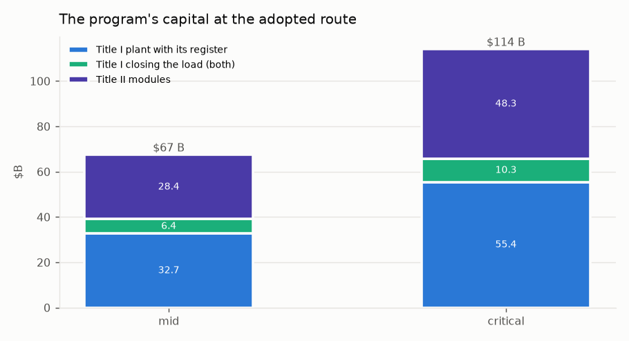

*Figure 1. The program's capital at the adopted route, both cases.*

## 2. The requirement

**Households.** Three million households is the program's minimum, growing with population. At the state average of
6,036 kWh a year per residential customer [75] that is **18.1 TWh** of firm supply, growing to **1.35–1.81×** over the
30-year bond term at 1–2 % a year of residential growth including electrification. California has
14,217,180 residential customers [75], so three million is a fifth of them, and a program that serves them at the
state average serves the households that consume least, which is the fairer half of any tariff question.

**The criterion.** The plant must pay for itself after the build bonds: revenue must cover debt service and O&M in
every year of the 30-year term, with the coverage a bond buyer requires, and after the term everything above O&M is
the household's dividend. A free tariff is therefore an output of the balance and never an input to it. Inverted, the
criterion is a required price per MWh, and it is read against two references.

| reference | $/MWh | $ per household per year |
|---|---|---|
| what a household pays the utility for generation today (0.195 $/kWh) | 195 | 1,177 |
| what California's load-serving entities pay for firm clean energy under contract | 80–120 | 483–724 |

**Size is not a lever.** Because the households are a requirement, the plant cannot be shrunk to make the price close.
Only the equipment and the ownership form move the price, and the sections that follow work through both.

## 3. The record of salt-tower solar and the cost of building it

The natural first candidate for firm solar power in California is the nitrate-salt power tower, the one form of
concentrating solar with a commercial storage record. This section establishes what such a plant actually makes and
what it actually costs, because both are commonly overstated and the program's design follows from the difference.

**What a salt-tower plant of the size first considered makes.** A plant of 5,250 MWe gross across three desert nodes,
with 45.6 million m² of heliostats and 197 GWh_th of salt storage, run hour by hour on exact solar geometry at
each node's annual direct-normal irradiance [77], with the salt tank, the turbine's part-load curve and the parasitic
loads modelled explicitly:

| | figure |
|---|---|
| net output, TWh/yr | 19.2 |
| net capacity factor | 0.486 |
| revenue selling everything at the 2024 CAISO price shape [78], $M/yr | 677 |
| revenue with $350/MWh on the four peak hours of every day, the rest at the 2024 shape, $M/yr | 2,451 |
| carrying cost at $27.2 B of capital, 3.85 % and 30 years, plus $410 M of O&M, $M/yr | 1,954 |
| required price at $27.2 B, $/MWh | 102 |

Two things follow. Such a plant makes 19.2 TWh, about what three million households consume, and no more: a firm
export on top of the in-state supply does not exist. And evening-peak pricing exists for about 1,500–2,000 hours a
year while 1,180 hours in 2024 cleared negative [78], so a plant that sells at the market shape earns a third
of its carrying cost. At $27.2 B of capital the required price would be $102/MWh, inside the contract band; the
question is whether the plant can be built for that.

**What it costs to build.** Line by line at the class that exists (Noor III-class heliostats of 178 m² on 36 towers of
250 m), state-owned, groundbreaking 2028–2030: no developer margin, bond-rate interest during construction, the
federal storage credit with the public direct-pay and energy-community bonuses, public-pension on-cost, property tax
out and a payment in lieu in. The level is calibrated to NREL's 2024 technology baseline at $7,912/kWe [76] and
the split is reconstructed from the System Advisor Model's published cost structure [79].

| case | net capital, $B | $/W gross | required price, $/MWh | $ per household |
|---|---|---|---|---|
| low | 46.1 | 8.79 | 171 | 1,033 |
| mid | 57.0 | 10.85 | 206 | 1,244 |
| high | 71.5 | 13.62 | 253 | 1,528 |
| at $27.2 B, for comparison | 27.2 | 5.18 | 102 | 613 |

A $27.2 B figure for this plant is 1.70× below the low case. **At the built cost, a salt-tower plant of this size does
not pay for itself after the bonds at any case**, and at the mid case it charges a household more than the utility does
today. The built record is the reason:

| plant | $/W gross as built | year | storage, h |
|---|---|---|---|
| Gemasolar | 11.17 | 2011 | 15.0 |
| Ivanpah | 5.61 | 2014 | 0.0 |
| Crescent Dunes | 8.86 | 2015 | 10.0 |
| Noor II+III (blended) | 6.92 | 2018 | 7.5 |
| Cerro Dominador | 10.45 | 2021 | 17.5 |
| DEWA Noor Energy 1 (blended, incl. PV) | 4.77 | 2023 | 15.0 |

And what those plants delivered against their design:

| plant | delivered / designed | the year, and why |
|---|---|---|
| Gemasolar, Spain, 2011 | 0.73 | mature; the best sustained record of any salt tower |
| Crescent Dunes, USA, 2015 | 0.39 | 2018, best full year before the 2019 shutdown |
| Cerro Dominador, Chile, 2021 | 0.12 | 2023; hot-tank damage, plant largely stopped |

No commercial salt tower has delivered its design output [90], and an hourly model still flatters that record.
That is why every figure in this document is printed at a critical case, and why the design is held to it.

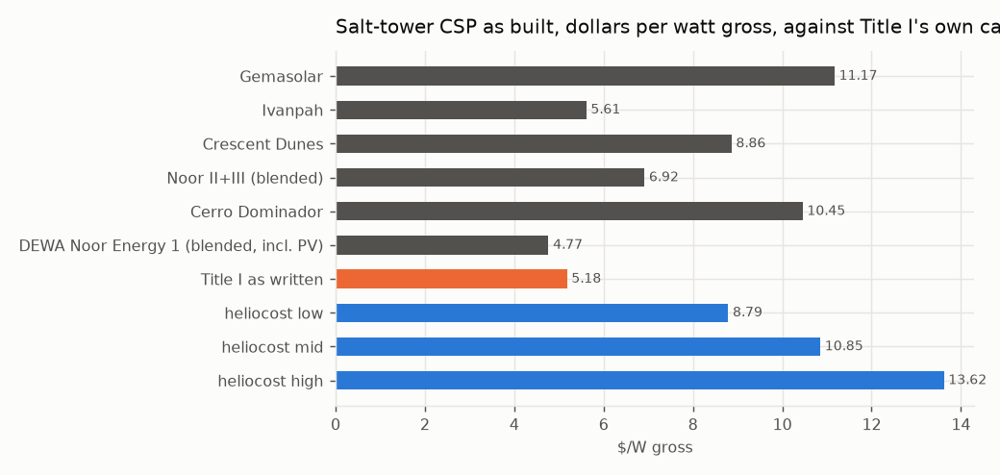

*Figure 2. Salt-tower concentrating solar as built, in dollars per watt gross, against the capital first considered.*

## 4. The equipment question

Before a technology is chosen, every candidate that can make a firm MWh in California is sized to the same 18.1 TWh,
state-owned, and priced on the one criterion. The salt tower is priced from the line-by-line build above; the
built-up candidates from their parts; the alternatives at their low, mid and high bands, the high band standing
where the critical case stands elsewhere.

| candidate | MW | mid: net capital $B / price $/MWh / $ per household | band top: net capital $B / price $/MWh | acres | status |
|---|---|---|---|---|---|
| Salton Sea geothermal, flash (conventional) | 2,297 | 11.9 / 62 / 375 | 14.3 / 70 | 4,594 | permitted class; CEQA + Imperial County; FAST-41 covered (capped: exceeds the developable resource) |
| Enhanced geothermal (Fervo class) | 2,297 | 11.1 / 57 / 343 | 14.3 / 68 | 3,445 | permitted class; SCE holds 320 MW / 15 yr, Google 396 MW |
| PV-charged nitrate salt (heaters into Helios tanks + turbines) | 13,040 | 49.9 / 193 / 1,168 | 55.2 / 210 | 78,240 | permitted class; PV on disturbed land; salt block as heliocost |
| Salt-tower CSP as proposed | 4,941 | 53.6 / 205 / 1,239 | mid only | 212,453 | permitted class |
| PV + 100-hour iron-air storage | 13,609 | 52.8 / 199 / 1,203 | 56.3 / 209 | 81,651 | permitted class; first 15 MW units 2026 |
| Small modular reactor | 2,247 | 24.5 / 102 / 617 | 29.3 / 119 | 1,123 | BARRED: Cal. Pub. Res. Code §25524.2 moratorium on new nuclear |
| Floating offshore wind (Morro Bay / Humboldt) | — | — | — | — | two of three Morro Bay leases terminated; not firm; SOURCED LCOE+LCOT $95-121 (2035) |

Two results stand out. Salton Sea geothermal, in the program's own Imperial node, has 2,250 MW developable, 0.98 of
the requirement, and prices at $62/MWh at mid [88]; its hypersaline capital band is assumed, and it cannot grow with
the requirement. The small modular reactor is barred by statute [87, 89]. Concentrating solar is chosen on a different ground:
it is the one firm-solar form whose output can be raised by engineering within the program's control, and the rest of
this document is the engineering. The comparison is kept beside the choice so that the choice is priced.

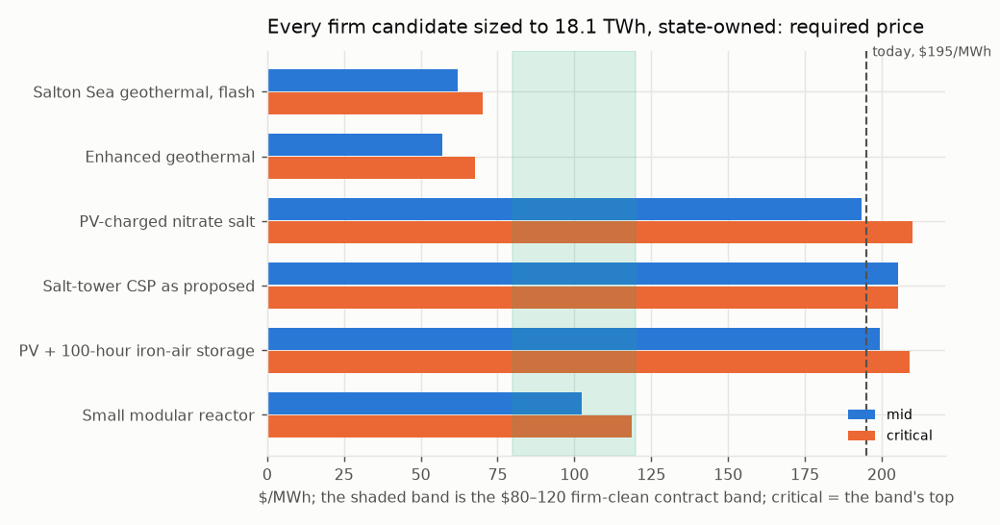

*Figure 3. Every firm candidate sized to the requirement, state-owned, required price at mid and at the band's top.*

## 5. The energy chain

Sun to socket is a product of seven links, `E = A · DNI · opt · rec · tes · dispatch · cycle · (1 − par) · avail`. Each
is stated for the salt tower as it exists, at the best achieved or designed, and at its physical bound:

| link | salt tower as it exists | best achieved / designed | bound | status of the best |
|---|---|---|---|---|
| field optical efficiency, annual | 0.536 | 0.640 | 0.700 | SOURCED: optimised surround fields 58-64 %; mono-tower upper limit ~70 % |
| receiver thermal efficiency, annual | 0.880 | 0.900 | 0.950 | SOURCED: 84.7 % annual / 87.4 % design at 336-650 C salt; particle 85-90 % |
| storage round trip | 0.995 | — | 1.000 | SOURCED: ~1 C/day on a 275 K span; no gain claimed |
| dispatch: spill, start-up, part load | 0.996 | — | 1.000 | DERIVED from the hourly model's hourly run: SM 2.1 rarely fills the tank, so it barely spills; no gain claimed -- the loss is winter under-supply |
| power cycle, gross | 0.430 | 0.500 | — | SOURCED: subcritical reheat steam 41-44 %; sCO2 RCBC ~50 % at 700-715 C (STEP) |
| 1 - parasitic share | 0.880 | 0.920 | 0.970 | SOURCED: sCO2 needs ~1/6 the cooling airflow of steam; ACC fans dominate |
| availability | 0.950 | 0.960 | 1.000 | SOURCED band: soiling, tracking, outage |

The salt tower's product is **0.168** sun to socket; the best chain is **0.252**, ×1.50. Three links move: the cycle
(0.43 for steam at 565 °C against 0.50 for supercritical CO₂ at 715 °C), the optics (0.536 against a Noor
III-class field's 0.64), and the one thing no link fixes: **a thermal plant serves daytime load at 43% where a panel
serves it at 100 %.** The daytime third of the load should therefore never touch a mirror, and the mirror field should
be sized for the night. Two plants on that architecture, against the salt tower scaled to the requirement:

| | salt tower, scaled to 18.1 TWh | Helios-2 (nitrate salt, steam) | Helios-3 (particles, sCO₂), mid |
|---|---|---|---|
| mirror aperture, M m² | 42.9 | 22.5 | 18.1 |
| towers, Noor III class | 34 | 18 | 14 |
| thermal block, MWe | 4,941 | 2,620 | 2,620 |
| PV, MW_AC | — | 2,894 | 2,894 |
| price, $/MWh | 205 | 141 | 117 |
| $ per household per year (today 1,177) | 1,239 | 849 | 706 |
| status | built class | BUILT: Noor Energy 1 (700 MW CSP + 250 MW PV); Midelt adds PV-fed heaters | PILOT: G3P3 >1 MW_t at Sandia; STEP 10 MWe sCO2 at 715 C -- not a 2030 plant |

Helios-2 is **1.9× smaller in mirror** for the same energy and every part of it has been built. Helios-3 replaces the
salt with sintered-bauxite particles and the steam cycle with supercritical CO₂; it is a pilot-stage technology, and
the program adopts it on the condition, enforced in Section 11, that its receiver passes a test before any module is
ordered, with Helios-2's salt block on the same field as the recorded fallback.

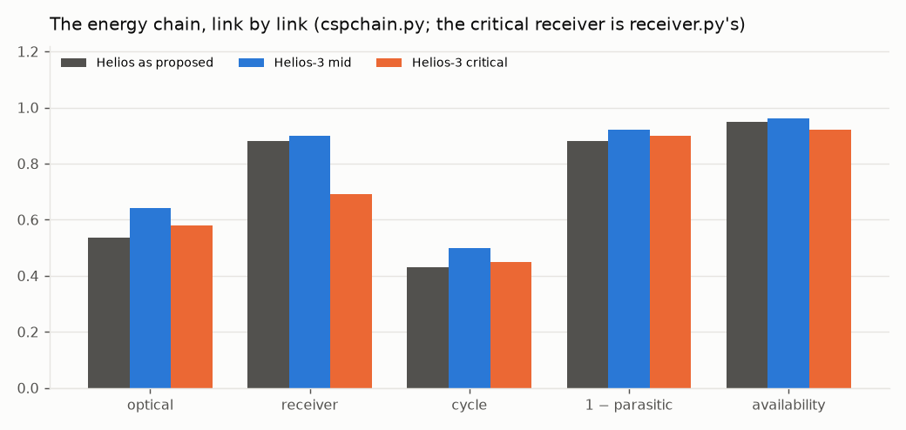

*Figure 4. The chain, link by link: the salt tower as it exists, Helios-3 at mid, Helios-3 at critical.*

## 6. The plant

Helios-3 is a Noor III-class surround heliostat field sized for the night; a multi-aperture falling-particle receiver
behind a compound quartz aperture (a hexagonal low-OH rod-lens dome on a cooled lattice frame); sintered-bauxite
particles as medium and store, in cold-shell refractory-lined silos with replaceable liners, not buried; a moving
packed-bed particle-to-sCO₂ exchanger into a 715 °C, 250 bar supercritical-CO₂ recompression Brayton block, dry-cooled
at 45 °C ambient; Inconel 740H pressure parts with Haynes 282 and Inconel 617 on the alloy ladder; photovoltaics
serving the daytime load directly and feeding electric particle heaters in winter; one cold-side particle lift per
aperture, gravity everywhere else. The cycle is sCO₂ recompression Brayton, 715 °C at 0.50 gross; the nitrate-salt fallback
on the same field is subcritical reheat steam at ~540 °C live steam from 565 °C salt at 0.43.

**The chain at both cases.** The critical receiver figure comes from the receiver model of Section 6.3, handed up the
chain rather than taken from the chain's own best: a downstream calculation hands its critical figure to the one above it.

| link | mid | critical |
|---|---|---|
| field optical efficiency, annual | 0.640 | 0.580 |
| receiver thermal efficiency | 0.900 | 0.690 |
| storage round trip | 0.995 | 0.995 |
| dispatch | 0.996 | 0.996 |
| power cycle, gross | 0.500 | 0.450 |
| 1 − parasitic share | 0.920 | 0.900 |
| availability | 0.960 | 0.920 |
| **sun to socket** | **0.252** | **0.148** |

**Sized to the requirement**, and on the adopted route of Section 8:

| | mid | critical |
|---|---|---|
| mirror aperture, M m² | 18.1 | 30.9 |
| towers, Noor III class | 14 | 24 |
| sCO₂ block, MWe | 2,620 | 2,620 |
| particle store, GWh_th (16 h) | 83.8 | 93.2 |
| PV, MW_AC | 2,894 | 3,101 |
| electric heaters, MW_th | 3,493 | 3,882 |
| energy served by PV directly / by the block, TWh | 6.3 / 11.8 | 6.3 / 11.8 |
| land at design sizing, acres | 39,762 | 56,792 |
| **on the adopted route**: mirror aperture, M m² | 22.7 | 38.6 |
| on the adopted route: towers | 18 | 31 |
| on the adopted route: sCO₂ block, MWe | 3,930 | 3,930 |
| on the adopted route: land, acres | 45,361 | 66,339 |

**Direct cost by line, $M, before contingency, EPC, tax, escalation and interest.** The field, tower, receiver and
balance-of-plant lines use the same calibrated rates as the salt tower of Section 3; the particle and sCO₂ lines
come from the Gen3 and STEP programme records [32, 56].

| line | mid | critical |
|---|---|---|
| site improvements | 373 | 636 |
| heliostat field | 2,330 | 4,768 |
| towers | 931 | 1,587 |
| receivers | 2,140 | 3,648 |
| thermal storage (particles) | 1,258 | 2,049 |
| power block (sCO2) | 2,751 | 3,275 |
| balance of plant | 977 | 1,145 |
| PV, direct + winter | 4,659 | 5,891 |
| electric heaters | 210 | 388 |
| 500 kV switchyards + gen-tie | 771 | 1,157 |
| **direct total** | **16,399** | **24,544** |

### 6.3. The receiver

A falling curtain is a per-metre machine: its power goes with its width, so scale is bought in width and in aperture
count, the loss fraction at fixed flux does not change with size, and the edge losses shrink as perimeter over area.
The receiver model runs with every banded constant at nominal and at critical; the critical flux is halved to
0.5 MW/m², below the 0.3–0.7 MW/m² at which the largest curtain was measured [18].

| | nominal (mid) | critical |
|---|---|---|
| open-aperture thermal efficiency | 0.882 | 0.690 |
| with the compound quartz dome | 0.835 | 0.592 |
| field factor handed upstream, against the chain's own receiver link | 1.02 | 1.30 |

The dome loses on the model and pays on the measured record, and both are printed. The critical open receiver, **0.690**
against the chain's 0.90, grows the field by **1.30**, and that is what the critical column carries. The ladder of
scale, from what has run to a fleet tower:

| rung | MW_th | step |
|---|---|---|
| G3P3-USA 2 MW_th falling receiver (has run) | 2 | — |
| pilot aperture, 30 MW_th (proposed) | 30 | ×15.0 |
| first module, 100 MWe | 434 | ×14.5 |
| fleet tower | 794 | ×1.8 |

The first 100 MWe module is already 0.55 of a fleet tower's duty, so a pilot aperture at about 30 MW_th belongs
before it (Section 11).

## 7. The plant hour by hour

The chain sizes the plant on annual energy. Run through 8,760 hours across the three nodes, with photovoltaics
serving the load first, the block serving the residual from the store and the heaters charging the store from
surplus PV, the plant as sized serves less than the annual chain implies. The load shape is reconstructed: residential,
evening-peaked, summer-peaked, pinned to the sourced annual; measured hourly profiles replace it as they become
available and the sizing is re-run.

| | mid | critical |
|---|---|---|
| share of the load served, as sized | 0.874 | 0.869 |
| unserved, TWh | 2.27 | 2.37 |
| hours with any shortfall | 2,309 | 2,348 |
| field defocused in summer, TWh_th | 4.82 | 5.59 |
| PV curtailed beyond the heaters, TWh | 0.06 | 0.06 |
| hours the store is full / empty | 395 / 902 | 400 / 914 |

**By month, mid** (TWh; the critical share beside the last column):

| month | load | PV direct | block net | heaters (PV in) | unserved | share unserved, mid / critical |
|---|---|---|---|---|---|---|
| Jan | 1.31 | 0.39 | 0.78 | 0.14 | 0.15 | 11.3% / 11.8% |
| Feb | 1.20 | 0.39 | 0.72 | 0.13 | 0.11 | 8.8% / 9.4% |
| Mar | 1.41 | 0.51 | 0.79 | 0.14 | 0.12 | 8.4% / 8.9% |
| Apr | 1.48 | 0.56 | 0.77 | 0.10 | 0.17 | 11.4% / 11.9% |
| May | 1.64 | 0.66 | 0.82 | 0.07 | 0.18 | 10.8% / 11.3% |
| Jun | 1.68 | 0.67 | 0.81 | 0.05 | 0.20 | 11.9% / 12.4% |
| Jul | 1.77 | 0.68 | 0.85 | 0.05 | 0.25 | 14.2% / 14.7% |
| Aug | 1.74 | 0.66 | 0.86 | 0.07 | 0.23 | 13.1% / 13.6% |
| Sep | 1.61 | 0.56 | 0.83 | 0.08 | 0.22 | 13.9% / 14.5% |
| Oct | 1.55 | 0.50 | 0.86 | 0.11 | 0.20 | 13.0% / 13.6% |
| Nov | 1.38 | 0.41 | 0.78 | 0.11 | 0.19 | 14.0% / 14.4% |
| Dec | 1.34 | 0.38 | 0.71 | 0.12 | 0.26 | 19.6% / 20.0% |

**What the annual chain cannot see.** The block is sized to the average night and a residential load peaks after
sunset, so the block cannot carry the evening in any month; the shortfall is year-round and evening-led, worst in
December at 20% (mid). Sixteen hours of store cannot move June into December: the store empties on winter
nights while a share of June's field is defocused. The heaters and PV overbuild are not the lever; the block, the
field and the water are, and Section 8 prices each.

**The Central Valley node.** Its irradiance is 0.78 of the Mojave's. Moving it to a desert site lifts the served share from
0.874 to 0.886 and December's shortfall from 19.6% to 14.5%, and does not change the closing sizing. The
node is kept for its land (Section 16), which the deserts do not offer in fallowed, private, disturbed form.

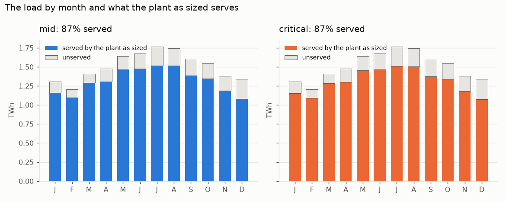

*Figure 5. The load by month and what the plant as sized serves, both cases.*

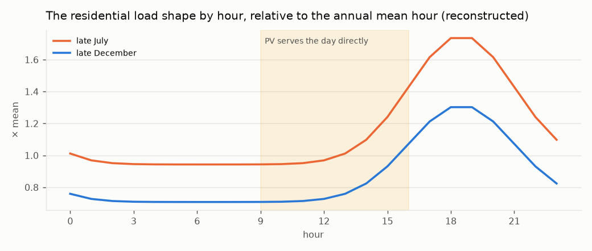

*Figure 6. The residential load shape on a late-July and a late-December day, relative to the annual mean hour; the shaded band is the day PV serves directly.*

## 8. Closing the load

**Three routes.** The *mirrors* route grows the block to ×1.25, the field to ×1.5 and the store to 2 days, the cheapest
point that closes the shortfall to 1 % with the plant alone. The *water* route lifts Title II's product to an elevated
reservoir with the summer surplus (the field the plant would otherwise defocus and the PV it would curtail) and
returns it year-round through pump-turbines to the evenings, the reservoir holding 30 / 60 days rather than a season
because the water is delivered year-round, as summer irrigation and winter recharge. The feasibility rule is that a
closing point must lift its water inside its own surplus: a lift bought from the grid is not this route. **Water alone
has no feasible point on this load**, because with the field and store at design the block that closes the evening
consumes the spill the lift runs on. **The adopted route is both**: the water returns half the shortfall and the plant
the other half, each point on a ladder over the water's share required to lift inside its own surplus.

| share of the shortfall returned by water | mid: block, field, store, MW; Title I $B; +$/MWh; left to grid | critical: the same |
|---|---|---|
| 0.00 (mirrors alone, on this scan's grid) | ×1.25, ×1.50, 2 d, 0 MW; 5.7; +42; 0.8% | ×1.50, ×1.25, 2 d, 0 MW; 9.0; +64; 0.8% |
| 0.25 | ×1.50, ×1.25, 1 d, 1,500 MW; 6.3; +45; 0.6% | ×1.50, ×1.25, 1 d, 1,500 MW; 10.0; +72; 0.7% |
| 0.50 **(adopted)** | ×1.50, ×1.25, 1 d, 1,500 MW; 6.4; +45; 0.6% | ×1.50, ×1.25, 1 d, 1,500 MW; 10.3; +74; 0.7% |
| 0.75 | ×1.50, ×1.25, 1 d, 1,500 MW; 6.5; +46; 0.6% | ×1.50, ×1.25, 1 d, 1,500 MW; 10.7; +77; 0.7% |
| 1.00 | ×1.50, ×1.25, 1 d, 1,500 MW; 6.6; +47; 0.6% | ×1.50, ×1.25, 1 d, 1,500 MW; 11.0; +79; 0.7% |

**The adopted point:**

| | mid | critical |
|---|---|---|
| block / field / store | ×1.50 / ×1.25 / 1 d | ×1.50 / ×1.25 / 1 d |
| pump-turbine plant, MW | 1,500 | 1,500 |
| Title II modules / million acre-feet a year | 15 / 0.75 | 17 / 0.83 |
| Title I capital: plant growth / water side (reservoir and pump-turbines) / total, $B | 3.9 / 2.4 / 6.4 | 5.9 / 4.4 / 10.3 |
| mirrors alone, for comparison, $B | 5.7 | 9.5 |
| both over mirrors | 1.12× | 1.09× |
| added to the price, $/MWh | +45 | +74 |
| left to the grid | 0.6% | 0.7% |
| with the water withheld | 3.6% | 4.0% |
| with the field at design | 1.3% | 1.4% |
| with neither (as sized) | 12.6% | 13.1% |
| water sized to return / dispatched in the run / lift for the sized water / surplus available, TWh | 1.14 / 0.54 / 1.40 / 3.37 | 1.19 / 0.58 / 1.64 / 3.47 |
| O&M the closing plant adds, plant / water side, $M/yr | 99 / 37 | 125 / 111 |

The two levers fail differently and each carries a real share, which is the reason for choosing both over the
cheapest point: a cheapest-point search returns the mirrors with a token water plant, and a program served by one
thing is a program with one failure mode. Two features of the table should be read carefully. The water is *sized*
to return half the shortfall as sized (1.14 TWh at mid) and the run *dispatches* 0.54, because the larger block serves the
evening first and the pump-turbines take what it leaves; the modules are sized on the shortfall, so the water plant
runs at about half its evening sizing and all of its water is delivered as irrigation and recharge regardless. That is
the conservative side for Title II and the expensive side for Title I. And the mirrors-alone figure the comparison
uses is the one fixed route above ($5.7 / 9.5 B); the ladder's own scan, which lets the block and field vary per
case, finds a cheaper mirrors-only point at critical ($9.0 B). Both are printed.

**The hydraulics.** The adopted route is priced at one head, 500 m (assumed; the Edmonston lift is 587 m and the Gianelli
head about 100 [92]), at both cases. There a cubic metre returns 1.226 / 1.158 kWh and costs
1.514 / 1.603 kWh to lift, a round trip of 0.81 / 0.72; reverse osmosis itself takes 3.0–3.6 kWh/m³ on
Title II's own account. The lift is invariant in head, being the returned energy over the round trip, so feasibility
does not depend on the site; the volume, and so the modules and Title II's capital, go as one over head. The
pump-turbine plant and reservoir carry O&M at 1.5 / 2.5 % of their capital a year (assumed band).

**Sensitivity to the two site assumptions**, the hourly run held fixed:

| case | head, m | days held | modules | MAF/yr | reservoir, $B | Title I, $B | +$/MWh | Title II, $B |
|---|---|---|---|---|---|---|---|---|
| mid | 300 | 14 | 25.1 | 1.25 | 0.15 | 6.3 | +45 | 47 |
| mid | 300 | 30 | 25.1 | 1.25 | 0.32 | 6.5 | +46 | 47 |
| mid | 300 | 60 | 25.1 | 1.25 | 0.64 | 6.8 | +48 | 47 |
| mid | 300 | 90 | 25.1 | 1.25 | 0.95 | 7.1 | +50 | 47 |
| mid | 500 | 14 | 15.0 | 0.75 | 0.09 | 6.3 | +45 | 28 |
| mid | 500 | 30 | 15.0 | 0.75 | 0.19 | 6.4 | +45 | 28 |
| mid | 500 | 60 | 15.0 | 0.75 | 0.38 | 6.6 | +47 | 28 |
| mid | 500 | 90 | 15.0 | 0.75 | 0.57 | 6.8 | +48 | 28 |
| mid | 800 | 14 | 9.4 | 0.47 | 0.06 | 6.2 | +44 | 18 |
| mid | 800 | 30 | 9.4 | 0.47 | 0.12 | 6.3 | +45 | 18 |
| mid | 800 | 60 | 9.4 | 0.47 | 0.24 | 6.4 | +46 | 18 |
| mid | 800 | 90 | 9.4 | 0.47 | 0.36 | 6.5 | +46 | 18 |
| critical | 300 | 14 | 27.7 | 1.38 | 0.26 | 9.9 | +71 | 80 |
| critical | 300 | 30 | 27.7 | 1.38 | 0.56 | 10.2 | +73 | 80 |
| critical | 300 | 60 | 27.7 | 1.38 | 1.12 | 10.8 | +77 | 80 |
| critical | 300 | 90 | 27.7 | 1.38 | 1.68 | 11.3 | +81 | 80 |
| critical | 500 | 14 | 16.6 | 0.83 | 0.16 | 9.8 | +70 | 48 |
| critical | 500 | 30 | 16.6 | 0.83 | 0.34 | 10.0 | +72 | 48 |
| critical | 500 | 60 | 16.6 | 0.83 | 0.67 | 10.3 | +74 | 48 |
| critical | 500 | 90 | 16.6 | 0.83 | 1.01 | 10.7 | +77 | 48 |
| critical | 800 | 14 | 10.4 | 0.52 | 0.10 | 9.7 | +70 | 30 |
| critical | 800 | 30 | 10.4 | 0.52 | 0.21 | 9.9 | +71 | 30 |
| critical | 800 | 60 | 10.4 | 0.52 | 0.42 | 10.1 | +72 | 30 |
| critical | 800 | 90 | 10.4 | 0.52 | 0.63 | 10.3 | +74 | 30 |

The head is the site question that sizes Title II; the days of holding move Title I by under a billion.

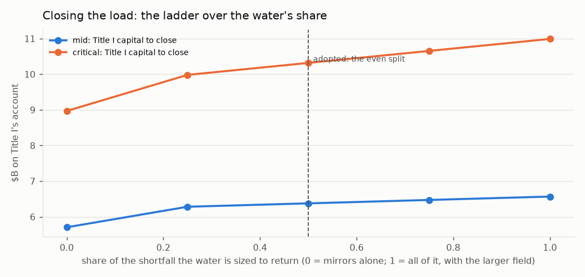

*Figure 7. The ladder over the water's share: Title I's capital to close the load at each share, both cases, every point carrying the larger field.*

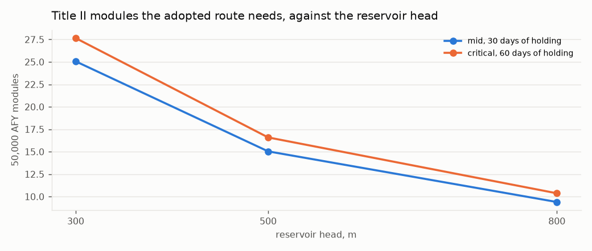

*Figure 8. Title II modules the adopted route needs against the reservoir head, at each case's days of holding.*

## 9. The risk register

A plant of a new generation carries risks a salt tower does not, and a proposal that prices the plant must price
them. Sixteen rows are graded before and after mitigation, each carried by a named part of the build, each marked
DESIGN (retired by specification), HOURS (retired only by operating time) or BENEFIT, and each with the evidence
that grades it. An HOURS row is never flattened: a specification cannot make a machine have run, and the rows so
marked are what the pilot of Section 11 and the ladder of Section 10 exist to retire.

**R-01. Particle attrition: grains break, make dust, and the medium is lost** — MODERATE → **NEGLIGIBLE**, DESIGN.

- *Mitigation:* Particle geometry: spherical sintered bauxite (roundness ~0.9), tight size cut. SYSTEM geometry: short drops, few transfer points, particles land on particles (rock-box liners, dead beds), mass-flow hoppers, gravity flow everywhere but the one cold lift. Enclosed conveyance; makeup in O&M; dust to baghouse. Fallback noted: a fixed ceramic bed with air as the moving fluid (Julich class) wears nothing and is a different plant
- *Carried by:* particle specification; plant arrangement (drops, transfer points, liners, hopper flow); conveyance; O&M makeup line
- *Evidence:* SOURCED: after ~200 h on-sun in Sandia's 1 MW_t receiver, used-particle absorptance 0.946 vs 0.945 unused -- durability shown at hours scale, not decades; residual is HOURS
- *Priced:* $126 M at mid, $205 M at critical

**R-02. Receiver wind and convective loss: a falling curtain is open to the air** — MAJOR → **MODERATE**, HOURS.

- *Mitigation:* Compound quartz aperture: a dome lattice of long hexagonal-section low-OH fused-quartz rod lenses, each a two-surface thick lens placing its focus in the receiver, the dome acting as secondary concentrator and flux homogeniser aimed jointly with the field; hot face at cavity temperature, cold end in a cooled frame; single-element replacement. Aperture cooling loop: hollow hex webs carry a closed water or oil loop (latitude rings as headers, meridian webs as tubes); mushroom-head rods so entry faces tile 100 % and the webs run beneath, unshadowed; the loop touches the rods at the cold ends only and returns the rod leak and absorbed light to the sCO2 cycle after the main compressor, or to the winter heaters. Multi-aperture receivers on smaller towers
- *Carried by:* receiver specification; aperture element specification; aperture cooling loop (frame manifold, preheat tie-in); tower count
- *Evidence:* SOURCED: windowed receiver +11.9 % efficiency over aerowindow; quartz half-shell transmissivity 0.97 / 0.94; fused silica k 1.38 W/m K, CTE 0.55 ppm/K, devitrification above ~1,100 C. Rod length is cheap in light (low-OH quartz ~1.3 % from 1 to 30 cm) and buys a gentler gradient; what it cannot move is the hot-face temperature. No windowed receiver has run at commercial scale -- residual is HOURS
- *Priced:* $321 M at mid, $547 M at critical

**R-03. Particle-to-sCO2 heat exchanger: 800 C particles against 250 bar CO2** — MAJOR → **MODERATE**, HOURS.

- *Mitigation:* Moving packed-bed exchanger (Sandia / Solex / VPE lineage), low particle velocity for erosion, modular N+1 units so one can be out. Fluid decision: CO2 stays -- every efficient cycle at this temperature is a high-pressure cycle (steam 170-300 bar, CO2 250), and the low-pressure gases (helium, air) need a hotter source than a particle receiver makes; the fill may be a CO2 blend (SCARABEUS class) for the hot-ambient dry-cooling case, same machinery and pressure, decided later
- *Carried by:* power block; spares policy; working-fluid fill
- *Evidence:* SOURCED: prototype 4-6x any known particle/sCO2 exchanger, tested to 500 C at 17 MPa, U ~300-400 W/m2K; design point is 800 C / 25 MPa -- the gap is HOURS at the design point
- *Priced:* $275 M at mid, $328 M at critical

**R-04. sCO2 turbomachinery at 715 C and 250 bar** — MAJOR → **MODERATE**, HOURS.

- *Mitigation:* Inconel 740H for the hot path; many small units (10-50 MWe) rather than few large, so a unit is a spare; STEP's recompression configuration. Materials margin: pressure boundary 740H (rated 825 C, operating 715, margin 110 C), Haynes 282 alternate; rotor in single-crystal aero superalloy running ~300 C below its design point; no ceramic or refractory metal in the CO2 path. Residual is carburisation at 100,000 h, which temperature margin does not buy
- *Carried by:* power block specification; unit sizing; materials specification (boundary and rotor)
- *Evidence:* SOURCED: 740H is ASME-qualified 650-825 C, the only age-hardened superalloy approved for welded creep-limited pressure parts; STEP's RCBC at 715 C / 250 bar is its next phase, 16 MW turbine under 100 kg -- residual is HOURS
- *Priced:* $220 M at mid, $262 M at critical

**R-05. CO2 inventory release: heavier than air, 4 % is IDLH, cold on release** — MODERATE → **MINOR**, DESIGN.

- *Mitigation:* Open-air or forced-ventilated turbine yards; no occupied low ground; CO2 sensors and dump tanks; inventory held per module, not per plant
- *Carried by:* site layout; safety systems
- *Evidence:* SOURCED: hazard characterised in the CCUS literature; a power loop's inventory is tens of tonnes per module against tens of thousands in a CCUS pipeline; standard pressure-plant practice
- *Priced:* $55 M at mid, $66 M at critical

**R-06. High-pressure, high-temperature containment (250 bar / 715 C)** — MODERATE → **MINOR**, DESIGN.

- *Mitigation:* 740H piping and headers under ASME Section I/VIII; design by code, not novelty. Alloy ladder: 740H primary; Haynes 282 second source; Inconel 617 fallback for the hottest headers under its Section III Division 5 case to 950 C at about twice the wall. Single-crystal and ODS alloys excluded from pressure parts: neither can be made as welded pipe
- *Carried by:* pressure-part specification; alloy ladder
- *Evidence:* SOURCED: 740H is the code-approved material for exactly this duty; 617 carries the Division 5 case to 950 C at roughly half 740H's allowable stress at 715 C
- *Priced:* $83 M at mid, $98 M at critical

**R-07. Silo heat loss and thermal ratcheting at 800 C over forty years** — MODERATE → **MINOR**, DESIGN.

- *Mitigation:* Refractory-lined silos with expansion allowance; large silos, because loss goes as surface over volume. Cold-shell design: lining thick enough that the steel shell stays below ~100 C, unbonded lining with expansion joints so it walks without cracking, replaceable inner liner so liner life is a maintenance item and not a forty-year bet; earth berm and a cold-silo pit at the tower base for seismic and wind. Hot silos are NOT buried: earth conducts ten times worse than the lining, burial breaks the gravity chain of R-01, and 800 C against wet ground is a steam event
- *Carried by:* storage specification; liner replacement in O&M; site civil (berm, pit)
- *Evidence:* SOURCED: rock, sand and bauxite operate to >1000 C; loss falls with silo size; hot-blast stoves and cement preheaters run refractory linings for decades of daily cycling. Forty-year life of ONE liner would be HOURS; a replaceable liner makes it O&M, which is why the row stays DESIGN
- *Priced:* $101 M at mid, $164 M at critical

**R-08. Particle chemistry: bauxite oxides transform in air at 700-1000 C** — MODERATE → **MODERATE**, HOURS.

- *Mitigation:* Periodic reduction to rejuvenate absorptance; makeup; inert or lean atmosphere in the hot silo
- *Carried by:* O&M rejuvenation line; silo atmosphere
- *Evidence:* SOURCED: XRD shows transformations in sintered bauxite after heating in air; absorptance can be restored by reduction -- rate over decades unknown

**R-09. Particle lift: erosion and temperature on the elevator** — MODERATE → **MINOR**, DESIGN.

- *Mitigation:* Lift COLD particles only; everything after the receiver is gravity-driven, so the lift never sees 800 C
- *Carried by:* plant arrangement
- *Evidence:* SOURCED: G3P3's own architecture -- skip hoist to the receiver top, free-fall through receiver, storage and exchanger

**R-10. Dust as PM10 in non-attainment counties** — MODERATE → **MINOR**, DESIGN.

- *Mitigation:* Negative-pressure enclosed handling with baghouse; no open transfer points
- *Carried by:* conveyance; air permit
- *Evidence:* Kern, Imperial, San Bernardino are PM10 non-attainment; enclosed bulk handling is ordinary practice
- *Priced:* $38 M at mid, $61 M at critical

**R-11. Receiver scale: no particle receiver has run above ~2.5 MW_t** — DOMINANT → **MAJOR**, HOURS.

- *Mitigation:* Multi-aperture receivers; more, smaller towers; a first module built and run before the fleet. Modelled: the receiver model is the first -- the curtain is a per-metre machine, so scale is bought in width and aperture count; the loss fraction at fixed flux does not change with size and the edge losses shrink as perimeter/area; and the 100 MWe module is already 0.55 of a fleet tower, so a pilot aperture at fleet-aperture size (~30 MW_th, a 10 m curtain) goes between, and every fleet aperture is a copy of it
- *Carried by:* tower count; programme staging (pilot aperture before the module); the receiver model
- *Evidence:* SOURCED: G3P3-USA falling receiver 2 MW_th (>250 h, 80-90 % measured, 2024); DLR CentRec centrifugal 2.5 MW_th (965 C, 2018); Helios-3 needs ~800 MW_th per tower. Design can split the receiver; only hours can prove it

**R-12. Provenance: no plant of this kind exists at any commercial scale** — DOMINANT → **MAJOR**, HOURS.

- *Mitigation:* Stage: build the common field, towers and PV for Helios-2 OR Helios-3; build one Helios-3 module first; convert modules as hours accumulate. Ladder: common field, towers and PV; a ~30 MW_th pilot aperture on one tower; the 100 MWe module as copies of the pilot; the fleet as copies of the module; each rung passed at its critical figure and handed up the chain before the next is ordered. Provenance is LISTED rather than asserted: the study register holds every technology in the system, every study covering it (a floor, sourced), the further study recommended per rung, and the cost of delay at the construction escalation rate. Salt block as fallback
- *Carried by:* programme staging (ladder); the study register (provenance register, recommendations, delay cost)
- *Evidence:* This row cannot be mitigated by a specification. What is upfront is the PLAN that buys the hours, and the LIST of what has and has not run

**R-13. No freezing point: no heat tracing, no drain-down, no hot-tank failure** — BENEFIT → **BENEFIT**, BENEFIT.

- *Mitigation:* -
- *Carried by:* -
- *Evidence:* SOURCED (reviewed 2026): Crescent Dunes has had FOUR hot-salt tank leaks (October 2016, March 2019, February 2022, February 2023), its hot tank is now derated from ~565 C to 455-480 C and its output constrained to ~55 MW, half of design, on the operator's own 2026 court record; Noor III's hot tank leaked in March 2024, the plant was offline 14 months, and it leaked again on return. Two of the three largest salt towers built have lost more than a year each to the hot tank. A silo of sand at ambient is a silo of sand -- and the salt-block FALLBACK carries this failure mode

**R-14. No decomposition ceiling: stable past 1000 C** — BENEFIT → **BENEFIT**, BENEFIT.

- *Mitigation:* -
- *Carried by:* -
- *Evidence:* nitrate decomposes above ~600 C; this is the link that buys the cycle

**R-15. No oxidiser and no toxic medium: this work's hazard rule, met cleanly** — BENEFIT → **BENEFIT**, BENEFIT.

- *Mitigation:* -
- *Carried by:* -
- *Evidence:* nitrate is NFPA OX; bauxite and sand are inert

**R-16. Dry cooling at a sixth of the airflow** — BENEFIT → **BENEFIT**, BENEFIT.

- *Mitigation:* -
- *Carried by:* -
- *Evidence:* SOURCED: sCO2 cooling profiles are near-parallel; steam needs ~6x the air

Before mitigation: 4 BENEFIT, 7 MODERATE, 3 MAJOR, 2 DOMINANT. After: 4 BENEFIT, 1 NEGLIGIBLE, 5 MINOR, 4 MODERATE, 2 MAJOR.

**The risk register, priced**, from the direct lines to the net capital:

| $M | mid | critical |
|---|---|---|
| direct plant lines (Section 6) | 16,399 | 24,544 |
| mitigation adders, direct | 1,218 | 1,731 |
| contingency (15 / 30 %), EPC and owner's cost (13 / 15 %), sales tax on those | 6,060 | 13,505 |
| studies and surveys (Section 12), with contingency | 245 | 602 |
| first-module premium (1.5× / 2.0× on its share of the thermal block) | 135 | 403 |
| overnight, groundbreaking dollars | 24,057 | 40,786 |
| escalation to the build and interest during construction (4 years at the bond rate) | 9,749 | 16,528 |
| gross capital | 33,806 | 57,314 |
| federal storage credit, direct pay | -1,130 | -1,871 |
| **net capital with the register** | **32,677** | **55,443** |
| O&M with particle makeup (1 / 2 %/yr) and rejuvenation, $M/yr | 434 | 555 |
| price with the register, $/MWh | 126 | 205 |

## 10. Provenance: the studies behind every technology

No plant of this kind exists at commercial scale, so the provenance of each technology must be listed rather than
asserted. The register below holds 49 rows over the 12 technologies the design uses, each with a status from a
closed set — OPERATED (a plant has run at the stated scale), TESTED (a prototype has run, below plant scale),
DESIGNED (a published design or code case; nothing has run), or this work's own analysis — and each with its
sources in the bibliography. The register is complete over technologies and a floor over studies: a technology may
have more studies than are listed, never fewer.

### 10.1. Heliostat field, Noor III class, surround, night-sized

*What the design needs:* ~31 M m2 critical / 18 M m2 mid across 3 nodes at design; 14-24 towers.

| study or plant | scale | year | status | what it settled | sources |
|---|---|---|---|---|---|
| Gemasolar (Torresol), Fuentes de Andalucia | 19.9 MWe, 15 h salt storage | 2011 | OPERATED | first commercial salt tower; 24 h operation demonstrated; CF ~0.73 of design | [1], [2] |
| Crescent Dunes (SolarReserve to 2020; ACS/Cobra from 2020; sold in Chapter 11, 2026), Nevada | 110 MWe, 10 h salt, 1.2 M m2 | 2015 | OPERATED | US utility-scale salt tower; four hot-salt tank leaks (October 2016, March 2019, February 2022, February 2023); after a 2023 root-cause analysis the hot tank runs at 455-480 C (850-900 F) instead of ~565 C and output is constrained to ~55 MW, half of design; 196 GWh in 2018, its best full year, 0.39 of the 500 GWh design; NV Energy's 25-year PPA at ~$135/MWh terminated October 2019; short-term and month-to-month offtake since late 2020; a second Chapter 11 filed January 2026 and the plant sold for $7 M in March 2026 | [3], [4], [5], [6] |
| Noor III (ACWA/SENER), Ouarzazate | 150 MWe, 7.5 h salt, 1.3 M m2, 178 m2 heliostats | 2018 | OPERATED | the heliostat class the design carries; HOT-SALT TANK leak March 2024, offline 14 months (~$47 M loss), leaked again after the April 2025 restart | [7], [8], [9] |
| Cerro Dominador (EIG), Atacama | 110 MWe tower + 100 MWe PV, 17.5 h salt | 2021 | OPERATED | CSP + PV hybrid at one site; $10.45/W built cost | [10], [11] |
| DEWA Phase IV (ACWA/Shanghai Electric), Dubai | 100 MWe tower + 600 MWe trough + 250 MWe PV | 2023 | OPERATED | night-sized thermal block beside daytime PV -- the Helios-2/3 architecture | [11], [12], [13] |
| Chinese tower fleet: Shouhang Dunhuang 100 MWe, Supcon Delingha 50 MWe, Luneng Haixi 50 MWe | 50-100 MWe each | 2018 | OPERATED | salt towers at 100 MWe with small heliostats; multiple operators | [11], [14] |
| NREL HelioCon heliostat consortium | cost and performance roadmap | 2022 | DESIGNED | heliostat cost targets and failure modes; the $80-120/m2 band | [15] |
| Ivanpah (BrightSource), California | 392 MWe direct steam, 3 towers | 2014 | OPERATED | California desert siting, permitting, avian and dust record; no storage; contracts ending | [16], [17] |

*Further study recommended, on the field rung (1.0 years):* Field commissioning at the first node with measured annual optical efficiency against the 0.58-0.64 band. *It settles:* the largest chain link after the receiver; sets the mirror count at critical.

### 10.2. Falling-particle cavity receiver, multi-aperture

*What the design needs:* ~800 MW_th per tower; 30 MW_th per aperture, 26 apertures.

| study or plant | scale | year | status | what it settled | sources |
|---|---|---|---|---|---|
| Sandia NSTTF 1 MW_th falling-particle receiver | 1 MW_th, ~1 m2 aperture, chevron mesh option | 2015 | TESTED | outlet >700 C; efficiency 50-80 % (60-70 % free-fall, ~80 % obstructed); 50-200 C per metre of drop at 1-7 kg/s per m and average irradiance to ~0.7 MW/m2; the fixture in the receiver model | [18], [19], [20] |
| G3P3-USA receiver, Sandia NSTTF | 2 MW_th, >250 h on-sun and ground | 2024 | TESTED | double the 1 MW_th unit; multistage release, reduced-volume cavity, automated flow control; 80-90 % efficiency in test campaigns -- the largest falling curtain that has run | [21], [22] |
| G3P3 Gen3 Particle Pilot Plant, integrated system, Sandia | 1 MW_th receiver + HX, 6 h storage, >700 C working fluid | 2025 | TESTED | receiver + silos + lift + heat exchanger as one system; particle loop assembled Dec 2024, commissioning from Jan 2025, on-sun from summer 2025; goal >2,000 h combined with G3P3-Saudi -- hours as published | [23], [24], [25] |
| DLR CentRec centrifugal particle receiver, Julich | 2.5 MW_th prototype | 2018 | TESTED | rotating-drum alternative to a falling curtain; 965 C average outlet on sun; commercialised by HelioHeat -- the largest particle receiver of any type that has run | [26], [27], [28] |
| CSIRO / ASTRI falling-particle receiver, Newcastle | ~1 MW-class system, 400-mirror field | 2023 | TESTED | second falling-particle receiver on sun, independent of Sandia; 803 C reached; spun off as FPR Energy | [29], [30] |
| King Saud University / Sandia multi-stage receiver, Riyadh | sub-MW | 2018 | TESTED | multi-stage (staggered) curtain to raise residence time | [31] |
| Sandia Gen3 100 MWe particle plant design study | 100 MWe, multi-aperture | 2019 | DESIGNED | the multi-aperture layout and the $/kWe the design carries | [32] |
| the receiver model (this work) | scaling law, critical case | 2026 | THIS WORK | curtain as a per-metre machine; loss fraction size-invariant; pilot aperture rung | this work |

*Further study recommended, on the pilot rung (2.0 years):* A ~30 MW_th pilot aperture on one fleet tower: curtain fed uniformly across 60 m (critical) / 10 m (nominal); efficiency, edge loss vs aperture size, wind. *It settles:* the receiver model's threshold: 0.690 critical open; whether the edge losses fall as perimeter/area.

### 10.3. Compound quartz aperture: hex rod-lens dome with cooled lattice frame

*What the design needs:* one dome per aperture, hot face at cavity temperature.

| study or plant | scale | year | status | what it settled | sources |
|---|---|---|---|---|---|
| DLR REFOS / SOLGATE pressurised volumetric receivers, PSA | 250-400 kW_th, quartz window | 2003 | TESTED | domed quartz windows on cavity receivers at 800-1000 C air; window cooling and failure modes | [33], [34] |
| Sandia windowed falling-particle receiver study | modelled, 1 MW_th class | 2016 | DESIGNED | +11.9 % efficiency over an aerowindow; quartz half-shell transmissivity 0.97/0.94 | [35] |
| This work's compound quartz aperture | hex rod-lens dome, cooled lattice | 2026 | THIS WORK | no study exists; the receiver model prices it against the open aperture | this work |

*Further study recommended, on the pilot rung (1.0 years):* The compound quartz aperture on the pilot: one dome, open aperture beside it, both measured on one tower. *It settles:* whether the dome pays on the measured record as the receiver model says, or loses as the model says.

### 10.4. Sintered bauxite particles as medium and store

*What the design needs:* hundreds of kt inventory, 600-800 C, forty years.

| study or plant | scale | year | status | what it settled | sources |
|---|---|---|---|---|---|
| Sandia particle durability and optical studies (CARBO Accucast ID50, ~280 um) | lab + 1 MW_th on-sun | 2014 | TESTED | packed-bed absorptance 0.946 after ~200 h on-sun, statistically the same as 0.945 unused; 11 of 140 formulations held >0.90 after 500 h in air at 700 C; sintered bauxite chosen for absorptance, abrasion and sintering resistance and reducibility; oxide transformations on heating in air (R-08) | [36], [37], [38] |
| CARBO Ceramics proppant production | industrial, Mt/yr | 2000 | OPERATED | the medium is a commodity with a supply chain | [39] |

*Further study recommended, on the pilot rung (3.0 years):* Long-duration particle ageing on the pilot: absorptance, attrition and oxide state sampled quarterly. *It settles:* R-08's rate over decades, the UNMOVED row; R-01's makeup rate.

### 10.5. Cold-shell refractory-lined particle silos, replaceable liner

*What the design needs:* 84 GWh_th mid; 800 C hot silo; daily cycling.

| study or plant | scale | year | status | what it settled | sources |
|---|---|---|---|---|---|
| G3P3 hot and cold particle bins | 6 h at ~1 MW_th, refractory-lined | 2024 | TESTED | 800 C particle storage in a lined steel bin | [40] |
| Sandia / Bridgers & Paxton commercial-scale particle silo design | 100 MWe-class, 6-12 h | 2020 | DESIGNED | cold-shell lined silo design and cost; thermal ratcheting analysis | [41] |
| Siemens Gamesa ETES rock-bed thermal store, Hamburg | 130 MWh_th, 750 C, electrically charged | 2019 | OPERATED | a hot solid store at scale, charged by resistance heaters -- the winter heater path | [42] |
| Hot-blast stoves and cement preheaters (industrial precedent) | decades, daily cycling, >1,000 C | 1900 | OPERATED | refractory linings cycling daily for decades; replaceable liners as O&M | [43] |

*Further study recommended, on the pilot rung (3.0 years):* One full-size cold-shell silo on the pilot, cycled daily, liner inspected annually. *It settles:* thermal ratcheting and liner life as O&M.

### 10.6. Cold-side particle lift (skip hoist / bucket elevator)

*What the design needs:* ~150 kg/s per aperture, ambient temperature.

| study or plant | scale | year | status | what it settled | sources |
|---|---|---|---|---|---|
| G3P3 skip hoist / bucket elevator | ~1 MW_th class, cold side | 2024 | TESTED | cold particle lift to receiver top | [40] |
| Mining skip hoists and bulk-solids bucket elevators | thousands of t/h, ambient | 1950 | OPERATED | cold abrasive bulk lift is an industry, not a development | [44] |

*Further study recommended, on the pilot rung (0.0 years):* None beyond the pilot's own lift: cold abrasive lift is an industry. *It settles:* nothing open.

### 10.7. Moving packed-bed particle-to-sCO2 heat exchanger

*What the design needs:* 800 C particles against 250 bar CO2, 2,620 MWe fleet.

| study or plant | scale | year | status | what it settled | sources |
|---|---|---|---|---|---|
| Sandia / Solex / VPE moving packed-bed particle-to-sCO2 exchanger | 100 kW_th shell-and-plate prototype | 2020 | TESTED | ground tests with a 150 kW electric particle preheater to 500 C; overall U approaching 400 W/m2 K; 4-6x any other known particle/sCO2 exchanger; design point 800 C / 25 MPa untested | [45], [46] |
| G3P3 integrated particle-to-sCO2 exchanger | ~1 MW_th | 2024 | TESTED | exchanger in the loop with receiver and storage | [40] |
| NREL fluidised-bed particle heat exchanger (Ma et al.) | lab / design | 2017 | DESIGNED | the fluidised-bed alternative; particle-side heat transfer coefficients | [47] |

*Further study recommended, on the pilot rung (2.0 years):* A particle-to-sCO2 exchanger module at its design point, 800 C / 25 MPa, on the pilot. *It settles:* R-03: the 4-6x scale-up and the design-point pressure-temperature pair.

### 10.8. sCO2 recompression Brayton power block, 715 C / 250 bar, dry-cooled

*What the design needs:* 10-50 MWe units, 2,620 MWe fleet, 45 C ambient.

| study or plant | scale | year | status | what it settled | sources |
|---|---|---|---|---|---|
| STEP Demo (GTI / SwRI / GE), San Antonio | 10 MWe plant; 4 MWe grid-synchronised in simple recuperated cycle | 2024 | TESTED | first electricity May 2024; maximum simple-cycle power 4 MWe Sept 2024 at ~500 C (Phase 1 complete); Phase 2 reconfigures to recompression at 715 C from 2025 -- the 50 % RCBC has NOT yet run | [48], [49], [50] |
| Sandia sCO2 recompression Brayton test loop | ~1 MWe class | 2012 | TESTED | recompression cycle operated; compressor near the critical point | [51] |
| Echogen EPS100 | 8 MWe sCO2 waste-heat | 2014 | TESTED | a commercial sCO2 turbine-generator at MW scale (simple recuperated, ~300 C) | [52] |
| China Huaneng / XTPRI 5 MWe sCO2 unit, Xi'an | 5 MWe, fossil-fired | 2021 | TESTED | put into service Dec 2021 after a 72 h trial; a 50 MWe demonstration planned -- second MW-class sCO2 unit, independent of the US programme | [53], [54] |
| SCARABEUS CO2-blend cycle project (EU) | lab loops + design | 2019 | DESIGNED | CO2 + dopant blends to raise the critical point for hot-ambient dry cooling (R-03 note) | [55] |
| NETL / SunShot sCO2 CSP system studies | design + TEA | 2015 | DESIGNED | sCO2 RCBC at ~50 % for 700 C CSP; the cycle value the chain carries | [56], [57] |

*Further study recommended, on the module rung (3.0 years):* STEP's 715 C recompression phase, then one 10-50 MWe unit on the first module. *It settles:* R-04: turbine, seals and bearings at 715 C; carburisation on the real loop.

### 10.9. Inconel 740H / Haynes 282 / Inconel 617 pressure parts

*What the design needs:* 715 C / 250 bar, 100,000 h, CO2 carburisation.

| study or plant | scale | year | status | what it settled | sources |
|---|---|---|---|---|---|
| ASME Code Case 2702, Inconel 740H | 650-825 C pressure parts | 2011 | DESIGNED | the only age-hardened superalloy approved for welded creep-limited pressure parts | [58] |
| US DOE / EPRI A-USC ComTest programme | 700 C steam components, full scale | 2015 | TESTED | 740H headers, piping and valves fabricated and tested for 760 C steam | [59], [60] |
| ASME Code Case 3024, Haynes 282 | pressure parts, same class | 2021 | DESIGNED | the second source; base, cross-weld and all-weld qualification for superheaters, reheaters and steam pipe | [61], [62] |
| ASME Section III Division 5, Inconel 617 | to 950 C, nuclear high-temperature | 2019 | DESIGNED | the fallback with the deepest temperature margin | [63] |
| sCO2 corrosion / carburisation testing of Ni alloys | coupons, 700-750 C, 20-25 MPa, to ~10,000 h | 2016 | TESTED | carburisation slow but present; 100,000 h is extrapolated -- the residual in R-04 | [64] |

*Further study recommended, on the pilot rung (3.0 years):* Coupon and component exposure in the pilot's CO2 loop to the longest hours the schedule allows. *It settles:* R-04/R-06 residual: carburisation at 100,000 h, by extrapolation from the longest real exposure.

### 10.10. PV direct daytime supply with PV-fed electric heaters for winter

*What the design needs:* 2.9 GW_AC PV, 3.5 GW_th heaters.

| study or plant | scale | year | status | what it settled | sources |
|---|---|---|---|---|---|
| Noor Midelt I (EDF/Masdar/Green of Africa), Morocco | 800 MW CSP + PV hybrid, PV-charged salt storage via electric heaters | 2019 | DESIGNED | the first plant designed to heat thermal storage from PV -- PPA 2019, construction NOT started as of 2025; Midelt II and III re-awarded in 2024 as PV + batteries | [65], [66], [67] |
| California utility PV fleet | >20 GW installed, Mojave single-axis | 2020 | OPERATED | the PV capacity factor band the chain carries | [68] |
| Electric resistance heaters for high-temperature stores | MW-class, 750 C (ETES); salt heaters commercial | 2019 | OPERATED | resistance heating of a hot solid store at MW scale | [69], [70], [71] |

*Further study recommended, on the pilot rung (0.5 years):* A PV-fed electric particle heater at MW scale on the pilot's cold-to-hot path (Midelt I, the only plant designed for PV-to-storage, has not been built). *It settles:* heater efficiency and control on particles rather than salt; winter dispatch is measured by the hourly model's hourly run.

### 10.11. Dry (air-cooled) heat rejection for sCO2

*What the design needs:* zero water, 45 C ambient.

| study or plant | scale | year | status | what it settled | sources |
|---|---|---|---|---|---|
| Air-cooled condensers at CSP plants (Ivanpah, Cerro Dominador, Noor III) | 100-400 MWe | 2014 | OPERATED | dry cooling in desert CSP is standard | [72] |
| sCO2 dry-cooling studies (Sandia / NREL) | design | 2016 | DESIGNED | sCO2 needs ~1/6 the cooling airflow of steam; hot-ambient compressor-inlet penalty | [73] |

*Further study recommended, on the module rung (1.0 years):* Compressor-inlet performance at 45 C on the first module's dry cooler. *It settles:* the cycle's 0.45-0.50 critical band; whether a CO2 blend is needed (R-03 note).

### 10.12. Hybrid CSP + PV, thermal block sized for the night

*What the design needs:* 18.1 TWh/yr firm to 3 M households.

| study or plant | scale | year | status | what it settled | sources |
|---|---|---|---|---|---|
| DEWA Phase IV hybrid | CSP night + PV day, one site | 2023 | OPERATED | the architecture at 950 MW total | [74] |
| Cerro Dominador hybrid | 110 MWe tower + 100 MWe PV | 2021 | OPERATED | CSP + PV hybrid dispatch record | [10] |
| the chain model / the hourly model (this work) | hourly model, mid and critical | 2026 | THIS WORK | night-sized field; PV direct; winter heaters; the critical case | this work |

*Further study, on the first rung:* the plant run hour by hour at both cases (Section 7), which found the shortfall year-round
and evening-led and set the closing routes of Section 8.

**The critical path of study is 7.5 years**, run against the build rather than before it, the studies within a rung in
parallel. Delay escalates the whole plant at 3 % a year (assumed band 2–4 %) before a dollar is spent:

| per year of delay | mid | critical |
|---|---|---|
| capital, $B | 0.98 | 1.66 |
| price, $/MWh | 3.8 | 6.1 |
| household, $/yr | 23 | 37 |

## 11. The pilot receiver: an acceptance protocol

The receiver's real efficiency is the one open item no calculation can close, and a test graded after it runs is not
a test. The unit, the measurements and the pass mark are therefore fixed here, before the pilot is built.

| the unit | nominal (mid) | critical |
|---|---|---|
| one aperture carrying 30 MW_th: curtain width, m | 10.0 | 60.0 |
| aperture area, m² | 30.0 | 60.0 |
| drop per stage, m | 3.0 | 1.0 |
| particle mass flow, kg/s | 125 | 150 |
| aperture-average flux, MW/m² / ambient, °C | 1.0 / 25 | 0.5 / 45 |

**Five measurements:**

- **M1 thermal efficiency.** particle mass flow (weigh-cell), inlet and outlet temperature, incident flux by calibrated heliostat field and flux gauge; eta = m cp dT / (q A). *Condition:* critical conditions: 0.5 MW/m2 aperture-average, 45 C ambient, 800 C outlet, hot back wall.
- **M2 edge losses.** M1 repeated at half and full curtain width on the same aperture. *Condition:* loss per m2 must fall from half to full width as perimeter/area.
- **M3 dome against open.** one compound quartz dome (R-02) beside an open aperture on one tower, M1 on both. *Condition:* whether the dome pays on the record or loses on the model; both are printed by the receiver model.
- **M4 particle ageing.** absorptance, attrition and oxide state sampled quarterly from the pilot's own inventory. *Condition:* R-01 makeup rate and R-08's rate, the UNMOVED row.
- **M5 wind.** M1 across the site wind envelope, curtain stability by camera. *Condition:* the graded figure must hold across the envelope, not at calm.

**The pass mark**, the thermal efficiency at critical conditions averaged over the last 500 of 1000 on-sun hours, with
a calorimetric uncertainty of **3.3 %** in quadrature (mass flow 1 %, temperatures 1 %, flux 3 %):

| grade | measured efficiency | what follows |
|---|---|---|
| PASS-CHAIN | ≥ 0.930 | the chain's own link is witnessed; the mid case is witnessed too |
| PASS-DESIGN | ≥ 0.713 | the critical design basis holds; the first module is ordered |
| UNDECIDED | 0.667 – 0.713 | not a pass and not a fail; the pilot runs on |
| FAIL | < 0.667 | the salt-block fallback is the recorded route; the first module is not ordered |

**What each result does upstream**, priced against each case's own receiver link, so that a pass at the design basis
costs the critical design nothing:

| measured | grade | field factor, mid / critical | price, mid / critical, $/MWh |
|---|---|---|---|
| 0.600 | FAIL | 1.50 / 1.15 | +21 / +11 |
| 0.667 | FAIL | 1.35 / 1.03 | +15 / +3 |
| 0.690 | UNDECIDED | 1.30 / 1.00 | +13 / +0 |
| 0.713 | UNDECIDED | 1.26 / 0.97 | +11 / -2 |
| 0.800 | PASS-DESIGN | 1.12 / 0.86 | +5 / -10 |
| 0.900 | PASS-DESIGN | 1.00 / 0.77 | +0 / -18 |
| 0.930 | PASS-CHAIN | 0.97 / 0.74 | -1 / -19 |

Scheduled 2031–2033 (mid) / 2033–2035 (critical) at $159 / 246 M including the ladder's technology
studies. The protocol's constants are assumed and marked; the pass mark is not.

## 12. Studies and surveys first

Every study and survey is its own line item, first in priority and first in the capital. The costs are bands from
the class of study rather than quotes, and are marked as such; they are carried ahead of every plant line, with
contingency and without EPC margin or sales tax.

**Title I.** Gating studies must finish before the field is built; the technology studies run on the ladder against the build.

| id | study or survey | what it settles | scope | mid: $M each × n = total, years | critical: the same |
|---|---|---|---|---|---|
| dni | one year of on-site DNI at each node (class-A pyrheliometer station) | the node's field size; the measured-profile ingestion's replacement of the reconstructed series | node, GATE | 0.1 × 3 = 0.4, 1.0 | 0.3 × 3 = 0.9, 1.5 |
| load | measured residential load profile for the served territory (CAISO / CCA metered data) | the evening block factor; the measured-profile ingestion's load series | program, GATE | 0.5 × 1 = 0.5, 0.5 | 1.0 × 1 = 1.0, 1.0 |
| title | title search, land survey and fallowing agreements | the site screening's land term | node, GATE | 3.0 × 3 = 9.0, 1.0 | 6.0 × 3 = 18.0, 2.0 |
| geotech | geotechnical investigation and ASCE 7 site-specific seismic hazard (mapped MCE_R) | the impact analysis's seismic margin; the tower foundation | node, GATE | 2.0 × 3 = 6.0, 1.0 | 4.0 × 3 = 12.0, 1.5 |
| bio | biological and cultural resource surveys (protocol-level, two seasons) | CEQA / NEPA baseline; desert tortoise and cultural sites | node, GATE | 3.0 × 3 = 9.0, 1.5 | 8.0 × 3 = 24.0, 2.0 |
| ceqa | CEQA environmental impact report per node | the state permit; the impact analysis | node, GATE | 15.0 × 3 = 45.0, 2.0 | 30.0 × 3 = 90.0, 3.0 |
| nepa | NEPA environmental impact statement on the Mojave node (BLM nexus) | the impact analysis: 2 / 4 years | mojave, GATE | 15.0 × 1 = 15.0, 2.0 | 30.0 × 1 = 30.0, 4.0 |
| grid | CAISO interconnection cluster study per node (deposits refundable, excluded) | the Title I analysis's gen-tie | node, GATE | 2.0 × 3 = 6.0, 2.0 | 4.0 × 3 = 12.0, 3.0 |
| reservoir | reservoir siting, head survey and geotechnical study for the water route | the closing-route analysis's head: the site question that sizes Title II | program, GATE | 15.0 × 1 = 15.0, 2.0 | 40.0 × 1 = 40.0, 3.0 |
| field-meas | field commissioning measurement of annual optical efficiency at the first node | the study register: the 0.58-0.64 band | program, ladder | 2.0 × 1 = 2.0, 1.0 | 4.0 × 1 = 4.0, 1.0 |
| dome | compound quartz aperture beside an open aperture on the pilot tower | the study register / the acceptance protocol M3 | program, ladder | 5.0 × 1 = 5.0, 1.0 | 10.0 × 1 = 10.0, 1.0 |
| ageing | long-duration particle ageing sampled quarterly on the pilot | the study register / the acceptance protocol M4; R-01, R-08 | program, ladder | 3.0 × 1 = 3.0, 3.0 | 6.0 × 1 = 6.0, 3.0 |
| silo | one full-size cold-shell silo cycled daily on the pilot | the study register: liner life as O&M | program, ladder | 5.0 × 1 = 5.0, 3.0 | 10.0 × 1 = 10.0, 3.0 |
| hx | particle-to-sCO2 exchanger module at 800 C / 25 MPa on the pilot | the study register: R-03's 4-6x scale-up | program, ladder | 20.0 × 1 = 20.0, 2.0 | 40.0 × 1 = 40.0, 2.0 |
| sco2 | STEP's 715 C recompression phase, then one 10-50 MWe unit on the first module | the study register: R-04 turbine, seals, bearings | program, ladder | 40.0 × 1 = 40.0, 3.0 | 80.0 × 1 = 80.0, 3.0 |
| alloy | coupon and component exposure in the pilot's CO2 loop | the study register: carburisation by extrapolation | program, ladder | 3.0 × 1 = 3.0, 3.0 | 6.0 × 1 = 6.0, 3.0 |
| heater | PV-fed electric particle heater at MW scale on the pilot | the study register: heater efficiency on particles | program, ladder | 8.0 × 1 = 8.0, 0.5 | 15.0 × 1 = 15.0, 0.5 |
| cooler | compressor-inlet performance at 45 C on the first module's dry cooler | the study register: the cycle's critical band | program, ladder | 2.0 × 1 = 2.0, 1.0 | 4.0 × 1 = 4.0, 1.0 |

The 30 MW_th pilot aperture is priced as its own tranche (Section 13) and is not repeated here.

| Title I | mid | critical |
|---|---|---|
| gating studies and surveys, $M | 106 | 228 |
| technology studies on the ladder, $M | 88 | 175 |
| owner's engineer on the study phase (10 / 15 %), $M | 19 | 60 |
| **total, first in the capital, $M** | **213** | **463** |
| longest gating study, years | 2.0 | 4.0 |
| studies start / field construction starts | 2027 / 2029 | 2027 / 2031 |

**Title II**, per selected coastal site, plus a screening pass over the 8 candidates of Section 16:

| id | study | what it settles | mid: $M, years | critical: $M, years |
|---|---|---|---|---|
| screen | screening of the candidate brownfields against the site screening's seven terms | which sites go to study | 4.0, 0.5 | 8.0, 0.5 |
| outfall | outfall diffuser hydraulic and dilution study (Ocean Plan 17:1) | the Title II analysis's brine term | 2.0, 1.0 | 4.0, 1.5 |
| entrain | intake entrainment study, two years under the Ocean Plan | the Title II analysis's intake decision | 3.0, 2.0 | 6.0, 2.0 |
| survey | site survey, remediation scope and acreage confirmation | the site screening's acreage term | 2.0, 1.0 | 5.0, 1.5 |
| hazard | seismic and tsunami basis for the site | the site screening's hazard term | 1.0, 1.0 | 3.0, 1.0 |
| coastal | Coastal Development Permit pre-application and CEQA EIR per site | the site screening's permit term; the Title II analysis's schedule | 10.0, 3.0 | 25.0, 5.0 |

| Title II | mid | critical |
|---|---|---|
| per selected site, $M | 18.0 | 43.0 |
| screening of the candidates, $M | 4.0 | 8.0 |
| per module at 5 / 3 modules a site, $M | 4.3 | 17.8 |
| longest study (the coastal permit), years | 3.0 | 5.0 |

## 13. Price, the household and the financing

| $/MWh | mid | critical |
|---|---|---|
| Helios-3 as chained | 117 | 187 |
| with the risk register (Section 9) and the studies (Section 12) | 126 | 205 |
| serving the whole load, mirrors route | 168 | 272 |
| **serving the whole load, both (adopted)** | **172** | **279** |
| after the bonds retire: O&M only, plant and closing plant | 31 | 44 |

| $ per household per year (today 1,177) | mid | critical |
|---|---|---|
| with the register | 763 | 1,234 |
| serving the whole load, mirrors route | 1,015 | 1,641 |
| **serving the whole load, both (adopted)** | **1,036** | **1,682** |
| after the bonds retire | 190 | 263 |

**The criterion, stated exactly.** At mid, Helios-3 with its register needs $126/MWh, $6 above the top of the
contract band, and a household pays $763 against $1,177 today; serving the whole load on the adopted route
costs $172, at which a household pays $1,036. At critical the plant price is $205 and the whole load
$279: **$1,682 a household, above today's bill**. The plant pays for itself after the bonds at a price
above the contract band, and the critical case is the threshold the design is held to. A plant designed to the mid
case would have no margin; this document does not offer one.

**No further public money after the build.** The bill carries debt service and O&M; the treasury carries nothing once
the plant runs at capacity. That holds on three conditions: the plant delivers its modelled output; the HOURS rows of
Section 9 hold, since a mid-life replacement of a major component is new capital and not O&M; and Title II stands on
its own rate (Section 15).

| per year, Title I | mid | critical |
|---|---|---|
| debt service, 30-year bonds at 3.85 %, $M | 1,855 | 3,148 |
| O&M, plant with its register, $M | 434 | 555 |
| O&M the closing plant adds on the adopted route (Section 8), $M | 136 | 235 |
| share of the plant's bill that is the bonds | 81% | 85% |

**The security behind the rate.** The 3.85 % is a general-obligation or contracted-revenue rate; the security is contracted
in-state offtake at the required price with a state general-obligation backstop for the first-of-kind rungs. Priced
to each security, with the register:

| security | rate | mid, $/MWh ($/household) | critical, $/MWh ($/household) |
|---|---|---|---|
| GO-backed, state general obligation | 3.85 % | 126 (763) | 205 (1,234) |
| revenue bond, contracted in-state offtake | 5.00 % | 141 (853) | 230 (1,387) |
| unrated first-of-kind | 6.50 % | 162 (979) | 265 (1,600) |

**The mechanism behind the tariff.** The household pays the bill above, an output of the balance, through the Authority registered as a load-serving entity in the community-choice form (PUC section 366.2), IOU delivery, generation sold at cost recovery [86].
A free tariff is a subsidy paid by someone, and this program names no one to pay it.

**Contingency, reserve and the downside.**

| | mid | critical |
|---|---|---|
| contingency carried on direct cost | 15% | 30% |
| EPC and owner's cost | 13% | 15% |
| debt-service reserve, 1 year, $M | 1,855 | 3,148 |
| price at 1.25× coverage (a revenue bond's requirement), $/MWh | 152 | 248 |

The downside case is the critical column throughout.

**The schedule.** Tranche zero is the studies and surveys, from the first study year to the field start; the field
waits on the longest gating study; each later tranche follows a rung passed at its critical figure. Direct cost by
rung, with each case's own years:

| rung | mid: years, $B | critical: years, $B |
|---|---|---|
| studies and surveys (gating) | 2027–2029, 0.13 | 2027–2031, 0.29 |
| field, towers and PV at the first node | 2029–2031, 3.02 | 2031–2033, 4.68 |
| pilot aperture on one tower | 2031–2033, 0.16 | 2033–2035, 0.25 |
| first 100 MWe module | 2033–2036, 0.63 | 2035–2038, 0.95 |
| fleet, by tower group | 2036–2041, 12.67 | 2038–2043, 18.84 |

| milestone | mid | critical |
|---|---|---|
| studies and surveys begin | 2027 | 2027 |
| field, towers and PV at the first node complete: first electricity, from PV | 2031 | 2033 |
| pilot aperture on sun, graded | 2031–2033 | 2033–2035 |
| first 100 MWe Helios-3 module dispatching | 2036 | 2038 |
| fleet complete, the whole load served | 2041 | 2043 |

The realistic column is the critical one. The two-year slide comes from one item, the 4-year federal environmental
impact statement on the Mojave node, which is why the studies go first.

**Transmission.** No firm export exists, so no export right is needed. The in-state gen-tie per node at the adopted
sizing peaks at 1,197 MW (mid) / 1,197 MW (critical) from the hour-by-hour, the same at both cases because the block is
the same size at both and sets the peak, 0.60 / 0.80 of one 500 kV circuit (rated 2,000 / 1,500 MW), priced in the
switchyard line at $771 / 1,157 M (Section 6). The interconnection study is the Authority's to file and no
authority shortens it.

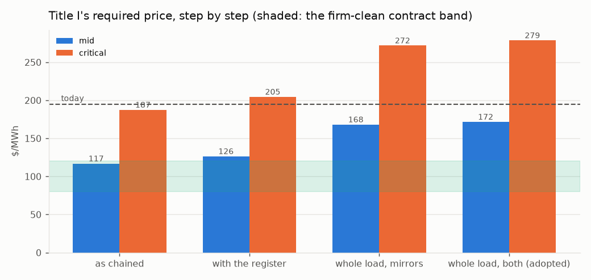

*Figure 9. Title I's required price step by step, both cases, against the contract band and today's generation charge.*

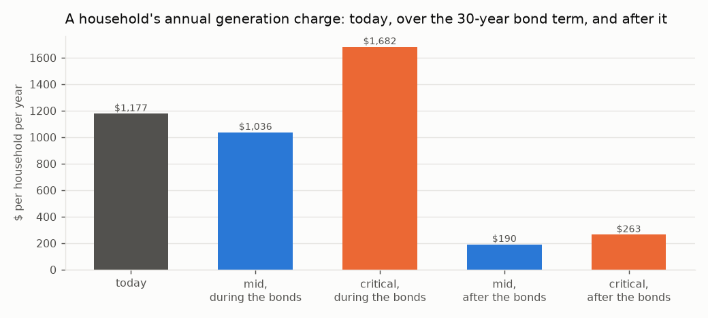

*Figure 10. A household's annual generation charge: today, during the bond term on the adopted route, and after the bonds retire.*

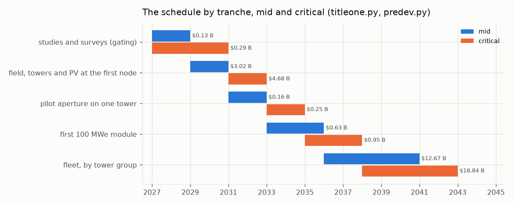

*Figure 11. The schedule by tranche at mid and critical; tranche zero is the studies and surveys.*

## 14. Title II: the water

**The module.** A 50,000 acre-foot-a-year seawater reverse-osmosis module on a retired coastal power-plant brownfield,
reusing its intake channel and permitted outfall, state-owned on Title I's form. The unit capital is the built record
escalated to the groundbreaking dollar: Carlsbad at $27,011 per AFY (mid) [81] and Huntington Beach as designed at
$36,534 (critical) [82].

| | mid | critical |
|---|---|---|
| overnight, $M | 1,391 | 1,881 |
| of which site studies and surveys per module (Section 12), $M | 4.3 | 17.8 |
| financed (contingency, EPC, interest during construction), $M | 1,889 | 2,910 |
| electricity, kWh/m³, bought from Title I at its plant price | 3.0 at $126/MWh | 3.6 at $205/MWh |

**The water**, at cost recovery: debt service, energy and operations, with no mineral revenue.

| | mid | critical |
|---|---|---|
| debt service / energy / non-energy O&M, $M/yr | 107 / 23 / 22 | 165 / 45 / 31 |
| **$ per acre-foot** | **3,044** | **4,830** |
| $ per m³ | 2.47 | 3.92 |
| of which energy | 15% | 19% |
| per household per year at 0.28 AF | 852 | 1,352 |

Carlsbad delivers at $2,700–2,900 an acre-foot [81] and a district pays about $1,300 wholesale today.
Desalinated water is firm water and is priced as such; capital dominates the price, not energy.

**The process decisions.**

- **Reverse osmosis, not thermal distillation.** A coastal brownfield has no heat source of the 500 MW_th a thermal
  module needs; against a condensing cycle on the same heat the water would cost 19.3 / 18.0 kWh/m³ of electricity
  forgone, 6.4× / 5.0× reverse osmosis. Reverse osmosis at 3.0–3.6 kWh/m³ is what is priced.
- **No zero-liquid-discharge and no mineral train.** Seawater holds 0.18 mg/L of lithium: one module's feed contains
  22.2 tonnes a year, three orders below any revenue that could carry a plant. Its magnesium as hydroxide would be
  382 kt a year, 0.76 of the US magnesium-compounds market (1.27 at critical) from one module. Crystallising
  the brine costs 20–30 kWh per m³ of brine. Neither mineral is a revenue and neither is in the price. Chloride
  chemistry is excluded from every system on hazard grounds, which rules out magnesium metal.
- **Brine through the outfall at Ocean Plan concentration** [80]. At 50% recovery the brine is 67 ppt, 33.5
  above ambient, against a limit of 2 ppt at the 100 m edge — a diffuser dilution of 17 : 1, which a retired plant's
  outfall must achieve without cooling water.
- **Intake.** A screened open intake through the retired plant's channel, 1 mm wedge-wire at <= 0.5 ft/s (the Ocean Plan's alternative to subsurface intake), slant wells where per-site hydrogeology permits. Slant wells are site-specific and were the failure at Huntington Beach [82]; entrainment is
  non-zero and mitigated under the Ocean Plan, not eliminated.
- **On-site power covers a tenth, not all.** A module draws 21–25 MW on average; the 80 / 50 acre site's PV makes
  2.8–1.5 MW, 13%–6% of it. Islanding is a battery for the intake, pretreatment and controls (3.2 MW), so the plant
  rides through an outage without fouling; full-load islanding is not claimed.
- **Energy at the contract price, full-time.** Title I's surplus is 5% of hours; a membrane plant runs steadily. The
  surplus is the water route's lift, an upside the water price does not count.
- **40 dBA at the boundary is bought, not assumed.** High-pressure pumps at 90–100 dBA at 1 m reach 40 dBA at
  316–1,000 m in the open; a full enclosure of 28–22 dB brings the boundary to 13–79 m, inside the brownfield, at
  $19–58 M a module, carried in the module's band.
- **Employment.** At Carlsbad's staffing per plant [91], the adopted route's modules employ 601–664 permanently.

**The schedule.** Carlsbad was proposed in 1998, permitted in 2006 and delivered water in 2015, 17 years [81];
Huntington Beach ran from 1998 to a 2022 denial [82]. Stated honestly, permitting of 5 years (mid) to 8 (critical,
assumed from the record) and a 3-year build put first water at **2034–2037** from a 2026 start. Each year of delay
escalates a module by $57–87 M.

**Title II's side of the adopted route:**

| | mid | critical |
|---|---|---|
| modules at 500 m of head (built as whole modules: 15 / 17) | 15.0 | 16.6 |
| water, million acre-feet a year | 0.75 | 0.83 |
| modules' capital, financed, $B | 28.4 | 48.3 |
| lift on the water's bill, kWh/m³ | 1.51 | 1.60 |
| water with the lift on its bill, $/acre-foot | 3,280 | 5,234 |
| per household per year | 918 | 1,466 |

## 15. Title III: the joinder

**The relation.** One Authority, two projects, two revenue accounts. Title I sells electricity at cost recovery to
in-state load-serving entities and to Title II; Title II sells water at cost recovery to districts. Neither
subsidises the other: each carries its own capital, its own debt service and its own price, and the joinder is two
contracts and one asset. Four standing decisions govern it: one program, two projects, severable; nitrate salt is
retained only as the fallback and chloride chemistry is excluded everywhere; Noor III-class heliostats; no
zero-liquid-discharge, brine returned through the existing outfall.

**The power-supply agreement.** Title II buys its electricity from Title I at Title I's required price, mid or critical, for the bond term of 30 years:

| | mid | critical |
|---|---|---|
| contract price, $/MWh (Title I with its register) | 126 | 205 |
| volume per module, GWh/yr | 185 | 222 |
| energy's share of the water's cost | 15% | 19% |

**The one shared asset.** Title I's summer surplus lifts Title II's product water to an elevated reservoir, and the
year-round delivery returns through pump-turbines to Title I's evenings. The reservoir and the pump-turbines are
Title I's, because they close its load; the modules are Title II's, because they make its water; the lift energy is
the surplus, priced at nothing because it was worth nothing.

**The decision table.** The three routes of Section 8, side by side:

| | mirrors, mid | mirrors, critical | water alone, mid | water alone, critical | **both, mid** | **both, critical** |
|---|---|---|---|---|---|---|
| Title I additional capital, $B | 5.7 | 9.5 | no feasible point | no feasible point | **6.4** | **10.3** |
| Title I price, $/MWh | 168 | 272 | — | — | **172** | **279** |
| Title II modules / capital, $B | 0 / 0 | 0 / 0 | — | — | 15 / 28 | 17 / 48 |
| water, million acre-feet a year | 0 | 0 | — | — | 0.75 | 0.83 |
| left to the grid | 0.8% | 1.0% | — | — | 0.6% | 0.7% |

**The takers.** The adopted route delivers 0.75–0.83 million acre-feet a year, year-round: summer irrigation on the Westside
and winter recharge, where the San Joaquin Valley's groundwater overdraft is about 1.8–2.5 million acre-feet a year
[83]. That is the match of supply to demand the joinder rests on, and it is a contract question: irrigation and
recharge districts under contract for firm water at three to five thousand dollars an acre-foot, which is what firm
water costs.

**The single financial statement:**

| | mid | critical |
|---|---|---|
| Title I capital with its register, $B | 32.7 | 55.4 |
| Title I closing the load, mirrors / both, $B | 5.7 / 6.4 | 9.5 / 10.3 |
| Title II modules at the adopted route, $B | 28 | 48 |
| **program at the adopted route (both), $B** | **67** | **114** |
| Title I debt service, $M/yr | 1,855 | 3,148 |
| Title I debt-service reserve, $M | 1,855 | 3,148 |
| contingency carried | 15% | 30% |
| Title I price at 1.25× coverage, $/MWh | 152 | 248 |

**Severability.**

- **Title I without Title II** stands: the field and store grow to the mirrors route's sizing, the load closes at that
  price, and no water is made.
- **Title II without Title I** stands: a module buys its electricity from the grid instead of the Authority, at the
  grid's price rather than the contract's, and makes the same water; the reservoir and pump-turbines are not built,
  and the water is delivered by the aqueduct.
- **What does not sever** is the water route itself: it exists only as the pair, because its lift is Title I's surplus
  and its evening is Title I's shortfall. It is the joinder, and it is optional.

## 16. The sites

None of the site terms can be computed without a site, and this document does not pretend to. The three Title I
nodes and the retired or retiring coastal plants a Title II module could stand on are each graded on the terms the
Title needs of a site, from what is on the public record — MET, CONDITIONAL (clears on an assumption the site study
confirms), OPEN (not knowable here), FAIL — and ranked: MET 1, CONDITIONAL 0.5, OPEN 0, FAIL -1. Every site value
is assumed from the public record unless computed here, and the note beside each grade says which. **The rank
orders the site studies; it does not choose a site.**

### 16.1. Title I: the three nodes

The terms a node must meet:

| term | requirement | what settles it |
|---|---|---|
| DNI | annual DNI at or above 2500 kWh/m2/yr, else the field grows | one year of on-site DNI (NSRDB then a pyrheliometer) |
| land | a contiguous disturbed parcel covering the node's field | title search and a fallowing agreement |
| nexus | no federal land or federal action, else NEPA on the node | BLM / USACE jurisdiction determination |
| seismic | design PGA over mapped MCE by 1.5x or the tower is re-based | ASCE 7 site-specific hazard study |
| grid | a 500 kV substation within one gen-tie of the node | CAISO interconnection study |
| head | an off-stream reservoir site with 500 m of head within reach | reservoir siting and geotechnical study |

#### Mojave (Kramer Junction)

35.01° N, 117.56° W. Annual direct-normal irradiance **2,799 kWh/m²/yr** (SOURCED: NREL TMY3 Daggett 7.67 kWh/m2/day [77]; band 2,700–2,900). One third
of the fleet: 6.0 / 10.3 million m² of mirror at design and 7.6 / 12.9 on the adopted route, 6 / 10 towers,
965 / 1,034 MW_AC of PV; land 15,120 / 22,113 acres on the adopted route; mirror washing 291 / 495 acre-feet a
year from the program's own water; one 500 kV circuit at 1,197 / 1,197 MW peak injection. Seismic: the 0.75 g design target over a
mapped MCE_R PGA of 0.45 / 0.50 g [84, 85] is 1.67× / 1.50× (a site study must confirm 1.5×).

| term | mid | critical | note |
|---|---|---|---|
| DNI | MET | MET | 2799 kWh/m2/yr (SOURCED) |
| land | CONDITIONAL | CONDITIONAL | private and BLM checkerboard; SEGS and Solar Star precedent |
| nexus | CONDITIONAL | CONDITIONAL | BLM parcels in the corridor; DRECP development focus area |
| seismic | MET | MET | 0.75 g over mapped 0.45 g = 1.67x / 0.75 g over mapped 0.50 g = 1.50x |
| grid | MET | MET | Kramer substation on the Kramer-Lugo 230/500 kV corridor |
| head | MET | MET | Tehachapi crest to the west (Edmonston lift 587 m) |

Score 5.0 (mid) / 5.0 (critical). *First study:* land — title search and a fallowing agreement.

#### Imperial (Desert Center)

33.71° N, 115.40° W. Annual direct-normal irradiance **2,740 kWh/m²/yr** (ASSUMED: NSRDB map class 7.3-7.8 kWh/m2/day, mid 7.5 [77]; band 2,660–2,850). One third
of the fleet: 6.0 / 10.3 million m² of mirror at design and 7.6 / 12.9 on the adopted route, 6 / 10 towers,
965 / 1,034 MW_AC of PV; land 15,120 / 22,113 acres on the adopted route; mirror washing 291 / 495 acre-feet a
year from the program's own water; one 500 kV circuit at 1,197 / 1,197 MW peak injection. Seismic: the 0.75 g design target over a
mapped MCE_R PGA of 0.35 / 0.45 g [84, 85] is 2.14× / 1.67× (a site study must confirm 1.5×).

| term | mid | critical | note |
|---|---|---|---|
| DNI | MET | MET | 2740 kWh/m2/yr (ASSUMED) |
| land | CONDITIONAL | CONDITIONAL | Desert Sunlight / Desert Harvest on BLM; private parcels along I-10 |
| nexus | CONDITIONAL | CONDITIONAL | largely BLM; DRECP DFA |
| seismic | MET | MET | 0.75 g over mapped 0.35 g = 2.14x / 0.75 g over mapped 0.45 g = 1.67x |
| grid | MET | MET | Red Bluff 500 kV substation (built for Desert Sunlight) |
| head | CONDITIONAL | CONDITIONAL | Eagle Mountain pumped-storage site (licensed, unbuilt) nearby; head on a private pit |

Score 4.5 (mid) / 4.5 (critical). *First study:* land — title search and a fallowing agreement.

#### Central Valley (Westside)

36.01° N, 119.96° W. Annual direct-normal irradiance **2,190 kWh/m²/yr** (SOURCED band: Westlands 5.5-6.5 kWh/m2/day, mid 6.0 [77]; band 2,010–2,370). One third
of the fleet: 6.0 / 10.3 million m² of mirror at design and 7.6 / 12.9 on the adopted route, 6 / 10 towers,
965 / 1,034 MW_AC of PV; land 15,120 / 22,113 acres on the adopted route; mirror washing 291 / 495 acre-feet a
year from the program's own water; one 500 kV circuit at 1,197 / 1,197 MW peak injection. Seismic: the 0.75 g design target over a
mapped MCE_R PGA of 0.40 / 0.55 g [84, 85] is 1.88× / 1.36× (a site study must confirm 1.5×).

| term | mid | critical | note |
|---|---|---|---|
| DNI | CONDITIONAL | CONDITIONAL | 2190 kWh/m2/yr (SOURCED band) |
| land | MET | MET | Westlands drainage-impaired fallowed land, 100,000 acres, private |
| nexus | MET | MET | no federal land; state and county permits |
| seismic | MET | CONDITIONAL | 0.75 g over mapped 0.40 g = 1.88x / 0.75 g over mapped 0.55 g = 1.36x |
| grid | MET | MET | Gates 500 kV substation on the Path 15 corridor |
| head | CONDITIONAL | CONDITIONAL | Coast Range foothills west of I-5; San Luis / Gianelli precedent at ~100 m, 500 m needs a higher bench |

Score 5.0 (mid) / 4.5 (critical). *First study:* DNI — one year of on-site DNI (NSRDB then a pyrheliometer).

**Ranking.** Mid: Central Valley 5.0, Mojave 5.0, Imperial 4.5. Critical: Mojave 5.0, Central Valley 4.5, Imperial 4.5.
At mid the Westside ties the Mojave for first: it meets land, nexus and grid outright and is conditional on
irradiance and head, so the node the record doubts for its sun has the fewest open terms. At critical the Mojave
leads alone, because the Westside's seismic margin falls under the 1.5× a site study must confirm. The Central Valley
node's land is the reason it is kept: 100,000 / 60,000 acres of fallowed, drainage-impaired Westside farmland cover a node
6.6× / 2.7× over. Land across the program on the adopted route is 45,361 / 66,339 acres (184 / 268 km²). A
federal environmental review on the Mojave node's federal nexus is budgeted as 2 / 4 years of escalation on that node,
$654 / 2,218 M.

### 16.2. Title II: the coastal brownfields

The terms a coastal site must meet:

| term | requirement | what settles it |
|---|---|---|
| outfall | a permitted ocean outfall the brine can use at Ocean Plan dilution | outfall diffuser hydraulic study |
| intake | an intake channel a screened open intake can reuse | entrainment study under the Ocean Plan |
| acreage | 50-80 acres of brownfield for a module and its enclosure | site survey and remediation scope |
| takers | an overdrafted basin or an aqueduct within reach for the winter delivery | recharge district contract |
| head | an elevated reservoir site with 500 m of head within reach | reservoir siting study |
| permit | a Coastal Commission record that does not foreclose the site | Coastal Development Permit pre-application |
| hazard | outside the tsunami inundation zone or hardened; seismic basis stated | ASCE 7 and CGS tsunami mapping |

#### Mandalay (Oxnard)

| term | grade | note |
|---|---|---|
| outfall | MET | retired 2018; outfall via the Edison canal |
| intake | MET | canal intake |
| acreage | MET | retired footprint |
| takers | MET | Oxnard Plain / Fox Canyon |
| head | MET | as Ormond Beach |
| permit | CONDITIONAL | as Ormond Beach |
| hazard | CONDITIONAL | dune-backed; inundation zone |

Score 6.0. *First study:* permit — Coastal Development Permit pre-application.

#### Ormond Beach (Oxnard)

| term | grade | note |
|---|---|---|
| outfall | MET | OTC outfall, plant retiring |
| intake | MET | beach intake |
| acreage | MET | retiring OTC plant footprint |
| takers | MET | Oxnard Plain and Fox Canyon, overdrafted, seawater intrusion |
| head | MET | Santa Monica Mountains and Topatopa foothills |
| permit | CONDITIONAL | wetland restoration adjacent; environmental-justice record |
| hazard | CONDITIONAL | inundation zone; liquefaction |

Score 6.0. *First study:* permit — Coastal Development Permit pre-application.

#### Morro Bay

| term | grade | note |
|---|---|---|
| outfall | MET | retired plant outfall into Estero Bay |
| intake | MET | harbour intake |
| acreage | MET | retired 2014; battery project on part |
| takers | CONDITIONAL | no large overdrafted basin; Coastal Branch aqueduct connection |
| head | MET | Santa Lucia range immediately inland |
| permit | CONDITIONAL | sanctuary-adjacent; local opposition record |
| hazard | CONDITIONAL | inundation zone at the harbour |

Score 5.5. *First study:* takers — recharge district contract.

#### Moss Landing (Monterey)

| term | grade | note |
|---|---|---|
| outfall | MET | OTC outfall of the retired units into Monterey Bay |
| intake | MET | harbour intake channel |
| acreage | MET | large retired footprint; Vistra battery on part |
| takers | MET | Salinas Valley 180/400-ft aquifer, critically overdrafted under SGMA |
| head | CONDITIONAL | Gabilan / Santa Lucia ranges within 30 km; bench at 500 m unsurveyed |
| permit | CONDITIONAL | inside the Monterey Bay National Marine Sanctuary; the Cal Am / MPWSP record is a caution |
| hazard | CONDITIONAL | low-lying harbour, inundation zone; 1989 Loma Prieta record |

Score 5.5. *First study:* head — reservoir siting study.

#### Alamitos / Long Beach

| term | grade | note |
|---|---|---|
| outfall | MET | OTC outfall into San Pedro Bay |
| intake | MET | channel intake |
| acreage | CONDITIONAL | repowered with gas units in 2020; footprint shared |
| takers | MET | Central and West Coast basins (WRD recharge) |
| head | CONDITIONAL | San Gabriel foothills 40 km |
| permit | CONDITIONAL | industrial harbour; port air district |
| hazard | CONDITIONAL | inundation zone; Newport-Inglewood fault |

Score 5.0. *First study:* acreage — site survey and remediation scope.

#### Scattergood / El Segundo

| term | grade | note |
|---|---|---|
| outfall | MET | OTC outfalls into Santa Monica Bay |
| intake | MET | ocean intakes |
| acreage | CONDITIONAL | LADWP repowering on site; El Segundo repowered |
| takers | MET | West Coast basin; West Basin's existing recycled-water plant next door |
| head | CONDITIONAL | Santa Monica Mountains 20 km |
| permit | CONDITIONAL | West Basin's own ocean desalination EIR was withdrawn in 2022 |
| hazard | CONDITIONAL | dune-backed; inundation zone |

Score 5.0. *First study:* acreage — site survey and remediation scope.

#### South Bay (Chula Vista)

| term | grade | note |
|---|---|---|
| outfall | CONDITIONAL | plant demolished 2013; outfall into south San Diego Bay, a refuge |
| intake | CONDITIONAL | bay intake, not ocean |
| acreage | MET | cleared bayfront parcel |
| takers | MET | San Diego County Water Authority system |
| head | MET | Otay and Jamul mountains; San Vicente pumped-storage precedent |
| permit | CONDITIONAL | bayfront master plan; refuge adjacency |
| hazard | CONDITIONAL | bay margin; Rose Canyon fault |

Score 5.0. *First study:* outfall — outfall diffuser hydraulic study.

#### Huntington Beach (AES)

| term | grade | note |
|---|---|---|
| outfall | MET | OTC outfall, the Poseidon site |
| intake | MET | the Poseidon intake |
| acreage | MET | the Poseidon footprint |
| takers | MET | Orange County basin (OCWD recharge) |
| head | CONDITIONAL | Santa Ana Mountains 40 km inland |
| permit | FAIL | Coastal Commission denied a desalination plant on this site in 2022 |
| hazard | CONDITIONAL | inundation zone; Newport-Inglewood fault |

Score 4.0. *First study:* permit — Coastal Development Permit pre-application.

**Excluded: Encina (Carlsbad).** already hosts the 56,000 AFY Carlsbad plant; the record the water pricing prices from, not a site.

**Ranking.** Mandalay 6.0, Ormond Beach 6.0, Morro Bay 5.5, Moss Landing 5.5, Alamitos / Long Beach 5.0, Scattergood / El Segundo 5.0, South Bay 5.0, Huntington Beach 4.0. The Oxnard plain
(Ormond Beach, Mandalay) and Moss Landing meet the taker and head terms the water route needs; Huntington Beach
carries its 2022 denial as a FAIL and is not a first site; no coastal site is MET on every term, so a site study is
always owed. The adopted route needs 15–17 modules and this list holds 8 sites: 3–5 modules a site, or sites this
list does not name. That is a finding, not a plan.

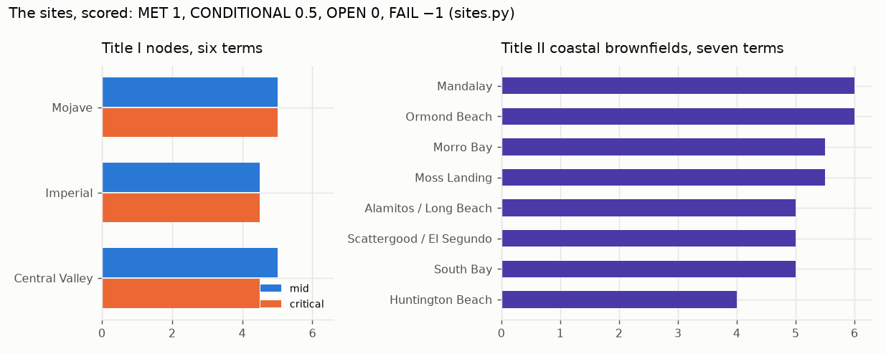

*Figure 12. The sites scored: the three Title I nodes on six terms at both cases, and the eight coastal brownfields on seven terms.*

## 17. Environment, employment, land and procurement

**CO₂ avoided.** From the hour-by-hour at a CAISO marginal factor of 0.40 / 0.35 t/MWh (the critical case credits
less, because a cleaner grid displaces less):

| | mid | critical |
|---|---|---|
| served as sized, TWh | 15.83 | 15.74 |
| avoided as sized, million t/yr | 6.33 | 5.51 |
| avoided with the load closed, million t/yr | 7.24 | 6.34 |

**Employment.** From built plants per MW [91] — Crescent Dunes and Ivanpah for the permanent staff, Ivanpah's peak for
construction — at the adopted route's block of 3,930 MWe and its 15 / 17 water modules:

| | mid | critical |
|---|---|---|
| permanent, Title I | 1,901 | 1,214 |
| construction peak, Title I | 21,054 | 21,054 |
| permanent, Title II's modules | 601 | 664 |

**Resource adequacy.** No firm export exists, so no export capacity is sold; the in-state resource adequacy is the
block's net capacity on the adopted route, 3,616 / 3,537 MW, self-supplied by the Authority as load-serving entity.

**Water for the mirrors.** At Ivanpah's dry-cooled record (100 acre-feet a year on 2.6 million m²) the program's field on
the adopted route needs 872 / 1,486 acre-feet a year, from Title II desalinated water.

**Seismic.** The basis is ASCE 7 [84], site class and mapped MCE_R. The 0.75 g target clears the mapped PGA at every node
(Section 16.1); the mapped values are taken from the hazard record and the site study fixes them.

**Nitrate.** No nitrate salt anywhere in Helios-3: the medium is sintered bauxite, with no freezing point, no
decomposition ceiling, no oxidiser and no toxic medium (R-13 to R-15). The nitrate hazard applies only to the
salt-block fallback, whose failure mode — the hot-salt tank leak that took Crescent Dunes and Noor III each offline
for more than a year — is on the record in Section 10.1.

**Procurement.** One EPC contractor per node under an owner's engineer across the program; the pilot aperture and the
first module let as separate contracts. No contractor has delivered more than one commercial tower at a time in the
United States, and the ladder buys the hours before the fleet.

**The Authority.** A statutory public entity created by the Act on the pattern of the California Consumer Power and
Conservation Financing Authority of 2001 [86], whose defunding by 2004 the Act acknowledges, registered as the
load-serving entity of Section 13 in the community-choice form. Emergency powers under the Government Code are cited
only for what they do, which is to suspend regulatory statutes in a declared emergency; they issue no coastal permit
and shorten no federal review.

**Dry cooling.** Zero water for heat rejection; supercritical CO₂ needs about a sixth of steam's cooling airflow
(R-16), at a compressor-inlet penalty at 45 °C that the critical cycle band carries.

## 18. What is not settled

- **No plant of this kind has run.** The largest falling-particle receiver is 2 MW_th; the 715 °C recompression cycle
  has not run. The pilot aperture (Section 11) and the ladder (Section 10) buy the hours before the fleet, and the
  salt block on the same field is the recorded fallback at a price this document prints.
- **The plant must deliver its modelled output.** Every dollar of the bill is per MWh; a plant at Crescent Dunes'
  0.39 of design does not pay its bonds from the bill. The critical column is the defence, and the mid column is margin.
- **The load and irradiance shapes are reconstructed**, pinned to sourced levels; measured hourly series replace them
  as they become available, and the evening block factor may move either way.
- **The coastal permits are the longest studies on the path** and set the critical schedule; a statutory
  consolidation shortens litigation, not the Coastal Commission.
- **The head is the site question that sizes Title II**; the reservoir's days of holding move Title I by under a billion.
- **The takers** are a contract question: irrigation and recharge districts under contract for firm water, year-round.
- **The split of the shortfall** between the two routes is adopted even and is movable on the ladder of Section 8.
- **At the critical case a household pays more than today for one bond term**, and this document says so on every page.
- **The HOURS rows of the register** — receiver, exchanger, turbine, chemistry, scale, provenance — retire only by
  operating time; a specification cannot make a machine have run.
- **The brine as a carbonate sink** for the power block's maintenance vents is noted and not priced.

## 19. How the figures were produced

Every figure in this document is the output of a calculation that can be re-run, never a figure typed into prose.
The plant is run hour by hour over a year at each node on exact solar geometry; the energy chain, the capital by
line, the risk register, the closing routes, the water, the sites and the schedule are each computed from published
constants whose status is marked, and each result is printed at the mid and the critical case. A document's figures
are drawn from the same computed values as its tables. Where a constant is assumed, the band is stated and the
adverse end of the band is what the critical case carries; where a measured series is not available, the
reconstruction is marked and the path to replacing it is named. The pass mark of the pilot, the O&M ratio of the
closing plant, the reservoir head and its days of holding, the study costs and durations, and the hydro O&M share
are the assumptions that most move the result, and each is marked where it is used.

## Bibliography

1. Torresol Energy
2. Burgaleta et al., SolarPACES 2011
3. In re Tonopah Solar Energy, LLC, No. 26-10060 (Bankr. D. Del., filed 2026-01-21), first-day declaration and sale order
4. EIA Form 923, plant 57275
5. DOE Loan Programs Office
6. SolarPACES 'What happened with Crescent Dunes'
7. ACWA Power Tadawul statement 2024-03
8. pv magazine 2024-03-25
9. Hespress 2025 (reviewed 2026)
10. Cerro Dominador
11. SolarPACES project database
12. DEWA
13. ACWA Power
14. CSPPLAZA
15. NREL HelioCon (2022-)
16. NRG/BrightSource
17. CEC docket 07-AFC-5
18. Ho et al., AIP Conf. Proc. 1734 (2016)
19. J. Sol. Energy Eng. 141 (2019)
20. OSTI 1364838, 1431441 (reviewed 2026)
21. Sandia LabNews 2024-08-22
22. Ho & Schroeder, AIP Conf. Proc. 2445 (2022) (reviewed 2026)
23. Sandia LabNews 2025-02-06
24. OSTI 2999325 (cold commissioning)
25. DOE Gen3 Phase 3 (reviewed 2026)
26. DLR Institute of Solar Research
27. Ebert et al., ASME ES2018
28. SolarPACES/HelioHeat (reviewed 2026)
29. CSIRO 2023-10
30. SolarPACES (FPR Energy) (reviewed 2026)
31. KSU / Sandia collaboration
32. Sandia Gen3 Roadmap / TEA (Ho et al. 2019-2021)
33. Buck et al., J. Solar Energy Eng. 2002
34. SOLGATE final report 2005
35. Ho / Yellowhair, Sandia SAND (Gen3 windowed receiver)
36. Siegel et al., J. Sol. Energy Eng. 137 (2015)
37. Ho et al., OSTI 1431441
38. Sandia 2016 review (reviewed 2026)
39. CARBO Ceramics product data
40. Sandia G3P3
41. Sandia Gen3 storage design reports
42. Siemens Gamesa ETES pilot (2019-2022)
43. steel and cement industry practice
44. bulk-solids handling practice
45. Albrecht & Ho, Sandia (AIP Conf. Proc. 2020; Sandia 2022 performance evaluation)
46. Sandia LabNews 2021-06 (reviewed 2026)
47. Ma et al., NREL (2014-2020)
48. GTI Energy STEP Demo Phase 1 milestone
49. POWER magazine
50. ASME GT2025 simple-cycle testing paper (reviewed 2026)
51. Sandia SAND2012-9546 (Wright et al.)
52. Echogen Power Systems
53. SASAC 2021-12-23
54. Energy (2023) startup study (reviewed 2026)
55. EU H2020 SCARABEUS (2019-2023)
56. DOE SunShot sCO2 (2012-2018)
57. NETL
58. ASME BPVC Code Case 2702 (2011)
59. DOE/OCDO A-USC (2001-2021)
60. EPRI
61. ASME BPVC Code Cases Supplement 2 (2021)
62. ORNL Pub140621 (reviewed 2026)
63. ASME BPVC III-5 (2019 edition, Alloy 617)
64. ORNL, NETL, Sandia coupon programmes
65. SolarPACES (Midelt PV-to-storage)
66. REN21 GSR 2025
67. NS Energy (reviewed 2026)
68. CEC / EIA installed capacity data
69. Siemens Gamesa ETES
70. Kraftblock
71. Malta (design)
72. plant records
73. Sandia / NREL sCO2 CSP studies
74. DEWA / ACWA Power
75. U.S. Energy Information Administration. Electric Sales, Revenue, and Average Price, 2024 data: California residential consumption per customer and residential customer count.
76. National Renewable Energy Laboratory. Annual Technology Baseline 2024: concentrating solar power, tower with 10 h storage, solar multiple 2.4 (the capital calibration anchor).
77. National Renewable Energy Laboratory. National Solar Radiation Database and TMY3 station data (Daggett), and the NSRDB direct-normal irradiance classes for the Imperial and Westside nodes.
78. California Independent System Operator, Department of Market Monitoring. 2024 Annual Report on Market Issues and Performance: average prices, evening-peak prices and negative-price hours.
79. Turchi, C. S., et al. CSP Systems Analysis: Final Project Report, NREL/TP-5500-72716 (2019), and the System Advisor Model cost defaults from which the capital split is reconstructed.
80. California State Water Resources Control Board. Water Quality Control Plan for Ocean Waters of California, 2015 desalination amendment: brine salinity at the mixing-zone edge and intake requirements.
81. San Diego County Water Authority and Poseidon Water. Claude 'Bud' Lewis Carlsbad Desalination Plant: capital, delivered water price and permitting chronology (1998–2015).
82. California Coastal Commission. Decision on the Poseidon Huntington Beach desalination project, May 2022, and the project's 2020 capital estimate.
83. Public Policy Institute of California. Water and the Future of the San Joaquin Valley: groundwater overdraft under the Sustainable Groundwater Management Act.
84. American Society of Civil Engineers. ASCE 7-22, Minimum Design Loads and Associated Criteria for Buildings and Other Structures: mapped risk-targeted maximum considered earthquake ground motion.
85. California Geological Survey. Seismic hazard and tsunami inundation maps for the coastal and desert sites named.
86. California Senate Bill 6X (2001), establishing the California Consumer Power and Conservation Financing Authority; Public Utilities Code section 366.2 (community choice aggregation); Government Code section 8571 (emergency suspension of regulatory statutes).
87. California Public Resources Code section 25524.2: the moratorium on new nuclear fission plants.
88. National Renewable Energy Laboratory, Annual Technology Baseline 2024 (geothermal); Fervo Energy, Cape Station development record; Southern California Edison and Google geothermal power purchase agreements.
89. Tennessee Valley Authority, Clinch River small modular reactor cost estimates; Ontario Power Generation, Darlington New Nuclear Project cost disclosure.
90. U.S. Department of Energy Loan Programs Office, Crescent Dunes project record; SolarPACES, 'What happened with Crescent Dunes' (2020).
91. Operating staff and construction peak of Ivanpah and Crescent Dunes, from the plants' public records; Carlsbad plant staffing.
92. California Department of Water Resources. Sites Reservoir cost and capacity; the Edmonston Pumping Plant lift and the San Luis (Gianelli) pumped-storage head.

